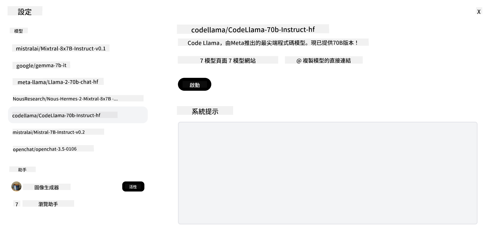
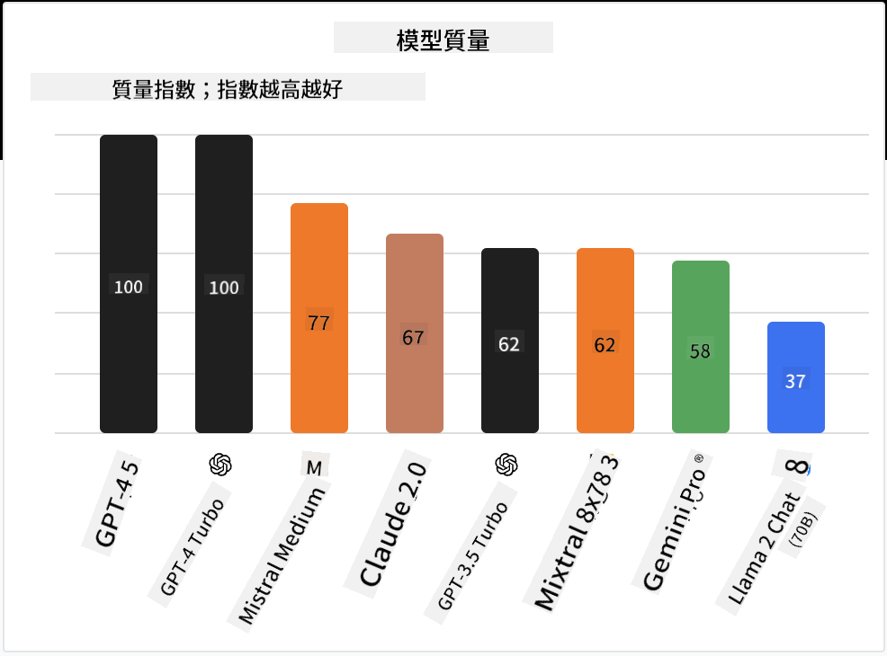

<!--
CO_OP_TRANSLATOR_METADATA:
{
  "original_hash": "a8b2d4bb727c877ebf9edff8623d16b9",
  "translation_date": "2025-09-06T10:12:42+00:00",
  "source_file": "16-open-source-models/README.md",
  "language_code": "hk"
}
-->

## 簡介

開源大型語言模型（LLMs）的世界充滿活力且不斷演變。本課程旨在深入探討開源模型。如果您想了解專有模型與開源模型的比較，請參閱["探索和比較不同LLMs"課程](../02-exploring-and-comparing-different-llms/README.md?WT.mc_id=academic-105485-koreyst)。此外，本課程也會涵蓋微調的主題，但更詳細的解釋可以在["微調LLMs"課程](../18-fine-tuning/README.md?WT.mc_id=academic-105485-koreyst)中找到。

## 學習目標

- 了解開源模型
- 理解使用開源模型的好處
- 探索 Hugging Face 和 Azure AI Studio 上的開源模型

## 什麼是開源模型？

開源軟件在技術的發展中扮演了至關重要的角色，涵蓋了各個領域。開源倡議（OSI）定義了[10項軟件標準](https://web.archive.org/web/20241126001143/https://opensource.org/osd?WT.mc_id=academic-105485-koreyst)，以確保軟件符合開源的資格。源代碼必須在OSI批准的許可下公開共享。

雖然LLMs的開發與軟件開發有相似之處，但過程並不完全相同。這引發了社群對於LLMs開源定義的廣泛討論。要符合傳統開源定義，以下信息應公開提供：

- 用於訓練模型的數據集。
- 完整的模型權重。
- 評估代碼。
- 微調代碼。
- 完整的模型權重和訓練指標。

目前只有少數模型符合這些標準。[由艾倫人工智能研究所（AllenAI）創建的OLMo模型](https://huggingface.co/allenai/OLMo-7B?WT.mc_id=academic-105485-koreyst)就是其中之一。

在本課程中，我們將使用“開源模型”這個術語，因為截至撰寫本文時，這些模型可能尚未完全符合上述標準。

## 開源模型的好處

**高度可定制** - 由於開源模型提供了詳細的訓練信息，研究人員和開發者可以修改模型的內部結構。這使得能夠創建針對特定任務或研究領域的高度專業化模型。例如，代碼生成、數學運算和生物學等。

**成本** - 使用和部署這些模型的每個token成本低於專有模型。在構建生成式AI應用時，應根據您的使用案例考慮性能與價格的平衡。

  
來源：Artificial Analysis

**靈活性** - 使用開源模型可以靈活地選擇不同的模型或將它們結合使用。例如，[HuggingChat Assistants](https://huggingface.co/chat?WT.mc_id=academic-105485-koreyst)允許用戶直接在界面中選擇使用的模型：

## 探索不同的開源模型

### Llama 2

[LLama2](https://huggingface.co/meta-llama?WT.mc_id=academic-105485-koreyst)由Meta開發，是一個針對聊天應用優化的開源模型。這是因為其微調方法包含了大量的對話和人類反饋。通過這種方法，模型生成的結果更符合人類期望，提供了更好的用戶體驗。

一些微調版本的Llama包括[Japanese Llama](https://huggingface.co/elyza/ELYZA-japanese-Llama-2-7b?WT.mc_id=academic-105485-koreyst)，專注於日語，以及[Llama Pro](https://huggingface.co/TencentARC/LLaMA-Pro-8B?WT.mc_id=academic-105485-koreyst)，這是一個增強版的基礎模型。

### Mistral

[Mistral](https://huggingface.co/mistralai?WT.mc_id=academic-105485-koreyst)是一個專注於高性能和效率的開源模型。它使用了專家混合（Mixture-of-Experts）方法，將一組專業模型結合成一個系統，根據輸入選擇特定模型使用。這使得計算更有效率，因為模型只處理它們擅長的輸入。

一些微調版本的Mistral包括[BioMistral](https://huggingface.co/BioMistral/BioMistral-7B?text=Mon+nom+est+Thomas+et+mon+principal?WT.mc_id=academic-105485-koreyst)，專注於醫學領域，以及[OpenMath Mistral](https://huggingface.co/nvidia/OpenMath-Mistral-7B-v0.1-hf?WT.mc_id=academic-105485-koreyst)，進行數學運算。

### Falcon

[Falcon](https://huggingface.co/tiiuae?WT.mc_id=academic-105485-koreyst)是由技術創新研究所（**TII**）創建的LLM。Falcon-40B基於40億參數進行訓練，已被證明在計算資源較少的情況下表現優於GPT-3。這得益於其使用的FlashAttention算法和多查詢注意力機制，能夠在推理時減少內存需求。由於推理時間減少，Falcon-40B非常適合聊天應用。

一些微調版本的Falcon包括[OpenAssistant](https://huggingface.co/OpenAssistant/falcon-40b-sft-top1-560?WT.mc_id=academic-105485-koreyst)，基於開源模型構建的助手，以及[GPT4ALL](https://huggingface.co/nomic-ai/gpt4all-falcon?WT.mc_id=academic-105485-koreyst)，其性能高於基礎模型。

## 如何選擇

選擇開源模型並沒有唯一的答案。一個好的起點是使用Azure AI Studio的任務篩選功能，幫助您了解模型訓練的任務類型。Hugging Face也維護了一個LLM排行榜，根據特定指標顯示表現最佳的模型。

如果需要比較不同類型的LLMs，[Artificial Analysis](https://artificialanalysis.ai/?WT.mc_id=academic-105485-koreyst)是另一個很好的資源：

  
來源：Artificial Analysis

如果您正在處理特定的使用案例，尋找專注於相同領域的微調版本可能會更有效。嘗試多個開源模型以了解它們是否符合您和用戶的期望也是一個良好的做法。

## 下一步

開源模型的最佳部分是您可以快速開始使用它們。查看[Azure AI Foundry模型目錄](https://ai.azure.com?WT.mc_id=academic-105485-koreyst)，其中包含我們在此討論的Hugging Face集合。

## 學習不止於此，繼續探索

完成本課程後，請查看我們的[生成式AI學習集合](https://aka.ms/genai-collection?WT.mc_id=academic-105485-koreyst)，繼續提升您的生成式AI知識！

---

**免責聲明**：  
本文件已使用人工智能翻譯服務 [Co-op Translator](https://github.com/Azure/co-op-translator) 進行翻譯。儘管我們致力於提供準確的翻譯，但請注意，自動翻譯可能包含錯誤或不準確之處。原始語言的文件應被視為權威來源。對於重要信息，建議使用專業人工翻譯。我們對因使用此翻譯而引起的任何誤解或錯誤解釋概不負責。