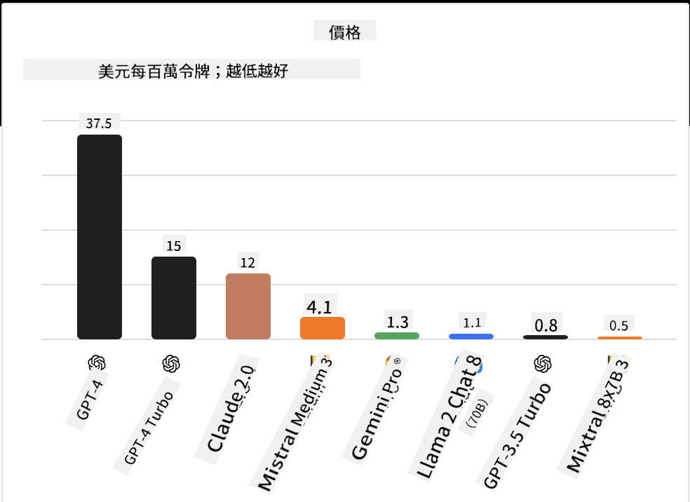

<!--
CO_OP_TRANSLATOR_METADATA:
{
  "original_hash": "0bba96e53ab841d99db731892a51fab8",
  "translation_date": "2025-05-20T06:48:59+00:00",
  "source_file": "16-open-source-models/README.md",
  "language_code": "hk"
}
-->

## 介紹

開源大型語言模型的世界充滿活力且不斷演變。本課旨在深入探討開源模型。如果您想了解專有模型與開源模型的比較，請參閱["探索和比較不同LLMs"課程](../02-exploring-and-comparing-different-llms/README.md?WT.mc_id=academic-105485-koreyst)。本課還將涉及微調的主題，但更詳細的解釋可以在["微調LLMs"課程](../18-fine-tuning/README.md?WT.mc_id=academic-105485-koreyst)中找到。

## 學習目標

- 了解開源模型
- 理解使用開源模型的好處
- 探索在Hugging Face和Azure AI Studio上可用的開源模型

## 什麼是開源模型？

開源軟件在各個領域的技術發展中發揮了重要作用。開源倡議（OSI）定義了[軟件的10個標準](https://web.archive.org/web/20241126001143/https://opensource.org/osd?WT.mc_id=academic-105485-koreyst)以被歸類為開源。源代碼必須在OSI批准的許可下公開分享。

雖然LLMs的開發與軟件開發有類似之處，但過程並不完全相同。這引起了社區對LLMs背景下開源定義的廣泛討論。要使模型符合傳統的開源定義，以下信息應公開：

- 用於訓練模型的數據集。
- 作為訓練一部分的完整模型權重。
- 評估代碼。
- 微調代碼。
- 完整的模型權重和訓練指標。

目前只有少數模型符合這些標準。[由Allen Institute for Artificial Intelligence (AllenAI)創建的OLMo模型](https://huggingface.co/allenai/OLMo-7B?WT.mc_id=academic-105485-koreyst)就是符合這一類別的一個。

在本課程中，我們將繼續將這些模型稱為“開源模型”，因為在撰寫本文時，它們可能不符合上述標準。

## 開源模型的好處

**高度可定制** - 由於開源模型發布了詳細的訓練信息，研究人員和開發者可以修改模型的內部。這使得可以創建專門針對特定任務或研究領域的高度專業化模型。一些例子包括代碼生成、數學運算和生物學。

**成本** - 使用和部署這些模型的每個token成本低於專有模型。在構建生成AI應用程序時，應根據您的用例查看性能與價格。

來源：人工分析

**靈活性** - 使用開源模型使您能夠在使用不同模型或組合它們方面具有靈活性。一個例子是[HuggingChat Assistants](https://huggingface.co/chat?WT.mc_id=academic-105485-koreyst)，用戶可以直接在用戶界面中選擇使用的模型：

## 探索不同的開源模型

### Llama 2

[LLama2](https://huggingface.co/meta-llama?WT.mc_id=academic-105485-koreyst)由Meta開發，是一個針對基於聊天應用程序優化的開源模型。這是由於其微調方法，包括大量對話和人類反饋。通過這種方法，模型生成的結果更符合人類期望，提供了更好的用戶體驗。

Llama的一些微調版本例子包括[Japanese Llama](https://huggingface.co/elyza/ELYZA-japanese-Llama-2-7b?WT.mc_id=academic-105485-koreyst)，專注於日語，以及[Llama Pro](https://huggingface.co/TencentARC/LLaMA-Pro-8B?WT.mc_id=academic-105485-koreyst)，是基礎模型的增強版本。

### Mistral

[Mistral](https://huggingface.co/mistralai?WT.mc_id=academic-105485-koreyst)是一個專注於高性能和效率的開源模型。它使用專家混合方法，將一組專業的專家模型組合成一個系統，根據輸入選擇使用特定模型。這使得計算更有效，因為模型只處理它們專門的輸入。

Mistral的一些微調版本例子包括[BioMistral](https://huggingface.co/BioMistral/BioMistral-7B?text=Mon+nom+est+Thomas+et+mon+principal?WT.mc_id=academic-105485-koreyst)，專注於醫療領域，以及[OpenMath Mistral](https://huggingface.co/nvidia/OpenMath-Mistral-7B-v0.1-hf?WT.mc_id=academic-105485-koreyst)，進行數學計算。

### Falcon

[Falcon](https://huggingface.co/tiiuae?WT.mc_id=academic-105485-koreyst)是由技術創新研究所（**TII**）創建的LLM。Falcon-40B在400億參數上訓練，比GPT-3表現更好，計算預算更少。這是由於其使用FlashAttention算法和多查詢注意力，使其在推理時減少內存需求。由於推理時間減少，Falcon-40B適用於聊天應用程序。

Falcon的一些微調版本例子包括[OpenAssistant](https://huggingface.co/OpenAssistant/falcon-40b-sft-top1-560?WT.mc_id=academic-105485-koreyst)，基於開源模型構建的助手，以及[GPT4ALL](https://huggingface.co/nomic-ai/gpt4all-falcon?WT.mc_id=academic-105485-koreyst)，比基礎模型性能更高。

## 如何選擇

選擇開源模型沒有唯一的答案。一個好的起點是使用Azure AI Studio的按任務過濾功能。這將幫助您了解模型已訓練的任務類型。Hugging Face還維護了一個LLM排行榜，根據某些指標顯示最佳表現模型。

在尋找跨不同類型的LLMs比較時，[Artificial Analysis](https://artificialanalysis.ai/?WT.mc_id=academic-105485-koreyst)是另一個很好的資源：

來源：人工分析

如果正在處理特定用例，尋找專注於相同領域的微調版本可能是有效的。嘗試多個開源模型以查看它們根據您和用戶的期望如何表現是另一個好做法。

## 下一步

開源模型最好的部分是您可以快速開始使用它們。查看[Azure AI Studio Model Catalog](https://ai.azure.com?WT.mc_id=academic-105485-koreyst)，其中有一個特定的Hugging Face集合，包含我們在此討論的模型。

## 學習不止於此，繼續探索

完成本課後，查看我們的[生成AI學習集合](https://aka.ms/genai-collection?WT.mc_id=academic-105485-koreyst)，繼續提升您的生成AI知識！

**免責聲明**：  
本文件使用AI翻譯服務[Co-op Translator](https://github.com/Azure/co-op-translator)進行翻譯。我們努力確保準確性，但請注意，自動翻譯可能包含錯誤或不準確之處。應以原文文件作為權威來源。對於關鍵信息，建議使用專業人工翻譯。我們對使用此翻譯所產生的任何誤解或誤讀不承擔責任。