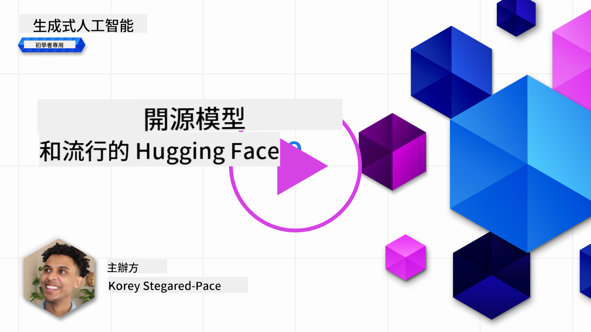
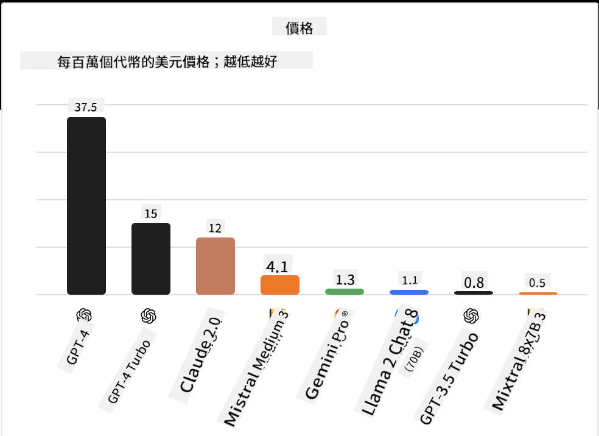
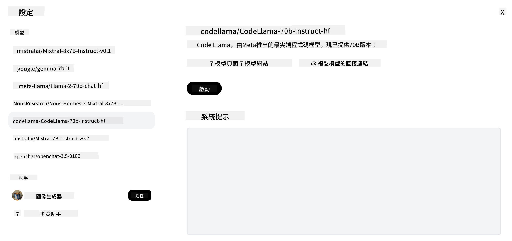
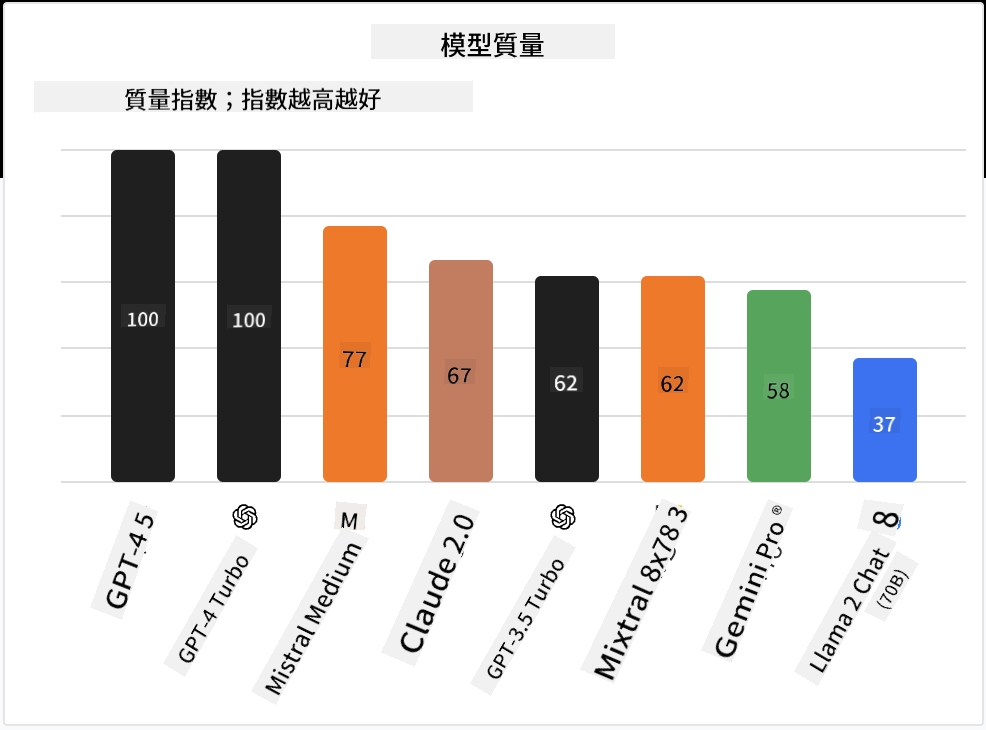

<!--
CO_OP_TRANSLATOR_METADATA:
{
  "original_hash": "0bba96e53ab841d99db731892a51fab8",
  "translation_date": "2025-06-25T23:50:43+00:00",
  "source_file": "16-open-source-models/README.md",
  "language_code": "hk"
}
-->

## 介紹

開源LLM的世界既令人興奮又不斷發展。本課旨在深入了解開源模型。如果您想了解專有模型與開源模型的比較，請參閱["探索和比較不同LLM"課程](../02-exploring-and-comparing-different-llms/README.md?WT.mc_id=academic-105485-koreyst)。本課還將涉及微調的主題，但更詳細的解釋可以在["微調LLM"課程](../18-fine-tuning/README.md?WT.mc_id=academic-105485-koreyst)中找到。

## 學習目標

- 獲得對開源模型的理解
- 了解使用開源模型的好處
- 探索在Hugging Face和Azure AI Studio上可用的開源模型

## 什麼是開源模型？

開源軟件在各個領域的技術增長中發揮了關鍵作用。開源倡議（OSI）已定義[軟件的10個標準](https://web.archive.org/web/20241126001143/https://opensource.org/osd?WT.mc_id=academic-105485-koreyst)，以被歸類為開源。源代碼必須在OSI批准的許可下公開共享。

雖然LLM的開發與軟件開發有相似之處，但過程並不完全相同。這引發了社區對LLM背景下開源定義的許多討論。為了使模型符合傳統的開源定義，以下信息應公開可用：

- 用於訓練模型的數據集。
- 作為訓練的一部分的完整模型權重。
- 評估代碼。
- 微調代碼。
- 完整的模型權重和訓練指標。

目前只有少數模型符合這些標準。[由Allen Institute for Artificial Intelligence（AllenAI）創建的OLMo模型](https://huggingface.co/allenai/OLMo-7B?WT.mc_id=academic-105485-koreyst)是符合此類別的模型之一。

在本課中，我們將繼續將這些模型稱為"開源模型"，因為它們在撰寫時可能不符合上述標準。

## 開源模型的好處

**高度可定制** - 由於開源模型伴隨著詳細的訓練信息發布，研究人員和開發者可以修改模型的內部結構。這使得可以創建針對特定任務或研究領域進行微調的高度專門化模型。一些例子包括代碼生成、數學運算和生物學。

**成本** - 使用和部署這些模型的每個令牌成本低於專有模型。在構建生成式AI應用程序時，應根據您的使用案例來考慮性能與價格。

來源：人工分析

**靈活性** - 使用開源模型可以讓您在使用不同模型或組合它們方面更加靈活。一個例子是[HuggingChat Assistants](https://huggingface.co/chat?WT.mc_id=academic-105485-koreyst)，用戶可以直接在用戶界面中選擇正在使用的模型：

## 探索不同的開源模型

### Llama 2

由Meta開發的[LLama2](https://huggingface.co/meta-llama?WT.mc_id=academic-105485-koreyst)是一個開源模型，針對基於聊天的應用程序進行了優化。這是由於其微調方法，包括大量的對話和人類反饋。通過這種方法，模型產生更多符合人類期望的結果，提供更好的用戶體驗。

Llama的微調版本的一些例子包括專注於日語的[Japanese Llama](https://huggingface.co/elyza/ELYZA-japanese-Llama-2-7b?WT.mc_id=academic-105485-koreyst)和增強版的[Llama Pro](https://huggingface.co/TencentARC/LLaMA-Pro-8B?WT.mc_id=academic-105485-koreyst)。

### Mistral

[Mistral](https://huggingface.co/mistralai?WT.mc_id=academic-105485-koreyst)是一個開源模型，重點是高性能和效率。它使用專家混合方法，將一組專門的專家模型組合成一個系統，根據輸入選擇使用某些模型。這使計算更加有效，因為模型只處理它們專門的輸入。

Mistral的微調版本的一些例子包括專注於醫療領域的[BioMistral](https://huggingface.co/BioMistral/BioMistral-7B?text=Mon+nom+est+Thomas+et+mon+principal?WT.mc_id=academic-105485-koreyst)和進行數學計算的[OpenMath Mistral](https://huggingface.co/nvidia/OpenMath-Mistral-7B-v0.1-hf?WT.mc_id=academic-105485-koreyst)。

### Falcon

[Falcon](https://huggingface.co/tiiuae?WT.mc_id=academic-105485-koreyst)是由技術創新研究所（**TII**）創建的LLM。Falcon-40B在400億參數上進行了訓練，已顯示出比GPT-3在計算預算更少的情況下表現更好。這是由於其使用了FlashAttention算法和多查詢注意力，能夠在推理時減少內存需求。由於這種減少的推理時間，Falcon-40B適合用於聊天應用。

Falcon微調版本的一些例子包括基於開源模型的助手[OpenAssistant](https://huggingface.co/OpenAssistant/falcon-40b-sft-top1-560?WT.mc_id=academic-105485-koreyst)和性能高於基礎模型的[GPT4ALL](https://huggingface.co/nomic-ai/gpt4all-falcon?WT.mc_id=academic-105485-koreyst)。

## 如何選擇

沒有一個選擇開源模型的標準答案。可以從使用Azure AI Studio的按任務篩選功能開始。這將幫助您了解模型已被訓練的任務類型。Hugging Face還維護了一個LLM排行榜，顯示基於特定指標的最佳表現模型。

當希望比較不同類型的LLM時，[人工分析](https://artificialanalysis.ai/?WT.mc_id=academic-105485-koreyst)是另一個很好的資源：

來源：人工分析

如果在特定使用案例上工作，尋找專注於相同領域的微調版本可能是有效的。嘗試多個開源模型以查看它們如何符合您和您的用戶期望是另一個良好的做法。

## 下一步

開源模型的最佳部分是您可以快速開始使用它們。查看[Azure AI Studio模型目錄](https://ai.azure.com?WT.mc_id=academic-105485-koreyst)，其中包含我們在此處討論的Hugging Face集合。

## 學習不止於此，繼續探索

完成本課後，查看我們的[生成式AI學習集合](https://aka.ms/genai-collection?WT.mc_id=academic-105485-koreyst)，繼續提升您的生成式AI知識！

**免責聲明**：  
本文件已使用人工智能翻譯服務 [Co-op Translator](https://github.com/Azure/co-op-translator) 進行翻譯。儘管我們努力確保準確性，但請注意，自動翻譯可能包含錯誤或不準確之處。應將原始文件視為權威來源。對於關鍵信息，建議使用專業人工翻譯。我們不對使用此翻譯而產生的任何誤解或誤釋承擔責任。