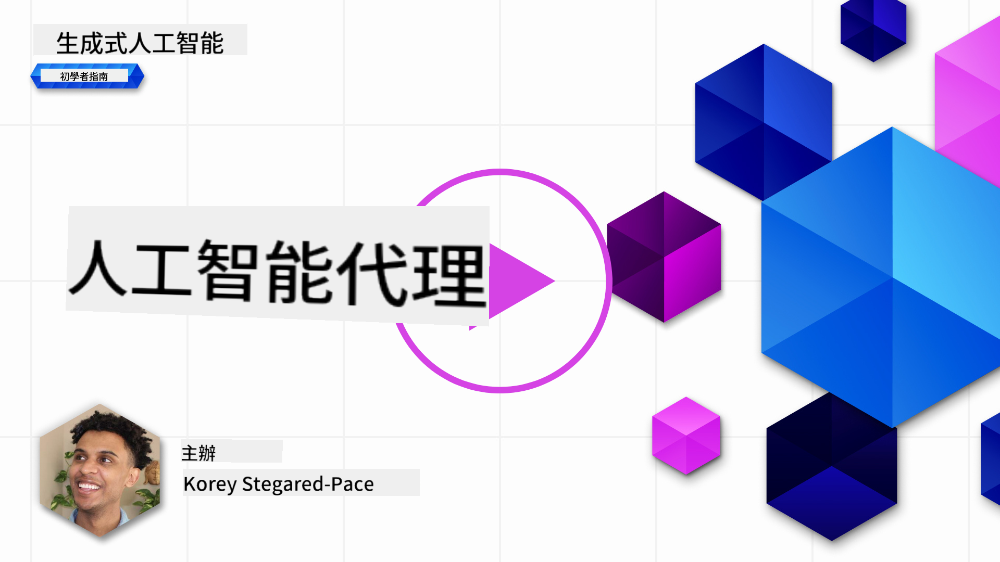
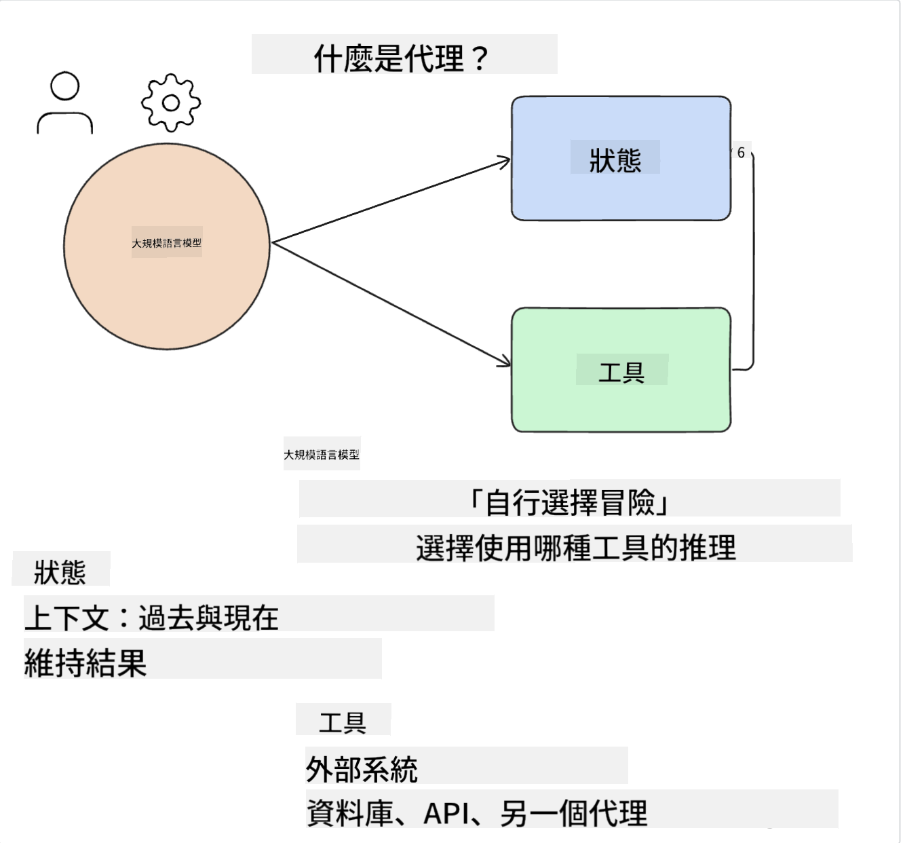
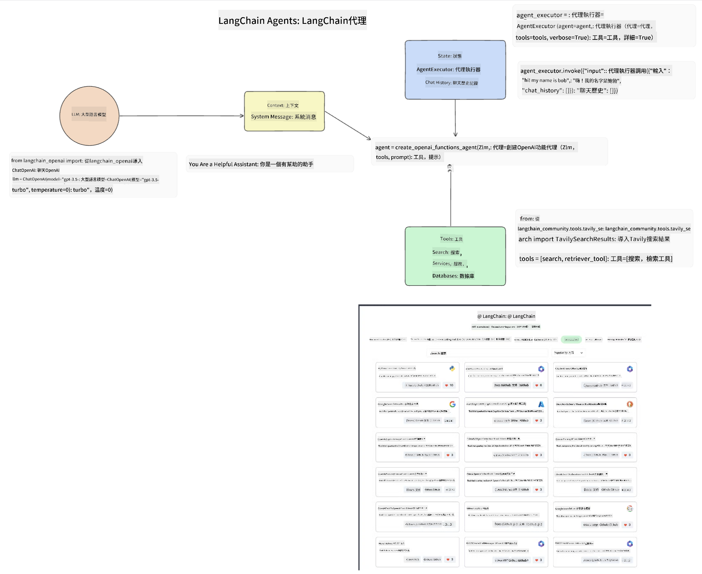
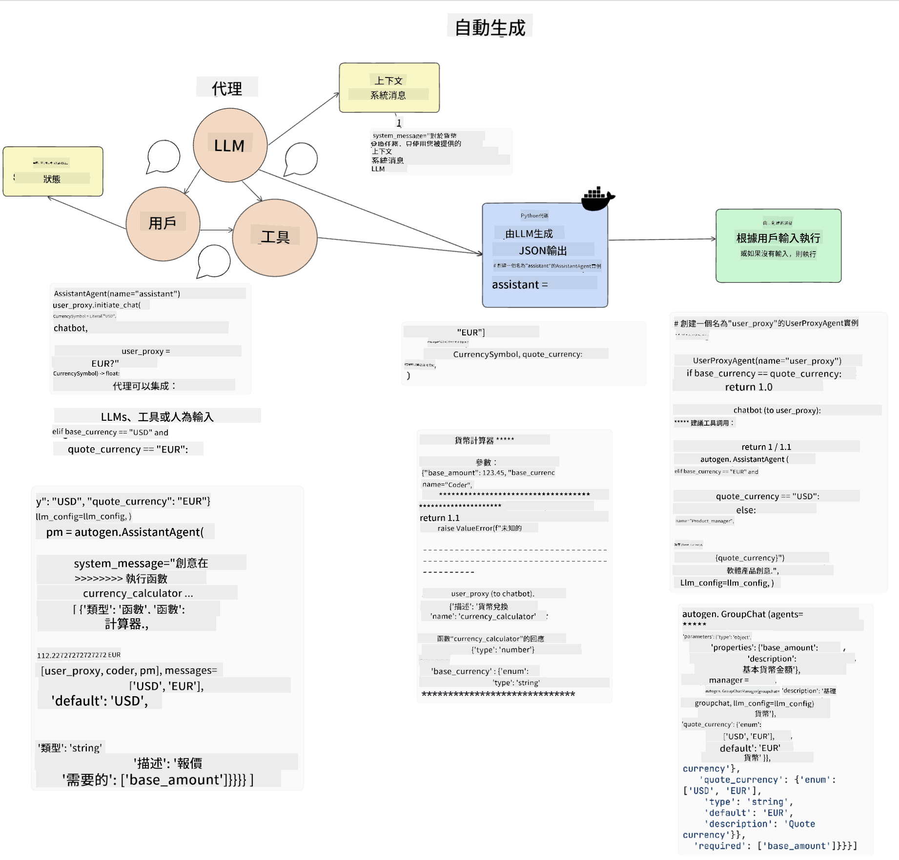
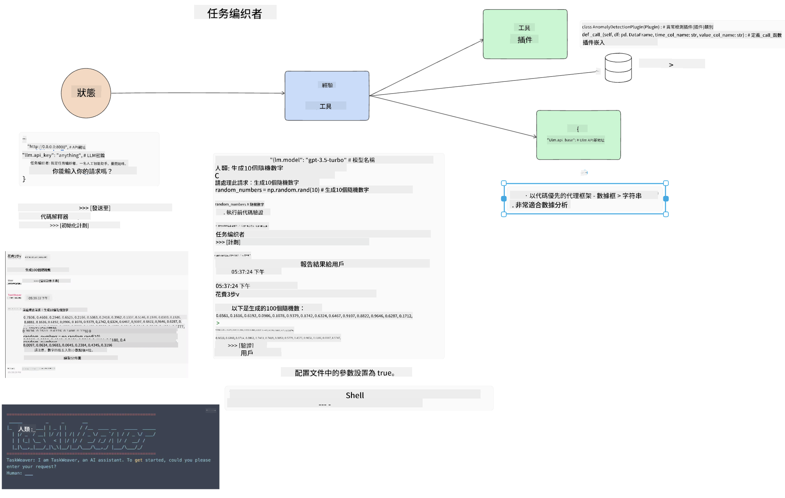
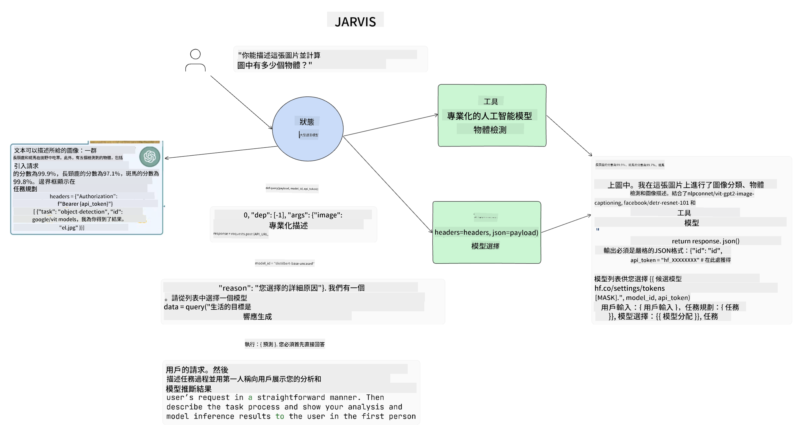

<!--
CO_OP_TRANSLATOR_METADATA:
{
  "original_hash": "11f03c81f190d9cbafd0f977dcbede6c",
  "translation_date": "2025-05-20T07:10:43+00:00",
  "source_file": "17-ai-agents/README.md",
  "language_code": "hk"
}
-->
[](https://aka.ms/gen-ai-lesson17-gh?WT.mc_id=academic-105485-koreyst)

## 介紹

AI Agents 是生成式 AI 中一個令人興奮的發展，它讓大型語言模型（LLMs）從助手演變為能夠採取行動的代理。AI Agent 框架使開發者能夠創建應用程序，讓 LLMs 可以訪問工具和狀態管理。這些框架還增強了可見性，允許用戶和開發者監控 LLMs 所計劃的行動，從而改善體驗管理。

這節課將涵蓋以下內容：

- 理解什麼是 AI Agent - AI Agent 究竟是什麼？
- 探索四種不同的 AI Agent 框架 - 它們有什麼獨特之處？
- 將這些 AI Agents 應用於不同的用例 - 什麼時候應該使用 AI Agents？

## 學習目標

完成這節課後，您將能夠：

- 解釋什麼是 AI Agents 以及它們如何被使用。
- 理解一些流行的 AI Agent 框架之間的差異，以及它們有何不同。
- 理解 AI Agents 如何運作，以便能夠使用它們構建應用程序。

## 什麼是 AI Agents？

AI Agents 是生成式 AI 世界中非常令人興奮的領域。隨著這種興奮，有時會出現術語和應用的混淆。為了簡單起見並涵蓋大多數提及 AI Agents 的工具，我們將使用以下定義：

AI Agents 允許大型語言模型（LLMs）通過賦予它們訪問 **狀態** 和 **工具** 的能力來執行任務。



讓我們定義這些術語：

**大型語言模型** - 這些是本課程中提到的模型，如 GPT-3.5、GPT-4、Llama-2 等。

**狀態** - 這指的是 LLM 正在運行的上下文。LLM 使用其過去行動的上下文和當前上下文，引導其後續行動的決策。AI Agent 框架允許開發者更輕鬆地維護這一上下文。

**工具** - 為了完成用戶請求的任務以及 LLM 計劃的任務，LLM 需要訪問工具。一些工具的例子可以是數據庫、API、外部應用程序，甚至是另一個 LLM！

這些定義希望能夠為您提供一個良好的基礎，讓我們接下來看看它們是如何實現的。我們來探索一些不同的 AI Agent 框架：

## LangChain Agents

[LangChain Agents](https://python.langchain.com/docs/how_to/#agents?WT.mc_id=academic-105485-koreyst) 是我們上面提供的定義的一種實現。

為了管理 **狀態** ，它使用了一個內置函數叫做 `AgentExecutor`。這個函數接受定義的 `agent` 和可用的 `tools`。

`Agent Executor` 還存儲了聊天記錄，以提供聊天的上下文。



LangChain 提供了一個 [工具目錄](https://integrations.langchain.com/tools?WT.mc_id=academic-105485-koreyst)，可以導入到您的應用程序中，讓 LLM 可以訪問。這些工具由社區和 LangChain 團隊製作。

然後您可以定義這些工具並將它們傳遞給 `Agent Executor`。

可見性是談論 AI Agents 時的另一個重要方面。對於應用程序開發者來說，了解 LLM 使用了哪個工具以及為什麼使用這個工具是很重要的。為此，LangChain 團隊開發了 LangSmith。

## AutoGen

我們將討論的下一個 AI Agent 框架是 [AutoGen](https://microsoft.github.io/autogen/?WT.mc_id=academic-105485-koreyst)。AutoGen 的主要焦點是對話。代理既可以 **對話** 又可以 **自定義**。

**對話 -** LLMs 可以啟動並繼續與另一個 LLM 的對話以完成任務。這是通過創建 `AssistantAgents` 並給予它們特定的系統消息來完成的。

```python

autogen.AssistantAgent( name="Coder", llm_config=llm_config, ) pm = autogen.AssistantAgent( name="Product_manager", system_message="Creative in software product ideas.", llm_config=llm_config, )

```

**自定義** - 代理不僅可以定義為 LLMs，還可以是用戶或工具。作為開發者，您可以定義一個 `UserProxyAgent`，負責與用戶交互以獲得完成任務的反饋。這個反饋可以繼續執行任務或停止它。

```python
user_proxy = UserProxyAgent(name="user_proxy")
```

### 狀態和工具

為了改變和管理狀態，助手代理生成 Python 代碼來完成任務。

以下是該過程的一個例子：



#### 使用系統消息定義的 LLM

```python
system_message="For weather related tasks, only use the functions you have been provided with. Reply TERMINATE when the task is done."
```

這些系統消息指導這個特定的 LLM 哪些功能與其任務相關。請記住，使用 AutoGen，您可以有多個定義的 AssistantAgents 並具有不同的系統消息。

#### 用戶啟動聊天

```python
user_proxy.initiate_chat( chatbot, message="I am planning a trip to NYC next week, can you help me pick out what to wear? ", )

```

來自 user_proxy（人類）的這條消息將啟動代理探索應該執行的可能功能的過程。

#### 執行功能

```bash
chatbot (to user_proxy):

***** Suggested tool Call: get_weather ***** Arguments: {"location":"New York City, NY","time_periond:"7","temperature_unit":"Celsius"} ******************************************************** --------------------------------------------------------------------------------

>>>>>>>> EXECUTING FUNCTION get_weather... user_proxy (to chatbot): ***** Response from calling function "get_weather" ***** 112.22727272727272 EUR ****************************************************************

```

一旦初始聊天被處理，代理將建議工具進行調用。在這種情況下，這是一個名為 `get_weather`. Depending on your configuration, this function can be automatically executed and read by the Agent or can be executed based on user input.

You can find a list of [AutoGen code samples](https://microsoft.github.io/autogen/docs/Examples/?WT.mc_id=academic-105485-koreyst) to further explore how to get started building.

## Taskweaver

The next agent framework we will explore is [Taskweaver](https://microsoft.github.io/TaskWeaver/?WT.mc_id=academic-105485-koreyst). It is known as a "code-first" agent because instead of working strictly with `strings` , it can work with DataFrames in Python. This becomes extremely useful for data analysis and generation tasks. This can be things like creating graphs and charts or generating random numbers.

### State and Tools

To manage the state of the conversation, TaskWeaver uses the concept of a `Planner`. The `Planner` is a LLM that takes the request from the users and maps out the tasks that need to be completed to fulfill this request.

To complete the tasks the `Planner` is exposed to the collection of tools called `Plugins` 的功能。這可以是 Python 類或通用代碼解釋器。這些插件被存儲為嵌入，以便 LLM 能夠更好地搜索正確的插件。



以下是一個處理異常檢測的插件示例：

```python
class AnomalyDetectionPlugin(Plugin): def __call__(self, df: pd.DataFrame, time_col_name: str, value_col_name: str):
```

代碼在執行前被驗證。Taskweaver 中管理上下文的另一個功能是 `experience`. Experience allows for the context of a conversation to be stored over to the long term in a YAML file. This can be configured so that the LLM improves over time on certain tasks given that it is exposed to prior conversations.

## JARVIS

The last agent framework we will explore is [JARVIS](https://github.com/microsoft/JARVIS?tab=readme-ov-file?WT.mc_id=academic-105485-koreyst). What makes JARVIS unique is that it uses an LLM to manage the `state` 的對話以及 `tools` 是其他 AI 模型。每個 AI 模型都是專業模型，執行特定任務，如物體檢測、轉錄或圖像字幕。



LLM 作為通用模型，接收來自用戶的請求並識別完成任務所需的具體任務和任何參數/數據。

```python
[{"task": "object-detection", "id": 0, "dep": [-1], "args": {"image": "e1.jpg" }}]
```

然後 LLM 以專業 AI 模型可以解釋的方式格式化請求，例如 JSON。一旦 AI 模型根據任務返回其預測，LLM 便接收回應。

如果需要多個模型來完成任務，它還將解釋這些模型的回應，然後將它們匯總以生成給用戶的回應。

下面的例子顯示了當用戶請求圖像中的物體描述和數量時，這將如何工作：

## 作業

為了繼續學習 AI Agents，您可以使用 AutoGen 構建：

- 一個模擬教育初創企業不同部門商務會議的應用程序。
- 創建系統消息，引導 LLMs 理解不同角色和優先事項，並讓用戶推銷一個新產品想法。
- 然後 LLM 應生成來自每個部門的後續問題，以完善和改進推銷和產品想法。

## 學習不會止步於此，繼續您的旅程

完成這節課後，查看我們的 [生成式 AI 學習系列](https://aka.ms/genai-collection?WT.mc_id=academic-105485-koreyst) 以繼續提升您的生成式 AI 知識！

**免責聲明**：
本文件已使用 AI 翻譯服務 [Co-op Translator](https://github.com/Azure/co-op-translator) 進行翻譯。我們力求準確，但請注意，自動翻譯可能包含錯誤或不準確之處。應以原始語言的文件作為權威來源。對於重要信息，建議使用專業人工翻譯。我們對因使用此翻譯而引起的任何誤解或誤釋不承擔責任。