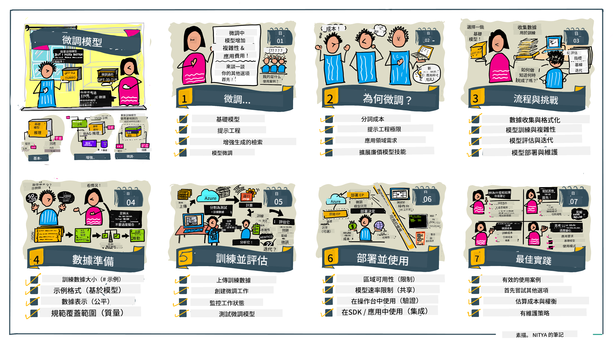

<!--
CO_OP_TRANSLATOR_METADATA:
{
  "original_hash": "68664f7e754a892ae1d8d5e2b7bd2081",
  "translation_date": "2025-07-09T17:37:22+00:00",
  "source_file": "18-fine-tuning/README.md",
  "language_code": "hk"
}
-->

# 微調你的大型語言模型

使用大型語言模型來構建生成式 AI 應用程式帶來了新的挑戰。一個關鍵問題是確保模型針對用戶請求所生成內容的回應質量（準確性和相關性）。在之前的課程中，我們討論了像提示工程和檢索增強生成這類技術，試圖透過_修改輸入提示_來解決這個問題。

在今天的課程中，我們將探討第三種技術，**微調（fine-tuning）**，它嘗試透過_使用額外數據重新訓練模型本身_來應對這個挑戰。讓我們深入了解細節。

## 學習目標

本課程介紹預訓練語言模型的微調概念，探討此方法的優點與挑戰，並提供何時以及如何使用微調來提升生成式 AI 模型效能的指引。

完成本課程後，你應該能回答以下問題：

- 什麼是語言模型的微調？
- 何時以及為何微調是有用的？
- 如何微調一個預訓練模型？
- 微調有哪些限制？

準備好了嗎？我們開始吧。

## 圖解指南

想先了解我們將涵蓋的整體內容嗎？看看這份圖解指南，描述本課程的學習旅程——從學習微調的核心概念與動機，到理解微調流程及執行最佳實踐。這是一個非常有趣的主題，別忘了查看[資源](./RESOURCES.md?WT.mc_id=academic-105485-koreyst)頁面，獲取更多支援你自學之旅的連結！

## 什麼是語言模型的微調？

根據定義，大型語言模型是基於來自多元來源（包括網路）的海量文本進行_預訓練_。正如我們在之前課程中學到的，我們需要像_提示工程_和_檢索增強生成_這類技術來提升模型對用戶問題（「提示」）的回應質量。

一種常見的提示工程技術是透過提供_指令_（明確指導）或_給予幾個範例_（隱性指導）來引導模型預期的回應，這稱為_少量示範學習（few-shot learning）_，但它有兩個限制：

- 模型的 token 限制會限制你能提供的範例數量，從而影響效果。
- 模型 token 成本可能使每次提示都加入範例變得昂貴，限制了彈性。

微調是機器學習系統中常見的做法，我們會拿一個預訓練模型，並用新數據重新訓練它，以提升其在特定任務上的表現。在語言模型的情境下，我們可以用_為特定任務或應用領域精心挑選的範例集_來微調預訓練模型，打造一個**客製化模型**，使其在該任務或領域上更準確且更具相關性。微調的附帶好處是，它也能減少少量示範學習所需的範例數量，從而降低 token 使用量和相關成本。

## 何時以及為何要微調模型？

在_這裡_談到微調時，我們指的是**監督式**微調，即透過**加入原始訓練資料集之外的新數據**來重新訓練模型。這與非監督式微調不同，後者是用不同的超參數在原始資料上重新訓練模型。

要記住的重點是，微調是一項進階技術，需要一定程度的專業知識才能達到預期效果。如果操作不當，可能無法帶來預期的改進，甚至會降低模型在目標領域的表現。

所以，在學習「如何」微調語言模型之前，你需要先了解「為什麼」要走這條路，以及「何時」開始微調流程。先問自己這些問題：

- **使用案例**：你的微調_使用案例_是什麼？你想改善目前預訓練模型的哪個方面？
- **替代方案**：你是否嘗試過_其他技術_來達成目標？用它們建立基準以便比較。
  - 提示工程：嘗試用相關提示回應範例的少量示範提示技術。評估回應質量。
  - 檢索增強生成：嘗試用從資料中檢索的查詢結果來增強提示。評估回應質量。
- **成本**：你是否評估過微調的成本？
  - 可調整性 — 預訓練模型是否開放微調？
  - 工作量 — 準備訓練數據、評估與優化模型所需的努力。
  - 計算資源 — 執行微調任務及部署微調模型所需的運算。
  - 數據 — 是否有足夠且高品質的範例來產生微調效果。
- **效益**：你是否確認微調的效益？
  - 質量 — 微調後的模型是否超越基準？
  - 成本 — 是否透過簡化提示降低 token 使用？
  - 擴展性 — 是否能將基礎模型重新用於新領域？

回答這些問題後，你應該能判斷微調是否適合你的使用案例。理想情況下，只有當效益大於成本時，這個方法才是合理的。一旦決定要進行，就該思考_如何_微調預訓練模型。

想了解更多決策過程的見解？觀看 [To fine-tune or not to fine-tune](https://www.youtube.com/watch?v=0Jo-z-MFxJs)

## 如何微調預訓練模型？

要微調預訓練模型，你需要具備：

- 一個可供微調的預訓練模型
- 用於微調的數據集
- 執行微調任務的訓練環境
- 部署微調後模型的主機環境

## 微調實作

以下資源提供逐步教學，帶你使用特定模型和精選數據集完成實例。要跟著這些教學操作，你需要在相應供應商註冊帳號，並取得相關模型與數據集的存取權。

| 供應商       | 教學連結                                                                                                                                                                    | 說明                                                                                                                                                                                                                                                                                                                                                                                                                             |
| ------------ | --------------------------------------------------------------------------------------------------------------------------------------------------------------------------- | -------------------------------------------------------------------------------------------------------------------------------------------------------------------------------------------------------------------------------------------------------------------------------------------------------------------------------------------------------------------------------------------------------------------------------- |
| OpenAI       | [How to fine-tune chat models](https://github.com/openai/openai-cookbook/blob/main/examples/How_to_finetune_chat_models.ipynb?WT.mc_id=academic-105485-koreyst)               | 學習如何針對特定領域（「食譜助理」）微調 `gpt-35-turbo`，包括準備訓練數據、執行微調任務，以及使用微調後模型進行推論。                                                                                                                                                                                                                                                                                                         |
| Azure OpenAI | [GPT 3.5 Turbo fine-tuning tutorial](https://learn.microsoft.com/azure/ai-services/openai/tutorials/fine-tune?tabs=python-new%2Ccommand-line?WT.mc_id=academic-105485-koreyst) | 學習如何在 **Azure** 上微調 `gpt-35-turbo-0613` 模型，涵蓋建立與上傳訓練數據、執行微調任務，以及部署和使用新模型。                                                                                                                                                                                                                                                                                                         |
| Hugging Face | [Fine-tuning LLMs with Hugging Face](https://www.philschmid.de/fine-tune-llms-in-2024-with-trl?WT.mc_id=academic-105485-koreyst)                                              | 本文介紹如何使用 [transformers](https://huggingface.co/docs/transformers/index?WT.mc_id=academic-105485-koreyst) 函式庫和 [Transformer Reinforcement Learning (TRL)](https://huggingface.co/docs/trl/index?WT.mc_id=academic-105485-koreyst) 來微調開源大型語言模型（例如 `CodeLlama 7B`），並使用 Hugging Face 上的開放[數據集](https://huggingface.co/docs/datasets/index?WT.mc_id=academic-105485-koreyst)。 |
|              |                                                                                                                                                                             |                                                                                                                                                                                                                                                                                                                                                                                                                                 |
| 🤗 AutoTrain | [Fine-tuning LLMs with AutoTrain](https://github.com/huggingface/autotrain-advanced/?WT.mc_id=academic-105485-koreyst)                                                        | AutoTrain（或 AutoTrain Advanced）是 Hugging Face 開發的 Python 函式庫，支援多種任務的微調，包括大型語言模型微調。AutoTrain 是無需編碼的解決方案，可在你自己的雲端、Hugging Face Spaces 或本地執行微調。它同時支援網頁 GUI、命令列介面以及透過 yaml 配置文件進行訓練。                                                                                                                                            |
|              |                                                                                                                                                                             |                                                                                                                                                                                                                                                                                                                                                                                                                                 |

## 作業

請選擇上述其中一個教學並實際操作。_我們可能會在本倉庫中以 Jupyter Notebook 形式複製這些教學作為參考，請直接使用原始資源以獲取最新版本_。

## 做得好！繼續學習。

完成本課程後，請查看我們的[生成式 AI 學習合集](https://aka.ms/genai-collection?WT.mc_id=academic-105485-koreyst)，持續提升你的生成式 AI 知識！

恭喜你完成本課程的 v2 系列最終課程！別停止學習與實作。**請查看[資源](RESOURCES.md?WT.mc_id=academic-105485-koreyst)頁面，獲取更多本主題的建議清單。**

我們的 v1 系列課程也已更新，加入更多作業與概念。花點時間複習你的知識，並請[分享你的問題與回饋](https://github.com/microsoft/generative-ai-for-beginners/issues?WT.mc_id=academic-105485-koreyst)，幫助我們為社群改進這些課程。

**免責聲明**：  
本文件由 AI 翻譯服務 [Co-op Translator](https://github.com/Azure/co-op-translator) 進行翻譯。雖然我們致力於確保準確性，但請注意自動翻譯可能包含錯誤或不準確之處。原始文件的母語版本應被視為權威來源。對於重要資訊，建議採用專業人工翻譯。我們不對因使用本翻譯而引起的任何誤解或誤釋承擔責任。