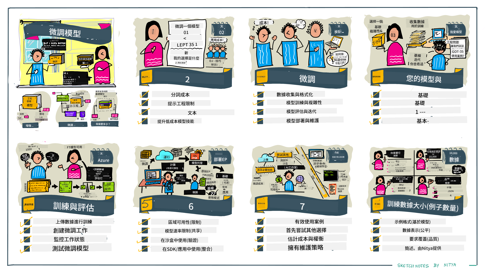

<!--
CO_OP_TRANSLATOR_METADATA:
{
  "original_hash": "68664f7e754a892ae1d8d5e2b7bd2081",
  "translation_date": "2025-05-20T07:39:21+00:00",
  "source_file": "18-fine-tuning/README.md",
  "language_code": "hk"
}
-->

# 微調您的LLM

使用大型語言模型來構建生成式AI應用程序會帶來新的挑戰。關鍵問題是確保模型生成的內容在特定用戶請求中具有質量（準確性和相關性）。在之前的課程中，我們討論了像提示工程和檢索增強生成等技術，這些技術試圖通過修改現有模型的提示輸入來解決問題。

今天的課程中，我們討論第三種技術，**微調**，這種技術試圖通過用額外數據重新訓練模型本身來解決挑戰。讓我們深入了解細節。

## 學習目標

本課程介紹了微調預訓練語言模型的概念，探索了這種方法的優勢和挑戰，並提供了何時以及如何使用微調來提高生成式AI模型性能的指導。

在本課程結束時，您應該能夠回答以下問題：

- 語言模型的微調是什麼？
- 微調何時以及為何有用？
- 我如何微調預訓練模型？
- 微調的限制是什麼？

準備好了嗎？讓我們開始吧。

## 圖解指南

想在深入學習之前獲得我們將涵蓋的內容的大致概念嗎？查看這個圖解指南，它描述了本課程的學習旅程——從學習微調的核心概念和動機，到理解執行微調任務的過程和最佳實踐。這是一個值得探索的迷人主題，因此不要忘記查看[資源](./RESOURCES.md?WT.mc_id=academic-105485-koreyst)頁面，以獲得支持自我導向學習旅程的其他鏈接！

## 語言模型的微調是什麼？

根據定義，大型語言模型是在大量來自包括互聯網等多種來源的文本上進行預訓練的。正如我們在之前的課程中所學，我們需要像提示工程和檢索增強生成這樣的技術來提高模型對用戶問題（“提示”）的回答質量。

一種流行的提示工程技術涉及通過提供指令（明確指導）或提供幾個示例（隱含指導）來給模型更多的指導，以期望在回答中得到什麼。這被稱為少樣本學習，但它有兩個限制：

- 模型令牌限制可能會限制您能提供的示例數量，並限制效果。
- 模型令牌成本可能使每個提示添加示例變得昂貴，並限制靈活性。

微調是機器學習系統中的常見做法，我們採用預訓練模型並用新數據重新訓練它，以提高其在特定任務上的性能。在語言模型的上下文中，我們可以用針對特定任務或應用領域的精心挑選的示例集微調預訓練模型，以創建可能對該特定任務或領域更準確和相關的**定制模型**。微調的一個副作用是它還可以減少少樣本學習所需的示例數量——減少令牌使用和相關成本。

## 我們應該何時以及為何微調模型？

在這個上下文中，當我們談論微調時，我們指的是**監督**微調，其中重新訓練是通過**添加新數據**來完成的，這些數據不是原始訓練數據集的一部分。這與無監督微調方法不同，後者是用不同的超參數在原始數據上重新訓練模型。

關鍵要記住的是，微調是一種需要一定專業水平才能獲得預期結果的高級技術。如果做得不正確，可能不會提供預期的改進，甚至可能降低模型在您的目標領域的性能。

因此，在您學習“如何”微調語言模型之前，您需要知道“為什麼”應該選擇這條路，並且“何時”開始微調過程。從問自己以下問題開始：

- **用例**：您的微調用例是什麼？您希望改進當前預訓練模型的哪個方面？
- **替代方案**：您是否嘗試過其他技術來達到預期結果？使用它們創建比較的基準。
  - 提示工程：嘗試少樣本提示技術，提供相關提示回答的示例。評估回答的質量。
  - 檢索增強生成：嘗試用檢索數據的查詢結果增強提示。評估回答的質量。
- **成本**：您是否識別出微調的成本？
  - 可調性——預訓練模型是否可用於微調？
  - 努力——準備訓練數據、評估和完善模型的努力。
  - 計算——運行微調作業和部署微調模型的計算成本
  - 數據——獲得足夠質量的示例以影響微調
- **收益**：您是否確認了微調的收益？
  - 質量——微調模型是否優於基準？
  - 成本——是否通過簡化提示減少了令牌使用？
  - 擴展性——您能否重新利用基礎模型用於新領域？

通過回答這些問題，您應該能夠決定微調是否是您的用例的正確方法。理想情況下，只有當收益超過成本時，該方法才有效。一旦您決定繼續，就該考慮如何微調預訓練模型了。

想要獲得更多決策過程的見解嗎？觀看[是否微調](https://www.youtube.com/watch?v=0Jo-z-MFxJs)

## 我們如何微調預訓練模型？

要微調預訓練模型，您需要：

- 一個要微調的預訓練模型
- 用於微調的數據集
- 運行微調作業的訓練環境
- 部署微調模型的託管環境

## 微調實踐

以下資源提供了逐步教程，通過使用選定模型和精心挑選的數據集來引導您完成真實示例。要完成這些教程，您需要在特定提供商處擁有帳戶，並獲得相關模型和數據集的訪問權限。

| 提供商       | 教程                                                                                                                                                                       | 描述                                                                                                                                                                                                                                                                                                                                                                                                                        |
| ------------ | ------------------------------------------------------------------------------------------------------------------------------------------------------------------------ | ---------------------------------------------------------------------------------------------------------------------------------------------------------------------------------------------------------------------------------------------------------------------------------------------------------------------------------------------------------------------------------------------------------------------------------- |
| OpenAI       | [如何微調聊天模型](https://github.com/openai/openai-cookbook/blob/main/examples/How_to_finetune_chat_models.ipynb?WT.mc_id=academic-105485-koreyst)                | 學習如何微調`gpt-35-turbo`以適應特定領域（“食譜助手”），通過準備訓練數據、運行微調作業和使用微調模型進行推理。                                                                                                                                                                                                                                              |
| Azure OpenAI | [GPT 3.5 Turbo微調教程](https://learn.microsoft.com/azure/ai-services/openai/tutorials/fine-tune?tabs=python-new%2Ccommand-line?WT.mc_id=academic-105485-koreyst) | 學習如何在Azure上微調`gpt-35-turbo-0613`模型，通過採取步驟創建和上傳訓練數據、運行微調作業。部署並使用新模型。                                                                                                                                                                                                                                                                 |
| Hugging Face | [使用Hugging Face微調LLM](https://www.philschmid.de/fine-tune-llms-in-2024-with-trl?WT.mc_id=academic-105485-koreyst)                                               | 此博客文章引導您使用[transformers](https://huggingface.co/docs/transformers/index?WT.mc_id=academic-105485-koreyst)庫和[Transformer Reinforcement Learning (TRL)](https://huggingface.co/docs/trl/index?WT.mc_id=academic-105485-koreyst])以及Hugging Face上的開放[數據集](https://huggingface.co/docs/datasets/index?WT.mc_id=academic-105485-koreyst)微調開放LLM（例如`CodeLlama 7B`）。 |
|              |                                                                                                                                                                                |                                                                                                                                                                                                                                                                                                                                                                                                                                    |
| 🤗 AutoTrain | [使用AutoTrain微調LLM](https://github.com/huggingface/autotrain-advanced/?WT.mc_id=academic-105485-koreyst)                                                         | AutoTrain（或AutoTrain Advanced）是由Hugging Face開發的Python庫，允許微調許多不同的任務，包括LLM微調。AutoTrain是一種無代碼解決方案，微調可以在您自己的雲上、Hugging Face Spaces上或本地完成。它支持基於Web的GUI、CLI和通過yaml配置文件進行的訓練。                                                                               |
|              |                                                                                                                                                                                |                                                                                                                                                                                                                                                                                                                                                                                                                                    |

## 作業

選擇上述教程之一並進行學習。我們可能會在此倉庫中的Jupyter Notebooks中複製這些教程的版本僅供參考。請直接使用原始資源以獲得最新版本。

## 幹得好！繼續學習。

完成本課程後，查看我們的[生成式AI學習集合](https://aka.ms/genai-collection?WT.mc_id=academic-105485-koreyst)以繼續提升您的生成式AI知識！

恭喜！！您已完成本課程v2系列的最後一課！不要停止學習和構建。**查看[資源](RESOURCES.md?WT.mc_id=academic-105485-koreyst)頁面以獲得僅限於此主題的其他建議列表。

我們的v1系列課程也已更新，增加了更多的作業和概念。因此花點時間刷新您的知識——並且請[分享您的問題和反饋](https://github.com/microsoft/generative-ai-for-beginners/issues?WT.mc_id=academic-105485-koreyst)以幫助我們改善這些課程以惠及社區。

**免責聲明**：

本文件使用 AI 翻譯服務 [Co-op Translator](https://github.com/Azure/co-op-translator) 進行翻譯。我們努力確保準確性，但請注意，自動翻譯可能包含錯誤或不準確之處。應以原始語言的文件為權威來源。對於關鍵信息，建議尋求專業人工翻譯。我們對因使用此翻譯而引起的任何誤解或誤譯不承擔責任。