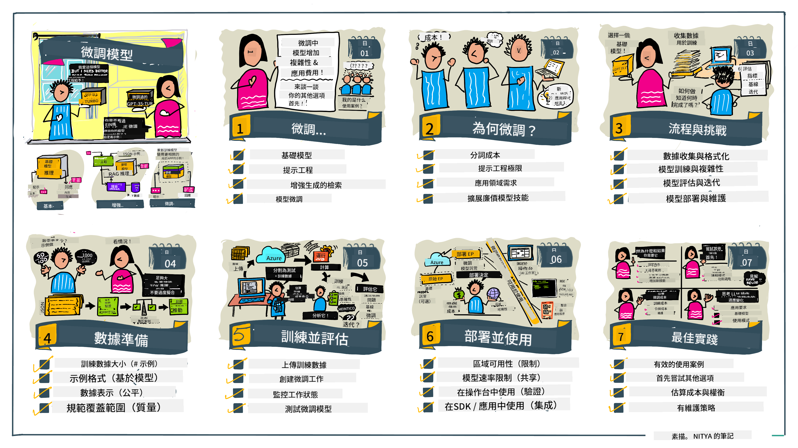

<!--
CO_OP_TRANSLATOR_METADATA:
{
  "original_hash": "68664f7e754a892ae1d8d5e2b7bd2081",
  "translation_date": "2025-06-26T00:33:46+00:00",
  "source_file": "18-fine-tuning/README.md",
  "language_code": "hk"
}
-->

# 微調您的 LLM

使用大型語言模型來構建生成式 AI 應用程式會面臨新的挑戰。主要問題是確保模型生成的內容在特定用戶請求中具有高質量（準確性和相關性）。在之前的課程中，我們討論了諸如提示工程和檢索增強生成等技術，這些技術試圖通過修改現有模型的提示輸入來解決問題。

在今天的課程中，我們討論第三種技術，**微調**，它試圖通過用額外的數據重新訓練模型本身來解決挑戰。讓我們深入了解細節。

## 學習目標

本課程介紹了預訓練語言模型的微調概念，探討了此方法的優勢和挑戰，並提供了何時及如何使用微調來提高您的生成式 AI 模型性能的指導。

在本課程結束時，您應能回答以下問題：

- 什麼是語言模型的微調？
- 微調何時以及為何有用？
- 我如何微調預訓練模型？
- 微調的限制是什麼？

準備好了嗎？讓我們開始吧。

## 圖解指南

想在深入了解之前掌握我們將涵蓋的內容的大概念嗎？查看這個圖解指南，它描述了本課程的學習旅程——從學習微調的核心概念和動機，到理解執行微調任務的過程和最佳實踐。這是一個引人入勝的探索主題，所以不要忘記查看[資源](./RESOURCES.md?WT.mc_id=academic-105485-koreyst)頁面，以獲得支持自我導向學習旅程的額外鏈接！

## 什麼是語言模型的微調？

按定義，大型語言模型是在大量來自多種來源（包括互聯網）的文本上進行預訓練的。正如我們在之前的課程中所學，我們需要諸如提示工程和檢索增強生成等技術來提高模型對用戶問題（“提示”）的響應質量。

一種流行的提示工程技術涉及給模型更多關於響應中預期內容的指導，或者通過提供指令（明確指導）或給出幾個示例（隱含指導）。這被稱為少量學習，但它有兩個限制：

- 模型的標記限制可能會限制您可以提供的示例數量，並限制效果。
- 模型的標記成本可能會使向每個提示添加示例變得昂貴，並限制靈活性。

微調是機器學習系統中的常見做法，我們採用預訓練模型並用新數據重新訓練它，以提高其在特定任務上的性能。在語言模型的背景下，我們可以微調預訓練模型，通過為特定任務或應用領域提供精心挑選的示例集，創建一個可能更準確和相關的**自訂模型**。微調的一個附帶好處是，它還可以減少少量學習所需的示例數量——減少標記使用和相關成本。

## 我們應該何時及為何微調模型？

在_這個_背景下，當我們談論微調時，我們指的是**監督式**微調，其中重新訓練是通過**添加新數據**來完成的，而這些數據不是原始訓練數據集的一部分。這與不監督式微調方法不同，後者是用不同的超參數在原始數據上重新訓練模型。

需要記住的關鍵是，微調是一種需要一定專業知識才能獲得預期結果的高級技術。如果操作不當，它可能不會提供預期的改進，甚至可能降低模型在目標領域的性能。

因此，在學習如何微調語言模型之前，您需要知道為何要採用這種方法，以及何時開始微調過程。首先問自己以下問題：

- **使用案例**：您的微調_使用案例_是什麼？您希望改進當前預訓練模型的哪個方面？
- **替代方案**：您是否嘗試過其他技術來實現預期結果？使用它們來創建比較的基線。
  - 提示工程：嘗試使用相關提示響應示例的少量提示技術。評估響應質量。
  - 檢索增強生成：嘗試使用搜索數據檢索到的查詢結果來增強提示。評估響應質量。
- **成本**：您是否確定了微調的成本？
  - 可調性 - 預訓練模型是否可供微調？
  - 努力 - 準備訓練數據、評估和完善模型。
  - 計算 - 運行微調作業和部署微調模型。
  - 數據 - 獲得足夠質量的示例以影響微調。
- **效益**：您是否確認了微調的效益？
  - 質量 - 微調模型是否超過基線？
  - 成本 - 是否通過簡化提示減少標記使用？
  - 可擴展性 - 您能否將基礎模型重新用於新領域？

通過回答這些問題，您應能夠決定微調是否是您使用案例的正確方法。理想情況下，只有在效益超過成本時，這種方法才有效。一旦您決定繼續，就該考慮如何微調預訓練模型了。

想要獲得更多關於決策過程的見解嗎？觀看[是否進行微調](https://www.youtube.com/watch?v=0Jo-z-MFxJs)

## 我們如何微調預訓練模型？

要微調預訓練模型，您需要擁有：

- 一個要微調的預訓練模型
- 用於微調的數據集
- 用於運行微調作業的訓練環境
- 用於部署微調模型的託管環境

## 微調實踐

以下資源提供逐步教程，通過使用選定模型和精心挑選的數據集的實際示例引導您完成過程。要完成這些教程，您需要在特定提供商的賬戶，並獲得相關模型和數據集的訪問權限。

| 提供商       | 教程                                                                                                                                                                       | 描述                                                                                                                                                                                                                                                                                                                                                                                                                        |
| ------------ | ------------------------------------------------------------------------------------------------------------------------------------------------------------------------ | ---------------------------------------------------------------------------------------------------------------------------------------------------------------------------------------------------------------------------------------------------------------------------------------------------------------------------------------------------------------------------------------------------------------------------------- |
| OpenAI       | [如何微調聊天模型](https://github.com/openai/openai-cookbook/blob/main/examples/How_to_finetune_chat_models.ipynb?WT.mc_id=academic-105485-koreyst)                | 學習如何微調`gpt-35-turbo`，以特定領域（“食譜助手”）為例，準備訓練數據、運行微調作業，並使用微調模型進行推斷。                                                                                                                                                                                                                                              |
| Azure OpenAI | [GPT 3.5 Turbo 微調教程](https://learn.microsoft.com/azure/ai-services/openai/tutorials/fine-tune?tabs=python-new%2Ccommand-line?WT.mc_id=academic-105485-koreyst) | 學習如何在**Azure**上微調`gpt-35-turbo-0613`模型，採取步驟創建並上傳訓練數據，運行微調作業。部署並使用新模型。                                                                                                                                                                                                                                                                 |
| Hugging Face | [使用 Hugging Face 微調 LLMs](https://www.philschmid.de/fine-tune-llms-in-2024-with-trl?WT.mc_id=academic-105485-koreyst)                                               | 此博客文章引導您使用[transformers](https://huggingface.co/docs/transformers/index?WT.mc_id=academic-105485-koreyst)庫和[Transformer Reinforcement Learning (TRL)](https://huggingface.co/docs/trl/index?WT.mc_id=academic-105485-koreyst])在 Hugging Face 上使用開放數據集微調_open LLM_（例如：`CodeLlama 7B`）。 |
|              |                                                                                                                                                                                |                                                                                                                                                                                                                                                                                                                                                                                                                                    |
| 🤗 AutoTrain | [使用 AutoTrain 微調 LLMs](https://github.com/huggingface/autotrain-advanced/?WT.mc_id=academic-105485-koreyst)                                                         | AutoTrain（或 AutoTrain Advanced）是由 Hugging Face 開發的 Python 庫，允許進行多種不同任務的微調，包括 LLM 微調。AutoTrain 是一種無代碼解決方案，微調可以在您的私有雲、Hugging Face Spaces 或本地進行。它支持基於網頁的 GUI、CLI 和通過 yaml 配置文件進行的訓練。                                                                               |
|              |                                                                                                                                                                                |                                                                                                                                                                                                                                                                                                                                                                                                                                    |

## 作業

選擇以上教程之一並完成它們。我們可能會在此倉庫中複製這些教程的 Jupyter Notebook 版本僅供參考。請直接使用原始來源以獲取最新版本。

## 幹得好！繼續學習。

完成本課程後，查看我們的[生成式 AI 學習集合](https://aka.ms/genai-collection?WT.mc_id=academic-105485-koreyst)，繼續提升您的生成式 AI 知識！

恭喜！您已完成本課程的 v2 系列最後一課！不要停止學習和建設。**查看[資源](RESOURCES.md?WT.mc_id=academic-105485-koreyst)頁面，以獲得更多建議列表，僅限於此主題。

我們的 v1 系列課程也已更新了更多作業和概念。因此，花點時間刷新您的知識——並請[分享您的問題和反饋](https://github.com/microsoft/generative-ai-for-beginners/issues?WT.mc_id=academic-105485-koreyst)，以幫助我們改善這些課程以服務社群。

**免責聲明**：  
本文件已使用AI翻譯服務[Co-op Translator](https://github.com/Azure/co-op-translator)進行翻譯。我們努力確保準確性，但請注意，自動翻譯可能包含錯誤或不準確之處。應以原語言的文件作為權威來源。對於關鍵資訊，建議尋求專業的人類翻譯。我們對於使用此翻譯所產生的任何誤解或錯誤解釋不承擔責任。