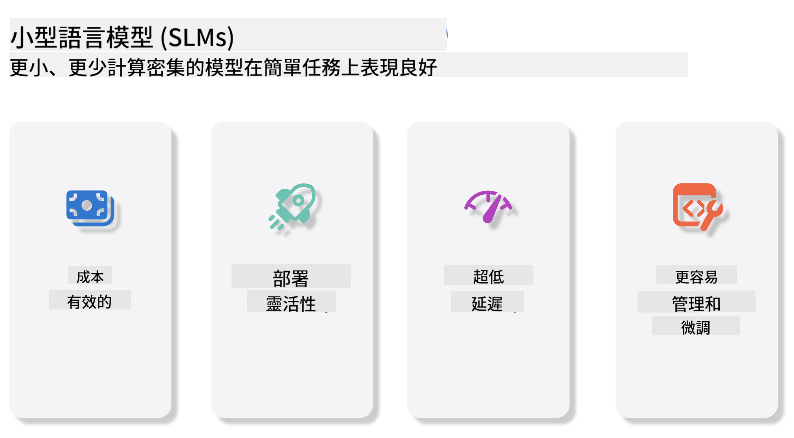
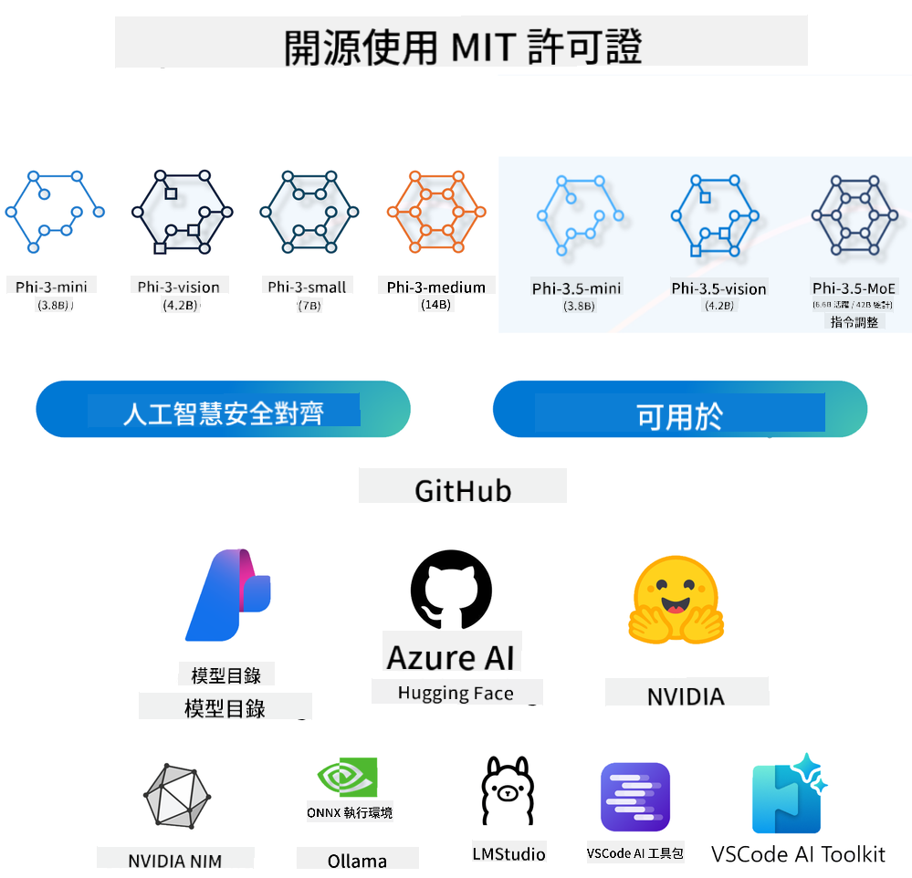
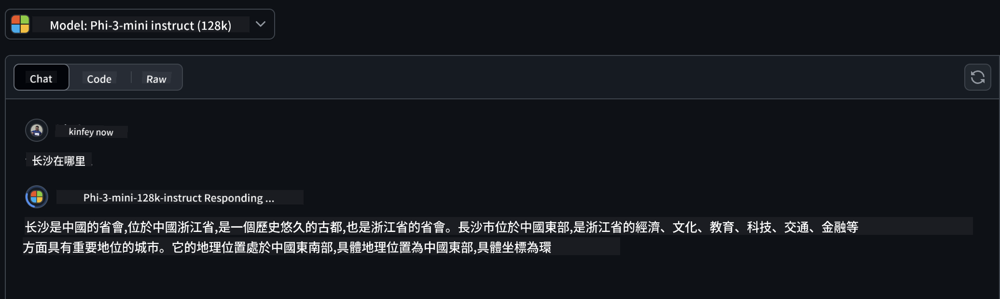
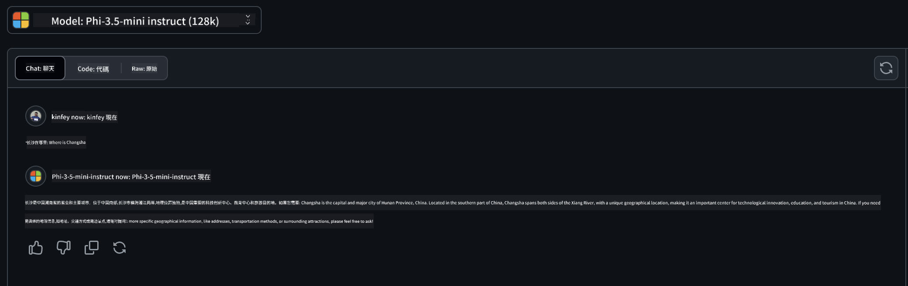

<!--
CO_OP_TRANSLATOR_METADATA:
{
  "original_hash": "124ad36cfe96f74038811b6e2bb93e9d",
  "translation_date": "2025-05-20T09:16:45+00:00",
  "source_file": "19-slm/README.md",
  "language_code": "hk"
}
-->
# 初學者生成式 AI 的小語言模型介紹

生成式 AI 是人工智能的一個迷人領域，專注於創建能夠生成新內容的系統。這些內容可以從文本和圖像到音樂，甚至整個虛擬環境。生成式 AI 最令人興奮的應用之一是在語言模型的領域。

## 什麼是小語言模型？

小語言模型（SLM）代表了一種縮小版的大語言模型（LLM），利用了許多 LLM 的架構原則和技術，同時展現出顯著減少的計算足跡。SLM 是一種語言模型的子集，設計用來生成類似人類的文本。與其較大的對應物（如 GPT-4）不同，SLM 更緊湊和高效，使其成為計算資源有限的應用程序的理想選擇。儘管其尺寸較小，它們仍然可以執行各種任務。通常，SLM 是通過壓縮或蒸餾 LLM 構建的，旨在保留原始模型功能和語言能力的大部分。這種模型尺寸的減少降低了整體複雜性，使 SLM 在內存使用和計算需求方面更高效。儘管有這些優化，SLM 仍然可以執行廣泛的自然語言處理（NLP）任務：
- 文本生成：創建連貫且上下文相關的句子或段落。
- 文本補全：根據給定的提示預測和完成句子。
- 翻譯：將文本從一種語言轉換為另一種語言。
- 摘要：將長文本壓縮為更短、更易消化的摘要。

儘管與其較大的對應物相比，在性能或理解深度上有一些取捨。

## 小語言模型如何運作？

SLM 是在大量文本數據上訓練的。在訓練過程中，它們學習語言的模式和結構，使其能夠生成語法正確且上下文適當的文本。訓練過程包括：
- 數據收集：從各種來源收集大量文本數據。
- 預處理：清理和組織數據，使其適合訓練。
- 訓練：使用機器學習算法教模型如何理解和生成文本。
- 微調：調整模型以提高其在特定任務上的性能。

SLM 的開發符合在資源受限環境中部署模型的日益增長的需求，例如移動設備或邊緣計算平台，在這些平台上，完整的 LLM 可能由於其資源需求過高而不切實際。通過專注於效率，SLM 在性能和可訪問性之間取得平衡，使其能夠在各個領域中廣泛應用。



## 學習目標

在本課中，我們希望介紹 SLM 的知識，並將其與 Microsoft Phi-3 結合，學習文本內容、視覺和 MoE 的不同場景。通過本課，你應該能夠回答以下問題：
- 什麼是 SLM
- SLM 和 LLM 的區別是什麼
- 什麼是 Microsoft Phi-3/3.5 系列
- 如何推理 Microsoft Phi-3/3.5 系列

準備好了嗎？讓我們開始吧。

## 大語言模型（LLM）和小語言模型（SLM）之間的區別

LLM 和 SLM 都建立在概率機器學習的基礎原則之上，在其架構設計、訓練方法、數據生成過程和模型評估技術上採取相似的方法。然而，這兩種類型的模型之間存在幾個關鍵差異。

## 小語言模型的應用

SLM 有廣泛的應用，包括：
- 聊天機器人：以對話方式提供客戶支持和與用戶互動。
- 內容創作：通過生成想法甚至撰寫整篇文章來協助作家。
- 教育：幫助學生完成寫作作業或學習新語言。
- 無障礙：創建供殘疾人士使用的工具，如文本轉語音系統。

**尺寸**

LLM 和 SLM 之間的主要區別在於模型的規模。LLM，如 ChatGPT（GPT-4），可以包含估計 1.76 萬億個參數，而開源 SLM 如 Mistral 7B 的設計參數顯著更少——大約 70 億。這種差異主要是由於模型架構和訓練過程的差異。例如，ChatGPT 在編碼器-解碼器框架內使用自注意力機制，而 Mistral 7B 使用滑動窗口注意力，這使得在僅解碼器模型內進行更高效的訓練。這種架構差異對這些模型的複雜性和性能有深遠影響。

**理解**

SLM 通常針對特定領域的性能進行優化，使其高度專業化，但在提供跨多個知識領域的廣泛上下文理解能力方面可能有限。相比之下，LLM 旨在在更全面的水平上模擬類似人類的智能。在大量、多樣化的數據集上訓練，LLM 被設計為在各個領域中表現良好，提供更大的多功能性和適應性。因此，LLM 更適合於更廣泛的下游任務，如自然語言處理和編程。

**計算**

LLM 的訓練和部署是資源密集型過程，通常需要大量的計算基礎設施，包括大規模 GPU 集群。例如，從頭開始訓練像 ChatGPT 這樣的模型可能需要數千個 GPU 經過長時間的運行。相比之下，SLM 由於其較小的參數數量，在計算資源方面更具可訪問性。像 Mistral 7B 這樣的模型可以在配備中等 GPU 能力的本地機器上進行訓練和運行，儘管訓練仍然需要在多個 GPU 上花費數小時。

**偏見**

偏見是 LLM 的一個已知問題，主要是由於訓練數據的性質。這些模型通常依賴於來自互聯網的原始、公開可用數據，這可能會低估或錯誤表示某些群體，引入錯誤標籤，或反映受方言、地理變異和語法規則影響的語言偏見。此外，LLM 架構的複雜性可能會無意中加劇偏見，如果不仔細微調，這可能會被忽視。另一方面，SLM 由於在更受限的、特定領域的數據集上進行訓練，固有地不太容易受到這些偏見的影響，儘管它們並非免疫。

**推理**

SLM 的尺寸減小使其在推理速度方面具有顯著優勢，允許其在本地硬件上高效生成輸出，而無需大量的並行處理。相比之下，由於其尺寸和複雜性，LLM 通常需要大量的並行計算資源來實現可接受的推理時間。多個並發用戶的存在進一步減慢了 LLM 的響應時間，尤其是在大規模部署時。

總之，雖然 LLM 和 SLM 都在機器學習的基礎上共享，但它們在模型尺寸、資源需求、上下文理解、偏見易感性和推理速度方面存在顯著差異。這些區別反映了它們在不同用例中的適用性，LLM 更加多功能但資源密集，而 SLM 則提供更具領域特定的效率和較低的計算需求。

***注意：在本章中，我們將以 Microsoft Phi-3 / 3.5 作為例子來介紹 SLM。***

## Phi-3 / Phi-3.5 系列介紹

Phi-3 / 3.5 系列主要針對文本、視覺和代理（MoE）應用場景：

### Phi-3 / 3.5 指導

主要用於文本生成、聊天完成和內容信息提取等。

**Phi-3-mini**

這款 3.8B 語言模型可在 Microsoft Azure AI Studio、Hugging Face 和 Ollama 上獲得。Phi-3 模型在關鍵基準測試上顯著超越同等和更大尺寸的語言模型（見下方基準數字，數字越高越好）。Phi-3-mini 超越了比其大兩倍的模型，而 Phi-3-small 和 Phi-3-medium 則超越了更大的模型，包括 GPT-3.5。

**Phi-3-small & medium**

Phi-3-small 僅有 7B 參數，在各種語言、推理、編碼和數學基準上擊敗了 GPT-3.5T。Phi-3-medium 擁有 14B 參數，繼續這一趨勢，並超越了 Gemini 1.0 Pro。

**Phi-3.5-mini**

我們可以將其視為 Phi-3-mini 的升級版。雖然參數保持不變，但它提高了支持多種語言的能力（支持 20 多種語言：阿拉伯語、中文、捷克語、丹麥語、荷蘭語、英語、芬蘭語、法語、德語、希伯來語、匈牙利語、意大利語、日語、韓語、挪威語、波蘭語、葡萄牙語、俄語、西班牙語、瑞典語、泰語、土耳其語、烏克蘭語）並增加了對長上下文的更強支持。Phi-3.5-mini 擁有 3.8B 參數，超越了同尺寸的語言模型，並與尺寸大兩倍的模型相當。

### Phi-3 / 3.5 視覺

我們可以將 Phi-3/3.5 的指導模型視為 Phi 理解能力，而視覺則賦予 Phi 理解世界的眼睛。

**Phi-3-Vision**

Phi-3-vision 僅有 4.2B 參數，繼續這一趨勢，在一般視覺推理任務、OCR 和表格及圖表理解任務上超越了更大的模型，如 Claude-3 Haiku 和 Gemini 1.0 Pro V。

**Phi-3.5-Vision**

Phi-3.5-Vision 也是 Phi-3-Vision 的升級版，增加了對多張圖像的支持。您可以將其視為視覺的改進，不僅可以查看圖片，還可以查看視頻。Phi-3.5-vision 在 OCR、表格和圖表理解任務上超越了更大的模型，如 Claude-3.5 Sonnet 和 Gemini 1.5 Flash，並在一般視覺知識推理任務上相當。支持多幀輸入，即對多個輸入圖像進行推理。

### Phi-3.5-MoE

***專家混合（MoE）*** 使模型能夠以更少的計算預訓練，這意味著您可以在與密集模型相同的計算預算下大幅擴展模型或數據集的大小。特別是，MoE 模型在預訓練期間應能更快地達到與其密集對應物相同的質量。Phi-3.5-MoE 包含 16x3.8B 專家模塊。Phi-3.5-MoE 僅用 6.6B 活動參數實現了類似於更大模型的推理、語言理解和數學水平。

我們可以根據不同場景使用 Phi-3/3.5 系列模型。與 LLM 不同，您可以在邊緣設備上部署 Phi-3/3.5-mini 或 Phi-3/3.5-Vision。

## 如何使用 Phi-3/3.5 系列模型

我們希望在不同的場景中使用 Phi-3/3.5。接下來，我們將根據不同的場景使用 Phi-3/3.5。



### 推理差異

雲的 API

**GitHub 模型**

GitHub
Models係最直接嘅方法。你可以透過GitHub Models快速訪問Phi-3/3.5-Instruct模型。結合Azure AI Inference SDK/OpenAI SDK，你可以通過代碼訪問API完成Phi-3/3.5-Instruct調用。你仲可以通過Playground測試唔同效果。- Demo: Phi-3-mini同Phi-3.5-mini喺中文場景嘅效果比較   **Azure AI Studio** 或者如果我哋想使用Vision同MoE模型，你可以使用Azure AI Studio完成調用。如果你有興趣，你可以閱讀Phi-3 Cookbook學習如何通過Azure AI Studio調用Phi-3/3.5 Instruct、Vision、MoE [點擊呢個鏈接](https://github.com/microsoft/Phi-3CookBook/blob/main/md/02.QuickStart/AzureAIStudio_QuickStart.md?WT.mc_id=academic-105485-koreyst) **NVIDIA NIM** 除咗Azure同GitHub提供嘅基於雲端嘅模型目錄解決方案，你仲可以使用[Nivida NIM](https://developer.nvidia.com/nim?WT.mc_id=academic-105485-koreyst)完成相關調用。你可以訪問NIVIDA NIM完成Phi-3/3.5系列嘅API調用。NVIDIA NIM（NVIDIA推理微服務）係一套加速推理微服務，旨喺幫助開發者高效地喺各種環境中部署AI模型，包括雲端、數據中心同工作站。以下係NVIDIA NIM嘅一些關鍵特點：- **部署簡易性：** NIM允許通過單個命令部署AI模型，使其容易集成到現有工作流程中。- **性能優化：** 它利用NVIDIA預先優化嘅推理引擎，如TensorRT同TensorRT-LLM，以確保低延遲同高吞吐量。- **可擴展性：** NIM支持喺Kubernetes上自動擴展，使其能夠有效地處理變化嘅工作負載。- **安全同控制：** 組織可以通過喺自己管理嘅基礎設施上自托管NIM微服務來保持對其數據同應用嘅控制。- **標準API：** NIM提供行業標準API，使其容易構建同集成AI應用，如聊天機器人、AI助手等。NIM係NVIDIA AI Enterprise嘅一部分，旨喺簡化AI模型嘅部署同運營化，確保其喺NVIDIA GPU上高效運行。- Demo: 使用Nividia NIM調用Phi-3.5-Vision-API [[點擊呢個鏈接](../../../19-slm/python/Phi-3-Vision-Nividia-NIM.ipynb)] ### 喺本地環境推理Phi-3/3.5 推理與Phi-3或任何語言模型如GPT-3相關，指根據其接收嘅輸入生成回應或預測嘅過程。當你提供提示或問題俾Phi-3時，它使用其訓練嘅神經網絡通過分析其訓練數據中嘅模式同關係來推斷最可能同相關嘅回應。 **Hugging Face Transformer** Hugging Face Transformers係一個為自然語言處理（NLP）同其他機器學習任務設計嘅強大庫。以下係關於佢嘅一些重點：1. **預訓練模型：** 它提供數千個預訓練模型，可用於各種任務，如文本分類、命名實體識別、問題回答、摘要、翻譯同文本生成。2. **框架互操作性：** 該庫支持多個深度學習框架，包括PyTorch、TensorFlow同JAX。這使你可以喺一個框架中訓練模型並喺另一個框架中使用。3. **多模態能力：** 除咗NLP，Hugging Face Transformers仲支持計算機視覺（例如圖像分類、物體檢測）同音頻處理（例如語音識別、音頻分類）嘅任務。4. **易用性：** 該庫提供API同工具，容易下載同微調模型，使其對初學者同專家都可訪問。5. **社區同資源：** Hugging Face擁有活躍嘅社區同豐富嘅文檔、教程同指南，以幫助用戶開始並充分利用該庫。[官方文檔](https://huggingface.co/docs/transformers/index?WT.mc_id=academic-105485-koreyst)或者佢哋嘅[GitHub存儲庫](https://github.com/huggingface/transformers?WT.mc_id=academic-105485-koreyst)。這係最常用嘅方法，但亦需要GPU加速。畢竟，像Vision同MoE嘅場景需要大量計算，如果唔係量化嘅話喺CPU中會非常有限。- Demo: 使用Transformer調用Phi-3.5-Instuct [點擊呢個鏈接](../../../19-slm/python/phi35-instruct-demo.ipynb) - Demo: 使用Transformer調用Phi-3.5-Vision[點擊呢個鏈接](../../../19-slm/python/phi35-vision-demo.ipynb) - Demo: 使用Transformer調用Phi-3.5-MoE[點擊呢個鏈接](../../../19-slm/python/phi35_moe_demo.ipynb) **Ollama** [Ollama](https://ollama.com/?WT.mc_id=academic-105485-koreyst)係一個旨喺使本地運行大型語言模型（LLMs）更容易嘅平台。它支持各種模型，如Llama 3.1、Phi 3、Mistral同Gemma 2等。該平台通過將模型權重、配置同數據捆綁成一個單一包來簡化過程，使其對用戶更可訪問以定制同創建自己嘅模型。Ollama可用於macOS、Linux同Windows。如果你想實驗或部署LLMs而唔依賴雲服務，這係一個很棒嘅工具。Ollama係最直接嘅方法，你只需要執行以下語句。```bash

ollama run phi3.5

``` **ONNX Runtime for GenAI** [ONNX Runtime](https://github.com/microsoft/onnxruntime-genai?WT.mc_id=academic-105485-koreyst)係一個跨平台推理同訓練機器學習加速器。ONNX Runtime for Generative AI (GENAI)係一個強大嘅工具，幫助你喺各種平台上高效地運行生成性AI模型。## 乜嘢係ONNX Runtime? ONNX Runtime係一個開源項目，支持機器學習模型嘅高性能推理。它支持Open Neural Network Exchange (ONNX)格式嘅模型，這係表示機器學習模型嘅標準。ONNX Runtime推理可以支持來自深度學習框架如PyTorch同TensorFlow/Keras以及經典機器學習庫如scikit-learn、LightGBM、XGBoost等嘅模型，從而實現更快嘅客戶體驗同降低成本。ONNX Runtime兼容不同嘅硬件、驅動同操作系統，並通過利用硬件加速器（如果適用）同圖優化同轉換提供最佳性能## 乜嘢係生成性AI？生成性AI指能夠根據訓練嘅數據生成新內容（例如文本、圖像或音樂）嘅AI系統。例子包括語言模型如GPT-3同圖像生成模型如Stable Diffusion。ONNX Runtime for GenAI庫提供ONNX模型嘅生成性AI循環，包括使用ONNX Runtime進行推理、logits處理、搜索同採樣同KV緩存管理。## ONNX Runtime for GENAI ONNX Runtime for GENAI擴展咗ONNX Runtime嘅能力，以支持生成性AI模型。以下係一些關鍵特點：- **廣泛平台支持：** 它可以喺各種平台上工作，包括Windows、Linux、macOS、Android同iOS。- **模型支持：** 它支持許多流行嘅生成性AI模型，如LLaMA、GPT-Neo、BLOOM等。- **性能優化：** 它包括對唔同硬件加速器（如NVIDIA GPUs、AMD GPUs等）嘅優化。- **易用性：** 它提供API以便容易集成到應用中，允許你用最少代碼生成文本、圖像同其他內容。- 用戶可以調用高級generate()方法，或者喺循環中運行模型嘅每次迭代，每次生成一個token，並可選擇喺循環中更新生成參數。- ONNX runtime仲支持貪婪/beam搜索同TopP、TopK採樣以生成token序列同內置logits處理如重複懲罰。你亦可以容易地添加自定義評分。## 開始使用 要開始使用ONNX Runtime for GENAI，你可以遵循以下步驟：### 安裝ONNX Runtime: ```Python
pip install onnxruntime
``` ### 安裝生成性AI擴展: ```Python
pip install onnxruntime-genai
``` ### 運行模型: 以下係Python中嘅簡單示例：```Python
import onnxruntime_genai as og

model = og.Model('path_to_your_model.onnx')

tokenizer = og.Tokenizer(model)

input_text = "Hello, how are you?"

input_tokens = tokenizer.encode(input_text)

output_tokens = model.generate(input_tokens)

output_text = tokenizer.decode(output_tokens)

print(output_text) 
``` ### Demo: 使用ONNX Runtime GenAI調用Phi-3.5-Vision ```python

import onnxruntime_genai as og

model_path = './Your Phi-3.5-vision-instruct ONNX Path'

img_path = './Your Image Path'

model = og.Model(model_path)

processor = model.create_multimodal_processor()

tokenizer_stream = processor.create_stream()

text = "Your Prompt"

prompt = "<|user|>\n"

prompt += "<|image_1|>\n"

prompt += f"{text}<|end|>\n"

prompt += "<|assistant|>\n"

image = og.Images.open(img_path)

inputs = processor(prompt, images=image)

params = og.GeneratorParams(model)

params.set_inputs(inputs)

params.set_search_options(max_length=3072)

generator = og.Generator(model, params)

while not generator.is_done():

    generator.compute_logits()
    
    generator.generate_next_token()

    new_token = generator.get_next_tokens()[0]
    
    code += tokenizer_stream.decode(new_token)
    
    print(tokenizer_stream.decode(new_token), end='', flush=True)

``` **其他** 除咗ONNX Runtime同Ollama參考方法，我哋仲可以根據唔同製造商提供嘅模型參考方法完成定量模型嘅參考。比如Apple MLX框架同Apple Metal、Qualcomm QNN同NPU、Intel OpenVINO同CPU/GPU等。你仲可以從[Phi-3 Cookbook](https://github.com/microsoft/phi-3cookbook?WT.mc_id=academic-105485-koreyst)獲得更多內容 ## 更多 我哋已經學習咗Phi-3/3.5系列嘅基本知識，但要學習更多關於SLM嘅知識，我哋需要更多知識。你可以喺Phi-3 Cookbook中找到答案。如果你想學習更多，請訪問[Phi-3 Cookbook](https://github.com/microsoft/phi-3cookbook?WT.mc_id=academic-105485-koreyst)。

**免責聲明**：  
此文件已使用AI翻譯服務[Co-op Translator](https://github.com/Azure/co-op-translator)進行翻譯。我們努力確保準確性，但請注意，自動翻譯可能包含錯誤或不準確之處。原文應被視為權威來源。對於關鍵信息，建議使用專業人工翻譯。我們對因使用此翻譯而產生的任何誤解或誤讀概不負責。