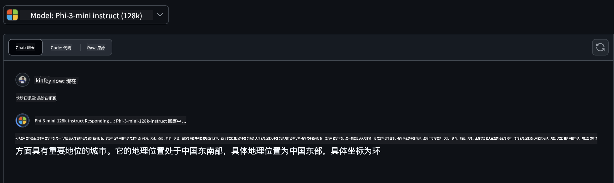
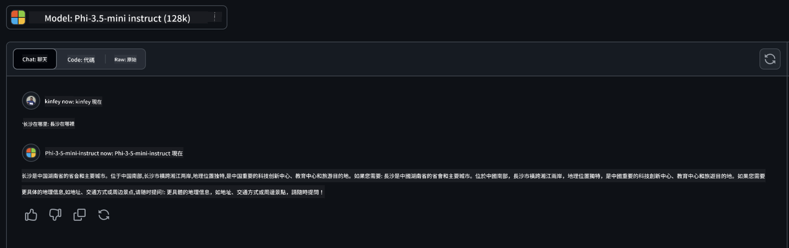

<!--
CO_OP_TRANSLATOR_METADATA:
{
  "original_hash": "124ad36cfe96f74038811b6e2bb93e9d",
  "translation_date": "2025-06-26T01:44:53+00:00",
  "source_file": "19-slm/README.md",
  "language_code": "hk"
}
-->

模型是最直接的方法。你可以通過 GitHub Models 快速訪問 Phi-3/3.5-Instruct 模型。結合 Azure AI Inference SDK / OpenAI SDK，你可以通過代碼訪問 API 來完成 Phi-3/3.5-Instruct 調用。你還可以通過 Playground 測試不同效果。- 演示：Phi-3-mini 和 Phi-3.5-mini 在中文場景中的效果比較   **Azure AI Studio** 或者如果我們想使用視覺和 MoE 模型，你可以使用 Azure AI Studio 完成調用。如果你有興趣，你可以閱讀 Phi-3 Cookbook 來了解如何通過 Azure AI Studio 調用 Phi-3/3.5 Instruct、Vision、MoE [點擊此鏈接](https://github.com/microsoft/Phi-3CookBook/blob/main/md/02.QuickStart/AzureAIStudio_QuickStart.md?WT.mc_id=academic-105485-koreyst) **NVIDIA NIM** 除了 Azure 和 GitHub 提供的基於雲的模型目錄解決方案外，你還可以使用 [Nivida NIM](https://developer.nvidia.com/nim?WT.mc_id=academic-105485-koreyst) 完成相關調用。你可以訪問 NIVIDA NIM 完成 Phi-3/3.5 家族的 API 調用。NVIDIA NIM（NVIDIA Inference Microservices）是一組加速推理微服務，旨在幫助開發者在各種環境中高效部署 AI 模型，包括雲、數據中心和工作站。以下是 NVIDIA NIM 的一些關鍵特點：- **易於部署：** NIM 允許使用單個命令部署 AI 模型，使其易於集成到現有工作流程中。- **優化性能：** 它利用 NVIDIA 的預優化推理引擎，如 TensorRT 和 TensorRT-LLM，確保低延遲和高吞吐量。- **可擴展性：** NIM 支持 Kubernetes 上的自動擴展，使其能夠有效地處理不同的工作負載。- **安全性和控制：** 組織可以通過在自己的管理基礎設施上自託管 NIM 微服務來保持對其數據和應用的控制。- **標準 API：** NIM 提供行業標準 API，使得構建和集成 AI 應用（如聊天機器人、AI 助理等）變得容易。NIM 是 NVIDIA AI Enterprise 的一部分，旨在簡化 AI 模型的部署和運營，確保它們在 NVIDIA GPU 上高效運行。- 演示：使用 Nividia NIM 調用 Phi-3.5-Vision-API [[點擊此鏈接](../../../19-slm/python/Phi-3-Vision-Nividia-NIM.ipynb)] ### 在本地環境中推理 Phi-3/3.5 與 Phi-3 或任何語言模型如 GPT-3 相關的推理是指根據接收到的輸入生成回應或預測的過程。當你向 Phi-3 提供提示或問題時，它使用其訓練的神經網絡通過分析其訓練數據中的模式和關係來推斷最可能和最相關的回應。**Hugging Face Transformer** Hugging Face Transformers 是一個為自然語言處理（NLP）和其他機器學習任務設計的強大庫。以下是一些關鍵點：1. **預訓練模型：** 它提供數千個預訓練模型，可用於各種任務，如文本分類、命名實體識別、問題回答、摘要、翻譯和文本生成。2. **框架互操作性：** 該庫支持多個深度學習框架，包括 PyTorch、TensorFlow 和 JAX。這允許你在一個框架中訓練模型並在另一個框架中使用它。3. **多模態能力：** 除了 NLP，Hugging Face Transformers 還支持計算機視覺（如圖像分類、物體檢測）和音頻處理（如語音識別、音頻分類）中的任務。4. **易於使用：** 該庫提供 API 和工具來輕鬆下載和微調模型，使其對初學者和專家都可訪問。5. **社群和資源：** Hugging Face 擁有一個充滿活力的社群和豐富的文檔、教程和指南，幫助用戶入門並充分利用該庫。[官方文檔](https://huggingface.co/docs/transformers/index?WT.mc_id=academic-105485-koreyst) 或他們的 [GitHub 存儲庫](https://github.com/huggingface/transformers?WT.mc_id=academic-105485-koreyst)。這是最常用的方法，但它也需要 GPU 加速。畢竟，像 Vision 和 MoE 這樣的場景需要大量計算，如果不進行量化，將在 CPU 上非常有限。- 演示：使用 Transformer 調用 Phi-3.5-Instuct [點擊此鏈接](../../../19-slm/python/phi35-instruct-demo.ipynb)- 演示：使用 Transformer 調用 Phi-3.5-Vision[點擊此鏈接](../../../19-slm/python/phi35-vision-demo.ipynb)- 演示：使用 Transformer 調用 Phi-3.5-MoE[點擊此鏈接](../../../19-slm/python/phi35_moe_demo.ipynb) **Ollama** [Ollama](https://ollama.com/?WT.mc_id=academic-105485-koreyst) 是一個平台，旨在使本地在你的機器上運行大型語言模型（LLMs）變得更容易。它支持各種模型，如 Llama 3.1、Phi 3、Mistral 和 Gemma 2 等。該平台通過將模型權重、配置和數據捆綁成單個包來簡化過程，使用戶更容易定制和創建自己的模型。Ollama 適用於 macOS、Linux 和 Windows。如果你想在不依賴雲服務的情況下實驗或部署 LLMs，這是一個很好的工具。Ollama 是最直接的方法，你只需執行以下語句。```bash

ollama run phi3.5

``` **ONNX Runtime for GenAI** [ONNX Runtime](https://github.com/microsoft/onnxruntime-genai?WT.mc_id=academic-105485-koreyst) 是一個跨平台推理和訓練機器學習加速器。ONNX Runtime for Generative AI (GENAI) 是一個強大的工具，幫助你在各種平台上高效運行生成性 AI 模型。## 什麼是 ONNX Runtime？ONNX Runtime 是一個開源項目，支持高性能推理機器學習模型。它支持 Open Neural Network Exchange (ONNX) 格式的模型，這是一種表示機器學習模型的標準。ONNX Runtime 推理可以提供更快的客戶體驗和更低的成本，支持來自深度學習框架如 PyTorch 和 TensorFlow/Keras 以及傳統機器學習庫如 scikit-learn、LightGBM、XGBoost 等的模型。ONNX Runtime 與不同的硬件、驅動和操作系統兼容，通過利用硬件加速器（如適用）以及圖形優化和轉換提供最佳性能。## 什麼是生成性 AI？生成性 AI 指的是能夠根據訓練數據生成新內容（如文本、圖像或音樂）的 AI 系統。例子包括像 GPT-3 這樣的語言模型和像 Stable Diffusion 這樣的圖像生成模型。ONNX Runtime for GenAI 庫為 ONNX 模型提供生成性 AI 循環，包括使用 ONNX Runtime 進行推理、logits 處理、搜索和採樣以及 KV 緩存管理。## ONNX Runtime for GENAI ONNX Runtime for GENAI 擴展了 ONNX Runtime 的功能，以支持生成性 AI 模型。以下是一些關鍵特點：- **廣泛的平台支持：** 它在多個平台上運行，包括 Windows、Linux、macOS、Android 和 iOS。- **模型支持：** 它支持許多流行的生成性 AI 模型，如 LLaMA、GPT-Neo、BLOOM 等。- **性能優化：** 它包括對不同硬件加速器（如 NVIDIA GPU、AMD GPU 等）的優化。- **易於使用：** 它提供 API 以便輕鬆集成到應用中，允許你用最少的代碼生成文本、圖像和其他內容- 用戶可以調用高級 generate() 方法，或者在循環中運行模型的每次迭代，每次生成一個 token，並在循環內可選地更新生成參數。- ONNX runtime 還支持貪婪/束搜索和 TopP、TopK 採樣來生成 token 序列以及內置的 logits 處理如重複懲罰。你還可以輕鬆添加自定義評分。## 入門要開始使用 ONNX Runtime for GENAI，你可以按照以下步驟：### 安裝 ONNX Runtime：```Python
pip install onnxruntime
``` ### 安裝生成性 AI 擴展：```Python
pip install onnxruntime-genai
``` ### 運行模型：這是一個簡單的 Python 示例：```Python
import onnxruntime_genai as og

model = og.Model('path_to_your_model.onnx')

tokenizer = og.Tokenizer(model)

input_text = "Hello, how are you?"

input_tokens = tokenizer.encode(input_text)

output_tokens = model.generate(input_tokens)

output_text = tokenizer.decode(output_tokens)

print(output_text) 
``` ### 演示：使用 ONNX Runtime GenAI 調用 Phi-3.5-Vision ```python

import onnxruntime_genai as og

model_path = './Your Phi-3.5-vision-instruct ONNX Path'

img_path = './Your Image Path'

model = og.Model(model_path)

processor = model.create_multimodal_processor()

tokenizer_stream = processor.create_stream()

text = "Your Prompt"

prompt = "<|user|>\n"

prompt += "<|image_1|>\n"

prompt += f"{text}<|end|>\n"

prompt += "<|assistant|>\n"

image = og.Images.open(img_path)

inputs = processor(prompt, images=image)

params = og.GeneratorParams(model)

params.set_inputs(inputs)

params.set_search_options(max_length=3072)

generator = og.Generator(model, params)

while not generator.is_done():

    generator.compute_logits()
    
    generator.generate_next_token()

    new_token = generator.get_next_tokens()[0]
    
    code += tokenizer_stream.decode(new_token)
    
    print(tokenizer_stream.decode(new_token), end='', flush=True)

``` **其他** 除了 ONNX Runtime 和 Ollama 參考方法外，我們還可以基於不同製造商提供的模型參考方法完成量化模型的參考。如 Apple MLX 框架與 Apple Metal、Qualcomm QNN 與 NPU、Intel OpenVINO 與 CPU/GPU 等。你還可以從 [Phi-3 Cookbook](https://github.com/microsoft/phi-3cookbook?WT.mc_id=academic-105485-koreyst) 獲得更多內容。## 更多我們已經學習了 Phi-3/3.5 家族的基礎知識，但要了解更多關於 SLM 的內容，我們需要更多知識。你可以在 Phi-3 Cookbook 中找到答案。如果你想了解更多，請訪問 [Phi-3 Cookbook](https://github.com/microsoft/phi-3cookbook?WT.mc_id=academic-105485-koreyst)。

**免責聲明**：  
本文件是使用AI翻譯服務[Co-op Translator](https://github.com/Azure/co-op-translator)進行翻譯的。儘管我們力求準確，但請注意，自動翻譯可能包含錯誤或不準確之處。應將原文檔的母語版本視為權威來源。對於關鍵信息，建議尋求專業人工翻譯。我們對因使用此翻譯而引起的任何誤解或誤譯不承擔責任。