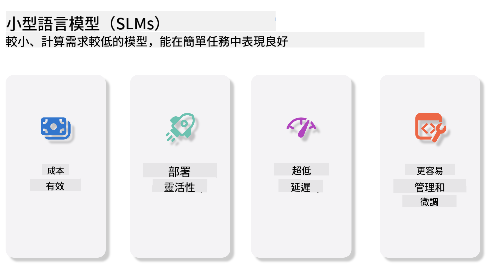
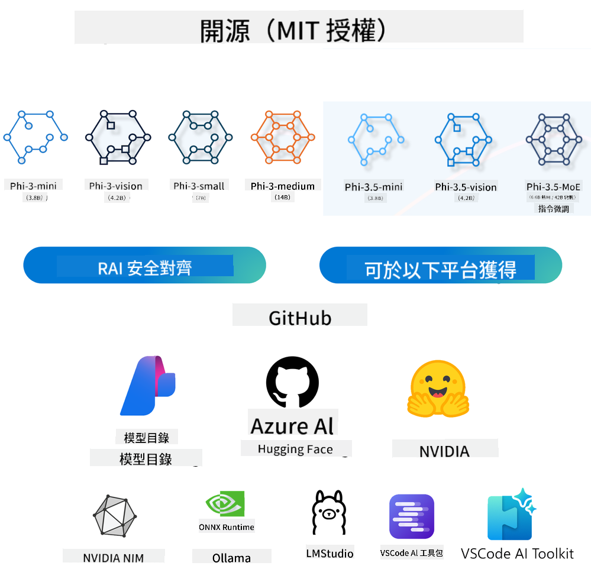
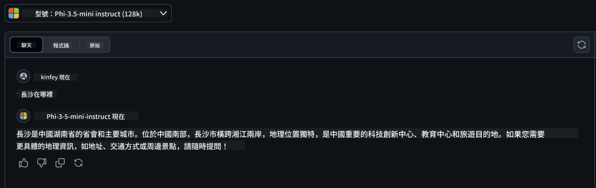

<!--
CO_OP_TRANSLATOR_METADATA:
{
  "original_hash": "124ad36cfe96f74038811b6e2bb93e9d",
  "translation_date": "2025-07-09T18:21:35+00:00",
  "source_file": "19-slm/README.md",
  "language_code": "hk"
}
-->
# 初學者生成式 AI 小型語言模型入門  
生成式 AI 是人工智能中一個令人著迷的領域，專注於創建能夠生成新內容的系統。這些內容可以涵蓋文字、圖像、音樂，甚至整個虛擬環境。生成式 AI 最令人興奮的應用之一，就是語言模型領域。

## 什麼是小型語言模型？  
小型語言模型（SLM）是大型語言模型（LLM）的縮小版本，採用了許多大型模型的架構原理和技術，但計算資源需求大幅降低。

SLM 是一類專門用來生成類似人類語言文本的語言模型。與 GPT-4 等大型模型相比，SLM 更加精簡且高效，適合在計算資源有限的場景中使用。儘管體積較小，它們仍能執行多種任務。通常，SLM 是通過壓縮或蒸餾大型語言模型而來，目標是保留原模型大部分功能和語言能力。模型規模的縮小降低了整體複雜度，使 SLM 在記憶體使用和計算需求上更為高效。經過這些優化後，SLM 仍能完成多種自然語言處理（NLP）任務：

- 文字生成：創造連貫且符合語境的句子或段落。  
- 文字補全：根據提示預測並完成句子。  
- 翻譯：將文字從一種語言轉換成另一種語言。  
- 摘要：將冗長的文字濃縮成簡短易懂的摘要。  

當然，相較於大型模型，SLM 在性能或理解深度上會有一定的取捨。

## 小型語言模型如何運作？  
SLM 透過大量文本數據進行訓練。在訓練過程中，模型學習語言的模式和結構，使其能生成語法正確且符合語境的文字。訓練流程包括：

- 數據收集：從多種來源蒐集大量文本資料。  
- 預處理：清理並整理數據，使其適合訓練。  
- 訓練：利用機器學習算法教模型理解並生成文字。  
- 微調：調整模型以提升特定任務的表現。  

SLM 的發展符合在資源受限環境（如行動裝置或邊緣運算平台）部署模型的需求，因為大型模型在這些場景中往往因資源消耗過大而不切實際。SLM 著重效率，平衡性能與可用性，促進在各領域的廣泛應用。



## 學習目標  
本課程旨在介紹 SLM 的基本知識，並結合 Microsoft Phi-3，學習文字內容、視覺及 MoE 等不同應用場景。

完成本課程後，你應該能回答以下問題：

- 什麼是 SLM  
- SLM 與 LLM 有何不同  
- 什麼是 Microsoft Phi-3/3.5 系列  
- 如何推理 Microsoft Phi-3/3.5 系列  

準備好了嗎？讓我們開始吧。

## 大型語言模型（LLM）與小型語言模型（SLM）的區別  
LLM 與 SLM 都基於機率機器學習的基本原理，架構設計、訓練方法、數據生成流程及模型評估技術相似，但兩者在幾個關鍵方面存在差異。

## 小型語言模型的應用  
SLM 有廣泛的應用，包括：

- 聊天機器人：提供客戶支援，與用戶進行對話互動。  
- 內容創作：協助作家產生靈感或撰寫文章草稿。  
- 教育：幫助學生完成寫作作業或學習新語言。  
- 無障礙輔助：為有障礙人士打造工具，如文字轉語音系統。  

**規模**  
LLM 與 SLM 最大的差異在於模型規模。LLM（如 ChatGPT GPT-4）參數量約達 1.76 兆，而開源的 SLM（如 Mistral 7B）參數量約為 70 億。這主要源於架構和訓練流程的不同。例如，ChatGPT 採用編碼器-解碼器架構中的自注意力機制，而 Mistral 7B 則使用滑動窗口注意力，能在僅解碼器架構中更有效率地訓練。這種架構差異對模型的複雜度和性能有深遠影響。

**理解能力**  
SLM 通常針對特定領域優化，專精度高但在跨領域的廣泛語境理解上可能有限。相對地，LLM 旨在模擬更全面的人類智能，透過龐大且多元的數據集訓練，能在多個領域表現出色，具備更高的多功能性和適應性。因此，LLM 更適合用於多樣化的下游任務，如自然語言處理和程式設計。

**計算需求**  
LLM 的訓練與部署資源消耗巨大，通常需要龐大的 GPU 叢集。例如，從零開始訓練 ChatGPT 可能需數千張 GPU 持續運算數週。相比之下，SLM 參數較少，對計算資源的需求較低。像 Mistral 7B 這類模型可在配備中階 GPU 的本地機器上訓練和運行，但訓練仍需數小時並使用多張 GPU。

**偏見問題**  
LLM 偏見問題主要源自訓練數據的特性。這些模型多依賴網路上公開的原始數據，可能存在對某些群體的低代表性或錯誤標註，並受方言、地理差異及語法規則影響的語言偏見。此外，LLM 複雜的架構可能無意中加劇偏見，若未經細心微調，偏見問題難以察覺。相較之下，SLM 由於訓練數據較為受限且專注於特定領域，偏見風險較低，但仍不可完全排除。

**推理速度**  
SLM 較小的模型規模使其在推理速度上具明顯優勢，能在本地硬體上高效生成結果，無需大量並行運算。反觀 LLM，因體積龐大且結構複雜，通常需大量並行計算資源才能達到可接受的推理時間。多用戶同時使用時，LLM 的回應速度更容易受到影響。

總結來說，LLM 與 SLM 雖同屬機器學習基礎，但在模型大小、資源需求、語境理解、偏見敏感度及推理速度上有顯著差異。這些差異反映了它們在不同應用場景的適用性：LLM 多功能但資源密集，SLM 則在特定領域提供更高效的解決方案。

***Note：本章將以 Microsoft Phi-3 / 3.5 為例介紹 SLM。***

## 介紹 Phi-3 / Phi-3.5 系列  
Phi-3 / 3.5 系列主要針對文字、視覺及 Agent（MoE）應用場景：

### Phi-3 / 3.5 Instruct  
主要用於文字生成、聊天補全及內容資訊提取等。

**Phi-3-mini**  
3.8B 參數的語言模型，可在 Microsoft Azure AI Studio、Hugging Face 和 Ollama 使用。Phi-3 系列在多項基準測試中顯著超越同等或更大規模的語言模型（以下基準數據越高越好）。Phi-3-mini 表現優於兩倍參數量的模型，而 Phi-3-small 和 Phi-3-medium 則超越包括 GPT-3.5 在內的更大模型。

**Phi-3-small & medium**  
僅有 7B 參數的 Phi-3-small 在多種語言、推理、程式碼及數學基準測試中擊敗 GPT-3.5T。  
14B 參數的 Phi-3-medium 延續此趨勢，表現優於 Gemini 1.0 Pro。

**Phi-3.5-mini**  
可視為 Phi-3-mini 的升級版。參數數量不變，但增強了多語言支持（支援 20 多種語言：阿拉伯語、中文、捷克語、丹麥語、荷蘭語、英語、芬蘭語、法語、德語、希伯來語、匈牙利語、義大利語、日語、韓語、挪威語、波蘭語、葡萄牙語、俄語、西班牙語、瑞典語、泰語、土耳其語、烏克蘭語），並加強了長上下文的處理能力。  
3.8B 參數的 Phi-3.5-mini 表現超越同規模模型，並與兩倍參數量的模型不相上下。

### Phi-3 / 3.5 Vision  
可將 Phi-3/3.5 的 Instruct 模型視為 Phi 的理解能力，而 Vision 則賦予 Phi 觀察世界的「眼睛」。

**Phi-3-Vision**  
僅有 4.2B 參數的 Phi-3-Vision 延續優勢，在一般視覺推理、OCR、表格及圖表理解任務中，表現優於更大模型如 Claude-3 Haiku 和 Gemini 1.0 Pro V。

**Phi-3.5-Vision**  
Phi-3.5-Vision 是 Phi-3-Vision 的升級版，新增多張圖片支持。可視為視覺能力的提升，不僅能看圖片，還能處理影片。  
Phi-3.5-Vision 在 OCR、表格及圖表理解任務中超越 Claude-3.5 Sonnet 和 Gemini 1.5 Flash，並在一般視覺知識推理任務中表現相當。支持多幀輸入，即可對多張圖片進行推理。

### Phi-3.5-MoE  
***Mixture of Experts（MoE）*** 讓模型能以更少的計算資源完成預訓練，意味著在相同計算預算下，模型或數據集規模可大幅擴展。MoE 模型在預訓練階段能更快達到與密集模型相同的品質。

Phi-3.5-MoE 包含 16 個 3.8B 參數的專家模組。  
Phi-3.5-MoE 僅有 6.6B 活躍參數，卻能達到與更大模型相當的推理、語言理解及數學能力。

我們可根據不同場景使用 Phi-3/3.5 系列模型。與 LLM 不同，Phi-3/3.5-mini 或 Phi-3/3.5-Vision 可部署於邊緣設備。

## 如何使用 Phi-3/3.5 系列模型  
我們希望在不同場景下使用 Phi-3/3.5。接下來將介紹基於不同場景的 Phi-3/3.5 使用方式。



### 推理差異與雲端 API  

**GitHub Models**  
GitHub Models 是最直接的方式。你可以透過 GitHub Models 快速存取 Phi-3/3.5-Instruct 模型，結合 Azure AI Inference SDK / OpenAI SDK，透過程式碼調用 API 完成 Phi-3/3.5-Instruct 的呼叫。也可透過 Playground 測試不同效果。

- Demo：Phi-3-mini 與 Phi-3.5-mini 在中文場景的效果比較




**Azure AI Studio**  
若想使用視覺及 MoE 模型，可透過 Azure AI Studio 完成呼叫。若有興趣，可參考 Phi-3 Cookbook，學習如何透過 Azure AI Studio 調用 Phi-3/3.5 Instruct、Vision、MoE [點此連結](https://github.com/microsoft/Phi-3CookBook/blob/main/md/02.QuickStart/AzureAIStudio_QuickStart.md?WT.mc_id=academic-105485-koreyst)

**NVIDIA NIM**  
除了 Azure 和 GitHub 提供的雲端模型目錄解決方案外，你也可以使用 [NVIDIA NIM](https://developer.nvidia.com/nim?WT.mc_id=academic-105485-koreyst) 完成相關呼叫。NVIDIA NIM（NVIDIA Inference Microservices）是一套加速推理微服務，幫助開發者在雲端、資料中心及工作站等多種環境中高效部署 AI 模型。

NVIDIA NIM 的主要特點包括：

- **部署簡便：** 只需一條指令即可部署 AI 模型，輕鬆整合現有工作流程。  
- **效能優化：** 利用 NVIDIA 預優化的推理引擎，如 TensorRT 和 TensorRT-LLM，確保低延遲與高吞吐量。  
- **可擴展性：** 支援 Kubernetes 自動擴展，有效應對不同工作負載。
- **安全與控制：** 組織可以透過在自家管理的基礎設施上自行部署 NIM 微服務，來維持對其數據和應用程式的掌控。
- **標準 API：** NIM 提供業界標準的 API，方便構建和整合聊天機器人、AI 助理等 AI 應用。

NIM 是 NVIDIA AI Enterprise 的一部分，旨在簡化 AI 模型的部署與運營，確保它們能在 NVIDIA GPU 上高效運行。

- Demo：使用 Nividia NIM 調用 Phi-3.5-Vision-API  [[點擊此連結](python/Phi-3-Vision-Nividia-NIM.ipynb)]


### 在本地環境推理 Phi-3/3.5
關於 Phi-3 或任何類似 GPT-3 的語言模型，推理指的是根據輸入生成回應或預測的過程。當你向 Phi-3 提供提示或問題時，它會利用訓練好的神經網絡，通過分析訓練數據中的模式和關聯，推斷出最可能且相關的回應。

**Hugging Face Transformer**  
Hugging Face Transformers 是一個強大的庫，專為自然語言處理（NLP）及其他機器學習任務設計。以下是它的一些重點：

1. **預訓練模型**：提供數千個預訓練模型，可用於文本分類、命名實體識別、問答、摘要、翻譯和文本生成等多種任務。

2. **框架互通性**：支援多種深度學習框架，包括 PyTorch、TensorFlow 和 JAX，讓你能在一個框架中訓練模型，並在另一個框架中使用。

3. **多模態能力**：除了 NLP，Hugging Face Transformers 還支援計算機視覺（如圖像分類、物體檢測）和音頻處理（如語音識別、音頻分類）任務。

4. **易用性**：提供 API 和工具，方便下載和微調模型，適合初學者和專家使用。

5. **社群與資源**：擁有活躍的社群和豐富的文件、教學與指南，幫助用戶快速上手並充分利用該庫。  
[官方文件](https://huggingface.co/docs/transformers/index?WT.mc_id=academic-105485-koreyst) 或其 [GitHub 倉庫](https://github.com/huggingface/transformers?WT.mc_id=academic-105485-koreyst)。

這是最常用的方法，但同時也需要 GPU 加速。畢竟像 Vision 和 MoE 這類場景需要大量計算，若未量化，CPU 的運算能力會非常有限。


- Demo：使用 Transformer 調用 Phi-3.5-Instuct [點擊此連結](python/phi35-instruct-demo.ipynb)

- Demo：使用 Transformer 調用 Phi-3.5-Vision [點擊此連結](python/phi35-vision-demo.ipynb)

- Demo：使用 Transformer 調用 Phi-3.5-MoE [點擊此連結](python/phi35_moe_demo.ipynb)

**Ollama**  
[Ollama](https://ollama.com/?WT.mc_id=academic-105485-koreyst) 是一個讓你更輕鬆在本地機器上運行大型語言模型（LLM）的平台。它支援多種模型，如 Llama 3.1、Phi 3、Mistral 和 Gemma 2 等。該平台將模型權重、配置和數據打包成一個整合包，簡化了用戶自訂和創建模型的流程。Ollama 支援 macOS、Linux 和 Windows。如果你想在不依賴雲端服務的情況下試驗或部署 LLM，Ollama 是最直接的選擇，只需執行以下語句即可。


```bash

ollama run phi3.5

```


**ONNX Runtime for GenAI**

[ONNX Runtime](https://github.com/microsoft/onnxruntime-genai?WT.mc_id=academic-105485-koreyst) 是一個跨平台的機器學習推理與訓練加速器。ONNX Runtime for Generative AI (GENAI) 是一個強大的工具，幫助你在多種平台上高效運行生成式 AI 模型。

## 什麼是 ONNX Runtime？  
ONNX Runtime 是一個開源專案，能夠高效推理機器學習模型。它支援 Open Neural Network Exchange (ONNX) 格式的模型，這是一種機器學習模型的標準格式。ONNX Runtime 推理能提升用戶體驗並降低成本，支援來自深度學習框架如 PyTorch 和 TensorFlow/Keras，以及經典機器學習庫如 scikit-learn、LightGBM、XGBoost 等的模型。ONNX Runtime 相容於不同硬體、驅動和作業系統，並透過硬體加速器、圖優化和轉換來提供最佳效能。

## 什麼是生成式 AI？  
生成式 AI 指的是能根據訓練數據生成新內容的 AI 系統，如文本、圖像或音樂。例子包括 GPT-3 這類語言模型，以及 Stable Diffusion 這類圖像生成模型。ONNX Runtime for GenAI 庫提供了 ONNX 模型的生成式 AI 流程，包括使用 ONNX Runtime 進行推理、logits 處理、搜尋與採樣，以及 KV 快取管理。

## ONNX Runtime for GENAI  
ONNX Runtime for GENAI 擴展了 ONNX Runtime 的功能，以支援生成式 AI 模型。主要特點包括：

- **廣泛的平台支援：** 適用於 Windows、Linux、macOS、Android 和 iOS 等多種平台。
- **模型支援：** 支援多種流行的生成式 AI 模型，如 LLaMA、GPT-Neo、BLOOM 等。
- **效能優化：** 包含針對 NVIDIA GPU、AMD GPU 等硬體加速器的優化。
- **易用性：** 提供 API，方便整合到應用程式中，讓你能以最少程式碼生成文本、圖像及其他內容。
- 用戶可以呼叫高階的 generate() 方法，或在迴圈中逐步執行模型，每次生成一個 token，並可在迴圈內更新生成參數。
- ONNX Runtime 也支援貪婪搜尋、beam search 以及 TopP、TopK 採樣來生成 token 序列，並內建如重複懲罰等 logits 處理。你也可以輕鬆添加自訂評分。

## 快速開始  
要開始使用 ONNX Runtime for GENAI，可以依照以下步驟：

### 安裝 ONNX Runtime：  
```Python
pip install onnxruntime
```  
### 安裝生成式 AI 擴充套件：  
```Python
pip install onnxruntime-genai
```

### 執行模型：以下是 Python 的簡單範例：  
```Python
import onnxruntime_genai as og

model = og.Model('path_to_your_model.onnx')

tokenizer = og.Tokenizer(model)

input_text = "Hello, how are you?"

input_tokens = tokenizer.encode(input_text)

output_tokens = model.generate(input_tokens)

output_text = tokenizer.decode(output_tokens)

print(output_text) 
```  
### Demo：使用 ONNX Runtime GenAI 調用 Phi-3.5-Vision


```python

import onnxruntime_genai as og

model_path = './Your Phi-3.5-vision-instruct ONNX Path'

img_path = './Your Image Path'

model = og.Model(model_path)

processor = model.create_multimodal_processor()

tokenizer_stream = processor.create_stream()

text = "Your Prompt"

prompt = "<|user|>\n"

prompt += "<|image_1|>\n"

prompt += f"{text}<|end|>\n"

prompt += "<|assistant|>\n"

image = og.Images.open(img_path)

inputs = processor(prompt, images=image)

params = og.GeneratorParams(model)

params.set_inputs(inputs)

params.set_search_options(max_length=3072)

generator = og.Generator(model, params)

while not generator.is_done():

    generator.compute_logits()
    
    generator.generate_next_token()

    new_token = generator.get_next_tokens()[0]
    
    code += tokenizer_stream.decode(new_token)
    
    print(tokenizer_stream.decode(new_token), end='', flush=True)

```


**其他**

除了 ONNX Runtime 和 Ollama 參考方法外，我們還可以根據不同廠商提供的模型參考方法，完成量化模型的參考。例如 Apple MLX 框架搭配 Apple Metal、Qualcomm QNN 搭配 NPU、Intel OpenVINO 搭配 CPU/GPU 等。你也可以從 [Phi-3 Cookbook](https://github.com/microsoft/phi-3cookbook?WT.mc_id=academic-105485-koreyst) 獲取更多內容。


## 更多

我們已經了解了 Phi-3/3.5 家族的基礎，但若想深入學習 SLM，還需要更多知識。你可以在 Phi-3 Cookbook 中找到答案。如果想進一步了解，請造訪 [Phi-3 Cookbook](https://github.com/microsoft/phi-3cookbook?WT.mc_id=academic-105485-koreyst)。

**免責聲明**：  
本文件由 AI 翻譯服務 [Co-op Translator](https://github.com/Azure/co-op-translator) 進行翻譯。雖然我們致力於確保準確性，但請注意自動翻譯可能包含錯誤或不準確之處。原始文件的母語版本應被視為權威來源。對於重要資訊，建議採用專業人工翻譯。我們不對因使用本翻譯而引起的任何誤解或誤釋承擔責任。