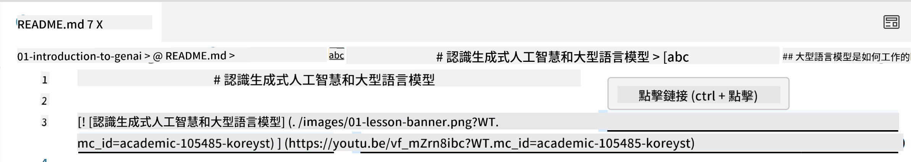
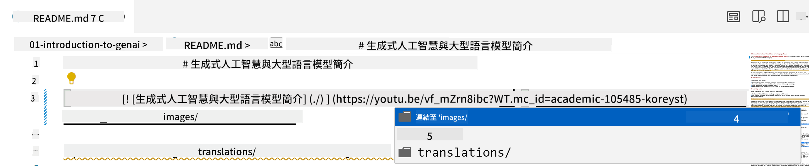
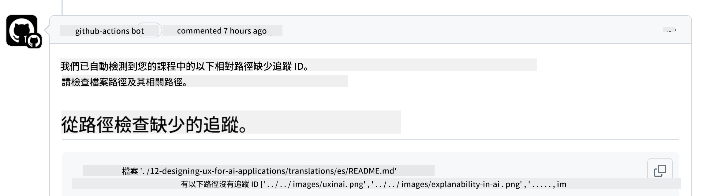
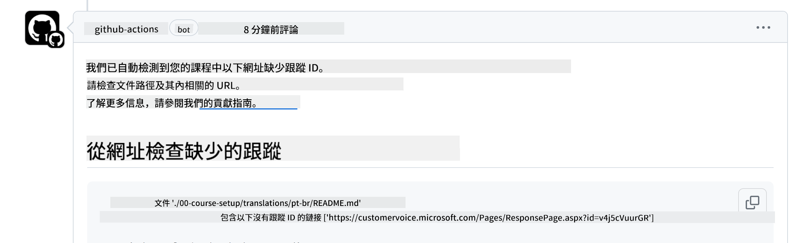
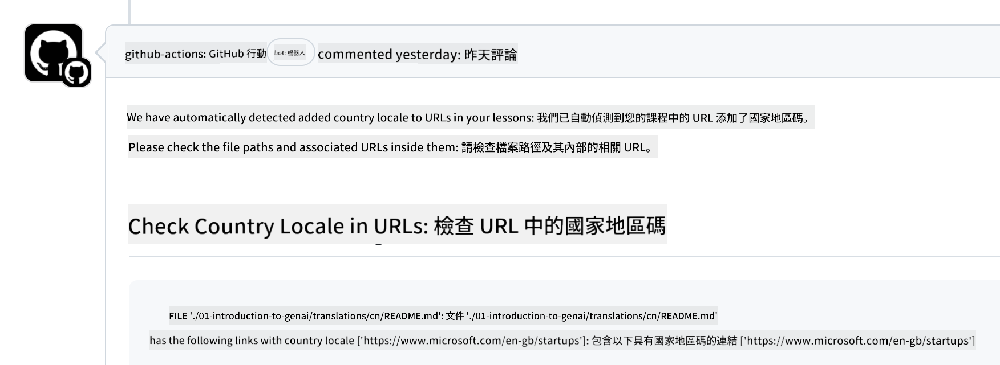

<!--
CO_OP_TRANSLATOR_METADATA:
{
  "original_hash": "57c41f2af71001a2cff9d8eb797cb843",
  "translation_date": "2025-05-19T11:11:34+00:00",
  "source_file": "CONTRIBUTING.md",
  "language_code": "hk"
}
-->
# 貢獻

這個項目歡迎大家的貢獻和建議。大多數貢獻需要你同意一份貢獻者許可協議 (CLA)，聲明你有權利並且實際上授予我們使用你貢獻的權利。詳情請訪問 <https://cla.microsoft.com>。

> 重要提示：在翻譯這個庫中的文本時，請確保不要使用機器翻譯。我們將通過社區驗證翻譯，因此請僅在你熟練的語言中自願參與翻譯。

當你提交一個 pull request 時，CLA 機器人會自動確定你是否需要提供 CLA 並適當地裝飾 PR（例如，標籤，評論）。只需按照機器人提供的說明進行操作。這在所有使用我們 CLA 的庫中只需要做一次。

## 行為準則

這個項目採用了 [Microsoft 開源行為準則](https://opensource.microsoft.com/codeofconduct/?WT.mc_id=academic-105485-koreyst)。如需更多信息，請閱讀 [行為準則常見問題](https://opensource.microsoft.com/codeofconduct/faq/?WT.mc_id=academic-105485-koreyst) 或通過 [opencode@microsoft.com](mailto:opencode@microsoft.com) 聯繫我們以獲取更多問題或評論。

## 有問題或疑問？

請不要為一般支持問題打開 GitHub 問題，因為 GitHub 列表應用於功能請求和錯誤報告。這樣，我們可以更容易地跟蹤實際問題或錯誤，並將一般討論與實際代碼分開。

## 拼寫錯誤、問題、錯誤和貢獻

每當你提交對初學者生成式 AI 庫的任何更改時，請遵循以下建議。

* 在進行修改之前，請始終將庫 fork 到你自己的帳戶
* 不要將多個更改合併到一個 pull request 中。例如，提交任何錯誤修復和文檔更新時，請使用單獨的 PR
* 如果你的 pull request 顯示合併衝突，請確保在進行修改之前更新本地 main 以鏡像主庫中的內容
* 如果你提交翻譯，請為所有翻譯文件創建一個 PR，因為我們不接受內容的部分翻譯
* 如果你提交拼寫錯誤或文檔修復，可以將修改合併到一個合適的 PR 中

## 寫作的一般指導

- 確保所有的 URL 都用方括號包裹，然後用括號跟著，裡面沒有多餘的空格 ``。
- 確保任何相對鏈接（即指向庫中其他文件和文件夾的鏈接）以 `./` 開頭，指的是當前工作目錄中的文件或文件夾，或 `../` 指的是父工作目錄中的文件或文件夾。
- 確保任何相對鏈接（即指向庫中其他文件和文件夾的鏈接）在結尾有一個跟蹤 ID（即 `?` 或 `&` 然後 `wt.mc_id=` 或 `WT.mc_id=`）。
- 確保來自以下域名的任何 URL _github.com, microsoft.com, visualstudio.com, aka.ms, 和 azure.com_ 在結尾有一個跟蹤 ID（即 `?` 或 `&` 然後 `wt.mc_id=` 或 `WT.mc_id=`）。
- 確保你的鏈接中沒有特定國家的語言地區（即 `/en-us/` 或 `/en/`）。
- 確保所有圖片都存儲在 `./images` 文件夾中。
- 確保圖片有描述性的名稱，使用英文字符、數字和破折號作為圖片名稱。

## GitHub 工作流程

當你提交一個 pull request 時，將觸發四種不同的工作流程來驗證之前的規則。
只需按照這裡列出的說明進行操作以通過工作流程檢查。

- [檢查斷裂的相對路徑](../..)
- [檢查路徑有跟蹤](../..)
- [檢查 URL 有跟蹤](../..)
- [檢查 URL 沒有語言地區](../..)

### 檢查斷裂的相對路徑

此工作流程確保你文件中的任何相對路徑都能正常工作。
這個庫被部署到 GitHub 頁面，因此在輸入將所有內容粘合在一起的鏈接時，你需要非常小心，不要將任何人引導到錯誤的地方。

要確保你的鏈接正常工作，只需使用 VS code 檢查即可。

例如，當你將鼠標懸停在文件中的任何鏈接上時，會提示你按 **ctrl + click** 來跟隨鏈接

如果你點擊一個鏈接並且它在本地不起作用，那麼它肯定會觸發工作流程並且不會在 GitHub 上工作。

要解決此問題，請嘗試在 VS code 的幫助下輸入鏈接。

當你輸入 `./` 或 `../` 時，VS code 會提示你從根據你輸入的內容提供的選項中選擇。

通過點擊所需的文件或文件夾來跟隨路徑，你就可以確保你的路徑沒有損壞。

一旦你添加了正確的相對路徑，保存並推送你的更改，工作流程將再次被觸發以驗證你的更改。
如果你通過了檢查，那麼你就可以開始了。

### 檢查路徑有跟蹤

此工作流程確保任何相對路徑中都有跟蹤。
這個庫被部署到 GitHub 頁面，因此我們需要跟蹤不同文件和文件夾之間的移動。

要確保你的相對路徑中有跟蹤，只需檢查路徑末尾的以下文本 `?wt.mc_id=`。
如果它附加到你的相對路徑中，那麼你將通過此檢查。

如果沒有，你可能會收到以下錯誤。

要解決此問題，請嘗試打開工作流程突出顯示的文件路徑，並將跟蹤 ID 添加到相對路徑的末尾。

一旦你添加了跟蹤 ID，保存並推送你的更改，工作流程將再次被觸發以驗證你的更改。
如果你通過了檢查，那麼你就可以開始了。

### 檢查 URL 有跟蹤

此工作流程確保任何 web URL 中都有跟蹤。
這個庫對所有人開放，因此你需要確保跟蹤訪問以了解流量來自何處。

要確保你的 URL 中有跟蹤，只需檢查 URL 末尾的以下文本 `?wt.mc_id=`。
如果它附加到你的 URL 中，那麼你將通過此檢查。

如果沒有，你可能會收到以下錯誤。

要解決此問題，請嘗試打開工作流程突出顯示的文件路徑，並將跟蹤 ID 添加到 URL 的末尾。

一旦你添加了跟蹤 ID，保存並推送你的更改，工作流程將再次被觸發以驗證你的更改。
如果你通過了檢查，那麼你就可以開始了。

### 檢查 URL 沒有語言地區

此工作流程確保任何 web URL 中沒有特定國家的語言地區。
這個庫對全球所有人開放，因此你需要確保不要在 URL 中包含你的國家地區。

要確保你的 URL 中沒有國家地區，只需檢查 URL 中的以下文本 `/en-us/` 或 `/en/` 或任何其他語言地區。
如果它不在你的 URL 中，那麼你將通過此檢查。

如果沒有，你可能會收到以下錯誤。

要解決此問題，請嘗試打開工作流程突出顯示的文件路徑，並從 URL 中刪除國家地區。

一旦你刪除了國家地區，保存並推送你的更改，工作流程將再次被觸發以驗證你的更改。
如果你通過了檢查，那麼你就可以開始了。

恭喜！我們將盡快與你聯繫，反饋你的貢獻。

**免責聲明**：
本文件使用AI翻譯服務[Co-op Translator](https://github.com/Azure/co-op-translator)進行翻譯。雖然我們努力確保準確性，但請注意，自動翻譯可能包含錯誤或不準確之處。應以原語言的文件作為權威來源。對於關鍵信息，建議尋求專業人工翻譯。我們對因使用此翻譯而產生的任何誤解或誤讀不承擔責任。