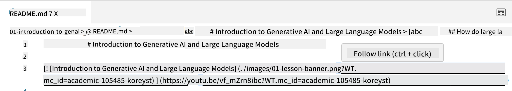
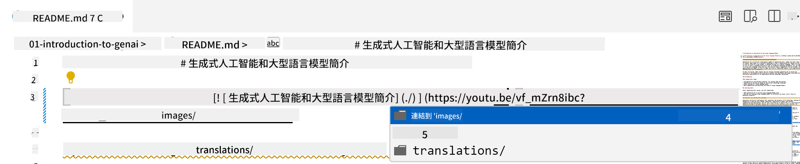
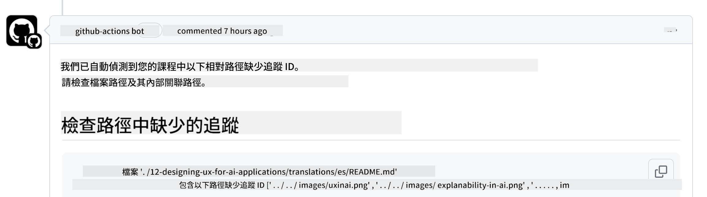
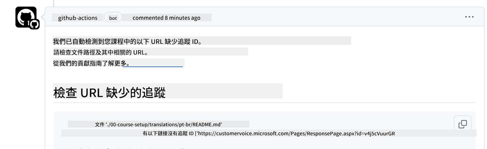
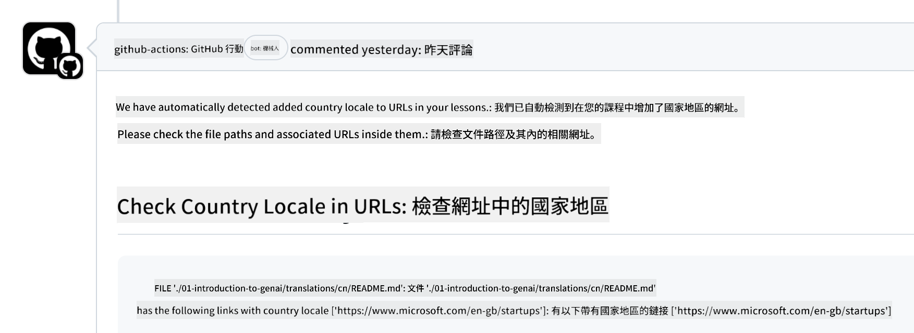

<!--
CO_OP_TRANSLATOR_METADATA:
{
  "original_hash": "57c41f2af71001a2cff9d8eb797cb843",
  "translation_date": "2025-06-25T07:03:04+00:00",
  "source_file": "CONTRIBUTING.md",
  "language_code": "hk"
}
-->
# 貢獻

此項目歡迎貢獻和建議。大多數貢獻需要您同意一份貢獻者許可協議（CLA），聲明您有權，並確實授予我們使用您的貢獻的權利。詳情請訪問 <https://cla.microsoft.com>。

> 重要提示：在翻譯此倉庫中的文本時，請確保您不使用機器翻譯。我們將通過社群驗證翻譯，因此請僅在您精通的語言中自願翻譯。

當您提交拉取請求時，CLA-bot 會自動確定您是否需要提供 CLA 並適當地裝飾 PR（例如，標籤、評論）。只需按照機器人的指示操作即可。您只需在所有使用我們 CLA 的倉庫中進行一次。

## 行為準則

此項目已採用 [Microsoft 開源行為準則](https://opensource.microsoft.com/codeofconduct/?WT.mc_id=academic-105485-koreyst)。如需更多資訊，請閱讀 [行為準則 FAQ](https://opensource.microsoft.com/codeofconduct/faq/?WT.mc_id=academic-105485-koreyst) 或聯繫 [opencode@microsoft.com](mailto:opencode@microsoft.com) 以獲取任何其他問題或評論。

## 問題或疑問？

請勿為一般支持問題打開 GitHub 問題，因為 GitHub 列表應用於功能請求和錯誤報告。這樣我們可以更容易地追踪實際的問題或錯誤，並將一般討論與實際代碼分開。

## 錯別字、問題、錯誤和貢獻

每當您向 Generative AI for Beginners 倉庫提交任何更改時，請遵循以下建議。

* 在進行修改之前，請務必將倉庫分叉到您自己的帳戶
* 不要將多個更改合併到一個拉取請求中。例如，使用單獨的 PR 提交任何錯誤修正和文檔更新
* 如果您的拉取請求顯示合併衝突，請確保在進行修改之前將您的本地 main 更新為與主倉庫一致
* 如果您提交翻譯，請為所有翻譯文件創建一個 PR，因為我們不接受部分翻譯的內容
* 如果您提交錯別字或文檔修正，您可以在適當的情況下將修改合併到單個 PR

## 寫作的一般指導

- 確保所有 URL 都用方括號括起來，後跟沒有多餘空格的括號 ``。
- 確保任何相對鏈接（即倉庫中其他文件和文件夾的鏈接）以 `./` 開頭，指的是位於當前工作目錄中的文件或文件夾，或者 `../` 指的是位於父工作目錄中的文件或文件夾。
- 確保任何相對鏈接（即倉庫中其他文件和文件夾的鏈接）在其末尾有跟踪 ID（即 `?` 或 `&` 然後是 `wt.mc_id=` 或 `WT.mc_id=`）。
- 確保以下域名的任何 URL _github.com, microsoft.com, visualstudio.com, aka.ms, 和 azure.com_ 在其末尾有跟踪 ID（即 `?` 或 `&` 然後是 `wt.mc_id=` 或 `WT.mc_id=`）。
- 確保您的鏈接中沒有特定國家的語言區域（即 `/en-us/` 或 `/en/`）。
- 確保所有圖片都存儲在 `./images` 文件夾中。
- 確保圖片有描述性的名稱，使用英文字符、數字和短橫作為圖片名稱。

## GitHub 工作流程

當您提交拉取請求時，將觸發四個不同的工作流程來驗證之前的規則。只需按照此處列出的指示操作以通過工作流程檢查。

- [檢查損壞的相對路徑](../..)
- [檢查路徑是否有跟踪](../..)
- [檢查 URL 是否有跟踪](../..)
- [檢查 URL 沒有區域](../..)

### 檢查損壞的相對路徑

此工作流程確保您文件中的任何相對路徑都能正常工作。此倉庫部署到 GitHub 頁面，因此您在鍵入將所有內容粘合在一起的鏈接時需要非常小心，以免將任何人引導到錯誤的地方。

要確保您的鏈接正常工作，只需使用 VS code 檢查即可。

例如，當您將鼠標懸停在文件中的任何鏈接上時，系統會提示您按住 **ctrl + 點擊** 以跟隨鏈接

如果您單擊某個鏈接而它在本地不起作用，那麼它肯定會觸發工作流程並且在 GitHub 上也不起作用。

要解決此問題，請嘗試在 VS code 的幫助下鍵入鏈接。

當您鍵入 `./` 或 `../` 時，VS code 會提示您根據鍵入的內容從可用選項中進行選擇。

通過單擊所需的文件或文件夾來跟隨路徑，您可以確保您的路徑沒有損壞。

一旦您添加了正確的相對路徑，保存並推送您的更改，工作流程將再次觸發以驗證您的更改。如果您通過了檢查，那麼您就可以進行下一步。

### 檢查路徑是否有跟踪

此工作流程確保任何相對路徑中都有跟踪。此倉庫部署到 GitHub 頁面，因此我們需要跟踪不同文件和文件夾之間的移動。

要確保您的相對路徑中有跟踪，只需檢查路徑末尾的以下文本 `?wt.mc_id=`。如果它附加到您的相對路徑，您將通過此檢查。

如果沒有，您可能會收到以下錯誤。

要解決此問題，請嘗試打開工作流程突出顯示的文件路徑，並將跟踪 ID 添加到相對路徑的末尾。

一旦您添加了跟踪 ID，保存並推送您的更改，工作流程將再次觸發以驗證您的更改。如果您通過了檢查，那麼您就可以進行下一步。

### 檢查 URL 是否有跟踪

此工作流程確保任何網頁 URL 中都有跟踪。此倉庫對所有人開放，因此您需要確保跟踪訪問以了解流量的來源。

要確保您的 URL 中有跟踪，只需檢查 URL 末尾的以下文本 `?wt.mc_id=`。如果它附加到您的 URL，您將通過此檢查。

如果沒有，您可能會收到以下錯誤。

要解決此問題，請嘗試打開工作流程突出顯示的文件路徑，並將跟踪 ID 添加到 URL 的末尾。

一旦您添加了跟踪 ID，保存並推送您的更改，工作流程將再次觸發以驗證您的更改。如果您通過了檢查，那麼您就可以進行下一步。

### 檢查 URL 沒有區域

此工作流程確保任何網頁 URL 中沒有特定國家的區域。此倉庫對全球所有人開放，因此您需要確保不在 URL 中包含您國家的區域。

要確保您的 URL 中沒有國家區域，只需檢查 URL 中的以下文本 `/en-us/` 或 `/en/` 或任何其他語言區域。如果它不存在於您的 URL 中，您將通過此檢查。

如果沒有，您可能會收到以下錯誤。

要解決此問題，請嘗試打開工作流程突出顯示的文件路徑，並從 URL 中刪除國家區域。

一旦您刪除了國家區域，保存並推送您的更改，工作流程將再次觸發以驗證您的更改。如果您通過了檢查，那麼您就可以進行下一步。

恭喜！我們將儘快回饋您關於您貢獻的意見。

**免責聲明**：  
此文件使用 AI 翻譯服務 [Co-op Translator](https://github.com/Azure/co-op-translator) 進行翻譯。我們努力確保準確性，但請注意，自動翻譯可能包含錯誤或不準確之處。應將原始語言的文件視為權威來源。對於關鍵信息，建議尋求專業的人力翻譯。我們對使用此翻譯所產生的任何誤解或誤釋不承擔責任。