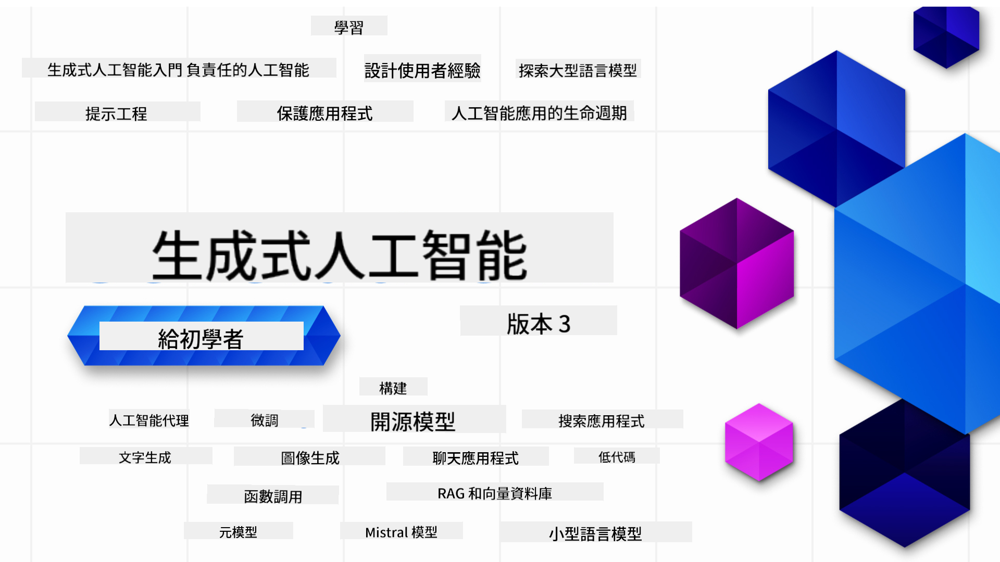

<!--
CO_OP_TRANSLATOR_METADATA:
{
  "original_hash": "c2ee25895ebbfa1a52868bb6eab686fc",
  "translation_date": "2025-05-19T11:34:20+00:00",
  "source_file": "README.md",
  "language_code": "hk"
}
-->

### 21 堂課教你一切所需，開始建立生成式AI應用程式

    

  

### 🌐 多語言支援

#### 通過 GitHub Action 支援（自動化並始終保持最新）
[法文](../fr/README.md) | [西班牙文](../es/README.md) | [德文](../de/README.md) | [俄文](../ru/README.md) | [阿拉伯文](../ar/README.md) | [波斯文 (法爾西)](../fa/README.md) | [烏爾都文](../ur/README.md) | [中文 (簡體)](../zh/README.md) | [中文 (繁體, 澳門)](../mo/README.md) | [中文 (繁體, 香港)](./README.md) | [中文 (繁體, 台灣)](../tw/README.md) | [日文](../ja/README.md) | [韓文](../ko/README.md) | [印地文](../hi/README.md) | [孟加拉文](../bn/README.md) | [馬拉地文](../mr/README.md) | [尼泊爾文](../ne/README.md) | [旁遮普文 (古木基文)](../pa/README.md) | [葡萄牙文 (葡萄牙)](../pt/README.md) | [葡萄牙文 (巴西)](../br/README.md) | [意大利文](../it/README.md) | [波蘭文](../pl/README.md) | [土耳其文](../tr/README.md) | [希臘文](../el/README.md) | [泰文](../th/README.md) | [瑞典文](../sv/README.md) | [丹麥文](../da/README.md) | [挪威文](../no/README.md) | [芬蘭文](../fi/README.md) | [荷蘭文](../nl/README.md) | [希伯來文](../he/README.md) | [越南文](../vi/README.md) | [印尼文](../id/README.md) | [馬來文](../ms/README.md) | [他加祿文 (菲律賓文)](../tl/README.md) | [斯瓦希里文](../sw/README.md) | [匈牙利文](../hu/README.md) | [捷克文](../cs/README.md) | [斯洛伐克文](../sk/README.md) | [羅馬尼亞文](../ro/README.md) | [保加利亞文](../bg/README.md) | [塞爾維亞文 (西里爾文)](../sr/README.md) | [克羅地亞文](../hr/README.md) | [斯洛文尼亞文](../sl/README.md)請從左至右書寫輸出。
# 初學者生成式人工智能課程 (版本 3) - 一個課程

透過我們由 Microsoft Cloud Advocates 提供的21課程全面課程，學習建立生成式人工智能應用的基本原理。

## 🌱 開始學習

這個課程有21節課。每節課都有自己的主題，您可以從任何地方開始！

課程分為「學習」課程，解釋生成式人工智能概念，或「建造」課程，解釋概念並提供**Python**和**TypeScript**代碼示例（如果可能）。

對於 .NET 開發者，請查看 [初學者生成式人工智能 (.NET 版)](https://github.com/microsoft/Generative-AI-for-beginners-dotnet?WT.mc_id=academic-105485-koreyst)！

每節課還包括「持續學習」部分，提供額外的學習工具。

## 您需要的東西
### 要運行此課程的代碼，您可以使用：
 - [Azure OpenAI 服務](https://aka.ms/genai-beginners/azure-open-ai?WT.mc_id=academic-105485-koreyst) - **課程：** "aoai-assignment"
 - [GitHub 市場模型目錄](https://aka.ms/genai-beginners/gh-models?WT.mc_id=academic-105485-koreyst) - **課程：** "githubmodels"
 - [OpenAI API](https://aka.ms/genai-beginners/open-ai?WT.mc_id=academic-105485-koreyst) - **課程：** "oai-assignment" 

- 基本的 Python 或 TypeScript 知識會有幫助 - \*對於絕對初學者，請查看這些 [Python](https://aka.ms/genai-beginners/python?WT.mc_id=academic-105485-koreyst) 和 [TypeScript](https://aka.ms/genai-beginners/typescript?WT.mc_id=academic-105485-koreyst) 課程
- 一個 GitHub 帳戶以[分叉整個倉庫](https://aka.ms/genai-beginners/github?WT.mc_id=academic-105485-koreyst)到您的 GitHub 帳戶

我們創建了一個 **[課程設置](./00-course-setup/README.md?WT.mc_id=academic-105485-koreyst)** 課程來幫助您設置開發環境。

不要忘記[星標 (🌟) 此倉庫](https://docs.github.com/en/get-started/exploring-projects-on-github/saving-repositories-with-stars?WT.mc_id=academic-105485-koreyst)，以便以後更容易找到。

## 🧠 準備部署？

如果您在尋找更高級的代碼示例，請查看我們的[生成式人工智能代碼示例集合](https://aka.ms/genai-beg-code?WT.mc_id=academic-105485-koreyst)，包括 **Python** 和 **TypeScript**。

## 🗣️ 與其他學習者交流，獲得支持

加入我們的[官方 Azure AI Foundry Discord 服務器](https://aka.ms/genai-discord?WT.mc_id=academic-105485-koreyst)，與其他學習此課程的學習者交流並獲得支持。

在我們的[Azure AI Foundry 開發者論壇](https://aka.ms/azureaifoundry/forum)上提問或分享產品反饋。

## 🚀 建立初創公司？

註冊 [Microsoft for Startups Founders Hub](https://aka.ms/genai-foundershub?WT.mc_id=academic-105485-koreyst) 以獲得 **免費的 OpenAI 點數** 和最多 **$150k 的 Azure 點數以通過 Azure OpenAI 服務訪問 OpenAI 模型**。

## 🙏 想幫忙？

您有建議或發現拼寫或代碼錯誤？[提出問題](https://github.com/microsoft/generative-ai-for-beginners/issues?WT.mc_id=academic-105485-koreyst)或[創建拉取請求](https://github.com/microsoft/generative-ai-for-beginners/pulls?WT.mc_id=academic-105485-koreyst)

## 📂 每節課包括：

- 主題的簡短視頻介紹
- 位於 README 的書面課程
- 支持 Azure OpenAI 和 OpenAI API 的 Python 和 TypeScript 代碼示例
- 繼續學習的額外資源鏈接

## 🗃️ 課程

| #   | **課程鏈接**                                                                                                                               | **描述**                                                                                   | **視頻**                                                                     | **額外學習**                                                                  |
| --- | -------------------------------------------------------------------------------------------------------------------------------------------- | ----------------------------------------------------------------------------------------------- | --------------------------------------------------------------------------- | ------------------------------------------------------------------------------ |
| 00  | [課程設置](./00-course-setup/README.md?WT.mc_id=academic-105485-koreyst)                                                                  | **學習：** 如何設置您的開發環境                                                               | 即將推出視頻                                                               | [了解更多](https://aka.ms/genai-collection?WT.mc_id=academic-105485-koreyst) |
| 01  | [生成式人工智能和 LLMs 介紹](./01-introduction-to-genai/README.md?WT.mc_id=academic-105485-koreyst)                                       | **學習：** 理解什麼是生成式人工智能以及大型語言模型 (LLMs) 如何運作                          | [視頻](https://aka.ms/gen-ai-lesson-1-gh?WT.mc_id=academic-105485-koreyst) | [了解更多](https://aka.ms/genai-collection?WT.mc_id=academic-105485-koreyst) |
| 02  | [探索和比較不同的 LLMs](./02-exploring-and-comparing-different-llms/README.md?WT.mc_id=academic-105485-koreyst)                            | **學習：** 如何選擇適合您使用情況的模型                                                      | [視頻](https://aka.ms/gen-ai-lesson2-gh?WT.mc_id=academic-105485-koreyst)  | [了解更多](https://aka.ms/genai-collection?WT.mc_id=academic-105485-koreyst) |
| 03  | [負責任地使用生成式人工智能](./03-using-generative-ai-responsibly/README.md?WT.mc_id=academic-105485-koreyst)                              | **學習：** 如何負責任地構建生成式人工智能應用                                                | [視頻](https://aka.ms/gen-ai-lesson3-gh?WT.mc_id=academic-105485-koreyst)  | [了解更多](https://aka.ms/genai-collection?WT.mc_id=academic-105485-koreyst) |
| 04  | [理解提示工程基本原理](./04-prompt-engineering-fundamentals/README.md?WT.mc_id=academic-105485-koreyst)                                    | **學習：** 實踐提示工程最佳實踐                                                              | [視頻](https://aka.ms/gen-ai-lesson4-gh?WT.mc_id=academic-105485-koreyst)  | [了解更多](https://aka.ms/genai-collection?WT.mc_id=academic-105485-koreyst) |
| 05  | [建立進階提示](./05-advanced-prompts/README.md?WT.mc_id=academic-105485-koreyst)                                                | **學習：** 如何應用提示工程技術來改善提示的結果。 | [影片](https://aka.ms/gen-ai-lesson5-gh?WT.mc_id=academic-105485-koreyst)  | [了解更多](https://aka.ms/genai-collection?WT.mc_id=academic-105485-koreyst) |
| 06  | [建立文字生成應用程式](./06-text-generation-apps/README.md?WT.mc_id=academic-105485-koreyst)                                | **建立：** 使用 Azure OpenAI / OpenAI API 建立一個文字生成應用程式                                | [影片](https://aka.ms/gen-ai-lesson6-gh?WT.mc_id=academic-105485-koreyst)  | [了解更多](https://aka.ms/genai-collection?WT.mc_id=academic-105485-koreyst) |
| 07  | [建立聊天應用程式](./07-building-chat-applications/README.md?WT.mc_id=academic-105485-koreyst)                                     | **建立：** 高效建立和整合聊天應用程式的技術。               | [影片](https://aka.ms/gen-ai-lessons7-gh?WT.mc_id=academic-105485-koreyst) | [了解更多](https://aka.ms/genai-collection?WT.mc_id=academic-105485-koreyst) |
| 08  | [建立搜尋應用程式向量資料庫](./08-building-search-applications/README.md?WT.mc_id=academic-105485-koreyst)                        | **建立：** 使用嵌入技術搜尋資料的搜尋應用程式。                        | [影片](https://aka.ms/gen-ai-lesson8-gh?WT.mc_id=academic-105485-koreyst)  | [了解更多](https://aka.ms/genai-collection?WT.mc_id=academic-105485-koreyst) |
| 09  | [建立影像生成應用程式](./09-building-image-applications/README.md?WT.mc_id=academic-105485-koreyst)                        | **建立：** 一個影像生成應用程式                                                       | [影片](https://aka.ms/gen-ai-lesson9-gh?WT.mc_id=academic-105485-koreyst)  | [了解更多](https://aka.ms/genai-collection?WT.mc_id=academic-105485-koreyst) |
| 10  | [建立低程式碼 AI 應用程式](./10-building-low-code-ai-applications/README.md?WT.mc_id=academic-105485-koreyst)                       | **建立：** 使用低程式碼工具建立生成式 AI 應用程式                                     | [影片](https://aka.ms/gen-ai-lesson10-gh?WT.mc_id=academic-105485-koreyst) | [了解更多](https://aka.ms/genai-collection?WT.mc_id=academic-105485-koreyst) |
| 11  | [透過函數呼叫整合外部應用程式](./11-integrating-with-function-calling/README.md?WT.mc_id=academic-105485-koreyst) | **建立：** 什麼是函數呼叫及其在應用程式中的使用案例                          | [影片](https://aka.ms/gen-ai-lesson11-gh?WT.mc_id=academic-105485-koreyst) | [了解更多](https://aka.ms/genai-collection?WT.mc_id=academic-105485-koreyst) |
| 12  | [設計 AI 應用程式的用戶體驗](./12-designing-ux-for-ai-applications/README.md?WT.mc_id=academic-105485-koreyst)                         | **學習：** 在開發生成式 AI 應用程式時如何應用用戶體驗設計原則         | [影片](https://aka.ms/gen-ai-lesson12-gh?WT.mc_id=academic-105485-koreyst) | [了解更多](https://aka.ms/genai-collection?WT.mc_id=academic-105485-koreyst) |
| 13  | [保護您的生成式 AI 應用程式](./13-securing-ai-applications/README.md?WT.mc_id=academic-105485-koreyst)                         | **學習：** AI 系統的威脅和風險及保護這些系統的方法。             | [影片](https://aka.ms/gen-ai-lesson13-gh?WT.mc_id=academic-105485-koreyst) | [了解更多](https://aka.ms/genai-collection?WT.mc_id=academic-105485-koreyst) |
| 14  | [生成式 AI 應用程式的生命週期](./14-the-generative-ai-application-lifecycle/README.md?WT.mc_id=academic-105485-koreyst)           | **學習：** 管理 LLM 生命週期和 LLMOps 的工具和指標                         | [影片](https://aka.ms/gen-ai-lesson14-gh?WT.mc_id=academic-105485-koreyst) | [了解更多](https://aka.ms/genai-collection?WT.mc_id=academic-105485-koreyst) |
| 15  | [檢索增強生成 (RAG) 和向量數據庫](./15-rag-and-vector-databases/README.md?WT.mc_id=academic-105485-koreyst)        | **建立:** 使用 RAG 框架從向量數據庫檢索嵌入的應用程式  | [視頻](https://aka.ms/gen-ai-lesson15-gh?WT.mc_id=academic-105485-koreyst) | [了解更多](https://aka.ms/genai-collection?WT.mc_id=academic-105485-koreyst) |
| 16  | [開源模型和 Hugging Face](./16-open-source-models/README.md?WT.mc_id=academic-105485-koreyst)                                    | **建立:** 使用 Hugging Face 上的開源模型的應用程式                    | [視頻](https://aka.ms/gen-ai-lesson16-gh?WT.mc_id=academic-105485-koreyst) | [了解更多](https://aka.ms/genai-collection?WT.mc_id=academic-105485-koreyst) |
| 17  | [人工智能代理](./17-ai-agents/README.md?WT.mc_id=academic-105485-koreyst)                                                                       | **建立:** 使用人工智能代理框架的應用程式                                           | [視頻](https://aka.ms/gen-ai-lesson17-gh?WT.mc_id=academic-105485-koreyst) | [了解更多](https://aka.ms/genai-collection?WT.mc_id=academic-105485-koreyst) |
| 18  | [微調大型語言模型](./18-fine-tuning/README.md?WT.mc_id=academic-105485-koreyst)                                                              | **學習:** 微調大型語言模型的內容、原因和方法                                            | [視頻](https://aka.ms/gen-ai-lesson18-gh?WT.mc_id=academic-105485-koreyst) | [了解更多](https://aka.ms/genai-collection?WT.mc_id=academic-105485-koreyst) |
| 19  | [使用小型語言模型構建](./19-slm/README.md?WT.mc_id=academic-105485-koreyst)                                                              | **學習:** 使用小型語言模型構建的優勢                                            | 視頻即將推出 | [了解更多](https://aka.ms/genai-collection?WT.mc_id=academic-105485-koreyst) |
| 20  | [使用 Mistral 模型構建](./20-mistral/README.md?WT.mc_id=academic-105485-koreyst)                                                              | **學習:** Mistral 家族模型的特點和區別                                           | 視頻即將推出 | [了解更多](https://aka.ms/genai-collection?WT.mc_id=academic-105485-koreyst) |
| 21  | [使用 Meta 模型構建](./21-meta/README.md?WT.mc_id=academic-105485-koreyst)                                                              | **學習:** Meta 家族模型的特點和區別                                           | 視頻即將推出 | [了解更多](https://aka.ms/genai-collection?WT.mc_id=academic-105485-koreyst) |

### 🌟 特別感謝

特別感謝 [**John Aziz**](https://www.linkedin.com/in/john0isaac/) 創建所有 GitHub Actions 和工作流程

[**Bernhard Merkle**](https://www.linkedin.com/in/bernhard-merkle-738b73/) 對每個課程做出重要貢獻，以改善學習者和代碼體驗。 

## 🎒 其他課程

我們的團隊製作其他課程！查看：

- [**新** 人工智能代理初學者課程](https://github.com/microsoft/ai-agents-for-beginners?WT.mc_id=academic-105485-koreyst)
- [**新** 使用 .NET 的生成式人工智能初學者課程](https://github.com/microsoft/Generative-AI-for-beginners-dotnet?WT.mc_id=academic-105485-koreyst)
- [**新** 使用 JavaScript 的生成式人工智能初學者課程](https://aka.ms/genai-js-course?WT.mc_id=academic-105485-koreyst)
- [機器學習初學者課程](https://aka.ms/ml-beginners?WT.mc_id=academic-105485-koreyst)
- [數據科學初學者課程](https://aka.ms/datascience-beginners?WT.mc_id=academic-105485-koreyst)
- [人工智能初學者課程](https://aka.ms/ai-beginners?WT.mc_id=academic-105485-koreyst)
- [網絡安全初學者課程](https://github.com/microsoft/Security-101??WT.mc_id=academic-96948-sayoung)
- [Web 開發初學者課程](https://aka.ms/webdev-beginners?WT.mc_id=academic-105485-koreyst)
- [物聯網初學者課程](https://aka.ms/iot-beginners?WT.mc_id=academic-105485-koreyst)
- [XR 開發初學者課程](https://github.com/microsoft/xr-development-for-beginners?WT.mc_id=academic-105485-koreyst)
- [精通 GitHub Copilot 進行 AI 配對編程](https://aka.ms/GitHubCopilotAI?WT.mc_id=academic-105485-koreyst)
- [精通 GitHub Copilot 給 C#/.NET 開發者](https://github.com/microsoft/mastering-github-copilot-for-dotnet-csharp-developers?WT.mc_id=academic-105485-koreyst)
- [選擇你自己的 Copilot 冒險](https://github.com/microsoft/CopilotAdventures?WT.mc_id=academic-105485-koreyst)

**免責聲明**：
本文件已使用AI翻譯服務[Co-op Translator](https://github.com/Azure/co-op-translator)進行翻譯。儘管我們力求準確，但請注意，自動翻譯可能包含錯誤或不準確之處。原始文件的母語版本應被視為權威來源。對於關鍵信息，建議使用專業人工翻譯。因使用此翻譯而引起的任何誤解或誤譯，我們不承擔責任。