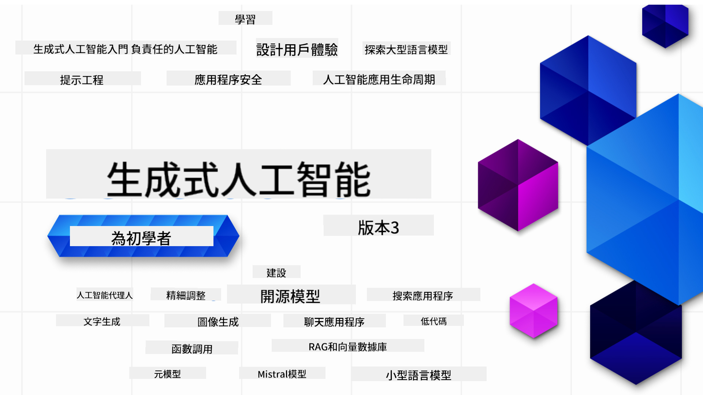

<!--
CO_OP_TRANSLATOR_METADATA:
{
  "original_hash": "6e3f4c8a4f323b8eab1cf11ded304b0f",
  "translation_date": "2025-06-25T07:40:23+00:00",
  "source_file": "README.md",
  "language_code": "hk"
}
-->

### 21 節課教你如何開始建立生成式 AI 應用程式

### 🌐 多語言支持

#### 通過 GitHub Action 支持（自動化且始終保持最新）

# 初學者生成式 AI（版本 3） - 一門課程

透過我們的 21 篇課程，由 Microsoft Cloud Advocates 指導，學習構建生成式 AI 應用程式的基礎知識。

## 🌱 入門

這門課程共有 21 篇課程。每一篇課程涵蓋不同的主題，因此您可以從任何您感興趣的地方開始！

課程被標記為 "Learn" 課程，解釋生成式 AI 的概念，或 "Build" 課程，解釋概念並提供 **Python** 和 **TypeScript** 的程式碼範例（如有可能）。

.NET 開發者可以查看 [初學者生成式 AI（.NET 版）](https://github.com/microsoft/Generative-AI-for-beginners-dotnet?WT.mc_id=academic-105485-koreyst)！

每篇課程還包含一個 "Keep Learning" 部分，提供更多學習工具。

## 你需要什麼
### 要運行這門課程的程式碼，你可以使用以下任一選項：
- [Azure OpenAI Service](https://aka.ms/genai-beginners/azure-open-ai?WT.mc_id=academic-105485-koreyst) - **課程：** "aoai-assignment"
- [GitHub Marketplace Model Catalog](https://aka.ms/genai-beginners/gh-models?WT.mc_id=academic-105485-koreyst) - **課程：** "githubmodels"
- [OpenAI API](https://aka.ms/genai-beginners/open-ai?WT.mc_id=academic-105485-koreyst) - **課程：** "oai-assignment"

- 基本的 Python 或 TypeScript 知識會有幫助 - \*對於絕對的初學者，請查看這些 [Python](https://aka.ms/genai-beginners/python?WT.mc_id=academic-105485-koreyst) 和 [TypeScript](https://aka.ms/genai-beginners/typescript?WT.mc_id=academic-105485-koreyst) 課程
- 一個 GitHub 帳戶以 [fork 整個 repo](https://aka.ms/genai-beginners/github?WT.mc_id=academic-105485-koreyst) 到你自己的 GitHub 帳戶

我們創建了一個 **[課程設置](./00-course-setup/README.md?WT.mc_id=academic-105485-koreyst)** 課程來幫助你設置開發環境。

不要忘記 [給這個 repo 加星 (🌟)](https://docs.github.com/en/get-started/exploring-projects-on-github/saving-repositories-with-stars?WT.mc_id=academic-105485-koreyst)，以便以後更容易找到它。

## 🧠 準備好部署了嗎？

如果你在尋找更高級的程式碼範例，請查看我們的 [生成式 AI 程式碼範例集](https://aka.ms/genai-beg-code?WT.mc_id=academic-105485-koreyst)，包含 **Python** 和 **TypeScript**。

## 🗣️ 與其他學員會面，獲得支持

加入我們的 [官方 Azure AI Foundry Discord 伺服器](https://aka.ms/genai-discord?WT.mc_id=academic-105485-koreyst)，與其他正在學習這門課程的學員交流並獲得支持。

在我們的 [Azure AI Foundry 開發者論壇](https://aka.ms/azureaifoundry/forum) 上提出問題或分享產品反饋。

## 🚀 構建初創公司？

註冊 [Microsoft for Startups Founders Hub](https://aka.ms/genai-foundershub?WT.mc_id=academic-105485-koreyst)，獲得 **免費的 OpenAI 點數** 和最多 **$150k 的 Azure 點數，用於通過 Azure OpenAI Services 訪問 OpenAI 模型**。

## 🙏 想要幫忙？

你有建議或發現拼寫或程式碼錯誤嗎？[提出問題](https://github.com/microsoft/generative-ai-for-beginners/issues?WT.mc_id=academic-105485-koreyst) 或 [創建 pull request](https://github.com/microsoft/generative-ai-for-beginners/pulls?WT.mc_id=academic-105485-koreyst)

## 📂 每篇課程包括：

- 一個簡短的主題介紹影片
- 位於 README 的書面課程
- 支援 Azure OpenAI 和 OpenAI API 的 Python 和 TypeScript 程式碼範例
- 繼續學習的額外資源鏈接

## 🗃️ 課程

| #   | **課程連結**                                                                                                                              | **描述**                                                                                 | **影片**                                                                   | **額外學習**                                                             |
| --- | -------------------------------------------------------------------------------------------------------------------------------------------- | ----------------------------------------------------------------------------------------------- | --------------------------------------------------------------------------- | ------------------------------------------------------------------------------ |
| 00  | [課程設置](./00-course-setup/README.md?WT.mc_id=academic-105485-koreyst)                                                                 | **學習：** 如何設置你的開發環境                                            | 影片即將推出                                                                 | [了解更多](https://aka.ms/genai-collection?WT.mc_id=academic-105485-koreyst) |
| 01  | [生成式 AI 和 LLMs 簡介](./01-introduction-to-genai/README.md?WT.mc_id=academic-105485-koreyst)                              | **學習：** 理解什麼是生成式 AI 以及大型語言模型（LLMs）的運作方式       | [影片](https://aka.ms/gen-ai-lesson-1-gh?WT.mc_id=academic-105485-koreyst) | [了解更多](https://aka.ms/genai-collection?WT.mc_id=academic-105485-koreyst) |
| 02  | [探索和比較不同的 LLMs](./02-exploring-and-comparing-different-llms/README.md?WT.mc_id=academic-105485-koreyst)             | **學習：** 如何為你的使用案例選擇合適的模型                                      | [影片](https://aka.ms/gen-ai-lesson2-gh?WT.mc_id=academic-105485-koreyst)  | [了解更多](https://aka.ms/genai-collection?WT.mc_id=academic-105485-koreyst) |
| 03  | [負責任地使用生成式 AI](./03-using-generative-ai-responsibly/README.md?WT.mc_id=academic-105485-koreyst)                           | **學習：** 如何負責任地構建生成式 AI 應用程式                                  | [影片](https://aka.ms/gen-ai-lesson3-gh?WT.mc_id=academic-105485-koreyst)  | [了解更多](https://aka.ms/genai-collection?WT.mc_id=academic-105485-koreyst) |
| 04  | [理解提示工程的基礎](./04-prompt-engineering-fundamentals/README.md?WT.mc_id=academic-105485-koreyst)             | **學習：** 實踐提示工程的最佳實踐                                           | [影片](https://aka.ms/gen-ai-lesson4-gh?WT.mc_id=academic-105485-koreyst)  | [了解更多](https://aka.ms/genai-collection?WT.mc_id=academic-105485-koreyst) |
| 05  | [創建進階提示](./05-advanced-prompts/README.md?WT.mc_id=academic-105485-koreyst)                                                | **學習：** 如何應用提示工程技術來改善提示的結果。 | [影片](https://aka.ms/gen-ai-lesson5-gh?WT.mc_id=academic-105485-koreyst)  | [了解更多](https://aka.ms/genai-collection?WT.mc_id=academic-105485-koreyst) |
| 06  | [構建文本生成應用程式](./06-text-generation-apps/README.md?WT.mc_id=academic-105485-koreyst)                                | **構建：** 使用 Azure OpenAI / OpenAI API 建立文本生成應用程式                                | [影片](https://aka.ms/gen-ai-lesson6-gh?WT.mc_id=academic-105485-koreyst)  | [了解更多](https://aka.ms/genai-collection?WT.mc_id=academic-105485-koreyst) |
| 07  | [構建聊天應用程式](./07-building-chat-applications/README.md?WT.mc_id=academic-105485-koreyst)                                     | **構建：** 有效構建和整合聊天應用程式的技術。               | [影片](https://aka.ms/gen-ai-lessons7-gh?WT.mc_id=academic-105485-koreyst) | [了解更多](https://aka.ms/genai-collection?WT.mc_id=academic-105485-koreyst) |
| 08  | [構建搜尋應用程式向量資料庫](./08-building-search-applications/README.md?WT.mc_id=academic-105485-koreyst)                        | **構建：** 使用嵌入技術搜尋資料的應用程式。                        | [影片](https://aka.ms/gen-ai-lesson8-gh?WT.mc_id=academic-105485-koreyst)  | [了解更多](https://aka.ms/genai-collection?WT.mc_id=academic-105485-koreyst) |
| 09  | [構建影像生成應用程式](./09-building-image-applications/README.md?WT.mc_id=academic-105485-koreyst)                        | **構建：** 影像生成應用程式                                                       | [影片](https://aka.ms/gen-ai-lesson9-gh?WT.mc_id=academic-105485-koreyst)  | [了解更多](https://aka.ms/genai-collection?WT.mc_id=academic-105485-koreyst) |
| 10  | [構建低代碼 AI 應用程式](./10-building-low-code-ai-applications/README.md?WT.mc_id=academic-105485-koreyst)                       | **構建：** 使用低代碼工具建立生成式 AI 應用程式                                     | [影片](https://aka.ms/gen-ai-lesson10-gh?WT.mc_id=academic-105485-koreyst) | [了解更多](https://aka.ms/genai-collection?WT.mc_id=academic-105485-koreyst) |
| 11  | [整合外部應用程式與函數調用](./11-integrating-with-function-calling/README.md?WT.mc_id=academic-105485-koreyst) | **構建：** 什麼是函數調用及其應用案例                          | [影片](https://aka.ms/gen-ai-lesson11-gh?WT.mc_id=academic-105485-koreyst) | [了解更多](https://aka.ms/genai-collection?WT.mc_id=academic-105485-koreyst) |
| 12  | [設計 AI 應用程式的使用者體驗](./12-designing-ux-for-ai-applications/README.md?WT.mc_id=academic-105485-koreyst)                         | **學習：** 開發生成式 AI 應用程式時如何應用使用者體驗設計原則         | [影片](https://aka.ms/gen-ai-lesson12-gh?WT.mc_id=academic-105485-koreyst) | [了解更多](https://aka.ms/genai-collection?WT.mc_id=academic-105485-koreyst) |
| 13  | [保護您的生成式 AI 應用程式](./13-securing-ai-applications/README.md?WT.mc_id=academic-105485-koreyst)                         | **學習：** AI 系統面臨的威脅和風險及保護這些系統的方法。             | [影片](https://aka.ms/gen-ai-lesson13-gh?WT.mc_id=academic-105485-koreyst) | [了解更多](https://aka.ms/genai-collection?WT.mc_id=academic-105485-koreyst) |
| 14  | [生成式 AI 應用程式的生命周期](./14-the-generative-ai-application-lifecycle/README.md?WT.mc_id=academic-105485-koreyst)           | **學習：** 管理 LLM 生命周期和 LLMOps 的工具和指標                         | [影片](https://aka.ms/gen-ai-lesson14-gh?WT.mc_id=academic-105485-koreyst) | [了解更多](https://aka.ms/genai-collection?WT.mc_id=academic-105485-koreyst) |
| 15  | [檢索增強生成 (RAG) 和向量數據庫](./15-rag-and-vector-databases/README.md?WT.mc_id=academic-105485-koreyst)        | **構建：** 使用 RAG 框架從向量數據庫中檢索嵌入的應用程序  | [影片](https://aka.ms/gen-ai-lesson15-gh?WT.mc_id=academic-105485-koreyst) | [了解更多](https://aka.ms/genai-collection?WT.mc_id=academic-105485-koreyst) |
| 16  | [開源模型和 Hugging Face](./16-open-source-models/README.md?WT.mc_id=academic-105485-koreyst)                                    | **構建：** 使用 Hugging Face 上的開源模型的應用程序                    | [影片](https://aka.ms/gen-ai-lesson16-gh?WT.mc_id=academic-105485-koreyst) | [了解更多](https://aka.ms/genai-collection?WT.mc_id=academic-105485-koreyst) |
| 17  | [AI 代理](./17-ai-agents/README.md?WT.mc_id=academic-105485-koreyst)                                                                       | **構建：** 使用 AI 代理框架的應用程序                                           | [影片](https://aka.ms/gen-ai-lesson17-gh?WT.mc_id=academic-105485-koreyst) | [了解更多](https://aka.ms/genai-collection?WT.mc_id=academic-105485-koreyst) |
| 18  | [微調 LLMs](./18-fine-tuning/README.md?WT.mc_id=academic-105485-koreyst)                                                              | **學習：** 微調 LLMs 的內容、原因和方法                                            | [影片](https://aka.ms/gen-ai-lesson18-gh?WT.mc_id=academic-105485-koreyst) | [了解更多](https://aka.ms/genai-collection?WT.mc_id=academic-105485-koreyst) |
| 19  | [使用 SLMs 構建](./19-slm/README.md?WT.mc_id=academic-105485-koreyst)                                                              | **學習：** 使用小型語言模型構建的好處                                            | 影片即將推出 | [了解更多](https://aka.ms/genai-collection?WT.mc_id=academic-105485-koreyst) |
| 20  | [使用 Mistral 模型構建](./20-mistral/README.md?WT.mc_id=academic-105485-koreyst)                                                              | **學習：** Mistral 系列模型的特點和差異                                           | 影片即將推出 | [了解更多](https://aka.ms/genai-collection?WT.mc_id=academic-105485-koreyst) |
| 21  | [使用 Meta 模型構建](./21-meta/README.md?WT.mc_id=academic-105485-koreyst)                                                              | **學習：** Meta 系列模型的特點和差異                                           | 影片即將推出 | [了解更多](https://aka.ms/genai-collection?WT.mc_id=academic-105485-koreyst) |

### 🌟 特別感謝

特別感謝 [**John Aziz**](https://www.linkedin.com/in/john0isaac/) 創建所有 GitHub Actions 和工作流程

[**Bernhard Merkle**](https://www.linkedin.com/in/bernhard-merkle-738b73/) 為每一課作出關鍵貢獻，以改善學習者和代碼體驗。

## 🎒 其他課程

我們的團隊還提供其他課程！查看：

- [**新** 模型上下文協議入門](https://github.com/microsoft/mcp-for-beginners?WT.mc_id=academic-105485-koreyst)
- [AI 代理入門](https://github.com/microsoft/ai-agents-for-beginners?WT.mc_id=academic-105485-koreyst)
- [使用 .NET 的生成式 AI 入門](https://github.com/microsoft/Generative-AI-for-beginners-dotnet?WT.mc_id=academic-105485-koreyst)
- [使用 JavaScript 的生成式 AI 入門](https://aka.ms/genai-js-course?WT.mc_id=academic-105485-koreyst)
- [機器學習入門](https://aka.ms/ml-beginners?WT.mc_id=academic-105485-koreyst)
- [數據科學入門](https://aka.ms/datascience-beginners?WT.mc_id=academic-105485-koreyst)
- [AI 入門](https://aka.ms/ai-beginners?WT.mc_id=academic-105485-koreyst)
- [網絡安全入門](https://github.com/microsoft/Security-101??WT.mc_id=academic-96948-sayoung)
- [網頁開發入門](https://aka.ms/webdev-beginners?WT.mc_id=academic-105485-koreyst)
- [物聯網入門](https://aka.ms/iot-beginners?WT.mc_id=academic-105485-koreyst)
- [初學者的XR開發](https://github.com/microsoft/xr-development-for-beginners?WT.mc_id=academic-105485-koreyst)
- [掌握GitHub Copilot進行AI配對編程](https://aka.ms/GitHubCopilotAI?WT.mc_id=academic-105485-koreyst)
- [掌握GitHub Copilot為C#/.NET開發者](https://github.com/microsoft/mastering-github-copilot-for-dotnet-csharp-developers?WT.mc_id=academic-105485-koreyst)
- [選擇你的Copilot冒險](https://github.com/microsoft/CopilotAdventures?WT.mc_id=academic-105485-koreyst)

**免責聲明**：
本文件已使用AI翻譯服務[Co-op Translator](https://github.com/Azure/co-op-translator)進行翻譯。儘管我們力求準確，請注意自動翻譯可能包含錯誤或不準確之處。應將原始文件視為權威來源。對於重要信息，建議使用專業人工翻譯。我們不對因使用此翻譯而產生的任何誤解或誤釋承擔責任。