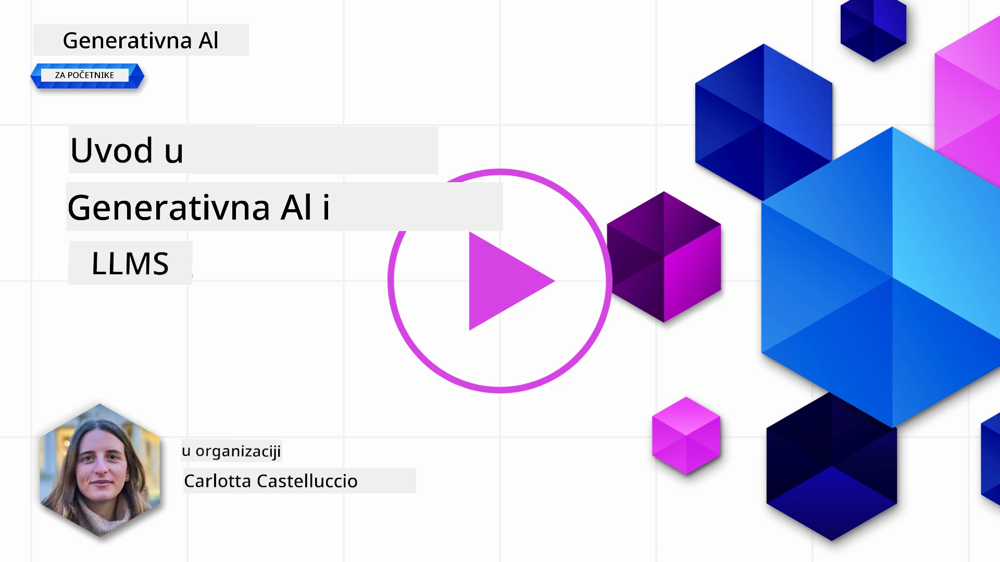
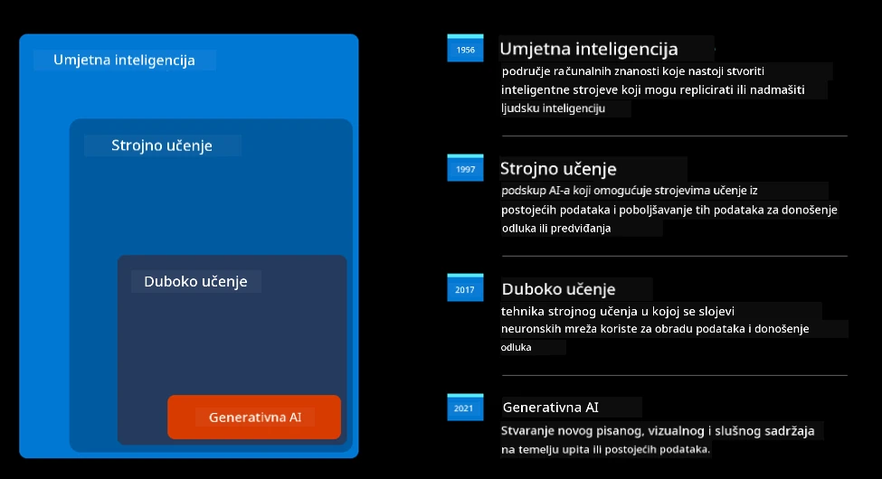
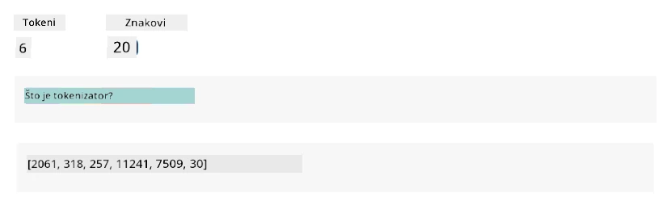
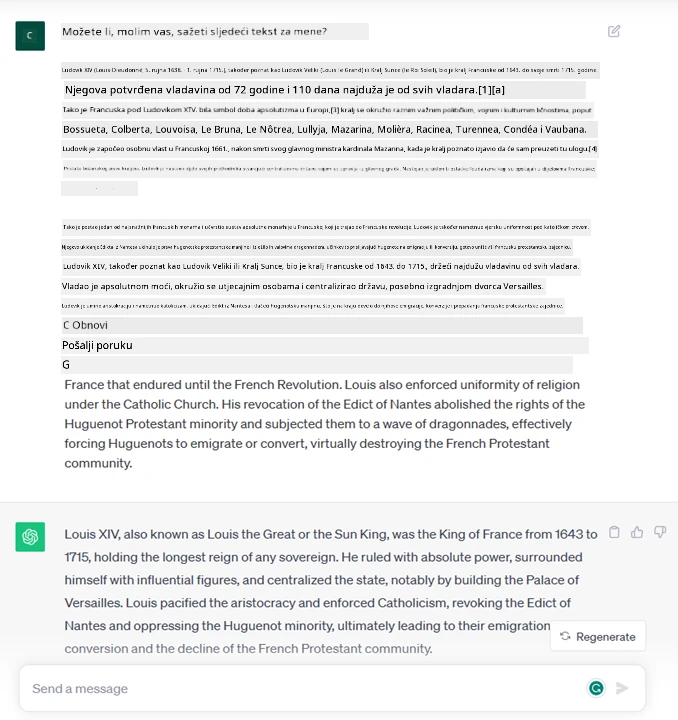
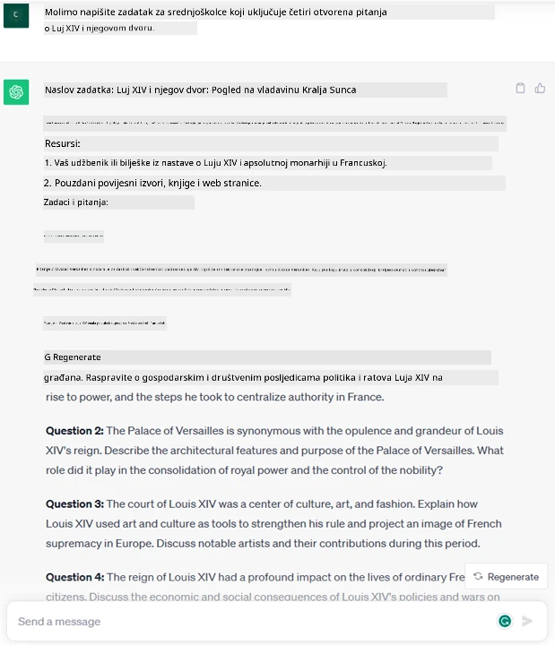
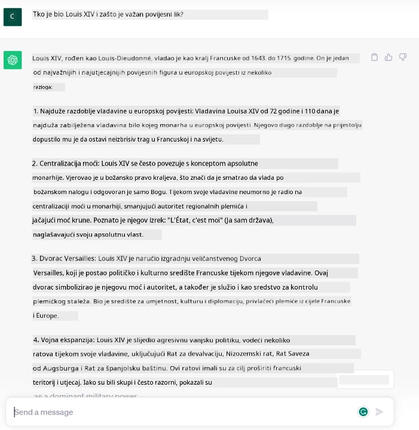
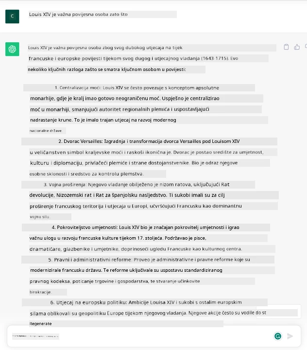
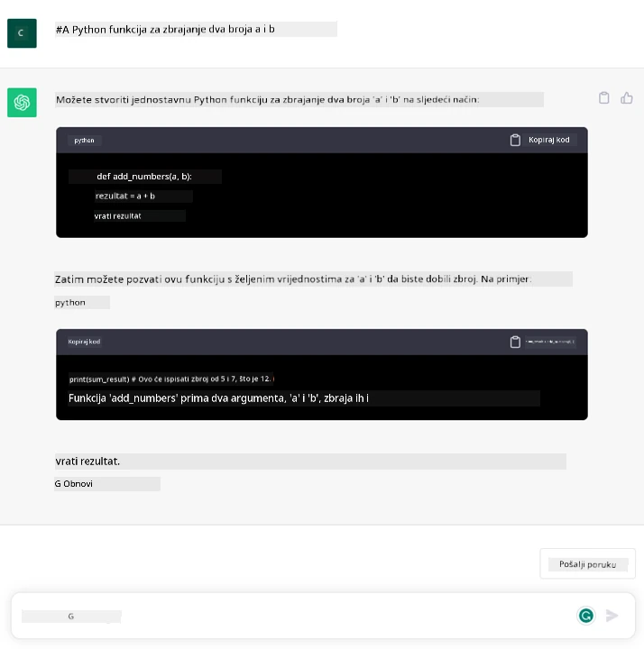

# Uvod u Generativnu umjetnu inteligenciju i velike jezične modele

_(Kliknite sliku iznad za pregled videa ove lekcije)_

Generativna AI je umjetna inteligencija sposobna za generiranje teksta, slika i drugih vrsta sadržaja. Ono što je čini fantastičnom tehnologijom je da demokratizira AI, svatko je može koristiti s samo tekstualnim upitom, rečenicom napisanu na prirodnom jeziku. Nije potrebno učiti jezik poput Jave ili SQL-a da bi se postiglo nešto vrijedno, sve što vam treba je koristiti svoj jezik, navesti što želite i dobit ćete prijedlog od AI modela. Primjene i utjecaj toga su ogromni, pišete ili razumijete izvještaje, pišete aplikacije i još mnogo toga, sve u nekoliko sekundi.

U ovom kurikulumu istražit ćemo kako naš startup koristi generativni AI za otključavanje novih scenarija u svijetu obrazovanja i kako rješavamo neizbježne izazove povezane sa društvenim implikacijama njegove primjene i tehnološkim ograničenjima.

## Uvod

Ova lekcija će obuhvatiti:

- Uvod u poslovni scenarij: ideja našeg startupa i misija.
- Generativna AI i kako smo došli do trenutnog tehnološkog krajolika.
- Unutarnje funkcioniranje velikog jezičnog modela.
- Glavne sposobnosti i praktične upotrebe velikih jezičnih modela.

## Ciljevi učenja

Nakon završetka ove lekcije, razumjet ćete:

- Što je generativna AI i kako funkcioniraju veliki jezični modeli.
- Kako možete iskoristiti velike jezične modele za različite primjene, s naglaskom na obrazovne scenarije.

## Scenarij: naš edukativni startup

Generativna umjetna inteligencija (AI) predstavlja vrhunac AI tehnologije, pomičući granice onoga što se nekada smatralo nemogućim. Generativni AI modeli imaju nekoliko sposobnosti i primjena, ali u ovom kurikulumu istražit ćemo kako revolucioniraju obrazovanje kroz fiktivni startup. Ovaj startup nazivat ćemo _naš startup_. Naš startup radi u području obrazovanja s ambicioznom misijom

> _poboljšanja pristupačnosti učenju, na globalnoj razini, osiguravajući pravičan pristup obrazovanju i pružajući personalizirana iskustva učenja svakom učeniku, prema njihovim potrebama_.

Naš tim startupa svjestan je da nećemo moći postići ovaj cilj bez korištenja jednog od najmoćnijih alata modernih vremena – velikih jezičnih modela (LLM).

Očekuje se da će generativna AI revolucionirati način na koji danas učimo i predajemo, sa studentima koji imaju na raspolaganju virtualne učitelje 24 sata dnevno koji pružaju ogromne količine informacija i primjera, a nastavnici mogu koristiti inovativne alate za procjenu svojih učenika i davanje povratnih informacija.

Za početak, definirajmo neke osnovne pojmove i terminologiju koju ćemo koristiti kroz cijeli kurikulum.

## Kako smo došli do Generativne AI?

Unatoč izuzetnom _hypeu_ stvorenom nedavno najavom generativnih AI modela, ova tehnologija se razvija desetljećima, a prvi istraživački napori datiraju još iz 60-ih. Trenutno smo u fazi kada AI ima ljudske kognitivne sposobnosti, poput razgovora, što pokazuju na primjer [OpenAI ChatGPT](https://openai.com/chatgpt) ili [Microsoft Copilot](https://copilot.microsoft.com/?WT.mc_id=academic-105485-koreyst), koji također koristi GPT model za svoj konverzacijski web pretraživač.

Da se vratimo malo unatrag, prvi prototipovi AI sastojali su se od tipkanih chatbota koji su se oslanjali na bazu znanja izvučenu od grupe stručnjaka i predstavljenu u računalu. Odgovori u bazi znanja aktivirali su se ključnim riječima koje su se pojavljivale u ulaznom tekstu.
Međutim, ubrzo je postalo jasno da se takav pristup, korištenjem tipkanih chatbota, nije dobro skalirao.

### Statistički pristup AI: Strojno učenje

Prekretnica je došla tijekom 90-ih, s primjenom statističkog pristupa analizi teksta. To je dovelo do razvoja novih algoritama – poznatih kao strojno učenje – sposobnih učiti obrasce iz podataka bez eksplicitnog programiranja. Ovaj pristup omogućava strojevima simulaciju razumijevanja ljudskog jezika: statistički model se trenira na parovima teksta i oznaka, što mu omogućava klasifikaciju nepoznatog ulaznog teksta s unaprijed definiranom oznakom koja predstavlja namjeru poruke.

### Neuronske mreže i moderni virtualni asistenti

U posljednjim godinama, tehnološki razvoj hardvera, sposoban za obradu većih količina podataka i složenijih izračuna, potaknuo je istraživanja u AI, što je dovelo do razvoja naprednih algoritama strojnog učenja poznatih kao neuronske mreže ili algoritmi dubokog učenja.

Neuronske mreže (posebno rekurentne neuronske mreže – RNNs) značajno su unaprijedile obradu prirodnog jezika omogućavajući reprezentaciju značenja teksta na smisleniji način, vrednujući kontekst riječi u rečenici.

To je tehnologija koja je pokretala virtualne asistente rođene u prvom desetljeću novog stoljeća, vrlo vješte u interpretaciji ljudskog jezika, prepoznavanju potrebe i izvršavanju radnje da je zadovolje – poput odgovaranja unaprijed definiranim skriptama ili korištenja usluge treće strane.

### Sadašnjost, Generativna AI

Tako smo došli do današnje generativne AI, koja se može smatrati podskupom dubokog učenja.

Nakon desetljeća istraživanja u području AI, nova arhitektura modela – nazvana _Transformer_ – nadvladala je ograničenja RNN-ova, sposoban primiti mnogo duže nizove teksta kao ulaz. Transformeri se temelje na mehanizmu pažnje, koji omogućava modelu da daje različite težine ulazima koje prima, 'obraćajući više pažnje' tamo gdje je koncentrirana najvažnija informacija, bez obzira na njihov redoslijed u tekstualnom nizu.

Većina nedavnih generativnih AI modela – također poznatih kao veliki jezični modeli (LLM), budući da rade s tekstualnim ulazima i izlazima – uistinu se temelji na ovoj arhitekturi. Ono što je zanimljivo kod ovih modela – treniranih na ogromnoj količini nezaoznačenih podataka iz raznih izvora poput knjiga, članaka i web stranica – jest da se mogu prilagoditi širokom rasponu zadataka i generirati gramatički ispravan tekst s naznakom kreativnosti. Dakle, ne samo da su nevjerojatno poboljšali sposobnost stroja da ‘razumije’ ulazni tekst, već su omogućili i njegovu sposobnost da generira originalan odgovor na ljudskom jeziku.

## Kako rade veliki jezični modeli?

U sljedećem poglavlju istražit ćemo različite vrste generativnih AI modela, ali za sada pogledajmo kako rade veliki jezični modeli s naglaskom na OpenAI GPT (Generative Pre-trained Transformer) modele.

- **Tokenizer, tekst u brojeve**: Veliki jezični modeli primaju tekst kao ulaz i generiraju tekst kao izlaz. Međutim, budući da su statistički modeli, bolje funkcioniraju s brojevima nego s tekstualnim nizovima. Zato se svaki ulaz u model obrađuje tokenizerom prije nego što ga koristi temeljni model. Token je komad teksta – koji se sastoji od promjenjivog broja znakova, pa je glavni zadatak tokenizer-a razbiti ulaz u niz tokena. Zatim se svaki token preslikava s indeksom tokena, što je cjelobrojni kod originalnog tekstualnog komada.

- **Predviđanje izlaznih tokena**: Na osnovi n tokena kao ulaza (s maksimalnim n koji varira od modela do modela), model može predvidjeti jedan token kao izlaz. Taj token se zatim uključuje u ulaz sljedeće iteracije, u obrascu širenja prozora, omogućavajući bolje korisničko iskustvo dobivanja jedne (ili više) rečenica kao odgovora. Ovo objašnjava zašto, ako ste ikada koristili ChatGPT, možda ste primijetili da ponekad izgleda kao da stane usred rečenice.

- **Proces odabira, raspodjela vjerojatnosti**: Izlazni token bira model prema njegovoj vjerojatnosti nastupanja nakon trenutnog tekstualnog niza. To je zato što model predviđa raspodjelu vjerojatnosti za sve moguće ‘sljedeće tokene’, izračunatu na temelju njegova treninga. Međutim, token s najvećom vjerojatnosti nije uvijek izabran iz rezultirajuće raspodjele. Dodaje se određeni stupanj slučajnosti u ovom izboru, na način da model radi nedeterministički – ne dobivamo isti exaktan izlaz za isti ulaz. Taj stupanj slučajnosti dodaje se kako bi se simulirao proces kreativnog razmišljanja, i može se podešavati parametrom modela nazvanim temperatura.

## Kako naš startup može iskoristiti velike jezične modele?

Sada kada bolje razumijemo unutarnji rad velikog jezičnog modela, pogledajmo neke praktične primjere najčešćih zadataka koje oni mogu prilično dobro obavljati, s pogledom na naš poslovni scenarij.
Rekli smo da je glavna sposobnost velikog jezičnog modela _generiranje teksta iz ničega, počevši od tekstualnog ulaza, napisanog prirodnim jezikom_.

Ali kakav tekstualni ulaz i izlaz?
Ulaz velikog jezičnog modela poznat je kao prompt, dok se izlaz naziva completions, pojam koji se odnosi na mehanizam modela za generiranje sljedećeg tokena kako bi dovršio trenutni ulaz. Uronit ćemo duboko u to što je prompt i kako ga dizajnirati da bismo dobili maksimum od modela. Za sada, samo ćemo reći da prompt može uključivati:

- **Instrukciju** koja specificira vrstu izlaza koju očekujemo od modela. Ta instrukcija ponekad može sadržavati neke primjere ili dodatne podatke.

  1. Sažetak članka, knjige, recenzija proizvoda i slično, zajedno s izvlačenjem uvida iz nestrukturiranih podataka.
    
    
  
  2. Kreativne ideje i dizajn članka, eseja, zadatka i više.
      
     

- **Pitanje**, postavljeno u obliku razgovora s agentom.
  
  

- Komad **teksta za dovršavanje**, što implicitno predstavlja zahtjev za pomoć pri pisanju.
  
  

- Komad **koda** zajedno sa zahtjevom za objašnjenje i dokumentiranje, ili komentarom koji traži generiranje dijela koda za izvršavanje određenog zadatka.
  
  

Primjeri gore su prilično jednostavni i nisu namijenjeni kao iscrpna demonstracija sposobnosti velikih jezičnih modela. Oni su namijenjeni da pokažu potencijal korištenja generativne AI, posebice, ali ne ograničavajući se na obrazovne kontekste.

Također, izlaz generativnog AI modela nije savršen i ponekad kreativnost modela može igrati protiv njega, rezultirajući izlazom koji je kombinacija riječi koje ljudski korisnik može interpretirati kao mistifikaciju stvarnosti ili čak kao uvredljiv sadržaj. Generativna AI nije inteligentna - barem ne u širem smislu inteligencije, uključujući kritičko i kreativno rezoniranje ili emocionalnu inteligenciju; nije deterministička i nije pouzdana, budući da se izmišljotine, poput netočnih referenci, sadržaja i tvrdnji, mogu kombinirati s točnim informacijama i predstavljati na uvjerljiv i samouvjeren način. U sljedećim lekcijama baviti ćemo se svim tim ograničenjima i vidjet ćemo što možemo učiniti da ih ublažimo.

## Zadatak

Vaš zadatak je dodatno proučiti [generativnu AI](https://en.wikipedia.org/wiki/Generative_artificial_intelligence?WT.mc_id=academic-105485-koreyst) i pokušati identificirati područje gdje biste danas dodali generativnu AI koja je trenutno nema. Kako bi se utjecaj razlikovao u odnosu na "stari način" rada, možete li sada napraviti nešto što prije niste mogli ili ste brži? Napišite sažetak od 300 riječi o tome kakav bi vaš idealni AI startup izgledao i uključite naslove poput "Problem", "Kako bih koristio AI", "Utjecaj" i po želji poslovni plan.

Ako ste obavili ovaj zadatak, možda ste već spremni prijaviti se u Microsoftov inkubator, [Microsoft for Startups Founders Hub](https://www.microsoft.com/startups?WT.mc_id=academic-105485-koreyst) gdje nudimo kredite za Azure, OpenAI, mentorstvo i još mnogo toga, svakako provjerite!

## Provjera znanja

Što je istina o velikim jezičnim modelima?

1. Dobivate točno isti odgovor svaki put.
1. Oni rade stvari savršeno, izvrsni su u zbrajanju, generiraju ispravan kod itd.
1. Odgovor može varirati unatoč korištenju istog prompta. Također su izvrsni u tome da vam daju prvi nacrt nečega, bilo teksta ili koda. Ali rezultate treba dalje poboljšavati.

A: 3, LLM je nedeterministički, odgovor varira, no možete kontrolirati njegovu varijabilnost podešavanjem temperature. Također ne treba očekivati savršenstvo; njihov je zadatak obaviti težak posao što često znači da dobijete dobar prvi pokušaj nečega što trebate postupno doraditi.

## Odličan posao! Nastavite putovanje

Nakon što završite ovu lekciju, pogledajte našu [kolekciju za učenje Generativne AI](https://aka.ms/genai-collection?WT.mc_id=academic-105485-koreyst) za nastavak usavršavanja znanja o Generativnoj AI!

Krenite na Lekciju 2 gdje ćemo pogledati kako [istražiti i usporediti različite vrste LLM-ova](../02-exploring-and-comparing-different-llms/README.md?WT.mc_id=academic-105485-koreyst)!

---

<!-- CO-OP TRANSLATOR DISCLAIMER START -->
**Napomena**:
Ovaj dokument je preveden korištenjem AI prevoditeljskog servisa [Co-op Translator](https://github.com/Azure/co-op-translator). Iako težimo točnosti, imajte na umu da automatski prijevodi mogu sadržavati greške ili netočnosti. Izvorni dokument na izvornom jeziku treba smatrati autoritativnim izvorom. Za važne informacije preporuča se profesionalni ljudski prijevod. Nismo odgovorni za bilo kakva nesporazumevanja ili pogrešne interpretacije koje proizlaze iz korištenja ovog prijevoda.
<!-- CO-OP TRANSLATOR DISCLAIMER END -->