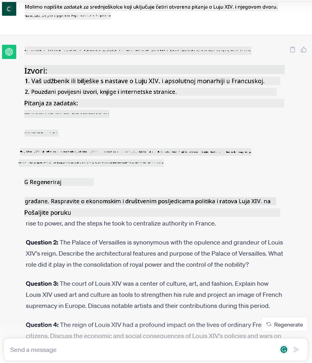
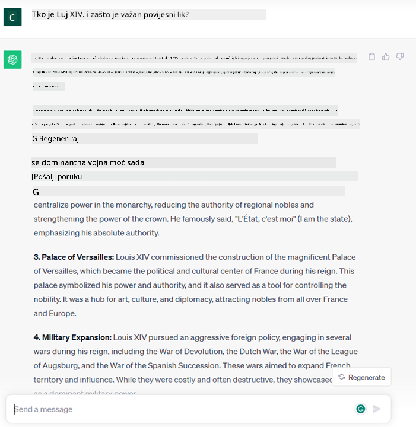
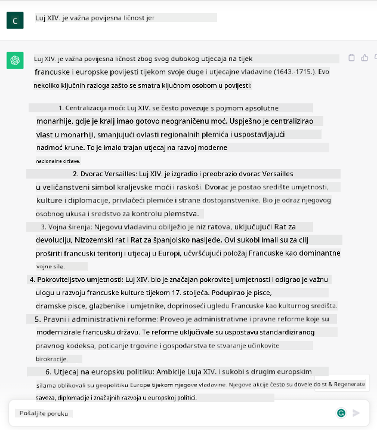

<!--
CO_OP_TRANSLATOR_METADATA:
{
  "original_hash": "bfb7901bdbece1ba3e9f35c400ca33e8",
  "translation_date": "2025-10-18T01:35:29+00:00",
  "source_file": "01-introduction-to-genai/README.md",
  "language_code": "hr"
}
-->
# Uvod u generativnu umjetnu inteligenciju i velike jezične modele

_(Kliknite na sliku iznad za video lekcije)_

Generativna umjetna inteligencija je vrsta umjetne inteligencije koja može generirati tekst, slike i druge vrste sadržaja. Ono što ovu tehnologiju čini fantastičnom jest to što demokratizira umjetnu inteligenciju – svatko je može koristiti uz samo jedan tekstualni upit, rečenicu napisanu na prirodnom jeziku. Nema potrebe da učite jezike poput Jave ili SQL-a kako biste postigli nešto vrijedno; sve što trebate je koristiti svoj jezik, izraziti što želite, a AI model će vam ponuditi prijedlog. Primjene i utjecaj ove tehnologije su ogromni – možete pisati ili razumjeti izvještaje, pisati aplikacije i još mnogo toga, sve u nekoliko sekundi.

U ovom kurikulumu istražit ćemo kako naš startup koristi generativnu umjetnu inteligenciju za otključavanje novih scenarija u svijetu obrazovanja te kako se nosimo s neizbježnim izazovima povezanim sa socijalnim implikacijama njezine primjene i tehnološkim ograničenjima.

## Uvod

Ova lekcija obuhvaća:

- Uvod u poslovni scenarij: našu startup ideju i misiju.
- Generativnu umjetnu inteligenciju i kako smo došli do trenutnog tehnološkog okruženja.
- Unutarnji rad velikih jezičnih modela.
- Glavne sposobnosti i praktične primjene velikih jezičnih modela.

## Ciljevi učenja

Nakon završetka ove lekcije, razumjet ćete:

- Što je generativna umjetna inteligencija i kako rade veliki jezični modeli.
- Kako možete koristiti velike jezične modele za različite primjene, s naglaskom na obrazovne scenarije.

## Scenarij: naš obrazovni startup

Generativna umjetna inteligencija (AI) predstavlja vrhunac AI tehnologije, pomičući granice onoga što se nekada smatralo nemogućim. Generativni AI modeli imaju brojne sposobnosti i primjene, ali u ovom kurikulumu istražit ćemo kako ona revolucionira obrazovanje kroz fiktivni startup. Taj startup ćemo nazvati _naš startup_. Naš startup djeluje u obrazovnom sektoru s ambicioznom misijom:

> _poboljšati dostupnost obrazovanja na globalnoj razini, osigurati ravnopravan pristup obrazovanju i pružiti personalizirana iskustva učenja svakom učeniku, prema njegovim potrebama_.

Tim našeg startupa svjestan je da nećemo moći ostvariti ovaj cilj bez korištenja jednog od najmoćnijih alata modernog doba – velikih jezičnih modela (LLM-ova).

Očekuje se da će generativna umjetna inteligencija revolucionirati način na koji danas učimo i podučavamo, omogućujući učenicima da imaju virtualne učitelje dostupne 24 sata dnevno, koji pružaju ogromne količine informacija i primjera, dok učitelji mogu koristiti inovativne alate za procjenu svojih učenika i davanje povratnih informacija.

Za početak, definirajmo neke osnovne pojmove i terminologiju koju ćemo koristiti kroz cijeli kurikulum.

## Kako smo došli do generativne umjetne inteligencije?

Unatoč izvanrednom _hypeu_ koji je nedavno stvoren najavom generativnih AI modela, ova tehnologija se razvija desetljećima, s prvim istraživanjima koja datiraju još iz 60-ih godina. Sada smo na točki gdje AI ima ljudske kognitivne sposobnosti, poput razgovora, što pokazuju, na primjer, [OpenAI ChatGPT](https://openai.com/chatgpt) ili [Bing Chat](https://www.microsoft.com/edge/features/bing-chat?WT.mc_id=academic-105485-koreyst), koji također koristi GPT model za pretraživanje na internetu putem Binga.

Vratimo se malo unatrag – prvi prototipovi AI-a sastojali su se od pisanih chatbotova koji su se oslanjali na bazu znanja dobivenu od skupine stručnjaka i prenesenu u računalo. Odgovori u bazi znanja aktivirali su se ključnim riječima koje su se pojavljivale u ulaznom tekstu. Međutim, ubrzo je postalo jasno da takav pristup, koji koristi pisane chatbotove, nije dobro skalabilan.

### Statistički pristup AI-u: strojno učenje

Prekretnica je nastupila tijekom 90-ih godina primjenom statističkog pristupa analizi teksta. To je dovelo do razvoja novih algoritama – poznatih kao strojno učenje – koji su sposobni učiti obrasce iz podataka bez eksplicitnog programiranja. Ovaj pristup omogućuje strojevima simulaciju razumijevanja ljudskog jezika: statistički model se trenira na parovima tekst-oznaka, omogućujući modelu da klasificira nepoznati ulazni tekst s unaprijed definiranom oznakom koja predstavlja namjeru poruke.

### Neuronske mreže i moderni virtualni asistenti

Posljednjih godina, tehnološka evolucija hardvera, sposobnog za obradu većih količina podataka i složenijih izračuna, potaknula je istraživanje u području AI-a, što je dovelo do razvoja naprednih algoritama strojnog učenja poznatih kao neuronske mreže ili algoritmi dubokog učenja.

Neuronske mreže (a posebno rekurentne neuronske mreže – RNN-ovi) značajno su unaprijedile obradu prirodnog jezika, omogućujući reprezentaciju značenja teksta na smisleniji način, uzimajući u obzir kontekst riječi u rečenici.

Ova tehnologija pokreće virtualne asistente koji su se pojavili u prvom desetljeću novog stoljeća, vrlo sposobne u interpretaciji ljudskog jezika, prepoznavanju potreba i izvršavanju radnji za njihovo zadovoljenje – poput odgovaranja unaprijed definiranim skriptama ili korištenja usluga trećih strana.

### Današnje vrijeme, generativna umjetna inteligencija

Tako smo došli do današnje generativne umjetne inteligencije, koja se može smatrati podskupom dubokog učenja.

Nakon desetljeća istraživanja u području AI-a, nova arhitektura modela – nazvana _Transformer_ – prevladala je ograničenja RNN-ova, omogućujući obradu mnogo duljih tekstualnih sekvenci kao ulaza. Transformeri se temelje na mehanizmu pažnje, omogućujući modelu da pridaje različite težine ulazima koje prima, 'posvećujući više pažnje' tamo gdje je koncentrirana najrelevantnija informacija, bez obzira na njihov redoslijed u tekstualnoj sekvenci.

Većina nedavnih generativnih AI modela – također poznatih kao veliki jezični modeli (LLM-ovi), budući da rade s tekstualnim ulazima i izlazima – temelji se upravo na ovoj arhitekturi. Ono što je zanimljivo kod ovih modela – treniranih na ogromnoj količini nepovezanih podataka iz različitih izvora poput knjiga, članaka i web stranica – jest to što se mogu prilagoditi širokom spektru zadataka i generirati gramatički ispravan tekst s naznakama kreativnosti. Dakle, ne samo da su nevjerojatno unaprijedili sposobnost stroja da 'razumije' ulazni tekst, već su omogućili i njegovu sposobnost generiranja originalnog odgovora na ljudskom jeziku.

## Kako rade veliki jezični modeli?

U sljedećem poglavlju istražit ćemo različite vrste generativnih AI modela, ali za sada pogledajmo kako rade veliki jezični modeli, s naglaskom na OpenAI GPT (Generative Pre-trained Transformer) modele.

- **Tokenizator, tekst u brojeve**: Veliki jezični modeli primaju tekst kao ulaz i generiraju tekst kao izlaz. Međutim, budući da su statistički modeli, bolje rade s brojevima nego s tekstualnim sekvencama. Zato se svaki ulaz u model obrađuje pomoću tokenizatora prije nego što ga koristi glavni model. Token je dio teksta – koji se sastoji od promjenjivog broja znakova, pa je glavna zadaća tokenizatora podijeliti ulaz na niz tokena. Zatim se svaki token mapira s indeksom tokena, što je cjelobrojno kodiranje izvornog dijela teksta.

- **Predviđanje izlaznih tokena**: S obzirom na n tokena kao ulaz (s maksimalnim n koji varira od modela do modela), model može predvidjeti jedan token kao izlaz. Taj se token zatim uključuje u ulaz sljedeće iteracije, u uzorku proširujućeg prozora, omogućujući bolje korisničko iskustvo dobivanja jedne (ili više) rečenica kao odgovora. To objašnjava zašto, ako ste ikada koristili ChatGPT, možda ste primijetili da ponekad izgleda kao da stane usred rečenice.

- **Proces odabira, distribucija vjerojatnosti**: Izlazni token model bira prema njegovoj vjerojatnosti pojavljivanja nakon trenutne tekstualne sekvence. To je zato što model predviđa distribuciju vjerojatnosti za sve moguće 'sljedeće tokene', izračunatu na temelju njegovog treniranja. Međutim, nije uvijek odabran token s najvećom vjerojatnošću iz rezultirajuće distribucije. Stupanj slučajnosti dodaje se ovom izboru, na način da model djeluje na nedeterministički način – ne dobivamo potpuno isti izlaz za isti ulaz. Ovaj stupanj slučajnosti dodaje se kako bi se simulirao proces kreativnog razmišljanja i može se prilagoditi pomoću parametra modela nazvanog temperatura.

## Kako naš startup može iskoristiti velike jezične modele?

Sada kada bolje razumijemo unutarnji rad velikog jezičnog modela, pogledajmo neke praktične primjere najčešćih zadataka koje oni mogu vrlo dobro obavljati, s naglaskom na naš poslovni scenarij. Rekli smo da je glavna sposobnost velikog jezičnog modela _generiranje teksta od nule, počevši od tekstualnog ulaza napisanog prirodnim jezikom_.

Ali kakav tekstualni ulaz i izlaz?
Ulaz velikog jezičnog modela poznat je kao upit, dok se izlaz naziva dovršetak, termin koji se odnosi na mehanizam modela za generiranje sljedećeg tokena kako bi se dovršio trenutni ulaz. Detaljnije ćemo istražiti što je upit i kako ga osmisliti na način da se iz modela izvuče maksimum. No za sada, recimo samo da upit može uključivati:

- **Uputu** koja specificira vrstu izlaza koju očekujemo od modela. Ova uputa ponekad može sadržavati primjere ili dodatne podatke.

  1. Sažimanje članka, knjige, recenzija proizvoda i slično, zajedno s izvlačenjem uvida iz nestrukturiranih podataka.
    
    
  
  2. Kreativno osmišljavanje i pisanje članka, eseja, zadatka i slično.
      
     

- **Pitanje**, postavljeno u obliku razgovora s agentom.
  
  

- Dio **teksta za dovršavanje**, što implicitno predstavlja zahtjev za pomoć u pisanju.
  
  

- Dio **koda** zajedno sa zahtjevom za objašnjenje i dokumentiranje ili komentar koji traži generiranje dijela koda za obavljanje određenog zadatka.
  
  

Gore navedeni primjeri su prilično jednostavni i nisu namijenjeni kao iscrpna demonstracija sposobnosti velikih jezičnih modela. Oni su tu da pokažu potencijal korištenja generativne umjetne inteligencije, posebno, ali ne isključivo, u obrazovnim kontekstima.

Također, izlaz generativnog AI modela nije savršen i ponekad kreativnost modela može raditi protiv njega, rezultirajući izlazom koji je kombinacija riječi koje ljudski korisnik može interpretirati kao iskrivljavanje stvarnosti ili može biti uvredljiv. Generativna umjetna inteligencija nije inteligentna – barem ne u sveobuhvatnom smislu inteligencije, uključujući kritičko i kreativno razmišljanje ili emocionalnu inteligenciju; nije deterministička i nije pouzdana, jer izmišljotine, poput pogrešnih referenci, sadržaja i izjava, mogu biti kombinirane s točnim informacijama i predstavljene na uvjerljiv i samouvjeren način. U sljedećim lekcijama bavit ćemo se svim tim ograničenjima i vidjeti što možemo učiniti kako bismo ih ublažili.

## Zadatak

Vaš zadatak je da pročitate više o [generativnoj umjetnoj inteligenciji](https://en.wikipedia.org/wiki/Generative_artificial_intelligence?WT.mc_id=academic-105485-koreyst) i pokušate identificirati područje u kojem biste danas dodali generativnu umjetnu inteligenciju, a koje je trenutno nema. Kako bi se utjecaj razlikovao od "starog načina", možete li učiniti nešto što prije niste mogli ili ste brži? Napišite sažetak od 300 riječi o tome kako bi izgledao vaš AI startup iz snova i uključite naslove poput "Problem", "Kako bih koristio AI", "Utjecaj" i, opcionalno, poslovni plan.

Ako ste obavili ovaj zadatak, možda ste već spremni prijaviti se u Microsoftov inkubator, [Microsoft for Startups Founders Hub](https://www.microsoft.com/startups?WT.mc_id=academic-105485-koreyst), gdje nudimo kredite za Azure, OpenAI, mentorstvo i još mnogo toga, provjerite!

## Provjera znanja

Što je točno o velikim jezičnim modelima?

1. Svaki put dobivate potpuno isti odgovor.
1. Sve radi savršeno, odlično zbraja brojeve, proizvodi funkcionalan kod itd.
1. Odgovor može varirati unatoč istom upitu. Također, odlično je za dobivanje prvog nacrta nečega, bilo da se radi o tekstu ili kodu. No, rezultate je potrebno dodatno poboljšati.

O: 3, LLM nije deterministički, odgovor varira, međutim, možete kontrolirati njegovu varijaciju pomoću postavke temperature. Također, ne biste trebali očekivati da sve radi savršeno, tu je da obavi težak posao za vas, što često znači da dobijete dobar prvi pokušaj nečega što trebate postupno poboljšati.

## Odlično! Nastavite putovanje

Nakon završetka ove lekcije, pogledajte našu [kolekciju za učenje o generativnoj umjetnoj inteligenciji](https://aka.ms/genai-collection?WT.mc_id=academic-105485-koreyst) kako biste nastavili unapređivati svoje znanje o generativnoj umjetnoj inteligenciji!
Idite na Lekciju 2 gdje ćemo pogledati kako [istražiti i usporediti različite vrste LLM-a](../02-exploring-and-comparing-different-llms/README.md?WT.mc_id=academic-105485-koreyst)!

---

**Odricanje od odgovornosti**:  
Ovaj dokument je preveden pomoću AI usluge za prevođenje [Co-op Translator](https://github.com/Azure/co-op-translator). Iako nastojimo osigurati točnost, imajte na umu da automatski prijevodi mogu sadržavati pogreške ili netočnosti. Izvorni dokument na izvornom jeziku treba smatrati autoritativnim izvorom. Za ključne informacije preporučuje se profesionalni prijevod od strane čovjeka. Ne odgovaramo za nesporazume ili pogrešna tumačenja koja proizlaze iz korištenja ovog prijevoda.