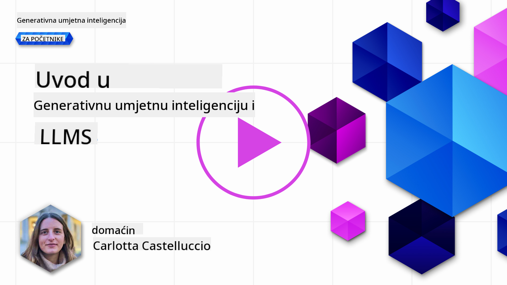

<!--
CO_OP_TRANSLATOR_METADATA:
{
  "original_hash": "f53ba0fa49164f9323043f1c6b11f2b1",
  "translation_date": "2025-07-09T08:03:48+00:00",
  "source_file": "01-introduction-to-genai/README.md",
  "language_code": "hr"
}
-->
# Uvod u Generativnu AI i Velike Jezične Modele

_(Kliknite na sliku iznad za pregled video lekcije)_

Generativna AI je umjetna inteligencija sposobna za generiranje teksta, slika i drugih vrsta sadržaja. Ono što je čini izvrsnom tehnologijom jest to što demokratizira AI – svatko je može koristiti s tek jednostavnim tekstualnim upitom, rečenicom napisanoj prirodnim jezikom. Nije potrebno učiti programske jezike poput Jave ili SQL-a da biste postigli nešto vrijedno, sve što trebate je koristiti svoj jezik, reći što želite i dobiti prijedlog od AI modela. Primjene i utjecaj ove tehnologije su ogromni – pišete ili razumijete izvještaje, izrađujete aplikacije i još mnogo toga, sve to u nekoliko sekundi.

U ovom programu istražit ćemo kako naš startup koristi generativnu AI za otključavanje novih scenarija u svijetu obrazovanja te kako se nosimo s neizbježnim izazovima vezanim uz društvene implikacije njezine primjene i tehnološka ograničenja.

## Uvod

Ova lekcija će obuhvatiti:

- Uvod u poslovni scenarij: ideju i misiju našeg startupa.
- Generativnu AI i kako smo došli do trenutnog tehnološkog krajolika.
- Unutarnji rad velikog jezičnog modela.
- Glavne sposobnosti i praktične primjene Velikih Jezičnih Modela.

## Ciljevi učenja

Nakon završetka ove lekcije, razumjet ćete:

- Što je generativna AI i kako rade Veliki Jezični Modeli.
- Kako možete iskoristiti velike jezične modele za različite primjene, s naglaskom na obrazovne scenarije.

## Scenarij: naš obrazovni startup

Generativna umjetna inteligencija (AI) predstavlja vrhunac AI tehnologije, pomičući granice onoga što se nekada smatralo nemogućim. Generativni AI modeli imaju brojne sposobnosti i primjene, ali u ovom programu istražit ćemo kako ona revolucionira obrazovanje kroz fiktivni startup. Taj startup ćemo nazivati _naš startup_. Naš startup djeluje u području obrazovanja s ambicioznom misijom:

> _poboljšati pristupačnost učenju na globalnoj razini, osiguravajući ravnopravan pristup obrazovanju i pružajući personalizirana iskustva učenja svakom učeniku, prema njegovim potrebama_.

Naš tim u startupu svjestan je da nećemo moći ostvariti ovaj cilj bez korištenja jednog od najsnažnijih alata modernog doba – Velikih Jezičnih Modela (LLM).

Očekuje se da će generativna AI revolucionirati način na koji danas učimo i podučavamo, s učenicima koji imaju na raspolaganju virtualne učitelje 24 sata dnevno, koji pružaju ogromne količine informacija i primjera, te nastavnicima koji mogu koristiti inovativne alate za procjenu učenika i davanje povratnih informacija.

Za početak, definirajmo neke osnovne pojmove i terminologiju koju ćemo koristiti kroz cijeli program.

## Kako smo došli do Generativne AI?

Unatoč iznimnom _hypeu_ koji je nedavno nastao najavom generativnih AI modela, ova tehnologija razvija se desetljećima, s prvim istraživanjima koja datiraju još iz 60-ih godina. Danas smo na razini AI koja posjeduje ljudske kognitivne sposobnosti, poput vođenja razgovora, što pokazuju, na primjer, [OpenAI ChatGPT](https://openai.com/chatgpt) ili [Bing Chat](https://www.microsoft.com/edge/features/bing-chat?WT.mc_id=academic-105485-koreyst), koji također koristi GPT model za Bing pretraživanje i razgovore.

Da se vratimo malo unatrag, prvi prototipovi AI sastojali su se od tipkanih chatbotova, koji su se oslanjali na bazu znanja prikupljenu od grupe stručnjaka i unesenu u računalo. Odgovori u bazi znanja aktivirali su se ključnim riječima koje su se pojavljivale u ulaznom tekstu. Međutim, ubrzo je postalo jasno da takav pristup, korištenjem tipkanih chatbotova, nije dobro skalabilan.

### Statistički pristup AI-u: Strojno učenje

Prekretnica je došla tijekom 90-ih, primjenom statističkog pristupa analizi teksta. To je dovelo do razvoja novih algoritama – poznatih kao strojno učenje – koji su sposobni učiti obrasce iz podataka bez eksplicitnog programiranja. Ovaj pristup omogućuje strojevima da simuliraju razumijevanje ljudskog jezika: statistički model trenira se na parovima teksta i oznaka, što mu omogućuje da klasificira nepoznati ulazni tekst s unaprijed definiranim oznakama koje predstavljaju namjeru poruke.

### Neuronske mreže i moderni virtualni asistenti

U posljednjim godinama, tehnološki razvoj hardvera, sposoban za obradu većih količina podataka i složenijih izračuna, potaknuo je istraživanja u AI-u, što je dovelo do razvoja naprednih algoritama strojnog učenja poznatih kao neuronske mreže ili duboko učenje.

Neuronske mreže (posebno Recurrent Neural Networks – RNN) značajno su unaprijedile obradu prirodnog jezika, omogućujući bolje razumijevanje značenja teksta, uzimajući u obzir kontekst riječi u rečenici.

Ova tehnologija pokrenula je virtualne asistente rođene u prvom desetljeću novog stoljeća, vrlo vješte u tumačenju ljudskog jezika, prepoznavanju potreba i izvršavanju radnji za njihovo zadovoljavanje – poput odgovaranja unaprijed definiranim skriptama ili korištenja usluga trećih strana.

### Današnje vrijeme, Generativna AI

Tako smo došli do današnje Generativne AI, koju možemo smatrati podskupom dubokog učenja.

Nakon desetljeća istraživanja u području AI, nova arhitektura modela – nazvana _Transformer_ – prevladala je ograničenja RNN-ova, omogućujući obradu znatno duljih nizova teksta kao ulaza. Transformeri se temelje na mehanizmu pažnje, koji omogućuje modelu da različito vrednuje ulaze koje prima, „obraćajući više pažnje“ na dijelove s najvažnijim informacijama, bez obzira na njihov redoslijed u tekstu.

Većina nedavnih generativnih AI modela – poznatih i kao Veliki Jezični Modeli (LLM), jer rade s tekstualnim ulazima i izlazima – temelji se upravo na ovoj arhitekturi. Ono što je zanimljivo kod ovih modela – treniranih na ogromnoj količini neoznačenih podataka iz različitih izvora poput knjiga, članaka i web stranica – jest da se mogu prilagoditi širokom spektru zadataka i generirati gramatički ispravan tekst s dozom kreativnosti. Dakle, ne samo da su znatno poboljšali sposobnost stroja da „razumije“ ulazni tekst, već su omogućili i generiranje originalnog odgovora na ljudskom jeziku.

## Kako rade veliki jezični modeli?

U sljedećem poglavlju istražit ćemo različite vrste generativnih AI modela, ali za sada pogledajmo kako rade veliki jezični modeli, s naglaskom na OpenAI GPT (Generative Pre-trained Transformer) modele.

- **Tokenizer, tekst u brojeve**: Veliki Jezični Modeli primaju tekst kao ulaz i generiraju tekst kao izlaz. Međutim, budući da su statistički modeli, bolje funkcioniraju s brojevima nego s nizovima teksta. Zato se svaki ulaz u model prvo obrađuje pomoću tokenizatora. Token je dio teksta – sastoji se od varijabilnog broja znakova, pa je glavna zadaća tokenizatora razdvojiti ulaz u niz tokena. Zatim se svaki token preslikava u indeks tokena, što je cjelobrojni kod originalnog dijela teksta.

- **Predviđanje izlaznih tokena**: Dajući n tokena kao ulaz (maksimalni broj n varira od modela do modela), model može predvidjeti jedan token kao izlaz. Taj token se zatim uključuje u ulaz sljedeće iteracije, u obrascu proširujućeg prozora, što omogućuje bolje korisničko iskustvo dobivanja jedne (ili više) rečenica kao odgovora. To objašnjava zašto, ako ste ikada koristili ChatGPT, ponekad izgleda kao da stane usred rečenice.

- **Proces odabira, distribucija vjerojatnosti**: Izlazni token model bira prema njegovoj vjerojatnosti pojavljivanja nakon trenutnog niza teksta. Model predviđa distribuciju vjerojatnosti za sve moguće „sljedeće tokene“, izračunatu na temelju svog treninga. Međutim, nije uvijek odabran token s najvećom vjerojatnošću. Dodaje se određena doza slučajnosti, tako da model djeluje nedeterministički – ne dobivamo uvijek isti izlaz za isti ulaz. Ta se slučajnost dodaje kako bi se simulirao proces kreativnog razmišljanja i može se podešavati pomoću parametra modela nazvanog temperature.

## Kako naš startup može iskoristiti Velike Jezične Modele?

Sada kada bolje razumijemo unutarnji rad velikog jezičnog modela, pogledajmo neke praktične primjere najčešćih zadataka koje oni mogu vrlo dobro obaviti, s fokusom na naš poslovni scenarij. Rekli smo da je glavna sposobnost Velikog Jezičnog Modela _generiranje teksta iz ničega, počevši od tekstualnog ulaza napisanog prirodnim jezikom_.

Ali kakav tekstualni ulaz i izlaz?
Ulaz velikog jezičnog modela poznat je kao prompt, dok se izlaz naziva completion, što se odnosi na mehanizam modela za generiranje sljedećeg tokena koji dovršava trenutni ulaz. Uskoro ćemo detaljnije objasniti što je prompt i kako ga dizajnirati da bismo izvukli maksimum iz modela. Za sada, recimo da prompt može sadržavati:

- **Uputu** koja specificira vrstu izlaza koju očekujemo od modela. Ta uputa ponekad može sadržavati primjere ili dodatne podatke.

  1. Sažetak članka, knjige, recenzija proizvoda i slično, zajedno s izvlačenjem uvida iz nestrukturiranih podataka.
    
    
  
  2. Kreativno osmišljavanje i pisanje članka, eseja, zadatka i slično.
      
     

- **Pitanje**, postavljeno u obliku razgovora s agentom.
  
  

- Dio **teksta za dovršiti**, što implicitno predstavlja zahtjev za pomoć u pisanju.
  
  

- Dio **koda** uz zahtjev za objašnjenjem i dokumentacijom, ili komentar koji traži generiranje koda za određeni zadatak.
  
  

Primjeri gore su prilično jednostavni i nisu namijenjeni kao iscrpna demonstracija mogućnosti Velikih Jezičnih Modela. Cilj im je pokazati potencijal korištenja generativne AI, posebno, ali ne isključivo, u obrazovnim kontekstima.

Također, izlaz generativnog AI modela nije savršen i ponekad kreativnost modela može raditi protiv njega, rezultirajući izlazom koji je kombinacija riječi koje korisnik može protumačiti kao iskrivljenje stvarnosti ili čak kao uvredljive. Generativna AI nije inteligentna – barem ne u širem smislu inteligencije koja uključuje kritičko i kreativno razmišljanje ili emocionalnu inteligenciju; nije deterministička i nije uvijek pouzdana, jer se netočne informacije, poput pogrešnih referenci, sadržaja i tvrdnji, mogu kombinirati s točnim informacijama i prikazati na uvjerljiv i samouvjeren način. U sljedećim lekcijama baviti ćemo se svim tim ograničenjima i vidjeti što možemo učiniti da ih ublažimo.

## Zadatak

Vaš zadatak je da dodatno proučite [generativnu AI](https://en.wikipedia.org/wiki/Generative_artificial_intelligence?WT.mc_id=academic-105485-koreyst) i pokušate identificirati područje u kojem biste danas dodali generativnu AI, a koje je trenutno nema. Kako bi se utjecaj razlikovao u odnosu na „stari način“? Možete li napraviti nešto što prije niste mogli ili ste brži? Napišite sažetak od 300 riječi o tome kako bi izgledao vaš idealni AI startup i uključite naslove poput „Problem“, „Kako bih koristio AI“, „Utjecaj“ i opcionalno poslovni plan.

Ako ste napravili ovaj zadatak, možda ste spremni prijaviti se u Microsoftov inkubator, [Microsoft for Startups Founders Hub](https://www.microsoft.com/startups?WT.mc_id=academic-105485-koreyst) gdje nudimo kredite za Azure, OpenAI, mentorstvo i još mnogo toga, svakako provjerite!

## Provjera znanja

Što je točno za velike jezične modele?

1. Uvijek dobijete isti odgovor.
1. Sve rade savršeno, izvrsni su u zbrajanju, generiranju ispravnog koda itd.
1. Odgovor može varirati iako koristite isti prompt. Također su odlični za davanje prvog nacrta nečega, bilo teksta ili koda. No, rezultate je potrebno dodatno poboljšati.

Odgovor: 3, LLM je nedeterministički, odgovor varira, no varijabilnost možete kontrolirati pomoću postavke temperature. Također ne biste trebali očekivati savršenstvo, oni su tu da obave težak dio posla, što često znači da dobijete dobar prvi pokušaj koji trebate postupno doraditi.

## Odličan posao! Nastavite putovanje

Nakon završetka ove lekcije, pogledajte našu [kolekciju za učenje o Generativnoj AI](https://aka.ms/genai-collection?WT.mc_id=academic-105485-koreyst) i nastavite podizati svoje znanje o Generativnoj AI!
Krenite na Lekciju 2 gdje ćemo pogledati kako [istražiti i usporediti različite vrste LLM-ova](../02-exploring-and-comparing-different-llms/README.md?WT.mc_id=academic-105485-koreyst)!

**Odricanje od odgovornosti**:  
Ovaj dokument je preveden korištenjem AI usluge za prevođenje [Co-op Translator](https://github.com/Azure/co-op-translator). Iako težimo točnosti, imajte na umu da automatski prijevodi mogu sadržavati pogreške ili netočnosti. Izvorni dokument na izvornom jeziku treba smatrati službenim i autoritativnim izvorom. Za kritične informacije preporučuje se profesionalni ljudski prijevod. Ne snosimo odgovornost za bilo kakva nesporazuma ili pogrešna tumačenja koja proizlaze iz korištenja ovog prijevoda.