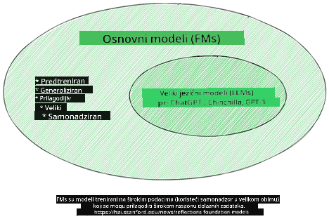
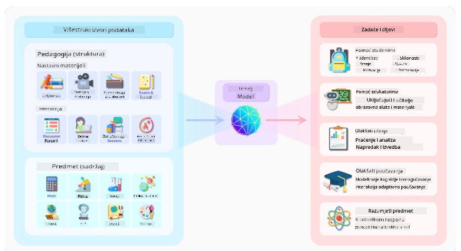
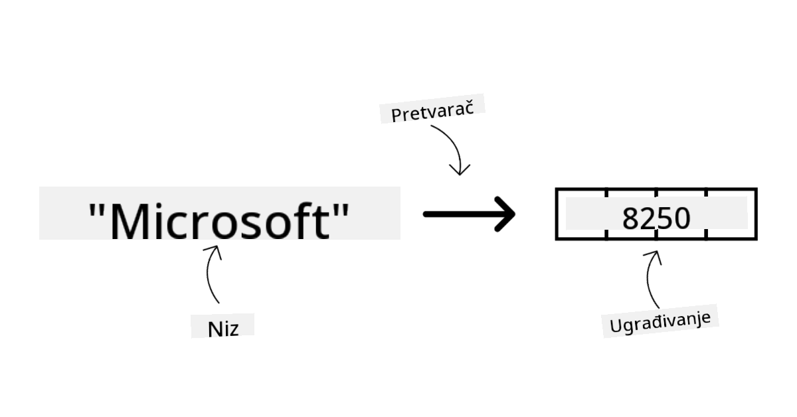
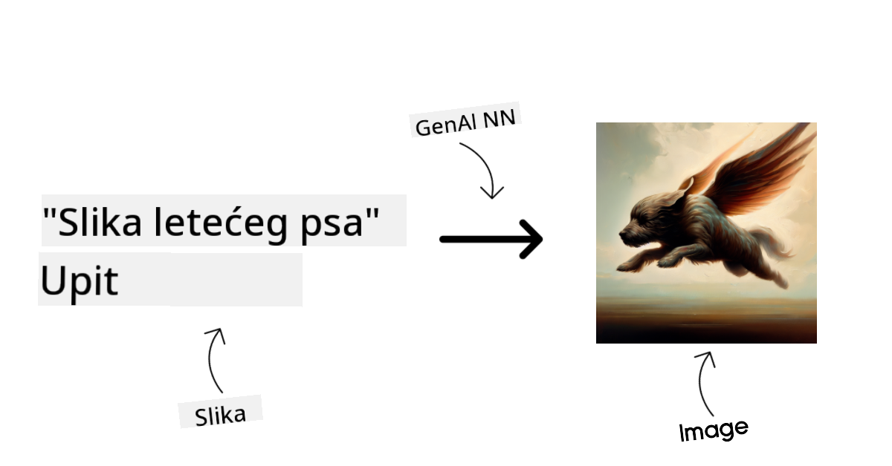
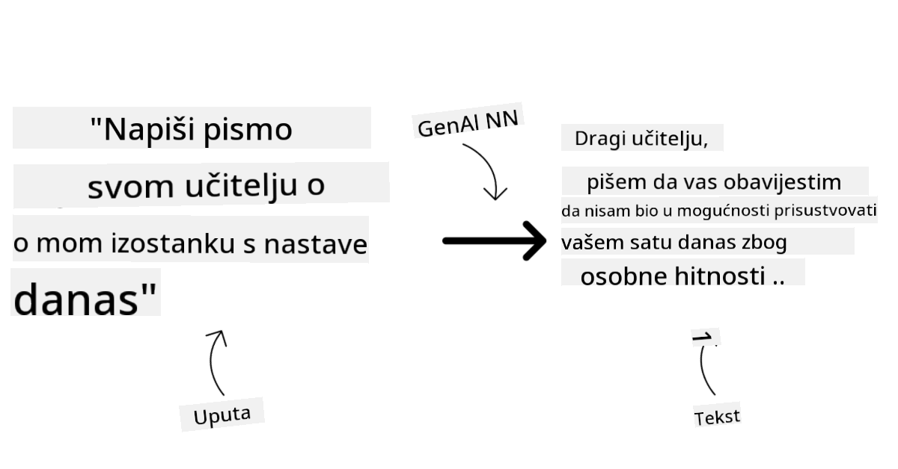
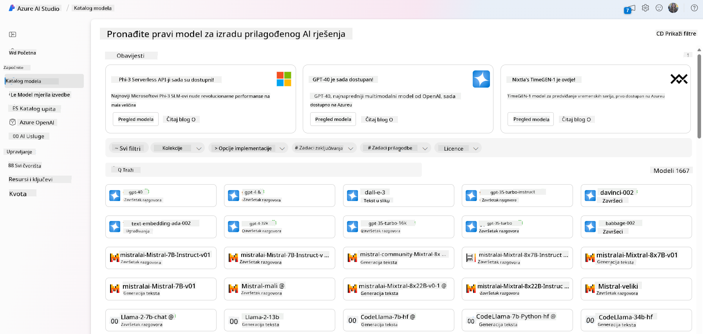
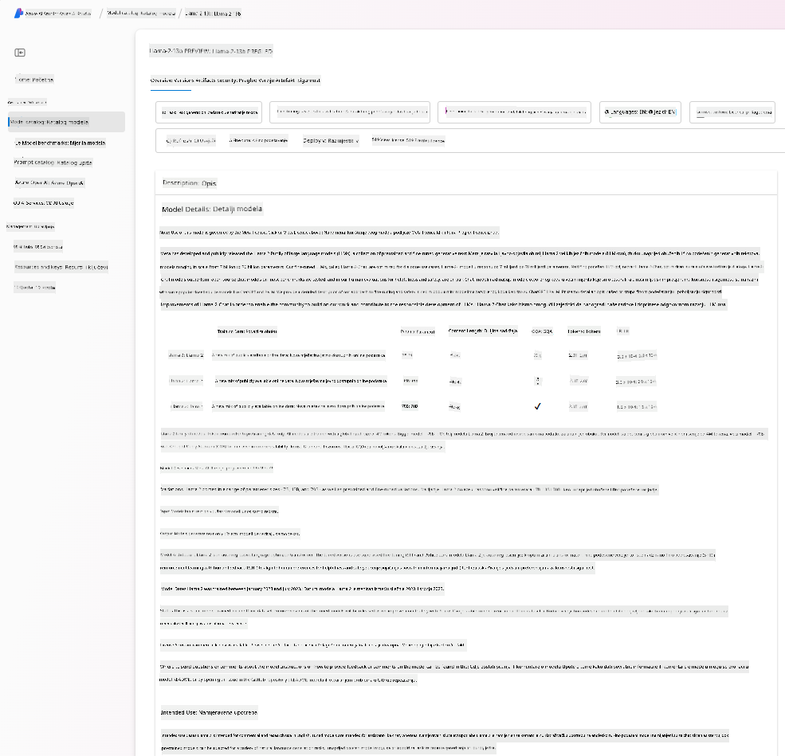
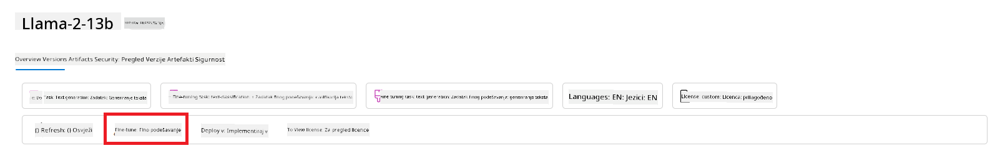
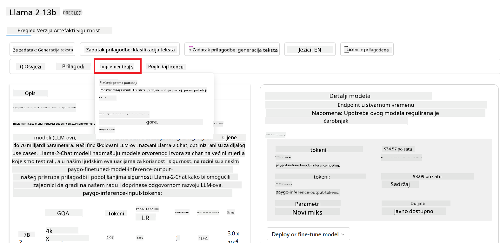
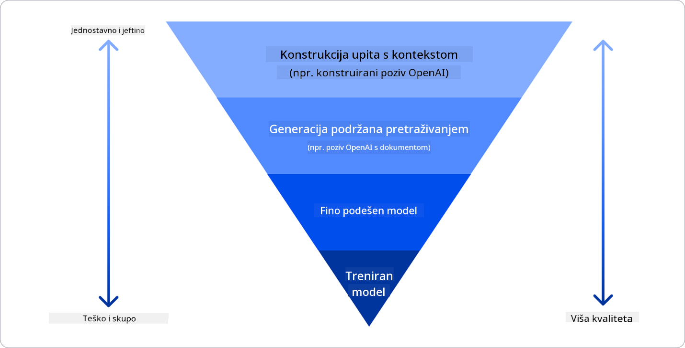

<!--
CO_OP_TRANSLATOR_METADATA:
{
  "original_hash": "e2f686f2eb794941761252ac5e8e090b",
  "translation_date": "2025-07-09T08:42:07+00:00",
  "source_file": "02-exploring-and-comparing-different-llms/README.md",
  "language_code": "hr"
}
-->
# Istraživanje i usporedba različitih LLM-ova

> _Kliknite na gornju sliku za pregled videa ove lekcije_

U prethodnoj lekciji vidjeli smo kako Generativna AI mijenja tehnološki krajolik, kako rade Veliki jezični modeli (LLM-ovi) i kako ih tvrtka – poput našeg startupa – može primijeniti na svoje slučajeve upotrebe i rasti! U ovom poglavlju usporedit ćemo i razlikovati različite vrste velikih jezičnih modela (LLM-ova) kako bismo razumjeli njihove prednosti i nedostatke.

Sljedeći korak u putovanju našeg startupa je istražiti trenutni krajolik LLM-ova i razumjeti koji su prikladni za naš slučaj upotrebe.

## Uvod

Ova lekcija će obuhvatiti:

- Različite vrste LLM-ova u trenutnom krajoliku.
- Testiranje, iteriranje i usporedbu različitih modela za vaš slučaj upotrebe u Azureu.
- Kako implementirati LLM.

## Ciljevi učenja

Nakon završetka ove lekcije moći ćete:

- Odabrati pravi model za svoj slučaj upotrebe.
- Razumjeti kako testirati, iterirati i poboljšati performanse svog modela.
- Znati kako tvrtke implementiraju modele.

## Razumijevanje različitih vrsta LLM-ova

LLM-ovi se mogu kategorizirati na više načina, ovisno o njihovoj arhitekturi, podacima za treniranje i svrsi upotrebe. Razumijevanje ovih razlika pomoći će našem startupu da odabere pravi model za određeni scenarij te da zna kako testirati, iterirati i poboljšati performanse.

Postoji mnogo različitih vrsta LLM modela, a vaš izbor ovisi o tome za što ih želite koristiti, o vašim podacima, koliko ste spremni platiti i još mnogo toga.

Ovisno o tome želite li koristiti modele za tekst, audio, video, generiranje slika i slično, možda ćete odabrati drugačiji tip modela.

- **Prepoznavanje zvuka i govora**. Za ovu svrhu, Whisper modeli su izvrstan izbor jer su opće namjene i usmjereni na prepoznavanje govora. Trenirani su na raznolikim audio zapisima i mogu obavljati prepoznavanje govora na više jezika. Više o [Whisper modelima pročitajte ovdje](https://platform.openai.com/docs/models/whisper?WT.mc_id=academic-105485-koreyst).

- **Generiranje slika**. Za generiranje slika, DALL-E i Midjourney su dva vrlo poznata izbora. DALL-E je dostupan putem Azure OpenAI. [Više o DALL-E pročitajte ovdje](https://platform.openai.com/docs/models/dall-e?WT.mc_id=academic-105485-koreyst) i također u 9. poglavlju ovog kurikuluma.

- **Generiranje teksta**. Većina modela trenirana je za generiranje teksta i imate širok izbor od GPT-3.5 do GPT-4. Cijene variraju, pri čemu je GPT-4 najskuplji. Vrijedi pogledati [Azure OpenAI playground](https://oai.azure.com/portal/playground?WT.mc_id=academic-105485-koreyst) kako biste procijenili koji modeli najbolje odgovaraju vašim potrebama u pogledu mogućnosti i cijene.

- **Višemodalnost**. Ako želite obrađivati više vrsta podataka u ulazu i izlazu, možda ćete htjeti pogledati modele poput [gpt-4 turbo s vidom ili gpt-4o](https://learn.microsoft.com/azure/ai-services/openai/concepts/models#gpt-4-and-gpt-4-turbo-models?WT.mc_id=academic-105485-koreyst) – najnovija izdanja OpenAI modela – koji mogu kombinirati obradu prirodnog jezika s vizualnim razumijevanjem, omogućujući interakcije putem višemodalnih sučelja.

Odabir modela znači da dobivate osnovne mogućnosti, no to često nije dovoljno. Često imate podatke specifične za tvrtku koje na neki način trebate prenijeti LLM-u. Postoji nekoliko različitih pristupa tome, o čemu će biti više riječi u sljedećim odjeljcima.

### Foundation modeli naspram LLM-ova

Pojam Foundation Model (temeljni model) [su skovali istraživači sa Stanforda](https://arxiv.org/abs/2108.07258?WT.mc_id=academic-105485-koreyst) i definiran je kao AI model koji zadovoljava određene kriterije, poput:

- **Trenirani su korištenjem nenadzirane ili samonadzirane metode učenja**, što znači da su trenirani na nemarkiranim višemodalnim podacima i ne zahtijevaju ljudsku anotaciju ili označavanje podataka za proces treniranja.
- **Vrlo su veliki modeli**, temeljeni na dubokim neuronskim mrežama treniranim na milijardama parametara.
- **Obično su namijenjeni kao ‘temelj’ za druge modele**, što znači da se mogu koristiti kao polazna točka za izgradnju drugih modela, što se može postići dodatnim podešavanjem (fine-tuningom).

Izvor slike: [Essential Guide to Foundation Models and Large Language Models | by Babar M Bhatti | Medium](https://thebabar.medium.com/essential-guide-to-foundation-models-and-large-language-models-27dab58f7404)

Da dodatno pojasnimo ovu razliku, uzmimo za primjer ChatGPT. Za izgradnju prve verzije ChatGPT-a, model nazvan GPT-3.5 služio je kao temeljni model. To znači da je OpenAI koristio podatke specifične za chat kako bi stvorio podešenu verziju GPT-3.5 koja je specijalizirana za dobre performanse u konverzacijskim scenarijima, poput chatbota.

Izvor slike: [2108.07258.pdf (arxiv.org)](https://arxiv.org/pdf/2108.07258.pdf?WT.mc_id=academic-105485-koreyst)

### Open source naspram vlasničkih modela

Još jedan način kategorizacije LLM-ova je prema tome jesu li open source ili vlasnički.

Open source modeli su modeli dostupni javnosti i mogu ih koristiti svi. Često ih objavljuje tvrtka koja ih je razvila ili istraživačka zajednica. Ovi modeli se mogu pregledavati, mijenjati i prilagođavati za različite slučajeve upotrebe LLM-ova. Međutim, nisu uvijek optimizirani za produkcijsku upotrebu i možda nisu toliko učinkoviti kao vlasnički modeli. Također, financiranje open source modela može biti ograničeno, a možda se ne održavaju dugoročno ili ne ažuriraju s najnovijim istraživanjima. Primjeri popularnih open source modela su [Alpaca](https://crfm.stanford.edu/2023/03/13/alpaca.html?WT.mc_id=academic-105485-koreyst), [Bloom](https://huggingface.co/bigscience/bloom) i [LLaMA](https://llama.meta.com).

Vlasnički modeli su modeli u vlasništvu tvrtke i nisu dostupni javnosti. Često su optimizirani za produkcijsku upotrebu. Međutim, nije dopušteno pregledavati, mijenjati ili prilagođavati ih za različite slučajeve upotrebe. Također, nisu uvijek besplatni i mogu zahtijevati pretplatu ili plaćanje za korištenje. Korisnici nemaju kontrolu nad podacima koji se koriste za treniranje modela, što znači da se trebaju osloniti na vlasnika modela da osigura poštivanje privatnosti podataka i odgovornu upotrebu AI. Primjeri popularnih vlasničkih modela su [OpenAI modeli](https://platform.openai.com/docs/models/overview?WT.mc_id=academic-105485-koreyst), [Google Bard](https://sapling.ai/llm/bard?WT.mc_id=academic-105485-koreyst) ili [Claude 2](https://www.anthropic.com/index/claude-2?WT.mc_id=academic-105485-koreyst).

### Embedding naspram generiranja slika naspram generiranja teksta i koda

LLM-ovi se također mogu kategorizirati prema tipu izlaza koji generiraju.

Embedding modeli su skup modela koji mogu pretvoriti tekst u numerički oblik, tzv. embedding, što je numerička reprezentacija ulaznog teksta. Embedding modeli olakšavaju strojevima razumijevanje odnosa između riječi ili rečenica i mogu se koristiti kao ulazi drugim modelima, poput klasifikacijskih modela ili modela za grupiranje koji bolje rade s numeričkim podacima. Embedding modeli se često koriste za transferno učenje, gdje se model gradi za zamjenski zadatak za koji postoji obilje podataka, a zatim se težine modela (embeddingi) ponovno koriste za druge zadatke. Primjer ove kategorije su [OpenAI embeddings](https://platform.openai.com/docs/models/embeddings?WT.mc_id=academic-105485-koreyst).

Modeli za generiranje slika su modeli koji generiraju slike. Često se koriste za uređivanje slika, sintezu slika i prevođenje slika. Ovi modeli trenirani su na velikim skupovima podataka slika, poput [LAION-5B](https://laion.ai/blog/laion-5b/?WT.mc_id=academic-105485-koreyst), i mogu se koristiti za generiranje novih slika ili uređivanje postojećih slika tehnikama poput inpaintinga, super-rezolucije i kolorizacije. Primjeri su [DALL-E-3](https://openai.com/dall-e-3?WT.mc_id=academic-105485-koreyst) i [Stable Diffusion modeli](https://github.com/Stability-AI/StableDiffusion?WT.mc_id=academic-105485-koreyst).

Modeli za generiranje teksta i koda su modeli koji generiraju tekst ili kod. Često se koriste za sažimanje teksta, prevođenje i odgovaranje na pitanja. Modeli za generiranje teksta trenirani su na velikim skupovima tekstualnih podataka, poput [BookCorpus](https://www.cv-foundation.org/openaccess/content_iccv_2015/html/Zhu_Aligning_Books_and_ICCV_2015_paper.html?WT.mc_id=academic-105485-koreyst), i mogu se koristiti za generiranje novog teksta ili odgovaranje na pitanja. Modeli za generiranje koda, poput [CodeParrot](https://huggingface.co/codeparrot?WT.mc_id=academic-105485-koreyst), trenirani su na velikim skupovima koda, poput GitHub-a, i mogu se koristiti za generiranje novog koda ili ispravljanje grešaka u postojećem kodu.

### Encoder-Decoder naspram samo Decoder

Da bismo objasnili različite vrste arhitektura LLM-ova, upotrijebimo analogiju.

Zamislite da vam je menadžer dao zadatak da napišete kviz za učenike. Imate dva kolege; jedan je zadužen za kreiranje sadržaja, a drugi za njegovu provjeru.

Kreator sadržaja je poput modela samo s Decoderom, može pogledati temu i vidjeti što ste već napisali, a zatim napisati tečaj na temelju toga. Vrlo su dobri u pisanju zanimljivog i informativnog sadržaja, ali nisu baš dobri u razumijevanju teme i ciljeva učenja. Neki primjeri Decoder modela su GPT obitelj modela, poput GPT-3.

Provjeravatelj je poput modela samo s Encoderom, gleda napisani tečaj i odgovore, primjećuje odnose između njih i razumije kontekst, ali nije dobar u generiranju sadržaja. Primjer modela samo s Encoderom je BERT.

Zamislite da možemo imati nekoga tko može i kreirati i provjeravati kviz, to je Encoder-Decoder model. Neki primjeri su BART i T5.

### Servis naspram modela

Sada, razgovarajmo o razlici između servisa i modela. Servis je proizvod koji nudi pružatelj usluga u oblaku i često je kombinacija modela, podataka i drugih komponenti. Model je osnovna komponenta servisa i često je temeljni model, poput LLM-a.

Servisi su često optimizirani za produkcijsku upotrebu i često su lakši za korištenje od modela, putem grafičkog korisničkog sučelja. Međutim, servisi nisu uvijek besplatni i mogu zahtijevati pretplatu ili plaćanje za korištenje, u zamjenu za korištenje opreme i resursa vlasnika servisa, optimizaciju troškova i jednostavno skaliranje. Primjer servisa je [Azure OpenAI Service](https://learn.microsoft.com/azure/ai-services/openai/overview?WT.mc_id=academic-105485-koreyst), koji nudi model plaćanja po korištenju, što znači da se korisnici naplaćuju proporcionalno koliko koriste servis. Također, Azure OpenAI Service nudi sigurnost na razini poduzeća i okvir za odgovornu upotrebu AI uz mogućnosti modela.

Modeli su samo neuronske mreže s parametrima, težinama i ostalim. Omogućuju tvrtkama da ih pokreću lokalno, no za to je potrebno kupiti opremu, izgraditi infrastrukturu za skaliranje i kupiti licencu ili koristiti open source model. Model poput LLaMA dostupan je za korištenje, ali zahtijeva računalnu snagu za njegovo pokretanje.

## Kako testirati i iterirati s različitim modelima kako biste razumjeli performanse u Azureu

Nakon što je naš tim istražio trenutni krajolik LLM-ova i identificirao nekoliko dobrih kandidata za svoje scenarije, sljedeći korak je testirati ih na svojim podacima i radnom opterećenju. To je iterativni proces, proveden kroz eksperimente i mjerenja.
Većina modela koje smo spomenuli u prethodnim odlomcima (OpenAI modeli, open source modeli poput Llama2 i Hugging Face transformeri) dostupni su u [Model Catalog](https://learn.microsoft.com/azure/ai-studio/how-to/model-catalog-overview?WT.mc_id=academic-105485-koreyst) u [Azure AI Studio](https://ai.azure.com/?WT.mc_id=academic-105485-koreyst).

[Azure AI Studio](https://learn.microsoft.com/azure/ai-studio/what-is-ai-studio?WT.mc_id=academic-105485-koreyst) je Cloud platforma dizajnirana za developere za izgradnju generativnih AI aplikacija i upravljanje cijelim razvojnim ciklusom – od eksperimentiranja do evaluacije – kombinirajući sve Azure AI usluge u jedinstveni centar s praktičnim GUI-jem. Model Catalog u Azure AI Studio omogućuje korisniku da:

- Pronađe Foundation Model od interesa u katalogu – bilo vlasnički ili open source, filtrirajući po zadatku, licenci ili imenu. Kako bi se poboljšala pretraživost, modeli su organizirani u kolekcije, poput Azure OpenAI kolekcije, Hugging Face kolekcije i drugih.

- Pregleda model card, uključujući detaljan opis namjene i podataka za treniranje, primjere koda i rezultate evaluacije u internom evaluacijskom spremištu.

- Usporedi benchmarke između modela i skupova podataka dostupnih u industriji kako bi procijenio koji najbolje odgovara poslovnom scenariju, kroz [Model Benchmarks](https://learn.microsoft.com/azure/ai-studio/how-to/model-benchmarks?WT.mc_id=academic-105485-koreyst) panel.

- Fino podešava model na prilagođenim podacima za treniranje kako bi poboljšao performanse modela u specifičnom zadatku, koristeći mogućnosti eksperimentiranja i praćenja u Azure AI Studio.

- Implementira originalni prethodno trenirani model ili fino podešenu verziju na udaljeni real-time inference – upravljani compute – ili serverless API endpoint – [pay-as-you-go](https://learn.microsoft.com/azure/ai-studio/how-to/model-catalog-overview#model-deployment-managed-compute-and-serverless-api-pay-as-you-go?WT.mc_id=academic-105485-koreyst) – kako bi aplikacije mogle koristiti model.

> [!NOTE]
> Nisu svi modeli u katalogu trenutno dostupni za fino podešavanje i/ili pay-as-you-go implementaciju. Provjerite model card za detalje o mogućnostima i ograničenjima modela.

## Poboljšanje rezultata LLM-a

Naš startup tim je istraživao različite vrste LLM-ova i Cloud platformu (Azure Machine Learning) koja nam omogućuje usporedbu različitih modela, njihovu evaluaciju na testnim podacima, poboljšanje performansi i implementaciju na inference endpointima.

Ali kada bi trebali razmotriti fino podešavanje modela umjesto korištenja prethodno treniranog? Postoje li drugi pristupi za poboljšanje performansi modela na specifičnim zadacima?

Poslovanje može koristiti nekoliko pristupa kako bi dobilo željene rezultate od LLM-a. Možete odabrati različite vrste modela s različitim stupnjevima treniranja prilikom implementacije LLM-a u produkciju, s različitim razinama složenosti, troškova i kvalitete. Evo nekoliko pristupa:

- **Prompt engineering s kontekstom**. Ideja je pružiti dovoljno konteksta u promptu kako biste osigurali da dobijete potrebne odgovore.

- **Retrieval Augmented Generation, RAG**. Vaši podaci mogu postojati u bazi podataka ili web endpointu, na primjer, kako biste osigurali da ti podaci ili njihov podskup budu uključeni u trenutku promptanja, možete dohvatiti relevantne podatke i uključiti ih u prompt korisnika.

- **Fino podešeni model**. Ovdje ste dodatno trenirali model na vlastitim podacima što je rezultiralo time da je model precizniji i bolje odgovara vašim potrebama, ali može biti skuplje.

Izvor slike: [Four Ways that Enterprises Deploy LLMs | Fiddler AI Blog](https://www.fiddler.ai/blog/four-ways-that-enterprises-deploy-llms?WT.mc_id=academic-105485-koreyst)

### Prompt Engineering s kontekstom

Prethodno trenirani LLM-ovi vrlo dobro rade na općenitim zadacima prirodnog jezika, čak i kada ih se pozove s kratkim promptom, poput rečenice za dovršetak ili pitanja – tzv. “zero-shot” učenje.

Međutim, što korisnik detaljnije oblikuje svoj upit, s detaljnim zahtjevom i primjerima – Kontekstom – to će odgovor biti precizniji i bliži očekivanjima korisnika. U tom slučaju govorimo o “one-shot” učenju ako prompt uključuje samo jedan primjer i “few-shot” učenju ako uključuje više primjera. Prompt engineering s kontekstom je najisplativiji pristup za početak.

### Retrieval Augmented Generation (RAG)

LLM-ovi imaju ograničenje da mogu koristiti samo podatke koji su korišteni tijekom njihovog treniranja za generiranje odgovora. To znači da ne znaju ništa o događajima koji su se dogodili nakon procesa treniranja i ne mogu pristupiti ne-javnim informacijama (poput podataka tvrtke).
To se može prevladati tehnikom RAG, koja proširuje prompt vanjskim podacima u obliku dijelova dokumenata, uzimajući u obzir ograničenja duljine prompta. To podržavaju alati za vektorske baze podataka (poput [Azure Vector Search](https://learn.microsoft.com/azure/search/vector-search-overview?WT.mc_id=academic-105485-koreyst)) koji dohvaćaju korisne dijelove iz različitih unaprijed definiranih izvora podataka i dodaju ih u kontekst prompta.

Ova tehnika je vrlo korisna kada poslovanje nema dovoljno podataka, vremena ili resursa za fino podešavanje LLM-a, ali želi poboljšati performanse na specifičnom zadatku i smanjiti rizik od izmišljotina, tj. iskrivljavanja stvarnosti ili štetnog sadržaja.

### Fino podešeni model

Fino podešavanje je proces koji koristi transfer learning za ‘prilagodbu’ modela na zadatak niže razine ili za rješavanje specifičnog problema. Za razliku od few-shot učenja i RAG-a, rezultira generiranjem novog modela s ažuriranim težinama i pristranostima. Potreban je skup primjera za treniranje koji se sastoje od jednog ulaza (prompt) i pripadajućeg izlaza (dovršetak).
Ovo bi bio preferirani pristup ako:

- **Koristite fino podešene modele**. Poslovanje želi koristiti fino podešene manje sposobne modele (poput embedding modela) umjesto visokoperformantnih modela, što rezultira isplativijim i bržim rješenjem.

- **Razmatrate latenciju**. Latencija je važna za specifičan slučaj upotrebe, pa nije moguće koristiti vrlo duge promte ili broj primjera koje model treba naučiti ne odgovara ograničenju duljine prompta.

- **Ostajete ažurni**. Poslovanje ima mnogo kvalitetnih podataka i točnih oznaka te resurse potrebne za održavanje tih podataka ažurnima tijekom vremena.

### Trenirani model

Treniranje LLM-a od nule je bez sumnje najzahtjevniji i najsloženiji pristup, koji zahtijeva ogromne količine podataka, stručne resurse i odgovarajuću računalnu snagu. Ova opcija treba biti razmotrena samo u scenariju gdje poslovanje ima domenom specifičan slučaj upotrebe i veliku količinu domenom centriranih podataka.

## Provjera znanja

Koji bi bio dobar pristup za poboljšanje rezultata dovršetka LLM-a?

1. Prompt engineering s kontekstom  
1. RAG  
1. Fino podešeni model

Odgovor: 3, ako imate vremena, resursa i kvalitetne podatke, fino podešavanje je bolja opcija za ostati ažuran. Međutim, ako želite brzo poboljšanje i nemate puno vremena, vrijedi prvo razmotriti RAG.

## 🚀 Izazov

Pročitajte više o tome kako možete [koristiti RAG](https://learn.microsoft.com/azure/search/retrieval-augmented-generation-overview?WT.mc_id=academic-105485-koreyst) za svoje poslovanje.

## Odličan posao, nastavite s učenjem

Nakon što završite ovu lekciju, pogledajte našu [Generative AI Learning kolekciju](https://aka.ms/genai-collection?WT.mc_id=academic-105485-koreyst) kako biste nastavili podizati svoje znanje o Generativnoj AI!

Krenite na Lekciju 3 gdje ćemo pogledati kako [odgovorno graditi s Generativnom AI](../03-using-generative-ai-responsibly/README.md?WT.mc_id=academic-105485-koreyst)!

**Odricanje od odgovornosti**:  
Ovaj dokument je preveden korištenjem AI usluge za prevođenje [Co-op Translator](https://github.com/Azure/co-op-translator). Iako težimo točnosti, imajte na umu da automatski prijevodi mogu sadržavati pogreške ili netočnosti. Izvorni dokument na izvornom jeziku treba smatrati autoritativnim izvorom. Za kritične informacije preporučuje se profesionalni ljudski prijevod. Ne snosimo odgovornost za bilo kakva nesporazuma ili pogrešna tumačenja koja proizlaze iz korištenja ovog prijevoda.