<!--
CO_OP_TRANSLATOR_METADATA:
{
  "original_hash": "e2f686f2eb794941761252ac5e8e090b",
  "translation_date": "2025-06-25T11:04:35+00:00",
  "source_file": "02-exploring-and-comparing-different-llms/README.md",
  "language_code": "hr"
}
-->
# Istraživanje i usporedba različitih LLM-ova

> _Kliknite na sliku iznad kako biste pogledali videozapis ove lekcije_

U prethodnoj lekciji vidjeli smo kako Generativna AI mijenja tehnološki krajolik, kako rade veliki jezični modeli (LLM-ovi) i kako ih tvrtka - poput našeg startupa - može primijeniti na svoje slučajeve korištenja i rasti! U ovom poglavlju usporedit ćemo i kontrastirati različite tipove velikih jezičnih modela (LLM-ova) kako bismo razumjeli njihove prednosti i nedostatke.

Sljedeći korak na putu našeg startupa je istraživanje trenutnog krajolika LLM-ova i razumijevanje koji su prikladni za naš slučaj korištenja.

## Uvod

Ova lekcija će pokriti:

- Različite tipove LLM-ova u trenutnom krajoliku.
- Testiranje, iteraciju i usporedbu različitih modela za vaš slučaj korištenja u Azureu.
- Kako implementirati LLM.

## Ciljevi učenja

Nakon završetka ove lekcije, moći ćete:

- Odabrati pravi model za vaš slučaj korištenja.
- Razumjeti kako testirati, iterirati i poboljšati performanse vašeg modela.
- Znati kako tvrtke implementiraju modele.

## Razumijevanje različitih tipova LLM-ova

LLM-ovi mogu imati više kategorizacija temeljenih na njihovoj arhitekturi, podacima za obuku i slučaju korištenja. Razumijevanje tih razlika pomoći će našem startupu da odabere pravi model za scenarij i razumije kako testirati, iterirati i poboljšati performanse.

Postoji mnogo različitih tipova LLM modela, a vaš izbor modela ovisi o tome za što ih namjeravate koristiti, vašim podacima, koliko ste spremni platiti i više.

Ovisno o tome želite li koristiti modele za tekst, audio, video, generiranje slika i tako dalje, možete odabrati drugačiji tip modela.

- **Prepoznavanje zvuka i govora**. Za ovu svrhu, modeli tipa Whisper su odličan izbor jer su univerzalni i usmjereni na prepoznavanje govora. Obučeni su na raznolikim audio podacima i mogu izvoditi višejezično prepoznavanje govora. Saznajte više o [Whisper tip modelima ovdje](https://platform.openai.com/docs/models/whisper?WT.mc_id=academic-105485-koreyst).

- **Generiranje slika**. Za generiranje slika, DALL-E i Midjourney su dva vrlo poznata izbora. DALL-E nudi Azure OpenAI. [Pročitajte više o DALL-E ovdje](https://platform.openai.com/docs/models/dall-e?WT.mc_id=academic-105485-koreyst) i također u poglavlju 9 ovog kurikuluma.

- **Generiranje teksta**. Većina modela je obučena za generiranje teksta i imate veliki izbor od GPT-3.5 do GPT-4. Oni dolaze po različitim cijenama, pri čemu je GPT-4 najskuplji. Vrijedi istražiti [Azure OpenAI playground](https://oai.azure.com/portal/playground?WT.mc_id=academic-105485-koreyst) kako biste procijenili koji modeli najbolje odgovaraju vašim potrebama u smislu sposobnosti i troškova.

- **Višestruka modalnost**. Ako želite rukovati s više tipova podataka na ulazu i izlazu, možda ćete htjeti istražiti modele kao što su [gpt-4 turbo s vizijom ili gpt-4o](https://learn.microsoft.com/azure/ai-services/openai/concepts/models#gpt-4-and-gpt-4-turbo-models?WT.mc_id=academic-105485-koreyst) - najnovija izdanja OpenAI modela - koji su sposobni kombinirati obradu prirodnog jezika s vizualnim razumijevanjem, omogućujući interakcije putem višestrukih modalnih sučelja.

Odabir modela znači da dobivate neke osnovne sposobnosti, koje možda neće biti dovoljne. Često imate podatke specifične za tvrtku koje nekako trebate prenijeti LLM-u. Postoji nekoliko različitih izbora kako pristupiti tome, više o tome u nadolazećim odjeljcima.

### Temeljni modeli naspram LLM-ova

Pojam Temeljni model je [skovan od strane istraživača sa Stanforda](https://arxiv.org/abs/2108.07258?WT.mc_id=academic-105485-koreyst) i definiran kao AI model koji slijedi određene kriterije, kao što su:

- **Obučeni su korištenjem nenadziranog učenja ili samo-nadziranog učenja**, što znači da su obučeni na neoznačenim multimodalnim podacima i ne zahtijevaju ljudsku anotaciju ili označavanje podataka za svoj proces obuke.
- **Vrlo su veliki modeli**, temeljeni na vrlo dubokim neuronskim mrežama obučenim na milijardama parametara.
- **Obično su namijenjeni da služe kao 'temelj' za druge modele**, što znači da se mogu koristiti kao početna točka za izgradnju drugih modela, što se može postići finim podešavanjem.

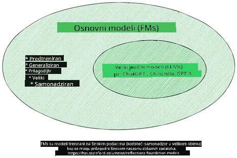

Izvor slike: [Essential Guide to Foundation Models and Large Language Models | by Babar M Bhatti | Medium
](https://thebabar.medium.com/essential-guide-to-foundation-models-and-large-language-models-27dab58f7404)

Kako bismo dodatno pojasnili ovu razliku, uzmimo ChatGPT kao primjer. Za izgradnju prve verzije ChatGPT-a, model nazvan GPT-3.5 služio je kao temeljni model. To znači da je OpenAI koristio neke podatke specifične za chat kako bi stvorio prilagođenu verziju GPT-3.5 koja je bila specijalizirana za dobro izvođenje u konverzacijskim scenarijima, poput chatbotova.

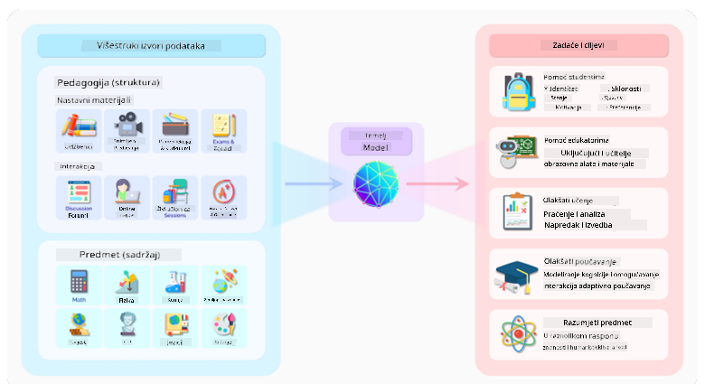

Izvor slike: [2108.07258.pdf (arxiv.org)](https://arxiv.org/pdf/2108.07258.pdf?WT.mc_id=academic-105485-koreyst)

### Otvoreni izvor naspram vlasničkih modela

Drugi način kategorizacije LLM-ova je jesu li oni otvorenog izvora ili vlasnički.

Modeli otvorenog izvora su modeli koji su dostupni javnosti i mogu ih koristiti svi. Često ih čini dostupnima tvrtka koja ih je stvorila ili istraživačka zajednica. Ovi modeli mogu se pregledavati, mijenjati i prilagođavati za različite slučajeve korištenja u LLM-ovima. Međutim, nisu uvijek optimizirani za proizvodnu upotrebu i možda nisu toliko učinkoviti kao vlasnički modeli. Osim toga, financiranje za modele otvorenog izvora može biti ograničeno i možda neće biti dugoročno održavani ili ažurirani s najnovijim istraživanjima. Primjeri popularnih modela otvorenog izvora uključuju [Alpaca](https://crfm.stanford.edu/2023/03/13/alpaca.html?WT.mc_id=academic-105485-koreyst), [Bloom](https://huggingface.co/bigscience/bloom) i [LLaMA](https://llama.meta.com).

Vlasnički modeli su modeli koji su u vlasništvu tvrtke i nisu dostupni javnosti. Ovi modeli često su optimizirani za proizvodnu upotrebu. Međutim, nije im dopušteno da se pregledavaju, mijenjaju ili prilagođavaju za različite slučajeve korištenja. Osim toga, nisu uvijek dostupni besplatno i mogu zahtijevati pretplatu ili plaćanje za korištenje. Također, korisnici nemaju kontrolu nad podacima koji se koriste za obuku modela, što znači da bi trebali povjeriti vlasniku modela osiguranje posvećenosti privatnosti podataka i odgovornoj upotrebi AI. Primjeri popularnih vlasničkih modela uključuju [OpenAI modele](https://platform.openai.com/docs/models/overview?WT.mc_id=academic-105485-koreyst), [Google Bard](https://sapling.ai/llm/bard?WT.mc_id=academic-105485-koreyst) ili [Claude 2](https://www.anthropic.com/index/claude-2?WT.mc_id=academic-105485-koreyst).

### Ugrađivanje naspram generiranja slika naspram generiranja teksta i koda

LLM-ovi se također mogu kategorizirati prema izlazu koji generiraju.

Ugrađivanja su skup modela koji mogu pretvoriti tekst u numerički oblik, nazvan ugrađivanje, što je numerička reprezentacija ulaznog teksta. Ugrađivanja olakšavaju strojevima razumijevanje odnosa između riječi ili rečenica i mogu se koristiti kao ulazi drugim modelima, poput modela za klasifikaciju ili modela za klasteriranje koji imaju bolje performanse na numeričkim podacima. Modeli ugrađivanja često se koriste za prijenosno učenje, gdje se model gradi za zamjenski zadatak za koji postoji obilje podataka, a zatim se težine modela (ugrađivanja) ponovno koriste za druge zadatke nizvodno. Primjer ove kategorije je [OpenAI ugrađivanja](https://platform.openai.com/docs/models/embeddings?WT.mc_id=academic-105485-koreyst).

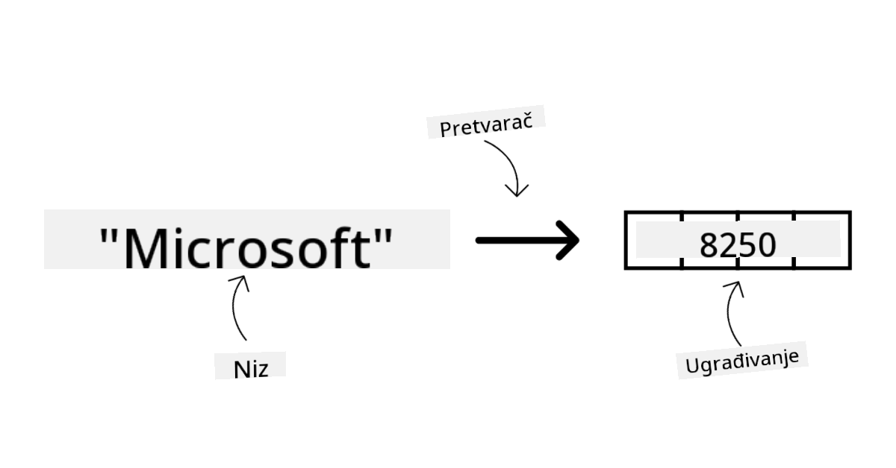

Modeli za generiranje slika su modeli koji generiraju slike. Ovi modeli često se koriste za uređivanje slika, sintetičke slike i prevođenje slika. Modeli za generiranje slika često se obučavaju na velikim skupovima podataka slika, kao što je [LAION-5B](https://laion.ai/blog/laion-5b/?WT.mc_id=academic-105485-koreyst), i mogu se koristiti za generiranje novih slika ili za uređivanje postojećih slika tehnikama inpaintinga, super-rezolucije i koloriranja. Primjeri uključuju [DALL-E-3](https://openai.com/dall-e-3?WT.mc_id=academic-105485-koreyst) i [Stable Diffusion modele](https://github.com/Stability-AI/StableDiffusion?WT.mc_id=academic-105485-koreyst).

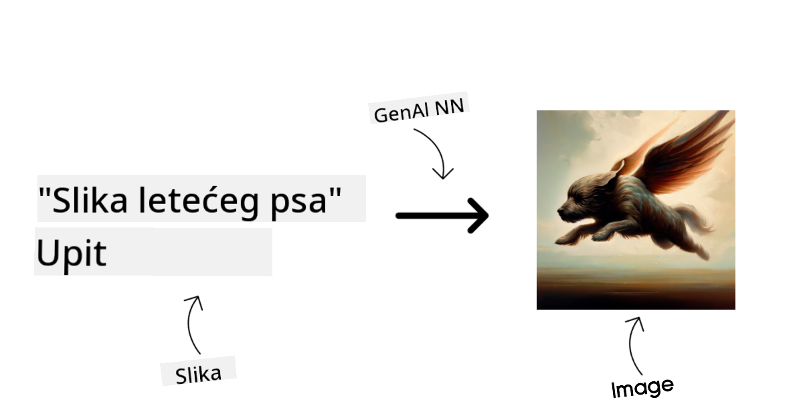

Modeli za generiranje teksta i koda su modeli koji generiraju tekst ili kod. Ovi modeli često se koriste za sažimanje teksta, prevođenje i odgovaranje na pitanja. Modeli za generiranje teksta često se obučavaju na velikim skupovima podataka teksta, kao što je [BookCorpus](https://www.cv-foundation.org/openaccess/content_iccv_2015/html/Zhu_Aligning_Books_and_ICCV_2015_paper.html?WT.mc_id=academic-105485-koreyst), i mogu se koristiti za generiranje novog teksta ili za odgovaranje na pitanja. Modeli za generiranje koda, poput [CodeParrot](https://huggingface.co/codeparrot?WT.mc_id=academic-105485-koreyst), često se obučavaju na velikim skupovima podataka koda, kao što je GitHub, i mogu se koristiti za generiranje novog koda ili za ispravljanje pogrešaka u postojećem kodu.

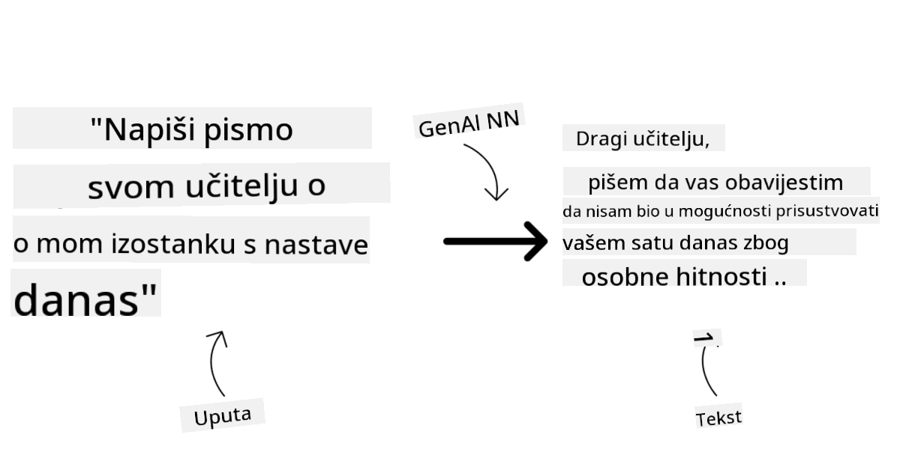

### Encoder-Decoder naspram samo Decoder

Da bismo razgovarali o različitim vrstama arhitektura LLM-ova, koristit ćemo analogiju.

Zamislite da vam je menadžer dao zadatak da napišete kviz za studente. Imate dva kolege; jedan je zadužen za kreiranje sadržaja, a drugi za pregledavanje.

Kreator sadržaja je poput modela samo Decoder, može pogledati temu i vidjeti što ste već napisali, a zatim može napisati tečaj temeljen na tome. Vrlo su dobri u pisanju angažirajućeg i informativnog sadržaja, ali nisu jako dobri u razumijevanju teme i ciljeva učenja. Neki primjeri modela Decoder su modeli obitelji GPT, kao što je GPT-3.

Pregledatelj je poput modela samo Encoder, gleda tečaj koji je napisan i odgovore, primjećujući odnos između njih i razumijevajući kontekst, ali nije dobar u generiranju sadržaja. Primjer modela samo Encoder bio bi BERT.

Zamislite da također možemo imati nekoga tko bi mogao kreirati i pregledavati kviz, to je model Encoder-Decoder. Neki primjeri bi bili BART i T5.

### Usluga naspram modela

Sada, razgovarajmo o razlici između usluge i modela. Usluga je proizvod koji nudi pružatelj usluga u oblaku i često je kombinacija modela, podataka i drugih komponenti. Model je temeljna komponenta usluge i često je temeljni model, poput LLM-a.

Usluge su često optimizirane za proizvodnu upotrebu i često su lakše za korištenje od modela, putem grafičkog korisničkog sučelja. Međutim, usluge nisu uvijek dostupne besplatno i mogu zahtijevati pretplatu ili plaćanje za korištenje, u zamjenu za korištenje opreme i resursa vlasnika usluge, optimizirajući troškove i lako skalirajući. Primjer usluge je [Azure OpenAI Service](https://learn.microsoft.com/azure/ai-services/openai/overview?WT.mc_id=academic-105485-koreyst), koja nudi plan cijena po korištenju, što znači da se korisnici naplaćuju proporcionalno koliko koriste uslugu. Također, Azure OpenAI Service nudi sigurnost na razini poduzeća i odgovorni AI okvir na vrhu sposobnosti modela.

Modeli su samo neuronske mreže, s parametrima, težinama i ostalim. Omogućuju tvrtkama da ih pokreću lokalno, međutim, trebale bi kupiti opremu, izgraditi strukturu za skaliranje i kupiti licencu ili koristiti model otvorenog izvora. Model poput LLaMA dostupan je za korištenje, zahtijevajući računalnu snagu za pokretanje modela.

## Kako testirati i iterirati s različitim modelima kako bi se razumjele performanse na Azureu

Nakon što je naš tim istražio trenutni krajolik LLM-ova i identificirao neke dobre kandidate za njihove scenarije, sljedeći korak je testiranje na njihovim podacima i opterećenju. Ovo je iterativni proces, provodi se eksperimentima i mjerenjima. Većina modela koje smo spomenuli u prethodnim odlomcima (OpenAI modeli, modeli otvorenog izvora poput Llama2 i Hugging Face transformatori) dostupni su u [Katalogu modela](https://learn.microsoft.com/azure/ai-studio/how-to/model-catalog-overview?WT.mc_id=academic-105485-koreyst) u [Azure AI Studiju](https://ai.azure.com/?WT.mc_id=academic-105485-koreyst).

[Azure AI Studio](https://learn.microsoft.com/azure/ai-studio/what-is-ai-studio?WT.mc_id=academic-105485-koreyst) je platforma u oblaku dizajnirana za programere za izgradnju generativnih AI aplikacija i upravljanje cijelim razvojnim ciklusom - od eksperimentiranja do evaluacije - kombiniranjem svih Azure AI usluga u jedan centar s praktičnim GUI-jem. Katalog modela u Azure AI Studiju omogućuje korisniku da:

- Pronađe temeljni model od interesa u katalogu - bilo vlasnički ili otvorenog izvora, filtrirajući prema zadatku, licenci ili imenu. Za poboljšanje pretraživosti, modeli su organizirani u zbirke, poput zbirke Azure OpenAI, zbirke Hugging Face i drugih.

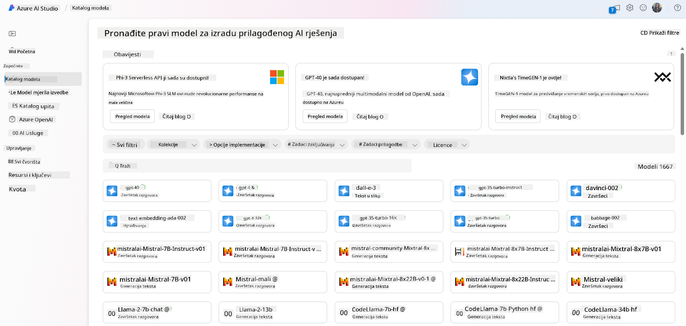

- Pregleda karticu modela, uključujući detaljan opis namjene i podataka za obuku, primjere koda i rezultate evaluacije na internim evaluacijskim bibliotekama.

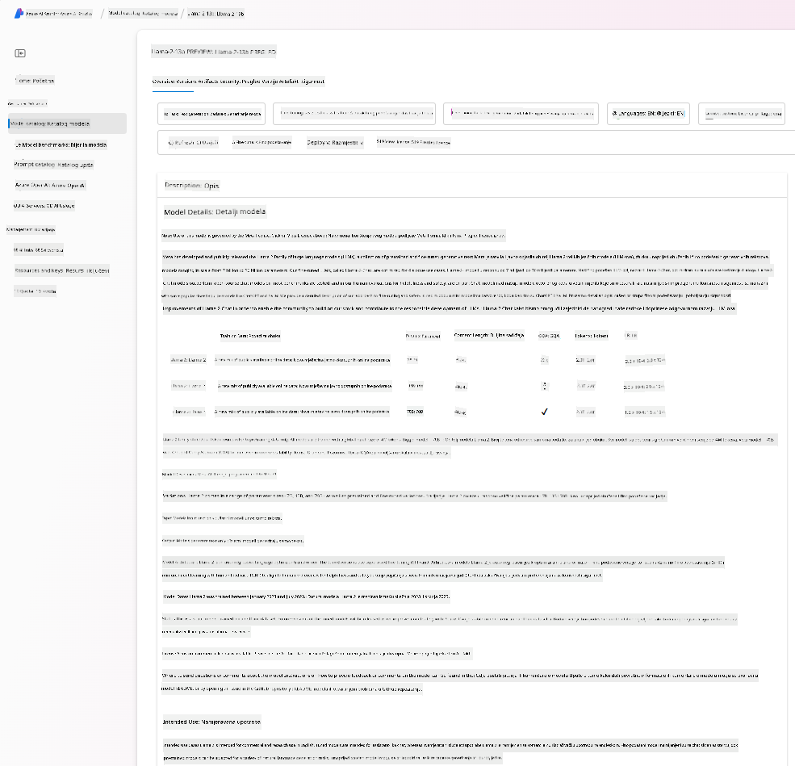
- Usporedite referentne točke među modelima i skupovima podataka dostupnim u industriji kako biste procijenili koji zadovoljava poslovni scenarij, putem okna [Model Benchmarks](https://learn.microsoft.com/azure/ai-studio/how-to/model-benchmarks?WT.mc_id=academic-105485-koreyst).

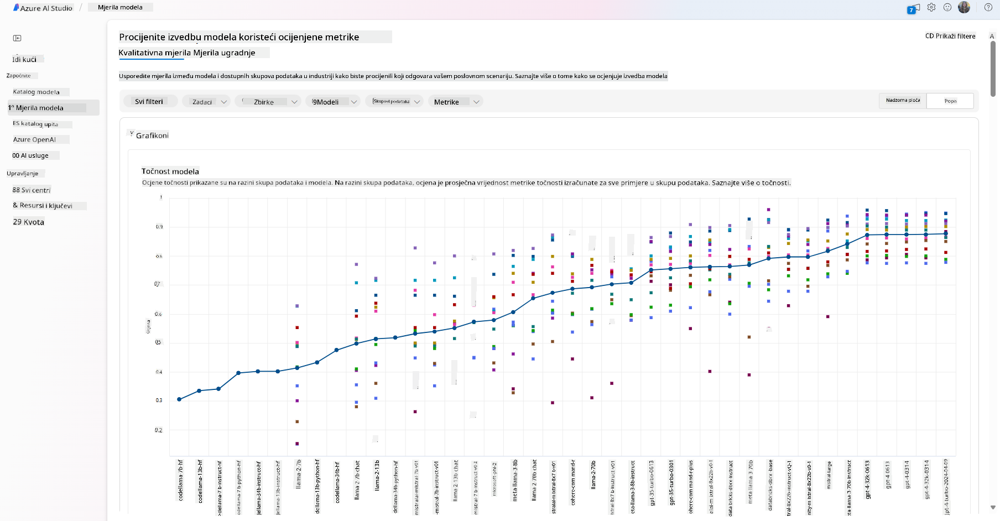

- Fino prilagodite model na prilagođenim podacima za obuku kako biste poboljšali performanse modela u određenom radnom opterećenju, koristeći mogućnosti eksperimentiranja i praćenja Azure AI Studija.

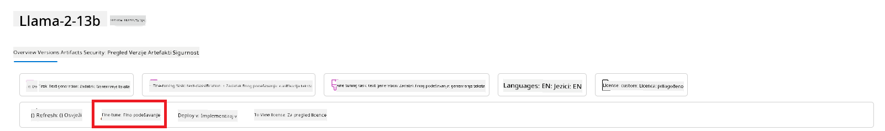

- Implementirajte izvorni unaprijed obučeni model ili fino podešenu verziju na udaljenu stvarnu vremensku inferenciju - upravljano računanje - ili serverless API krajnju točku - [plaćanje po korištenju](https://learn.microsoft.com/azure/ai-studio/how-to/model-catalog-overview#model-deployment-managed-compute-and-serverless-api-pay-as-you-go?WT.mc_id=academic-105485-koreyst) - kako bi ga aplikacije mogle koristiti.

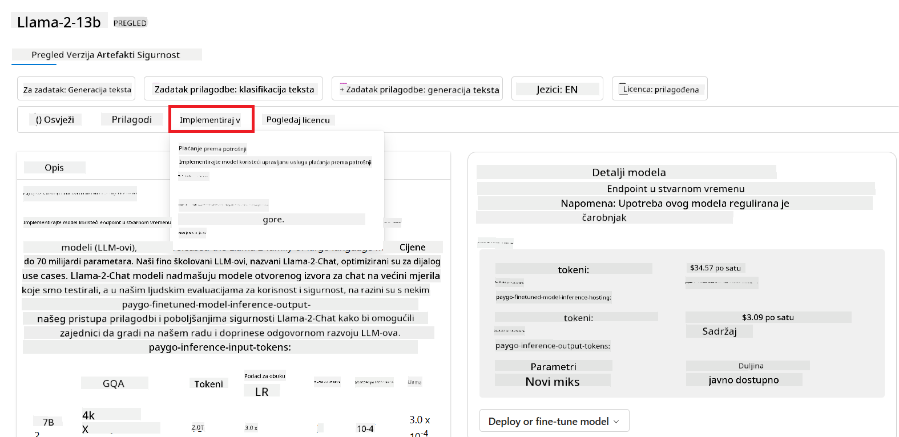

> [!NOTE]
> Trenutno nisu svi modeli u katalogu dostupni za fino podešavanje i/ili implementaciju s plaćanjem po korištenju. Provjerite karticu modela za detalje o mogućnostima i ograničenjima modela.

## Poboljšanje rezultata LLM-a

Istražili smo s našim startup timom različite vrste LLM-ova i Cloud Platformu (Azure Machine Learning) koja nam omogućuje usporedbu različitih modela, evaluaciju na testnim podacima, poboljšanje performansi i implementaciju na krajnje točke za inferenciju.

No, kada bi trebali razmotriti fino podešavanje modela umjesto korištenja unaprijed obučenog? Postoje li drugi pristupi za poboljšanje performansi modela u specifičnim radnim opterećenjima?

Postoji nekoliko pristupa koje tvrtka može koristiti kako bi postigla rezultate koje želi od LLM-a. Možete odabrati različite vrste modela s različitim stupnjevima obuke pri implementaciji LLM-a u proizvodnju, s različitim razinama složenosti, troškova i kvalitete. Evo nekoliko različitih pristupa:

- **Inženjering prompta s kontekstom**. Ideja je pružiti dovoljno konteksta kada postavljate prompt kako biste osigurali da dobijete odgovore koje trebate.

- **Generacija uz obogaćeno dohvaćanje, RAG**. Vaši podaci mogu postojati u bazi podataka ili web krajnjoj točki, na primjer, kako bi osigurali da ti podaci, ili njihov podskup, budu uključeni u trenutku postavljanja prompta, možete dohvatiti relevantne podatke i učiniti ih dijelom korisničkog prompta.

- **Fino podešeni model**. Ovdje ste dodatno obučili model na vlastitim podacima što je dovelo do toga da model bude precizniji i odgovara vašim potrebama, ali to može biti skupo.

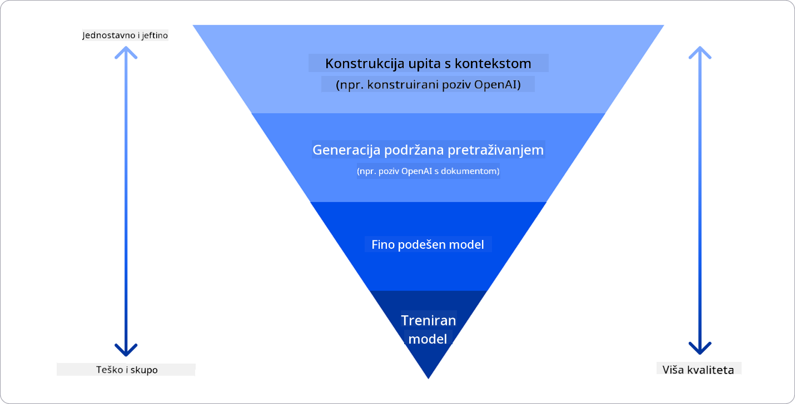

Izvor slike: [Četiri načina na koje poduzeća implementiraju LLM-ove | Fiddler AI Blog](https://www.fiddler.ai/blog/four-ways-that-enterprises-deploy-llms?WT.mc_id=academic-105485-koreyst)

### Inženjering prompta s kontekstom

Unaprijed obučeni LLM-ovi vrlo dobro rade na generaliziranim zadacima obrade prirodnog jezika, čak i kada ih pozovete s kratkim promptom, poput rečenice za dovršavanje ili pitanja – takozvano “zero-shot” učenje.

Međutim, što više korisnik može oblikovati svoj upit, s detaljnim zahtjevom i primjerima – Kontekst – to će odgovor biti točniji i bliži očekivanjima korisnika. U ovom slučaju govorimo o “one-shot” učenju ako prompt uključuje samo jedan primjer i “few-shot učenju” ako uključuje više primjera. Inženjering prompta s kontekstom je najisplativiji pristup za početak.

### Generacija uz obogaćeno dohvaćanje (RAG)

LLM-ovi imaju ograničenje da mogu koristiti samo podatke koji su korišteni tijekom njihove obuke za generiranje odgovora. To znači da ne znaju ništa o činjenicama koje su se dogodile nakon procesa obuke i ne mogu pristupiti nejavnim informacijama (poput podataka tvrtke).
To se može prevladati kroz RAG, tehniku koja obogaćuje prompt vanjskim podacima u obliku dijelova dokumenata, uzimajući u obzir ograničenja duljine prompta. To podržavaju alati za pretraživanje vektora (poput [Azure Vector Search](https://learn.microsoft.com/azure/search/vector-search-overview?WT.mc_id=academic-105485-koreyst)) koji dohvaćaju korisne dijelove iz raznih unaprijed definiranih izvora podataka i dodaju ih u kontekst prompta.

Ova tehnika je vrlo korisna kada tvrtka nema dovoljno podataka, dovoljno vremena ili resursa za fino podešavanje LLM-a, ali ipak želi poboljšati performanse na određenom radnom opterećenju i smanjiti rizike od izmišljotina, tj. mistifikacije stvarnosti ili štetnog sadržaja.

### Fino podešeni model

Fino podešavanje je proces koji koristi prijenosno učenje za 'prilagodbu' modela zadatku nizvodno ili za rješavanje određenog problema. Za razliku od few-shot učenja i RAG-a, rezultira generiranjem novog modela s ažuriranim težinama i pristranostima. Zahtijeva skup primjera za obuku koji se sastoje od jednog unosa (prompt) i njegovog povezanog izlaza (dovršetak).
Ovo bi bio preferirani pristup ako:

- **Korištenje fino podešenih modela**. Tvrtka želi koristiti fino podešene manje sposobne modele (poput modela za ugradnju) umjesto visokoučinkovitih modela, što rezultira isplativijim i bržim rješenjem.

- **Uzimanje u obzir latencije**. Latencija je važna za specifičan slučaj korištenja, tako da nije moguće koristiti vrlo duge promte ili broj primjera koje bi model trebao naučiti ne odgovara ograničenju duljine prompta.

- **Održavanje ažurnosti**. Tvrtka ima puno visokokvalitetnih podataka i istinitih oznaka i resursa potrebnih za održavanje tih podataka ažurnima tijekom vremena.

### Obučeni model

Obuka LLM-a od nule bez sumnje je najteži i najsloženiji pristup za usvajanje, zahtijevajući ogromne količine podataka, kvalificirane resurse i odgovarajuću računalnu snagu. Ova opcija bi se trebala razmotriti samo u scenariju gdje tvrtka ima slučaj korištenja specifičan za domenu i veliku količinu podataka usmjerenih na domenu.

## Provjera znanja

Koji bi mogao biti dobar pristup za poboljšanje rezultata dovršetka LLM-a?

1. Inženjering prompta s kontekstom
1. RAG
1. Fino podešeni model

A:3, ako imate vremena i resursa te visokokvalitetne podatke, fino podešavanje je bolja opcija za ostati ažuriran. Međutim, ako razmišljate o poboljšanju stvari i nedostaje vam vremena, vrijedi prvo razmotriti RAG.

## 🚀 Izazov

Pročitajte više o tome kako možete [koristiti RAG](https://learn.microsoft.com/azure/search/retrieval-augmented-generation-overview?WT.mc_id=academic-105485-koreyst) za svoje poslovanje.

## Odličan rad, nastavite učiti

Nakon što završite ovu lekciju, pogledajte našu [kolekciju za učenje generativne umjetne inteligencije](https://aka.ms/genai-collection?WT.mc_id=academic-105485-koreyst) kako biste nastavili unapređivati svoje znanje o generativnoj umjetnoj inteligenciji!

Pređite na Lekciju 3 gdje ćemo pogledati kako [odgovorno graditi s generativnom umjetnom inteligencijom](../03-using-generative-ai-responsibly/README.md?WT.mc_id=academic-105485-koreyst)!

**Odricanje od odgovornosti**:  
Ovaj dokument je preveden koristeći AI uslugu prevođenja [Co-op Translator](https://github.com/Azure/co-op-translator). Iako težimo točnosti, molimo vas da budete svjesni da automatizirani prijevodi mogu sadržavati pogreške ili netočnosti. Izvorni dokument na izvornom jeziku treba smatrati mjerodavnim izvorom. Za kritične informacije preporučuje se profesionalni prijevod od strane čovjeka. Ne odgovaramo za bilo kakve nesporazume ili pogrešna tumačenja koja proizlaze iz korištenja ovog prijevoda.