# Istraživanje i usporedba različitih LLM-ova

[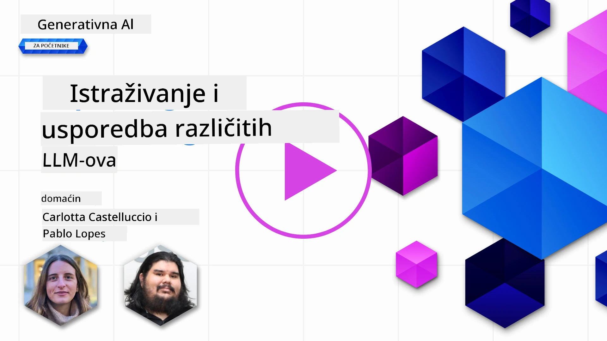](https://youtu.be/KIRUeDKscfI?si=8BHX1zvwzQBn-PlK)

> _Kliknite na gornju sliku za prikaz videozapisa ovog lekcije_

U prethodnoj lekciji vidjeli smo kako Generative AI mijenja tehnološki krajolik, kako funkcioniraju Veliki jezični modeli (LLM-ovi) i kako ih tvrtka - poput našeg startupa - može primijeniti u svojim slučajevima korištenja i rasti! U ovom poglavlju uspoređujemo i razlikujemo različite vrste velikih jezičnih modela kako bismo razumjeli njihove prednosti i nedostatke.

Sljedeći korak u putovanju našeg startupa je istražiti trenutni krajolik LLM-ova i razumjeti koji su prikladni za naš slučaj uporabe.

## Uvod

Ova lekcija će obuhvatiti:

- Različite vrste LLM-ova u trenutnom krajoliku.
- Testiranje, iteriranje i usporedbu različitih modela za vaš slučaj uporabe u Azureu.
- Kako implementirati LLM.

## Ciljevi učenja

Nakon završetka ove lekcije moći ćete:

- Odabrati pravi model za vaš slučaj uporabe.
- Razumjeti kako testirati, iterirati i poboljšati izvedbu vašeg modela.
- Znati kako tvrtke implementiraju modele.

## Razumjeti različite vrste LLM-ova

LLM-ove možemo kategorizirati prema njihovoj arhitekturi, podacima za treniranje i namjeni. Razumijevanje tih razlika pomoći će našem startupu da odabere pravi model za scenarij i razumije kako testirati, iterirati i poboljšati izvedbu.

Postoji mnogo različitih vrsta LLM modela; vaš odabir modela ovisi o tome za što ih želite koristiti, vašim podacima, koliko ste spremni platiti i više toga.

Ovisno o tome želite li koristiti modele za tekst, audio, video, generiranje slika i slično, možete odabrati različite vrste modela.

- **Prepoznavanje zvuka i govora**. Whisper-stil modeli i dalje su korisni općeniti modeli za prepoznavanje govora, ali produkcijski izbori sada uključuju i novije modele govora u tekst kao što su `gpt-4o-transcribe`, `gpt-4o-mini-transcribe` i varijante diarizacije. Procijenite pokrivenost jezika, diarizaciju, podršku u stvarnom vremenu, latenciju i troškove za vaš scenarij. Više informacija potražite u [OpenAI dokumentaciji za prepoznavanje govora u tekst](https://platform.openai.com/docs/guides/speech-to-text?WT.mc_id=academic-105485-koreyst).

- **Generiranje slika**. DALL-E i Midjourney su poznate opcije za generiranje slika, ali trenutni OpenAI API-ji za slike usredotočeni su na GPT Image modele kao što su `gpt-image-2`, dok su Stable Diffusion, Imagen, Flux i druge obitelji modela također česti izbori. Usporedite pridržavanje prompta, podršku za uređivanje, kontrolu stila, sigurnosne zahtjeve i licenciranje. Više informacija pronađite u [OpenAI vodiču za generiranje slika](https://platform.openai.com/docs/guides/images?WT.mc_id=academic-105485-koreyst) i poglavlju 9 ovog kurikuluma.

- **Generiranje teksta**. Tekstualni modeli sada obuhvaćaju najsuvremenije modele, modele za rezoniranje, manje modele s niskom latencijom i modele otvorene težine. Trenutačni primjeri uključuju OpenAI GPT-5.x modele, Anthropic Claude 4.x modele, Google Gemini 3.x modele, Meta Llama 4 modele i Mistral modele. Nemojte birati samo prema datumu izlaska ili cijeni; usporedite kvalitetu zadatka, latenciju, kontekstni prozor, korištenje alata, sigurnosno ponašanje, regionalnu dostupnost i ukupne troškove. [Microsoft Foundry katalog modela](https://ai.azure.com/catalog?WT.mc_id=academic-105485-koreyst) dobro je mjesto za usporedbu modela dostupnih na Azureu.

- **Multimodalnost**. Mnogi trenutačni modeli mogu obraditi više od teksta. Neki prihvaćaju ulaze u obliku slike, zvuka ili videa; neki mogu pozivati alate; a specijalizirani modeli mogu generirati slike, zvuk ili video. Na primjer, trenutačni OpenAI modeli podržavaju tekst i slikovne ulaze, Gemini modeli mogu podržavati tekst, kod, sliku, zvuk i video ovisno o varijanti, a Llama 4 Scout i Maverick su otvoreni multimedijalni modeli s vlastitom težinom. Uvijek provjerite karticu modela za podržane modalitete ulaza i izlaza prije nego što izgradite radni tijek oko njih.

Odabir modela znači da dobivate osnovne sposobnosti koje možda nisu dovoljne. Često imate specifične podatke tvrtke o kojima na neki način trebate obavijestiti LLM. Postoje različiti pristupi tome, o kojima ćemo više govoriti u nadolazećim odjeljcima.

### Temeljni modeli nasuprot LLM-ova

Pojam Temeljni model [osmišljili su istraživači sa Stanforda](https://arxiv.org/abs/2108.07258?WT.mc_id=academic-105485-koreyst) i definiran je kao AI model koji udovoljava nekim kriterijima, kao što su:

- **Treniraju se korištenjem nenadzirnog ili samonadziranog učenja**, što znači da su obučeni na neoznačenim višemodalnim podacima i ne zahtijevaju ljudsku anotaciju ili označavanje podataka za svoj proces treniranja.
- **To su vrlo veliki modeli**, zasnovani na vrlo dubokim neuronskim mrežama treniranim na milijardama parametara.
- **Obično su namijenjeni kao 'temelj' za druge modele**, što znači da se mogu koristiti kao polazna točka za izgradnju drugih modela putem podešavanja.

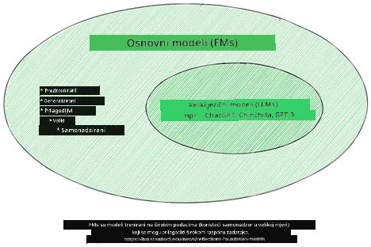

Izvor slike: [Essential Guide to Foundation Models and Large Language Models | by Babar M Bhatti | Medium
](https://thebabar.medium.com/essential-guide-to-foundation-models-and-large-language-models-27dab58f7404)

Za dodatno pojašnjenje, uzmimo ChatGPT kao povijesni primjer. Rane verzije ChatGPT koristile su GPT-3.5 kao temeljni model. OpenAI je zatim koristio podatke specifične za chat i tehnike usklađivanja kako bi stvorio podešenu verziju koja bolje funkcionira u konverzacijskim scenarijima, poput chatbotova. Moderni AI servisi često usmjeravaju između nekoliko varijanti modela, pa ime usluge i temeljni naziv modela nisu uvijek ista stvar.

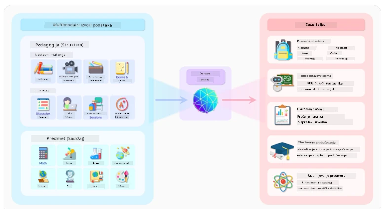

Izvor slike: [2108.07258.pdf (arxiv.org)](https://arxiv.org/pdf/2108.07258.pdf?WT.mc_id=academic-105485-koreyst)

### Otvoreni modeli naspram vlasničkih modela

Drugi način kategorizacije LLM-ova je jesu li otvorene težine, otvorenog koda ili vlasnički.

Otvoreni modeli i modeli otvorene težine omogućuju pregled, preuzimanje ili prilagodbu artefakata modela, ali njihove licence se razlikuju. Neki su potpuno otvoreni izvorni kod, dok su drugi otvorene težine s ograničenjima korištenja. Korisni su kada tvrtki treba veća kontrola nad implementacijom, lokalitetom podataka, troškovima ili prilagodbom. Međutim, timovi još uvijek moraju provjeriti uvjete licence, troškove posluživanja, održavanje, sigurnosne nadogradnje i kvalitetu evaluacije prije korištenja u produkciji. Primjeri uključuju [Meta Llama 4](https://ai.meta.com/blog/llama-4-multimodal-intelligence/?WT.mc_id=academic-105485-koreyst), neke [Mistral modele](https://docs.mistral.ai/models/overview?WT.mc_id=academic-105485-koreyst) i mnoge modele smještene na [Hugging Face](https://huggingface.co/models?WT.mc_id=academic-105485-koreyst).

Vlasnički modeli su u vlasništvu i pod nadzorom su pružatelja usluga. Ti su modeli često optimizirani za upravljanu proizvodnu uporabu i mogu ponuditi snažnu podršku, sigurnosne sustave, integraciju alata i skalabilnost. Međutim, korisnici obično ne mogu pregledavati ili mijenjati težine modela i moraju pregledati uvjete pružatelja usluga za privatnost, zadržavanje, usklađenost i prihvatljivo korištenje. Primjeri uključuju [OpenAI modele](https://platform.openai.com/docs/models?WT.mc_id=academic-105485-koreyst), [Google Gemini](https://deepmind.google/models/gemini/pro/?WT.mc_id=academic-105485-koreyst) i [Anthropic Claude](https://platform.claude.com/docs/en/about-claude/models/overview?WT.mc_id=academic-105485-koreyst).

### Umetanje nasuprot generiranju slika nasuprot generiranju teksta i koda

LLM-ovi se također mogu kategorizirati prema tipu izlaza koji generiraju.

Umetanja su skup modela koji mogu pretvoriti tekst u numerički oblik, nazvan embedding, što je numerički prikaz ulaznog teksta. Umetanja olakšavaju strojevima razumijevanje odnosa između riječi ili rečenica i mogu se koristiti kao ulazi drugim modelima, poput modela klasifikacije ili modela klasteriranja koji bolje funkcioniraju na numeričkim podacima. Modeli za umetanje često se koriste za prijenos učenja, gdje se model gradi za zamjenski zadatak za koji ima obilje podataka, a zatim se težine modela (umetanja) ponovo koriste za druge zadatke niže razine. Primjer ove kategorije su [OpenAI embeddings](https://platform.openai.com/docs/models/embeddings?WT.mc_id=academic-105485-koreyst).

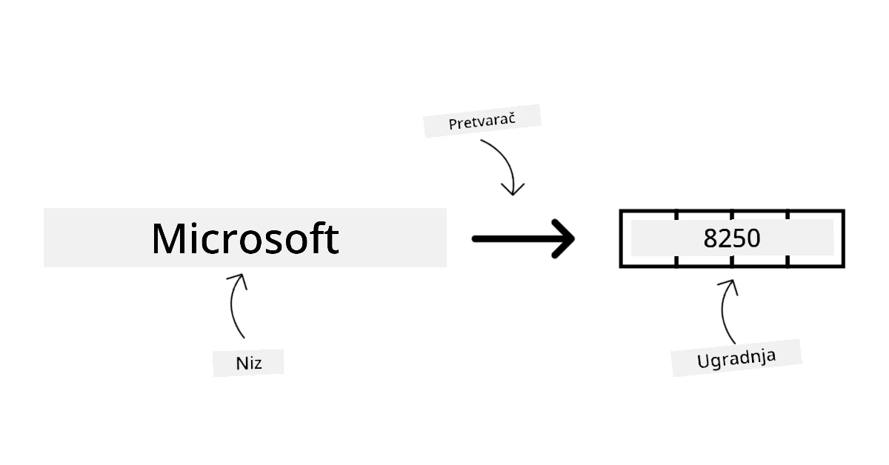

Modeli za generiranje slika su modeli koji generiraju slike. Ti se modeli često koriste za uređivanje slika, sintezu slika i prevođenje slika. Modeli za generiranje slika često su trenirani na velikim skupovima podataka slika, kao što je [LAION-5B](https://laion.ai/blog/laion-5b/?WT.mc_id=academic-105485-koreyst), i mogu se koristiti za generiranje novih slika ili za uređivanje postojećih slika tehnikama poput inpaintinga, super-rezolucije i koloriranja. Primjeri uključuju [GPT Image modele](https://platform.openai.com/docs/guides/images?WT.mc_id=academic-105485-koreyst), [Stable Diffusion modele](https://github.com/Stability-AI/StableDiffusion?WT.mc_id=academic-105485-koreyst) i Imagen modele.

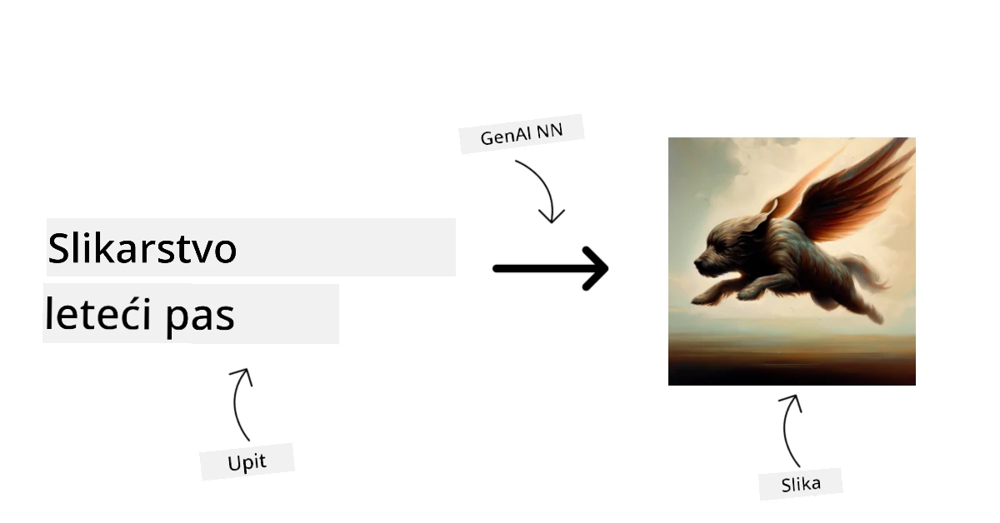

Modeli za generiranje teksta i koda su modeli koji generiraju tekst ili kod. Ti se modeli često koriste za sažimanje teksta, prevođenje i odgovaranje na pitanja. Modeli za generiranje teksta često se treniraju na velikim skupovima podataka teksta, kao što je [BookCorpus](https://www.cv-foundation.org/openaccess/content_iccv_2015/html/Zhu_Aligning_Books_and_ICCV_2015_paper.html?WT.mc_id=academic-105485-koreyst), i mogu se koristiti za generiranje novog teksta ili za odgovaranje na pitanja. Modeli za generiranje koda, kao što je [CodeParrot](https://huggingface.co/codeparrot?WT.mc_id=academic-105485-koreyst), često se treniraju na velikim skupovima podataka koda, kao što je GitHub, i mogu se koristiti za generiranje novog koda ili popravljanje bugova u postojećem kodu.

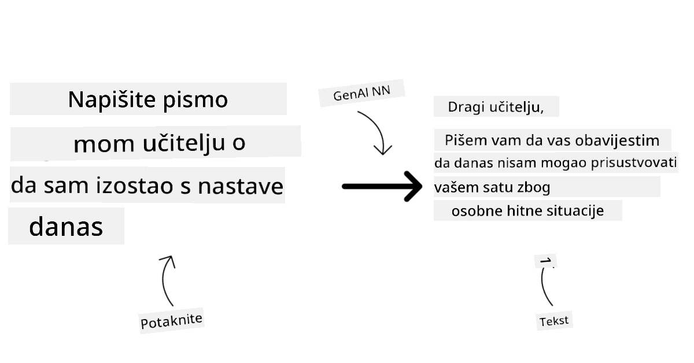

### Samo kod dekodera nasuprot kod enkodera-dekodera

Da bismo govorili o različitim vrstama arhitektura LLM-ova, upotrijebimo analogiju.

Zamislite da vam je menadžer dao zadatak da napišete kviz za studente. Imate dva kolege; jedan nadzire stvaranje sadržaja, a drugi pregledava sadržaj.

Stvaratelj sadržaja je poput modela samo s dekoderom: može pogledati temu, vidjeti što ste već napisali, a zatim nastaviti stvarati sadržaj na temelju tog konteksta. Vrlo su dobri u pisanju zanimljivog i informativnog sadržaja, ali nisu uvijek najbolji izbor kada je zadatak samo klasificirati, dohvatiti ili kodirati informacije. Primjeri modela samo s dekoderom su GPT i Llama modeli.

Pregledavatelj je poput modela samo s enkoderom, gleda napisani tečaj i odgovore, uočavajući odnose između njih i razumijevajući kontekst, ali nisu dobri u generiranju sadržaja. Primjer modela samo s enkoderom bio bi BERT.

Zamislite da imamo nekoga tko može i stvarati i pregledavati kviz, to je model enkoder-dekoder. Neki primjeri su BART i T5.

### Usluga nasuprot modelu

Sada, razgovarajmo o razlici između usluge i modela. Usluga je proizvod koji nudi pružatelj cloud usluga, a često je kombinacija modela, podataka i drugih komponenti. Model je ključna komponenta usluge i često je temeljni model, poput LLM-a.

Usluge su često optimizirane za produkcijsku uporabu i obično su jednostavnije za korištenje od modela, preko grafičkog korisničkog sučelja. Međutim, usluge nisu uvijek besplatne i mogu zahtijevati pretplatu ili plaćanje za korištenje, zauzvrat za korištenje opreme i resursa vlasnika usluge, optimizaciju troškova i jednostavnu skalabilnost. Primjer usluge je [Azure OpenAI Service](https://learn.microsoft.com/azure/ai-foundry/openai/overview?WT.mc_id=academic-105485-koreyst), koja nudi naplatu prema stvarnoj potrošnji, što znači da korisnici plaćaju proporcionalno koliko koriste uslugu. Azure OpenAI Service također nudi sigurnost na razini poduzeća i odgovorni AI okvir uz mogućnosti modela.

Modeli su artefakti neuronskih mreža: parametri, težine, arhitektura, tokenizator i prateća konfiguracija. Pokretanje modela lokalno ili u privatnom okruženju zahtijeva odgovarajuću hardversku, infrastrukturnu podršku, nadzor te kompatibilnu licencu otvorene težine/izvora ili komercijalnu licencu. Modeli otvorene težine poput Llama 4 ili Mistral modela mogu se sebe hostirati, ali još uvijek zahtijevaju računalnu snagu i operativnu stručnost.

## Kako testirati i iterirati s različitim modelima da biste razumjeli izvedbu na Azureu

Nakon što je naš tim istražio trenutni krajolik LLM-ova i identificirao dobre kandidate za njihove scenarije, sljedeći korak je testiranje na njihovim podacima i njihovom opterećenju. To je iterativan proces, proveden kroz eksperimente i mjerenja.
Većina modela koje smo spomenuli u prethodnim odlomcima (OpenAI modeli, modeli s otvorenim težinama poput Llamu 4 i Mistrala, i modeli s Hugging Facea) dostupni su u [Microsoft Foundry Models](https://learn.microsoft.com/azure/foundry/concepts/foundry-models-overview?WT.mc_id=academic-105485-koreyst).

[Microsoft Foundry](https://learn.microsoft.com/azure/foundry/what-is-foundry?WT.mc_id=academic-105485-koreyst), nekada Azure AI Studio/Azure AI Foundry, jedinstvena je Azure platforma za izgradnju AI aplikacija i agenata. Pomaže programerima upravljati životnim ciklusom od eksperimentiranja i evaluacije do implementacije, praćenja i upravljanja. Katalog modela u Microsoft Foundry omogućuje korisniku da:

- Pronađe temeljni model interesa u katalogu, uključujući modele koje prodaje Azure i modele od partnera i pružatelja iz zajednice. Korisnici mogu filtrirati prema zadatku, pružatelju, licenci, opciji implementacije ili imenu.

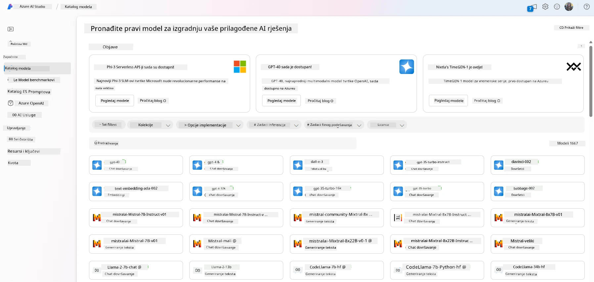

- Pregleda karticu modela, uključujući detaljan opis namjeravane uporabe i podataka za treniranje, primjere koda i rezultate evaluacije na internom evaluacijskom spremištu.

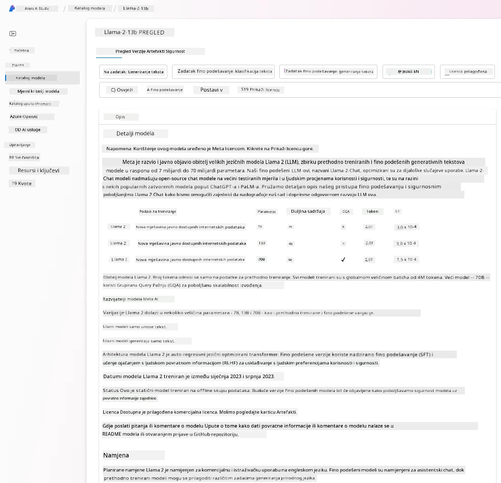

- Usporedi benchmarke između modela i dostupnih skupova podataka u industriji kako bi procijenio koji najbolje odgovara poslovnom scenariju, kroz [Model Benchmarks](https://learn.microsoft.com/azure/ai-foundry/concepts/model-benchmarks?WT.mc_id=academic-105485-koreyst) ploču.

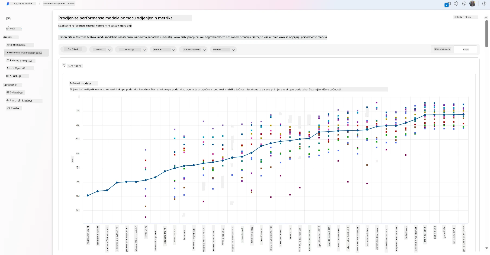

- Fino podešava podržane modele na prilagođenim podacima za treniranje kako bi poboljšao performanse modela u određenom opterećenju, koristeći mogućnosti eksperimentiranja i praćenja Microsoft Foundryja.

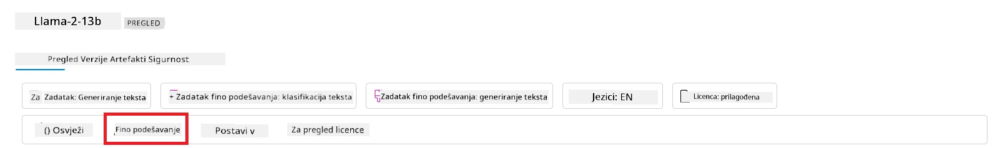

- Implementira originalni pretrenirani model ili fino podešenu verziju na udaljeni endpoint za stvarno-vremensko zaključivanje, koristeći upravljanu računalnu snagu ili opcije bez servera, kako bi aplikacije mogle konzumirati model.

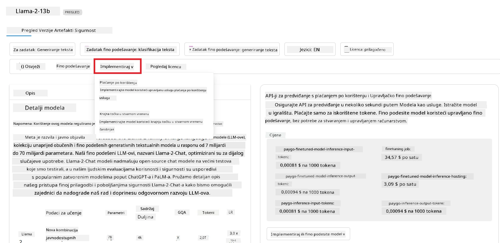

> [!NOTE]
> Nisu svi modeli u katalogu trenutno dostupni za fino podešavanje i/ili implementaciju po načelu plaćanja prema korištenju. Provjerite karticu modela za detalje o mogućnostima i ograničenjima modela.

## Poboljšanje rezultata LLM-ova

Istražili smo s našim startup timom različite vrste LLM-ova i cloud platformu (Microsoft Foundry) koja nam omogućuje usporedbu različitih modela, njihovu evaluaciju na testnim podacima, poboljšanje performansi i implementaciju na inference endpoint-ove.

Ali kada bi trebali razmotriti fino podešavanje modela umjesto korištenja pretreninog? Postoje li drugi pristupi za poboljšanje performansi modela na specifičnim opterećenjima?

Postoji nekoliko pristupa koje poduzeće može koristiti da dobije potrebne rezultate od LLM-a. Možete odabrati različite vrste modela s različitim stupnjevima treniranja prilikom implementacije LLM-a u produkciju, s različitim razinama složenosti, troška i kvalitete. Evo nekoliko pristupa:

- **Inženjering prompta s kontekstom**. Ideja je pružiti dovoljno konteksta kada postavljate prompt kako biste osigurali da dobijete odgovore koje trebate.

- **Retrieval Augmented Generation, RAG**. Vaši podaci mogu postojati u bazi podataka ili web endpointu, na primjer, da bi se osiguralo da su ti podaci ili njihov podskup uključeni u trenutku promptanja, možete dohvatiti relevantne podatke i učiniti ih dijelom prompta korisnika.

- **Fino podešeni model**. Ovdje ste dodatno trenirali model na vlastitim podacima što je dovelo do preciznijeg i odgovornijeg modela za vaše potrebe, ali može biti skupo.

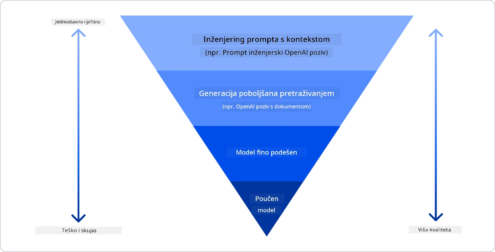

Izvor slike: [Four Ways that Enterprises Deploy LLMs | Fiddler AI Blog](https://www.fiddler.ai/blog/four-ways-that-enterprises-deploy-llms?WT.mc_id=academic-105485-koreyst)

### Inženjering prompta s kontekstom

Pretrenirani LLM-ovi vrlo dobro rade na općim zadacima prirodnog jezika, čak i ako ih se pozove kratkim promptom, poput rečenice za dovršetak ili pitanja – takozvano „zero-shot“ učenje.

Međutim, što korisnik bolje može oblikovati upit, s detaljnim zahtjevom i primjerima – Kontekstom – to će odgovor biti točniji i bliži očekivanjima korisnika. U tom slučaju govorimo o „one-shot“ učenju ako prompt uključuje samo jedan primjer i „few-shot“ učenju ako uključuje više primjera.
Inženjering prompta s kontekstom je najisplativiji pristup za početak.

### Retrieval Augmented Generation (RAG)

LLM-ovi imaju ograničenje da mogu koristiti samo podatke koji su korišteni tijekom njihovog treniranja za generiranje odgovora. To znači da ne znaju ništa o događajima koji su se desili nakon procesa treniranja i ne mogu pristupiti ne-javnim informacijama (poput podataka tvrtke).
Ovo se može prevladati putem RAG-a, tehnike koja augmentira prompt vanjskim podacima u obliku dijelova dokumenata, uzimajući u obzir ograničenja duljine prompta. To omogućuju alati poput vektorskih baza podataka (kao što je [Azure Vector Search](https://learn.microsoft.com/azure/search/vector-search-overview?WT.mc_id=academic-105485-koreyst)) koji dohvaćaju korisne dijelove iz raznih prethodno definiranih izvora podataka i dodaju ih u kontekst prompta.

Ova tehnika je vrlo korisna kada poduzeće nema dovoljno podataka, vremena ili resursa za fino podešavanje LLM-a, ali želi poboljšati performanse na određenom opterećenju i smanjiti rizike od haluciniranih, zastarjelih ili nepotvrđenih odgovora.

### Fino podešeni model

Fino podešavanje je proces koji koristi transferno učenje za „prilagodbu“ modela zadatku nižeg nivoa ili rješavanju specifičnog problema. Za razliku od few-shot učenja i RAG-a, rezultira stvaranjem novog modela s ažuriranim težinama i pristranostima. Zahtijeva skup primjera za treniranje koji se sastoje od jednog unosa (prompt) i njegovog povezanog izlaza (dovršetak).
Ovo bi bio preferirani pristup ako:

- **Koristite manje modele specifične za zadatak**. Poduzeće bi željelo fino podesiti manji model za uski zadatak umjesto da više puta prompta veći model, što rezultira isplativijim i bržim rješenjem.

- **Razmatrate latenciju**. Latencija je važna za specifičan slučaj upotrebe, pa nije moguće koristiti vrlo duge prompte ili broj primjera koje model treba naučiti nije kompatibilan s limitom duljine prompta.

- **Prilagodba stabilnog ponašanja**. Poduzeće ima mnogo visokokvalitetnih primjera i želi da model dosljedno slijedi obrazac zadatka, format izlaza, ton ili stil specifičan za domenu. Ako je glavni problem svježe činjenice ili privatno znanje koje se često mijenja, koristi se RAG umjesto oslanjanja samo na fino podešavanje.

### Trenirani model

Treniranje LLM-a ispočetka bez sumnje je najzahtjevniji i najsloženiji pristup, zahtijevajući ogromne količine podataka, stručne resurse i odgovarajuću računalnu moć. Ova opcija treba biti razmatrana samo u scenariju gdje poduzeće ima specifičan slučaj uporabe u domeni i velik broj domen-centric podataka.

## Provjera znanja

Koji bi mogao biti dobar pristup za poboljšanje rezultata dovršetka LLM-a?

1. Inženjering prompta s kontekstom
1. RAG
1. Fino podešeni model

A: Sva tri mogu pomoći. Počnite s inženjeringom prompta i kontekstom za brza poboljšanja, a koristite RAG kad model treba trenutne činjenice ili privatne poslovne podatke. Odaberite fino podešavanje kad imate dovoljno visokokvalitetnih primjera i trebate da model dosljedno prati zadatak, format, ton ili obrazac domene.

## 🚀 Izazov

Pročitajte više o tome kako možete [koristiti RAG](https://learn.microsoft.com/azure/search/retrieval-augmented-generation-overview?WT.mc_id=academic-105485-koreyst) za svoje poslovanje.

## Odličan posao, nastavite s učenjem

Nakon što završite ovu lekciju, pogledajte našu [kolekciju za učenje Generativne AI](https://aka.ms/genai-collection?WT.mc_id=academic-105485-koreyst) kako biste nastavili usavršavati svoje znanje o Generativnoj AI!

Krenite na Lekciju 3 gdje ćemo proučiti kako [odgovorno graditi s Generativnom AI](../03-using-generative-ai-responsibly/README.md?WT.mc_id=academic-105485-koreyst)!

---

<!-- CO-OP TRANSLATOR DISCLAIMER START -->
**Napomena**:
Ovaj dokument je preveden korištenjem AI prevoditeljskog servisa [Co-op Translator](https://github.com/Azure/co-op-translator). Iako težimo točnosti, imajte na umu da automatski prijevodi mogu sadržavati greške ili netočnosti. Izvorni dokument na izvornom jeziku treba smatrati autoritativnim izvorom. Za važne informacije preporuča se profesionalni ljudski prijevod. Nismo odgovorni za bilo kakva nesporazumevanja ili pogrešne interpretacije koje proizlaze iz korištenja ovog prijevoda.
<!-- CO-OP TRANSLATOR DISCLAIMER END -->