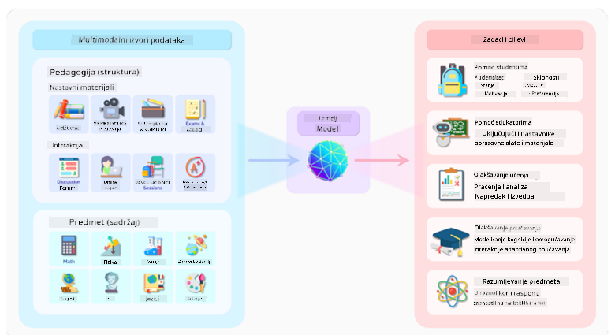
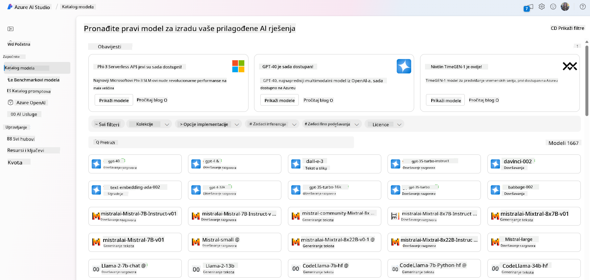
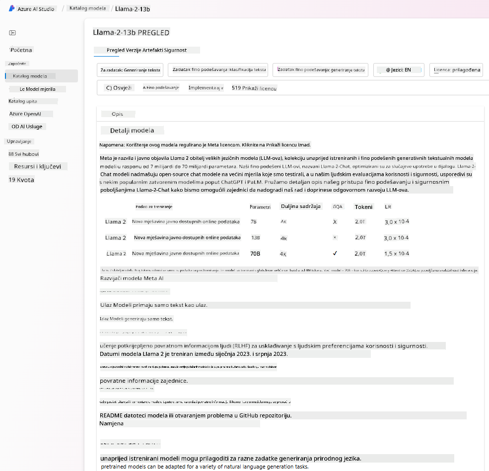
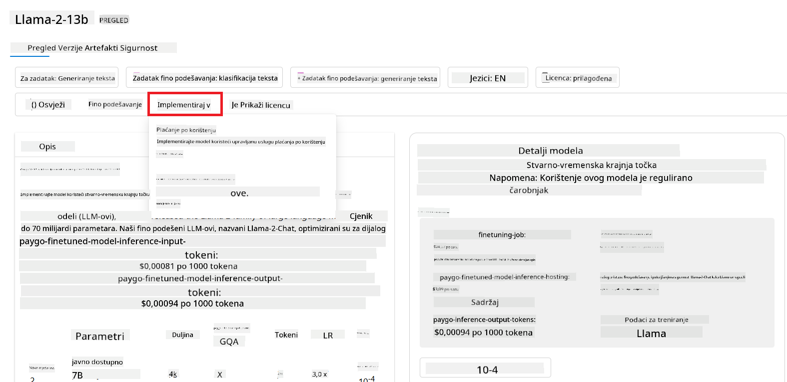

<!--
CO_OP_TRANSLATOR_METADATA:
{
  "original_hash": "6b7629b8ee4d7d874a27213e903d86a7",
  "translation_date": "2025-10-18T01:32:23+00:00",
  "source_file": "02-exploring-and-comparing-different-llms/README.md",
  "language_code": "hr"
}
-->
# Istraživanje i usporedba različitih LLM-ova

> _Kliknite na sliku iznad za pregled videozapisa ove lekcije_

U prethodnoj lekciji vidjeli smo kako generativna umjetna inteligencija mijenja tehnološki krajolik, kako funkcioniraju veliki jezični modeli (LLM-ovi) i kako ih tvrtke - poput našeg startupa - mogu primijeniti na svoje slučajeve upotrebe i rasti! U ovom poglavlju uspoređujemo i kontrastiramo različite vrste velikih jezičnih modela (LLM-ova) kako bismo razumjeli njihove prednosti i nedostatke.

Sljedeći korak u putovanju našeg startupa je istraživanje trenutnog krajolika LLM-ova i razumijevanje koji su prikladni za naš slučaj upotrebe.

## Uvod

Ova lekcija obuhvaća:

- Različite vrste LLM-ova u trenutnom krajoliku.
- Testiranje, iteraciju i usporedbu različitih modela za vaš slučaj upotrebe u Azureu.
- Kako implementirati LLM.

## Ciljevi učenja

Nakon završetka ove lekcije, moći ćete:

- Odabrati pravi model za vaš slučaj upotrebe.
- Razumjeti kako testirati, iterirati i poboljšati performanse vašeg modela.
- Znati kako tvrtke implementiraju modele.

## Razumijevanje različitih vrsta LLM-ova

LLM-ovi se mogu kategorizirati na temelju njihove arhitekture, podataka za treniranje i slučaja upotrebe. Razumijevanje ovih razlika pomoći će našem startupu da odabere pravi model za scenarij i razumije kako testirati, iterirati i poboljšati performanse.

Postoji mnogo različitih vrsta LLM modela, a vaš izbor modela ovisi o tome za što ih namjeravate koristiti, vašim podacima, koliko ste spremni platiti i još mnogo toga.

Ovisno o tome namjeravate li koristiti modele za generiranje teksta, zvuka, videa, slika i slično, možda ćete se odlučiti za različitu vrstu modela.

- **Prepoznavanje zvuka i govora**. Za ovu svrhu, modeli tipa Whisper su odličan izbor jer su univerzalni i namijenjeni prepoznavanju govora. Trenirani su na raznovrsnim audio podacima i mogu obavljati višejezično prepoznavanje govora. Saznajte više o [modelima tipa Whisper ovdje](https://platform.openai.com/docs/models/whisper?WT.mc_id=academic-105485-koreyst).

- **Generiranje slika**. Za generiranje slika, DALL-E i Midjourney su dva vrlo poznata izbora. DALL-E nudi Azure OpenAI. [Pročitajte više o DALL-E ovdje](https://platform.openai.com/docs/models/dall-e?WT.mc_id=academic-105485-koreyst) i također u 9. poglavlju ovog kurikuluma.

- **Generiranje teksta**. Većina modela trenirana je za generiranje teksta i imate veliki izbor od GPT-3.5 do GPT-4. Dolaze s različitim troškovima, pri čemu je GPT-4 najskuplji. Vrijedi istražiti [Azure OpenAI playground](https://oai.azure.com/portal/playground?WT.mc_id=academic-105485-koreyst) kako biste procijenili koji modeli najbolje odgovaraju vašim potrebama u smislu sposobnosti i troškova.

- **Multimodalnost**. Ako želite raditi s više vrsta podataka u ulazu i izlazu, možda biste trebali razmotriti modele poput [gpt-4 turbo s vizijom ili gpt-4o](https://learn.microsoft.com/azure/ai-services/openai/concepts/models#gpt-4-and-gpt-4-turbo-models?WT.mc_id=academic-105485-koreyst) - najnovija izdanja OpenAI modela - koji su sposobni kombinirati obradu prirodnog jezika s vizualnim razumijevanjem, omogućujući interakcije putem multimodalnih sučelja.

Odabir modela znači da dobivate osnovne sposobnosti, koje možda neće biti dovoljne. Često imate podatke specifične za tvrtku koje nekako trebate prenijeti LLM-u. Postoji nekoliko različitih pristupa kako to učiniti, više o tome u nadolazećim odjeljcima.

### Osnovni modeli naspram LLM-ova

Pojam Osnovni model [skovali su istraživači sa Stanforda](https://arxiv.org/abs/2108.07258?WT.mc_id=academic-105485-koreyst) i definiran je kao AI model koji slijedi određene kriterije, kao što su:

- **Trenirani su pomoću nenadgledanog učenja ili samonadgledanog učenja**, što znači da su trenirani na nelabeliranim multimodalnim podacima i ne zahtijevaju ljudsku anotaciju ili označavanje podataka za svoj proces treniranja.
- **To su vrlo veliki modeli**, temeljeni na vrlo dubokim neuronskim mrežama treniranim na milijardama parametara.
- **Obično su namijenjeni kao 'osnova' za druge modele**, što znači da se mogu koristiti kao početna točka za izgradnju drugih modela, što se može postići finim podešavanjem.

Izvor slike: [Essential Guide to Foundation Models and Large Language Models | by Babar M Bhatti | Medium
](https://thebabar.medium.com/essential-guide-to-foundation-models-and-large-language-models-27dab58f7404)

Kako bismo dodatno pojasnili ovu razliku, uzmimo ChatGPT kao primjer. Za izradu prve verzije ChatGPT-a, model nazvan GPT-3.5 služio je kao osnovni model. To znači da je OpenAI koristio neke podatke specifične za chat kako bi stvorio prilagođenu verziju GPT-3.5 koja je bila specijalizirana za dobro funkcioniranje u konverzacijskim scenarijima, poput chatbotova.

Izvor slike: [2108.07258.pdf (arxiv.org)](https://arxiv.org/pdf/2108.07258.pdf?WT.mc_id=academic-105485-koreyst)

### Open Source naspram vlasničkih modela

Još jedan način kategorizacije LLM-ova je prema tome jesu li otvorenog koda ili vlasnički.

Modeli otvorenog koda su modeli koji su dostupni javnosti i mogu ih koristiti svi. Često ih objavljuje tvrtka koja ih je stvorila ili istraživačka zajednica. Ovi modeli mogu se pregledavati, mijenjati i prilagođavati za različite slučajeve upotrebe LLM-ova. Međutim, nisu uvijek optimizirani za proizvodnu upotrebu i možda nisu toliko učinkoviti kao vlasnički modeli. Osim toga, financiranje za modele otvorenog koda može biti ograničeno, možda neće biti dugoročno održavani ili ažurirani najnovijim istraživanjima. Primjeri popularnih modela otvorenog koda uključuju [Alpaca](https://crfm.stanford.edu/2023/03/13/alpaca.html?WT.mc_id=academic-105485-koreyst), [Bloom](https://huggingface.co/bigscience/bloom) i [LLaMA](https://llama.meta.com).

Vlasnički modeli su modeli koji su u vlasništvu tvrtke i nisu dostupni javnosti. Ovi modeli često su optimizirani za proizvodnu upotrebu. Međutim, nije ih moguće pregledavati, mijenjati ili prilagođavati za različite slučajeve upotrebe. Osim toga, nisu uvijek besplatni i njihovo korištenje može zahtijevati pretplatu ili plaćanje. Korisnici također nemaju kontrolu nad podacima koji se koriste za treniranje modela, što znači da moraju vjerovati vlasniku modela da će osigurati privatnost podataka i odgovornu upotrebu AI-a. Primjeri popularnih vlasničkih modela uključuju [OpenAI modele](https://platform.openai.com/docs/models/overview?WT.mc_id=academic-105485-koreyst), [Google Bard](https://sapling.ai/llm/bard?WT.mc_id=academic-105485-koreyst) ili [Claude 2](https://www.anthropic.com/index/claude-2?WT.mc_id=academic-105485-koreyst).

### Ugrađivanje naspram generiranja slika naspram generiranja teksta i koda

LLM-ovi se također mogu kategorizirati prema izlazu koji generiraju.

Ugrađivanja su skup modela koji mogu pretvoriti tekst u numerički oblik, nazvan ugrađivanje, što je numerička reprezentacija ulaznog teksta. Ugrađivanja olakšavaju strojevima razumijevanje odnosa između riječi ili rečenica i mogu se koristiti kao ulazi za druge modele, poput modela za klasifikaciju ili modela za grupiranje koji imaju bolje performanse na numeričkim podacima. Modeli ugrađivanja često se koriste za prijenosno učenje, gdje se model gradi za zamjenski zadatak za koji postoji obilje podataka, a zatim se težine modela (ugrađivanja) ponovno koriste za druge zadatke. Primjer ove kategorije je [OpenAI ugrađivanja](https://platform.openai.com/docs/models/embeddings?WT.mc_id=academic-105485-koreyst).

Modeli za generiranje slika su modeli koji generiraju slike. Ovi modeli često se koriste za uređivanje slika, sintezu slika i prevođenje slika. Modeli za generiranje slika često se treniraju na velikim skupovima podataka o slikama, poput [LAION-5B](https://laion.ai/blog/laion-5b/?WT.mc_id=academic-105485-koreyst), i mogu se koristiti za generiranje novih slika ili za uređivanje postojećih slika tehnikama poput nadopunjavanja, super-rezolucije i koloriranja. Primjeri uključuju [DALL-E-3](https://openai.com/dall-e-3?WT.mc_id=academic-105485-koreyst) i [Stable Diffusion modele](https://github.com/Stability-AI/StableDiffusion?WT.mc_id=academic-105485-koreyst).

Modeli za generiranje teksta i koda su modeli koji generiraju tekst ili kod. Ovi modeli često se koriste za sažimanje teksta, prevođenje i odgovaranje na pitanja. Modeli za generiranje teksta često se treniraju na velikim skupovima podataka o tekstu, poput [BookCorpus](https://www.cv-foundation.org/openaccess/content_iccv_2015/html/Zhu_Aligning_Books_and_ICCV_2015_paper.html?WT.mc_id=academic-105485-koreyst), i mogu se koristiti za generiranje novog teksta ili za odgovaranje na pitanja. Modeli za generiranje koda, poput [CodeParrot](https://huggingface.co/codeparrot?WT.mc_id=academic-105485-koreyst), često se treniraju na velikim skupovima podataka o kodu, poput GitHuba, i mogu se koristiti za generiranje novog koda ili za ispravljanje grešaka u postojećem kodu.

### Encoder-Decoder naspram samo Decoder

Kako bismo razgovarali o različitim vrstama arhitektura LLM-ova, koristit ćemo analogiju.

Zamislite da vam je vaš menadžer dao zadatak da napišete kviz za studente. Imate dva kolege; jedan se bavi stvaranjem sadržaja, a drugi pregledavanjem.

Stvaratelj sadržaja je poput modela samo Decoder, može pogledati temu i vidjeti što ste već napisali, a zatim može napisati tečaj na temelju toga. Vrlo su dobri u pisanju zanimljivog i informativnog sadržaja, ali nisu baš dobri u razumijevanju teme i ciljeva učenja. Neki primjeri modela Decoder su modeli iz GPT obitelji, poput GPT-3.

Recenzent je poput modela samo Encoder, gleda napisani tečaj i odgovore, primjećujući odnos između njih i razumijevajući kontekst, ali nije dobar u generiranju sadržaja. Primjer modela samo Encoder bio bi BERT.

Zamislite da također možemo imati nekoga tko bi mogao i kreirati i pregledavati kviz, to je model Encoder-Decoder. Neki primjeri bili bi BART i T5.

### Usluga naspram modela

Sada, razgovarajmo o razlici između usluge i modela. Usluga je proizvod koji nudi pružatelj usluga u oblaku i često je kombinacija modela, podataka i drugih komponenti. Model je osnovna komponenta usluge i često je osnovni model, poput LLM-a.

Usluge su često optimizirane za proizvodnu upotrebu i često ih je lakše koristiti nego modele, putem grafičkog korisničkog sučelja. Međutim, usluge nisu uvijek besplatne i njihovo korištenje može zahtijevati pretplatu ili plaćanje, u zamjenu za korištenje opreme i resursa vlasnika usluge, optimizaciju troškova i jednostavno skaliranje. Primjer usluge je [Azure OpenAI Service](https://learn.microsoft.com/azure/ai-services/openai/overview?WT.mc_id=academic-105485-koreyst), koja nudi plan plaćanja prema korištenju, što znači da se korisnici naplaćuju proporcionalno koliko koriste uslugu. Također, Azure OpenAI Service nudi sigurnost na razini poduzeća i okvir za odgovornu upotrebu AI-a uz mogućnosti modela.

Modeli su samo neuronske mreže, s parametrima, težinama i ostalim. Omogućuju tvrtkama lokalno pokretanje, međutim, potrebno je kupiti opremu, izgraditi strukturu za skaliranje i kupiti licencu ili koristiti model otvorenog koda. Model poput LLaMA dostupan je za korištenje, ali zahtijeva računalnu snagu za pokretanje modela.

## Kako testirati i iterirati s različitim modelima kako biste razumjeli performanse na Azureu

Nakon što naš tim istraži trenutni krajolik LLM-ova i identificira neke dobre kandidate za svoje scenarije, sljedeći korak je testiranje na njihovim podacima i radnom opterećenju. Ovo je iterativni proces, koji se provodi putem eksperimenata i mjerenja.
Većina modela koje smo spomenuli u prethodnim odlomcima (OpenAI modeli, open source modeli poput Llama2 i Hugging Face transformera) dostupni su u [Model Catalog](https://learn.microsoft.com/azure/ai-studio/how-to/model-catalog-overview?WT.mc_id=academic-105485-koreyst) u [Azure AI Studio](https://ai.azure.com/?WT.mc_id=academic-105485-koreyst).

[Azure AI Studio](https://learn.microsoft.com/azure/ai-studio/what-is-ai-studio?WT.mc_id=academic-105485-koreyst) je cloud platforma dizajnirana za razvojne inženjere kako bi mogli izraditi aplikacije temeljene na generativnoj umjetnoj inteligenciji i upravljati cijelim razvojnim ciklusom - od eksperimentiranja do evaluacije - kombinirajući sve Azure AI usluge u jedinstveni centar s praktičnim grafičkim sučeljem. Model Catalog u Azure AI Studio omogućuje korisnicima:

- Pronaći temeljni model od interesa u katalogu - bilo vlasnički ili open source, filtrirajući prema zadatku, licenci ili nazivu. Kako bi se poboljšala pretraživost, modeli su organizirani u kolekcije, poput Azure OpenAI kolekcije, Hugging Face kolekcije i drugih.

- Pregledati karticu modela, uključujući detaljan opis namjene i podataka za treniranje, primjere koda i rezultate evaluacije iz interne biblioteke evaluacija.

- Usporediti mjerila između modela i dostupnih skupova podataka u industriji kako bi se procijenilo koji najbolje odgovara poslovnom scenariju, putem [Model Benchmarks](https://learn.microsoft.com/azure/ai-studio/how-to/model-benchmarks?WT.mc_id=academic-105485-koreyst) panela.

- Fino podesiti model na prilagođenim podacima za treniranje kako bi se poboljšala izvedba modela u određenom radnom opterećenju, koristeći mogućnosti eksperimentiranja i praćenja u Azure AI Studio.

- Implementirati originalni unaprijed trenirani model ili fino podešenu verziju za udaljenu inferenciju u stvarnom vremenu - upravljano računanje - ili serverless API endpoint - [plaćanje po korištenju](https://learn.microsoft.com/azure/ai-studio/how-to/model-catalog-overview#model-deployment-managed-compute-and-serverless-api-pay-as-you-go?WT.mc_id=academic-105485-koreyst) - kako bi aplikacije mogle koristiti model.

> [!NOTE]
> Nisu svi modeli u katalogu trenutno dostupni za fino podešavanje i/ili implementaciju putem plaćanja po korištenju. Provjerite karticu modela za detalje o mogućnostima i ograničenjima modela.

## Poboljšanje rezultata LLM-a

Istražili smo s našim startup timom različite vrste LLM-ova i cloud platformu (Azure Machine Learning) koja nam omogućuje usporedbu različitih modela, njihovu evaluaciju na testnim podacima, poboljšanje performansi i implementaciju na inferencijskim endpointima.

Ali kada bi trebali razmotriti fino podešavanje modela umjesto korištenja unaprijed treniranog? Postoje li drugi pristupi za poboljšanje performansi modela na specifičnim radnim opterećenjima?

Postoji nekoliko pristupa koje tvrtka može koristiti kako bi postigla željene rezultate od LLM-a. Možete odabrati različite vrste modela s različitim stupnjevima treniranja prilikom implementacije LLM-a u produkciju, s različitim razinama složenosti, troškova i kvalitete. Evo nekoliko različitih pristupa:

- **Prompt engineering s kontekstom**. Ideja je pružiti dovoljno konteksta prilikom postavljanja upita kako biste osigurali da dobijete odgovore koji su vam potrebni.

- **Retrieval Augmented Generation, RAG**. Vaši podaci mogu postojati u bazi podataka ili na web endpointu, na primjer, kako biste osigurali da ti podaci ili njihov podskup budu uključeni u trenutku postavljanja upita, možete dohvatiti relevantne podatke i učiniti ih dijelom korisničkog upita.

- **Fino podešen model**. Ovdje dodatno trenirate model na vlastitim podacima, što dovodi do toga da model postane precizniji i odgovara vašim potrebama, ali to može biti skupo.

Izvor slike: [Four Ways that Enterprises Deploy LLMs | Fiddler AI Blog](https://www.fiddler.ai/blog/four-ways-that-enterprises-deploy-llms?WT.mc_id=academic-105485-koreyst)

### Prompt Engineering s Kontekstom

Unaprijed trenirani LLM-ovi vrlo dobro funkcioniraju na općim zadacima obrade prirodnog jezika, čak i kada ih pozovete s kratkim upitom, poput rečenice za dovršavanje ili pitanja – takozvano učenje bez primjera ("zero-shot" learning).

Međutim, što korisnik bolje može oblikovati svoj upit, s detaljnim zahtjevom i primjerima – Kontekstom – to će odgovor biti točniji i bliži očekivanjima korisnika. U ovom slučaju govorimo o učenju s jednim primjerom ("one-shot" learning) ako upit uključuje samo jedan primjer i o učenju s nekoliko primjera ("few-shot learning") ako uključuje više primjera. Prompt engineering s kontekstom je najisplativiji pristup za početak.

### Retrieval Augmented Generation (RAG)

LLM-ovi imaju ograničenje da mogu koristiti samo podatke koji su korišteni tijekom njihovog treniranja za generiranje odgovora. To znači da ne znaju ništa o činjenicama koje su se dogodile nakon procesa treniranja i ne mogu pristupiti ne-javnim informacijama (poput podataka tvrtke). 
Ovo se može prevladati putem RAG-a, tehnike koja proširuje upit vanjskim podacima u obliku dijelova dokumenata, uzimajući u obzir ograničenja duljine upita. Ovo podržavaju alati za pretraživanje vektora (poput [Azure Vector Search](https://learn.microsoft.com/azure/search/vector-search-overview?WT.mc_id=academic-105485-koreyst)) koji dohvaćaju korisne dijelove iz različitih unaprijed definiranih izvora podataka i dodaju ih u kontekst upita.

Ova tehnika je vrlo korisna kada tvrtka nema dovoljno podataka, vremena ili resursa za fino podešavanje LLM-a, ali ipak želi poboljšati performanse na specifičnom radnom opterećenju i smanjiti rizik od izmišljanja, tj. iskrivljavanja stvarnosti ili štetnog sadržaja.

### Fino podešen model

Fino podešavanje je proces koji koristi transferno učenje za 'prilagodbu' modela na zadatak ili za rješavanje specifičnog problema. Za razliku od učenja s nekoliko primjera i RAG-a, rezultira stvaranjem novog modela s ažuriranim težinama i pristranostima. Zahtijeva skup primjera za treniranje koji se sastoje od jednog ulaza (upita) i njegovog povezanog izlaza (rezultata). 
Ovo bi bio preferirani pristup ako:

- **Korištenje fino podešenih modela**. Tvrtka želi koristiti fino podešene manje sposobne modele (poput modela za ugrađivanje) umjesto modela visokih performansi, što rezultira isplativijim i bržim rješenjem.

- **Razmatranje latencije**. Latencija je važna za određeni slučaj upotrebe, pa nije moguće koristiti vrlo duge upite ili broj primjera koji bi model trebao naučiti ne odgovara ograničenju duljine upita.

- **Održavanje ažurnosti**. Tvrtka ima puno visokokvalitetnih podataka i oznaka istine te resurse potrebne za održavanje tih podataka ažurnima tijekom vremena.

### Trenirani model

Treniranje LLM-a od nule bez sumnje je najteži i najsloženiji pristup koji se može usvojiti, zahtijevajući ogromne količine podataka, stručne resurse i odgovarajuću računalnu snagu. Ova opcija trebala bi se razmotriti samo u scenariju gdje tvrtka ima slučaj upotrebe specifičan za određenu domenu i veliku količinu podataka vezanih za tu domenu.

## Provjera znanja

Koji bi mogao biti dobar pristup za poboljšanje rezultata LLM-a?

1. Prompt engineering s kontekstom  
1. RAG  
1. Fino podešen model  

A:3, ako imate vremena, resursa i visokokvalitetne podatke, fino podešavanje je bolja opcija za ostati ažuran. Međutim, ako želite poboljšati stvari, a nemate dovoljno vremena, vrijedi prvo razmotriti RAG.

## 🚀 Izazov

Pročitajte više o tome kako možete [koristiti RAG](https://learn.microsoft.com/azure/search/retrieval-augmented-generation-overview?WT.mc_id=academic-105485-koreyst) za svoje poslovanje.

## Odlično obavljeno, nastavite učiti

Nakon što završite ovu lekciju, pogledajte našu [Generative AI Learning collection](https://aka.ms/genai-collection?WT.mc_id=academic-105485-koreyst) kako biste nastavili unapređivati svoje znanje o generativnoj umjetnoj inteligenciji!

Prijeđite na Lekciju 3 gdje ćemo pogledati kako [odgovorno koristiti generativnu umjetnu inteligenciju](../03-using-generative-ai-responsibly/README.md?WT.mc_id=academic-105485-koreyst)!

---

**Izjava o odricanju odgovornosti**:  
Ovaj dokument je preveden pomoću AI usluge za prevođenje [Co-op Translator](https://github.com/Azure/co-op-translator). Iako nastojimo osigurati točnost, imajte na umu da automatski prijevodi mogu sadržavati pogreške ili netočnosti. Izvorni dokument na izvornom jeziku treba smatrati autoritativnim izvorom. Za ključne informacije preporučuje se profesionalni prijevod od strane čovjeka. Ne preuzimamo odgovornost za nesporazume ili pogrešne interpretacije nastale korištenjem ovog prijevoda.