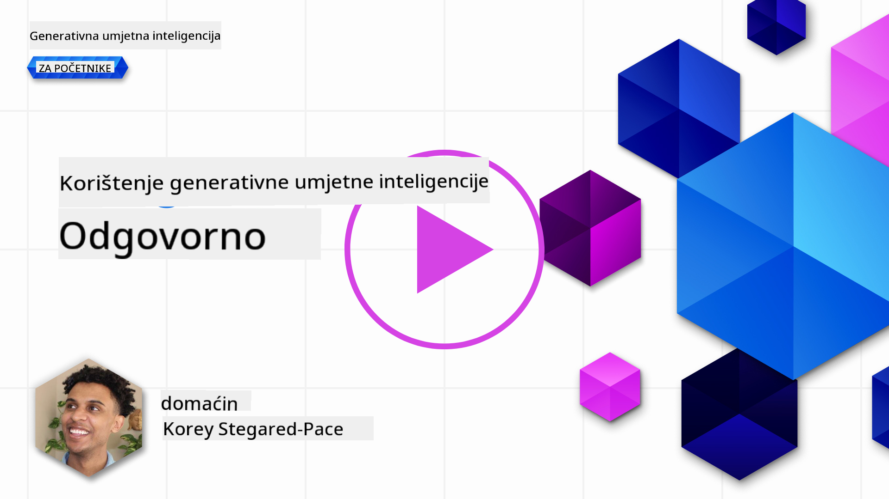
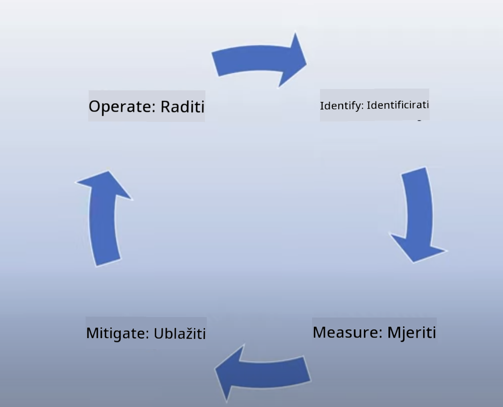
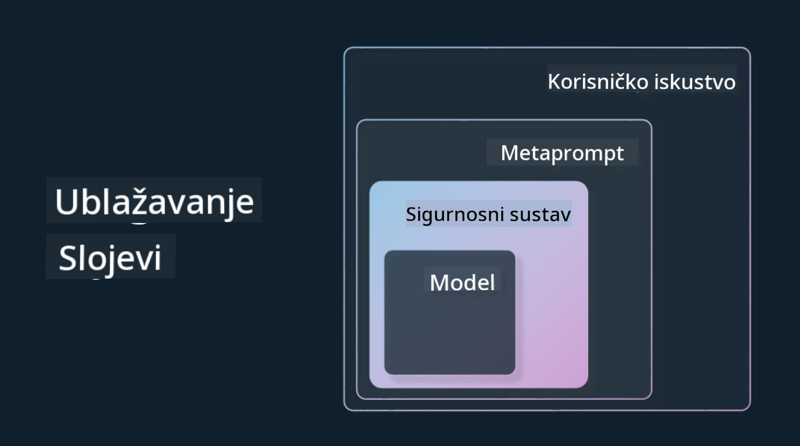

<!--
CO_OP_TRANSLATOR_METADATA:
{
  "original_hash": "7f8f4c11f8c1cb6e1794442dead414ea",
  "translation_date": "2025-07-09T09:04:33+00:00",
  "source_file": "03-using-generative-ai-responsibly/README.md",
  "language_code": "hr"
}
-->
# Odgovorno korištenje generativne AI

> _Kliknite na gornju sliku za pregled videa ove lekcije_

Lako je biti fasciniran AI-jem, a posebno generativnom AI-jem, no važno je razmisliti o tome kako ga koristiti na odgovoran način. Trebate uzeti u obzir kako osigurati da rezultati budu pravedni, neškodljivi i slično. Ova poglavlja imaju za cilj pružiti vam kontekst, na što obratiti pažnju i kako poduzeti konkretne korake za poboljšanje korištenja AI-ja.

## Uvod

Ova lekcija će obuhvatiti:

- Zašto trebate dati prioritet Odgovornoj AI prilikom izrade aplikacija s generativnom AI.
- Osnovna načela Odgovorne AI i kako se ona odnose na generativnu AI.
- Kako primijeniti ta načela kroz strategiju i alate.

## Ciljevi učenja

Nakon završetka ove lekcije znat ćete:

- Koliko je važna Odgovorna AI pri izradi aplikacija s generativnom AI.
- Kada razmišljati o osnovnim načelima Odgovorne AI i primjenjivati ih u razvoju generativnih AI aplikacija.
- Koji su vam alati i strategije dostupni za praktičnu primjenu koncepta Odgovorne AI.

## Načela Odgovorne AI

Zanimanje za generativnu AI nikada nije bilo veće. Ovo uzbuđenje privuklo je mnoge nove developere, pažnju i financijska sredstva u ovo područje. Iako je to vrlo pozitivno za sve koji žele graditi proizvode i tvrtke koristeći generativnu AI, važno je da nastavimo odgovorno.

Kroz ovaj tečaj fokusiramo se na izgradnju našeg startupa i našeg AI edukacijskog proizvoda. Koristit ćemo načela Odgovorne AI: Pravednost, Uključivost, Pouzdanost/Sigurnost, Sigurnost i Privatnost, Transparentnost i Odgovornost. Kroz ta načela istražit ćemo kako se ona odnose na našu upotrebu generativne AI u proizvodima.

## Zašto dati prioritet Odgovornoj AI

Prilikom izrade proizvoda, pristup usmjeren na čovjeka, s fokusom na najbolje interese korisnika, vodi do najboljih rezultata.

Jedinstvenost generativne AI leži u njenoj sposobnosti da stvara korisne odgovore, informacije, smjernice i sadržaj za korisnike. To se može postići bez mnogo ručnih koraka, što može dovesti do impresivnih rezultata. No, bez odgovarajućeg planiranja i strategija, nažalost, može dovesti i do štetnih posljedica za vaše korisnike, proizvod i društvo u cjelini.

Pogledajmo neke (ali ne sve) od tih potencijalno štetnih posljedica:

### Halucinacije

Halucinacije su pojam koji se koristi za opis situacije kada LLM generira sadržaj koji je potpuno besmislen ili je poznato da je činjenično netočan na temelju drugih izvora informacija.

Na primjer, zamislimo da razvijamo funkciju za naš startup koja studentima omogućuje postavljanje povijesnih pitanja modelu. Student postavi pitanje `Tko je bio jedini preživjeli Titanica?`

Model daje odgovor poput ovog:

> _(Izvor: [Flying bisons](https://flyingbisons.com?WT.mc_id=academic-105485-koreyst))_

Ovo je vrlo samouvjeren i detaljan odgovor. Nažalost, netočan je. Čak i uz minimalno istraživanje, otkrilo bi se da je bilo više preživjelih Titanica. Za studenta koji tek počinje istraživati ovu temu, ovaj odgovor može biti dovoljno uvjerljiv da se ne dovodi u pitanje i prihvati kao činjenica. Posljedice mogu biti da AI sustav postane nepouzdan i negativno utječe na reputaciju našeg startupa.

S svakom novom verzijom bilo kojeg LLM-a vidjeli smo poboljšanja u smanjenju halucinacija. Ipak, kao developeri i korisnici aplikacija, moramo biti svjesni ovih ograničenja.

### Štetni sadržaj

U prethodnom dijelu smo spomenuli kada LLM daje netočne ili besmislene odgovore. Drugi rizik na koji trebamo paziti je kada model generira štetni sadržaj.

Štetni sadržaj može se definirati kao:

- Davanje uputa ili poticanje na samoozljeđivanje ili nasilje prema određenim skupinama.
- Mrzilački ili ponižavajući sadržaj.
- Upute za planiranje bilo kakvih napada ili nasilnih djela.
- Upute kako pronaći ilegalni sadržaj ili počiniti nezakonite radnje.
- Prikazivanje seksualno eksplicitnog sadržaja.

Za naš startup želimo osigurati da imamo prave alate i strategije kako bismo spriječili da studenti vide ovakvu vrstu sadržaja.

### Nedostatak pravednosti

Pravednost se definira kao „osiguravanje da AI sustav nije pristran niti diskriminira te da sve tretira pošteno i jednako.“ U svijetu generativne AI želimo osigurati da modeli ne jačaju isključive poglede na svijet koji marginaliziraju određene skupine.

Ovakvi rezultati ne samo da narušavaju pozitivno korisničko iskustvo, već i dodatno štete društvu. Kao developeri aplikacija uvijek bismo trebali imati na umu široku i raznoliku bazu korisnika prilikom izrade rješenja s generativnom AI.

## Kako odgovorno koristiti generativnu AI

Sada kada smo prepoznali važnost Odgovorne generativne AI, pogledajmo 4 koraka koje možemo poduzeti da bismo svoje AI rješenja gradili odgovorno:

### Mjerenje potencijalnih šteta

U testiranju softvera testiramo očekivane radnje korisnika na aplikaciji. Slično tome, testiranje raznovrsnih upita koje korisnici najvjerojatnije koriste dobar je način za mjerenje potencijalne štete.

Budući da naš startup razvija edukacijski proizvod, bilo bi korisno pripremiti popis edukacijskih upita. To može uključivati određene predmete, povijesne činjenice i upite vezane uz studentski život.

### Ublažavanje potencijalnih šteta

Vrijeme je da pronađemo načine kako spriječiti ili ograničiti potencijalnu štetu koju model i njegovi odgovori mogu uzrokovati. To možemo promatrati kroz 4 različita sloja:

- **Model**. Odabir pravog modela za odgovarajući slučaj upotrebe. Veći i složeniji modeli poput GPT-4 mogu predstavljati veći rizik od štetnog sadržaja kada se primjenjuju na manje i specifičnije slučajeve. Fino podešavanje modela na vlastitim podacima također smanjuje rizik od štetnog sadržaja.

- **Sigurnosni sustav**. Sigurnosni sustav je skup alata i konfiguracija na platformi koja poslužuje model, a pomaže u ublažavanju štete. Primjer je sustav filtriranja sadržaja na Azure OpenAI servisu. Sustavi bi također trebali otkrivati pokušaje zaobilaženja ograničenja (jailbreak) i neželjene aktivnosti poput zahtjeva od botova.

- **Metaprompt**. Metapromptovi i "grounding" su načini na koje možemo usmjeriti ili ograničiti model na temelju određenih ponašanja i informacija. To može biti korištenje sistemskih ulaza za definiranje određenih granica modela. Također, pružanje odgovora koji su relevantniji za opseg ili domenu sustava.

Također se mogu koristiti tehnike poput Retrieval Augmented Generation (RAG) kako bi model izvlačio informacije samo iz odabranih pouzdanih izvora. U kasnijoj lekciji ovog tečaja obrađujemo [izradu pretraživačkih aplikacija](../08-building-search-applications/README.md?WT.mc_id=academic-105485-koreyst).

- **Korisničko iskustvo**. Posljednji sloj je gdje korisnik izravno komunicira s modelom putem sučelja naše aplikacije. Na ovaj način možemo dizajnirati UI/UX tako da ograničimo vrste unosa koje korisnik može poslati modelu, kao i tekst ili slike koje se prikazuju korisniku. Prilikom implementacije AI aplikacije, također moramo biti transparentni o tome što naša generativna AI aplikacija može, a što ne može.

Imamo cijelu lekciju posvećenu [dizajnu UX-a za AI aplikacije](../12-designing-ux-for-ai-applications/README.md?WT.mc_id=academic-105485-koreyst).

- **Evaluacija modela**. Rad s LLM-ovima može biti izazovan jer nemamo uvijek kontrolu nad podacima na kojima je model treniran. Ipak, uvijek bismo trebali procjenjivati performanse i rezultate modela. Važno je mjeriti točnost, sličnost, utemeljenost i relevantnost izlaza modela. To pomaže u pružanju transparentnosti i povjerenja dionicima i korisnicima.

### Upravljanje odgovornim generativnim AI rješenjem

Izgradnja operativne prakse oko vaših AI aplikacija je završna faza. To uključuje suradnju s drugim dijelovima našeg startupa poput pravnog i sigurnosnog odjela kako bismo osigurali usklađenost sa svim regulatornim politikama. Prije lansiranja želimo izraditi planove za isporuku, upravljanje incidentima i povratak na prethodnu verziju kako bismo spriječili štetu korisnicima.

## Alati

Iako se razvoj rješenja Odgovorne AI može činiti zahtjevnim, to je posao koji se isplati. Kako područje generativne AI raste, razvijat će se i alati koji pomažu developerima da učinkovito integriraju odgovornost u svoje radne procese. Na primjer, [Azure AI Content Safety](https://learn.microsoft.com/azure/ai-services/content-safety/overview?WT.mc_id=academic-105485-koreyst) može pomoći u otkrivanju štetnog sadržaja i slika putem API poziva.

## Provjera znanja

Koje stvari trebate uzeti u obzir kako biste osigurali odgovorno korištenje AI-ja?

1. Da je odgovor točan.  
1. Štetna upotreba, da AI nije korišten za kriminalne svrhe.  
1. Osiguravanje da AI nije pristran niti diskriminira.

O: Točno su 2 i 3. Odgovorna AI pomaže vam razmotriti kako ublažiti štetne učinke, pristranosti i još mnogo toga.

## 🚀 Izazov

Pročitajte o [Azure AI Content Safety](https://learn.microsoft.com/azure/ai-services/content-safety/overview?WT.mc_id=academic-105485-koreyst) i istražite što možete primijeniti u svojoj upotrebi.

## Odličan posao, nastavite s učenjem

Nakon završetka ove lekcije, pogledajte našu [kolekciju za učenje generativne AI](https://aka.ms/genai-collection?WT.mc_id=academic-105485-koreyst) i nastavite podizati svoje znanje o generativnoj AI!

Krenite na Lekciju 4 gdje ćemo proučiti [osnove prompt inženjeringa](../04-prompt-engineering-fundamentals/README.md?WT.mc_id=academic-105485-koreyst)!

**Odricanje od odgovornosti**:  
Ovaj dokument je preveden korištenjem AI usluge za prevođenje [Co-op Translator](https://github.com/Azure/co-op-translator). Iako nastojimo postići točnost, imajte na umu da automatski prijevodi mogu sadržavati pogreške ili netočnosti. Izvorni dokument na izvornom jeziku treba smatrati službenim i autoritativnim izvorom. Za kritične informacije preporučuje se profesionalni ljudski prijevod. Ne snosimo odgovornost za bilo kakve nesporazume ili pogrešna tumačenja koja proizlaze iz korištenja ovog prijevoda.