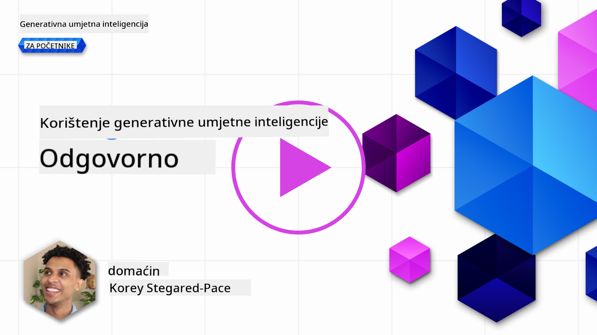
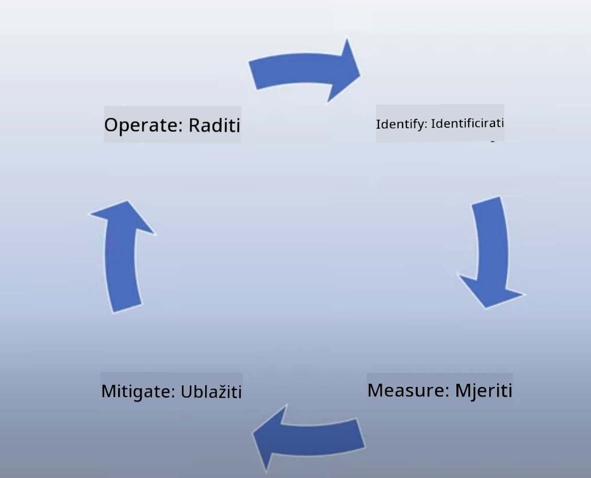
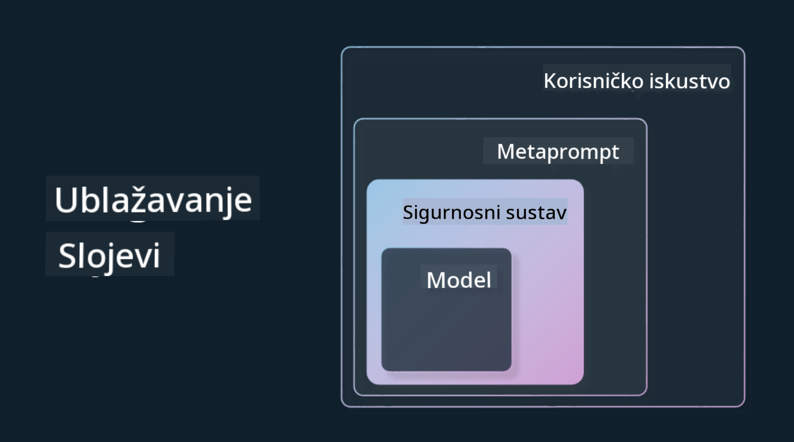

<!--
CO_OP_TRANSLATOR_METADATA:
{
  "original_hash": "13084c6321a2092841b9a081b29497ba",
  "translation_date": "2025-06-25T11:34:41+00:00",
  "source_file": "03-using-generative-ai-responsibly/README.md",
  "language_code": "hr"
}
-->
# Odgovorno korištenje generativne AI

> _Kliknite na sliku iznad za pregled videa ove lekcije_

Lako je biti fasciniran AI-jem, posebno generativnom AI, ali morate razmisliti o tome kako biste je koristili odgovorno. Trebate uzeti u obzir stvari poput osiguravanja da je izlaz pravedan, neškodljiv i više. Ovaj poglavlje ima za cilj pružiti vam spomenuti kontekst, što uzeti u obzir i kako poduzeti aktivne korake za poboljšanje vaše upotrebe AI-ja.

## Uvod

Ova lekcija će pokriti:

- Zašto biste trebali dati prednost odgovornoj AI pri izgradnji generativnih AI aplikacija.
- Temeljna načela odgovorne AI i kako se odnose na generativnu AI.
- Kako primijeniti ta načela odgovorne AI kroz strategiju i alate.

## Ciljevi učenja

Nakon završetka ove lekcije znat ćete:

- Važnost odgovorne AI pri izgradnji generativnih AI aplikacija.
- Kada razmišljati i primijeniti temeljna načela odgovorne AI pri izgradnji generativnih AI aplikacija.
- Koji alati i strategije su vam dostupni za primjenu koncepta odgovorne AI.

## Načela odgovorne AI

Uzbuđenje oko generativne AI nikada nije bilo veće. Ovo uzbuđenje je dovelo mnogo novih developera, pažnje i financiranja u ovaj prostor. Iako je ovo vrlo pozitivno za svakoga tko želi izgraditi proizvode i tvrtke koristeći generativnu AI, također je važno da nastavimo odgovorno.

Tijekom ovog tečaja fokusiramo se na izgradnju našeg startupa i našeg AI obrazovnog proizvoda. Koristit ćemo načela odgovorne AI: Pravednost, Uključivost, Pouzdanost/Sigurnost, Sigurnost i Privatnost, Transparentnost i Odgovornost. S tim načelima istraživat ćemo kako se odnose na našu upotrebu generativne AI u našim proizvodima.

## Zašto biste trebali dati prednost odgovornoj AI

Pri izgradnji proizvoda, pristup usmjeren na ljude, držeći na umu najbolje interese korisnika, vodi do najboljih rezultata.

Jedinstvenost generativne AI je njezina moć da stvori korisne odgovore, informacije, smjernice i sadržaj za korisnike. To se može učiniti bez mnogo ručnih koraka što može dovesti do vrlo impresivnih rezultata. Bez pravilnog planiranja i strategija, to također može nažalost dovesti do nekih štetnih rezultata za vaše korisnike, vaš proizvod i društvo u cjelini.

Pogledajmo neke (ali ne sve) od tih potencijalno štetnih rezultata:

### Halucinacije

Halucinacije su termin koji se koristi za opisivanje kada LLM proizvodi sadržaj koji je ili potpuno besmislen ili nešto što znamo da je činjenično pogrešno na temelju drugih izvora informacija.

Uzmimo za primjer da izgradimo značajku za naš startup koja omogućuje studentima da postavljaju povijesna pitanja modelu. Student postavlja pitanje `Who was the sole survivor of Titanic?`

Model proizvodi odgovor poput onog dolje:

> _(Izvor: [Flying bisons](https://flyingbisons.com?WT.mc_id=academic-105485-koreyst))_

Ovo je vrlo samopouzdan i temeljit odgovor. Nažalost, nije točan. Čak i uz minimalno istraživanje, otkrilo bi se da je bilo više od jednog preživjelog katastrofe Titanika. Za studenta koji tek počinje istraživati ovu temu, ovaj odgovor može biti dovoljno uvjerljiv da se ne dovodi u pitanje i tretira kao činjenica. Posljedice ovoga mogu dovesti do toga da AI sustav bude nepouzdan i negativno utječe na reputaciju našeg startupa.

S svakom iteracijom bilo kojeg danog LLM-a, vidjeli smo poboljšanja u performansama oko minimiziranja halucinacija. Čak i uz ovo poboljšanje, mi kao graditelji aplikacija i korisnici i dalje moramo biti svjesni tih ograničenja.

### Štetni sadržaj

U ranijem dijelu smo pokrili kada LLM proizvodi netočne ili besmislene odgovore. Drugi rizik kojeg moramo biti svjesni je kada model odgovara sa štetnim sadržajem.

Štetni sadržaj može biti definiran kao:

- Davanje uputa ili poticanje na samoozljeđivanje ili ozljeđivanje određenih grupa.
- Mrziteljni ili ponižavajući sadržaj.
- Usmjeravanje planiranja bilo kakvog napada ili nasilnih djela.
- Davanje uputa o tome kako pronaći ilegalni sadržaj ili počiniti ilegalna djela.
- Prikazivanje seksualno eksplicitnog sadržaja.

Za naš startup, želimo biti sigurni da imamo prave alate i strategije na mjestu kako bismo spriječili da ovaj tip sadržaja bude viđen od strane studenata.

### Nedostatak pravednosti

Pravednost se definira kao "osiguravanje da AI sustav bude slobodan od pristranosti i diskriminacije te da tretira sve pošteno i jednako." U svijetu generativne AI, želimo osigurati da isključivi pogledi marginaliziranih grupa nisu ojačani izlazom modela.

Ove vrste izlaza nisu samo destruktivne za izgradnju pozitivnih iskustava proizvoda za naše korisnike, već također uzrokuju daljnju društvenu štetu. Kao graditelji aplikacija, trebali bismo uvijek imati na umu široku i raznoliku korisničku bazu kada gradimo rješenja s generativnom AI.

## Kako koristiti generativnu AI odgovorno

Sada kada smo identificirali važnost odgovorne generativne AI, pogledajmo 4 koraka koje možemo poduzeti kako bismo izgradili naše AI rješenja odgovorno:

### Mjerenje potencijalnih šteta

U testiranju softvera, testiramo očekivane radnje korisnika na aplikaciji. Slično tome, testiranje raznolikog seta upita koje će korisnici najvjerojatnije koristiti je dobar način za mjerenje potencijalne štete.

Budući da naš startup gradi obrazovni proizvod, bilo bi dobro pripremiti popis obrazovnih upita. To bi moglo pokrivati određeni predmet, povijesne činjenice i upite o studentskom životu.

### Ublažavanje potencijalnih šteta

Sada je vrijeme da pronađemo načine kako možemo spriječiti ili ograničiti potencijalnu štetu uzrokovanu modelom i njegovim odgovorima. Možemo to pogledati kroz 4 različita sloja:

- **Model**. Odabir pravog modela za pravi slučaj upotrebe. Veći i složeniji modeli poput GPT-4 mogu uzrokovati veći rizik od štetnog sadržaja kada se primjenjuju na manje i specifičnije slučajeve upotrebe. Korištenje vaših podataka za obuku za fino podešavanje također smanjuje rizik od štetnog sadržaja.

- **Sigurnosni sustav**. Sigurnosni sustav je skup alata i konfiguracija na platformi koja poslužuje model i pomaže u ublažavanju štete. Primjer ovoga je sustav filtriranja sadržaja na Azure OpenAI usluzi. Sustavi također trebaju otkriti napade jailbreak i neželjene aktivnosti poput zahtjeva od botova.

- **Metaprompt**. Metaprompti i uzemljenje su načini na koje možemo usmjeriti ili ograničiti model na temelju određenih ponašanja i informacija. To bi moglo biti korištenje sistemskih ulaza za definiranje određenih granica modela. Osim toga, pružanje izlaza koji su relevantniji za opseg ili domenu sustava.

To također može biti korištenje tehnika poput Retrieval Augmented Generation (RAG) kako bi model povukao informacije samo iz odabira pouzdanih izvora. Postoji lekcija kasnije u ovom tečaju za [izgradnju aplikacija za pretraživanje](../08-building-search-applications/README.md?WT.mc_id=academic-105485-koreyst)

- **Korisničko iskustvo**. Završni sloj je gdje korisnik izravno komunicira s modelom kroz sučelje naše aplikacije na neki način. Na taj način možemo dizajnirati UI/UX kako bismo ograničili korisnika na tipove ulaza koje mogu poslati modelu, kao i tekst ili slike prikazane korisniku. Kada implementiramo AI aplikaciju, također moramo biti transparentni o tome što naša generativna AI aplikacija može i ne može učiniti.

Imamo cijelu lekciju posvećenu [dizajniranju UX-a za AI aplikacije](../12-designing-ux-for-ai-applications/README.md?WT.mc_id=academic-105485-koreyst)

- **Procjena modela**. Rad s LLM-ima može biti izazovan jer nemamo uvijek kontrolu nad podacima na kojima je model treniran. Bez obzira na to, uvijek bismo trebali procijeniti performanse i izlaze modela. Još uvijek je važno mjeriti točnost, sličnost, uzemljenost i relevantnost izlaza modela. To pomaže pružiti transparentnost i povjerenje dionicima i korisnicima.

### Operiranje odgovornog generativnog AI rješenja

Izgradnja operativne prakse oko vaših AI aplikacija je završna faza. To uključuje partnerstvo s drugim dijelovima našeg startupa kao što su Pravna i Sigurnost kako bismo osigurali da smo u skladu sa svim regulatornim politikama. Prije lansiranja, također želimo izgraditi planove oko isporuke, rukovanja incidentima i povratka kako bismo spriječili bilo kakvu štetu za naše korisnike od rasta.

## Alati

Iako rad na razvoju odgovornih AI rješenja može izgledati kao puno posla, to je rad koji se isplati. Kako područje generativne AI raste, više alata koji pomažu developerima da učinkovito integriraju odgovornost u svoje radne tokove će sazrijevati. Na primjer, [Azure AI Content Safety](https://learn.microsoft.com/azure/ai-services/content-safety/overview?WT.mc_id=academic-105485-koreyst) može pomoći u otkrivanju štetnog sadržaja i slika putem API zahtjeva.

## Provjera znanja

Koje su neke stvari o kojima trebate voditi računa kako biste osigurali odgovornu upotrebu AI-ja?

1. Da je odgovor točan.
1. Štetna upotreba, da AI nije korišten u kriminalne svrhe.
1. Osiguranje da je AI slobodan od pristranosti i diskriminacije.

A: 2 i 3 su točni. Odgovorna AI pomaže vam razmotriti kako ublažiti štetne učinke i pristranosti i više.

## 🚀 Izazov

Pročitajte o [Azure AI Content Safety](https://learn.microsoft.com/azure/ai-services/content-safety/overview?WT.mc_id=academic-105485-koreyst) i pogledajte što možete usvojiti za svoju upotrebu.

## Odlično obavljen posao, nastavite s učenjem

Nakon završetka ove lekcije, provjerite našu [Generativnu AI kolekciju za učenje](https://aka.ms/genai-collection?WT.mc_id=academic-105485-koreyst) kako biste nastavili unaprijediti svoje znanje o generativnoj AI!

Pređite na Lekciju 4 gdje ćemo pogledati [Osnove inženjeringa upita](../04-prompt-engineering-fundamentals/README.md?WT.mc_id=academic-105485-koreyst)!

**Odricanje od odgovornosti**:  
Ovaj dokument je preveden korištenjem AI usluge prevođenja [Co-op Translator](https://github.com/Azure/co-op-translator). Iako težimo točnosti, imajte na umu da automatizirani prijevodi mogu sadržavati pogreške ili netočnosti. Izvorni dokument na izvornom jeziku treba smatrati mjerodavnim izvorom. Za kritične informacije preporučuje se profesionalni ljudski prijevod. Ne odgovaramo za nesporazume ili pogrešna tumačenja koja proizlaze iz korištenja ovog prijevoda.