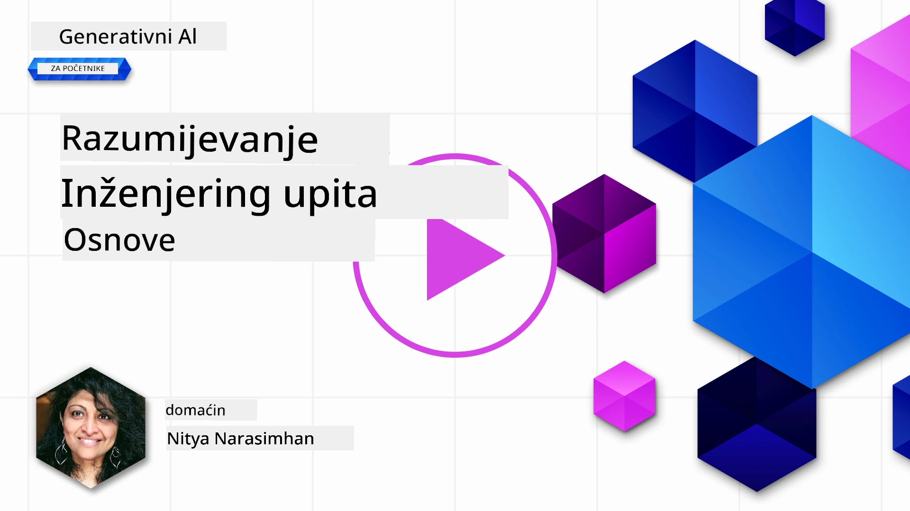
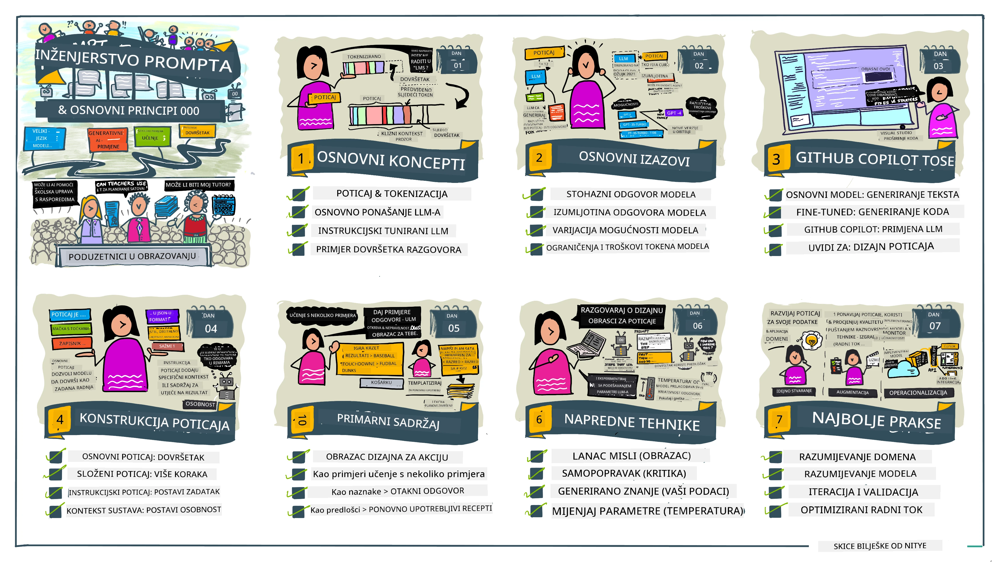
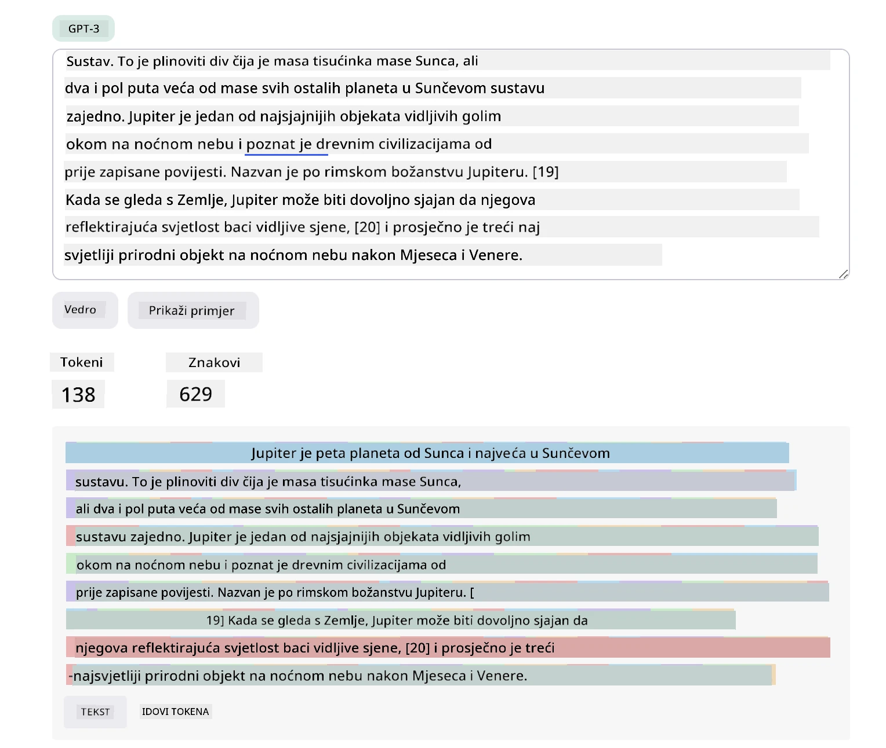
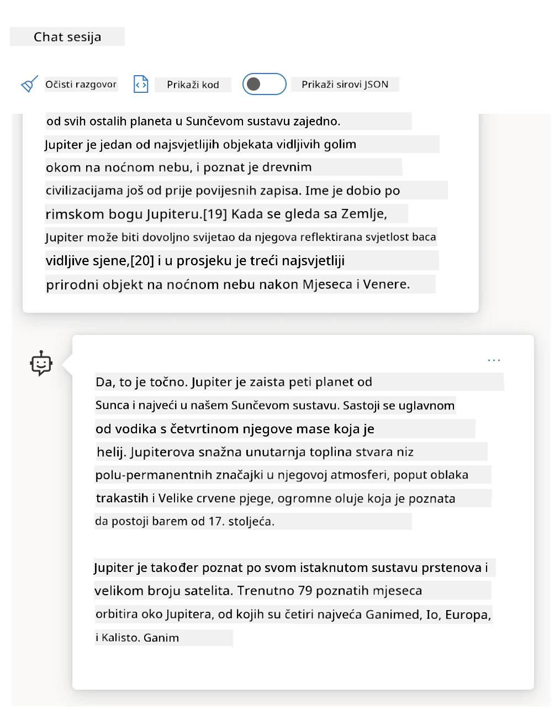
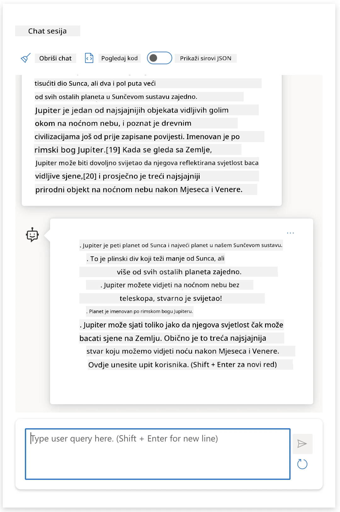
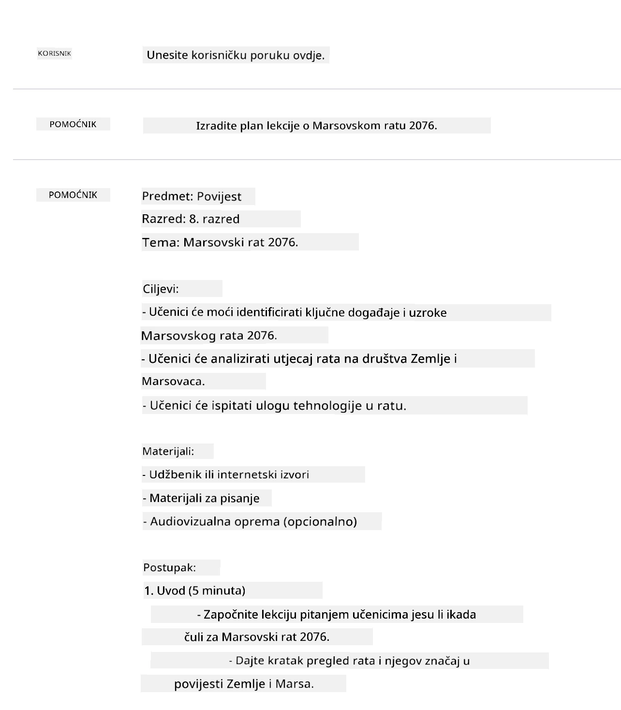
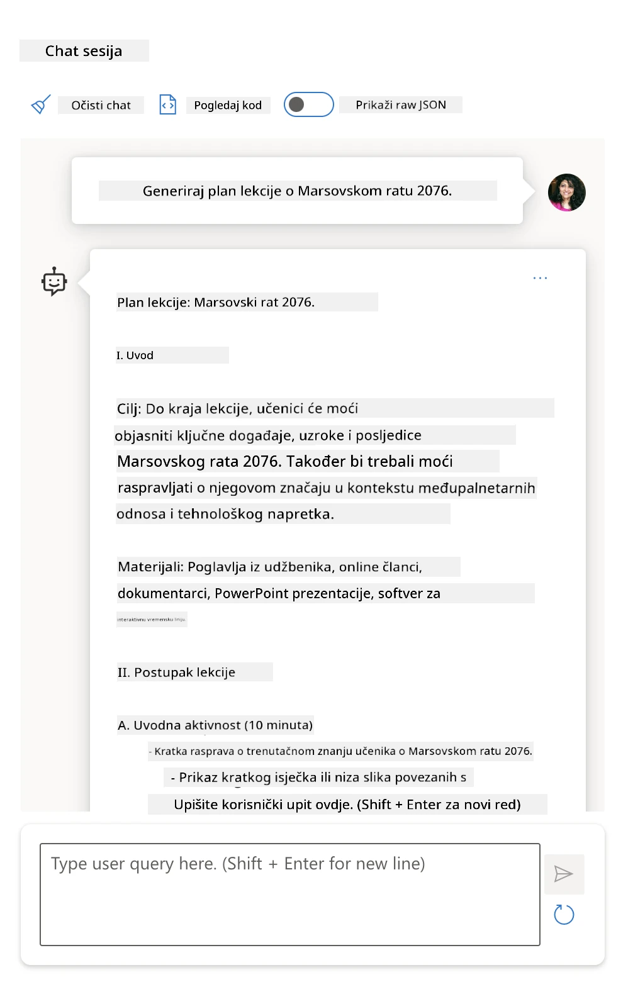
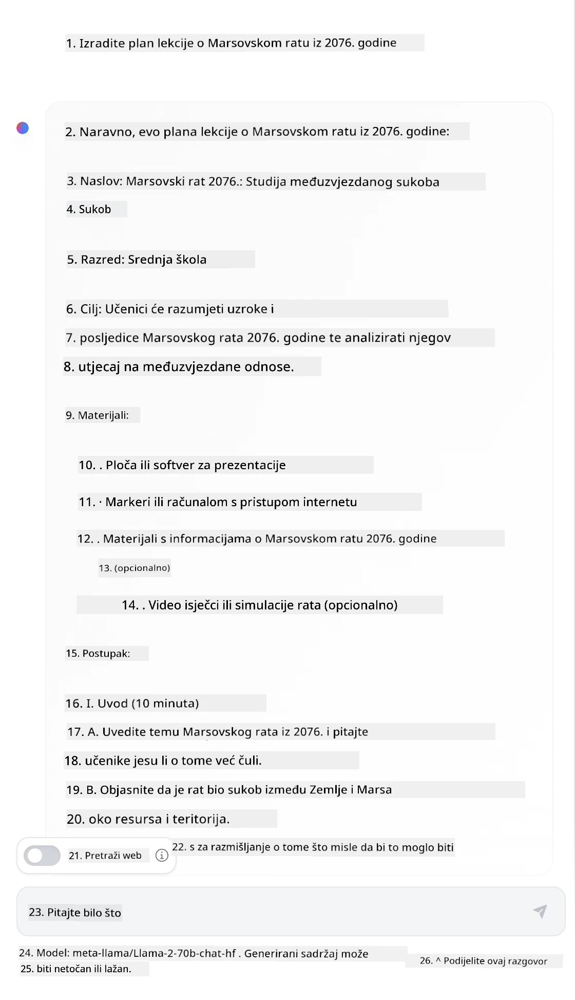

# Osnove prompt inženjeringa

[](https://youtu.be/GElCu2kUlRs?si=qrXsBvXnCW12epb8)

## Uvod
Ovaj modul pokriva osnovne pojmove i tehnike za izradu učinkovitih promptova u generativnim AI modelima. Način na koji pišete svoj prompt za LLM također je važan. Pažljivo izrađeni prompt može postići bolju kvalitetu odgovora. Ali što točno znače pojmovi poput _prompt_ i _prompt inženjering_? I kako poboljšati prompt _ulaz_ koji šaljem LLM-u? To su pitanja na koja ćemo pokušati odgovoriti u ovom i sljedećem poglavlju.

_Generativna AI_ je sposobna stvarati novi sadržaj (npr. tekst, slike, audio, kod itd.) kao odgovor na korisničke zahtjeve. To postiže korištenjem _velikih jezičnih modela_ poput OpenAI-jeve GPT ("Generative Pre-trained Transformer") serije koji su trenirani za rad s prirodnim jezikom i kodom.

Korisnici sada mogu komunicirati s tim modelima koristeći poznate paradigme poput chata, bez potrebe za tehničkim znanjem ili obukom. Modeli su _prompt-bazirani_ - korisnici šalju tekstualni unos (prompt) i dobivaju AI odgovor (dovršetak). Zatim mogu "razgovarati s AI-em" iterativno, u višekružnim konverzacijama, usavršavajući svoj prompt dok odgovor ne zadovolji njihova očekivanja.

"Prompti" sada postaju glavno _programsko sučelje_ za generativne AI aplikacije, govoreći modelima što da rade i utječući na kvalitetu vraćenih odgovora. "Prompt inženjering" je brzo rastuće područje istraživanja koje se fokusira na _dizajn i optimizaciju_ promptova kako bi se isporučili dosljedni i kvalitetni odgovori u velikom opsegu.

## Ciljevi učenja

U ovom satu učimo što je prompt inženjering, zašto je važan i kako možemo izraditi učinkovitije prompte za određeni model i cilj aplikacije. Razumjet ćemo osnovne pojmove i najbolje prakse za prompt inženjering – te upoznati interaktivno Jupyter Notebook "sandbox" okruženje gdje možemo vidjeti primjenu tih koncepata na stvarnim primjerima.

Na kraju ovog sata moći ćemo:

1. Objasniti što je prompt inženjering i zašto je važan.
2. Opisati komponente prompta i kako se koriste.
3. Naučiti najbolje prakse i tehnike za prompt inženjering.
4. Primijeniti naučene tehnike na stvarne primjere, koristeći OpenAI endpoint.

## Ključni pojmovi

Prompt inženjering: Praksa dizajniranja i usavršavanja unosa kako bi se AI modeli usmjerili na proizvodnju željenih rezultata.  
Tokenizacija: Proces pretvaranja teksta u manje jedinice, zvane tokeni, koje model može razumjeti i obraditi.  
Instruction-Tuned LLMs: Veliki jezični modeli (LLM) koji su dodatno trenirani s specifičnim uputama za poboljšanje točnosti i relevantnosti odgovora.

## Sandbox za učenje

Prompt inženjering je trenutačno više umjetnost nego znanost. Najbolji način da poboljšamo intuiciju jest _više vježbati_ i usvojiti pristup pokušaja i pogrešaka koji kombinira stručnost u području primjene s preporučenim tehnikama i optimizacijama specifičnim za model.

Jupyter Notebook koji prati ovaj sat pruža _sandbox_ okruženje gdje možete isprobati što ste naučili – tijekom rada ili kao dio izazova koda na kraju. Za izvršavanje vježbi potreban vam je:

1. **Azure OpenAI API ključ** – servisni endpoint za implementirani LLM.  
2. **Python runtime** – u kojem se može izvršiti Notebook.  
3. **Lokalne varijable okoline** – _sada dovršite [SETUP](./../00-course-setup/02-setup-local.md?WT.mc_id=academic-105485-koreyst) korake da se pripremite_.

Notebook dolazi s _početnim_ vježbama – ali potičemo vas da dodate vlastite sekcije s _Markdown_ (opis) i _Code_ (zahtjevi prompta) kako biste isprobali više primjera ili ideja – te gradili svoju intuiciju za dizajn promptova.

## Ilustrirani vodič

Želite li dobiti cjelovitu sliku onoga što ovaj sat pokriva prije nego što krenete? Pogledajte ovaj ilustrirani vodič koji Vam pruža pregled glavnih tema i ključnih poruka za razmišljanje. Vodič kroz sat vodi vas od razumijevanja osnovnih pojmova i izazova do njihovog rješavanja relevantnim tehnikama i najboljim praksama prompt inženjeringa. Imajte na umu da se odjeljak "Napredne tehnike" u ovom vodiču odnosi na sadržaj pokriven u _sljedećem_ poglavlju ovog kurikuluma.



## Naš startup

Sad, razgovarajmo o tome kako se _ova tema_ povezuje s našom misijom startupa da [donesemo AI inovacije u obrazovanje](https://educationblog.microsoft.com/2023/06/collaborating-to-bring-ai-innovation-to-education?WT.mc_id=academic-105485-koreyst). Želimo izraditi AI-pokretane aplikacije za _personalizirano učenje_ – pa razmislimo kako različiti korisnici naše aplikacije mogu "dizajnirati" prompte:

- **Administratori** mogu tražiti AI od _analize kurikuluma kako bi identificirali praznine u pokrivenosti_. AI može sažeti rezultate ili ih vizualizirati kodom.  
- **Nastavnici** mogu tražiti AI od _generiranja plana nastave za ciljno publiku i temu_. AI može izraditi personalizirani plan u zadanom formatu.  
- **Učenici** mogu tražiti AI da ih _podučava u teškoj temi_. AI će voditi učenike lekcijama, savjetima i primjerima prilagođenim njihovoj razini.

To je samo vrh ledenog brijega. Pogledajte [Prompte za obrazovanje](https://github.com/microsoft/prompts-for-edu/tree/main?WT.mc_id=academic-105485-koreyst) – open-source biblioteku promptova koju su kurirali obrazovni stručnjaci – da biste dobili širi dojam o mogućnostima! _Isprobajte neke od tih promptova u sandboxu ili koristeći OpenAI Playground i vidite što će se dogoditi!_

<!--
LESSON TEMPLATE:
This unit should cover core concept #1.
Reinforce the concept with examples and references.

CONCEPT #1:
Prompt Engineering.
Define it and explain why it is needed.
-->

## Što je Prompt Inženjering?

Započeli smo ovaj sat definiranjem **prompt inženjeringa** kao procesa _dizajniranja i optimizacije_ tekstualnih unosa (promptova) za postizanje dosljednih i kvalitetnih odgovora (dovršetaka) za određeni cilj aplikacije i model. To možemo zamisliti kao proces u dva koraka:

- _dizajniranje_ početnog prompta za određeni model i cilj  
- _usavršavanje_ prompta iterativno za poboljšanje kvalitete odgovora

To je nužno proces pokušaja i pogrešaka koji zahtijeva korisničku intuiciju i trud da bi se postigli optimalni rezultati. Zašto je to važno? Za odgovor prvo trebamo razumjeti tri pojma:

- _Tokenizacija_ = kako model "vidi" prompt  
- _Osnovni LLM_ = kako temeljni model "obrađuje" prompt  
- _Instruction-Tuned LLM_ = kako model sada može "vidjeti zadatke"

### Tokenizacija

LLM vidi prompte kao _niz tokena_ gdje različiti modeli (ili verzije modela) mogu tokenizirati isti prompt na različite načine. Budući da su LLM-ovi trenirani na tokenima (a ne na sirovom tekstu), način na koji se prompt tokenizira direktno utječe na kvalitetu generiranog odgovora.

Za intuiciju o tome kako funkcionira tokenizacija, isprobajte alate poput [OpenAI Tokenizer](https://platform.openai.com/tokenizer?WT.mc_id=academic-105485-koreyst) prikazanog dolje. Kopirajte svoj prompt – i pogledajte kako se pretvara u tokene, obraćajući pozornost na to kako se tretiraju znakovi razmaka i interpunkcija. Imajte na umu da ovaj primjer prikazuje stariji LLM (GPT-3) – pa isprobavanje s novijim modelom može dati drugačiji rezultat.



### Pojam: Temeljni modeli

Kad se prompt tokenizira, osnovna funkcija ["Osnovnog LLM-a"](https://blog.gopenai.com/an-introduction-to-base-and-instruction-tuned-large-language-models-8de102c785a6?WT.mc_id=academic-105485-koreyst) (ili temeljnog modela) je predvidjeti token u tom nizu. Budući da su LLM-ovi trenirani na ogromnim skupovima tekstualnih podataka, dobro poznaju statističke odnose između tokena i mogu tu predikciju izvesti s određenom sigurnošću. Imajte na umu da oni ne razumiju _značenje_ riječi u promptu ili tokenu; oni samo vide obrazac koji mogu "dovršiti" sljedećom predikcijom. Mogu nastaviti predviđati niz dok ih korisnik ne zaustavi ili se ne ispuni neki unaprijed postavljeni uvjet.

Želite li vidjeti kako radi dovršavanje temeljeno na promptu? Unesite gornji prompt u Azure OpenAI Studio [_Chat Playground_](https://oai.azure.com/playground?WT.mc_id=academic-105485-koreyst) s zadanim postavkama. Sustav je konfiguriran da tretira prompte kao zahtjeve za informacijama – tako da biste trebali vidjeti dovršetak koji zadovoljava taj kontekst.

No što ako korisnik želi vidjeti nešto specifično što zadovoljava neki kriterij ili cilj zadatka? Tu na scenu dolaze _instruction-tuned_ LLM-ovi.



### Pojam: Instruction-Tuned LLM

[Instruction Tuned LLM](https://blog.gopenai.com/an-introduction-to-base-and-instruction-tuned-large-language-models-8de102c785a6?WT.mc_id=academic-105485-koreyst) započinje s temeljnim modelom i dodatno ga trenira s primjerima ili parovima ulaz/izlaz (npr. višekružnim "porukama") koje mogu sadržavati jasne upute – a odgovor AI-a pokušava slijediti te upute.

Koriste se tehnike poput učenja potkrepljenog povratnom informacijom od ljudi (RLHF) koje model treniraju da _slijedi upute_ i _uči iz povratnih informacija_, tako da generira odgovore koji su prikladniji za praktične primjene i relevantniji prema ciljevima korisnika.

Isprobajmo to – vratite se na gore navedeni prompt, ali sada promijenite _sistemsku poruku_ da pruži sljedeću uputu kao kontekst:

> _Sažmi sadržaj koji ti je dan za učenika drugog razreda. Ograniči rezultat na jedan odlomak s 3-5 točaka._

Vidite li kako je rezultat sada namješten da odražava željeni cilj i format? Nastavnik sada može direktno koristiti taj odgovor u svojim prezentacijama za tu nastavu.



## Zašto trebamo prompt inženjering?

Sad kad znamo kako modeli obrađuju prompte, razgovarajmo o _zašto_ nam treba prompt inženjering. Odgovor leži u činjenici da trenutni LLM-ovi predstavljaju nekoliko izazova zbog kojih je teže postići _pouzdane i dosljedne dovršetke_ bez uloženog truda u izgradnju i optimizaciju promptova. Na primjer:

1. **Odgovori modela su stohastički.** _Isti prompt_ vjerojatno će proizvesti različite odgovore na različitim modelima ili verzijama modela. Čak može dati različite rezultate s _istim modelom_ u različito vrijeme. _Tehnike prompt inženjeringa mogu nam pomoći minimizirati ova odstupanja dajući bolje zaštitne ograde_.

1. **Modeli mogu izmišljati odgovore.** Modeli su predtrenirani na _velikim ali konačnim_ skupovima podataka, što znači da nemaju znanje o konceptima izvan tog skupa podataka. Kao rezultat, mogu generirati dovršetke koji su netočni, izmišljeni ili izravno suprotstavljeni poznatim činjenicama. _Tehnike prompt inženjeringa pomažu korisnicima identificirati i ublažiti takve izmišljotine, npr. traženjem citata ili obrazloženja od AI-a_.

1. **Sposobnosti modela će varirati.** Noviji modeli ili generacije modela imaju bogatije sposobnosti, ali donose i posebne neobičnosti i kompromise u troškovima i složenosti. _Prompt inženjering može pomoći u razvoju najboljih praksi i tijekova rada koji apstrahiraju razlike i prilagođavaju se zahtjevima specifičnim za model na skalabilan i neprimjetan način_.

Pogledajmo to u akciji u OpenAI ili Azure OpenAI Playgroundu:

- Koristite isti prompt s različitim LLM implementacijama (npr. OpenAI, Azure OpenAI, Hugging Face) – jeste li vidjeli varijacije?  
- Koristite isti prompt više puta s _istom_ LLM implementacijom (npr. Azure OpenAI playground) – kako su te varijacije bile različite?

### Primjer izmišljotina

U ovom tečaju koristimo pojam **"izmišljotina"** za fenomen kad LLM-ovi ponekad generiraju faktualno netočne informacije zbog ograničenja u treningu ili drugih uvjeta. Možda ste ovaj fenomen čuli i kao _"halucinacije"_ u popularnim člancima ili istraživačkim radovima. Međutim, snažno preporučujemo korištenje termina _"izmišljotina"_ kako bismo izbjegli antropomorfiziranje ponašanja dodjeljivanjem osobine slične čovjeku stroju. Ovo također podržava [Smernice za odgovornu AI](https://www.microsoft.com/ai/responsible-ai?WT.mc_id=academic-105485-koreyst) s aspekta terminologije, uklanjajući pojmove koji mogu biti uvredljivi ili neinkluzivni u nekim kontekstima.

Želite li dobiti dojam kako izmišljotine funkcioniraju? Zamislite prompt koji AI-u daje uputu da generira sadržaj za nepostojeću temu (da ne bi bila prisutna u trening skupu podataka). Na primjer – isprobao sam ovaj prompt:

> **Prompt:** generiraj plan lekcije o Marsovskoj ratu 2076. godine.
Pretraživanje na webu pokazalo mi je da postoje fiktivni prikazi (npr. televizijske serije ili knjige) o ratovima na Marsu - ali nijedan iz 2076. Zdrav razum nam također govori da je 2076. _u budućnosti_ i stoga ne može biti povezan s pravim događajem.

Pa što se događa kada ovaj upit pokrenemo kod različitih LLM pružatelja usluga?

> **Odgovor 1**: OpenAI Playground (GPT-35)



> **Odgovor 2**: Azure OpenAI Playground (GPT-35)



> **Odgovor 3**: : Hugging Face Chat Playground (LLama-2)



Kao što se i očekivalo, svaki model (ili verzija modela) proizvodi pomalo različite odgovore zahvaljujući stohastičkom ponašanju i varijacijama u sposobnostima modela. Na primjer, jedan model cilja na publiku osmoga razreda, dok drugi pretpostavlja učenika srednje škole. Ali sva tri modela generirala su odgovore koji bi mogli uvjeriti neupućenog korisnika da je događaj stvaran.

Tehnike dizajna upita poput _metaupita_ i _konfiguracije temperature_ mogu donekle smanjiti izmišljotine modela. Nove arhitekture dizajna upita također bešavno uklapaju nove alate i tehnike u tijek upita, kako bi ublažile ili smanjile neke od tih efekata.

## Studija slučaja: GitHub Copilot

Završimo ovaj odjeljak tako da steknemo dojam kako se dizajn upita koristi u rješenjima u stvarnom svijetu, pogledom na jednu Studiju slučaja: [GitHub Copilot](https://github.com/features/copilot?WT.mc_id=academic-105485-koreyst).

GitHub Copilot je vaš "AI par-programer" – pretvara tekstualne upite u dovršetke koda i integriran je u vaše razvojno okruženje (npr. Visual Studio Code) za besprijekorno korisničko iskustvo. Kao što je dokumentirano u nizu blogova u nastavku, najranija verzija temeljila se na OpenAI Codex modelu – uz brzo shvaćanje od strane inženjera da je potrebno fino podešavanje modela i razvoj boljih tehnika dizajna upita za poboljšanje kvalitete koda. U srpnju su [predstavili poboljšani AI model koji ide dalje od Codexa](https://github.blog/2023-07-28-smarter-more-efficient-coding-github-copilot-goes-beyond-codex-with-improved-ai-model/?WT.mc_id=academic-105485-koreyst) za još brže prijedloge.

Pročitajte postove redom kako biste pratili njihov put učenja.

- **Svibanj 2023** | [GitHub Copilot postaje bolji u razumijevanju vašeg koda](https://github.blog/2023-05-17-how-github-copilot-is-getting-better-at-understanding-your-code/?WT.mc_id=academic-105485-koreyst)
- **Svibanj 2023** | [Iznutra u GitHubu: Rad s LLM-ovima iza GitHub Copilota](https://github.blog/2023-05-17-inside-github-working-with-the-llms-behind-github-copilot/?WT.mc_id=academic-105485-koreyst)
- **Lipanj 2023** | [Kako pisati bolje upite za GitHub Copilot](https://github.blog/2023-06-20-how-to-write-better-prompts-for-github-copilot/?WT.mc_id=academic-105485-koreyst)
- **Srpanj 2023** | [.. GitHub Copilot ide dalje od Codexa s poboljšanim AI modelom](https://github.blog/2023-07-28-smarter-more-efficient-coding-github-copilot-goes-beyond-codex-with-improved-ai-model/?WT.mc_id=academic-105485-koreyst)
- **Srpanj 2023** | [Vodič za programere kroz dizajn upita i LLM-e](https://github.blog/2023-07-17-prompt-engineering-guide-generative-ai-llms/?WT.mc_id=academic-105485-koreyst)
- **Rujan 2023** | [Kako napraviti enterprise LLM aplikaciju: Lekcije iz GitHub Copilota](https://github.blog/2023-09-06-how-to-build-an-enterprise-llm-application-lessons-from-github-copilot/?WT.mc_id=academic-105485-koreyst)

Također možete pregledavati njihov [Inženjerski blog](https://github.blog/category/engineering/?WT.mc_id=academic-105485-koreyst) za više postova poput [ovog](https://github.blog/2023-09-27-how-i-used-github-copilot-chat-to-build-a-reactjs-gallery-prototype/?WT.mc_id=academic-105485-koreyst) koji prikazuje kako se ovi modeli i tehnike _primjenjuju_ za pokretanje stvarnih aplikacija.

---

<!--
LESSON TEMPLATE:
This unit should cover core concept #2.
Reinforce the concept with examples and references.

CONCEPT #2:
Prompt Design.
Illustrated with examples.
-->

## Izgradnja upita

Već smo vidjeli zašto je dizajn upita važan – sada razumijmo kako se upiti _izgrađuju_ da bismo mogli procijeniti različite tehnike za učinkovitiji dizajn upita.

### Osnovni upit

Počnimo s osnovnim upitom: tekstualnim unosom poslanim modelu bez dodatnog konteksta. Evo primjera – kada pošaljemo prve riječi američke himne OpenAI [Completion API-ju](https://platform.openai.com/docs/api-reference/completions?WT.mc_id=academic-105485-koreyst), on odmah _dovrši_ odgovor sljedećim nekoliko redaka, ilustrirajući osnovno ponašanje predviđanja.

| Upit (unos)       | Dovršetak (izlaz)                                                                                                                           |
| :---------------- | :----------------------------------------------------------------------------------------------------------------------------------------- |
| Oh say can you see | Izgleda da započinjete tekst "The Star-Spangled Banner," državne himne Sjedinjenih Država. Cijeli tekst glasi ...                         |

### Složeni upit

Sada dodajmo kontekst i upute tom osnovnom upitu. [Chat Completion API](https://learn.microsoft.com/azure/ai-services/openai/how-to/chatgpt?WT.mc_id=academic-105485-koreyst) omogućuje nam da složeni upit konstruiramo kao skup _poruka_ s:

- Parovima unos/izlaz koji odražavaju korisnički upit i odgovor asistenta.
- Porukom sustava koja postavlja kontekst ponašanja ili osobnosti asistenta.

Zahtjev je sada u obliku ispod, gdje _tokenizacija_ učinkovito hvata relevantne informacije iz konteksta i razgovora. Promjena sistemskog konteksta može biti jednako utjecajna na kvalitetu dovršetaka kao i dani korisnički unosi.

```python
response = openai.chat.completions.create(
    model="gpt-3.5-turbo",
    messages=[
        {"role": "system", "content": "You are a helpful assistant."},
        {"role": "user", "content": "Who won the world series in 2020?"},
        {"role": "assistant", "content": "The Los Angeles Dodgers won the World Series in 2020."},
        {"role": "user", "content": "Where was it played?"}
    ]
)
```

### Uputni upit

U gornjim primjerima, korisnički upit bio je jednostavan tekstualni upit koji se može interpretirati kao zahtjev za informacijom. Uz _upute_, možemo koristiti taj tekst za detaljnije specificiranje zadatka, pružajući AI bolju smjernicu. Evo primjera:

| Upit (unos)                                                                                                                                                                                                                           | Dovršetak (izlaz)                                                                                                   | Tip upute          |
| :----------------------------------------------------------------------------------------------------------------------------------------------------------------------------------------------------------------------------------- | :------------------------------------------------------------------------------------------------------------------ | :----------------- |
| Napiši opis Građanskog rata                                                                                                                                                                                                            | _vraćena je jednostavna rečenica_                                                                                  | Jednostavno        |
| Napiši opis Građanskog rata. Navedi ključne datume i događaje te opiši njihov značaj                                                                                                                                                  | _vratila se rečenica praćena popisom ključnih datuma događaja s opisima_                                            | Složeno            |
| Napiši opis Građanskog rata u 1 odlomku. Navedi 3 stavke s ključnim datumima i njihovim značajem. Navedi još 3 stavke s važnim povijesnim osobama i njihovim doprinosima. Vrati izlaz kao JSON datoteku | _vraća opsežniji tekst formatiran u JSON koji možete kopirati u datoteku i po potrebi validirati_                     | Složeno. Formatirano. |

## Primarni sadržaj

U gore navedenim primjerima, upit je još uvijek bio prilično otvoren, dopuštajući LLM-u da odluči koji dio svog prethodno naučenog skupa podataka je relevantan. Uz dizajnerski uzorak _primarnog sadržaja_, ulazni tekst dijeli se na dva dijela:

- uputa (akcija)
- relevantni sadržaj (koji utječe na akciju)

Evo primjera gdje je uputa "sažmi to u 2 rečenice".

| Upit (unos)                                                                                                                                                                                                                                                                                                                                                                                                                                                                                                                                                                                                                                           | Dovršetak (izlaz)                                                                                                                                                                                                                                                       |
| :---------------------------------------------------------------------------------------------------------------------------------------------------------------------------------------------------------------------------------------------------------------------------------------------------------------------------------------------------------------------------------------------------------------------------------------------------------------------------------------------------------------------------------------------------------------------------------------------------------------------------------------------------- | :------------------------------------------------------------------------------------------------------------------------------------------------------------------------------------------------------------------------------------------------------------------------ |
| Jupiter je peti planet od Sunca i najveći u Sunčevom sustavu. To je plinski div mase tisućinu puta manje od Sunca, ali dvije i pol puta veće od svih ostalih planeta u Sunčevom sustavu zajedno. Jupiter je jedan od najsjajnijih objekata vidljivih golim okom na noćnom nebu, poznat drevnim civilizacijama još prije zabilježene povijesti. Ime je dobio po rimskom bogu Jupiteru.[19] Kada se promatra s Zemlje, Jupiter može biti dovoljno sjajan da odbaci vidljive sjene[20], i u prosjeku je treći najsjajniji prirodni objekt na noćnom nebu nakon Mjeseca i Venere. <br/> **Sažmi ovo u 2 kratke rečenice** | Jupiter, peti planet od Sunca, najveći je u Sunčevom sustavu i poznat je kao jedan od najsjajnijih objekata na noćnom nebu. Ime je dobio po rimskom bogu Jupiteru i plinski je div čija je masa dvije i pol puta veća od mase svih ostalih planeta u Sunčevom sustavu zajedno. |

Segment primarnog sadržaja može se koristiti na različite načine za učinkovitije upute:

- **Primjeri** – umjesto da modelu kažemo što treba raditi eksplicitnom uputom, dajemo mu primjere onoga što treba napraviti i dopuštamo mu da zaključi uzorak.
- **Naznake** – slijede uputu "naznakom" koja inicira dovršetak, usmjeravajući model prema relevantnijim odgovorima.
- **Predlošci** – to su ponovljive 'recepte' za upite s rezerviranim mjestima (varijablama) koje se mogu prilagoditi podacima za specifične slučajeve.

Pogledajmo kako to izgleda u praksi.

### Korištenje primjera

Ovo je pristup u kojem koristite primarni sadržaj da "hranite model" nekim primjerima željenog izlaza za određenu uputu i dopustite mu da zaključi uzorak željenog izlaza. Na temelju broja danih primjera, možemo imati nula-shot, jedan-shot, few-shot i sl.

Upit sada sadrži tri komponente:

- Opis zadatka
- Nekoliko primjera željenog izlaza
- Početak novog primjera (koji postaje implicitni opis zadatka)

| Tip učenja  | Upit (unos)                                                                                                                     | Dovršetak (izlaz)          |
| :---------- | :----------------------------------------------------------------------------------------------------------------------------- | :------------------------- |
| Nula-shot   | "The Sun is Shining". Prevedi na španjolski                                                                                   | "El Sol está brillando".   |
| Jedan-shot  | "The Sun is Shining" => ""El Sol está brillando". <br> "It's a Cold and Windy Day" =>                                          | "Es un día frío y ventoso".|
| Few-shot    | Igrač je trčao oko baza => Baseball <br/> Igrač je pogodio as => Tenis <br/> Igrač je pogodio šesticu => Kriket <br/> Igrač je zabio zakucavanje => | Košarka                    |
|             |                                                                                                                                |                            |

Primijetite kako smo morali dati eksplicitnu uputu ("Prevedi na španjolski") u nula-shot pristupu, ali (ona) se prepoznaje u primjeru jedan-shot. Few-shot primjer pokazuje kako dodavanje više primjera omogućuje modelima da preciznije zaključuju bez dodatnih uputa.

### Naznake upita

Druga tehnika za korištenje primarnog sadržaja jest davanje _naznaka_ umjesto primjera. U tom slučaju dajemo modelu lagani poticaj u pravom smjeru tako što ga _počinje_ s isječkom koji odražava željeni format odgovora. Model potom "uzima naznaku" da nastavi u tom stilu.

| Broj naznaka | Upit (unos)                                                                                                                                                                                                                                                                                                                                                                                                                                               | Dovršetak (izlaz)                                                                                                                                                                                                                                                                                       |
| :----------- | :--------------------------------------------------------------------------------------------------------------------------------------------------------------------------------------------------------------------------------------------------------------------------------------------------------------------------------------------------------------------------------------------------------------------------------------------------------- | :------------------------------------------------------------------------------------------------------------------------------------------------------------------------------------------------------------------------------------------------------------------------------------------------------ |
| 0            | Jupiter je peti planet od Sunca i najveći u Sunčevom sustavu. To je plinski div mase tisućinu puta manje od Sunca, ali dvije i pol puta veće od svih ostalih planeta u Sunčevom sustavu zajedno. Jupiter je jedan od najsjajnijih objekata vidljivih golim okom na noćnom nebu, poznat drevnim civilizacijama još prije zabilježene povijesti. <br/>**Sažmi ovo**                                               | Jupiter je najveći planet u našem Sunčevom sustavu i peti je po redu od Sunca. To je plinski div mase 1/1000 masa Sunca, ali teži više od svih ostalih planeta zajedno. Drevne su civilizacije jako dugo znale za Jupitera i lako je vidljiv na noćnom nebu.                                                           |
| 1              | Jupiter je peta planeta od Sunca i najveća u Sunčevom sustavu. To je plinski div s masom tisućinku Sunčeve, ali dvije i pol puta većom od svih ostalih planeta u Sunčevom sustavu zajedno. Jupiter je jedan od najsvjetlijih objekata vidljivih golim okom na noćnom nebu i poznat je starim civilizacijama još iz predzabilježene povijesti. <br/>**Sažetak** <br/> Ono što smo naučili jest da je Jupiter | peta planeta od Sunca i najveća u Sunčevom sustavu. To je plinski div s masom tisućinku Sunčeve, ali dvije i pol puta većom od svih ostalih planeta zajedno. Lako je vidljiv golim okom i poznat je od davnina.                        |
| 2              | Jupiter je peta planeta od Sunca i najveća u Sunčevom sustavu. To je plinski div s masom tisućinku Sunčeve, ali dvije i pol puta većom od svih ostalih planeta u Sunčevom sustavu zajedno. Jupiter je jedan od najsvjetlijih objekata vidljivih golim okom na noćnom nebu i poznat je starim civilizacijama još iz predzabilježene povijesti. <br/>**Sažetak** <br/> 3 najvažnije činjenice koje smo naučili:         | 1. Jupiter je peta planeta od Sunca i najveća u Sunčevom sustavu. <br/> 2. To je plinski div s masom tisućinku Sunčeve...<br/> 3. Jupiter je golim okom vidljiv od davnina ...                                                                       |
|                |                                                                                                                                                                                                                                                                                                                                                                                                                                                              |                                                                                                                                                                                                                                                                                                           |

### Predlošci upita

Predložak upita je _unaprijed definirani recept za upit_ koji se može pohraniti i ponovno upotrijebiti prema potrebi kako bi se postiglo dosljednije korisničko iskustvo u velikom opsegu. U svom najjednostavnijem obliku to je jednostavno zbirka primjera upita poput [ovog iz OpenAI](https://platform.openai.com/examples?WT.mc_id=academic-105485-koreyst) koji pruža i interaktivne komponente upita (poruke korisnika i sustava) i API format zahtjeva - za podršku ponovnoj upotrebi.

U složenijem obliku kao [ovaj primjer iz LangChain](https://python.langchain.com/docs/concepts/prompt_templates/?WT.mc_id=academic-105485-koreyst) sadrži _zamjenske oznake_ koje se mogu zamijeniti podacima iz različitih izvora (korisnički unos, kontekst sustava, vanjski izvori podataka itd.) za dinamičko generiranje upita. To nam omogućuje stvaranje biblioteke ponovljivo upotrebljivih upita kojima se može programatski upravljati radi postizanja dosljednog korisničkog iskustva u velikom opsegu.

Na kraju, stvarna vrijednost predložaka leži u mogućnosti stvaranja i objavljivanja _biblioteka upita_ za vertikalne aplikacijske domene - gdje je predložak upita sada _optimiziran_ kako bi odražavao kontekst specifičan za aplikaciju ili primjere koji čine odgovore relevantnijima i preciznijima za ciljanu korisničku publiku. Spremište [Prompts For Edu](https://github.com/microsoft/prompts-for-edu?WT.mc_id=academic-105485-koreyst) izvrstan je primjer takvog pristupa, sakupljajući biblioteku upita za obrazovni domen s naglaskom na ključne ciljeve poput planiranja lekcija, dizajna kurikuluma, podučavanja učenika i slično.

## Pomoćni sadržaj

Ako promatramo konstrukciju upita kao kombinaciju upute (zadatka) i cilja (primarni sadržaj), tada je _sekundarni sadržaj_ poput dodatnog konteksta koji pružamo kako bismo **na neki način utjecali na izlaz**. To mogu biti parametri podešavanja, upute za oblikovanje, taksonomije tema i slično, što modelu pomaže da _prilagodi_ svoj odgovor da udovolji željenim korisničkim ciljevima ili očekivanjima.

Na primjer: Imamo katalog kolegija s opširnim metapodacima (naziv, opis, razina, oznake metapodataka, predavač itd.) o svim dostupnim kolegijima u programu:

- možemo definirati uputu "sažmi katalog kolegija za jesen 2023."
- možemo koristiti primarni sadržaj za pružanje nekoliko primjera željenog rezultata
- možemo koristiti sekundarni sadržaj za identifikaciju pet najvažnijih "oznatki"

Sada model može dati sažetak u formatu prikazanom primjerima - ali ako rezultat sadrži više oznaka, može prioritetizirati pet oznaka identificiranih u sekundarnom sadržaju.

---

<!--
LESSON TEMPLATE:
Ovaj odjeljak treba pokriti osnovni koncept #1.
Ojačajte koncept primjerima i referencama.

KONCEPT #3:
Tehnike za izradu upita.
Koje su osnovne tehnike za izradu upita?
Prikažite to na vježbama.
-->

## Najbolje prakse za izradu upita

Sad kad znamo kako se upiti _konstruraju_, možemo početi razmišljati o tome kako ih _dizajnirati_ da odražavaju najbolje prakse. To možemo promatrati u dva dijela – imati pravi _stav_ i primijeniti prave _tehnike_.

### Stav za inženjerstvo upita

Inženjerstvo upita je proces pokušaja i pogreške, pa imajte na umu tri široka smjernice:

1. **Razumijevanje domene je važno.** Točnost i relevantnost odgovora ovisi o _domeni_ u kojoj korisnik ili aplikacija djeluju. Primijenite intuiciju i stručnost za daljnju **personalizaciju tehnika**. Na primjer, definirajte _domenom specifične osobnosti_ u sustavnim upitima ili koristite _domenom specifične predloške_ u korisničkim upitima. Pružite sekundarni sadržaj koji odražava kontekst domene ili koristite _domenom specifične naznake i primjere_ za vođenje modela prema poznatim uzorcima korištenja.

2. **Razumijevanje modela je važno.** Znamo da su modeli po prirodi stohastički. No implementacije modela mogu se razlikovati po skupu podataka za treniranje (predtrenirano znanje), sposobnostima koje pružaju (npr. putem API-ja ili SDK-a) i tipu sadržaja za koji su optimizirani (npr. kod vs slike vs tekst). Razumite prednosti i ograničenja modela koji koristite i upotrijebite to znanje da _prioritizirate zadatke_ ili gradite _prilagođene predloške_ optimizirane za mogućnosti modela.

3. **Iteracija i provjera su važne.** Modeli brzo napreduju, kao i tehnike za inženjerstvo upita. Kao ekspert u domeni možda imate dodatni kontekst ili kriterije za _vašu_ specifičnu primjenu koji možda nisu primjenjivi široj zajednici. Koristite alate i tehnike za izradu upita za "brzi početak", zatim iterirajte i provjeravajte rezultate koristeći vlastitu intuiciju i znanja iz domene. Zapišite svoja saznanja i kreirajte **bazę znanja** (npr. biblioteke upita) koju drugi mogu koristiti kao novi osnovni presjek za brže iteracije u budućnosti.

## Najbolje prakse

Pogledajmo sada uobičajene najbolje prakse koje preporučuju [OpenAI](https://help.openai.com/en/articles/6654000-best-practices-for-prompt-engineering-with-openai-api?WT.mc_id=academic-105485-koreyst) i [Azure OpenAI](https://learn.microsoft.com/azure/ai-services/openai/concepts/prompt-engineering#best-practices?WT.mc_id=academic-105485-koreyst) stručnjaci.

| Što                               | Zašto                                                                                                                                                                                                                                          |
| :-------------------------------- | :-------------------------------------------------------------------------------------------------------------------------------------------------------------------------------------------------------------------------------------------- |
| Procijenite najnovije modele.     | Nove generacije modela vjerojatno imaju poboljšane značajke i kvalitetu – ali mogu i imati veće troškove. Procijenite njihov utjecaj, pa donesite odluku o migraciji.                                                                           |
| Razdvojite upute i kontekst       | Provjerite koristi li vaš model/ponuditelj _graničnike_ za jasnije razlikovanje uputa, primarnog i sekundarnog sadržaja. To pomaže modelima da točnije dodijele težinu tokenima.                                                            |
| Budite precizni i jasni            | Dajte više detalja o željenom kontekstu, rezultatu, duljini, formatu, stilu itd. To poboljšava i kvalitetu i dosljednost odgovora. Primjere spremite u upotrebljive predloške.                                                               |
| Budite opisni, koristite primjere  | Modeli bolje reagiraju na pristup "pokaži i reci". Počnite s pristupom bez primjera, zatim isprobajte s nekoliko primjera za rafiniranje. Koristite analogije.                                                                                |
| Koristite naznake za pokretanje dovršetaka | Usmjerite model prema željenom rezultatu tako da ponudite neke uvodne riječi ili fraze koje može upotrijebiti kao početak odgovora.                                                                                                            |
| Ponavljajte                        | Ponekad je potrebno modelu ponoviti uputu. Dajte upute prije i poslije primarnog sadržaja, upotrijebite uputu i naznaku itd. Iterirajte i provjeravajte što najbolje funkcionira.                                                               |
| Redoslijed je važan               | Redoslijed kojim pružate informacije modelu može utjecati na rezultat, čak i u primjerima učenja, zbog pristranosti prema nedavnom sadržaju. Isprobajte različite opcije da vidite što najbolje radi.                                         |
| Dajte modelu “izlaz”              | Omogućite modelu rezultat za _povratni_ odgovor koji može dati ako iz bilo kojeg razloga ne može dovršiti zadatak. Time se smanjuju šanse za lažne ili izmišljene odgovore.                                                                      |
|                                  |                                                                                                                                                                                                                                                |

Kao i kod svake najbolje prakse, imajte na umu da _vaši rezultati mogu varirati_ ovisno o modelu, zadatku i domeni. Iskoristite ove smjernice kao polaznu točku, te iterirajte da pronađete što najbolje za vas funkcionira. Kontinuirano ponovno procjenjujte svoj proces inženjerstva upita kako bi pratili nove modele i alate u cilju skalabilnosti procesa i kvalitete odgovora.

<!--
LESSON TEMPLATE:
Ovaj odjeljak treba pružiti zadatak s kodom ako je primjenjivo

IZAZOV:
Veza na Jupyter Notebook s samo komentarima u uputama (kodni dijelovi su prazni).

RIJEŠENJE:
Veza na kopiju tog Notebooka s popunjenim upitima i pokrenutim, gdje se vidi jedan primjer rješenja.
-->

## Zadatak

Čestitamo! Stigli ste do kraja lekcije! Vrijeme je da neke od ovih koncepata i tehnika stavite na probu s pravim primjerima!

Za naš zadatak koristit ćemo Jupyter Notebook s vježbama koje možete riješiti interaktivno. Također možete proširiti Notebook vlastitim Markdown i Kod ćelijama za istraživanje ideja i tehnika.

### Za početak, izradite fork repozitorija, zatim

- (Preporučeno) Pokrenite GitHub Codespaces
- (Alternativno) Klonirajte repozitorij na lokalno računalo i koristite s Docker Desktopom
- (Alternativno) Otvorite Notebook u željenom okruženju za izvršavanje notebooka.

### Zatim konfigurirajte svoje varijable okruženja

- Kopirajte datoteku `.env.copy` iz korijena repozitorija u `.env` i ispunite vrijednosti `AZURE_OPENAI_API_KEY`, `AZURE_OPENAI_ENDPOINT` i `AZURE_OPENAI_DEPLOYMENT`. Vratite se na [dio Learning Sandbox](../../../04-prompt-engineering-fundamentals) kako biste saznali kako.

### Otvorite Jupyter Notebook

- Odaberite runtime kernel. Ako koristite 1. ili 2. opciju, jednostavno odaberite zadani Python 3.10.x kernel koji pruža razvojno okruženje.

Spremni ste za izvođenje vježbi. Imajte na umu da nema _ispravnih ili pogrešnih_ odgovora – samo istražujete mogućnosti pokušajem i pogreškom te razvijate intuiciju za ono što funkcionira za dani model i domenu.

_Za ovaj razlog nema segmenata s rješenjima koda u ovoj lekciji. Umjesto toga, Notebook će imati Markdown ćelije naslova "Moje rješenje:" koje prikazuju jedan primjer izlaza za referencu._

 <!--
LESSON TEMPLATE:
Zaokružite odjeljak sažetkom i resursima za samostalno učenje.
-->

## Provjera znanja

Koji od sljedećih upita slijedi razumne najbolje prakse?

1. Prikaži mi sliku crvenog auta
2. Prikaži mi sliku crvenog auta marke Volvo i modela XC90 parkiranog kraj litice s zalaskom sunca
3. Prikaži mi sliku crvenog auta marke Volvo i modela XC90

Odgovor: 2 je najbolji upit jer pruža detalje o "čemu" i ide u specifičnosti (ne samo bilo koji auto, nego određena marka i model) te opisuje cjelokupni ambijent. 3 je sljedeći najbolji jer također sadrži mnogo opisa.

## 🚀 Izazov

Pokušajte iskoristiti tehniku "naznake" s upitom: Dovrši rečenicu "Prikaži mi sliku crvenog auta marke Volvo i ". Što odgovara i kako biste ga poboljšali?

## Odlično! Nastavite s učenjem

Želite li naučiti više o različitim konceptima Inženjerstva upita? Posjetite [stranicu za daljnje učenje](https://aka.ms/genai-collection?WT.mc_id=academic-105485-koreyst) za druge odlične izvore o ovoj temi.

Krenite na Lekciju 5 gdje ćemo pogledati [napredne tehnike promptanja](../05-advanced-prompts/README.md?WT.mc_id=academic-105485-koreyst)!

---

<!-- CO-OP TRANSLATOR DISCLAIMER START -->
**Odricanje od odgovornosti**:
Ovaj dokument preveden je korištenjem AI usluge za prijevod [Co-op Translator](https://github.com/Azure/co-op-translator). Iako težimo točnosti, molimo imajte na umu da automatski prijevodi mogu sadržavati pogreške ili netočnosti. Izvorni dokument na izvornom jeziku treba smatrati autoritativnim izvorom. Za kritične informacije preporučuje se profesionalni ljudski prijevod. Nismo odgovorni za bilo kakve nesporazume ili pogrešne interpretacije koje proizlaze iz korištenja ovog prijevoda.
<!-- CO-OP TRANSLATOR DISCLAIMER END -->