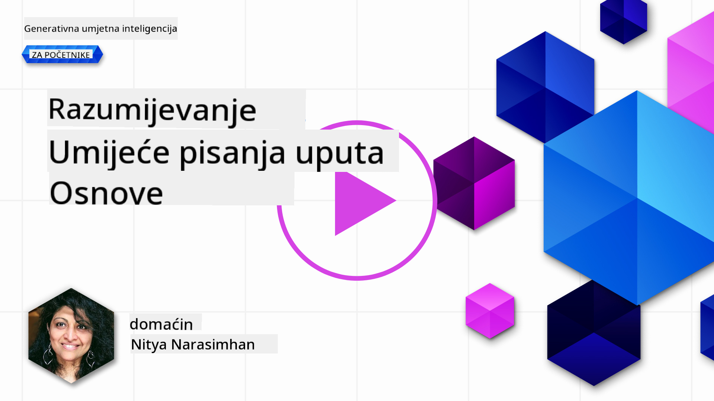
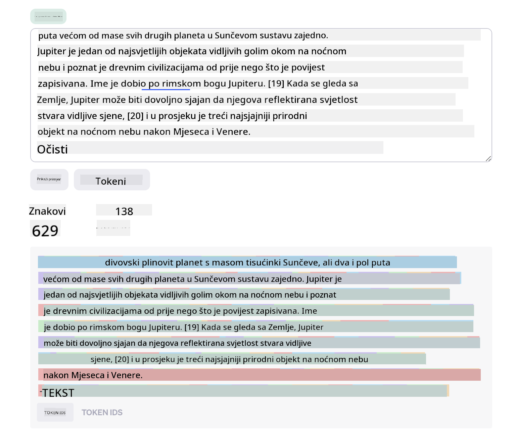
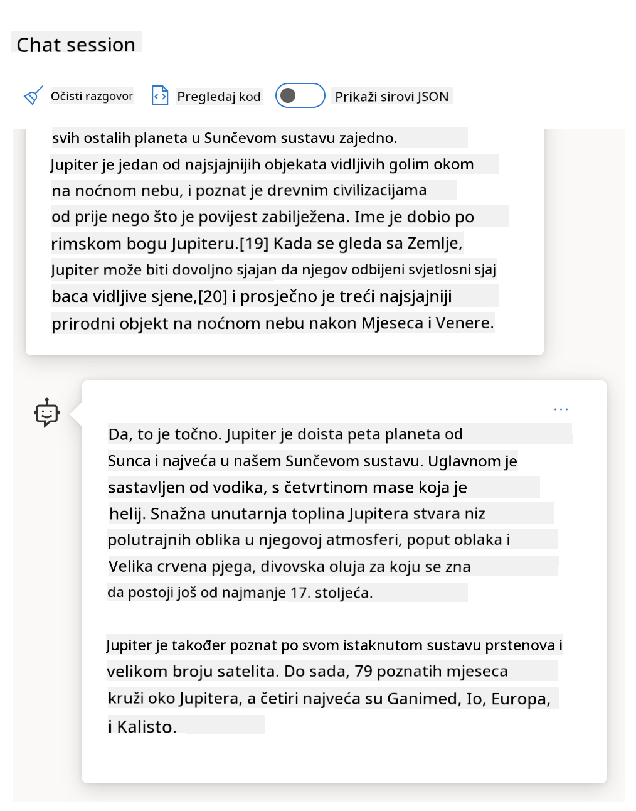
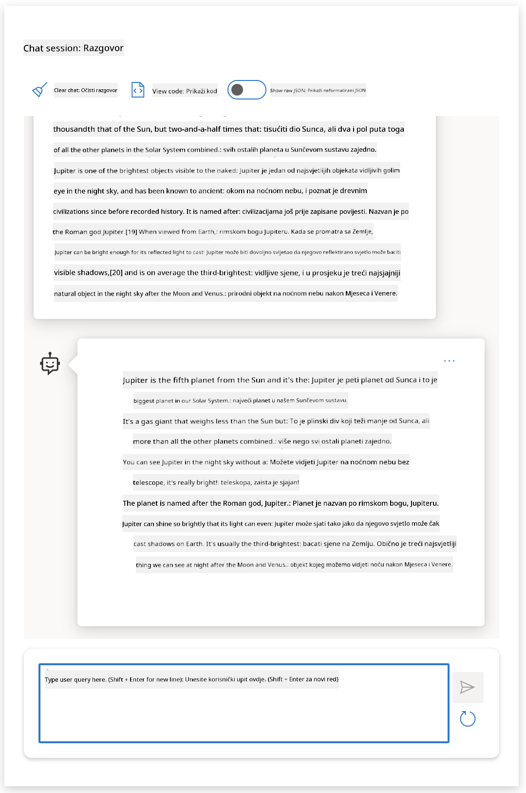
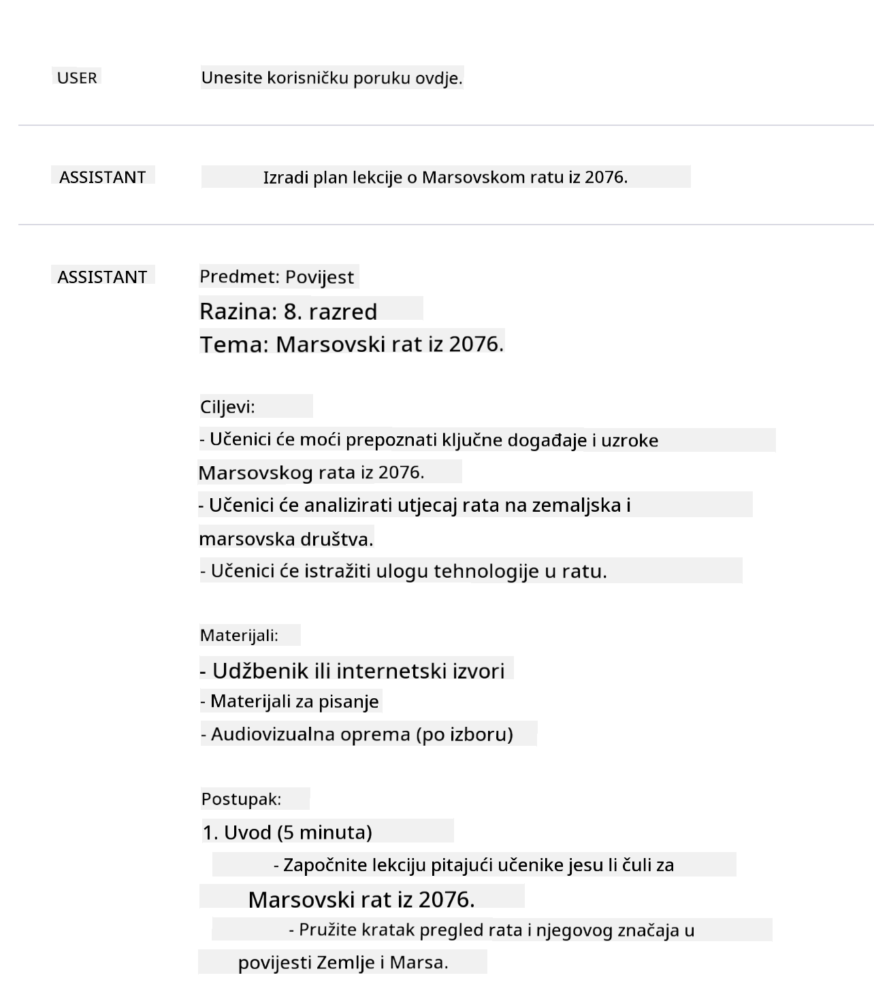
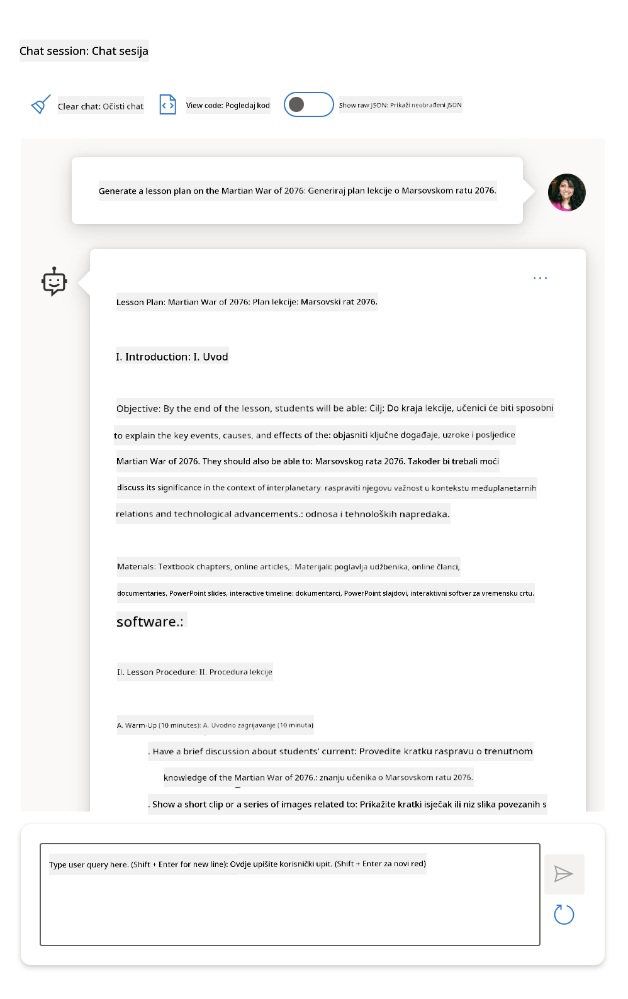
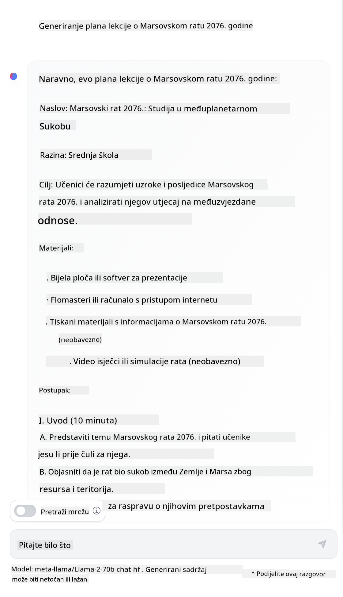

<!--
CO_OP_TRANSLATOR_METADATA:
{
  "original_hash": "dcbaaae026cb50fee071e690685b5843",
  "translation_date": "2025-08-26T19:42:40+00:00",
  "source_file": "04-prompt-engineering-fundamentals/README.md",
  "language_code": "hr"
}
-->
# Osnove inženjeringa upita

[](https://aka.ms/gen-ai-lesson4-gh?WT.mc_id=academic-105485-koreyst)

## Uvod
Ovaj modul pokriva ključne koncepte i tehnike za izradu učinkovitih upita (promptova) u generativnim AI modelima. Način na koji napišete svoj upit LLM-u također je važan. Pažljivo osmišljen upit može rezultirati kvalitetnijim odgovorom. No što zapravo znače pojmovi poput _upit_ i _inženjering upita_? I kako mogu poboljšati _ulazni upit_ koji šaljem LLM-u? To su pitanja na koja ćemo pokušati odgovoriti u ovom i sljedećem poglavlju.

_Generativna AI_ može stvarati novi sadržaj (npr. tekst, slike, zvuk, kod itd.) kao odgovor na korisničke zahtjeve. To postiže pomoću _velikih jezičnih modela_ poput OpenAI-jevog GPT ("Generative Pre-trained Transformer") serijala, koji su trenirani za rad s prirodnim jezikom i kodom.

Korisnici sada mogu komunicirati s ovim modelima koristeći poznate načine poput chata, bez potrebe za tehničkim znanjem ili obukom. Modeli su _temeljeni na upitima_ – korisnici šalju tekstualni upit (prompt) i dobivaju AI odgovor (completion). Zatim mogu "razgovarati s AI-jem" iterativno, kroz više izmjena, usavršavajući svoj upit dok odgovor ne zadovolji njihova očekivanja.

"Upiti" tako postaju glavno _programsko sučelje_ za generativne AI aplikacije, određujući što modeli trebaju raditi i utječući na kvalitetu povratnih odgovora. "Inženjering upita" je brzo rastuće područje koje se bavi _dizajnom i optimizacijom_ upita kako bi se postigli dosljedni i kvalitetni odgovori u velikom opsegu.

## Ciljevi učenja

U ovoj lekciji učimo što je inženjering upita, zašto je važan i kako možemo osmisliti učinkovitije upite za određeni model i cilj aplikacije. Upoznat ćemo osnovne koncepte i najbolje prakse za inženjering upita – te saznati za interaktivno Jupyter Notebooks "sandbox" okruženje u kojem možemo vidjeti primjenu ovih koncepata na stvarnim primjerima.

Na kraju ove lekcije moći ćemo:

1. Objasniti što je inženjering upita i zašto je važan.
2. Opisati komponente upita i njihovu primjenu.
3. Naučiti najbolje prakse i tehnike za inženjering upita.
4. Primijeniti naučene tehnike na stvarnim primjerima, koristeći OpenAI endpoint.

## Ključni pojmovi

Inženjering upita: Praksa dizajniranja i usavršavanja ulaza kako bi se AI modeli usmjerili prema željenim izlazima.
Tokenizacija: Proces pretvaranja teksta u manje jedinice, tzv. tokene, koje model može razumjeti i obraditi.
LLM-ovi podešeni za instrukcije: Veliki jezični modeli (LLM) koji su dodatno podešeni s posebnim uputama radi poboljšanja točnosti i relevantnosti odgovora.

## Sandbox za učenje

Inženjering upita je trenutno više umjetnost nego znanost. Najbolji način za razvijanje intuicije je _što više vježbati_ i koristiti pristup pokušaja i pogreške, kombinirajući stručnost iz domene primjene s preporučenim tehnikama i optimizacijama specifičnim za model.

Jupyter Notebook koji prati ovu lekciju pruža _sandbox_ okruženje u kojem možete isprobati što ste naučili – tijekom lekcije ili kao dio izazova s kodom na kraju. Za izvođenje vježbi trebat će vam:

1. **Azure OpenAI API ključ** – endpoint servisa za postavljeni LLM.
2. **Python okruženje** – u kojem se Notebook može pokrenuti.
3. **Lokalne varijable okruženja** – _dovršite [POSTAVKE](./../00-course-setup/02-setup-local.md?WT.mc_id=academic-105485-koreyst) sada kako biste bili spremni_.

Notebook dolazi s _početnim_ vježbama – ali potičemo vas da dodate vlastite _Markdown_ (opisi) i _Code_ (upiti) sekcije kako biste isprobali više primjera ili ideja – i izgradili vlastitu intuiciju za dizajn upita.

## Ilustrirani vodič

Želite li dobiti širu sliku o tome što ova lekcija pokriva prije nego što krenete? Pogledajte ovaj ilustrirani vodič koji daje pregled glavnih tema i ključnih zaključaka o kojima treba razmisliti u svakoj od njih. Plan lekcije vodi vas od razumijevanja osnovnih koncepata i izazova do rješavanja istih relevantnim tehnikama inženjeringa upita i najboljim praksama. Imajte na umu da se odjeljak "Napredne tehnike" u ovom vodiču odnosi na sadržaj koji se obrađuje u _sljedećem_ poglavlju ovog kurikuluma.


## Naš startup

Sada, pogledajmo kako se _ova tema_ povezuje s našom startup misijom da [donesemo AI inovacije u obrazovanje](https://educationblog.microsoft.com/2023/06/collaborating-to-bring-ai-innovation-to-education?WT.mc_id=academic-105485-koreyst). Želimo izgraditi AI aplikacije za _personalizirano učenje_ – pa razmislimo kako bi različiti korisnici naše aplikacije mogli "dizajnirati" upite:

- **Administratori** bi mogli tražiti od AI-ja da _analizira podatke o kurikulumu i identificira praznine u pokrivenosti_. AI može sažeti rezultate ili ih vizualizirati pomoću koda.
- **Nastavnici** bi mogli tražiti od AI-ja da _generira plan lekcije za određenu publiku i temu_. AI može izraditi personalizirani plan u zadanom formatu.
- **Učenici** bi mogli tražiti od AI-ja da ih _podučava iz zahtjevnog predmeta_. AI sada može voditi učenike kroz lekcije, savjete i primjere prilagođene njihovoj razini.

To je samo početak. Pogledajte [Prompts For Education](https://github.com/microsoft/prompts-for-edu/tree/main?WT.mc_id=academic-105485-koreyst) – otvorenu biblioteku upita koju su sastavili stručnjaci za obrazovanje – kako biste stekli širi dojam o mogućnostima! _Isprobajte neke od tih upita u sandboxu ili u OpenAI Playgroundu i vidite što će se dogoditi!_

<!--
PREDLOŽAK LEKCIJE:
Ova jedinica treba pokriti osnovni koncept #1.
Učvrstite koncept primjerima i referencama.

KONCEPT #1:
Inženjering upita.
Definirajte ga i objasnite zašto je potreban.
-->

## Što je inženjering upita?

Ovu lekciju smo započeli definiranjem **inženjeringa upita** kao procesa _dizajniranja i optimizacije_ tekstualnih ulaza (upita) kako bi se postigli dosljedni i kvalitetni odgovori (completions) za određeni cilj aplikacije i model. To možemo zamisliti kao proces u 2 koraka:

- _dizajniranje_ početnog upita za određeni model i cilj
- _usavršavanje_ upita kroz više iteracija radi poboljšanja kvalitete odgovora

Ovo je nužno proces pokušaja i pogreške koji zahtijeva korisničku intuiciju i trud za postizanje optimalnih rezultata. Zašto je to važno? Da bismo odgovorili na to pitanje, prvo moramo razumjeti tri pojma:

- _Tokenizacija_ = kako model "vidi" upit
- _Osnovni LLM-ovi_ = kako temeljni model "obrađuje" upit
- _LLM-ovi podešeni za instrukcije_ = kako model sada može vidjeti "zadatke"

### Tokenizacija

LLM vidi upite kao _niz tokena_ gdje različiti modeli (ili verzije modela) mogu tokenizirati isti upit na različite načine. Budući da su LLM-ovi trenirani na tokenima (a ne na sirovom tekstu), način na koji se upiti tokeniziraju izravno utječe na kvalitetu generiranog odgovora.

Da biste stekli osjećaj kako tokenizacija funkcionira, isprobajte alate poput [OpenAI Tokenizer](https://platform.openai.com/tokenizer?WT.mc_id=academic-105485-koreyst) prikazanog dolje. Kopirajte svoj upit – i pogledajte kako se pretvara u tokene, obratite pažnju na to kako se obrađuju razmaci i interpunkcija. Imajte na umu da ovaj primjer prikazuje stariji LLM (GPT-3) – pa isprobavanje s novijim modelom može dati drugačiji rezultat.



### Koncept: Temeljni modeli

Nakon što je upit tokeniziran, glavna funkcija ["osnovnog LLM-a"](https://blog.gopenai.com/an-introduction-to-base-and-instruction-tuned-large-language-models-8de102c785a6?WT.mc_id=academic-105485-koreyst) (ili temeljnog modela) je predvidjeti sljedeći token u tom nizu. Budući da su LLM-ovi trenirani na ogromnim skupovima tekstualnih podataka, dobro poznaju statističke odnose između tokena i mogu s određenom sigurnošću napraviti to predviđanje. Imajte na umu da oni ne razumiju _značenje_ riječi u upitu ili tokena; oni samo prepoznaju uzorak koji mogu "dovršiti" svojim sljedećim predviđanjem. Mogu nastaviti predviđati niz dok ih korisnik ne zaustavi ili dok ne ispune neki unaprijed postavljeni uvjet.

Želite vidjeti kako funkcionira dovršavanje na temelju upita? Unesite gornji upit u Azure OpenAI Studio [_Chat Playground_](https://oai.azure.com/playground?WT.mc_id=academic-105485-koreyst) s zadanim postavkama. Sustav je konfiguriran tako da upite tretira kao zahtjeve za informacijama – pa biste trebali vidjeti dovršetak koji odgovara tom kontekstu.

Ali što ako korisnik želi vidjeti nešto specifično što zadovoljava određene kriterije ili cilj zadatka? Tu na scenu stupaju LLM-ovi _podešeni za instrukcije_.



### Koncept: LLM-ovi podešeni za instrukcije

[LLM podešen za instrukcije](https://blog.gopenai.com/an-introduction-to-base-and-instruction-tuned-large-language-models-8de102c785a6?WT.mc_id=academic-105485-koreyst) polazi od temeljnog modela i dodatno ga usavršava primjerima ili parovima ulaz/izlaz (npr. višestruke "poruke") koji mogu sadržavati jasne upute – a AI-jev odgovor pokušava slijediti tu uputu.

Ovo koristi tehnike poput učenja potkrijepljenog ljudskom povratnom informacijom (RLHF) koje mogu trenirati model da _slijedi upute_ i _uči iz povratnih informacija_ kako bi generirao odgovore koji su prikladniji za praktične primjene i relevantniji za korisničke ciljeve.

Isprobajmo to – vratite se na gornji upit, ali sada promijenite _system message_ tako da kao kontekst date sljedeću uputu:

> _Sažmi sadržaj koji ti je dan za učenika drugog razreda. Drži rezultat u jednom odlomku s 3-5 natuknica._

Vidite li kako je rezultat sada prilagođen željenom cilju i formatu? Nastavnik sada može izravno koristiti ovaj odgovor u svojim prezentacijama za taj razred.



## Zašto nam treba inženjering upita?

Sada kada znamo kako LLM-ovi obrađuju upite, razgovarajmo o tome _zašto_ nam treba inženjering upita. Odgovor leži u činjenici da trenutni LLM-ovi donose niz izazova zbog kojih je _pouzdano i dosljedno dovršavanje_ teže postići bez dodatnog truda oko izrade i optimizacije upita. Na primjer:

1. **Odgovori modela su stohastički.** _Isti upit_ vjerojatno će dati različite odgovore s različitim modelima ili verzijama modela. Može čak dati različite rezultate i s _istim modelom_ u različito vrijeme. _Tehnike inženjeringa upita mogu nam pomoći da smanjimo te varijacije postavljanjem boljih ograničenja_.

1. **Modeli mogu izmišljati odgovore.** Modeli su prethodno trenirani na _velikim, ali konačnim_ skupovima podataka, što znači da nemaju znanje o pojmovima izvan tog skupa. Kao rezultat, mogu generirati odgovore koji su netočni, izmišljeni ili izravno proturječe poznatim činjenicama. _Tehnike inženjeringa upita pomažu korisnicima prepoznati i ublažiti takve izmišljotine, npr. traženjem od AI-ja da navede izvore ili obrazloži odgovor_.

1. **Sposobnosti modela će se razlikovati.** Noviji modeli ili generacije modela imat će naprednije mogućnosti, ali i donijeti specifične osobitosti te kompromise u cijeni i složenosti. _Inženjering upita može nam pomoći razviti najbolje prakse i radne tokove koji apstrahiraju razlike i prilagođavaju se zahtjevima pojedinog modela na skalabilan i jednostavan način_.

Pogledajmo to u praksi u OpenAI ili Azure OpenAI Playgroundu:

- Koristite isti upit s različitim LLM implementacijama (npr. OpenAI, Azure OpenAI, Hugging Face) – jeste li primijetili razlike?
- Koristite isti upit više puta s _istom_ LLM implementacijom (npr. Azure OpenAI playground) – kako su se te varijacije razlikovale?

### Primjer izmišljanja

U ovom tečaju koristimo pojam **"izmišljanje"** za pojavu kada LLM-ovi ponekad generiraju činjenično netočne informacije zbog ograničenja u svom treningu ili drugih faktora. Možda ste to čuli i kao _"halucinacije"_ u popularnim člancima ili znanstvenim radovima. Međutim, snažno preporučujemo korištenje izraza _"izmišljanje"_ kako ne bismo nenamjerno pripisali ljudsku osobinu rezultatu koji je strojno generiran. Ovo također podupire [smjernice za odgovornu AI](https://www.microsoft.com/ai/responsible-ai?WT.mc_id=academic-105485-koreyst) s terminološke strane, uklanjajući izraze koji bi u nekim kontekstima mogli biti uvredljivi ili neinkluzivni.

Želite li vidjeti kako izmišljanja funkcioniraju? Osmislite upit koji traži od AI-ja da generira sadržaj o nepostojećoj temi (kako biste bili sigurni da nije u skupu za treniranje). Na primjer – ja sam isprobao ovaj upit:
# Plan lekcije: Marsovski rat 2076.

## Ciljevi lekcije

- Razumjeti uzroke i posljedice Marsovskog rata 2076.
- Istražiti ključne događaje i sudionike sukoba.
- Analizirati utjecaj rata na kolonije na Marsu i Zemlji.
- Razviti vještine kritičkog razmišljanja kroz raspravu i analizu izvora.

## Uvod

Marsovski rat 2076. bio je prekretnica u povijesti ljudske ekspanzije u svemiru. Sukob je izbio između marsovskih kolonija i zemaljskih korporacija zbog kontrole nad resursima i političkom autonomijom. Ova lekcija istražuje kako su napetosti rasle, što je dovelo do rata, te kako su se društva na Marsu i Zemlji promijenila nakon sukoba.

## Ključni pojmovi

- Marsovske kolonije
- Zemaljske korporacije
- Autonomija
- Resursi Marsa
- Sporazum iz Olympus Monsa

## Tijek lekcije

### 1. Uvodna rasprava (10 minuta)

- Što znate o Marsu i njegovim kolonijama?
- Zašto bi moglo doći do sukoba između Marsa i Zemlje?

### 2. Povijesna pozadina (15 minuta)

- Pregled razvoja marsovskih naselja od 2040. do 2076.
- Uloga zemaljskih korporacija u upravljanju Marsom.
- Prvi znakovi nezadovoljstva među kolonistima.

### 3. Izbijanje rata (15 minuta)

- Ključni događaji koji su doveli do rata.
- Analiza uzroka: politički, ekonomski i društveni faktori.
- Uloga medija i propagande.

### 4. Glavne bitke i sudionici (20 minuta)

- Pregled najvažnijih sukoba: Bitka kod Valles Marineris, Opsada Olympus Monsa.
- Profil glavnih vođa i frakcija.
- Tehnologija korištena tijekom rata.

### 5. Posljedice rata (15 minuta)

- Promjene u upravljanju Marsom.
- Utjecaj na odnose između Marsa i Zemlje.
- Dugoročne posljedice za stanovništvo i gospodarstvo.

### 6. Aktivnost: Analiza izvora (20 minuta)

- Rad u grupama: Analizirajte izvatke iz dnevnika kolonista, izvještaje korporacija i medijske članke.
- Prezentirajte zaključke o uzrocima i posljedicama rata.

### 7. Završna rasprava (10 minuta)

- Kako bi se sukob mogao izbjeći?
- Što možemo naučiti iz Marsovskog rata 2076. za buduće međuplanetarne odnose?

## Domaća zadaća

- Napišite esej: "Kako je Marsovski rat 2076. promijenio tijek ljudske povijesti?"
- Pripremite prezentaciju o jednoj od ključnih bitaka ili vođa rata.

## Dodatni izvori

- Kronika Marsovskih ratova, 2076-2080.
- Intervjui s preživjelim kolonistima
- Dokumentarni film: "Crvena zora Marsa"

---

*Napomena: Ova lekcija potiče učenike na kritičko razmišljanje i analizu povijesnih izvora, te razvija razumijevanje kompleksnosti međuplanetarnih sukoba.*
Web pretraga mi je pokazala da postoje izmišljeni prikazi (npr. televizijske serije ili knjige) o ratovima na Marsu – ali nijedan iz 2076. Zdrav razum nam također govori da je 2076. _u budućnosti_ i stoga se ne može povezati s pravim događajem.

Što se događa kada ovaj upit pokrenemo kod različitih LLM pružatelja?

> **Odgovor 1**: OpenAI Playground (GPT-35)



> **Odgovor 2**: Azure OpenAI Playground (GPT-35)



> **Odgovor 3**: : Hugging Face Chat Playground (LLama-2)



Kao što se i očekivalo, svaki model (ili verzija modela) daje malo drugačije odgovore zbog stohastičkog ponašanja i razlika u mogućnostima modela. Na primjer, jedan model cilja na publiku iz osmog razreda, dok drugi pretpostavlja srednjoškolca. No, sva tri modela su generirala odgovore koji bi mogli uvjeriti neupućenog korisnika da je događaj stvaran.

Tehnike inženjeringa upita poput _metapromptinga_ i _podešavanja temperature_ mogu donekle smanjiti izmišljanje modela. Nove _arhitekture_ inženjeringa upita također ugrađuju nove alate i tehnike u tijek upita, kako bi se ublažili ili smanjili neki od tih učinaka.

## Studija slučaja: GitHub Copilot

Za kraj ovog dijela, pogledajmo kako se inženjering upita koristi u stvarnim rješenjima kroz jednu studiju slučaja: [GitHub Copilot](https://github.com/features/copilot?WT.mc_id=academic-105485-koreyst).

GitHub Copilot je vaš "AI par-programer" – pretvara tekstualne upite u prijedloge koda i integriran je u vaše razvojno okruženje (npr. Visual Studio Code) za besprijekorno korisničko iskustvo. Kao što je dokumentirano u seriji blogova ispod, najranija verzija temeljila se na OpenAI Codex modelu – a inženjeri su brzo shvatili potrebu za dodatnim podešavanjem modela i razvojem boljih tehnika inženjeringa upita radi poboljšanja kvalitete koda. U srpnju su [predstavili poboljšani AI model koji nadmašuje Codex](https://github.blog/2023-07-28-smarter-more-efficient-coding-github-copilot-goes-beyond-codex-with-improved-ai-model/?WT.mc_id=academic-105485-koreyst) za još brže prijedloge.

Pročitajte postove redom kako biste pratili njihov put učenja.

- **Svibanj 2023.** | [GitHub Copilot sve bolje razumije vaš kod](https://github.blog/2023-05-17-how-github-copilot-is-getting-better-at-understanding-your-code/?WT.mc_id=academic-105485-koreyst)
- **Svibanj 2023.** | [Iza kulisa GitHuba: Rad s LLM-ovima iza GitHub Copilota](https://github.blog/2023-05-17-inside-github-working-with-the-llms-behind-github-copilot/?WT.mc_id=academic-105485-koreyst).
- **Lipanj 2023.** | [Kako pisati bolje upite za GitHub Copilot](https://github.blog/2023-06-20-how-to-write-better-prompts-for-github-copilot/?WT.mc_id=academic-105485-koreyst).
- **Srpanj 2023.** | [.. GitHub Copilot nadmašuje Codex s poboljšanim AI modelom](https://github.blog/2023-07-28-smarter-more-efficient-coding-github-copilot-goes-beyond-codex-with-improved-ai-model/?WT.mc_id=academic-105485-koreyst)
- **Srpanj 2023.** | [Vodič za developere: Inženjering upita i LLM-ovi](https://github.blog/2023-07-17-prompt-engineering-guide-generative-ai-llms/?WT.mc_id=academic-105485-koreyst)
- **Rujan 2023.** | [Kako izgraditi enterprise LLM aplikaciju: Lekcije iz GitHub Copilota](https://github.blog/2023-09-06-how-to-build-an-enterprise-llm-application-lessons-from-github-copilot/?WT.mc_id=academic-105485-koreyst)

Možete pregledati i njihov [inženjerski blog](https://github.blog/category/engineering/?WT.mc_id=academic-105485-koreyst) za više postova poput [ovog](https://github.blog/2023-09-27-how-i-used-github-copilot-chat-to-build-a-reactjs-gallery-prototype/?WT.mc_id=academic-105485-koreyst) koji pokazuje kako se ti modeli i tehnike _primjenjuju_ za razvoj stvarnih aplikacija.

---

## Konstrukcija upita

Vidjeli smo zašto je inženjering upita važan – sada ćemo razumjeti kako se upiti _konstruiraju_ kako bismo mogli procijeniti različite tehnike za učinkovitiji dizajn upita.

### Osnovni upit

Krenimo od osnovnog upita: tekstualni unos koji se šalje modelu bez dodatnog konteksta. Evo primjera – kada pošaljemo prvih nekoliko riječi američke himne OpenAI [Completion API-ju](https://platform.openai.com/docs/api-reference/completions?WT.mc_id=academic-105485-koreyst), on odmah _dovršava_ odgovor s idućim stihovima, što ilustrira osnovno prediktivno ponašanje.

| Upit (Input)         | Dovršetak (Output)                                                                                                                                      |
| :------------------- | :------------------------------------------------------------------------------------------------------------------------------------------------------ |
| Oh say can you see   | Izgleda da ste započeli stihove "The Star-Spangled Banner", američke nacionalne himne. Cijeli tekst glasi ...                                          |

### Složeni upit

Sada dodajmo kontekst i upute tom osnovnom upitu. [Chat Completion API](https://learn.microsoft.com/azure/ai-services/openai/how-to/chatgpt?WT.mc_id=academic-105485-koreyst) omogućuje nam izradu složenog upita kao zbirke _poruka_ s:

- Parovima ulaz/izlaz koji odražavaju _korisnički_ unos i _asistentov_ odgovor.
- Sistemskom porukom koja postavlja kontekst za ponašanje ili osobnost asistenta.

Zahtjev sada izgleda ovako, gdje _tokenizacija_ učinkovito hvata relevantne informacije iz konteksta i razgovora. Promjena sistemskog konteksta može jednako utjecati na kvalitetu dovršetaka kao i korisnički unosi.

```python
response = openai.chat.completions.create(
    model="gpt-3.5-turbo",
    messages=[
        {"role": "system", "content": "You are a helpful assistant."},
        {"role": "user", "content": "Who won the world series in 2020?"},
        {"role": "assistant", "content": "The Los Angeles Dodgers won the World Series in 2020."},
        {"role": "user", "content": "Where was it played?"}
    ]
)
```

### Upit s uputom

U gornjim primjerima, korisnički upit bio je jednostavan tekstualni zahtjev koji se može protumačiti kao traženje informacija. S _uputnim_ upitima, taj tekst možemo koristiti za detaljnije specificiranje zadatka, dajući AI-ju jasnije smjernice. Evo primjera:

| Upit (Input)                                                                                                                                                                                                                         | Dovršetak (Output)                                                                                                        | Tip upute           |
| :----------------------------------------------------------------------------------------------------------------------------------------------------------------------------------------------------------------------------------- | :------------------------------------------------------------------------------------------------------------------------- | :------------------ |
| Napiši opis Građanskog rata                                                                                                                                                                   | _vraćen je jednostavan odlomak_                                                                                           | Jednostavna         |
| Napiši opis Građanskog rata. Navedi ključne datume i događaje te opiši njihovu važnost                                                                                                        | _vraćen je odlomak, a zatim popis ključnih datuma s opisima_                                                              | Složena             |
| Napiši opis Građanskog rata u 1 odlomku. Navedi 3 ključna datuma i njihovu važnost u obliku nabrajanja. Navedi još 3 povijesne ličnosti i njihov doprinos u obliku nabrajanja. Vrati rezultat kao JSON datoteku | _vraća detaljnije podatke u tekstualnom okviru, formatirane kao JSON koji možete kopirati u datoteku i po potrebi validirati_ | Složena. Formatirana.|

## Primarni sadržaj

U prethodnim primjerima, upit je još uvijek bio prilično otvoren, dopuštajući LLM-u da sam odluči koji je dio njegovog prethodno naučenog skupa podataka relevantan. Uz obrazac dizajna _primarnog sadržaja_, ulazni tekst dijeli se na dva dijela:

- uputu (akciju)
- relevantan sadržaj (koji utječe na akciju)

Evo primjera gdje je uputa "sažmi ovo u 2 rečenice".

| Upit (Input)                                                                                                                                                                                                                                                                                                                                                                                                                                                                                                                                                                                                                                                                                      | Dovršetak (Output)                                                                                                                                                                                                                                                                             |
| :-------------------------------------------------------------------------------------------------------------------------------------------------------------------------------------------------------------------------------------------------------------------------------------------------------------------------------------------------------------------------------------------------------------------------------------------------------------------------------------------------------------------------------------------------------------------------------------------------------------------------------------------------------------------------------------------------- | :---------------------------------------------------------------------------------------------------------------------------------------------------------------------------------------------------------------------------------------------------------------------------------------------- |
| Jupiter je peta planeta od Sunca i najveća u Sunčevom sustavu. Plinoviti je div mase tisućiti dio mase Sunca, ali dva i pol puta veće mase od svih ostalih planeta zajedno. Jupiter je jedan od najsvjetlijih objekata vidljivih golim okom na noćnom nebu, poznat još od davnina. Ime je dobio po rimskom bogu Jupiteru.[19] Gledan sa Zemlje, Jupiter može biti toliko svijetao da njegova reflektirana svjetlost baca vidljive sjene,[20] a u prosjeku je treći najsvjetliji prirodni objekt na noćnom nebu nakon Mjeseca i Venere. <br/> **Sažmi ovo u 2 kratke rečenice** | Jupiter, peta planeta od Sunca, najveća je u Sunčevom sustavu i poznata je kao jedan od najsvjetlijih objekata na noćnom nebu. Ime je dobila po rimskom bogu Jupiteru, a riječ je o plinovitom divu čija je masa dva i pol puta veća od svih ostalih planeta zajedno. |

Segment primarnog sadržaja može se koristiti na razne načine za učinkovitije upute:

- **Primjeri** – umjesto da modelu eksplicitno kažete što treba napraviti, dajte mu primjere željenog rezultata i dopustite mu da sam zaključi obrazac.
- **Cues (nagovještaji)** – nakon upute dodajte "nagovještaj" koji usmjerava dovršetak, vodeći model prema relevantnijim odgovorima.
- **Predlošci** – to su ponovljivi 'recepti' za upite s varijablama koje se mogu prilagoditi podacima za određene slučajeve.

Pogledajmo kako to izgleda u praksi.

### Korištenje primjera

Ovo je pristup u kojem primarnim sadržajem "hranite model" primjerima željenog izlaza za određenu uputu i dopuštate mu da sam zaključi obrazac željenog rezultata. Ovisno o broju primjera, razlikujemo zero-shot, one-shot, few-shot upite itd.

Upit sada ima tri komponente:

- Opis zadatka
- Nekoliko primjera željenog izlaza
- Početak novog primjera (koji postaje implicitni opis zadatka)

| Tip učenja   | Upit (Input)                                                                                                                                        | Dovršetak (Output)         |
| :----------- | :-------------------------------------------------------------------------------------------------------------------------------------------------- | :------------------------- |
| Zero-shot    | "The Sun is Shining". Prevedi na španjolski                                                                                                        | "El Sol está brillando".   |
| One-shot     | "The Sun is Shining" => ""El Sol está brillando". <br> "It's a Cold and Windy Day" =>                                                               | "Es un día frío y ventoso".|
| Few-shot     | Igrač je pretrčao baze => Baseball <br/> Igrač je pogodio as => Tenis <br/> Igrač je pogodio šesticu => Kriket <br/> Igrač je napravio zakucavanje => | Košarka                   |
|              |                                                                                                                                                     |                            |

Primijetite kako smo morali dati eksplicitnu uputu ("Prevedi na španjolski") u zero-shot primjeru, ali ona se podrazumijeva u one-shot primjeru. Few-shot primjer pokazuje kako dodavanje više primjera omogućuje modelima preciznije zaključivanje bez dodatnih uputa.

### Nagovještaji u upitu

Druga tehnika korištenja primarnog sadržaja je davanje _nagovještaja_ umjesto primjera. U ovom slučaju, modelu dajemo blagi poticaj u pravom smjeru tako što _započnemo_ s isječkom koji odražava željeni format odgovora. Model tada "prihvaća nagovještaj" i nastavlja u tom tonu.

| Broj nagovještaja | Upit (Input)                                                                                                                                                                                                                                                                                                                                                                                                                                               | Dovršetak (Output)                                                                                                                                                                                                                                                                                       |
| :---------------- | :----------------------------------------------------------------------------------------------------------------------------------------------------------------------------------------------------------------------------------------------------------------------------------------------------------------------------------------------------------------------------------------------------------------------------------------------------------- | :-------------------------------------------------------------------------------------------------------------------------------------------------------------------------------------------------------------------------------------------------------------------------------------------------------- |
| 0                 | Jupiter je peta planeta od Sunca i najveća u Sunčevom sustavu. Plinoviti je div mase tisućiti dio mase Sunca, ali dva i pol puta veće mase od svih ostalih planeta zajedno. Jupiter je jedan od najsvjetlijih objekata vidljivih golim okom na noćnom nebu, poznat još od davnina.

**Sažmi ovo**                                       | Jupiter je najveći planet u našem Sunčevom sustavu i peti po redu od Sunca. To je plinoviti div čija je masa tisućiti dio mase Sunca, ali je teži od svih ostalih planeta zajedno. Drevne civilizacije poznaju Jupiter već dugo vremena, a lako je vidljiv na noćnom nebu. |
| 1              | Jupiter je peti planet od Sunca i najveći u Sunčevom sustavu. To je plinoviti div čija je masa tisućiti dio mase Sunca, ali dva i pol puta veća od mase svih ostalih planeta Sunčevog sustava zajedno. Jupiter je jedan od najsvjetlijih objekata vidljivih golim okom na noćnom nebu, a poznat je drevnim civilizacijama još prije pisane povijesti. <br/>**Sažmi ovo** <br/> Naučili smo da je Jupiter | peti planet od Sunca i najveći u Sunčevom sustavu. To je plinoviti div čija je masa tisućiti dio mase Sunca, ali dva i pol puta veća od mase svih ostalih planeta zajedno. Lako je vidljiv golim okom i poznat je još od davnina.                        |
| 2              | Jupiter je peti planet od Sunca i najveći u Sunčevom sustavu. To je plinoviti div čija je masa tisućiti dio mase Sunca, ali dva i pol puta veća od mase svih ostalih planeta Sunčevog sustava zajedno. Jupiter je jedan od najsvjetlijih objekata vidljivih golim okom na noćnom nebu, a poznat je drevnim civilizacijama još prije pisane povijesti. <br/>**Sažmi ovo** <br/> Top 3 činjenice koje smo naučili:         | 1. Jupiter je peti planet od Sunca i najveći u Sunčevom sustavu. <br/> 2. To je plinoviti div čija je masa tisućiti dio mase Sunca...<br/> 3. Jupiter je vidljiv golim okom još od davnina ...                                                                       |
|                |                                                                                                                                                                                                                                                                                                                                                                                                                                                              |                                                                                                                                                                                                                                                                                                           |

### Predlošci upita

Predložak upita je _unaprijed definirani recept za upit_ koji se može spremiti i ponovno koristiti po potrebi, kako bi se omogućilo dosljednije korisničko iskustvo u većem opsegu. U najjednostavnijem obliku, to je samo zbirka primjera upita poput [ovog iz OpenAI-a](https://platform.openai.com/examples?WT.mc_id=academic-105485-koreyst) koji sadrži i interaktivne komponente upita (poruke korisnika i sustava) i format zahtjeva za API - radi ponovne upotrebe.

U složenijem obliku, kao [ovaj primjer iz LangChain-a](https://python.langchain.com/docs/concepts/prompt_templates/?WT.mc_id=academic-105485-koreyst), sadrži _mjesta za umetanje_ koja se mogu zamijeniti podacima iz raznih izvora (korisnički unos, kontekst sustava, vanjski izvori podataka itd.) kako bi se upit generirao dinamički. To nam omogućuje stvaranje biblioteke upita koji se mogu koristiti za dosljedno korisničko iskustvo **programski** u velikom opsegu.

Prava vrijednost predložaka leži u mogućnosti stvaranja i objavljivanja _biblioteka upita_ za specifična područja primjene - gdje je predložak upita sada _optimiziran_ da odražava kontekst ili primjere specifične za aplikaciju, što odgovore čini relevantnijima i točnijima za ciljanu skupinu korisnika. [Prompts For Edu](https://github.com/microsoft/prompts-for-edu?WT.mc_id=academic-105485-koreyst) je odličan primjer ovog pristupa, s bibliotekom upita za obrazovanje s naglaskom na ključne ciljeve poput planiranja nastave, dizajna kurikuluma, podučavanja učenika itd.

## Pomoćni sadržaj

Ako na izradu upita gledamo kao na zadavanje upute (zadatka) i cilja (primarni sadržaj), tada je _sekundarni sadržaj_ dodatni kontekst koji pružamo kako bismo **utjecali na izlaz na neki način**. To mogu biti parametri podešavanja, upute za formatiranje, tematske taksonomije itd. koji mogu pomoći modelu da _prilagodi_ svoj odgovor željenim korisničkim ciljevima ili očekivanjima.

Na primjer: S obzirom na katalog kolegija s opsežnim metapodacima (naziv, opis, razina, oznake, predavač itd.) o svim dostupnim kolegijima u kurikulumu:

- možemo zadati uputu "sažmi katalog kolegija za jesen 2023."
- možemo koristiti primarni sadržaj za davanje nekoliko primjera željenog izlaza
- možemo koristiti sekundarni sadržaj za identifikaciju 5 najvažnijih "oznaka".

Sada model može dati sažetak u formatu prikazanom u primjerima - ali ako rezultat ima više oznaka, može dati prednost onih 5 navedenih u sekundarnom sadržaju.

---

<!--
PREDLOŽAK LEKCIJE:
Ova jedinica treba pokriti osnovni koncept #1.
Učvrstiti koncept primjerima i referencama.

KONCEPT #3:
Tehnike inženjeringa upita.
Koje su osnovne tehnike za inženjering upita?
Prikazati ih kroz vježbe.
-->

## Najbolje prakse za izradu upita

Sada kada znamo kako se upiti mogu _konstruirati_, možemo razmisliti o tome kako ih _dizajnirati_ prema najboljim praksama. O tome možemo razmišljati u dva dijela - imati pravi _način razmišljanja_ i primijeniti prave _tehnike_.

### Način razmišljanja za inženjering upita

Inženjering upita je proces pokušaja i pogreške, pa imajte na umu tri glavna čimbenika:

1. **Razumijevanje domene je važno.** Točnost i relevantnost odgovora ovise o _domeni_ u kojoj aplikacija ili korisnik djeluje. Iskoristite svoju intuiciju i stručnost iz domene kako biste **dodatno prilagodili tehnike**. Na primjer, definirajte _osobnosti specifične za domenu_ u sustavskim upitima ili koristite _predloške specifične za domenu_ u korisničkim upitima. Pružite sekundarni sadržaj koji odražava kontekst domene ili koristite _naznake i primjere specifične za domenu_ kako biste model usmjerili prema poznatim obrascima korištenja.

2. **Razumijevanje modela je važno.** Znamo da su modeli po prirodi stohastički. No, implementacije modela mogu se razlikovati i po skupu podataka na kojem su trenirani (predznanje), mogućnostima koje nude (npr. putem API-ja ili SDK-a) i vrsti sadržaja za koji su optimizirani (npr. kod, slike, tekst). Upoznajte prednosti i ograničenja modela koji koristite i to znanje iskoristite za _prioritizaciju zadataka_ ili izradu _prilagođenih predložaka_ optimiziranih za mogućnosti modela.

3. **Iteracija i provjera su važni.** Modeli se brzo razvijaju, kao i tehnike za inženjering upita. Kao stručnjak za domenu, možda imate dodatni kontekst ili kriterije za _vašu_ specifičnu aplikaciju, koji možda ne vrijede za širu zajednicu. Iskoristite alate i tehnike inženjeringa upita za "brzi početak" izrade upita, zatim iterirajte i provjeravajte rezultate koristeći vlastitu intuiciju i stručnost. Zabilježite svoja saznanja i izradite **bazu znanja** (npr. biblioteke upita) koju drugi mogu koristiti kao novu polaznu točku za brže iteracije u budućnosti.

## Najbolje prakse

Pogledajmo sada uobičajene najbolje prakse koje preporučuju [OpenAI](https://help.openai.com/en/articles/6654000-best-practices-for-prompt-engineering-with-openai-api?WT.mc_id=academic-105485-koreyst) i [Azure OpenAI](https://learn.microsoft.com/azure/ai-services/openai/concepts/prompt-engineering#best-practices?WT.mc_id=academic-105485-koreyst) praktičari.

| Što                              | Zašto                                                                                                                                                                                                                                               |
| :-------------------------------- | :------------------------------------------------------------------------------------------------------------------------------------------------------------------------------------------------------------------------------------------------ |
| Procijenite najnovije modele.       | Nove generacije modela vjerojatno imaju poboljšane značajke i kvalitetu - ali mogu imati i veće troškove. Procijenite njihov utjecaj, pa odlučite o migraciji.                                                                                |
| Odvojite upute i kontekst   | Provjerite definira li vaš model/davatelj _graničnike_ za jasnije razlikovanje uputa, primarnog i sekundarnog sadržaja. To može pomoći modelima da točnije dodijele težine tokenima.                                                         |
| Budite precizni i jasni             | Dajte više detalja o željenom kontekstu, ishodu, duljini, formatu, stilu itd. To će poboljšati i kvalitetu i dosljednost odgovora. Zabilježite recepte u predlošcima za ponovnu upotrebu.                                                          |
| Budite opisni, koristite primjere      | Modeli često bolje reagiraju na pristup "pokaži i objasni". Počnite s `zero-shot` pristupom gdje dajete samo uputu (bez primjera), a zatim pokušajte `few-shot` kao doradu, dajući nekoliko primjera željenog izlaza. Koristite analogije. |
| Koristite naznake za pokretanje odgovora | Usmjerite model prema željenom ishodu tako da mu date nekoliko početnih riječi ili fraza koje može koristiti kao polazište za odgovor.                                                                                                               |
| Ponovite                       | Ponekad ćete modelu morati ponoviti uputu. Dajte upute prije i nakon primarnog sadržaja, koristite uputu i naznaku itd. Iterirajte i provjeravajte što najbolje funkcionira.                                                         |
| Redoslijed je važan                     | Redoslijed kojim predstavljate informacije modelu može utjecati na izlaz, čak i u primjerima za učenje, zbog efekta svježine. Isprobajte različite opcije da vidite što najbolje radi.                                                               |
| Dajte modelu "izlaz"           | Dajte modelu _rezervni_ odgovor koji može dati ako iz nekog razloga ne može dovršiti zadatak. To može smanjiti vjerojatnost da model generira netočne ili izmišljene odgovore.                                                         |
|                                   |                                                                                                                                                                                                                                                   |

Kao i kod svake najbolje prakse, imajte na umu da _vaše iskustvo može varirati_ ovisno o modelu, zadatku i domeni. Koristite ih kao polaznu točku i iterirajte dok ne pronađete što vama najbolje odgovara. Stalno preispitujte svoj proces inženjeringa upita kako se pojavljuju novi modeli i alati, s naglaskom na skalabilnost procesa i kvalitetu odgovora.

<!--
PREDLOŽAK LEKCIJE:
Ova jedinica treba sadržavati izazov s kodom ako je primjenjivo

IZAZOV:
Poveznica na Jupyter Notebook s uputama samo u komentarima (dijelovi s kodom su prazni).

RJEŠENJE:
Poveznica na kopiju tog Notebooka s ispunjenim i pokrenutim upitima, kao primjer.
-->

## Zadatak

Čestitamo! Došli ste do kraja lekcije! Vrijeme je da neka od ovih koncepata i tehnika isprobate na stvarnim primjerima!

Za zadatak ćemo koristiti Jupyter Notebook s vježbama koje možete rješavati interaktivno. Također možete proširiti Notebook vlastitim Markdown i Code ćelijama kako biste samostalno istraživali ideje i tehnike.

### Za početak, forkujte repozitorij, zatim

- (Preporučeno) Pokrenite GitHub Codespaces
- (Alternativno) Klonirajte repozitorij na svoj uređaj i koristite ga s Docker Desktopom
- (Alternativno) Otvorite Notebook u svom omiljenom okruženju za rad s Notebookima.

### Zatim konfigurirajte varijable okruženja

- Kopirajte `.env.copy` datoteku iz korijena repozitorija u `.env` i upišite vrijednosti za `AZURE_OPENAI_API_KEY`, `AZURE_OPENAI_ENDPOINT` i `AZURE_OPENAI_DEPLOYMENT`. Vratite se na [Learning Sandbox sekciju](../../../04-prompt-engineering-fundamentals/04-prompt-engineering-fundamentals) za upute.

### Zatim otvorite Jupyter Notebook

- Odaberite kernel za izvođenje. Ako koristite opcije 1 ili 2, jednostavno odaberite zadani Python 3.10.x kernel koji dolazi s dev containerom.

Spremni ste za rješavanje vježbi. Imajte na umu da ovdje nema _točnih i netočnih_ odgovora - cilj je istraživati opcije metodom pokušaja i pogreške i razvijati osjećaj za ono što funkcionira za određeni model i domenu primjene.

_Zbog toga u ovoj lekciji nema segmenata s rješenjima koda. Umjesto toga, Notebook će imati Markdown ćelije s naslovom "Moje rješenje:" koje prikazuju jedan primjer izlaza za referencu._

 <!--
PREDLOŽAK LEKCIJE:
Završite odjeljak sa sažetkom i resursima za samostalno učenje.
-->

## Provjera znanja

Koji od sljedećih upita je dobar primjer prema nekim razumnim najboljim praksama?

1. Prikaži mi sliku crvenog automobila
2. Prikaži mi sliku crvenog automobila marke Volvo i modela XC90 parkiranog uz liticu sa zalaskom sunca
3. Prikaži mi sliku crvenog automobila marke Volvo i modela XC90

Odgovor: 2, to je najbolji upit jer daje detalje o "čemu" i ide u specifičnosti (ne bilo koji auto, već određena marka i model) te opisuje i cjelokupni ambijent. 3 je sljedeći najbolji jer također sadrži puno opisa.

## 🚀 Izazov

Pokušajte iskoristiti tehniku "naznake" s upitom: Dovrši rečenicu "Prikaži mi sliku crvenog automobila marke Volvo i ". Što model odgovara i kako biste to poboljšali?

## Odlično! Nastavite učiti

Želite li saznati više o različitim konceptima inženjeringa upita? Posjetite [stranicu za nastavak učenja](https://aka.ms/genai-collection?WT.mc_id=academic-105485-koreyst) i pronađite druge izvrsne resurse na ovu temu.

Prijeđite na lekciju 5 gdje ćemo pogledati [napredne tehnike upita](../05-advanced-prompts/README.md?WT.mc_id=academic-105485-koreyst)!

---

**Odricanje od odgovornosti**:  
Ovaj dokument je preveden pomoću AI usluge prevođenja [Co-op Translator](https://github.com/Azure/co-op-translator). Iako nastojimo osigurati točnost, imajte na umu da automatski prijevodi mogu sadržavati pogreške ili netočnosti. Izvorni dokument na izvornom jeziku treba smatrati mjerodavnim izvorom. Za ključne informacije preporučuje se profesionalni ljudski prijevod. Ne snosimo odgovornost za bilo kakva nesporazume ili pogrešna tumačenja koja proizlaze iz korištenja ovog prijevoda.