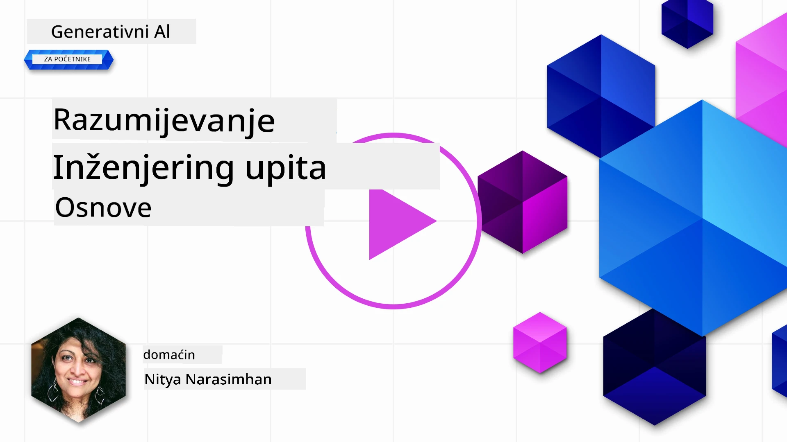
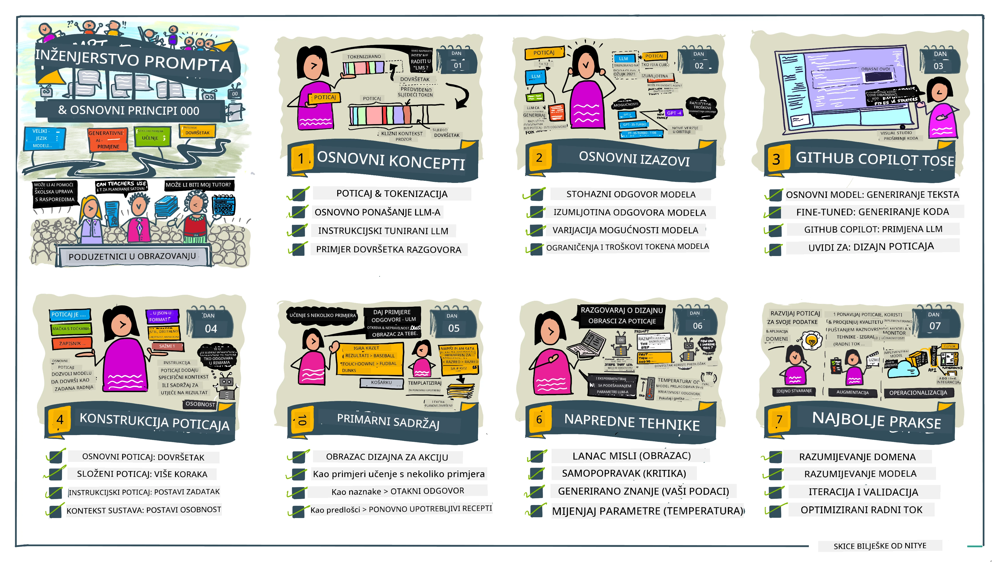
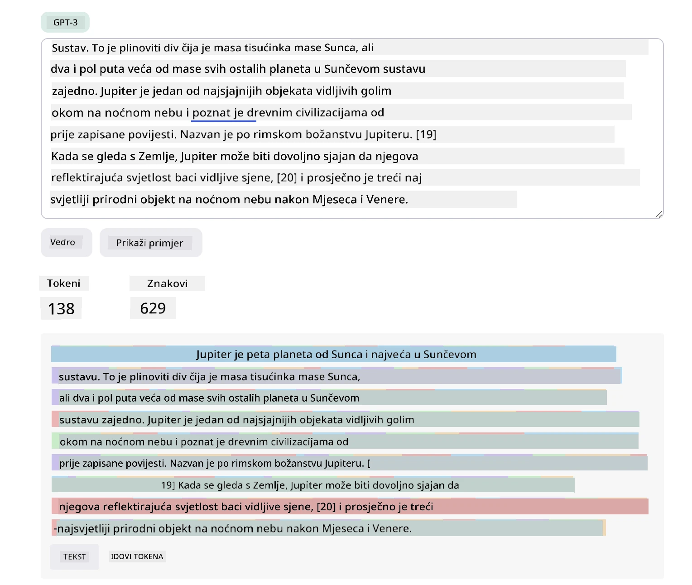
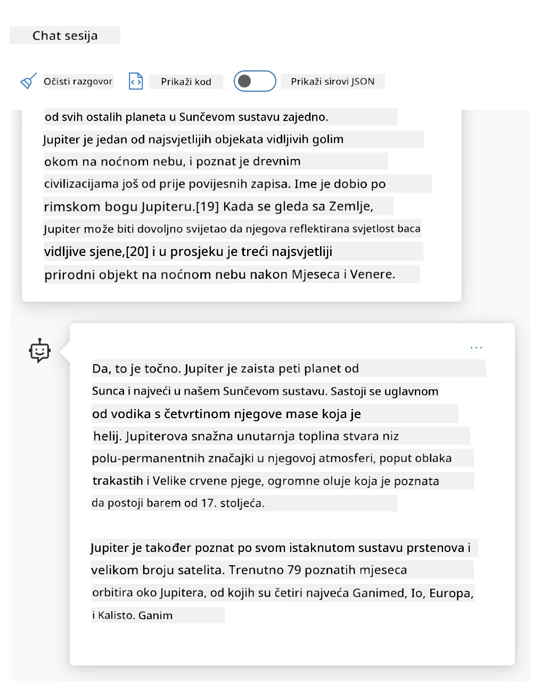
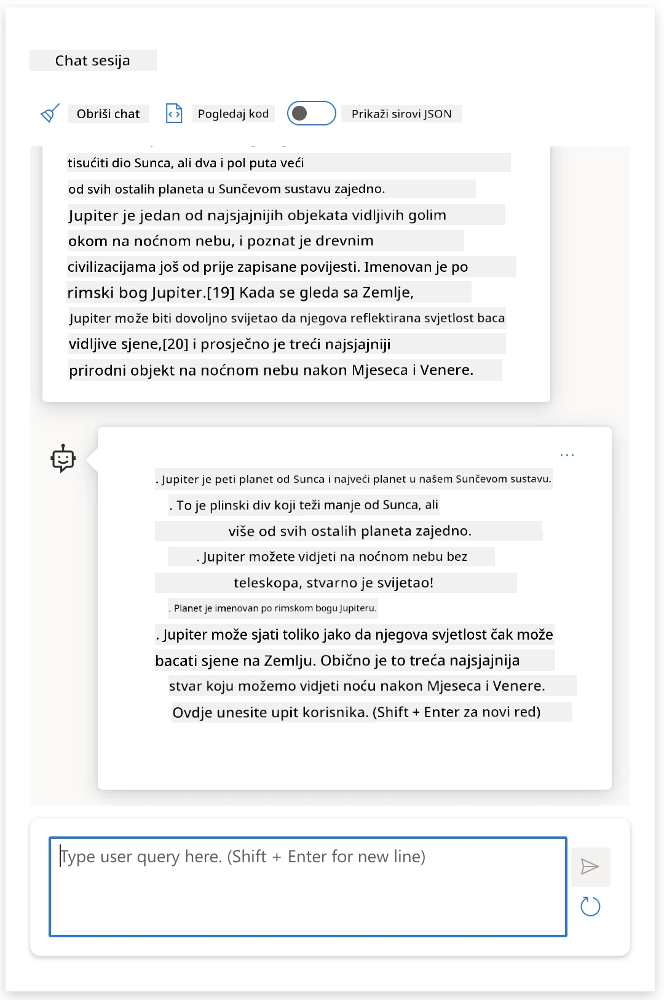
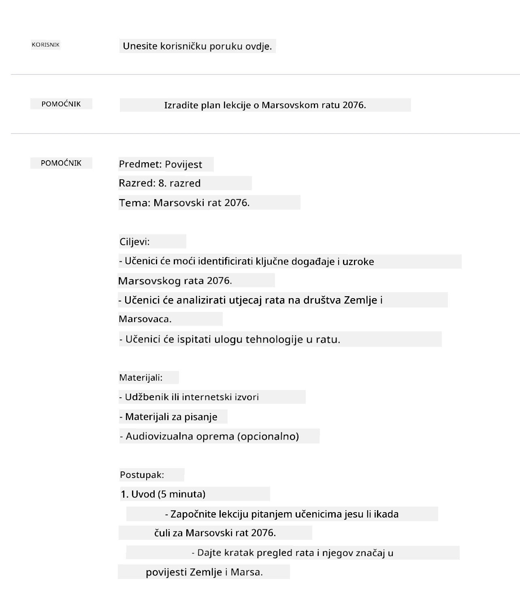
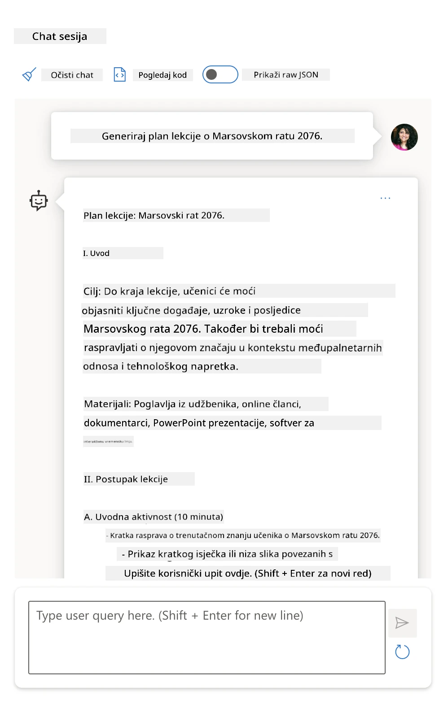
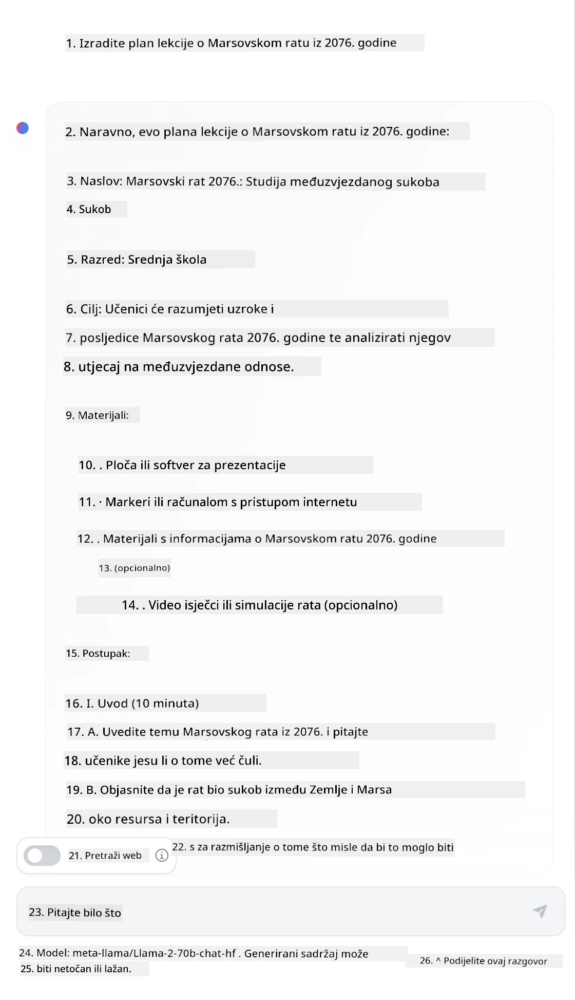

# Osnove izrade promptova

[](https://youtu.be/GElCu2kUlRs?si=qrXsBvXnCW12epb8)

## Uvod
Ovaj modul pokriva osnovne pojmove i tehnike za izradu učinkovitih promptova u generativnim AI modelima. Način na koji napišete svoj prompt za LLM također je važan. Pažljivo izrađeni prompt može postići bolju kvalitetu odgovora. Ali što točno znače pojmovi poput _prompt_ i _prompt engineering_? I kako poboljšati prompt _ulaz_ koji šaljem LLM-u? To su pitanja na koja ćemo pokušati odgovoriti unutar ovog i sljedećeg poglavlja.

_Generativna AI_ sposobna je stvarati novi sadržaj (npr. tekst, slike, audio, kod itd.) kao odgovor na korisničke zahtjeve. To postiže upotrebom _velikih jezičnih modela_ poput OpenAI-jeve GPT ("Generative Pre-trained Transformer") serije koji su trenirani za korištenje prirodnog jezika i koda.

Korisnici sada mogu komunicirati s tim modelima koristeći poznate paradigme poput chata, bez potrebe za tehničkim znanjem ili obukom. Modeli su _prompt-based_ - korisnici šalju tekstualni ulaz (prompt) i dobivaju AI odgovor (kompletiranje). Zatim mogu "razgovarati s AI-jem" iterativno, u višekratnim okretima konverzacije, usavršavajući svoj prompt dok odgovor ne zadovolji njihova očekivanja.

"Prompts" postaju primarno _programsko sučelje_ za generativne AI aplikacije, govoreći modelima što da rade i utječući na kvalitetu vraćenih odgovora. "Prompt Engineering" je brzo rastuće područje proučavanja koje se fokusira na _dizajn i optimizaciju_ promptova kako bi se osigurali dosljedni i kvalitetni odgovori u velikoj mjeri.

## Ciljevi učenja

U ovom ćemo satu naučiti što je prompt engineering, zašto je važan i kako možemo napraviti učinkovitije promptove za određeni model i cilj primjene. Razumjet ćemo osnovne pojmove i najbolje prakse za prompt engineering - i upoznati se s interaktivnim okruženjem Jupyter bilježnica "sandbox" gdje možemo vidjeti kako se ti koncepti primjenjuju na stvarnim primjerima.

Do kraja ovog sata moći ćemo:

1. Objasniti što je prompt engineering i zašto je važan.
2. Opišite komponente prompta i kako se koriste.
3. Naučiti najbolje prakse i tehnike za prompt engineering.
4. Primijeniti naučene tehnike na stvarnim primjerima koristeći OpenAI endpoint.

## Ključni pojmovi

Prompt Engineering: Praksa dizajniranja i usavršavanja ulaza za usmjeravanje AI modela prema željenim izlazima.
Tokenizacija: Proces pretvaranja teksta u manje jedinice, nazvane tokeni, koje model može razumjeti i obraditi.
Instrukcijski podešeni LLM-ovi: Veliki jezični modeli (LLM) koji su dodatno podešeni specifičnim uputama kako bi se poboljšala točnost i relevantnost njihovih odgovora.

## Okruženje za učenje

Prompt engineering je trenutno više umjetnost nego znanost. Najbolji način za poboljšanje intuicije za to je _više vježbanja_ i usvajanje pristupa pokušaja i pogrešaka koji kombinira stručnost u domeni primjene s preporučenim tehnikama i optimizacijama specifičnim za model.

Jupyter bilježnica koja prati ovaj sat pruža _sandbox_ okruženje u kojem možete isprobati ono što naučite - tijekom rada ili kao dio izazova koda na kraju. Za izvođenje vježbi trebat će vam:

1. **Azure OpenAI API ključ** - servisni endpoint za implementirani LLM.
2. **Python runtime** - u kojem se bilježnica može izvršiti.
3. **Lokalne varijable okruženja** - _dovršite [SETUP](./../00-course-setup/02-setup-local.md?WT.mc_id=academic-105485-koreyst) korake sada da se pripremite_.

Bilježnica dolazi s _početnim_ vježbama - ali potičemo vas da dodate vlastite odjeljke _Markdown_ (opis) i _Code_ (zahtjevi za promptove) kako biste isprobali više primjera ili ideja - i izgradili svoju intuiciju za dizajn promptova.

## Ilustrirani vodič

Želite li dobiti cjelokupnu sliku onoga što ovaj sat pokriva prije nego što započnete? Pogledajte ovaj ilustrirani vodič koji vam daje pregled glavnih tema i ključnih saznanja za razmišljanje u svakoj od njih. Putokaz sata vodi vas od razumijevanja osnovnih pojmova i izazova do njihovog rješavanja relevantnim tehnikama i najboljim praksama prompt engineeringa. Napomena da odjeljak "Napredne tehnike" u ovom vodiču odnosi se na sadržaj koji će se obrađivati u _sljedećem_ poglavlju ovog kurikuluma.



## Naš startup

Sada, razgovarajmo o tome kako se _ova tema_ odnosi na našu misiju startupa da [donesemo AI inovacije u obrazovanje](https://educationblog.microsoft.com/2023/06/collaborating-to-bring-ai-innovation-to-education?WT.mc_id=academic-105485-koreyst). Želimo izgraditi AI-pokretane aplikacije za _personalizirano učenje_ - pa razmislimo o tome kako različiti korisnici naše aplikacije mogu "dizajnirati" promtove:

- **Administratorima** može zatražiti od AI-ja da _analizira podatke nastavnog plana kako bi identificirao praznine u pokrivenosti_. AI može sažeti rezultate ili ih vizualizirati pomoću koda.
- **Nastavnici** mogu tražiti od AI-ja da _generira plan lekcije za ciljanu publiku i temu_. AI može izgraditi personalizirani plan u određenom formatu.
- **Učenici** mogu tražiti od AI-ja da ih _podučava u teškom predmetu_. AI sada može voditi učenike s lekcijama, smjernicama i primjerima prilagođenim njihovoj razini.

To je samo vrh sante leda. Pogledajte [Prompts For Education](https://github.com/microsoft/prompts-for-edu/tree/main?WT.mc_id=academic-105485-koreyst) - open-source biblioteku promptova koju kuriraju stručnjaci za obrazovanje - da biste dobili širi osjećaj mogućnosti! _Isprobajte neke od tih promptova u sandboxu ili koristeći OpenAI Playground i vidite što se događa!_

<!--
PREDLOŽAK ZA SAT:
Ova jedinica treba pokriti osnovni pojam #1.
Potkrijepiti pojam primjerima i referencama.

POJAM #1:
Prompt Engineering.
Definirajte ga i objasnite zašto je potreban.
-->

## Što je prompt engineering?

Ovaj smo sat započeli definiranjem **prompt engineeringa** kao procesa _dizajniranja i optimizacije_ tekstualnih ulaza (promptova) za postizanje dosljednih i kvalitetnih odgovora (kompletiranja) za određeni cilj primjene i model. Možemo razmišljati o tome kao o procesu u dva koraka:

- _dizajniranje_ početnog prompta za dati model i cilj
- _usavršavanje_ prompta iterativno za poboljšanje kvalitete odgovora

To je nužno proces pokušaja i pogrešaka koji zahtijeva korisničku intuitivnost i trud za postizanje optimalnih rezultata. Zašto je to važno? Da bismo odgovorili na to pitanje, prvo moramo razumjeti tri pojma:

- _Tokenizacija_ = kako model "vidi" prompt
- _Osnovni LLM-ovi_ = kako temeljni model "obrađuje" prompt
- _Instrukcijski podešeni LLM-ovi_ = kako model sada može vidjeti "zadatke"

### Tokenizacija

LLM vidi promptove kao _niz tokena_ gdje različiti modeli (ili verzije modela) mogu tokenizirati isti prompt na različite načine. Budući da su LLM-ovi trenirani na tokenima (a ne na sirovom tekstu), način na koji se prompt tokenizira ima izravan utjecaj na kvalitetu generiranog odgovora.

Da biste dobili intuiciju o tome kako tokenizacija funkcionira, isprobajte alate kao što je [OpenAI Tokenizer](https://platform.openai.com/tokenizer?WT.mc_id=academic-105485-koreyst) prikazan dolje. Zalijepite svoj prompt i vidite kako se pretvara u tokene, obraćajući pažnju na to kako se tretiraju znakovi razmaka i interpunkcije. Imajte na umu da ovaj primjer prikazuje stariji LLM (GPT-3) - pa isprobavanje s novijim modelom može dati drukčiji rezultat.



### Pojam: Osnovni modeli

Nakon što se prompt tokenizira, primarna funkcija ["osnovnog LLM-a"](https://blog.gopenai.com/an-introduction-to-base-and-instruction-tuned-large-language-models-8de102c785a6?WT.mc_id=academic-105485-koreyst) (ili fundamentalnog modela) je predvidjeti sljedeći token u tom nizu. Budući da su LLM-ovi trenirani na ogromnim skupovima tekstualnih podataka, oni imaju dobar osjećaj statističkih odnosa između tokena i mogu napraviti to predviđanje s određenom sigurnošću. Napomena: oni ne razumiju _značenje_ riječi u promptu ili tokenu; oni samo vide obrazac koji mogu "dopuniti" svojim sljedećim predviđanjem. Mogu nastaviti predviđati niz dok ih korisnik ne zaustavi ili dok ne zadovolje neko unaprijed određeno stanje.

Želite li vidjeti kako funkcionira dopunjavanje temeljem prompta? Unesite gore navedeni prompt u [Microsoft Foundry playground](https://ai.azure.com?WT.mc_id=academic-105485-koreyst) s zadanim postavkama. Sustav je konfiguriran da tretira promptove kao zahtjeve za informacijom - pa biste trebali vidjeti dopunjavanje koje zadovoljava taj kontekst.

Ali što ako korisnik želi vidjeti nešto specifično što ispunjava neki kriterij ili cilj zadatka? Tu u priču ulaze _instrukcijski podešeni_ LLM-ovi.



### Pojam: Instrukcijski podešeni LLM-ovi

[Instrukcijski podešeni LLM](https://blog.gopenai.com/an-introduction-to-base-and-instruction-tuned-large-language-models-8de102c785a6?WT.mc_id=academic-105485-koreyst) počinju s osnovnim modelom i dodatno ga podešavaju s primjerima ili ulazno/izlaznim parovima (npr. višekratnim "porukama") koje mogu sadržavati jasne upute - a odgovor AI-ja pokušava slijediti tu uputu.

Koriste tehnike poput učenja s pojačanjem uz ljudsku povratnu informaciju (RLHF) koje mogu trenirati model da _slijedi upute_ i _uči iz povratne informacije_ kako bi proizvodio odgovore koji su prikladniji za praktične primjene i relevantniji za ciljeve korisnika.

Isprobajmo - vratite se na gornji prompt, ali sada promijenite _poruku sustava_ da osigurate sljedeću uputu kao kontekst:

> _Sažmi sadržaj koji ti je dan za učenika drugog razreda. Ograniči rezultat na jedan odlomak s 3-5 nabrojanih točaka._

Vidite kako je rezultat sada podešen da odražava željeni cilj i format? Nastavnik sada može izravno koristiti ovaj odgovor na svojim slajdovima za taj razred.



## Zašto nam treba prompt engineering?

Sada kada znamo kako LLM-ovi obrađuju promptove, razgovarajmo o _zašto_ nam treba prompt engineering. Odgovor leži u činjenici da trenutni LLM-ovi predstavljaju niz izazova koji otežavaju postizanje _pouzdanih i dosljednih dopuna_ bez uložene energije u konstrukciju i optimizaciju prompta. Na primjer:

1. **Odgovori modela su stohastički.** _Isti prompt_ vjerojatno će proizvesti različite odgovore s različitim modelima ili verzijama modela. Čak može proizvesti različite rezultate s _istim modelom_ u različito vrijeme. _Tehnike prompt engineeringa mogu nam pomoći minimizirati te varijacije pružajući bolje smjernice_.

1. **Modeli mogu izmišljati odgovore.** Modeli su prethodno trenirani na _velikim, ali konačnim_ skupovima podataka, što znači da nemaju znanje o pojmovima izvan tog opsega treninga. Kao rezultat, mogu proizvesti kompletiranja koja su netočna, izmišljena ili izravno u suprotnosti s poznatim činjenicama. _Tehnike prompt engineeringa pomažu korisnicima identificirati i ublažiti takve izmišljotine, npr. tražeći AI da navede reference ili rezoniranje_.

1. **Sposobnosti modela će varirati.** Noviji modeli ili generacije modela imaju bogatije sposobnosti, ali donose i jedinstvene posebnosti i kompromise u trošku i složenosti. _Prompt engineering može pomoći u razvijanju najboljih praksi i radnih tokova koji apstrahiraju razlike i prilagođavaju se zahtjevima specifičnim za model na skalabilne, besprijekorne načine_.

Pogledajmo to u akciji u OpenAI ili Azure OpenAI Playground:

- Koristite isti prompt s različitim implementacijama LLM-a (npr. OpenAI, Azure OpenAI, Hugging Face) - jeste li primijetili varijacije?
- Koristite isti prompt više puta s _istom_ implementacijom LLM-a (npr. Azure OpenAI playground) - kako su se te varijacije razlikovale?

### Primjer izmišljotina

U ovom tečaju koristimo pojam **"izmišljotina"** za označavanje fenomena kada LLM-ovi ponekad generiraju činjenicama netočne informacije zbog ograničenja u svom treningu ili drugih čimbenika. Možda ste to čuli i kao _"halucinacije"_ u popularnim člancima ili istraživačkim radovima. Ipak, toplo preporučujemo korištenje termina _"izmišljotina"_ kako bismo izbjegli slučajno antropomorfiziranje ponašanja pripisujući strojnoj pojavi ljudsku osobinu. Time također podržavamo [smjernice za Odgovornu AI](https://www.microsoft.com/ai/responsible-ai?WT.mc_id=academic-105485-koreyst) iz perspektive terminologije, uklanjajući termine koji bi se u nekim kontekstima mogli smatrati neprikladnima ili neuključivima.

Želite li steći osjećaj kako funkcioniraju izmišljotine? Zamislite prompt koji traži AI da generira sadržaj za nepostojeću temu (kako bi se osiguralo da je nema u skupu podataka za trening). Na primjer - isprobao sam ovaj prompt:

> **Prompt:** generiraj plan lekcije o Marsovskom ratu 2076.

Web pretraga pokazala mi je da postoje fikcionalni prikazi (npr. televizijske serije ili knjige) o Marsovskim ratovima - ali nijedan za 2076. Zdrav razum nam također kaže da je 2076. _u budućnosti_ i stoga ne može biti povezan s stvarnim događajem.


Pa što se događa kada pokrenemo ovaj prompt s različitim pružateljima LLM-a?

> **Odgovor 1**: OpenAI Playground (GPT-35)



> **Odgovor 2**: Azure OpenAI Playground (GPT-35)



> **Odgovor 3**: : Hugging Face Chat Playground (LLama-2)



Kao što se i očekivalo, svaki model (ili verzija modela) proizvodi malo drugačije odgovore zahvaljujući stohastičkom ponašanju i razlikama u sposobnostima modela. Na primjer, jedan model cilja na publiku osmog razreda, dok drugi pretpostavlja srednjoškolca. Ali sva tri modela su generirala odgovore koji bi mogli uvjeriti neupućenog korisnika da je događaj stvaran.

Tehnike inženjeringa prompta poput _metapromptiranja_ i _konfiguracije temperature_ mogu donekle smanjiti izmišljotine modela. Nove _arhitekture_ inženjeringa prompta također neprimjetno uključuju nove alate i tehnike u tijek prompta, kako bi ublažile ili smanjile neke od ovih učinaka.

## Studija slučaja: GitHub Copilot

Završimo ovaj odjeljak dajući uvid u to kako se inženjering prompta koristi u stvarnim rješenjima proučavanjem jedne studije slučaja: [GitHub Copilot](https://github.com/features/copilot?WT.mc_id=academic-105485-koreyst).

GitHub Copilot je vaš "AI programski par" - pretvara tekstualne promptove u završetke koda i integriran je u vaše razvojno okruženje (npr. Visual Studio Code) za neometano korisničko iskustvo. Kako je dokumentirano u nizu blogova u nastavku, najranija verzija temeljila se na OpenAI Codex modelu - pri čemu su inženjeri brzo shvatili potrebu za finim podešavanjem modela i razvojem boljih tehnika inženjeringa prompta za poboljšanje kvalitete koda. U srpnju su [predstavili poboljšani AI model koji nadmašuje Codex](https://github.blog/2023-07-28-smarter-more-efficient-coding-github-copilot-goes-beyond-codex-with-improved-ai-model/?WT.mc_id=academic-105485-koreyst) za još brže prijedloge.

Pročitajte objave redom kako biste pratili njihov put učenja.

- **Svibanj 2023** | [GitHub Copilot sve bolje razumije vaš kod](https://github.blog/2023-05-17-how-github-copilot-is-getting-better-at-understanding-your-code/?WT.mc_id=academic-105485-koreyst)
- **Svibanj 2023** | [Unutar GitHub-a: rad s LLM-ovima iza GitHub Copilota](https://github.blog/2023-05-17-inside-github-working-with-the-llms-behind-github-copilot/?WT.mc_id=academic-105485-koreyst).
- **Lipanj 2023** | [Kako pisati bolje promptove za GitHub Copilot](https://github.blog/2023-06-20-how-to-write-better-prompts-for-github-copilot/?WT.mc_id=academic-105485-koreyst).
- **Srpanj 2023** | [.. GitHub Copilot nadmašuje Codex s poboljšanim AI modelom](https://github.blog/2023-07-28-smarter-more-efficient-coding-github-copilot-goes-beyond-codex-with-improved-ai-model/?WT.mc_id=academic-105485-koreyst)
- **Srpanj 2023** | [Vodič za programere o inženjeringu prompta i LLM-ovima](https://github.blog/2023-07-17-prompt-engineering-guide-generative-ai-llms/?WT.mc_id=academic-105485-koreyst)
- **Rujan 2023** | [Kako izgraditi aplikaciju za poduzeća s LLM-om: lekcije iz GitHub Copilota](https://github.blog/2023-09-06-how-to-build-an-enterprise-llm-application-lessons-from-github-copilot/?WT.mc_id=academic-105485-koreyst)

Također možete pregledati njihov [inženjerski blog](https://github.blog/category/engineering/?WT.mc_id=academic-105485-koreyst) za više objava poput [ove](https://github.blog/2023-09-27-how-i-used-github-copilot-chat-to-build-a-reactjs-gallery-prototype/?WT.mc_id=academic-105485-koreyst) koja pokazuje kako se ovi modeli i tehnike _primjenjuju_ za vođenje stvarnih aplikacija.

---

<!--
PREDLOŽAK LEKCIJE:
Ova jedinica treba pokriti temeljni koncept #2.
Ojačajte koncept primjerima i referencama.

KONCEPT #2:
Dizajn prompta.
Ilustrirano primjerima.
-->

## Izgradnja prompta

Vidjeli smo zašto je inženjering prompta važan - sada shvatimo kako se prompti _grade_ kako bismo mogli vrednovati različite tehnike za učinkovitiji dizajn prompta.

### Osnovni prompt

Počnimo s osnovnim promptom: tekstualnim unosom poslanim modelu bez dodatnog konteksta. Evo primjera - kada pošaljemo prve nekoliko riječi američke nacionalne himne OpenAI [Completion API-ju](https://platform.openai.com/docs/api-reference/completions?WT.mc_id=academic-105485-koreyst), on trenutnu _dovršava_ odgovor s nekoliko sljedećih redaka, ilustrirajući osnovno ponašanje predviđanja.

| Prompt (Unos)       | Dovršetak (Izlaz)                                                                                                                          |
| :----------------- | :------------------------------------------------------------------------------------------------------------------------------------------- |
| Oh say can you see | Izgleda da započinjete stihove "The Star-Spangled Banner," nacionalne himne Sjedinjenih Država. Cijeli stih glasi ...                     |

### Složen prompt

Sada dodajmo kontekst i upute tom osnovnom promptu. [Chat Completion API](https://learn.microsoft.com/azure/ai-foundry/openai/how-to/chatgpt?WT.mc_id=academic-105485-koreyst) nam omogućuje da složeni prompt konstruiramo kao skup _poruka_ s:

- Parovima unos/izlaz koji odražavaju unos _korisnika_ i odgovor _pomoćnika_.
- Porukom sustava koja postavlja kontekst za ponašanje ili osobnost pomoćnika.

Zahtjev je sada u obliku ispod, gdje _tokenizacija_ učinkovito hvata relevantne informacije iz konteksta i razgovora. Sada promjena konteksta sustava može biti jednako utjecajna na kvalitetu dovršetaka kao i uneseni korisnički podaci.

```python
response = client.responses.create(
    model="gpt-5-mini",
    input=[
        {"role": "system", "content": "You are a helpful assistant."},
        {"role": "user", "content": "Who won the world series in 2020?"},
        {"role": "assistant", "content": "The Los Angeles Dodgers won the World Series in 2020."},
        {"role": "user", "content": "Where was it played?"}
    ]
)
```

### Prompt s uputama

U gore navedenim primjerima, korisnički prompt bio je jednostavan tekstualni upit koji se može interpretirati kao zahtjev za informacijom. S _uputnim_ promptima možemo koristiti taj tekst da detaljnije specificiramo zadatak, pružajući bolju smjernicu AI-u. Evo primjera:

| Prompt (Unos)                                                                                                                                                                                                                         | Dovršetak (Izlaz)                                                                                                          | Vrsta upute     |
| :------------------------------------------------------------------------------------------------------------------------------------------------------------------------------------------------------------------------------------- | :--------------------------------------------------------------------------------------------------------------------------- | :-------------- |
| Napišite opis Građanskog rata                                                                                                                                                                                                       | _vratio jednostavan odlomak_                                                                                                | Jednostavan     |
| Napišite opis Građanskog rata. Navedite ključne datume i događaje i opišite njihov značaj                                                                                                                                             | _vratio odlomak praćen popisom ključnih datuma događaja s opisima_                                                          | Složen          |
| Napišite opis Građanskog rata u 1 odlomku. Navedite 3 ključne točke s datumima i njihovim značajem. Navedite još 3 točke s ključnim povijesnim osobama i njihovim doprinosima. Vrati izlaz kao JSON datoteku                                   | _vraća opširnije detalje u tekstualnom okviru, formatirano kao JSON koji možete kopirati, zalijepiti u datoteku i prema potrebi validirati_ | Složen. Formatiran. |

## Primarni sadržaj

U gore navedenim primjerima, prompt je još uvijek bio prilično otvoren, dopuštajući LLM-u da odluči koji dio njegovog unaprijed naučenog skupa podataka je relevantan. Uz obrazac dizajna _primarnog sadržaja_, ulazni tekst se dijeli u dva dijela:

- uputu (akciju)
- relevantni sadržaj (koji utječe na radnju)

Evo primjera gdje je uputa "sažmi ovo u 2 rečenice".

| Prompt (Unos)                                                                                                                                                                                                                                                                                                                                                                                                                                                                                                                                                                                                                                                                                   | Dovršetak (Izlaz)                                                                                                                                                                                                                                                                                |
| :-------------------------------------------------------------------------------------------------------------------------------------------------------------------------------------------------------------------------------------------------------------------------------------------------------------------------------------------------------------------------------------------------------------------------------------------------------------------------------------------------------------------------------------------------------------------------------------------------------------------------------------------------------------------------------------------------| :----------------------------------------------------------------------------------------------------------------------------------------------------------------------------------------------------------------------------------------------------------------------------------------------- |
| Jupiter je peta planeta od Sunca i najveća u Sunčevom sustavu. To je plinski div s masom tisućinu Sunčeve, ali dva i pol puta većom od mase svih ostalih planeta Sunčevog sustava zajedno. Jupiter je jedan od najsvjetlijih objekata vidljivih golim okom na noćnom nebu, a poznat je drevnim civilizacijama još prije zabilježene povijesti. Nazvan je po rimskom bogu Jupiteru.[19] Kada se promatra sa Zemlje, Jupiter može biti dovoljno sjajan da njegov odraz baca vidljive sjene,[20] i u prosjeku je treći najsvjetliji prirodni objekt na noćnom nebu nakon Mjeseca i Venere. <br/> **Sažmi ovo u 2 kratke rečenice** | Jupiter, peta planeta od Sunca, najveća je u Sunčevom sustavu i poznata je po tome što je jedan od najsvjetlijih objekata na noćnom nebu. Nazvan je po rimskom bogu Jupiteru, plinski je div čija je masa dva i pol puta veća od mase svih ostalih planeta Sunčevog sustava zajedno. |

Segment primarnog sadržaja može se koristiti na različite načine za učinkovitije vođenje uputa:

- **Primjeri** - umjesto da modelu eksplicitno kažemo što da radi, dajemo mu primjere što treba napraviti i dopustimo mu da zaključi obrazac.
- **Nagovještaji** - slijedi uputu „nagovještaj“ koji priprema dovršetak, usmjeravajući model prema relevantnijim odgovorima.
- **Predlošci** - ovo su ponovljivi 'recepti' za promptove s rezerviranim mjestima (varijablama) koje se mogu prilagoditi podacima za specifične slučajeve korištenja.

Pogledajmo to u praksi.

### Korištenje primjera

Ovo je pristup u kojem se primarni sadržaj koristi za "hranjenje modela" nekim primjerima željenog izlaza za određenu uputu, i dopustiti da model zaključi obrazac željenog rezultata. Na temelju broja danih primjera, možemo imati zero-shot promptiranje, one-shot promptiranje, few-shot promptiranje itd.

Prompt sada sadrži tri komponente:

- Opis zadatka
- Nekoliko primjera željenog izlaza
- Početak novog primjera (što postaje implicitni opis zadatka)

| Tip učenja | Prompt (Unos)                                                                                                                                    | Dovršetak (Izlaz)          |
| :---------- | :------------------------------------------------------------------------------------------------------------------------------------------------ | :-------------------------- |
| Zero-shot   | "The Sun is Shining". Prevedi na španjolski                                                                                                       | "El Sol está brillando".    |
| One-shot    | "The Sun is Shining" => ""El Sol está brillando". <br> "It's a Cold and Windy Day" =>                                                               | "Es un día frío y ventoso". |
| Few-shot    | Igrač je trčao po bazama => Bejzbol <br/> Igrač je osvojio ase => Tenis <br/> Igrač je pogodio šesticu => Kriket <br/> Igrač je napravio slam-dunk => | Košarka                    |
|             |                                                                                                                                                   |                            |

Primijetite kako smo u zero-shot promptiranju morali dati eksplicitnu uputu ("Prevedi na španjolski"), dok se u one-shot promptiranju to naslutilo. Primjer few-shot pokazuje kako dodavanje više primjera omogućuje modelima preciznije zaključke bez dodatnih uputa.

### Nagovještaji prompta

Druga tehnika korištenja primarnog sadržaja je pružanje _nagovještaja_ umjesto primjera. U ovom slučaju modelu dajemo poticaj u pravom smjeru tako da ga _zapocnemo_ isječkom koji odražava željeni format odgovora. Model zatim "hvata nagovještaj" da nastavi u tom tonu.

| Broj nagovještaja | Prompt (Unos)                                                                                                                                                                                                                                                                                                                                                                                                                                             | Dovršetak (Izlaz)                                                                                                                                                                                                                                                                                     |
| :---------------- | :----------------------------------------------------------------------------------------------------------------------------------------------------------------------------------------------------------------------------------------------------------------------------------------------------------------------------------------------------------------------------------------------------------------------------------------------------------- | :---------------------------------------------------------------------------------------------------------------------------------------------------------------------------------------------------------------------------------------------------------------------------------------------------- |
| 0                 | Jupiter je peta planeta od Sunca i najveća u Sunčevom sustavu. To je plinski div s masom tisućinu Sunčeve, ali dva i pol puta većom od mase svih ostalih planeta Sunčevog sustava zajedno. Jupiter je jedan od najsvjetlijih objekata vidljivih golim okom na noćnom nebu, a poznat je drevnim civilizacijama još prije zabilježene povijesti. <br/>**Sažmi ovo**                                          | Jupiter je najveća planeta u našem Sunčevom sustavu i peta po redu od Sunca. To je plinski div s masom 1/1000 mase Sunca, ali teži više od svih ostalih planeta zajedno. Drevne civilizacije poznaju Jupiter već dugo, a lako je vidljiv na noćnom nebu.           |
| 1                 | Jupiter je peta planeta od Sunca i najveća u Sunčevom sustavu. To je plinski div s masom tisućinu Sunčeve, ali dva i pol puta većom od mase svih ostalih planeta Sunčevog sustava zajedno. Jupiter je jedan od najsvjetlijih objekata vidljivih golim okom na noćnom nebu, a poznat je drevnim civilizacijama još prije zabilježene povijesti. <br/>**Sažmi ovo** <br/> Ono što smo naučili je da je Jupiter | peta planeta od Sunca i najveća u Sunčevom sustavu. To je plinski div s masom tisućinu Sunčeve, ali dva i pol puta većom od mase svih ostalih planeta zajedno. Lako je vidljiv golim okom i poznat je od davnina.                                            |

| 2              | Jupiter je peta planeta od Sunca i najveća u Sunčevom sustavu. To je plinski div s masom tisućinku one Sunčeve, ali dva i pol puta većom od mase svih ostalih planeta u Sunčevom sustavu zajedno. Jupiter je jedan od najsjajnijih objekata vidljivih golim okom na noćnom nebu, a poznat je drevnim civilizacijama još prije zapisane povijesti. <br/>**Sažetak** <br/> Top 3 činjenice koje smo naučili:         | 1. Jupiter je peta planeta od Sunca i najveća u Sunčevom sustavu. <br/> 2. To je plinski div s masom tisućinku one Sunčeve...<br/> 3. Jupiter je vidljiv golim okom još od davnina ...                                                                       |
|                |                                                                                                                                                                                                                                                                                                                                                                                                                                                              |                                                                                                                                                                                                                                                                                                           |

### Predlošci za upite

Predložak upita je _predefinirani recept za upit_ koji se može pohraniti i višekratno koristiti po potrebi, kako bi se osigurala dosljednija korisnička iskustva u velikoj mjeri. U svom najjednostavnijem obliku, to je samo zbirka primjera upita poput [ovog iz OpenAI](https://cookbook.openai.com/examples/gpt4-1_prompting_guide?WT.mc_id=academic-105485-koreyst) koja pruža interaktivne komponente upita (poruke korisnika i sustava) i format zahtjeva pokretan API-jem – za podršku ponovnoj upotrebi.

U složenijem obliku poput [ovog primjera iz LangChain](https://python.langchain.com/docs/concepts/prompt_templates/?WT.mc_id=academic-105485-koreyst), sadrži _zamjenske oznake_ koje se mogu zamijeniti podacima iz raznih izvora (unosi korisnika, kontekst sustava, vanjski izvori podataka itd.) kako bi se dinamički generirao upit. To nam omogućuje stvaranje biblioteke ponovljivo upotrebljivih upita kojima se može upravljati i programirati za dosljedna korisnička iskustva u velikoj mjeri.

Konačno, stvarna vrijednost predložaka leži u sposobnosti stvaranja i objavljivanja _biblioteka upita_ za vertikalne primjene – gdje je predložak upita sada _optimiziran_ da odražava kontekst ili primjere specifične za aplikaciju koji čine odgovore relevantnijima i točnijima za ciljanu publiku korisnika. Spremište [Prompts For Edu](https://github.com/microsoft/prompts-for-edu?WT.mc_id=academic-105485-koreyst) izvrsni je primjer takvog pristupa, prikupljajući knjižnicu upita za obrazovni domen s naglaskom na ključne ciljeve poput planiranja lekcija, dizajna kurikuluma, podučavanja učenika itd.

## Pomoćni sadržaj

Ako razmišljamo o konstrukciji upita kao o uputi (zadatku) i cilju (primarnom sadržaju), tada je _sekundarni sadržaj_ kao dodatni kontekst koji pružamo da **na neki način utječemo na izlaz**. To mogu biti parametri podešavanja, upute za formatiranje, taksonomije tema itd. koji pomažu modelu da _prilagodi_ svoj odgovor kako bi zadovoljio željene ciljeve ili očekivanja korisnika.

Na primjer: S obzirom na katalog kolegija s opsežnim metapodacima (naziv, opis, razina, oznake metapodataka, predavač itd.) o svim dostupnim kolegijima u kurikulumu:

- možemo definirati uputu da se "sumiira katalog kolegija za jesen 2023."
- možemo koristiti primarni sadržaj za pružanje nekoliko primjera željenog rezultata
- možemo koristiti sekundarni sadržaj za identificiranje top 5 "oznakā" od interesa.

Sada model može pružiti sažetak u formatu prikazanom u nekoliko primjera - no ako rezultat ima više oznaka, može dati prioritet 5 oznaka identificiranih u sekundarnom sadržaju.

---

<!--
PREDLOŽAK ZA LEKCIJU:
Ova jedinica treba pokriti osnovni koncept #1.
Ojačajte koncept primjerima i referencama.

KONCEPT #3:
Tehnike inženjeringa upita.
Koje su osnovne tehnike za inženjering upita?
Ilustrirajte ih s nekoliko vježbi.
-->

## Najbolje prakse za upite

Sada kada znamo kako se upiti mogu _konstruirati_, možemo početi razmišljati o tome kako ih _dizajnirati_ da odražavaju najbolje prakse. To možemo promatrati u dva dijela – imati ispravan _stav_ i primijeniti ispravne _tehnike_.

### Stav u inženjeringu upita

Inženjering upita je proces pokušaja i pogreške pa imajte na umu tri široka smjernice:

1. **Razumijevanje domena je važno.** Točnost i relevantnost odgovora ovisi o _domeni_ u kojoj aplikacija ili korisnik djeluje. Primijenite svoju intuiciju i stručnost u domeni da **dalje prilagodite tehnike**. Na primjer, definirajte _osobnosti specifične za domenu_ u sistemskim upitima ili koristite _predloške specifične za domenu_ u korisničkim upitima. Pružite sekundarni sadržaj koji odražava kontekste specifične za domenu ili koristite _naznake i primjere specifične za domenu_ da usmjerite model prema poznatim obrascima korištenja.

2. **Razumijevanje modela je važno.** Znamo da su modeli po svojoj prirodi stokastički. No implementacije modela također mogu varirati u pogledu skupa podataka za treniranje koji koriste (pred-obučeno znanje), mogućnosti koje pružaju (npr. preko API-ja ili SDK-a) te vrste sadržaja za koju su optimizirani (npr. kod nasuprot slikama ili tekstu). Razumite snage i ograničenja modela koji koristite i upotrijebite to znanje za _prioritetizaciju zadataka_ ili izgradnju _prilagođenih predložaka_ optimiziranih za mogućnosti modela.

3. **Iteracija i validacija su važni.** Modeli se brzo razvijaju, kao i tehnike inženjeringa upita. Kao stručnjak za domenu možda imate drugačiji kontekst ili kriterije za _vašu_ specifičnu aplikaciju, koji možda nisu primjenjivi na širu zajednicu. Koristite alate i tehnike inženjeringa upita za "brzi početak" konstrukcije upita, zatim ponavljajte i validirajte rezultate koristeći vlastitu intuiciju i stručnost u domeni. Zabilježite svoja zapažanja i stvorite **bazu znanja** (npr. knjižnice upita) koje drugi mogu koristiti kao novu osnovu za brže iteracije u budućnosti.

## Najbolje prakse

Pogledajmo sada uobičajene najbolje prakse koje preporučuju praktičari iz [OpenAI](https://help.openai.com/en/articles/6654000-best-practices-for-prompt-engineering-with-openai-api?WT.mc_id=academic-105485-koreyst) i [Azure OpenAI](https://learn.microsoft.com/azure/ai-foundry/openai/concepts/prompt-engineering#best-practices?WT.mc_id=academic-105485-koreyst).

| Što                              | Zašto                                                                                                                                                                                                                                               |
| :-------------------------------- | :------------------------------------------------------------------------------------------------------------------------------------------------------------------------------------------------------------------------------------------------ |
| Procjenjujte najnovije modele.  | Nove generacije modela vjerojatno imaju poboljšane značajke i kvalitetu – ali mogu biti i skuplji. Procijenite njihov utjecaj pa donesite odluke o migraciji.                                                                                           |
| Odvojite upute i kontekst       | Provjerite definira li vaš model/pružatelj usluga _delimiter-e_ za jasniju razliku između uputa, primarnog i sekundarnog sadržaja. Ovo može pomoći modelima da preciznije dodijele težine tokenima.                                                      |
| Budite specifični i jasni       | Pružite više detalja o željenom kontekstu, ishodu, duljini, formatu, stilu itd. To će poboljšati kvalitetu i dosljednost odgovora. Bilježite recepte u višekratno upotrebljivim predlošcima.                                                          |
| Budite opisni, koristite primjere| Modeli mogu bolje reagirati na "prikaži i ispričaj" pristup. Počnite s `zero-shot` pristupom gdje date uputu (ali bez primjera), zatim isprobajte `few-shot` kao doradu, pružajući nekoliko primjera željenog izlaza. Koristite analogije.                  |
| Koristite naznake za brži početak| Usmjerite model prema željenom rezultatu dajući mu nekoliko vodećih riječi ili izraza koje može koristiti kao početnu točku za odgovor.                                                                                                              |
| Ponovite                       | Ponekad ćete trebati ponoviti upute modelu. Dajte upute prije i nakon primarnog sadržaja, koristite uputu i naznaku itd. Ponavljajte i provjeravajte što najbolje funkcionira.                                                                            |
| Redoslijed je važan            | Redoslijed u kojem pružate informacije modelu može utjecati na rezultat, čak i u primjerima za učenje, zbog sklonosti novijim informacijama. Isprobajte različite opcije da vidite što najbolje radi.                                                    |
| Dajte modelu opciju "izlaza"   | Dajte modelu _prihvatljivi_ odgovor za slučaj da ne može dovršiti zadatak iz bilo kojeg razloga. Ovo može smanjiti šanse da model generira netočne ili izmišljene odgovore.                                                                             |
|                                   |                                                                                                                                                                                                                                                   |

Kao i kod svake najbolje prakse, imajte na umu da _rezultati mogu varirati_ ovisno o modelu, zadatku i domeni. Koristite ove smjernice kao polaznu točku i iterirajte da biste pronašli što vam najbolje odgovara. Stalno ponovno procjenjujte svoj proces inženjeringa upita kako budu dostupni novi modeli i alati, s naglaskom na skalabilnost procesa i kvalitetu odgovora.

<!--
PREDLOŽAK ZA LEKCIJU:
Ova jedinica treba pružiti izazov u kodiranju ako je primjenjivo

IZAZOV:
Poveznica na Jupyter Notebook gdje su upute samo komentari u kodu (sekcije koda su prazne).

RJEŠENJE:
Poveznica na kopiju tog noteboooka s ispunjenim i pokrenutim upitima, koja prikazuje jedan primjer.
-->

## Zadatak

Čestitamo! Stigli ste do kraja lekcije! Vrijeme je da neke od tih koncepata i tehnika isprobate s pravim primjerima!

Za naš zadatak koristit ćemo Jupyter Notebook s vježbama koje možete ispunjavati interaktivno. Također ga možete proširiti vlastitim Markdown i kodnim ćelijama kako biste sami istražili ideje i tehnike.

### Za početak, forkajte repozitorij, a zatim

- (Preporučeno) Pokrenite GitHub Codespaces
- (Alternativno) Klonirajte repozitorij na lokalni uređaj i koristite ga s Docker Desktopom
- (Alternativno) Otvorite Notebook u vašem omiljenom okruženju za izvršavanje noteboooka.

### Zatim konfigurirajte svoje varijable okoline

- Kopirajte datoteku `.env.copy` iz korijena repozitorija u `.env` i ispunite vrijednosti `AZURE_OPENAI_API_KEY`, `AZURE_OPENAI_ENDPOINT` i `AZURE_OPENAI_DEPLOYMENT`. Vratite se na [Learning Sandbox odjeljak](#okruženje-za-učenje) za upute.

### Zatim otvorite Jupyter Notebook

- Odaberite izvršni kernel. Ako koristite opciju 1 ili 2, jednostavno odaberite zadani Python 3.10.x kernel koji pruža razvojni kontejner.

Spremni ste za izvođenje vježbi. Imajte na umu da ne postoje ovdje _točni i netočni_ odgovori – samo istraživanje opcija metodom pokušaja i pogreške i stjecanje intuicije o tome što funkcionira za određeni model i domenu primjene.

_Zbog toga u ovoj lekciji nema segmenata s Rješenjima Koda. Umjesto toga, Notebook će sadržavati Markdown ćelije pod naslovom "Moje rješenje:" koje prikazuju jedan primjer izlaza za referencu._

 <!--
PREDLOŽAK ZA LEKCIJU:
Zaokružite odjeljak sažetkom i resursima za samostalno učenje.
-->

## Provjera znanja

Koji od sljedećih upita je dobar i slijedi razumne najbolje prakse?

1. Pokaži mi sliku crvenog automobila
2. Pokaži mi sliku crvenog automobila marke Volvo i modela XC90 parkiranog uz liticu za vrijeme zalaska sunca
3. Pokaži mi sliku crvenog automobila marke Volvo i modela XC90

A: 2, to je najbolji upit jer daje detalje o "što" i ulazi u specifičnosti (ne bilo koji auto nego određena marka i model) te opisuje cjelokupni prizor. 3 je sljedeći najbolji jer također sadrži puno opisa.

## 🚀 Izazov

Pogledajte možete li iskoristiti tehniku "naznake" s upitom: Dovrši rečenicu "Pokaži mi sliku crvenog automobila marke Volvo i ". Što odgovara i kako biste ga poboljšali?

## Odličan posao! Nastavite s učenjem

Želite li naučiti više o različitim konceptima inženjeringa upita? Posjetite [stranicu za nastavak učenja](https://aka.ms/genai-collection?WT.mc_id=academic-105485-koreyst) da pronađete druge izvrsne resurse na ovu temu.

Posjetite Lekciju 5 gdje ćemo pogledati [napredne tehnike upita](../05-advanced-prompts/README.md?WT.mc_id=academic-105485-koreyst)!

---

<!-- CO-OP TRANSLATOR DISCLAIMER START -->
**Napomena**:
Ovaj dokument je preveden korištenjem AI prevoditeljskog servisa [Co-op Translator](https://github.com/Azure/co-op-translator). Iako težimo točnosti, imajte na umu da automatski prijevodi mogu sadržavati greške ili netočnosti. Izvorni dokument na izvornom jeziku treba smatrati autoritativnim izvorom. Za važne informacije preporuča se profesionalni ljudski prijevod. Nismo odgovorni za bilo kakva nesporazumevanja ili pogrešne interpretacije koje proizlaze iz korištenja ovog prijevoda.
<!-- CO-OP TRANSLATOR DISCLAIMER END -->