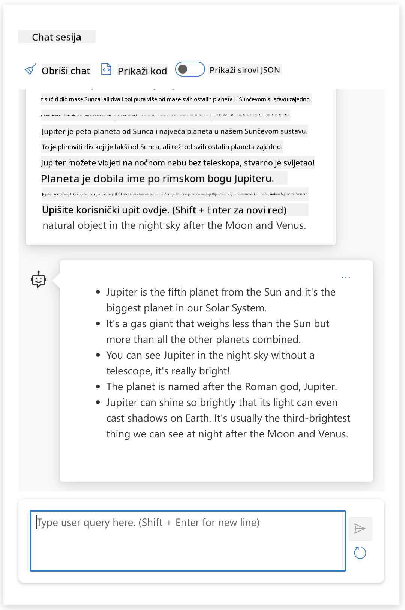

<!--
CO_OP_TRANSLATOR_METADATA:
{
  "original_hash": "8b3cb38518cf4fe7714d2f5e74dfa3eb",
  "translation_date": "2025-10-03T10:29:55+00:00",
  "source_file": "04-prompt-engineering-fundamentals/README.md",
  "language_code": "hr"
}
-->
# Osnove oblikovanja upita

[](https://aka.ms/gen-ai-lesson4-gh?WT.mc_id=academic-105485-koreyst)

## Uvod
Ovaj modul pokriva kljuÄne koncepte i tehnike za stvaranje uÄinkovitih upita u generativnim AI modelima. NaÄin na koji piÅ¡ete svoj upit za LLM takoÄ‘er je važan. Pažljivo osmiÅ¡ljen upit može rezultirati kvalitetnijim odgovorima. No Å¡to toÄno znaÄe pojmovi poput _upit_ i _oblikovanje upita_? I kako mogu poboljÅ¡ati _unos upita_ koji Å¡aljem LLM-u? To su pitanja na koja ćemo pokuÅ¡ati odgovoriti u ovom i sljedećem poglavlju.

_Generativna umjetna inteligencija_ sposobna je stvarati novi sadržaj (npr. tekst, slike, zvuk, kod itd.) kao odgovor na korisniÄke zahtjeve. To postiže pomoću _velikih jeziÄnih modela_ poput OpenAI-jevih GPT ("Generative Pre-trained Transformer") serija, koji su obuÄeni za koriÅ¡tenje prirodnog jezika i koda.

Korisnici sada mogu komunicirati s ovim modelima koristeći poznate paradigme poput razgovora, bez potrebe za tehniÄkom ekspertizom ili obukom. Modeli se temelje na _upitima_ - korisnici Å¡alju tekstualni unos (upit) i dobivaju AI odgovor (dovrÅ¡etak). Zatim mogu "razgovarati s AI-jem" iterativno, u viÅ¡ekratnim razgovorima, prilagoÄ‘avajući svoj upit dok odgovor ne zadovolji njihova oÄekivanja.

"Upiti" sada postaju primarno _programsko suÄelje_ za generativne AI aplikacije, govoreći modelima Å¡to da rade i utjeÄući na kvalitetu dobivenih odgovora. "Oblikovanje upita" je brzo rastuće podruÄje prouÄavanja koje se fokusira na _dizajn i optimizaciju_ upita kako bi se osigurali dosljedni i kvalitetni odgovori u velikim razmjerima.

## Ciljevi uÄenja

U ovoj lekciji uÄimo Å¡to je oblikovanje upita, zaÅ¡to je važno i kako možemo osmisliti uÄinkovitije upite za odreÄ‘eni model i cilj aplikacije. Razumjet ćemo osnovne koncepte i najbolje prakse za oblikovanje upita - te ćemo nauÄiti o interaktivnom "sandbox" okruženju u Jupyter Notebooku gdje možemo vidjeti primjenu ovih koncepata na stvarnim primjerima.

Na kraju ove lekcije moći ćemo:

1. Objasniti što je oblikovanje upita i zašto je važno.
2. Opisati komponente upita i kako se koriste.
3. NauÄiti najbolje prakse i tehnike za oblikovanje upita.
4. Primijeniti nauÄene tehnike na stvarne primjere koristeći OpenAI endpoint.

## KljuÄni pojmovi

Oblikovanje upita: Praksa dizajniranja i usavršavanja unosa kako bi se AI modeli usmjerili prema željenim rezultatima.
Tokenizacija: Proces pretvaranja teksta u manje jedinice, zvane tokeni, koje model može razumjeti i obraditi.
Instrukcijski prilagoÄ‘eni LLM-ovi: Veliki jeziÄni modeli (LLM-ovi) koji su dodatno prilagoÄ‘eni specifiÄnim instrukcijama kako bi poboljÅ¡ali toÄnost i relevantnost svojih odgovora.

## Sandbox za uÄenje

Oblikovanje upita trenutno je viÅ¡e umjetnost nego znanost. Najbolji naÄin za poboljÅ¡anje intuicije za to je _viÅ¡e vježbati_ i usvojiti pristup pokuÅ¡aja i pogreÅ¡ke koji kombinira struÄnost u primjeni s preporuÄenim tehnikama i optimizacijama specifiÄnim za model.

Jupyter Notebook koji prati ovu lekciju pruža _sandbox_ okruženje gdje možete isprobati ono Å¡to uÄite - tijekom lekcije ili kao dio izazova kodiranja na kraju. Za izvoÄ‘enje vježbi trebat će vam:

1. **Azure OpenAI API kljuÄ** - endpoint usluge za implementirani LLM.
2. **Python okruženje** - u kojem se Notebook može izvršiti.
3. **Lokalne varijable okruženja** - _dovršite [POSTAVKE](./../00-course-setup/02-setup-local.md?WT.mc_id=academic-105485-koreyst) sada kako biste se pripremili_.

Notebook dolazi s _poÄetnim_ vježbama - ali potiÄemo vas da dodate vlastite _Markdown_ (opis) i _Code_ (zahtjevi upita) sekcije kako biste isprobali viÅ¡e primjera ili ideja - i izgradili svoju intuiciju za dizajn upita.

## Ilustrirani vodiÄ

Želite li dobiti Å¡iru sliku o tome Å¡to ova lekcija pokriva prije nego Å¡to zaronite? Pogledajte ovaj ilustrirani vodiÄ koji vam daje pregled glavnih tema i kljuÄnih zakljuÄaka o kojima trebate razmisliti u svakoj od njih. Plan lekcije vodi vas od razumijevanja osnovnih koncepata i izazova do njihovog rjeÅ¡avanja relevantnim tehnikama oblikovanja upita i najboljim praksama. Napominjemo da se odjeljak "Napredne tehnike" u ovom vodiÄu odnosi na sadržaj pokriven u _sljedećem_ poglavlju ovog kurikuluma.


## Naš startup

Sada, razgovarajmo o tome kako se _ova tema_ odnosi na naÅ¡u misiju startupa da [donese AI inovacije u obrazovanje](https://educationblog.microsoft.com/2023/06/collaborating-to-bring-ai-innovation-to-education?WT.mc_id=academic-105485-koreyst). Želimo izgraditi AI aplikacije za _personalizirano uÄenje_ - pa razmislimo o tome kako razliÄiti korisnici naÅ¡e aplikacije mogu "dizajnirati" upite:

- **Administratori** mogu tražiti od AI-ja da _analizira podatke o kurikulumu kako bi identificirao praznine u pokrivenosti_. AI može sažeti rezultate ili ih vizualizirati pomoću koda.
- **Edukatori** mogu tražiti od AI-ja da _generira plan lekcije za ciljanu publiku i temu_. AI može izraditi personalizirani plan u zadanom formatu.
- **Studenti** mogu tražiti od AI-ja da ih _poduÄava u teÅ¡kom predmetu_. AI sada može voditi studente lekcijama, savjetima i primjerima prilagoÄ‘enim njihovoj razini.

To je samo vrh ledenog brijega. Pogledajte [Upiti za obrazovanje](https://github.com/microsoft/prompts-for-edu/tree/main?WT.mc_id=academic-105485-koreyst) - otvorenu biblioteku upita koju su kurirali struÄnjaci za obrazovanje - kako biste dobili Å¡iri uvid u mogućnosti! _PokuÅ¡ajte pokrenuti neke od tih upita u sandboxu ili koristeći OpenAI Playground da vidite Å¡to se dogaÄ‘a!_

<!--
PREDLOŽAK LEKCIJE:
Ova jedinica treba pokriti osnovni koncept #1.
OjaÄajte koncept primjerima i referencama.

KONCEPT #1:
Oblikovanje upita.
Definirajte ga i objasnite zašto je potreban.
-->

## Å to je oblikovanje upita?

ZapoÄeli smo ovu lekciju definiranjem **oblikovanja upita** kao procesa _dizajniranja i optimizacije_ tekstualnih unosa (upita) kako bi se osigurali dosljedni i kvalitetni odgovori (dovrÅ¡eci) za odreÄ‘eni cilj aplikacije i model. Možemo razmiÅ¡ljati o tome kao o procesu u 2 koraka:

- _dizajniranje_ poÄetnog upita za odreÄ‘eni model i cilj
- _usavršavanje_ upita iterativno kako bi se poboljšala kvaliteta odgovora

To je nužno proces pokušaja i pogreške koji zahtijeva intuiciju korisnika i trud za postizanje optimalnih rezultata. Zašto je to važno? Da bismo odgovorili na to pitanje, prvo moramo razumjeti tri koncepta:

- _Tokenizacija_ = kako model "vidi" upit
- _Osnovni LLM-ovi_ = kako temeljni model "obrađuje" upit
- _Instrukcijski prilagođeni LLM-ovi_ = kako model sada vidi "zadataka"

### Tokenizacija

LLM vidi upite kao _niz tokena_ gdje razliÄiti modeli (ili verzije modela) mogu tokenizirati isti upit na razliÄite naÄine. Budući da su LLM-ovi obuÄeni na tokenima (a ne na sirovom tekstu), naÄin na koji se upiti tokeniziraju ima izravan utjecaj na kvalitetu generiranog odgovora.

Da biste stekli intuiciju o tome kako tokenizacija funkcionira, isprobajte alate poput [OpenAI Tokenizer](https://platform.openai.com/tokenizer?WT.mc_id=academic-105485-koreyst) prikazanog dolje. Kopirajte svoj upit - i pogledajte kako se pretvara u tokene, obraćajući pažnju na to kako se obraÄ‘uju razmaci i interpunkcijski znakovi. Napominjemo da ovaj primjer prikazuje stariji LLM (GPT-3) - pa pokuÅ¡aj s novijim modelom može proizvesti drugaÄiji rezultat.


### Koncept: Temeljni modeli

Nakon Å¡to se upit tokenizira, primarna funkcija ["Osnovnog LLM-a"](https://blog.gopenai.com/an-introduction-to-base-and-instruction-tuned-large-language-models-8de102c785a6?WT.mc_id=academic-105485-koreyst) (ili temeljnog modela) je predvidjeti token u tom nizu. Budući da su LLM-ovi obuÄeni na masivnim tekstualnim skupovima podataka, imaju dobar osjećaj za statistiÄke odnose izmeÄ‘u tokena i mogu napraviti to predviÄ‘anje s odreÄ‘enom sigurnošću. Napominjemo da ne razumiju _znaÄenje_ rijeÄi u upitu ili tokenu; samo vide obrazac koji mogu "dovrÅ¡iti" svojim sljedećim predviÄ‘anjem. Mogu nastaviti predviÄ‘ati niz dok ih korisnik ne prekine ili dok se ne ispuni neki unaprijed postavljeni uvjet.

Želite li vidjeti kako funkcionira dovršavanje temeljeno na upitu? Unesite gornji upit u [_Chat Playground_](https://oai.azure.com/playground?WT.mc_id=academic-105485-koreyst) u Azure OpenAI Studiju s zadanim postavkama. Sustav je konfiguriran da tretira upite kao zahtjeve za informacijama - pa biste trebali vidjeti dovršetak koji zadovoljava ovaj kontekst.

Ali Å¡to ako korisnik želi vidjeti neÅ¡to specifiÄno Å¡to zadovoljava odreÄ‘ene kriterije ili cilj zadatka? Tu dolaze _instrukcijski prilagoÄ‘eni_ LLM-ovi.


### Koncept: Instrukcijski prilagođeni LLM-ovi

[Instrukcijski prilagoÄ‘eni LLM](https://blog.gopenai.com/an-introduction-to-base-and-instruction-tuned-large-language-models-8de102c785a6?WT.mc_id=academic-105485-koreyst) zapoÄinje s temeljnim modelom i dodatno ga prilagoÄ‘ava primjerima ili parovima ulaz/izlaz (npr. viÅ¡ekratnim "porukama") koji mogu sadržavati jasne instrukcije - a odgovor AI-ja pokuÅ¡ava slijediti tu instrukciju.

To koristi tehnike poput uÄenja pojaÄanja uz povratne informacije od ljudi (RLHF) koje mogu obuÄiti model da _slijedi instrukcije_ i _uÄi iz povratnih informacija_ kako bi proizvodio odgovore koji su bolje prilagoÄ‘eni praktiÄnim primjenama i relevantniji korisniÄkim ciljevima.

Isprobajmo to - ponovno posjetite gornji upit, ali sada promijenite _sistemski poruku_ kako biste pružili sljedeću instrukciju kao kontekst:

> _Sažmi sadržaj koji ti je pružen za uÄenika drugog razreda. Zadrži rezultat na jednom odlomku s 3-5 toÄaka._

Vidite li kako je rezultat sada prilagođen da odražava željeni cilj i format? Edukator sada može izravno koristiti ovaj odgovor u svojim prezentacijama za taj razred.



## Zašto nam treba oblikovanje upita?

Sada kada znamo kako LLM-ovi obraÄ‘uju upite, razgovarajmo o tome _zaÅ¡to_ nam treba oblikovanje upita. Odgovor leži u Äinjenici da trenutni LLM-ovi postavljaju niz izazova koji otežavaju _pouzdane i dosljedne dovrÅ¡etke_ bez ulaganja truda u konstrukciju i optimizaciju upita. Na primjer:

1. **Odgovori modela su stohastiÄki.** _Isti upit_ vjerojatno će proizvesti razliÄite odgovore s razliÄitim modelima ili verzijama modela. I može Äak proizvesti razliÄite rezultate s _istim modelom_ u razliÄito vrijeme. _Tehnike oblikovanja upita mogu nam pomoći minimizirati ove varijacije pružanjem boljih smjernica_.

1. **Modeli mogu izmiÅ¡ljati odgovore.** Modeli su unaprijed obuÄeni na _velikim ali ograniÄenim_ skupovima podataka, Å¡to znaÄi da nemaju znanje o konceptima izvan tog opsega obuke. Kao rezultat toga, mogu proizvesti dovrÅ¡etke koji su netoÄni, izmiÅ¡ljeni ili izravno kontradiktorni poznatim Äinjenicama. _Tehnike oblikovanja upita pomažu korisnicima identificirati i ublažiti takve izmiÅ¡ljotine, npr. traženjem od AI-ja citata ili obrazloženja_.

1. **Sposobnosti modela će varirati.** Noviji modeli ili generacije modela imat će bogatije sposobnosti, ali takoÄ‘er donose jedinstvene osobitosti i kompromise u troÅ¡kovima i složenosti. _Oblikovanje upita može nam pomoći razviti najbolje prakse i tijekove rada koji apstrahiraju razlike i prilagoÄ‘avaju se zahtjevima specifiÄnim za model na skalabilan i besprijekoran naÄin_.

Pogledajmo to u praksi u OpenAI ili Azure OpenAI Playgroundu:

- Koristite isti upit s razliÄitim LLM implementacijama (npr. OpenAI, Azure OpenAI, Hugging Face) - jeste li vidjeli varijacije?
- Koristite isti upit više puta s _istom_ LLM implementacijom (npr. Azure OpenAI Playground) - kako su se te varijacije razlikovale?

### Primjer izmišljotina

U ovom teÄaju koristimo izraz **"izmiÅ¡ljotina"** za fenomen gdje LLM-ovi ponekad generiraju ÄinjeniÄno netoÄne informacije zbog ograniÄenja u njihovoj obuci ili drugih ograniÄenja. Možda ste takoÄ‘er Äuli da se to naziva _"halucinacijama"_ u popularnim Älancima ili istraživaÄkim radovima. MeÄ‘utim, snažno preporuÄujemo koriÅ¡tenje izraza _"izmiÅ¡ljotina"_ kako ne bismo sluÄajno antropomorfizirali ponaÅ¡anje pripisujući ljudsku osobinu rezultatu voÄ‘enom strojem. To takoÄ‘er jaÄa [smjernice za odgovornu AI](https://www.microsoft.com/ai/responsible-ai?WT.mc_id=academic-105485-koreyst) s terminoloÅ¡ke perspektive, uklanjajući izraze koji bi takoÄ‘er mogli biti smatrani uvredljivima ili neinkluzivnima u nekim kontekstima.

Želite li steći osjećaj kako izmišljotine funkcioniraju? Osmislite upit koji instruira AI da generira sadržaj za nepostojeću temu (kako biste osigurali da se ne nalazi u skupu podataka za obuku). Na primjer - pokušao sam s ovim upitom:

> **Upit:** generiraj plan lekcije o Marsovskom ratu iz 2076. godine.
Web pretraga pokazala je da postoje izmišljeni prikazi (npr. televizijske serije ili knjige) o Marsovskim ratovima - ali nijedan iz 2076. Zdrav razum također nam govori da je 2076. _u budućnosti_ i stoga ne može biti povezana s stvarnim događajem.

Å to se dogaÄ‘a kada pokrenemo ovaj upit s razliÄitim pružateljima LLM-a?

> **Odgovor 1**: OpenAI Playground (GPT-35)


> **Odgovor 2**: Azure OpenAI Playground (GPT-35)


> **Odgovor 3**: Hugging Face Chat Playground (LLama-2)


Kao Å¡to se oÄekivalo, svaki model (ili verzija modela) daje malo drugaÄije odgovore zahvaljujući stohastiÄkom ponaÅ¡anju i varijacijama u sposobnostima modela. Na primjer, jedan model cilja publiku od 8. razreda, dok drugi pretpostavlja srednjoÅ¡kolsku razinu. No, sva tri modela generirala su odgovore koji bi mogli uvjeriti neinformiranog korisnika da je dogaÄ‘aj stvaran.

Tehnike oblikovanja upita, poput _metapromptinga_ i _konfiguracije temperature_, mogu donekle smanjiti izmiÅ¡ljanje modela. Nove _arhitekture_ oblikovanja upita takoÄ‘er integriraju nove alate i tehnike u tijek upita kako bi ublažile ili smanjile neke od ovih uÄinaka.

## Studija sluÄaja: GitHub Copilot

ZavrÅ¡imo ovaj dio dobivanjem uvida u to kako se oblikovanje upita koristi u stvarnim rjeÅ¡enjima, pogledom na jednu studiju sluÄaja: [GitHub Copilot](https://github.com/features/copilot?WT.mc_id=academic-105485-koreyst).

GitHub Copilot je vaÅ¡ "AI suprogramer" - pretvara tekstualne upite u prijedloge koda i integriran je u vaÅ¡e razvojno okruženje (npr. Visual Studio Code) za besprijekorno korisniÄko iskustvo. Kao Å¡to je dokumentirano u seriji blogova u nastavku, najranija verzija temeljila se na OpenAI Codex modelu - s inženjerima koji su brzo shvatili potrebu za finim podeÅ¡avanjem modela i razvojem boljih tehnika oblikovanja upita kako bi poboljÅ¡ali kvalitetu koda. U srpnju su [predstavili poboljÅ¡ani AI model koji nadilazi Codex](https://github.blog/2023-07-28-smarter-more-efficient-coding-github-copilot-goes-beyond-codex-with-improved-ai-model/?WT.mc_id=academic-105485-koreyst) za joÅ¡ brže prijedloge.

ProÄitajte postove redoslijedom kako biste pratili njihov put uÄenja.

- **Svibanj 2023** | [GitHub Copilot postaje bolji u razumijevanju vašeg koda](https://github.blog/2023-05-17-how-github-copilot-is-getting-better-at-understanding-your-code/?WT.mc_id=academic-105485-koreyst)
- **Svibanj 2023** | [Unutar GitHuba: Rad s LLM-ovima iza GitHub Copilota](https://github.blog/2023-05-17-inside-github-working-with-the-llms-behind-github-copilot/?WT.mc_id=academic-105485-koreyst).
- **Lipanj 2023** | [Kako pisati bolje upite za GitHub Copilot](https://github.blog/2023-06-20-how-to-write-better-prompts-for-github-copilot/?WT.mc_id=academic-105485-koreyst).
- **Srpanj 2023** | [.. GitHub Copilot nadilazi Codex s poboljšanim AI modelom](https://github.blog/2023-07-28-smarter-more-efficient-coding-github-copilot-goes-beyond-codex-with-improved-ai-model/?WT.mc_id=academic-105485-koreyst)
- **Srpanj 2023** | [VodiÄ za programere o oblikovanju upita i LLM-ovima](https://github.blog/2023-07-17-prompt-engineering-guide-generative-ai-llms/?WT.mc_id=academic-105485-koreyst)
- **Rujan 2023** | [Kako izgraditi LLM aplikaciju za poduzeća: Lekcije iz GitHub Copilota](https://github.blog/2023-09-06-how-to-build-an-enterprise-llm-application-lessons-from-github-copilot/?WT.mc_id=academic-105485-koreyst)

Možete također pregledati njihov [inženjerski blog](https://github.blog/category/engineering/?WT.mc_id=academic-105485-koreyst) za više postova poput [ovog](https://github.blog/2023-09-27-how-i-used-github-copilot-chat-to-build-a-reactjs-gallery-prototype/?WT.mc_id=academic-105485-koreyst) koji pokazuje kako se ovi modeli i tehnike _primjenjuju_ za pokretanje stvarnih aplikacija.

---

## Konstrukcija upita

Vidjeli smo zaÅ¡to je oblikovanje upita važno - sada ćemo razumjeti kako se upiti _konstruiraju_ kako bismo mogli procijeniti razliÄite tehnike za uÄinkovitiji dizajn upita.

### Osnovni upit

PoÄnimo s osnovnim upitom: tekstualnim unosom poslanim modelu bez dodatnog konteksta. Evo primjera - kada poÅ¡aljemo prve rijeÄi ameriÄke nacionalne himne OpenAI [Completion API](https://platform.openai.com/docs/api-reference/completions?WT.mc_id=academic-105485-koreyst), model odmah _dovrÅ¡ava_ odgovor s idućim stihovima, ilustrirajući osnovno prediktivno ponaÅ¡anje.

| Upit (Unos)       | Dovršetak (Izlaz)                                                                                                                        |
| :----------------- | :----------------------------------------------------------------------------------------------------------------------------------------- |
| Oh say can you see | ÄŒini se da zapoÄinjete stihove "The Star-Spangled Banner", nacionalne himne Sjedinjenih AmeriÄkih Država. Cijeli stihovi su ... |

### Složeni upit

Sada dodajmo kontekst i upute tom osnovnom upitu. [Chat Completion API](https://learn.microsoft.com/azure/ai-services/openai/how-to/chatgpt?WT.mc_id=academic-105485-koreyst) omogućuje nam konstrukciju složenog upita kao zbirke _poruka_ s:

- Parovima unosa/izlaza koji odražavaju _korisniÄki_ unos i _odgovor asistenta_.
- Sistemskom porukom koja postavlja kontekst za ponašanje ili osobnost asistenta.

Zahtjev sada ima oblik u nastavku, gdje _tokenizacija_ uÄinkovito bilježi relevantne informacije iz konteksta i razgovora. Sada, promjena sistemskog konteksta može imati jednako velik utjecaj na kvalitetu dovrÅ¡etaka kao i pruženi korisniÄki unosi.

```python
response = openai.chat.completions.create(
    model="gpt-3.5-turbo",
    messages=[
        {"role": "system", "content": "You are a helpful assistant."},
        {"role": "user", "content": "Who won the world series in 2020?"},
        {"role": "assistant", "content": "The Los Angeles Dodgers won the World Series in 2020."},
        {"role": "user", "content": "Where was it played?"}
    ]
)
```

### Upit s uputama

U gornjim primjerima, korisniÄki upit bio je jednostavan tekstualni upit koji se može interpretirati kao zahtjev za informacijama. S _uputama_ u upitima, možemo koristiti taj tekst za detaljnije specificiranje zadatka, pružajući bolju smjernicu AI-u. Evo primjera:

| Upit (Unos)                                                                                                                                                                                                                         | Dovršetak (Izlaz)                                                                                                        | Vrsta upute         |
| :------------------------------------------------------------------------------------------------------------------------------------------------------------------------------------------------------------------------------------- | :------------------------------------------------------------------------------------------------------------------------- | :------------------ |
| Napiši opis Građanskog rata                                                                                                                                                                                                   | _vratio jednostavan odlomak_                                                                                              | Jednostavna         |
| NapiÅ¡i opis GraÄ‘anskog rata. Navedi kljuÄne datume i dogaÄ‘aje te opiÅ¡i njihovu važnost                                                                                                                                     | _vratio odlomak praćen popisom kljuÄnih datuma dogaÄ‘aja s opisima_                                             | Složena             |
| NapiÅ¡i opis GraÄ‘anskog rata u 1 odlomku. Navedi 3 kljuÄna datuma i njihovu važnost u obliku toÄaka. Navedi joÅ¡ 3 kljuÄne povijesne osobe i njihove doprinose. Vrati izlaz kao JSON datoteku | _vratio opsežnije detalje u tekstualnom okviru, formatiranom kao JSON koji možete kopirati i zalijepiti u datoteku te validirati po potrebi_ | Složena. Formatirana. |

## Primarni sadržaj

U gornjim primjerima, upit je joÅ¡ uvijek bio priliÄno otvoren, dopuÅ¡tajući LLM-u da odluÄi koji dio njegovog unaprijed treniranog skupa podataka je relevantan. S dizajnerskim obrascem _primarnog sadržaja_, ulazni tekst je podijeljen u dva dijela:

- uputa (akcija)
- relevantan sadržaj (koji utjeÄe na akciju)

Evo primjera gdje je uputa "sažmi ovo u 2 reÄenice".

| Upit (Unos)                                                                                                                                                                                                                                                                                                                                                                                                                                                                                                                                                                                                                                                                                      | Dovršetak (Izlaz)                                                                                                                                                                                                                                                                             |
| :-------------------------------------------------------------------------------------------------------------------------------------------------------------------------------------------------------------------------------------------------------------------------------------------------------------------------------------------------------------------------------------------------------------------------------------------------------------------------------------------------------------------------------------------------------------------------------------------------------------------------------------------------------------------------------------------------- | :---------------------------------------------------------------------------------------------------------------------------------------------------------------------------------------------------------------------------------------------------------------------------------------------- |
| Jupiter je peti planet od Sunca i najveći u SunÄevom sustavu. To je plinoviti div s masom tisućinkom mase Sunca, ali dva i pol puta većom od mase svih ostalih planeta u SunÄevom sustavu zajedno. Jupiter je jedan od najsjajnijih objekata vidljivih golim okom na noćnom nebu i poznat je drevnim civilizacijama od prije zabilježene povijesti. Ime je dobio po rimskom bogu Jupiteru.[19] Kada se promatra sa Zemlje, Jupiter može biti dovoljno svijetao da njegova reflektirana svjetlost baca vidljive sjene,[20] i prosjeÄno je treći najsjajniji prirodni objekt na noćnom nebu nakon Mjeseca i Venere. <br/> **Sažmi ovo u 2 kratke reÄenice** | Jupiter, peti planet od Sunca, najveći je u SunÄevom sustavu i poznat je kao jedan od najsjajnijih objekata na noćnom nebu. Ime je dobio po rimskom bogu Jupiteru, a to je plinoviti div Äija je masa dva i pol puta veća od mase svih ostalih planeta u SunÄevom sustavu zajedno. |

Segment primarnog sadržaja može se koristiti na razliÄite naÄine za voÄ‘enje uÄinkovitijih uputa:

- **Primjeri** - umjesto da modelu eksplicitno kažete Å¡to uÄiniti, dajte mu primjere onoga Å¡to treba uÄiniti i dopustite mu da zakljuÄi obrazac.
- **Smjernice** - slijedite uputu s "smjernicom" koja usmjerava dovršetak, vodeći model prema relevantnijim odgovorima.
- **PredloÅ¡ci** - to su ponovljivi 'recepti' za upite s rezerviranim mjestima (varijablama) koje se mogu prilagoditi podacima za specifiÄne sluÄajeve upotrebe.

Istražimo ove primjere u praksi.

### Korištenje primjera

Ovo je pristup gdje koristite primarni sadržaj za "hranjenje modela" nekim primjerima željenog izlaza za danu uputu i dopuÅ¡tate mu da zakljuÄi obrazac za željeni izlaz. Ovisno o broju pruženih primjera, možemo imati upite bez primjera, s jednim primjerom, s nekoliko primjera itd.

Upit sada sadrži tri komponente:

- Opis zadatka
- Nekoliko primjera željenog izlaza
- PoÄetak novog primjera (koji postaje implicitni opis zadatka)

| Vrsta uÄenja | Upit (Unos)                                                                                                                                        | DovrÅ¡etak (Izlaz)         |
| :------------ | :---------------------------------------------------------------------------------------------------------------------------------------------------- | :-------------------------- |
| Bez primjera  | "Sunce sja". Prevedi na španjolski                                                                                                            | "El Sol está brillando".    |
| Jedan primjer | "Sunce sja" => ""El Sol está brillando". <br> "Hladan je i vjetrovit dan" =>                                                                 | "Es un día frío y ventoso". |
| Nekoliko primjera | IgraÄ je trÄao po bazama => Baseball <br/> IgraÄ je pogodio as => Tenis <br/> IgraÄ je pogodio Å¡esticu => Kriket <br/> IgraÄ je zakucao loptu => | KoÅ¡arka                  |
|               |                                                                                                                                                       |                             |

Primijetite kako smo morali pružiti eksplicitnu uputu ("Prevedi na Å¡panjolski") u upitu bez primjera, ali ona se zakljuÄuje u primjeru s jednim primjerom. Primjer s nekoliko primjera pokazuje kako dodavanje viÅ¡e primjera omogućuje modelima da donesu toÄnije zakljuÄke bez dodatnih uputa.

### Smjernice u upitu

JoÅ¡ jedna tehnika za koriÅ¡tenje primarnog sadržaja je pružanje _smjernica_ umjesto primjera. U ovom sluÄaju, dajemo modelu poticaj u pravom smjeru _zapoÄinjanjem_ s isjeÄkom koji odražava željeni format odgovora. Model tada "prihvaća smjernicu" i nastavlja u tom tonu.

| Broj smjernica | Upit (Unos)                                                                                                                                                                                                                                                                                                                                                                                                                                               | Dovršetak (Izlaz)                                                                                                                                                                                                                                                                                       |
| :------------- | :----------------------------------------------------------------------------------------------------------------------------------------------------------------------------------------------------------------------------------------------------------------------------------------------------------------------------------------------------------------------------------------------------------------------------------------------------------- | :-------------------------------------------------------------------------------------------------------------------------------------------------------------------------------------------------------------------------------------------------------------------------------------------------------- |
| 0              | Jupiter je peti planet od Sunca i najveći u SunÄevom sustavu. To je plinoviti div s masom tisućinkom mase Sunca, ali dva i pol puta većom od mase svih ostalih planeta u SunÄevom sustavu zajedno. Jupiter je jedan od najsjajnijih objekata vidljivih golim okom na noćnom nebu i poznat je drevnim civilizacijama od prije zabilježene povijesti. <br/>**Sažmi ovo**                                       | Jupiter je najveći planet u naÅ¡em SunÄevom sustavu i peti od Sunca. To je plinoviti div s masom 1/1000 mase Sunca, ali je teži od svih ostalih planeta zajedno. Drevne civilizacije poznaju Jupiter već dugo, a lako je vidljiv na noćnom nebu. |
| 1              | Jupiter je peta planeta od Sunca i najveća u SunÄevom sustavu. To je plinoviti div s masom tisućinkom mase Sunca, ali dva i pol puta većom od svih ostalih planeta u SunÄevom sustavu zajedno. Jupiter je jedan od najsjajnijih objekata vidljivih golim okom na noćnom nebu i poznat je drevnim civilizacijama od prije pisane povijesti. <br/>**Sažmi ovo** <br/> NauÄili smo da je Jupiter | peta planeta od Sunca i najveća u SunÄevom sustavu. To je plinoviti div s masom tisućinkom mase Sunca, ali dva i pol puta većom od svih ostalih planeta zajedno. Lako je vidljiv golim okom i poznat je od davnina.                        |
| 2              | Jupiter je peta planeta od Sunca i najveća u SunÄevom sustavu. To je plinoviti div s masom tisućinkom mase Sunca, ali dva i pol puta većom od svih ostalih planeta u SunÄevom sustavu zajedno. Jupiter je jedan od najsjajnijih objekata vidljivih golim okom na noćnom nebu i poznat je drevnim civilizacijama od prije pisane povijesti. <br/>**Sažmi ovo** <br/> Top 3 Äinjenice koje smo nauÄili:         | 1. Jupiter je peta planeta od Sunca i najveća u SunÄevom sustavu. <br/> 2. To je plinoviti div s masom tisućinkom mase Sunca...<br/> 3. Jupiter je vidljiv golim okom od davnina ...                                                                       |
|                |                                                                                                                                                                                                                                                                                                                                                                                                                                                              |                                                                                                                                                                                                                                                                                                           |

### Predlošci za upite

Predložak za upite je _unaprijed definirani recept za upit_ koji se može pohraniti i ponovno koristiti prema potrebi, kako bi se omogućilo dosljednije korisniÄko iskustvo u velikom opsegu. U svom najjednostavnijem obliku, to je jednostavno zbirka primjera upita poput [ovog iz OpenAI](https://platform.openai.com/examples?WT.mc_id=academic-105485-koreyst) koji pruža interaktivne komponente upita (poruke korisnika i sustava) i format zahtjeva temeljen na API-ju - za podrÅ¡ku ponovnoj upotrebi.

U svom složenijem obliku, poput [ovog primjera iz LangChain](https://python.langchain.com/docs/concepts/prompt_templates/?WT.mc_id=academic-105485-koreyst), sadrži _zamjenske oznake_ koje se mogu zamijeniti podacima iz razliÄitih izvora (korisniÄki unos, kontekst sustava, vanjski izvori podataka itd.) kako bi se dinamiÄki generirao upit. To nam omogućuje stvaranje biblioteke upita koji se mogu koristiti za dosljedno korisniÄko iskustvo **programski** u velikom opsegu.

Na kraju, prava vrijednost predložaka leži u mogućnosti stvaranja i objavljivanja _biblioteka upita_ za vertikalne aplikacijske domene - gdje je predložak upita sada _optimiziran_ kako bi odražavao specifiÄan kontekst aplikacije ili primjere koji Äine odgovore relevantnijima i toÄnijima za ciljanu publiku korisnika. [Prompts For Edu](https://github.com/microsoft/prompts-for-edu?WT.mc_id=academic-105485-koreyst) repo je odliÄan primjer ovog pristupa, koji kurira biblioteku upita za obrazovnu domenu s naglaskom na kljuÄne ciljeve poput planiranja lekcija, dizajna kurikuluma, poduÄavanja uÄenika itd.

## Pomoćni sadržaj

Ako razmiÅ¡ljamo o konstrukciji upita kao o zadatku (instrukcija) i cilju (primarni sadržaj), tada je _sekundarni sadržaj_ dodatni kontekst koji pružamo kako bismo **utjecali na izlaz na neki naÄin**. To mogu biti parametri za podeÅ¡avanje, upute za formatiranje, taksonomije tema itd., koji mogu pomoći modelu da _prilagodi_ svoj odgovor kako bi odgovarao željenim ciljevima ili oÄekivanjima korisnika.

Na primjer: S obzirom na katalog kolegija s opsežnim metapodacima (naziv, opis, razina, oznake metapodataka, instruktor itd.) o svim dostupnim kolegijima u kurikulumu:

- možemo definirati instrukciju za "sažmi katalog kolegija za jesen 2023."
- možemo koristiti primarni sadržaj za pružanje nekoliko primjera željenog izlaza
- možemo koristiti sekundarni sadržaj za identifikaciju 5 najvažnijih "oznaka".

Sada model može pružiti sažetak u formatu prikazanom kroz nekoliko primjera - ali ako rezultat ima više oznaka, može prioritizirati 5 oznaka identificiranih u sekundarnom sadržaju.

---

<!--
PREDLOŽAK LEKCIJE:
Ova jedinica treba pokriti osnovni koncept #1.
OjaÄajte koncept primjerima i referencama.

KONCEPT #3:
Tehnike inženjeringa upita.
Koje su osnovne tehnike za inženjering upita?
Ilustrirajte ih vježbama.
-->

## Najbolje prakse za upite

Sada kada znamo kako se upiti mogu _konstruirati_, možemo poÄeti razmiÅ¡ljati o tome kako ih _dizajnirati_ da odražavaju najbolje prakse. Možemo razmiÅ¡ljati o tome u dva dijela - imati pravi _mentalni sklop_ i primjenjivati prave _tehnike_.

### Mentalni sklop za inženjering upita

Inženjering upita je proces pokuÅ¡aja i pogreÅ¡aka, pa imajte na umu tri Å¡iroka Äimbenika:

1. **Razumijevanje domene je važno.** ToÄnost i relevantnost odgovora ovise o _domeni_ u kojoj aplikacija ili korisnik djeluje. Primijenite svoju intuiciju i struÄnost u domeni kako biste **dalje prilagodili tehnike**. Na primjer, definirajte _osobnosti specifiÄne za domenu_ u svojim sustavnim upitima ili koristite _predloÅ¡ke specifiÄne za domenu_ u korisniÄkim upitima. Pružite sekundarni sadržaj koji odražava kontekste specifiÄne za domenu ili koristite _naznake i primjere specifiÄne za domenu_ kako biste model usmjerili prema poznatim obrascima koriÅ¡tenja.

2. **Razumijevanje modela je važno.** Znamo da su modeli stohastiÄki po prirodi. No, implementacije modela takoÄ‘er se mogu razlikovati u smislu skupa podataka za obuku koji koriste (predtrenirano znanje), sposobnosti koje pružaju (npr. putem API-ja ili SDK-a) i vrste sadržaja za koje su optimizirani (npr. kod, slike, tekst). Razumijte snage i ograniÄenja modela koji koristite i koristite to znanje za _prioritizaciju zadataka_ ili izgradnju _prilagoÄ‘enih predložaka_ optimiziranih za sposobnosti modela.

3. **Iteracija i validacija su važne.** Modeli se brzo razvijaju, kao i tehnike za inženjering upita. Kao struÄnjak za domenu, možda imate drugi kontekst ili kriterije specifiÄne za _vaÅ¡u_ aplikaciju, koji možda ne vrijede za Å¡iru zajednicu. Koristite alate i tehnike inženjeringa upita za "brzi poÄetak" konstrukcije upita, zatim iterirajte i validirajte rezultate koristeći vlastitu intuiciju i struÄnost u domeni. Zabilježite svoje uvide i stvorite **bazu znanja** (npr. biblioteke upita) koja se može koristiti kao nova osnova za druge, za brže iteracije u budućnosti.

## Najbolje prakse

Sada pogledajmo uobiÄajene najbolje prakse koje preporuÄuju [OpenAI](https://help.openai.com/en/articles/6654000-best-practices-for-prompt-engineering-with-openai-api?WT.mc_id=academic-105485-koreyst) i [Azure OpenAI](https://learn.microsoft.com/azure/ai-services/openai/concepts/prompt-engineering#best-practices?WT.mc_id=academic-105485-koreyst) praktiÄari.

| Što                              | Zašto                                                                                                                                                                                                                                               |
| :-------------------------------- | :------------------------------------------------------------------------------------------------------------------------------------------------------------------------------------------------------------------------------------------------ |
| Procijenite najnovije modele.       | Nove generacije modela vjerojatno imaju poboljÅ¡ane znaÄajke i kvalitetu - ali mogu takoÄ‘er imati veće troÅ¡kove. Procijenite njihov utjecaj, zatim donesite odluke o migraciji.                                                                                |
| Odvojite instrukcije i kontekst   | Provjerite definira li vaÅ¡ model/provajder _graniÄnike_ za jasnije razlikovanje instrukcija, primarnog i sekundarnog sadržaja. To može pomoći modelima da toÄnije dodijele težine tokenima.                                                         |
| Budite specifiÄni i jasni             | Dajte viÅ¡e detalja o željenom kontekstu, ishodu, duljini, formatu, stilu itd. To će poboljÅ¡ati i kvalitetu i dosljednost odgovora. Zabilježite recepte u predloÅ¡cima za ponovnu upotrebu.                                                          |
| Budite opisni, koristite primjere      | Modeli mogu bolje reagirati na pristup "pokaži i ispriÄaj". ZapoÄnite s `zero-shot` pristupom gdje dajete instrukciju (ali bez primjera), zatim pokuÅ¡ajte `few-shot` kao poboljÅ¡anje, pružajući nekoliko primjera željenog izlaza. Koristite analogije. |
| Koristite naznake za pokretanje odgovora | Usmjerite ga prema željenom ishodu dajući mu nekoliko poÄetnih rijeÄi ili fraza koje može koristiti kao polaziÅ¡te za odgovor.                                                                                                               |
| Ponovite                       | Ponekad ćete možda morati ponoviti instrukcije modelu. Dajte upute prije i nakon primarnog sadržaja, koristite instrukciju i naznaku itd. Iterirajte i validirajte kako biste vidjeli što najbolje funkcionira.                                                         |
| Redoslijed je važan                     | Redoslijed kojim predstavljate informacije modelu može utjecati na izlaz, Äak i u primjerima uÄenja, zahvaljujući pristranosti prema novijim informacijama. Isprobajte razliÄite opcije kako biste vidjeli Å¡to najbolje funkcionira.                                                               |
| Dajte modelu "izlaz"           | Dajte modelu _alternativni_ odgovor koji može pružiti ako iz bilo kojeg razloga ne može dovrÅ¡iti zadatak. To može smanjiti Å¡anse da modeli generiraju netoÄne ili izmiÅ¡ljene odgovore.                                                         |
|                                   |                                                                                                                                                                                                                                                   |

Kao i kod svake najbolje prakse, zapamtite da _vaÅ¡e iskustvo može varirati_ ovisno o modelu, zadatku i domeni. Koristite ovo kao poÄetnu toÄku i iterirajte kako biste pronaÅ¡li Å¡to najbolje funkcionira za vas. Stalno ponovno procjenjujte svoj proces inženjeringa upita kako postaju dostupni novi modeli i alati, s fokusom na skalabilnost procesa i kvalitetu odgovora.

<!--
PREDLOŽAK LEKCIJE:
Ova jedinica treba pružiti izazov s kodom, ako je primjenjivo.

IZAZOV:
Poveznica na Jupyter Notebook s samo komentarima u kodu kao uputama (sekcije koda su prazne).

RJEÅ ENJE:
Poveznica na kopiju tog Notebooka s ispunjenim i pokrenutim upitima, pokazujući što bi mogao biti jedan primjer.
-->

## Zadatak

Čestitamo! Došli ste do kraja lekcije! Vrijeme je da testirate neke od tih koncepata i tehnika s pravim primjerima!

Za naš zadatak koristit ćemo Jupyter Notebook s vježbama koje možete interaktivno dovršiti. Također možete proširiti Notebook vlastitim Markdown i Code ćelijama kako biste sami istražili ideje i tehnike.

### Za poÄetak, forkajte repo, zatim

- (PreporuÄeno) Pokrenite GitHub Codespaces
- (Alternativno) Klonirajte repo na svoj lokalni uređaj i koristite ga s Docker Desktop
- (Alternativno) Otvorite Notebook s vašim preferiranim runtime okruženjem za Notebook.

### Zatim konfigurirajte svoje varijable okruženja

- Kopirajte `.env.copy` datoteku u korijenu repozitorija u `.env` i ispunite vrijednosti `AZURE_OPENAI_API_KEY`, `AZURE_OPENAI_ENDPOINT` i `AZURE_OPENAI_DEPLOYMENT`. Vratite se na [sekciju Sandbox za uÄenje](../../../04-prompt-engineering-fundamentals/04-prompt-engineering-fundamentals) kako biste saznali kako.

### Zatim otvorite Jupyter Notebook

- Odaberite runtime kernel. Ako koristite opcije 1 ili 2, jednostavno odaberite zadani Python 3.10.x kernel koji pruža dev container.

Spremni ste za pokretanje vježbi. Imajte na umu da ovdje nema _toÄnih i netoÄnih_ odgovora - samo istražujete opcije metodom pokuÅ¡aja i pogreÅ¡aka i gradite intuiciju za ono Å¡to funkcionira za odreÄ‘eni model i aplikacijsku domenu.

_Iz tog razloga u ovoj lekciji nema segmenata s rješenjima koda. Umjesto toga, Notebook će imati Markdown ćelije naslovljene "Moje rješenje:" koje prikazuju jedan primjer izlaza za referencu._

 <!--
PREDLOŽAK LEKCIJE:
ZavrÅ¡ite sekciju sa sažetkom i resursima za samostalno uÄenje.
-->

## Provjera znanja

Koji od sljedećih upita je dobar upit koji slijedi neke razumne najbolje prakse?

1. Pokaži mi sliku crvenog automobila
2. Pokaži mi sliku crvenog automobila marke Volvo i modela XC90 parkiranog uz liticu s zalaskom sunca
3. Pokaži mi sliku crvenog automobila marke Volvo i modela XC90

O: 2, to je najbolji upit jer pruža detalje o "Äemu" i ide u specifiÄnosti (ne samo bilo koji automobil, već odreÄ‘ena marka i model) te takoÄ‘er opisuje cjelokupni ambijent. 3 je sljedeći najbolji jer takoÄ‘er sadrži puno opisa.

## 🚀 Izazov

PokuÅ¡ajte iskoristiti tehniku "naznaka" s upitom: DovrÅ¡i reÄenicu "Pokaži mi sliku crvenog automobila marke Volvo i ". Å to odgovara, i kako biste to poboljÅ¡ali?

## Sjajan rad! Nastavite uÄiti

Želite li saznati viÅ¡e o razliÄitim konceptima inženjeringa upita? Posjetite [stranicu za nastavak uÄenja](https://aka.ms/genai-collection?WT.mc_id=academic-105485-koreyst) kako biste pronaÅ¡li druge izvrsne resurse o ovoj temi.

Prijeđite na Lekciju 5 gdje ćemo pogledati [napredne tehnike upita](../05-advanced-prompts/README.md?WT.mc_id=academic-105485-koreyst)!

---

**Odricanje od odgovornosti**:  
Ovaj dokument je preveden pomoću AI usluge za prevoÄ‘enje [Co-op Translator](https://github.com/Azure/co-op-translator). Iako težimo toÄnosti, imajte na umu da automatski prijevodi mogu sadržavati pogreÅ¡ke ili netoÄnosti. Izvorni dokument na izvornom jeziku treba smatrati mjerodavnim izvorom. Za kljuÄne informacije preporuÄuje se profesionalni prijevod od strane Äovjeka. Ne preuzimamo odgovornost za nesporazume ili pogreÅ¡na tumaÄenja koja proizlaze iz koriÅ¡tenja ovog prijevoda.