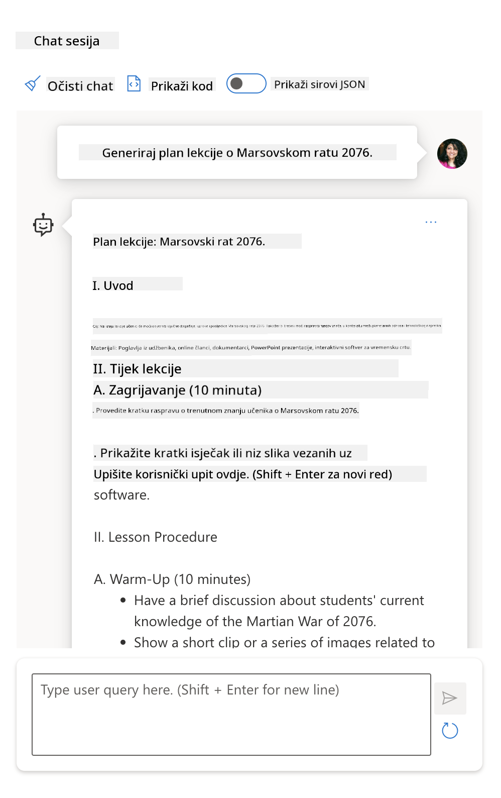

<!--
CO_OP_TRANSLATOR_METADATA:
{
  "original_hash": "dcbaaae026cb50fee071e690685b5843",
  "translation_date": "2025-08-26T19:42:40+00:00",
  "source_file": "04-prompt-engineering-fundamentals/README.md",
  "language_code": "hr"
}
-->
# Osnove inženjeringa upita

[](https://aka.ms/gen-ai-lesson4-gh?WT.mc_id=academic-105485-koreyst)

## Uvod
Ovaj modul pokriva kljuÄne koncepte i tehnike za izradu uÄinkovitih upita (promptova) u generativnim AI modelima. NaÄin na koji napiÅ¡ete svoj upit LLM-u takoÄ‘er je važan. Pažljivo osmiÅ¡ljen upit može rezultirati kvalitetnijim odgovorom. No Å¡to zapravo znaÄe pojmovi poput _upit_ i _inženjering upita_? I kako mogu poboljÅ¡ati _ulazni upit_ koji Å¡aljem LLM-u? To su pitanja na koja ćemo pokuÅ¡ati odgovoriti u ovom i sljedećem poglavlju.

_Generativna AI_ može stvarati novi sadržaj (npr. tekst, slike, zvuk, kod itd.) kao odgovor na korisniÄke zahtjeve. To postiže pomoću _velikih jeziÄnih modela_ poput OpenAI-jevog GPT ("Generative Pre-trained Transformer") serijala, koji su trenirani za rad s prirodnim jezikom i kodom.

Korisnici sada mogu komunicirati s ovim modelima koristeći poznate naÄine poput chata, bez potrebe za tehniÄkim znanjem ili obukom. Modeli su _temeljeni na upitima_ – korisnici Å¡alju tekstualni upit (prompt) i dobivaju AI odgovor (completion). Zatim mogu "razgovarati s AI-jem" iterativno, kroz viÅ¡e izmjena, usavrÅ¡avajući svoj upit dok odgovor ne zadovolji njihova oÄekivanja.

"Upiti" tako postaju glavno _programsko suÄelje_ za generativne AI aplikacije, odreÄ‘ujući Å¡to modeli trebaju raditi i utjeÄući na kvalitetu povratnih odgovora. "Inženjering upita" je brzo rastuće podruÄje koje se bavi _dizajnom i optimizacijom_ upita kako bi se postigli dosljedni i kvalitetni odgovori u velikom opsegu.

## Ciljevi uÄenja

U ovoj lekciji uÄimo Å¡to je inženjering upita, zaÅ¡to je važan i kako možemo osmisliti uÄinkovitije upite za odreÄ‘eni model i cilj aplikacije. Upoznat ćemo osnovne koncepte i najbolje prakse za inženjering upita – te saznati za interaktivno Jupyter Notebooks "sandbox" okruženje u kojem možemo vidjeti primjenu ovih koncepata na stvarnim primjerima.

Na kraju ove lekcije moći ćemo:

1. Objasniti što je inženjering upita i zašto je važan.
2. Opisati komponente upita i njihovu primjenu.
3. NauÄiti najbolje prakse i tehnike za inženjering upita.
4. Primijeniti nauÄene tehnike na stvarnim primjerima, koristeći OpenAI endpoint.

## KljuÄni pojmovi

Inženjering upita: Praksa dizajniranja i usavršavanja ulaza kako bi se AI modeli usmjerili prema željenim izlazima.
Tokenizacija: Proces pretvaranja teksta u manje jedinice, tzv. tokene, koje model može razumjeti i obraditi.
LLM-ovi podeÅ¡eni za instrukcije: Veliki jeziÄni modeli (LLM) koji su dodatno podeÅ¡eni s posebnim uputama radi poboljÅ¡anja toÄnosti i relevantnosti odgovora.

## Sandbox za uÄenje

Inženjering upita je trenutno viÅ¡e umjetnost nego znanost. Najbolji naÄin za razvijanje intuicije je _Å¡to viÅ¡e vježbati_ i koristiti pristup pokuÅ¡aja i pogreÅ¡ke, kombinirajući struÄnost iz domene primjene s preporuÄenim tehnikama i optimizacijama specifiÄnim za model.

Jupyter Notebook koji prati ovu lekciju pruža _sandbox_ okruženje u kojem možete isprobati Å¡to ste nauÄili – tijekom lekcije ili kao dio izazova s kodom na kraju. Za izvoÄ‘enje vježbi trebat će vam:

1. **Azure OpenAI API kljuÄ** – endpoint servisa za postavljeni LLM.
2. **Python okruženje** – u kojem se Notebook može pokrenuti.
3. **Lokalne varijable okruženja** – _dovršite [POSTAVKE](./../00-course-setup/02-setup-local.md?WT.mc_id=academic-105485-koreyst) sada kako biste bili spremni_.

Notebook dolazi s _poÄetnim_ vježbama – ali potiÄemo vas da dodate vlastite _Markdown_ (opisi) i _Code_ (upiti) sekcije kako biste isprobali viÅ¡e primjera ili ideja – i izgradili vlastitu intuiciju za dizajn upita.

## Ilustrirani vodiÄ

Želite li dobiti Å¡iru sliku o tome Å¡to ova lekcija pokriva prije nego Å¡to krenete? Pogledajte ovaj ilustrirani vodiÄ koji daje pregled glavnih tema i kljuÄnih zakljuÄaka o kojima treba razmisliti u svakoj od njih. Plan lekcije vodi vas od razumijevanja osnovnih koncepata i izazova do rjeÅ¡avanja istih relevantnim tehnikama inženjeringa upita i najboljim praksama. Imajte na umu da se odjeljak "Napredne tehnike" u ovom vodiÄu odnosi na sadržaj koji se obraÄ‘uje u _sljedećem_ poglavlju ovog kurikuluma.


## Naš startup

Sada, pogledajmo kako se _ova tema_ povezuje s naÅ¡om startup misijom da [donesemo AI inovacije u obrazovanje](https://educationblog.microsoft.com/2023/06/collaborating-to-bring-ai-innovation-to-education?WT.mc_id=academic-105485-koreyst). Želimo izgraditi AI aplikacije za _personalizirano uÄenje_ – pa razmislimo kako bi razliÄiti korisnici naÅ¡e aplikacije mogli "dizajnirati" upite:

- **Administratori** bi mogli tražiti od AI-ja da _analizira podatke o kurikulumu i identificira praznine u pokrivenosti_. AI može sažeti rezultate ili ih vizualizirati pomoću koda.
- **Nastavnici** bi mogli tražiti od AI-ja da _generira plan lekcije za određenu publiku i temu_. AI može izraditi personalizirani plan u zadanom formatu.
- **UÄenici** bi mogli tražiti od AI-ja da ih _poduÄava iz zahtjevnog predmeta_. AI sada može voditi uÄenike kroz lekcije, savjete i primjere prilagoÄ‘ene njihovoj razini.

To je samo poÄetak. Pogledajte [Prompts For Education](https://github.com/microsoft/prompts-for-edu/tree/main?WT.mc_id=academic-105485-koreyst) – otvorenu biblioteku upita koju su sastavili struÄnjaci za obrazovanje – kako biste stekli Å¡iri dojam o mogućnostima! _Isprobajte neke od tih upita u sandboxu ili u OpenAI Playgroundu i vidite Å¡to će se dogoditi!_

<!--
PREDLOŽAK LEKCIJE:
Ova jedinica treba pokriti osnovni koncept #1.
UÄvrstite koncept primjerima i referencama.

KONCEPT #1:
Inženjering upita.
Definirajte ga i objasnite zašto je potreban.
-->

## Što je inženjering upita?

Ovu lekciju smo zapoÄeli definiranjem **inženjeringa upita** kao procesa _dizajniranja i optimizacije_ tekstualnih ulaza (upita) kako bi se postigli dosljedni i kvalitetni odgovori (completions) za odreÄ‘eni cilj aplikacije i model. To možemo zamisliti kao proces u 2 koraka:

- _dizajniranje_ poÄetnog upita za odreÄ‘eni model i cilj
- _usavršavanje_ upita kroz više iteracija radi poboljšanja kvalitete odgovora

Ovo je nužno proces pokuÅ¡aja i pogreÅ¡ke koji zahtijeva korisniÄku intuiciju i trud za postizanje optimalnih rezultata. ZaÅ¡to je to važno? Da bismo odgovorili na to pitanje, prvo moramo razumjeti tri pojma:

- _Tokenizacija_ = kako model "vidi" upit
- _Osnovni LLM-ovi_ = kako temeljni model "obrađuje" upit
- _LLM-ovi podešeni za instrukcije_ = kako model sada može vidjeti "zadatke"

### Tokenizacija

LLM vidi upite kao _niz tokena_ gdje razliÄiti modeli (ili verzije modela) mogu tokenizirati isti upit na razliÄite naÄine. Budući da su LLM-ovi trenirani na tokenima (a ne na sirovom tekstu), naÄin na koji se upiti tokeniziraju izravno utjeÄe na kvalitetu generiranog odgovora.

Da biste stekli osjećaj kako tokenizacija funkcionira, isprobajte alate poput [OpenAI Tokenizer](https://platform.openai.com/tokenizer?WT.mc_id=academic-105485-koreyst) prikazanog dolje. Kopirajte svoj upit – i pogledajte kako se pretvara u tokene, obratite pažnju na to kako se obraÄ‘uju razmaci i interpunkcija. Imajte na umu da ovaj primjer prikazuje stariji LLM (GPT-3) – pa isprobavanje s novijim modelom može dati drugaÄiji rezultat.


### Koncept: Temeljni modeli

Nakon Å¡to je upit tokeniziran, glavna funkcija ["osnovnog LLM-a"](https://blog.gopenai.com/an-introduction-to-base-and-instruction-tuned-large-language-models-8de102c785a6?WT.mc_id=academic-105485-koreyst) (ili temeljnog modela) je predvidjeti sljedeći token u tom nizu. Budući da su LLM-ovi trenirani na ogromnim skupovima tekstualnih podataka, dobro poznaju statistiÄke odnose izmeÄ‘u tokena i mogu s odreÄ‘enom sigurnošću napraviti to predviÄ‘anje. Imajte na umu da oni ne razumiju _znaÄenje_ rijeÄi u upitu ili tokena; oni samo prepoznaju uzorak koji mogu "dovrÅ¡iti" svojim sljedećim predviÄ‘anjem. Mogu nastaviti predviÄ‘ati niz dok ih korisnik ne zaustavi ili dok ne ispune neki unaprijed postavljeni uvjet.

Želite vidjeti kako funkcionira dovršavanje na temelju upita? Unesite gornji upit u Azure OpenAI Studio [_Chat Playground_](https://oai.azure.com/playground?WT.mc_id=academic-105485-koreyst) s zadanim postavkama. Sustav je konfiguriran tako da upite tretira kao zahtjeve za informacijama – pa biste trebali vidjeti dovršetak koji odgovara tom kontekstu.

Ali Å¡to ako korisnik želi vidjeti neÅ¡to specifiÄno Å¡to zadovoljava odreÄ‘ene kriterije ili cilj zadatka? Tu na scenu stupaju LLM-ovi _podeÅ¡eni za instrukcije_.


### Koncept: LLM-ovi podešeni za instrukcije

[LLM podešen za instrukcije](https://blog.gopenai.com/an-introduction-to-base-and-instruction-tuned-large-language-models-8de102c785a6?WT.mc_id=academic-105485-koreyst) polazi od temeljnog modela i dodatno ga usavršava primjerima ili parovima ulaz/izlaz (npr. višestruke "poruke") koji mogu sadržavati jasne upute – a AI-jev odgovor pokušava slijediti tu uputu.

Ovo koristi tehnike poput uÄenja potkrijepljenog ljudskom povratnom informacijom (RLHF) koje mogu trenirati model da _slijedi upute_ i _uÄi iz povratnih informacija_ kako bi generirao odgovore koji su prikladniji za praktiÄne primjene i relevantniji za korisniÄke ciljeve.

Isprobajmo to – vratite se na gornji upit, ali sada promijenite _system message_ tako da kao kontekst date sljedeću uputu:

> _Sažmi sadržaj koji ti je dan za uÄenika drugog razreda. Drži rezultat u jednom odlomku s 3-5 natuknica._

Vidite li kako je rezultat sada prilagođen željenom cilju i formatu? Nastavnik sada može izravno koristiti ovaj odgovor u svojim prezentacijama za taj razred.


## Zašto nam treba inženjering upita?

Sada kada znamo kako LLM-ovi obraÄ‘uju upite, razgovarajmo o tome _zaÅ¡to_ nam treba inženjering upita. Odgovor leži u Äinjenici da trenutni LLM-ovi donose niz izazova zbog kojih je _pouzdano i dosljedno dovrÅ¡avanje_ teže postići bez dodatnog truda oko izrade i optimizacije upita. Na primjer:

1. **Odgovori modela su stohastiÄki.** _Isti upit_ vjerojatno će dati razliÄite odgovore s razliÄitim modelima ili verzijama modela. Može Äak dati razliÄite rezultate i s _istim modelom_ u razliÄito vrijeme. _Tehnike inženjeringa upita mogu nam pomoći da smanjimo te varijacije postavljanjem boljih ograniÄenja_.

1. **Modeli mogu izmiÅ¡ljati odgovore.** Modeli su prethodno trenirani na _velikim, ali konaÄnim_ skupovima podataka, Å¡to znaÄi da nemaju znanje o pojmovima izvan tog skupa. Kao rezultat, mogu generirati odgovore koji su netoÄni, izmiÅ¡ljeni ili izravno proturjeÄe poznatim Äinjenicama. _Tehnike inženjeringa upita pomažu korisnicima prepoznati i ublažiti takve izmiÅ¡ljotine, npr. traženjem od AI-ja da navede izvore ili obrazloži odgovor_.

1. **Sposobnosti modela će se razlikovati.** Noviji modeli ili generacije modela imat će naprednije mogućnosti, ali i donijeti specifiÄne osobitosti te kompromise u cijeni i složenosti. _Inženjering upita može nam pomoći razviti najbolje prakse i radne tokove koji apstrahiraju razlike i prilagoÄ‘avaju se zahtjevima pojedinog modela na skalabilan i jednostavan naÄin_.

Pogledajmo to u praksi u OpenAI ili Azure OpenAI Playgroundu:

- Koristite isti upit s razliÄitim LLM implementacijama (npr. OpenAI, Azure OpenAI, Hugging Face) – jeste li primijetili razlike?
- Koristite isti upit više puta s _istom_ LLM implementacijom (npr. Azure OpenAI playground) – kako su se te varijacije razlikovale?

### Primjer izmišljanja

U ovom teÄaju koristimo pojam **"izmiÅ¡ljanje"** za pojavu kada LLM-ovi ponekad generiraju ÄinjeniÄno netoÄne informacije zbog ograniÄenja u svom treningu ili drugih faktora. Možda ste to Äuli i kao _"halucinacije"_ u popularnim Älancima ili znanstvenim radovima. MeÄ‘utim, snažno preporuÄujemo koriÅ¡tenje izraza _"izmiÅ¡ljanje"_ kako ne bismo nenamjerno pripisali ljudsku osobinu rezultatu koji je strojno generiran. Ovo takoÄ‘er podupire [smjernice za odgovornu AI](https://www.microsoft.com/ai/responsible-ai?WT.mc_id=academic-105485-koreyst) s terminoloÅ¡ke strane, uklanjajući izraze koji bi u nekim kontekstima mogli biti uvredljivi ili neinkluzivni.

Želite li vidjeti kako izmišljanja funkcioniraju? Osmislite upit koji traži od AI-ja da generira sadržaj o nepostojećoj temi (kako biste bili sigurni da nije u skupu za treniranje). Na primjer – ja sam isprobao ovaj upit:
# Plan lekcije: Marsovski rat 2076.

## Ciljevi lekcije

- Razumjeti uzroke i posljedice Marsovskog rata 2076.
- Istražiti kljuÄne dogaÄ‘aje i sudionike sukoba.
- Analizirati utjecaj rata na kolonije na Marsu i Zemlji.
- Razviti vjeÅ¡tine kritiÄkog razmiÅ¡ljanja kroz raspravu i analizu izvora.

## Uvod

Marsovski rat 2076. bio je prekretnica u povijesti ljudske ekspanzije u svemiru. Sukob je izbio izmeÄ‘u marsovskih kolonija i zemaljskih korporacija zbog kontrole nad resursima i politiÄkom autonomijom. Ova lekcija istražuje kako su napetosti rasle, Å¡to je dovelo do rata, te kako su se druÅ¡tva na Marsu i Zemlji promijenila nakon sukoba.

## KljuÄni pojmovi

- Marsovske kolonije
- Zemaljske korporacije
- Autonomija
- Resursi Marsa
- Sporazum iz Olympus Monsa

## Tijek lekcije

### 1. Uvodna rasprava (10 minuta)

- Å to znate o Marsu i njegovim kolonijama?
- Zašto bi moglo doći do sukoba između Marsa i Zemlje?

### 2. Povijesna pozadina (15 minuta)

- Pregled razvoja marsovskih naselja od 2040. do 2076.
- Uloga zemaljskih korporacija u upravljanju Marsom.
- Prvi znakovi nezadovoljstva među kolonistima.

### 3. Izbijanje rata (15 minuta)

- KljuÄni dogaÄ‘aji koji su doveli do rata.
- Analiza uzroka: politiÄki, ekonomski i druÅ¡tveni faktori.
- Uloga medija i propagande.

### 4. Glavne bitke i sudionici (20 minuta)

- Pregled najvažnijih sukoba: Bitka kod Valles Marineris, Opsada Olympus Monsa.
- Profil glavnih vođa i frakcija.
- Tehnologija korištena tijekom rata.

### 5. Posljedice rata (15 minuta)

- Promjene u upravljanju Marsom.
- Utjecaj na odnose između Marsa i Zemlje.
- DugoroÄne posljedice za stanovniÅ¡tvo i gospodarstvo.

### 6. Aktivnost: Analiza izvora (20 minuta)

- Rad u grupama: Analizirajte izvatke iz dnevnika kolonista, izvjeÅ¡taje korporacija i medijske Älanke.
- Prezentirajte zakljuÄke o uzrocima i posljedicama rata.

### 7. Završna rasprava (10 minuta)

- Kako bi se sukob mogao izbjeći?
- Å to možemo nauÄiti iz Marsovskog rata 2076. za buduće meÄ‘uplanetarne odnose?

## Domaća zadaća

- Napišite esej: "Kako je Marsovski rat 2076. promijenio tijek ljudske povijesti?"
- Pripremite prezentaciju o jednoj od kljuÄnih bitaka ili voÄ‘a rata.

## Dodatni izvori

- Kronika Marsovskih ratova, 2076-2080.
- Intervjui s preživjelim kolonistima
- Dokumentarni film: "Crvena zora Marsa"

---

*Napomena: Ova lekcija potiÄe uÄenike na kritiÄko razmiÅ¡ljanje i analizu povijesnih izvora, te razvija razumijevanje kompleksnosti meÄ‘uplanetarnih sukoba.*
Web pretraga mi je pokazala da postoje izmišljeni prikazi (npr. televizijske serije ili knjige) o ratovima na Marsu – ali nijedan iz 2076. Zdrav razum nam također govori da je 2076. _u budućnosti_ i stoga se ne može povezati s pravim događajem.

Å to se dogaÄ‘a kada ovaj upit pokrenemo kod razliÄitih LLM pružatelja?

> **Odgovor 1**: OpenAI Playground (GPT-35)


> **Odgovor 2**: Azure OpenAI Playground (GPT-35)



> **Odgovor 3**: : Hugging Face Chat Playground (LLama-2)


Kao Å¡to se i oÄekivalo, svaki model (ili verzija modela) daje malo drugaÄije odgovore zbog stohastiÄkog ponaÅ¡anja i razlika u mogućnostima modela. Na primjer, jedan model cilja na publiku iz osmog razreda, dok drugi pretpostavlja srednjoÅ¡kolca. No, sva tri modela su generirala odgovore koji bi mogli uvjeriti neupućenog korisnika da je dogaÄ‘aj stvaran.

Tehnike inženjeringa upita poput _metapromptinga_ i _podeÅ¡avanja temperature_ mogu donekle smanjiti izmiÅ¡ljanje modela. Nove _arhitekture_ inženjeringa upita takoÄ‘er ugraÄ‘uju nove alate i tehnike u tijek upita, kako bi se ublažili ili smanjili neki od tih uÄinaka.

## Studija sluÄaja: GitHub Copilot

Za kraj ovog dijela, pogledajmo kako se inženjering upita koristi u stvarnim rjeÅ¡enjima kroz jednu studiju sluÄaja: [GitHub Copilot](https://github.com/features/copilot?WT.mc_id=academic-105485-koreyst).

GitHub Copilot je vaÅ¡ "AI par-programer" – pretvara tekstualne upite u prijedloge koda i integriran je u vaÅ¡e razvojno okruženje (npr. Visual Studio Code) za besprijekorno korisniÄko iskustvo. Kao Å¡to je dokumentirano u seriji blogova ispod, najranija verzija temeljila se na OpenAI Codex modelu – a inženjeri su brzo shvatili potrebu za dodatnim podeÅ¡avanjem modela i razvojem boljih tehnika inženjeringa upita radi poboljÅ¡anja kvalitete koda. U srpnju su [predstavili poboljÅ¡ani AI model koji nadmaÅ¡uje Codex](https://github.blog/2023-07-28-smarter-more-efficient-coding-github-copilot-goes-beyond-codex-with-improved-ai-model/?WT.mc_id=academic-105485-koreyst) za joÅ¡ brže prijedloge.

ProÄitajte postove redom kako biste pratili njihov put uÄenja.

- **Svibanj 2023.** | [GitHub Copilot sve bolje razumije vaš kod](https://github.blog/2023-05-17-how-github-copilot-is-getting-better-at-understanding-your-code/?WT.mc_id=academic-105485-koreyst)
- **Svibanj 2023.** | [Iza kulisa GitHuba: Rad s LLM-ovima iza GitHub Copilota](https://github.blog/2023-05-17-inside-github-working-with-the-llms-behind-github-copilot/?WT.mc_id=academic-105485-koreyst).
- **Lipanj 2023.** | [Kako pisati bolje upite za GitHub Copilot](https://github.blog/2023-06-20-how-to-write-better-prompts-for-github-copilot/?WT.mc_id=academic-105485-koreyst).
- **Srpanj 2023.** | [.. GitHub Copilot nadmašuje Codex s poboljšanim AI modelom](https://github.blog/2023-07-28-smarter-more-efficient-coding-github-copilot-goes-beyond-codex-with-improved-ai-model/?WT.mc_id=academic-105485-koreyst)
- **Srpanj 2023.** | [VodiÄ za developere: Inženjering upita i LLM-ovi](https://github.blog/2023-07-17-prompt-engineering-guide-generative-ai-llms/?WT.mc_id=academic-105485-koreyst)
- **Rujan 2023.** | [Kako izgraditi enterprise LLM aplikaciju: Lekcije iz GitHub Copilota](https://github.blog/2023-09-06-how-to-build-an-enterprise-llm-application-lessons-from-github-copilot/?WT.mc_id=academic-105485-koreyst)

Možete pregledati i njihov [inženjerski blog](https://github.blog/category/engineering/?WT.mc_id=academic-105485-koreyst) za više postova poput [ovog](https://github.blog/2023-09-27-how-i-used-github-copilot-chat-to-build-a-reactjs-gallery-prototype/?WT.mc_id=academic-105485-koreyst) koji pokazuje kako se ti modeli i tehnike _primjenjuju_ za razvoj stvarnih aplikacija.

---

## Konstrukcija upita

Vidjeli smo zaÅ¡to je inženjering upita važan – sada ćemo razumjeti kako se upiti _konstruiraju_ kako bismo mogli procijeniti razliÄite tehnike za uÄinkovitiji dizajn upita.

### Osnovni upit

Krenimo od osnovnog upita: tekstualni unos koji se Å¡alje modelu bez dodatnog konteksta. Evo primjera – kada poÅ¡aljemo prvih nekoliko rijeÄi ameriÄke himne OpenAI [Completion API-ju](https://platform.openai.com/docs/api-reference/completions?WT.mc_id=academic-105485-koreyst), on odmah _dovrÅ¡ava_ odgovor s idućim stihovima, Å¡to ilustrira osnovno prediktivno ponaÅ¡anje.

| Upit (Input)         | Dovršetak (Output)                                                                                                                                      |
| :------------------- | :------------------------------------------------------------------------------------------------------------------------------------------------------ |
| Oh say can you see   | Izgleda da ste zapoÄeli stihove "The Star-Spangled Banner", ameriÄke nacionalne himne. Cijeli tekst glasi ...                                          |

### Složeni upit

Sada dodajmo kontekst i upute tom osnovnom upitu. [Chat Completion API](https://learn.microsoft.com/azure/ai-services/openai/how-to/chatgpt?WT.mc_id=academic-105485-koreyst) omogućuje nam izradu složenog upita kao zbirke _poruka_ s:

- Parovima ulaz/izlaz koji odražavaju _korisniÄki_ unos i _asistentov_ odgovor.
- Sistemskom porukom koja postavlja kontekst za ponašanje ili osobnost asistenta.

Zahtjev sada izgleda ovako, gdje _tokenizacija_ uÄinkovito hvata relevantne informacije iz konteksta i razgovora. Promjena sistemskog konteksta može jednako utjecati na kvalitetu dovrÅ¡etaka kao i korisniÄki unosi.

```python
response = openai.chat.completions.create(
    model="gpt-3.5-turbo",
    messages=[
        {"role": "system", "content": "You are a helpful assistant."},
        {"role": "user", "content": "Who won the world series in 2020?"},
        {"role": "assistant", "content": "The Los Angeles Dodgers won the World Series in 2020."},
        {"role": "user", "content": "Where was it played?"}
    ]
)
```

### Upit s uputom

U gornjim primjerima, korisniÄki upit bio je jednostavan tekstualni zahtjev koji se može protumaÄiti kao traženje informacija. S _uputnim_ upitima, taj tekst možemo koristiti za detaljnije specificiranje zadatka, dajući AI-ju jasnije smjernice. Evo primjera:

| Upit (Input)                                                                                                                                                                                                                         | Dovršetak (Output)                                                                                                        | Tip upute           |
| :----------------------------------------------------------------------------------------------------------------------------------------------------------------------------------------------------------------------------------- | :------------------------------------------------------------------------------------------------------------------------- | :------------------ |
| Napiši opis Građanskog rata                                                                                                                                                                   | _vraćen je jednostavan odlomak_                                                                                           | Jednostavna         |
| NapiÅ¡i opis GraÄ‘anskog rata. Navedi kljuÄne datume i dogaÄ‘aje te opiÅ¡i njihovu važnost                                                                                                        | _vraćen je odlomak, a zatim popis kljuÄnih datuma s opisima_                                                              | Složena             |
| NapiÅ¡i opis GraÄ‘anskog rata u 1 odlomku. Navedi 3 kljuÄna datuma i njihovu važnost u obliku nabrajanja. Navedi joÅ¡ 3 povijesne liÄnosti i njihov doprinos u obliku nabrajanja. Vrati rezultat kao JSON datoteku | _vraća detaljnije podatke u tekstualnom okviru, formatirane kao JSON koji možete kopirati u datoteku i po potrebi validirati_ | Složena. Formatirana.|

## Primarni sadržaj

U prethodnim primjerima, upit je joÅ¡ uvijek bio priliÄno otvoren, dopuÅ¡tajući LLM-u da sam odluÄi koji je dio njegovog prethodno nauÄenog skupa podataka relevantan. Uz obrazac dizajna _primarnog sadržaja_, ulazni tekst dijeli se na dva dijela:

- uputu (akciju)
- relevantan sadržaj (koji utjeÄe na akciju)

Evo primjera gdje je uputa "sažmi ovo u 2 reÄenice".

| Upit (Input)                                                                                                                                                                                                                                                                                                                                                                                                                                                                                                                                                                                                                                                                                      | Dovršetak (Output)                                                                                                                                                                                                                                                                             |
| :-------------------------------------------------------------------------------------------------------------------------------------------------------------------------------------------------------------------------------------------------------------------------------------------------------------------------------------------------------------------------------------------------------------------------------------------------------------------------------------------------------------------------------------------------------------------------------------------------------------------------------------------------------------------------------------------------- | :---------------------------------------------------------------------------------------------------------------------------------------------------------------------------------------------------------------------------------------------------------------------------------------------- |
| Jupiter je peta planeta od Sunca i najveća u SunÄevom sustavu. Plinoviti je div mase tisućiti dio mase Sunca, ali dva i pol puta veće mase od svih ostalih planeta zajedno. Jupiter je jedan od najsvjetlijih objekata vidljivih golim okom na noćnom nebu, poznat joÅ¡ od davnina. Ime je dobio po rimskom bogu Jupiteru.[19] Gledan sa Zemlje, Jupiter može biti toliko svijetao da njegova reflektirana svjetlost baca vidljive sjene,[20] a u prosjeku je treći najsvjetliji prirodni objekt na noćnom nebu nakon Mjeseca i Venere. <br/> **Sažmi ovo u 2 kratke reÄenice** | Jupiter, peta planeta od Sunca, najveća je u SunÄevom sustavu i poznata je kao jedan od najsvjetlijih objekata na noćnom nebu. Ime je dobila po rimskom bogu Jupiteru, a rijeÄ je o plinovitom divu Äija je masa dva i pol puta veća od svih ostalih planeta zajedno. |

Segment primarnog sadržaja može se koristiti na razne naÄine za uÄinkovitije upute:

- **Primjeri** – umjesto da modelu eksplicitno kažete Å¡to treba napraviti, dajte mu primjere željenog rezultata i dopustite mu da sam zakljuÄi obrazac.
- **Cues (nagovještaji)** – nakon upute dodajte "nagovještaj" koji usmjerava dovršetak, vodeći model prema relevantnijim odgovorima.
- **PredloÅ¡ci** – to su ponovljivi 'recepti' za upite s varijablama koje se mogu prilagoditi podacima za odreÄ‘ene sluÄajeve.

Pogledajmo kako to izgleda u praksi.

### Korištenje primjera

Ovo je pristup u kojem primarnim sadržajem "hranite model" primjerima željenog izlaza za odreÄ‘enu uputu i dopuÅ¡tate mu da sam zakljuÄi obrazac željenog rezultata. Ovisno o broju primjera, razlikujemo zero-shot, one-shot, few-shot upite itd.

Upit sada ima tri komponente:

- Opis zadatka
- Nekoliko primjera željenog izlaza
- PoÄetak novog primjera (koji postaje implicitni opis zadatka)

| Tip uÄenja   | Upit (Input)                                                                                                                                        | DovrÅ¡etak (Output)         |
| :----------- | :-------------------------------------------------------------------------------------------------------------------------------------------------- | :------------------------- |
| Zero-shot    | "The Sun is Shining". Prevedi na španjolski                                                                                                        | "El Sol está brillando".   |
| One-shot     | "The Sun is Shining" => ""El Sol está brillando". <br> "It's a Cold and Windy Day" =>                                                               | "Es un día frío y ventoso".|
| Few-shot     | IgraÄ je pretrÄao baze => Baseball <br/> IgraÄ je pogodio as => Tenis <br/> IgraÄ je pogodio Å¡esticu => Kriket <br/> IgraÄ je napravio zakucavanje => | KoÅ¡arka                   |
|              |                                                                                                                                                     |                            |

Primijetite kako smo morali dati eksplicitnu uputu ("Prevedi na Å¡panjolski") u zero-shot primjeru, ali ona se podrazumijeva u one-shot primjeru. Few-shot primjer pokazuje kako dodavanje viÅ¡e primjera omogućuje modelima preciznije zakljuÄivanje bez dodatnih uputa.

### Nagovještaji u upitu

Druga tehnika koriÅ¡tenja primarnog sadržaja je davanje _nagovjeÅ¡taja_ umjesto primjera. U ovom sluÄaju, modelu dajemo blagi poticaj u pravom smjeru tako Å¡to _zapoÄnemo_ s isjeÄkom koji odražava željeni format odgovora. Model tada "prihvaća nagovjeÅ¡taj" i nastavlja u tom tonu.

| Broj nagovještaja | Upit (Input)                                                                                                                                                                                                                                                                                                                                                                                                                                               | Dovršetak (Output)                                                                                                                                                                                                                                                                                       |
| :---------------- | :----------------------------------------------------------------------------------------------------------------------------------------------------------------------------------------------------------------------------------------------------------------------------------------------------------------------------------------------------------------------------------------------------------------------------------------------------------- | :-------------------------------------------------------------------------------------------------------------------------------------------------------------------------------------------------------------------------------------------------------------------------------------------------------- |
| 0                 | Jupiter je peta planeta od Sunca i najveća u SunÄevom sustavu. Plinoviti je div mase tisućiti dio mase Sunca, ali dva i pol puta veće mase od svih ostalih planeta zajedno. Jupiter je jedan od najsvjetlijih objekata vidljivih golim okom na noćnom nebu, poznat joÅ¡ od davnina.

**Sažmi ovo**                                       | Jupiter je najveći planet u naÅ¡em SunÄevom sustavu i peti po redu od Sunca. To je plinoviti div Äija je masa tisućiti dio mase Sunca, ali je teži od svih ostalih planeta zajedno. Drevne civilizacije poznaju Jupiter već dugo vremena, a lako je vidljiv na noćnom nebu. |
| 1              | Jupiter je peti planet od Sunca i najveći u SunÄevom sustavu. To je plinoviti div Äija je masa tisućiti dio mase Sunca, ali dva i pol puta veća od mase svih ostalih planeta SunÄevog sustava zajedno. Jupiter je jedan od najsvjetlijih objekata vidljivih golim okom na noćnom nebu, a poznat je drevnim civilizacijama joÅ¡ prije pisane povijesti. <br/>**Sažmi ovo** <br/> NauÄili smo da je Jupiter | peti planet od Sunca i najveći u SunÄevom sustavu. To je plinoviti div Äija je masa tisućiti dio mase Sunca, ali dva i pol puta veća od mase svih ostalih planeta zajedno. Lako je vidljiv golim okom i poznat je joÅ¡ od davnina.                        |
| 2              | Jupiter je peti planet od Sunca i najveći u SunÄevom sustavu. To je plinoviti div Äija je masa tisućiti dio mase Sunca, ali dva i pol puta veća od mase svih ostalih planeta SunÄevog sustava zajedno. Jupiter je jedan od najsvjetlijih objekata vidljivih golim okom na noćnom nebu, a poznat je drevnim civilizacijama joÅ¡ prije pisane povijesti. <br/>**Sažmi ovo** <br/> Top 3 Äinjenice koje smo nauÄili:         | 1. Jupiter je peti planet od Sunca i najveći u SunÄevom sustavu. <br/> 2. To je plinoviti div Äija je masa tisućiti dio mase Sunca...<br/> 3. Jupiter je vidljiv golim okom joÅ¡ od davnina ...                                                                       |
|                |                                                                                                                                                                                                                                                                                                                                                                                                                                                              |                                                                                                                                                                                                                                                                                                           |

### Predlošci upita

Predložak upita je _unaprijed definirani recept za upit_ koji se može spremiti i ponovno koristiti po potrebi, kako bi se omogućilo dosljednije korisniÄko iskustvo u većem opsegu. U najjednostavnijem obliku, to je samo zbirka primjera upita poput [ovog iz OpenAI-a](https://platform.openai.com/examples?WT.mc_id=academic-105485-koreyst) koji sadrži i interaktivne komponente upita (poruke korisnika i sustava) i format zahtjeva za API - radi ponovne upotrebe.

U složenijem obliku, kao [ovaj primjer iz LangChain-a](https://python.langchain.com/docs/concepts/prompt_templates/?WT.mc_id=academic-105485-koreyst), sadrži _mjesta za umetanje_ koja se mogu zamijeniti podacima iz raznih izvora (korisniÄki unos, kontekst sustava, vanjski izvori podataka itd.) kako bi se upit generirao dinamiÄki. To nam omogućuje stvaranje biblioteke upita koji se mogu koristiti za dosljedno korisniÄko iskustvo **programski** u velikom opsegu.

Prava vrijednost predložaka leži u mogućnosti stvaranja i objavljivanja _biblioteka upita_ za specifiÄna podruÄja primjene - gdje je predložak upita sada _optimiziran_ da odražava kontekst ili primjere specifiÄne za aplikaciju, Å¡to odgovore Äini relevantnijima i toÄnijima za ciljanu skupinu korisnika. [Prompts For Edu](https://github.com/microsoft/prompts-for-edu?WT.mc_id=academic-105485-koreyst) je odliÄan primjer ovog pristupa, s bibliotekom upita za obrazovanje s naglaskom na kljuÄne ciljeve poput planiranja nastave, dizajna kurikuluma, poduÄavanja uÄenika itd.

## Pomoćni sadržaj

Ako na izradu upita gledamo kao na zadavanje upute (zadatka) i cilja (primarni sadržaj), tada je _sekundarni sadržaj_ dodatni kontekst koji pružamo kako bismo **utjecali na izlaz na neki naÄin**. To mogu biti parametri podeÅ¡avanja, upute za formatiranje, tematske taksonomije itd. koji mogu pomoći modelu da _prilagodi_ svoj odgovor željenim korisniÄkim ciljevima ili oÄekivanjima.

Na primjer: S obzirom na katalog kolegija s opsežnim metapodacima (naziv, opis, razina, oznake, predavaÄ itd.) o svim dostupnim kolegijima u kurikulumu:

- možemo zadati uputu "sažmi katalog kolegija za jesen 2023."
- možemo koristiti primarni sadržaj za davanje nekoliko primjera željenog izlaza
- možemo koristiti sekundarni sadržaj za identifikaciju 5 najvažnijih "oznaka".

Sada model može dati sažetak u formatu prikazanom u primjerima - ali ako rezultat ima više oznaka, može dati prednost onih 5 navedenih u sekundarnom sadržaju.

---

<!--
PREDLOŽAK LEKCIJE:
Ova jedinica treba pokriti osnovni koncept #1.
UÄvrstiti koncept primjerima i referencama.

KONCEPT #3:
Tehnike inženjeringa upita.
Koje su osnovne tehnike za inženjering upita?
Prikazati ih kroz vježbe.
-->

## Najbolje prakse za izradu upita

Sada kada znamo kako se upiti mogu _konstruirati_, možemo razmisliti o tome kako ih _dizajnirati_ prema najboljim praksama. O tome možemo razmiÅ¡ljati u dva dijela - imati pravi _naÄin razmiÅ¡ljanja_ i primijeniti prave _tehnike_.

### NaÄin razmiÅ¡ljanja za inženjering upita

Inženjering upita je proces pokuÅ¡aja i pogreÅ¡ke, pa imajte na umu tri glavna Äimbenika:

1. **Razumijevanje domene je važno.** ToÄnost i relevantnost odgovora ovise o _domeni_ u kojoj aplikacija ili korisnik djeluje. Iskoristite svoju intuiciju i struÄnost iz domene kako biste **dodatno prilagodili tehnike**. Na primjer, definirajte _osobnosti specifiÄne za domenu_ u sustavskim upitima ili koristite _predloÅ¡ke specifiÄne za domenu_ u korisniÄkim upitima. Pružite sekundarni sadržaj koji odražava kontekst domene ili koristite _naznake i primjere specifiÄne za domenu_ kako biste model usmjerili prema poznatim obrascima koriÅ¡tenja.

2. **Razumijevanje modela je važno.** Znamo da su modeli po prirodi stohastiÄki. No, implementacije modela mogu se razlikovati i po skupu podataka na kojem su trenirani (predznanje), mogućnostima koje nude (npr. putem API-ja ili SDK-a) i vrsti sadržaja za koji su optimizirani (npr. kod, slike, tekst). Upoznajte prednosti i ograniÄenja modela koji koristite i to znanje iskoristite za _prioritizaciju zadataka_ ili izradu _prilagoÄ‘enih predložaka_ optimiziranih za mogućnosti modela.

3. **Iteracija i provjera su važni.** Modeli se brzo razvijaju, kao i tehnike za inženjering upita. Kao struÄnjak za domenu, možda imate dodatni kontekst ili kriterije za _vaÅ¡u_ specifiÄnu aplikaciju, koji možda ne vrijede za Å¡iru zajednicu. Iskoristite alate i tehnike inženjeringa upita za "brzi poÄetak" izrade upita, zatim iterirajte i provjeravajte rezultate koristeći vlastitu intuiciju i struÄnost. Zabilježite svoja saznanja i izradite **bazu znanja** (npr. biblioteke upita) koju drugi mogu koristiti kao novu polaznu toÄku za brže iteracije u budućnosti.

## Najbolje prakse

Pogledajmo sada uobiÄajene najbolje prakse koje preporuÄuju [OpenAI](https://help.openai.com/en/articles/6654000-best-practices-for-prompt-engineering-with-openai-api?WT.mc_id=academic-105485-koreyst) i [Azure OpenAI](https://learn.microsoft.com/azure/ai-services/openai/concepts/prompt-engineering#best-practices?WT.mc_id=academic-105485-koreyst) praktiÄari.

| Što                              | Zašto                                                                                                                                                                                                                                               |
| :-------------------------------- | :------------------------------------------------------------------------------------------------------------------------------------------------------------------------------------------------------------------------------------------------ |
| Procijenite najnovije modele.       | Nove generacije modela vjerojatno imaju poboljÅ¡ane znaÄajke i kvalitetu - ali mogu imati i veće troÅ¡kove. Procijenite njihov utjecaj, pa odluÄite o migraciji.                                                                                |
| Odvojite upute i kontekst   | Provjerite definira li vaÅ¡ model/davatelj _graniÄnike_ za jasnije razlikovanje uputa, primarnog i sekundarnog sadržaja. To može pomoći modelima da toÄnije dodijele težine tokenima.                                                         |
| Budite precizni i jasni             | Dajte više detalja o željenom kontekstu, ishodu, duljini, formatu, stilu itd. To će poboljšati i kvalitetu i dosljednost odgovora. Zabilježite recepte u predlošcima za ponovnu upotrebu.                                                          |
| Budite opisni, koristite primjere      | Modeli Äesto bolje reagiraju na pristup "pokaži i objasni". PoÄnite s `zero-shot` pristupom gdje dajete samo uputu (bez primjera), a zatim pokuÅ¡ajte `few-shot` kao doradu, dajući nekoliko primjera željenog izlaza. Koristite analogije. |
| Koristite naznake za pokretanje odgovora | Usmjerite model prema željenom ishodu tako da mu date nekoliko poÄetnih rijeÄi ili fraza koje može koristiti kao polaziÅ¡te za odgovor.                                                                                                               |
| Ponovite                       | Ponekad ćete modelu morati ponoviti uputu. Dajte upute prije i nakon primarnog sadržaja, koristite uputu i naznaku itd. Iterirajte i provjeravajte što najbolje funkcionira.                                                         |
| Redoslijed je važan                     | Redoslijed kojim predstavljate informacije modelu može utjecati na izlaz, Äak i u primjerima za uÄenje, zbog efekta svježine. Isprobajte razliÄite opcije da vidite Å¡to najbolje radi.                                                               |
| Dajte modelu "izlaz"           | Dajte modelu _rezervni_ odgovor koji može dati ako iz nekog razloga ne može dovrÅ¡iti zadatak. To može smanjiti vjerojatnost da model generira netoÄne ili izmiÅ¡ljene odgovore.                                                         |
|                                   |                                                                                                                                                                                                                                                   |

Kao i kod svake najbolje prakse, imajte na umu da _vaÅ¡e iskustvo može varirati_ ovisno o modelu, zadatku i domeni. Koristite ih kao polaznu toÄku i iterirajte dok ne pronaÄ‘ete Å¡to vama najbolje odgovara. Stalno preispitujte svoj proces inženjeringa upita kako se pojavljuju novi modeli i alati, s naglaskom na skalabilnost procesa i kvalitetu odgovora.

<!--
PREDLOŽAK LEKCIJE:
Ova jedinica treba sadržavati izazov s kodom ako je primjenjivo

IZAZOV:
Poveznica na Jupyter Notebook s uputama samo u komentarima (dijelovi s kodom su prazni).

RJEÅ ENJE:
Poveznica na kopiju tog Notebooka s ispunjenim i pokrenutim upitima, kao primjer.
-->

## Zadatak

Čestitamo! Došli ste do kraja lekcije! Vrijeme je da neka od ovih koncepata i tehnika isprobate na stvarnim primjerima!

Za zadatak ćemo koristiti Jupyter Notebook s vježbama koje možete rješavati interaktivno. Također možete proširiti Notebook vlastitim Markdown i Code ćelijama kako biste samostalno istraživali ideje i tehnike.

### Za poÄetak, forkujte repozitorij, zatim

- (PreporuÄeno) Pokrenite GitHub Codespaces
- (Alternativno) Klonirajte repozitorij na svoj uređaj i koristite ga s Docker Desktopom
- (Alternativno) Otvorite Notebook u svom omiljenom okruženju za rad s Notebookima.

### Zatim konfigurirajte varijable okruženja

- Kopirajte `.env.copy` datoteku iz korijena repozitorija u `.env` i upišite vrijednosti za `AZURE_OPENAI_API_KEY`, `AZURE_OPENAI_ENDPOINT` i `AZURE_OPENAI_DEPLOYMENT`. Vratite se na [Learning Sandbox sekciju](../../../04-prompt-engineering-fundamentals/04-prompt-engineering-fundamentals) za upute.

### Zatim otvorite Jupyter Notebook

- Odaberite kernel za izvođenje. Ako koristite opcije 1 ili 2, jednostavno odaberite zadani Python 3.10.x kernel koji dolazi s dev containerom.

Spremni ste za rjeÅ¡avanje vježbi. Imajte na umu da ovdje nema _toÄnih i netoÄnih_ odgovora - cilj je istraživati opcije metodom pokuÅ¡aja i pogreÅ¡ke i razvijati osjećaj za ono Å¡to funkcionira za odreÄ‘eni model i domenu primjene.

_Zbog toga u ovoj lekciji nema segmenata s rješenjima koda. Umjesto toga, Notebook će imati Markdown ćelije s naslovom "Moje rješenje:" koje prikazuju jedan primjer izlaza za referencu._

 <!--
PREDLOŽAK LEKCIJE:
ZavrÅ¡ite odjeljak sa sažetkom i resursima za samostalno uÄenje.
-->

## Provjera znanja

Koji od sljedećih upita je dobar primjer prema nekim razumnim najboljim praksama?

1. Prikaži mi sliku crvenog automobila
2. Prikaži mi sliku crvenog automobila marke Volvo i modela XC90 parkiranog uz liticu sa zalaskom sunca
3. Prikaži mi sliku crvenog automobila marke Volvo i modela XC90

Odgovor: 2, to je najbolji upit jer daje detalje o "Äemu" i ide u specifiÄnosti (ne bilo koji auto, već odreÄ‘ena marka i model) te opisuje i cjelokupni ambijent. 3 je sljedeći najbolji jer takoÄ‘er sadrži puno opisa.

## 🚀 Izazov

PokuÅ¡ajte iskoristiti tehniku "naznake" s upitom: DovrÅ¡i reÄenicu "Prikaži mi sliku crvenog automobila marke Volvo i ". Å to model odgovara i kako biste to poboljÅ¡ali?

## OdliÄno! Nastavite uÄiti

Želite li saznati viÅ¡e o razliÄitim konceptima inženjeringa upita? Posjetite [stranicu za nastavak uÄenja](https://aka.ms/genai-collection?WT.mc_id=academic-105485-koreyst) i pronaÄ‘ite druge izvrsne resurse na ovu temu.

Prijeđite na lekciju 5 gdje ćemo pogledati [napredne tehnike upita](../05-advanced-prompts/README.md?WT.mc_id=academic-105485-koreyst)!

---

**Odricanje od odgovornosti**:  
Ovaj dokument je preveden pomoću AI usluge prevoÄ‘enja [Co-op Translator](https://github.com/Azure/co-op-translator). Iako nastojimo osigurati toÄnost, imajte na umu da automatski prijevodi mogu sadržavati pogreÅ¡ke ili netoÄnosti. Izvorni dokument na izvornom jeziku treba smatrati mjerodavnim izvorom. Za kljuÄne informacije preporuÄuje se profesionalni ljudski prijevod. Ne snosimo odgovornost za bilo kakva nesporazume ili pogreÅ¡na tumaÄenja koja proizlaze iz koriÅ¡tenja ovog prijevoda.