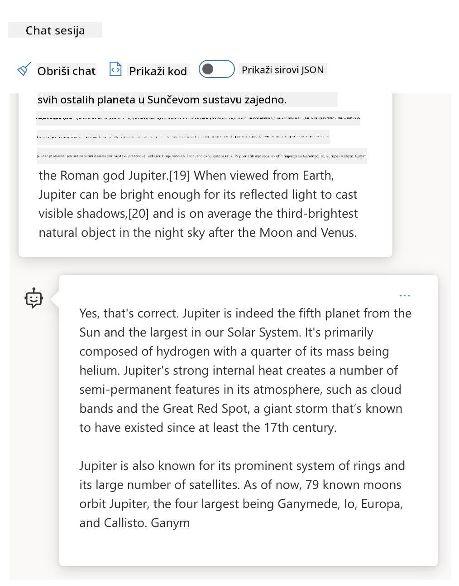
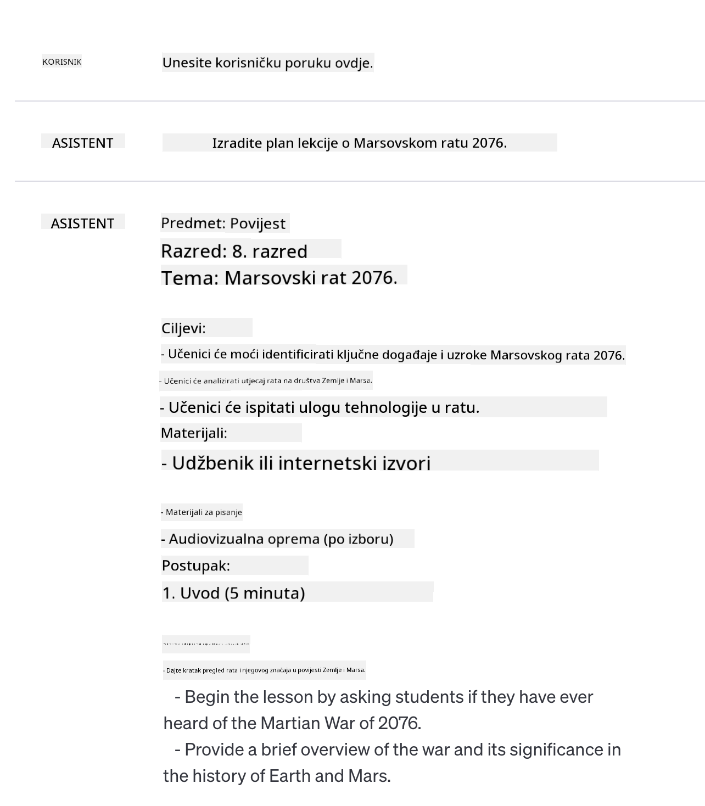
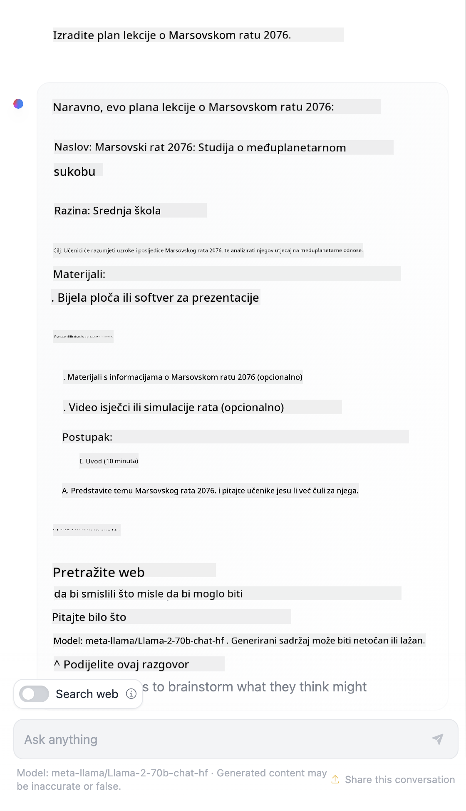

<!--
CO_OP_TRANSLATOR_METADATA:
{
  "original_hash": "a45c318dc6ebc2604f35b8b829f93af2",
  "translation_date": "2025-07-09T11:11:13+00:00",
  "source_file": "04-prompt-engineering-fundamentals/README.md",
  "language_code": "hr"
}
-->
# Osnove Prompt Inženjeringa

[](https://aka.ms/gen-ai-lesson4-gh?WT.mc_id=academic-105485-koreyst)

## Uvod  
Ovaj modul pokriva ključne pojmove i tehnike za kreiranje učinkovitih promptova u generativnim AI modelima. Način na koji napišete svoj prompt za LLM također je važan. Pažljivo osmišljen prompt može dovesti do bolje kvalitete odgovora. Ali što točno znače pojmovi poput _prompt_ i _prompt engineering_? I kako mogu poboljšati prompt _input_ koji šaljem LLM-u? To su pitanja na koja ćemo pokušati odgovoriti u ovom i sljedećem poglavlju.

_Generativna AI_ je sposobna stvarati novi sadržaj (npr. tekst, slike, zvuk, kod itd.) kao odgovor na korisničke zahtjeve. To postiže korištenjem _velikih jezičnih modela_ poput OpenAI-jeve GPT ("Generative Pre-trained Transformer") serije, koji su trenirani za rad s prirodnim jezikom i kodom.

Korisnici sada mogu komunicirati s tim modelima koristeći poznate paradigme poput chata, bez potrebe za tehničkim znanjem ili obukom. Modeli su _prompt-based_ – korisnici šalju tekstualni unos (prompt) i dobivaju AI odgovor (completion). Zatim mogu "razgovarati s AI-jem" iterativno, u višekratnim razgovorima, usavršavajući svoj prompt dok odgovor ne zadovolji njihova očekivanja.

"Promptovi" sada postaju glavno _programsko sučelje_ za generativne AI aplikacije, govoreći modelima što da rade i utječući na kvalitetu vraćenih odgovora. "Prompt Engineering" je brzo rastuće područje koje se fokusira na _dizajn i optimizaciju_ promptova kako bi se postigli dosljedni i kvalitetni odgovori u velikom opsegu.

## Ciljevi učenja

U ovoj lekciji naučit ćemo što je Prompt Engineering, zašto je važan i kako možemo osmisliti učinkovitije promptove za određeni model i cilj aplikacije. Razumjet ćemo osnovne pojmove i najbolje prakse za prompt engineering – te upoznati interaktivno Jupyter Notebook "sandbox" okruženje gdje možemo vidjeti primjenu tih koncepata na stvarnim primjerima.

Na kraju ove lekcije moći ćemo:

1. Objasniti što je prompt engineering i zašto je važan.  
2. Opisati komponente prompta i kako se koriste.  
3. Naučiti najbolje prakse i tehnike za prompt engineering.  
4. Primijeniti naučene tehnike na stvarne primjere koristeći OpenAI endpoint.

## Ključni pojmovi

Prompt Engineering: Praksa dizajniranja i usavršavanja unosa kako bi se AI modeli usmjerili na proizvodnju željenih izlaza.  
Tokenizacija: Proces pretvaranja teksta u manje jedinice, tzv. tokene, koje model može razumjeti i obraditi.  
Instruction-Tuned LLMs: Veliki jezični modeli (LLM) koji su dodatno podešeni specifičnim uputama kako bi poboljšali točnost i relevantnost odgovora.

## Sandbox za učenje

Prompt engineering je trenutno više umjetnost nego znanost. Najbolji način da poboljšamo intuiciju za to je _više vježbati_ i usvojiti pristup pokušaja i pogrešaka koji kombinira stručnost u domeni primjene s preporučenim tehnikama i optimizacijama specifičnim za model.

Jupyter Notebook koji prati ovu lekciju pruža _sandbox_ okruženje gdje možete isprobati ono što naučite – tijekom rada ili kao dio zadatka na kraju. Za izvođenje vježbi trebat će vam:

1. **Azure OpenAI API ključ** – servisni endpoint za implementirani LLM.  
2. **Python Runtime** – u kojem se može izvršiti Notebook.  
3. **Lokalne varijable okoline** – _sada dovršite [SETUP](./../00-course-setup/SETUP.md?WT.mc_id=academic-105485-koreyst) korake da se pripremite_.

Notebook dolazi s _početnim_ vježbama – ali potičemo vas da dodate vlastite _Markdown_ (opisne) i _Code_ (zahtjevi prompta) sekcije kako biste isprobali više primjera ili ideja – i razvili intuiciju za dizajn promptova.

## Ilustrirani vodič

Želite li dobiti širu sliku o čemu se radi u ovoj lekciji prije nego što krenete? Pogledajte ovaj ilustrirani vodič koji vam daje pregled glavnih tema i ključnih zaključaka o kojima trebate razmisliti u svakoj od njih. Plan lekcije vodi vas od razumijevanja osnovnih pojmova i izazova do njihovog rješavanja relevantnim tehnikama i najboljim praksama prompt engineeringa. Imajte na umu da se odjeljak "Napredne tehnike" u ovom vodiču odnosi na sadržaj koji je obrađen u _sljedećem_ poglavlju ovog kurikuluma.


## Naš startup

Sada, razgovarajmo o tome kako se _ova tema_ odnosi na misiju našeg startupa da [donesemo AI inovacije u obrazovanje](https://educationblog.microsoft.com/2023/06/collaborating-to-bring-ai-innovation-to-education?WT.mc_id=academic-105485-koreyst). Želimo izgraditi AI-pokretane aplikacije za _personalizirano učenje_ – pa razmislimo kako bi različiti korisnici naše aplikacije mogli "dizajnirati" promptove:

- **Administratori** bi mogli tražiti od AI-ja da _analizira podatke o kurikulumu kako bi identificirao praznine u pokrivenosti_. AI može sažeti rezultate ili ih vizualizirati pomoću koda.  
- **Nastavnici** bi mogli tražiti od AI-ja da _generira plan lekcije za ciljanu publiku i temu_. AI može izraditi personalizirani plan u zadanom formatu.  
- **Učenici** bi mogli tražiti od AI-ja da ih _podučava u teškoj temi_. AI sada može voditi učenike kroz lekcije, savjete i primjere prilagođene njihovoj razini.

To je samo vrh sante leda. Pogledajte [Prompts For Education](https://github.com/microsoft/prompts-for-edu/tree/main?WT.mc_id=academic-105485-koreyst) – open-source biblioteku promptova koju su sastavili stručnjaci za obrazovanje – da dobijete širi uvid u mogućnosti! _Isprobajte neke od tih promptova u sandboxu ili koristeći OpenAI Playground da vidite što se događa!_

<!--  
LESSON TEMPLATE:  
This unit should cover core concept #1.  
Reinforce the concept with examples and references.

CONCEPT #1:  
Prompt Engineering.  
Define it and explain why it is needed.  
-->

## Što je Prompt Engineering?

Lekciju smo započeli definiranjem **Prompt Engineeringa** kao procesa _dizajniranja i optimizacije_ tekstualnih unosa (promptova) kako bi se postigli dosljedni i kvalitetni odgovori (completioni) za određeni cilj aplikacije i model. To možemo promatrati kao dvofazni proces:

- _dizajniranje_ početnog prompta za određeni model i cilj  
- _usavršavanje_ prompta iterativno kako bi se poboljšala kvaliteta odgovora

To je nužno proces pokušaja i pogrešaka koji zahtijeva korisničku intuiciju i trud za postizanje optimalnih rezultata. Zašto je to važno? Da bismo odgovorili na to pitanje, prvo moramo razumjeti tri pojma:

- _Tokenizacija_ = kako model "vidi" prompt  
- _Osnovni LLM-ovi_ = kako temeljni model "obrađuje" prompt  
- _Instruction-Tuned LLM-ovi_ = kako model sada može "vidjeti zadatke"

### Tokenizacija

LLM vidi promptove kao _niz tokena_ gdje različiti modeli (ili verzije modela) mogu tokenizirati isti prompt na različite načine. Budući da su LLM-ovi trenirani na tokenima (a ne na sirovom tekstu), način na koji se prompt tokenizira ima izravan utjecaj na kvalitetu generiranog odgovora.

Da biste stekli intuiciju o tome kako tokenizacija funkcionira, isprobajte alate poput [OpenAI Tokenizer](https://platform.openai.com/tokenizer?WT.mc_id=academic-105485-koreyst) prikazanog dolje. Zalijepite svoj prompt i pogledajte kako se pretvara u tokene, obraćajući pažnju na to kako se tretiraju razmaci i interpunkcijski znakovi. Imajte na umu da ovaj primjer prikazuje stariji LLM (GPT-3) – pa isprobavanje s novijim modelom može dati drugačiji rezultat.


### Pojam: Temeljni modeli

Nakon što je prompt tokeniziran, primarna funkcija ["Base LLM"](https://blog.gopenai.com/an-introduction-to-base-and-instruction-tuned-large-language-models-8de102c785a6?WT.mc_id=academic-105485-koreyst) (ili temeljni model) je predvidjeti sljedeći token u nizu. Budući da su LLM-ovi trenirani na ogromnim skupovima tekstualnih podataka, imaju dobar osjećaj za statističke odnose između tokena i mogu tu predikciju napraviti s određenom sigurnošću. Imajte na umu da oni ne razumiju _značenje_ riječi u promptu ili tokenu; oni samo vide obrazac koji mogu "dovršiti" svojom sljedećom predikcijom. Mogu nastaviti predviđati niz dok ih korisnik ne zaustavi ili dok se ne ispuni neki unaprijed postavljeni uvjet.

Želite li vidjeti kako radi dovršavanje na temelju prompta? Unesite gornji prompt u Azure OpenAI Studio [_Chat Playground_](https://oai.azure.com/playground?WT.mc_id=academic-105485-koreyst) s zadanim postavkama. Sustav je konfiguriran da tretira promptove kao zahtjeve za informacijama – pa biste trebali vidjeti dovršetak koji zadovoljava taj kontekst.

Ali što ako korisnik želi vidjeti nešto specifično što zadovoljava određene kriterije ili cilj zadatka? Tu na scenu stupaju _instruction-tuned_ LLM-ovi.



### Pojam: Instruction Tuned LLMs

[Instruction Tuned LLM](https://blog.gopenai.com/an-introduction-to-base-and-instruction-tuned-large-language-models-8de102c785a6?WT.mc_id=academic-105485-koreyst) počinje s temeljnim modelom i dodatno ga podešava s primjerima ili parovima ulaz/izlaz (npr. višekratnim "porukama") koje mogu sadržavati jasne upute – a odgovor AI-ja pokušava slijediti te upute.

Ovo koristi tehnike poput Reinforcement Learning with Human Feedback (RLHF) koje mogu trenirati model da _slijedi upute_ i _uči iz povratnih informacija_ kako bi proizvodio odgovore bolje prilagođene praktičnim primjenama i relevantnije za korisničke ciljeve.

Isprobajmo to – vratite se na gornji prompt, ali sada promijenite _system message_ da kao kontekst pružite sljedeću uputu:

> _Sažmi sadržaj koji ti je dan za učenika drugog razreda. Ograniči rezultat na jedan odlomak s 3-5 nabrajanja._

Vidite kako je rezultat sada prilagođen željenom cilju i formatu? Nastavnik može odmah koristiti ovaj odgovor u svojim prezentacijama za taj razred.


## Zašto nam treba Prompt Engineering?

Sada kada znamo kako LLM-ovi obrađuju promptove, razgovarajmo o _zašto_ nam treba prompt engineering. Odgovor leži u činjenici da trenutni LLM-ovi imaju niz izazova koji otežavaju postizanje _pouzdanih i dosljednih dovršetaka_ bez uloženog truda u konstrukciju i optimizaciju prompta. Na primjer:

1. **Odgovori modela su stohastički.** _Isti prompt_ vjerojatno će dati različite odgovore s različitim modelima ili verzijama modela. Čak može dati različite rezultate s _istim modelom_ u različito vrijeme. _Tehnike prompt engineeringa mogu nam pomoći smanjiti te varijacije pružajući bolje smjernice_.

1. **Modeli mogu izmišljati odgovore.** Modeli su prethodno trenirani na _velikim, ali ograničenim_ skupovima podataka, što znači da nemaju znanje o pojmovima izvan tog opsega treninga. Kao rezultat, mogu proizvesti dovršetke koji su netočni, izmišljeni ili izravno proturječni poznatim činjenicama. _Tehnike prompt engineeringa pomažu korisnicima identificirati i ublažiti takve izmišljotine, npr. traženjem citata ili obrazloženja od AI-ja_.

1. **Sposobnosti modela variraju.** Noviji modeli ili generacije modela imaju bogatije mogućnosti, ali donose i jedinstvene specifičnosti te kompromis u troškovima i složenosti. _Prompt engineering može pomoći u razvoju najboljih praksi i radnih tokova koji apstrahiraju razlike i prilagođavaju se zahtjevima specifičnim za model na skalabilan i neprimjetan način_.

Pogledajmo to u praksi u OpenAI ili Azure OpenAI Playgroundu:

- Koristite isti prompt s različitim LLM implementacijama (npr. OpenAI, Azure OpenAI, Hugging Face) – jeste li primijetili varijacije?  
- Koristite isti prompt više puta s _istom_ LLM implementacijom (npr. Azure OpenAI playground) – kako su se te varijacije razlikovale?

### Primjer izmišljotina

U ovom tečaju koristimo pojam **"izmišljotina"** za označavanje fenomena kada LLM-ovi ponekad generiraju faktualno netočne informacije zbog ograničenja u njihovom treningu ili drugim čimbenicima. Možda ste ovaj fenomen čuli i pod nazivom _"halucinacije"_ u popularnim člancima ili znanstvenim radovima. Međutim, snažno preporučujemo korištenje termina _"izmišljotina"_ kako bismo izbjegli antropomorfiziranje ponašanja pripisujući mu ljudsku osobinu, a time i pojačali [smjernice za odgovornu AI](https://www.microsoft.com/ai/responsible-ai?WT.mc_id=academic-105485-koreyst) s terminološkog aspekta, uklanjajući izraze koji bi u nekim kontekstima mogli biti uvredljivi ili neinkluzivni.

Želite li steći osjećaj kako izmišljotine funkcioniraju? Zamislite prompt koji AI-u nalaže da generira sadržaj za nepostojeću temu (kako biste bili sigurni da se ne nalazi u skupu podataka za trening). Na primjer – isprobao sam ovaj prompt:
# Plan lekcije: Marsovski rat 2076.

## Ciljevi lekcije
- Razumjeti uzroke i posljedice Marsovskog rata 2076.
- Analizirati ključne događaje i sudionike sukoba.
- Razviti kritičko razmišljanje o posljedicama rata na međuzvjezdanu politiku.

## Uvod (10 minuta)
- Kratki pregled povijesti ljudske kolonizacije Marsa.
- Postavljanje pitanja: Što je dovelo do sukoba 2076. godine?

## Glavni dio (30 minuta)
### 1. Uzroci rata
- Resursni sukobi između Zemljinih kolonija i Marsovih naseljenika.
- Političke tenzije i neuspjeli pregovori.

### 2. Ključni događaji
- Početak sukoba i prva bitka kod Valles Marineris.
- Uloga tehnologije i inovacija u ratovanju.
- Važne bitke i prekretnice tijekom rata.

### 3. Sudionici
- Glavni vođe i njihove strategije.
- Uloga međunarodnih saveza i privatnih korporacija.

## Zaključak (10 minuta)
- Posljedice rata za Mars i Zemlju.
- Utjecaj na buduće međuzvjezdane odnose.
- Diskusija: Mogu li se slični sukobi izbjeći u budućnosti?

## Domaća zadaća
- Istražiti i napisati kratak esej o jednoj od ključnih bitaka Marsovskog rata 2076.  
- Pripremiti prezentaciju o ulozi tehnologije u ovom sukobu.
Pretraživanje na webu pokazalo je da postoje izmišljeni prikazi (npr. televizijske serije ili knjige) o ratovima na Marsu – ali nijedan u 2076. Zdrav razum također nam govori da je 2076. _u budućnosti_ i stoga se ne može povezati s stvarnim događajem.

Pa što se događa kada pokrenemo ovaj upit s različitim pružateljima LLM-a?

> **Odgovor 1**: OpenAI Playground (GPT-35)



> **Odgovor 2**: Azure OpenAI Playground (GPT-35)


> **Odgovor 3**: : Hugging Face Chat Playground (LLama-2)



Kao što se i očekivalo, svaki model (ili verzija modela) daje malo drugačije odgovore zahvaljujući stohastičkom ponašanju i razlikama u sposobnostima modela. Na primjer, jedan model cilja na publiku osmog razreda, dok drugi pretpostavlja srednjoškolca. No sva tri modela su generirala odgovore koji bi mogli uvjeriti neupućenog korisnika da je događaj stvaran.

Tehnike prompt inženjeringa poput _metapromptinga_ i _konfiguracije temperature_ mogu donekle smanjiti izmišljotine modela. Nove _arhitekture_ prompt inženjeringa također besprijekorno uključuju nove alate i tehnike u tijek prompta, kako bi ublažile ili smanjile neke od ovih efekata.

## Studija slučaja: GitHub Copilot

Završimo ovaj dio dobivanjem uvida u to kako se prompt inženjering koristi u stvarnim rješenjima kroz jednu studiju slučaja: [GitHub Copilot](https://github.com/features/copilot?WT.mc_id=academic-105485-koreyst).

GitHub Copilot je vaš "AI par programer" – pretvara tekstualne upite u dovršetke koda i integriran je u vaše razvojno okruženje (npr. Visual Studio Code) za besprijekorno korisničko iskustvo. Kako je dokumentirano u nizu blogova u nastavku, najranija verzija temeljila se na OpenAI Codex modelu – a inženjeri su brzo shvatili potrebu za dodatnim podešavanjem modela i razvojem boljih tehnika prompt inženjeringa kako bi poboljšali kvalitetu koda. U srpnju su [predstavili poboljšani AI model koji nadilazi Codex](https://github.blog/2023-07-28-smarter-more-efficient-coding-github-copilot-goes-beyond-codex-with-improved-ai-model/?WT.mc_id=academic-105485-koreyst) za još brže prijedloge.

Pročitajte postove redom kako biste pratili njihov put učenja.

- **Svibanj 2023** | [GitHub Copilot sve bolje razumije vaš kod](https://github.blog/2023-05-17-how-github-copilot-is-getting-better-at-understanding-your-code/?WT.mc_id=academic-105485-koreyst)
- **Svibanj 2023** | [Iznutra GitHub: Rad s LLM-ovima iza GitHub Copilota](https://github.blog/2023-05-17-inside-github-working-with-the-llms-behind-github-copilot/?WT.mc_id=academic-105485-koreyst)
- **Lipanj 2023** | [Kako pisati bolje upite za GitHub Copilot](https://github.blog/2023-06-20-how-to-write-better-prompts-for-github-copilot/?WT.mc_id=academic-105485-koreyst)
- **Srpanj 2023** | [GitHub Copilot nadilazi Codex s poboljšanim AI modelom](https://github.blog/2023-07-28-smarter-more-efficient-coding-github-copilot-goes-beyond-codex-with-improved-ai-model/?WT.mc_id=academic-105485-koreyst)
- **Srpanj 2023** | [Vodič za programere o prompt inženjeringu i LLM-ovima](https://github.blog/2023-07-17-prompt-engineering-guide-generative-ai-llms/?WT.mc_id=academic-105485-koreyst)
- **Rujan 2023** | [Kako izgraditi enterprise LLM aplikaciju: Lekcije iz GitHub Copilota](https://github.blog/2023-09-06-how-to-build-an-enterprise-llm-application-lessons-from-github-copilot/?WT.mc_id=academic-105485-koreyst)

Također možete pregledati njihov [inženjerski blog](https://github.blog/category/engineering/?WT.mc_id=academic-105485-koreyst) za više postova poput [ovog](https://github.blog/2023-09-27-how-i-used-github-copilot-chat-to-build-a-reactjs-gallery-prototype/?WT.mc_id=academic-105485-koreyst) koji prikazuje kako se ovi modeli i tehnike _primjenjuju_ za pokretanje stvarnih aplikacija.

---

<!--
LESSON TEMPLATE:
Ova jedinica treba pokriti osnovni koncept #2.
Potkrijepiti koncept primjerima i referencama.

KONCEPT #2:
Dizajn prompta.
Ilustrirano primjerima.
-->

## Konstrukcija prompta

Vidjeli smo zašto je prompt inženjering važan – sada razumimo kako se promptovi _konstruiraju_ kako bismo mogli procijeniti različite tehnike za učinkovitiji dizajn prompta.

### Osnovni prompt

Počnimo s osnovnim promptom: tekstualnim unosom poslanim modelu bez dodatnog konteksta. Evo primjera – kada pošaljemo prve riječi američke nacionalne himne OpenAI [Completion API-ju](https://platform.openai.com/docs/api-reference/completions?WT.mc_id=academic-105485-koreyst), on odmah _dovršava_ odgovor s nekoliko sljedećih redaka, ilustrirajući osnovno ponašanje predviđanja.

| Prompt (Unos)       | Dovršetak (Izlaz)                                                                                                                        |
| :------------------ | :---------------------------------------------------------------------------------------------------------------------------------------- |
| Oh say can you see  | Izgleda da započinjete stihove "The Star-Spangled Banner," nacionalne himne Sjedinjenih Država. Cijeli tekst glasi ...                   |

### Složeni prompt

Sada dodajmo kontekst i upute tom osnovnom promptu. [Chat Completion API](https://learn.microsoft.com/azure/ai-services/openai/how-to/chatgpt?WT.mc_id=academic-105485-koreyst) omogućuje nam konstrukciju složenog prompta kao zbirke _poruka_ s:

- parovima unosa/izlaza koji odražavaju unos _korisnika_ i odgovor _asistenta_
- sistemskom porukom koja postavlja kontekst za ponašanje ili osobnost asistenta

Zahtjev je sada u obliku ispod, gdje _tokenizacija_ učinkovito hvata relevantne informacije iz konteksta i razgovora. Promjena sistemskog konteksta može biti jednako utjecajna na kvalitetu dovršetaka kao i uneseni korisnički podaci.

```python
response = openai.chat.completions.create(
    model="gpt-3.5-turbo",
    messages=[
        {"role": "system", "content": "You are a helpful assistant."},
        {"role": "user", "content": "Who won the world series in 2020?"},
        {"role": "assistant", "content": "The Los Angeles Dodgers won the World Series in 2020."},
        {"role": "user", "content": "Where was it played?"}
    ]
)
```

### Instrukcijski prompt

U gore navedenim primjerima, korisnički prompt bio je jednostavan tekstualni upit koji se može protumačiti kao zahtjev za informacijama. S _instrukcijskim_ promptima možemo koristiti taj tekst za detaljnije specificiranje zadatka, pružajući bolju uputu AI-u. Evo primjera:

| Prompt (Unos)                                                                                                                                                                                                                         | Dovršetak (Izlaz)                                                                                                        | Vrsta instrukcije |
| :----------------------------------------------------------------------------------------------------------------------------------------------------------------------------------------------------------------------------------- | :------------------------------------------------------------------------------------------------------------------------ | :----------------- |
| Napiši opis Građanskog rata                                                                                                                                                                                                         | _vraća jednostavan odlomak_                                                                                              | Jednostavno        |
| Napiši opis Građanskog rata. Navedi ključne datume i događaje te opiši njihov značaj                                                                                                                                                 | _vraća odlomak praćen popisom ključnih datuma događaja s opisima_                                                        | Složeno            |
| Napiši opis Građanskog rata u jednom odlomku. Navedi 3 točke s ključnim datumima i njihovim značenjem. Navedi još 3 točke s važnim povijesnim osobama i njihovim doprinosima. Vrati rezultat u JSON formatu | _vraća detaljnije informacije u tekstualnom okviru, formatirane kao JSON koje možete kopirati i po potrebi validirati_     | Složeno. Formatirano|

## Primarni sadržaj

U gore navedenim primjerima, prompt je još uvijek bio prilično otvoren, dopuštajući LLM-u da odluči koji dio svog prethodno naučenog skupa podataka je relevantan. S dizajnerskim obrascem _primarni sadržaj_, ulazni tekst dijeli se na dva dijela:

- instrukcija (akcija)
- relevantni sadržaj (koji utječe na akciju)

Evo primjera gdje je instrukcija "sažmi ovo u 2 rečenice".

| Prompt (Unos)                                                                                                                                                                                                                                                                                                                                                                                                                                                                                                                                                                                                                                                                                      | Dovršetak (Izlaz)                                                                                                                                                                                                                                                                             |
| :-------------------------------------------------------------------------------------------------------------------------------------------------------------------------------------------------------------------------------------------------------------------------------------------------------------------------------------------------------------------------------------------------------------------------------------------------------------------------------------------------------------------------------------------------------------------------------------------------------------------------------------------------------------------------------------------------- | :---------------------------------------------------------------------------------------------------------------------------------------------------------------------------------------------------------------------------------------------------------------------------------------------- |
| Jupiter je peta planeta od Sunca i najveća u Sunčevom sustavu. To je plinski div s masom tisućinku mase Sunca, ali dva i pol puta većom od mase svih ostalih planeta u Sunčevom sustavu zajedno. Jupiter je jedan od najsjajnijih objekata vidljivih golim okom na noćnom nebu i poznat je drevnim civilizacijama još prije zapisane povijesti. Ime je dobio po rimskom bogu Jupiteru.[19] Kada se promatra sa Zemlje, Jupiter može biti dovoljno sjajan da njegova reflektirana svjetlost baca vidljive sjene,[20] i u prosjeku je treći najsjajniji prirodni objekt na noćnom nebu nakon Mjeseca i Venere. <br/> **Sažmi ovo u 2 kratke rečenice** | Jupiter, peta planeta od Sunca, najveća je u Sunčevom sustavu i poznat je kao jedan od najsjajnijih objekata na noćnom nebu. Ime je dobio po rimskom bogu Jupiteru, a to je plinski div čija je masa dva i pol puta veća od mase svih ostalih planeta u Sunčevom sustavu zajedno. |

Segment primarnog sadržaja može se koristiti na različite načine za učinkovitije upute:

- **Primjeri** – umjesto da modelu izričito kažemo što da radi, dajemo mu primjere što treba napraviti i pustimo ga da zaključi obrazac.
- **Nagovještaji** – slijedi instrukciju s "nagovještajem" koji priprema dovršetak, usmjeravajući model prema relevantnijim odgovorima.
- **Predlošci** – to su ponovljivi 'recepti' za promptove s rezerviranim mjestima (varijablama) koje se mogu prilagoditi podacima za specifične slučajeve.

Pogledajmo kako to izgleda u praksi.

### Korištenje primjera

Ovo je pristup gdje koristite primarni sadržaj da "hranite model" s nekoliko primjera željenog izlaza za određenu instrukciju i pustite ga da zaključi obrazac željenog izlaza. Na temelju broja danih primjera, možemo imati zero-shot prompting, one-shot prompting, few-shot prompting itd.

Prompt sada sadrži tri komponente:

- opis zadatka
- nekoliko primjera željenog izlaza
- početak novog primjera (koji postaje implicitni opis zadatka)

| Tip učenja   | Prompt (Unos)                                                                                                                                        | Dovršetak (Izlaz)         |
| :----------- | :-------------------------------------------------------------------------------------------------------------------------------------------------- | :------------------------- |
| Zero-shot    | "The Sun is Shining". Prevedi na španjolski                                                                                                        | "El Sol está brillando".   |
| One-shot     | "The Sun is Shining" => "El Sol está brillando". <br> "It's a Cold and Windy Day" =>                                                               | "Es un día frío y ventoso".|
| Few-shot     | Igrač je trčao po bazama => Baseball <br/> Igrač je osvojio as => Tenis <br/> Igrač je postigao šesticu => Kriket <br/> Igrač je napravio slam-dunk => | Košarka                   |
|              |                                                                                                                                                     |                           |

Primijetite kako smo u zero-shot prompting morali dati izričitu uputu ("Prevedi na španjolski"), dok se u one-shot primjeru to zaključuje. Few-shot primjer pokazuje kako dodavanje više primjera omogućuje modelima preciznije zaključke bez dodatnih uputa.

### Nagovještaji prompta

Druga tehnika korištenja primarnog sadržaja je pružanje _nagovještaja_ umjesto primjera. U ovom slučaju, dajemo modelu poticaj u pravom smjeru tako što _započinjemo_ s isječkom koji odražava željeni format odgovora. Model tada "uzima nagovještaj" i nastavlja u tom stilu.

| Broj nagovještaja | Prompt (Unos)                                                                                                                                                                                                                                                                                                                                                                                                                                               | Dovršetak (Izlaz)                                                                                                                                                                                                                                                                                       |
| :----------------- | :----------------------------------------------------------------------------------------------------------------------------------------------------------------------------------------------------------------------------------------------------------------------------------------------------------------------------------------------------------------------------------------------------------------------------------------------------------- | :-------------------------------------------------------------------------------------------------------------------------------------------------------------------------------------------------------------------------------------------------------------------------------------------------------- |
| 0                  | Jupiter je peta planeta od Sunca i najveća u Sunčevom sustavu. To je plinski div s masom tisućinku mase Sunca, ali dva i pol puta većom od mase svih ostalih planeta u Sunčevom sustavu zajedno. Jupiter je jedan od najsjajnijih objekata vidljivih golim okom na noćnom nebu, i poznat je drevnim civilizacijama još prije zapisane povijesti.

**Summarize This**                                       | Jupiter je najveći planet u našem Sunčevom sustavu i peti po redu od Sunca. To je plinski div s masom koja je 1/1000 mase Sunca, ali je teži od svih ostalih planeta zajedno. Drevne civilizacije su dugo poznavale Jupiter, a lako je vidljiv na noćnom nebu. |
| 1              | Jupiter je peti planet od Sunca i najveći u Sunčevom sustavu. To je plinski div s masom koja je tisućinka mase Sunca, ali dva i pol puta veća od mase svih ostalih planeta u Sunčevom sustavu zajedno. Jupiter je jedan od najsjajnijih objekata vidljivih golim okom na noćnom nebu i poznat je drevnim civilizacijama još prije zapisane povijesti. <br/>**Summarize This** <br/> Ono što smo naučili jest da je Jupiter | peti planet od Sunca i najveći u Sunčevom sustavu. To je plinski div s masom koja je tisućinka mase Sunca, ali dva i pol puta veća od mase svih ostalih planeta zajedno. Lako je vidljiv golim okom i poznat je od davnina.                        |
| 2              | Jupiter je peti planet od Sunca i najveći u Sunčevom sustavu. To je plinski div s masom koja je tisućinka mase Sunca, ali dva i pol puta veća od mase svih ostalih planeta u Sunčevom sustavu zajedno. Jupiter je jedan od najsjajnijih objekata vidljivih golim okom na noćnom nebu i poznat je drevnim civilizacijama još prije zapisane povijesti. <br/>**Summarize This** <br/> Tri najvažnije činjenice koje smo naučili:         | 1. Jupiter je peti planet od Sunca i najveći u Sunčevom sustavu. <br/> 2. To je plinski div s masom koja je tisućinka mase Sunca...<br/> 3. Jupiter je vidljiv golim okom još od davnina ...                                                                       |
|                |                                                                                                                                                                                                                                                                                                                                                                                                                                                              |                                                                                                                                                                                                                                                                                                           |

### Predlošci za promptove

Predložak prompta je _unaprijed definirani recept za prompt_ koji se može spremiti i ponovno koristiti prema potrebi, kako bi se osigurala dosljednija korisnička iskustva u većem opsegu. U svojoj najjednostavnijoj formi, to je zbirka primjera promptova poput [ovog od OpenAI](https://platform.openai.com/examples?WT.mc_id=academic-105485-koreyst) koji sadrži i interaktivne komponente prompta (poruke korisnika i sustava) i format zahtjeva vođenog API-jem – za podršku ponovnoj upotrebi.

U složenijem obliku, poput [primjera iz LangChain](https://python.langchain.com/docs/concepts/prompt_templates/?WT.mc_id=academic-105485-koreyst), sadrži _mjesta za zamjenu_ koja se mogu popuniti podacima iz različitih izvora (korisnički unos, kontekst sustava, vanjski izvori podataka itd.) kako bi se prompt dinamički generirao. To nam omogućuje stvaranje biblioteke ponovljivih promptova koji se mogu koristiti za programsku dosljednost korisničkih iskustava u velikom opsegu.

Prava vrijednost predložaka leži u mogućnosti stvaranja i objavljivanja _biblioteka promptova_ za vertikalne aplikacijske domene – gdje je predložak prompta sada _optimiziran_ da odražava kontekst ili primjere specifične za aplikaciju, čineći odgovore relevantnijima i preciznijima za ciljanu korisničku publiku. Spremište [Prompts For Edu](https://github.com/microsoft/prompts-for-edu?WT.mc_id=academic-105485-koreyst) izvrstan je primjer ovog pristupa, sakupljajući biblioteku promptova za obrazovni sektor s naglaskom na ključne ciljeve poput planiranja lekcija, dizajna kurikuluma, poduke učenika itd.

## Pomoćni sadržaj

Ako promatramo konstrukciju prompta kao kombinaciju uputa (zadatka) i cilja (primarnog sadržaja), tada je _sekundarni sadržaj_ dodatni kontekst koji pružamo da **na neki način utječemo na rezultat**. To mogu biti parametri podešavanja, upute za formatiranje, taksonomije tema itd. koje pomažu modelu da _prilagodi_ svoj odgovor kako bi odgovarao željenim korisničkim ciljevima ili očekivanjima.

Na primjer: Imamo katalog tečajeva s opsežnim metapodacima (naziv, opis, razina, oznake metapodataka, instruktor itd.) za sve dostupne tečajeve u kurikulumu:

- možemo definirati uputu da "sažmemo katalog tečajeva za jesen 2023."
- možemo koristiti primarni sadržaj da pružimo nekoliko primjera željenog izlaza
- možemo koristiti sekundarni sadržaj da identificiramo top 5 "oznake" od interesa.

Sada model može dati sažetak u formatu prikazanom u nekoliko primjera – ali ako rezultat ima više oznaka, može dati prioritet 5 oznaka identificiranih u sekundarnom sadržaju.

---

<!--
PREDLOŽAK LEKCIJE:
Ova jedinica treba pokriti osnovni koncept #1.
Potkrijepiti koncept primjerima i referencama.

KONCEPT #3:
Tehnike prompt inženjeringa.
Koje su osnovne tehnike za prompt inženjering?
Ilustrirati ih s nekoliko vježbi.
-->

## Najbolje prakse za promptove

Sada kada znamo kako se promptovi mogu _konstruirati_, možemo početi razmišljati o tome kako ih _dizajnirati_ da odražavaju najbolje prakse. To možemo promatrati u dva dijela – imati pravi _stav_ i primijeniti prave _tehnike_.

### Stav u prompt inženjeringu

Prompt inženjering je proces pokušaja i pogreške, stoga imajte na umu tri široka smjernice:

1. **Razumijevanje domene je važno.** Točnost i relevantnost odgovora ovisi o _domeni_ u kojoj aplikacija ili korisnik djeluje. Primijenite svoju intuiciju i stručnost u domeni da dodatno **prilagodite tehnike**. Na primjer, definirajte _osobnosti specifične za domenu_ u promptovima sustava ili koristite _predloške specifične za domenu_ u korisničkim promptovima. Pružite sekundarni sadržaj koji odražava kontekst specifičan za domenu ili koristite _znakove i primjere specifične za domenu_ da usmjerite model prema poznatim obrascima korištenja.

2. **Razumijevanje modela je važno.** Znamo da su modeli po prirodi stohastični. No implementacije modela mogu se razlikovati u pogledu skupa podataka za treniranje (predznanje), mogućnosti koje pružaju (npr. putem API-ja ili SDK-a) i vrste sadržaja za koji su optimizirani (npr. kod, slike, tekst). Razumite snage i ograničenja modela koji koristite i iskoristite to znanje da _prioritizirate zadatke_ ili izgradite _prilagođene predloške_ optimizirane za mogućnosti modela.

3. **Iteracija i validacija su važni.** Modeli se brzo razvijaju, kao i tehnike prompt inženjeringa. Kao stručnjak za domenu, možda imate dodatni kontekst ili kriterije za _vašu_ specifičnu aplikaciju, koji se ne primjenjuju na širu zajednicu. Koristite alate i tehnike prompt inženjeringa za "brzi početak" konstrukcije prompta, zatim iterirajte i validirajte rezultate koristeći vlastitu intuiciju i stručnost. Zabilježite svoja saznanja i stvorite **bazu znanja** (npr. biblioteke promptova) koja drugi mogu koristiti kao novu polaznu točku za brže iteracije u budućnosti.

## Najbolje prakse

Pogledajmo sada uobičajene najbolje prakse koje preporučuju [OpenAI](https://help.openai.com/en/articles/6654000-best-practices-for-prompt-engineering-with-openai-api?WT.mc_id=academic-105485-koreyst) i [Azure OpenAI](https://learn.microsoft.com/azure/ai-services/openai/concepts/prompt-engineering#best-practices?WT.mc_id=academic-105485-koreyst) stručnjaci.

| Što                              | Zašto                                                                                                                                                                                                                                               |
| :-------------------------------- | :------------------------------------------------------------------------------------------------------------------------------------------------------------------------------------------------------------------------------------------------ |
| Procijenite najnovije modele.       | Nove generacije modela vjerojatno imaju poboljšane značajke i kvalitetu – ali mogu imati i veće troškove. Procijenite njihov utjecaj, pa donesite odluke o migraciji.                                                                                |
| Razdvojite upute i kontekst   | Provjerite definira li vaš model/ponuditelj _razdjelnike_ za jasnije razlikovanje uputa, primarnog i sekundarnog sadržaja. To može pomoći modelima da preciznije dodijele težine tokenima.                                                         |
| Budite specifični i jasni             | Dajte više detalja o željenom kontekstu, ishodu, duljini, formatu, stilu itd. To će poboljšati i kvalitetu i dosljednost odgovora. Zabilježite recepte u ponovljivoj formi predložaka.                                                          |
| Budite opisni, koristite primjere      | Modeli bolje reagiraju na pristup "pokaži i reci". Počnite s `zero-shot` pristupom gdje dajete samo uputu (bez primjera), zatim pokušajte `few-shot` kao doradu, dajući nekoliko primjera željenog izlaza. Koristite analogije. |
| Koristite znakove za poticanje dovršetaka | Usmjerite model prema željenom rezultatu dajući mu početne riječi ili fraze koje može koristiti kao polaznu točku za odgovor.                                                                                                               |
| Ponavljajte po potrebi                       | Ponekad je potrebno ponoviti upute modelu. Dajte upute prije i poslije primarnog sadržaja, koristite uputu i znak, itd. Iterirajte i validirajte da vidite što najbolje funkcionira.                                                         |
| Redoslijed je važan                     | Redoslijed u kojem predstavljate informacije modelu može utjecati na rezultat, čak i u primjerima za učenje, zbog pristranosti prema novijem sadržaju. Isprobajte različite opcije da vidite što najbolje radi.                                                               |
| Dajte modelu "izlaz"           | Dajte modelu _rezervni_ odgovor koji može dati ako iz bilo kojeg razloga ne može dovršiti zadatak. To može smanjiti šanse da model generira netočne ili izmišljene odgovore.                                                         |
|                                   |                                                                                                                                                                                                                                                   |

Kao i kod svake najbolje prakse, imajte na umu da _rezultati mogu varirati_ ovisno o modelu, zadatku i domeni. Koristite ih kao polaznu točku i iterirajte dok ne pronađete što vam najbolje odgovara. Stalno preispitujte svoj proces prompt inženjeringa kako novi modeli i alati postaju dostupni, s fokusom na skalabilnost procesa i kvalitetu odgovora.

<!--
PREDLOŽAK LEKCIJE:
Ova jedinica treba pružiti izazov s kodom ako je primjenjivo

IZAZOV:
Poveznica na Jupyter Notebook s uputama samo u komentarima (kod je prazan).

RIJEŠENJE:
Poveznica na kopiju tog Notebooka s ispunjenim promptovima i pokrenutim primjerom.
-->

## Zadatak

Čestitamo! Stigli ste do kraja lekcije! Vrijeme je da neke od tih koncepata i tehnika isprobate na stvarnim primjerima!

Za naš zadatak koristit ćemo Jupyter Notebook s vježbama koje možete rješavati interaktivno. Također možete proširiti Notebook vlastitim Markdown i Code ćelijama kako biste samostalno istraživali ideje i tehnike.

### Za početak, forkajte repozitorij, zatim

- (Preporučeno) Pokrenite GitHub Codespaces
- (Alternativno) Klonirajte repozitorij na lokalni uređaj i koristite ga s Docker Desktopom
- (Alternativno) Otvorite Notebook u željenom okruženju za rad s Notebookom.

### Zatim konfigurirajte varijable okoline

- Kopirajte datoteku `.env.copy` iz korijena repozitorija u `.env` i ispunite vrijednosti `AZURE_OPENAI_API_KEY`, `AZURE_OPENAI_ENDPOINT` i `AZURE_OPENAI_DEPLOYMENT`. Vratite se na [Learning Sandbox odjeljak](../../../04-prompt-engineering-fundamentals/04-prompt-engineering-fundamentals) za upute.

### Zatim otvorite Jupyter Notebook

- Odaberite runtime kernel. Ako koristite opcije 1 ili 2, jednostavno odaberite zadani Python 3.10.x kernel koji pruža razvojno okruženje.

Spremni ste za izvođenje vježbi. Imajte na umu da ovdje nema _točnih i netočnih_ odgovora – samo istraživanje opcija metodom pokušaja i pogreške i razvijanje intuicije što najbolje funkcionira za određeni model i domenu primjene.

_Za ovaj razlog nema segmenata s rješenjima koda u ovoj lekciji. Umjesto toga, Notebook će imati Markdown ćelije pod nazivom "My Solution:" koje prikazuju jedan primjer izlaza za referencu._

 <!--
PREDLOŽAK LEKCIJE:
Završite odjeljak sažetkom i resursima za samostalno učenje.
-->

## Provjera znanja

Koji od sljedećih promptova je dobar i slijedi razumne najbolje prakse?

1. Prikaži mi sliku crvenog automobila  
2. Prikaži mi sliku crvenog automobila marke Volvo i modela XC90 parkiranog kraj litice s zalaskom sunca  
3. Prikaži mi sliku crvenog automobila marke Volvo i modela XC90

Odgovor: 2, jer je to najbolji prompt koji daje detalje o "što" i ulazi u specifičnosti (ne bilo koji auto, nego određena marka i model) te opisuje i cjelokupni ambijent. 3 je sljedeći najbolji jer također sadrži mnogo opisa.

## 🚀 Izazov

Pokušajte iskoristiti tehniku "znaka" s promptom: Dovrši rečenicu "Prikaži mi sliku crvenog automobila marke Volvo i ". Kako model odgovara i kako biste to poboljšali?

## Odličan posao! Nastavite s učenjem

Želite li saznati više o različitim konceptima prompt inženjeringa? Posjetite [stranicu za daljnje učenje](https://aka.ms/genai-collection?WT.mc_id=academic-105485-koreyst) gdje ćete pronaći druge izvrsne resurse na ovu temu.

Krenite na Lekciju 5 gdje ćemo pogledati [napredne tehnike promptiranja](../05-advanced-prompts/README.md?WT.mc_id=academic-105485-koreyst)!

**Odricanje od odgovornosti**:  
Ovaj dokument je preveden korištenjem AI usluge za prevođenje [Co-op Translator](https://github.com/Azure/co-op-translator). Iako nastojimo postići točnost, imajte na umu da automatski prijevodi mogu sadržavati pogreške ili netočnosti. Izvorni dokument na izvornom jeziku treba smatrati autoritativnim izvorom. Za kritične informacije preporučuje se profesionalni ljudski prijevod. Ne snosimo odgovornost za bilo kakve nesporazume ili pogrešna tumačenja koja proizlaze iz korištenja ovog prijevoda.