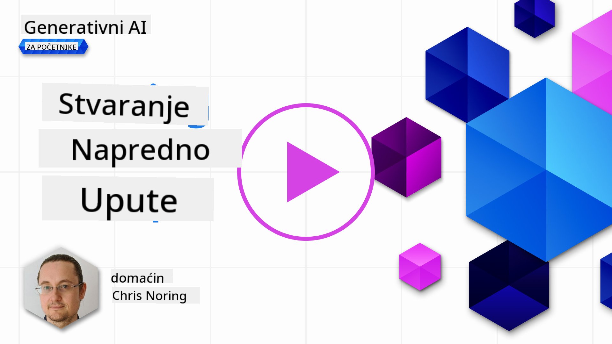

<!--
CO_OP_TRANSLATOR_METADATA:
{
  "original_hash": "b2651fb16bcfbc62b8e518751ed90fdb",
  "translation_date": "2025-10-18T01:28:15+00:00",
  "source_file": "05-advanced-prompts/README.md",
  "language_code": "hr"
}
-->
# Izrada naprednih upita

[](https://youtu.be/BAjzkaCdRok?si=NmUIyRf7-cDgbjtt)

Prisjetimo se nekih lekcija iz prethodnog poglavlja:

> _Inženjering upita_ je proces kojim **usmjeravamo model prema relevantnijim odgovorima** pružanjem korisnijih uputa ili konteksta.

Postoje dva koraka u pisanju upita: konstruiranje upita, pružanjem relevantnog konteksta, i _optimizacija_, odnosno postupno poboljšavanje upita.

Do sada imamo osnovno razumijevanje kako pisati upite, ali trebamo ići dublje. U ovom poglavlju, prijeći ćete od isprobavanja različitih upita do razumijevanja zašto je jedan upit bolji od drugog. Naučit ćete kako konstruirati upite slijedeći osnovne tehnike koje se mogu primijeniti na bilo koji LLM.

## Uvod

U ovom poglavlju obradit ćemo sljedeće teme:

- Proširite svoje znanje o inženjeringu upita primjenom različitih tehnika na svoje upite.
- Konfiguriranje vaših upita za variranje izlaznih rezultata.

## Ciljevi učenja

Nakon završetka ove lekcije, moći ćete:

- Primijeniti tehnike inženjeringa upita koje poboljšavaju rezultate vaših upita.
- Izvoditi upite koji su ili raznoliki ili deterministički.

## Inženjering upita

Inženjering upita je proces stvaranja upita koji će proizvesti željeni rezultat. Inženjering upita nije samo pisanje tekstualnog upita. To nije inženjerska disciplina, već skup tehnika koje možete primijeniti kako biste dobili željeni rezultat.

### Primjer upita

Uzmimo osnovni upit poput ovog:

> Generiraj 10 pitanja o geografiji.

U ovom upitu zapravo primjenjujete niz različitih tehnika upita.

Razložimo ga.

- **Kontekst**, navodite da bi trebao biti o "geografiji".
- **Ograničavanje izlaza**, želite najviše 10 pitanja.

### Ograničenja jednostavnih upita

Možda nećete dobiti željeni rezultat. Dobit ćete generirana pitanja, ali geografija je široka tema i možda nećete dobiti ono što želite iz sljedećih razloga:

- **Široka tema**, ne znate hoće li biti o zemljama, glavnim gradovima, rijekama i slično.
- **Format**, što ako želite da pitanja budu formatirana na određeni način?

Kao što vidite, postoji mnogo toga što treba uzeti u obzir prilikom stvaranja upita.

Do sada smo vidjeli jednostavan primjer upita, ali generativna umjetna inteligencija može mnogo više pomoći ljudima u raznim ulogama i industrijama. Istražimo sljedeće osnovne tehnike.

### Tehnike za izradu upita

Prvo, moramo razumjeti da je izrada upita _emergentno_ svojstvo LLM-a, što znači da to nije značajka ugrađena u model, već nešto što otkrivamo dok koristimo model.

Postoje neke osnovne tehnike koje možemo koristiti za izradu upita za LLM. Istražimo ih.

- **Zero-shot upiti**, ovo je najosnovniji oblik upita. To je jedan upit koji traži odgovor od LLM-a isključivo na temelju njegovih podataka za obuku.
- **Few-shot upiti**, ovaj tip upita vodi LLM pružanjem jednog ili više primjera na koje se može osloniti pri generiranju odgovora.
- **Chain-of-thought**, ovaj tip upita govori LLM-u kako razložiti problem na korake.
- **Generirano znanje**, za poboljšanje odgovora upita, možete dodatno pružiti generirane činjenice ili znanje uz vaš upit.
- **Od najmanjeg do najvećeg**, slično kao chain-of-thought, ova tehnika se odnosi na razlaganje problema na niz koraka i zatim traženje da se ti koraci izvedu redom.
- **Samostalno poboljšanje**, ova tehnika se odnosi na kritiziranje izlaza LLM-a i zatim traženje poboljšanja.
- **Maieutički upiti**, ovdje želite osigurati da je odgovor LLM-a točan i tražite ga da objasni različite dijelove odgovora. Ovo je oblik samostalnog poboljšanja.

### Zero-shot upiti

Ovaj stil upita je vrlo jednostavan, sastoji se od jednog upita. Ova tehnika je vjerojatno ono što koristite dok počinjete učiti o LLM-ovima. Evo primjera:

- Upit: "Što je algebra?"
- Odgovor: "Algebra je grana matematike koja proučava matematičke simbole i pravila za manipulaciju tim simbolima."

### Few-shot upiti

Ovaj stil upita pomaže modelu pružanjem nekoliko primjera zajedno sa zahtjevom. Sastoji se od jednog upita s dodatnim podacima specifičnim za zadatak. Evo primjera:

- Upit: "Napiši pjesmu u stilu Shakespearea. Evo nekoliko primjera Shakespeareovih soneta:
  Sonet 18: 'Hoću li te usporediti s ljetnim danom? Ti si ljepši i umjereniji...'
  Sonet 116: 'Neka ne bude prepreka braku istinskih umova. Ljubav nije ljubav koja se mijenja kad promjena naiđe...'
  Sonet 132: 'Tvoje oči volim, i one, kao da me sažalijevaju, Znajući da tvoje srce muči me prezirom,...'
  Sada napiši sonet o ljepoti mjeseca."
- Odgovor: "Na nebu mjesec blago svjetluca, U srebrnom svjetlu koje baca nježnu milost,..."

Primjeri pružaju LLM-u kontekst, format ili stil željenog izlaza. Pomažu modelu da razumije specifičan zadatak i generira točnije i relevantnije odgovore.

### Chain-of-thought

Chain-of-thought je vrlo zanimljiva tehnika jer se radi o vođenju LLM-a kroz niz koraka. Ideja je uputiti LLM na način da razumije kako nešto učiniti. Razmotrite sljedeći primjer, s i bez chain-of-thought:

    - Upit: "Alice ima 5 jabuka, baci 3 jabuke, da 2 Bobu, a Bob joj vrati jednu, koliko jabuka ima Alice?"
    - Odgovor: 5

LLM odgovara s 5, što je netočno. Točan odgovor je 1 jabuka, s obzirom na izračun (5 -3 -2 + 1 = 1).

Kako možemo naučiti LLM da to učini ispravno?

Pokušajmo s chain-of-thought. Primjena chain-of-thought znači:

1. Dajte LLM-u sličan primjer.
1. Pokažite izračun i kako ga ispravno izračunati.
1. Pružite izvorni upit.

Evo kako:

- Upit: "Lisa ima 7 jabuka, baci 1 jabuku, da 4 jabuke Bartu, a Bart joj vrati jednu:
  7 -1 = 6
  6 -4 = 2
  2 +1 = 3  
  Alice ima 5 jabuka, baci 3 jabuke, da 2 Bobu, a Bob joj vrati jednu, koliko jabuka ima Alice?"
  Odgovor: 1

Primijetite kako pišemo znatno duže upite s drugim primjerom, izračunom i zatim izvornim upitom te dolazimo do točnog odgovora 1.

Kao što vidite, chain-of-thought je vrlo moćna tehnika.

### Generirano znanje

Često kada želite konstruirati upit, želite to učiniti koristeći podatke vlastite tvrtke. Želite da dio upita dolazi od tvrtke, a drugi dio da bude stvarni upit koji vas zanima.

Na primjer, ovako bi vaš upit mogao izgledati ako ste u osiguravajućem poslu:

```text
{{company}}: {{company_name}}
{{products}}:
{{products_list}}
Please suggest an insurance given the following budget and requirements:
Budget: {{budget}}
Requirements: {{requirements}}
```

Gore vidite kako je upit konstruiran pomoću predloška. U predlošku postoji nekoliko varijabli, označenih s `{{variable}}`, koje će biti zamijenjene stvarnim vrijednostima iz API-ja tvrtke.

Evo primjera kako bi upit mogao izgledati nakon što su varijable zamijenjene sadržajem iz vaše tvrtke:

```text
Insurance company: ACME Insurance
Insurance products (cost per month):
- Car, cheap, 500 USD
- Car, expensive, 1100 USD
- Home, cheap, 600 USD
- Home, expensive, 1200 USD
- Life, cheap, 100 USD

Please suggest an insurance given the following budget and requirements:
Budget: $1000
Requirements: Car, Home, and Life insurance
```

Pokretanje ovog upita kroz LLM proizvest će odgovor poput ovog:

```output
Given the budget and requirements, we suggest the following insurance package from ACME Insurance:
- Car, cheap, 500 USD
- Home, cheap, 600 USD
- Life, cheap, 100 USD
Total cost: $1,200 USD
```

Kao što vidite, također predlaže životno osiguranje, što ne bi trebalo. Ovaj rezultat ukazuje na to da trebamo optimizirati upit promjenom upita kako bi bio jasniji u onome što dopušta. Nakon nekog _pokušaja i pogreške_, dolazimo do sljedećeg upita:

```text
Insurance company: ACME Insurance
Insurance products (cost per month):
- type: Car, cheap, cost: 500 USD
- type: Car, expensive, cost: 1100 USD
- type: Home, cheap, cost: 600 USD
- type: Home, expensive, cost: 1200 USD
- type: Life, cheap, cost: 100 USD

Please suggest an insurance given the following budget and requirements:
Budget: $1000 restrict choice to types: Car, Home
```

Primijetite kako dodavanje _vrste_ i _troška_ te korištenje ključne riječi _ograniči_ pomaže LLM-u da razumije što želimo.

Sada dobivamo sljedeći odgovor:

```output
Given the budget and requirements, we suggest the Car, Cheap insurance product which costs 500 USD per month.
```

Poanta ovog primjera bila je pokazati da, iako koristimo osnovnu tehniku poput _generiranog znanja_, još uvijek moramo optimizirati upit u većini slučajeva kako bismo dobili željeni rezultat.

### Od najmanjeg do najvećeg

Ideja s upitima od najmanjeg do najvećeg je razložiti veći problem na podprobleme. Na taj način pomažete voditi LLM kako "osvojiti" veći problem. Dobar primjer mogao bi biti za podatkovnu znanost gdje možete zamoliti LLM da podijeli problem na sljedeći način:

> Upit: Kako provesti podatkovnu znanost u 5 koraka?

Vaš AI asistent odgovara s:

1. Prikupljanje podataka
1. Čišćenje podataka
1. Analiza podataka
1. Vizualizacija podataka
1. Prezentacija podataka

### Samostalno poboljšanje, kritika rezultata

S generativnim AI-ima i LLM-ovima, ne možete se osloniti na izlaz. Morate ga provjeriti. Na kraju krajeva, LLM vam samo predstavlja ono što je sljedeće najvjerojatnije za reći, a ne ono što je točno. Stoga je dobra ideja zamoliti LLM da kritizira sam sebe, što nas dovodi do tehnike samostalnog poboljšanja.

Kako to funkcionira je da slijedite sljedeće korake:

1. Početni upit traži od LLM-a da riješi problem
1. LLM odgovara
1. Kritizirate odgovor i tražite od AI-a da ga poboljša
1. LLM ponovno odgovara, ovaj put uzimajući u obzir kritiku i predlaže rješenja koja je osmislio

Ovaj proces možete ponavljati koliko god puta želite.

Evo primjera korištenja ove tehnike:

> Upit: "Izradi Python Web API s rutama za proizvode i kupce"

AI Odgovor:

```python
import flask
app = Flask(__name__)

@app.route('/products')
def products():
    return 'Products'

@app.route('/customers')
def customers():
    return 'Customers'
```

> Upit: predloži 3 poboljšanja za gornji kod

AI Odgovor:

```text
Sure, here are three suggestions to improve the code:

Import the correct module: The first line should import Flask instead of flask. The correct import statement should be from flask import Flask.

Add a main function: Add a if __name__ == '__main__': block to the end of the file to run the application when the file is executed.

Use f-strings: Use f-strings to format the return statements in the route functions. For example, return 'Products' can be changed to return f'This is the {request.path} page'.
```

```python
from flask import Flask, request

app = Flask(__name__)

@app.route('/products')
def products():
    return f'This is the {request.path} page'

@app.route('/customers')
def customers():
    return f'This is the {request.path} page'

if __name__ == '__main__':
    app.run()
```

Kao što vidite, gornji AI odgovor poboljšava prvi predloženi kod zahvaljujući kritiziranju prvog odgovora.

### Maieutički upiti

Maieutički upiti su tehnika koja je slična samostalnom poboljšanju, ali se više odnosi na traženje od LLM-a da objasni sam sebe. Cilj je smanjiti nedosljednosti u izlazu LLM-a kako bi se osiguralo da dolazi do točnog odgovora. Postupak koji treba slijediti je:

1. Zamolite LLM da odgovori na pitanje
1. Za svaki dio odgovora, zamolite LLM da ga detaljnije objasni.
1. Ako postoje nedosljednosti, odbacite dijelove koji su nedosljedni.

Ponovite korake 2 i 3 dok ne prođete kroz sve dijelove i dok ne budete zadovoljni odgovorom.

Evo primjera upita:

> Upit: Kako mogu izraditi krizni plan za ublažavanje pandemije u 5 koraka?
> LLM odgovor:

```text
1. Identify the risks
1. Identify the stakeholders
1. Identify the resources
1. Identify the actions
1. Identify the communication channels
```

Identificirano je 5 koraka, ali možemo li utvrditi je li to točno? Zamolimo LLM da objasni svaki korak detaljnije:

> Upit: Objasni prvi korak detaljnije, koji su rizici detaljno povezani s pandemijom?

```text
The risks are the following:

- Loss of life
- Loss of business
- Loss of reputation
- Loss of customers
- Loss of employees
```

U ovom trenutku želimo biti sigurni da je LLM točan pa ga pitamo da objasni prvi rizik detaljnije i nadamo se da je dosljedan s gornjim odgovorom:

> Upit: Koji je najveći rizik u pandemiji i zašto?

```text
The biggest risk is loss of life because it's the most important thing to protect.
```

> Koja su dva najveća rizika u pandemiji?

```text
The two biggest risks are loss of life and loss of business.
```

U ovom trenutku, LLM je dosljedan i spominje "život" i "posao" kao dva najveća rizika. Sada možemo nastaviti na sljedeći korak i osjećati se prilično sigurnima. Međutim, ne bismo trebali slijepo vjerovati LLM-u, uvijek bismo trebali provjeriti izlaz.

## Variranje vašeg izlaza

LLM-ovi su po prirodi nedeterministički, što znači da ćete dobiti različite rezultate svaki put kada pokrenete isti upit. Pokušajte, na primjer, sljedeći upit:

> "Generiraj kod za Python Web API"

```python
# Import necessary modules
import flask
from flask import request, jsonify

# Create a Flask app
app = flask.Flask(__name__)

# Create a route for the API
@app.route('/api', methods=['GET'])
def api():
    # Get the data from the request
    data = request.args

    # Process the data
    result = process_data(data)

    # Return the result as JSON
    return jsonify(result)

# Function to process the data
def process_data(data):
    # Do something with the data
    result = data + 1

    # Return the result
    return result

# Run the app
if __name__ == '__main__':
    app.run()

```

Pokretanje istog upita ponovno generira malo drugačiji odgovor:

```python
#import necessary packages
import flask
from flask import request, jsonify

#create the Flask application
app = flask.Flask(__name__)
app.config["DEBUG"] = True

#create a list of books
books = [
    {'id': 0,
     'title': 'A Fire Upon the Deep',
     'author': 'Vernor Vinge',
     'first_sentence': 'The coldsleep itself was dreamless.',
     'year_published': '1992'},
    {'id': 1,
     'title': 'The Ones Who Walk Away From Omelas',
     'author': 'Ursula K. Le Guin',
     'first_sentence': 'With a clamor of bells that set the swallows soaring, the Festival of Summer came to the city Omelas, bright-towered by the sea.',
     'published': '1973'},
    {'id': 2,
     'title': 'Dhalgren',
     'author': 'Samuel R. Delany',
     'first_sentence': 'to wound the autumnal city.',
     'published': '1975'}
]

#create an endpoint for the API
@app.route('/', methods=['GET'])
def home():
    return '''<h1>Books API</h1>
<p>A prototype API for retrieving books.</p>'''

#create an endpoint to return all books
@app.route('/api/v1/resources/books/all', methods=['GET'])
def api_all():
    return jsonify(books)

#create an endpoint to return a single book
@app.route('/api/v1/resources/books', methods=['GET'])
def api_id():
    #check if an ID was provided as part of the URL
    #if ID is provided, assign it to a variable
    #if no ID is provided, display an error
    if 'id' in request.args:
        id = int(request.args['id'])
    else:
        return "Error: No id field provided. Please specify an id."

    #create an empty list for our results
    results = []

    #loop through the data and match results that fit the requested ID
    #IDs are unique, but other fields might return many results
    for book in books:
        if book['id'] == id:
            results.append(book)

    #use the jsonify function from Flask to convert our list of
    #Python dictionaries to the JSON format
    return jsonify(results)

app.run()
```

> Je li raznoliki izlaz problem?

Ovisi o tome što pokušavate postići. Ako želite specifičan odgovor, onda je to problem. Ako vam odgovara raznoliki izlaz poput "Generiraj bilo koja 3 pitanja o geografiji", onda to nije problem.

### Korištenje temperature za variranje izlaza

Ok, odlučili smo da želimo ograničiti izlaz kako bi bio predvidljiviji, odnosno više deterministički. Kako to možemo učiniti?

Temperatura je vrijednost između 0 i 1, gdje je 0 najdeterminističkija, a 1 najraznolikija. Zadana vrijednost je 0.7. Pogledajmo što se događa s dva pokretanja istog upita s temperaturom postavljenom na 0.1:

> "Generiraj kod za Python Web API"

```python
#import necessary libraries
import flask
from flask import request, jsonify

#create an instance of the Flask class
app = flask.Flask(__name__)

#create an endpoint for the API
@app.route('/api/v1/endpoint', methods=['GET'])
def api_endpoint():
    #get the request data
    data = request.get_json()

    #process the data
    result = process_data(data)

    #return the result
    return jsonify(result)

#function to process the data
def process_data(data):
    #process the data
    result = {'result': 'success'}

    #return the result
    return result

#run the Flask app
if __name__ == '__main__':
    app.run()

```

Ponovno pokretanje upita daje nam ovaj rezultat:

```python
#import necessary libraries
import flask
from flask import request, jsonify

#create a Flask app
app = flask.Flask(__name__)

#create a route for the API
@app.route('/api', methods=['GET'])
def api_call():
    #get the data from the request
    data = request.get_json()

    #process the data
    result = process_data(data)

    #return the result
    return jsonify(result)

#define the process_data function
def process_data(data):
    #do something with the data
    result = data + 1

    #return the result
    return result

#run the app
if __name__ == '__main__':
    app.run()

```

Postoji samo mala razlika između ova dva izlaza. Sada učinimo suprotno, postavimo temperaturu na 0.9:

```python
# Import necessary libraries
import flask
from flask import request, jsonify

# Create a Flask app
app = flask.Flask(__name__)

# Create a route for the API
@app.route('/api', methods=['GET'])
def api_call():
    # Get the data from the request
    data = request.args

    # Process the data
    result = process_data(data)

    # Return the result
    return jsonify(result)

# Function to process the data
def process_data(data):
    # Do something with the data
    result = data + 1

    # Return the result
    return result

# Run the app
if __name__ == '__main__':
    app.run()

```

i drugi pokušaj s temperaturom postavljenom na 0.9:

```python
import flask
from flask import request, jsonify

# create the Flask app
app = flask.Flask(__name__)
app.config['DEBUG'] = True

# create some test data
books = [
    {'id': 0, 'title': 'A Fire Upon The Deep', 'author': 'Vernor Vinge', 'first_sentence': 'The coldsleep itself was dreamless.', 'year_published': '1992'},
    {'id': 1, 'title': 'The Ones Who Walk Away From Omelas', 'author': 'Ursula K. Le Guin', 'first_sentence': 'With a clamor of bells that set the swallows soaring, the Festival of Summer came to the city Omelas, bright-towered by the sea.', 'published': '1973'},
    {'id': 2, 'title': 'Dhalgren', 'author': 'Samuel R. Delany', 'first_sentence': 'to wound the autumnal city.', 'published': '1975'}
]

# create an endpoint
@app.route('/', methods=['GET'])
def home():
    return '''<h1>Welcome to our book API!</h1>'''

@app.route('/api/v1/resources/books

```

Kao što možete vidjeti, rezultati ne mogu biti raznovrsniji.

> Napomena, postoje dodatni parametri koje možete promijeniti kako biste varirali izlaz, poput top-k, top-p, kazne za ponavljanje, kazne za duljinu i kazne za raznolikost, ali oni su izvan opsega ovog kurikuluma.

## Dobre prakse

Postoji mnogo praksi koje možete primijeniti kako biste postigli željeni rezultat. Razvit ćete vlastiti stil kako budete sve više koristili promptiranje.

Osim tehnika koje smo pokrili, postoje neke dobre prakse koje treba uzeti u obzir prilikom promptiranja LLM-a.

Evo nekoliko dobrih praksi koje treba razmotriti:

- **Odredite kontekst**. Kontekst je važan, što više možete specificirati, poput domene, teme itd., to bolje.
- Ograničite izlaz. Ako želite određeni broj stavki ili određenu duljinu, navedite to.
- **Odredite što i kako**. Ne zaboravite spomenuti i što želite i kako to želite, na primjer "Kreiraj Python Web API s rutama za proizvode i kupce, podijeli ga u 3 datoteke".
- **Koristite predloške**. Često ćete željeti obogatiti svoje upite podacima iz vaše tvrtke. Koristite predloške za to. Predlošci mogu sadržavati varijable koje zamjenjujete stvarnim podacima.
- **Pišite ispravno**. LLM-ovi vam mogu pružiti točan odgovor, ali ako pišete ispravno, dobit ćete bolji odgovor.

## Zadatak

Evo koda u Pythonu koji pokazuje kako izgraditi jednostavan API koristeći Flask:

```python
from flask import Flask, request

app = Flask(__name__)

@app.route('/')
def hello():
    name = request.args.get('name', 'World')
    return f'Hello, {name}!'

if __name__ == '__main__':
    app.run()
```

Koristite AI asistenta poput GitHub Copilot ili ChatGPT i primijenite tehniku "self-refine" za poboljšanje koda.

## Rješenje

Pokušajte riješiti zadatak dodavanjem odgovarajućih upita kodu.

> [!TIP]
> Formulirajte upit kako biste zatražili poboljšanje, dobro je ograničiti broj poboljšanja. Također možete zatražiti poboljšanje na određeni način, na primjer arhitektura, performanse, sigurnost itd.

[Rješenje](../../../05-advanced-prompts/python/aoai-solution.py)

## Provjera znanja

Zašto bih koristio chain-of-thought promptiranje? Pokažite mi 1 točan odgovor i 2 netočna odgovora.

1. Da naučim LLM kako riješiti problem.
1. B, Da naučim LLM kako pronaći greške u kodu.
1. C, Da uputim LLM da osmisli različita rješenja.

A: 1, jer se chain-of-thought odnosi na pokazivanje LLM-u kako riješiti problem pružanjem niza koraka, sličnih problema i kako su oni riješeni.

## 🚀 Izazov

Upravo ste koristili tehniku self-refine u zadatku. Uzmite bilo koji program koji ste izradili i razmislite o poboljšanjima koja biste željeli primijeniti na njega. Sada koristite tehniku self-refine za primjenu predloženih promjena. Što mislite o rezultatu, je li bolji ili lošiji?

## Odlično obavljeno! Nastavite učiti

Nakon što završite ovu lekciju, pogledajte našu [Generative AI Learning kolekciju](https://aka.ms/genai-collection?WT.mc_id=academic-105485-koreyst) kako biste nastavili unapređivati svoje znanje o generativnoj umjetnoj inteligenciji!

Prijeđite na Lekciju 6 gdje ćemo primijeniti naše znanje o Prompt Engineeringu [izgradnjom aplikacija za generiranje teksta](../06-text-generation-apps/README.md?WT.mc_id=academic-105485-koreyst)

---

**Izjava o odricanju odgovornosti**:  
Ovaj dokument je preveden pomoću AI usluge za prevođenje [Co-op Translator](https://github.com/Azure/co-op-translator). Iako nastojimo osigurati točnost, imajte na umu da automatski prijevodi mogu sadržavati pogreške ili netočnosti. Izvorni dokument na izvornom jeziku treba smatrati autoritativnim izvorom. Za ključne informacije preporučuje se profesionalni prijevod od strane čovjeka. Ne preuzimamo odgovornost za nesporazume ili pogrešna tumačenja koja proizlaze iz korištenja ovog prijevoda.