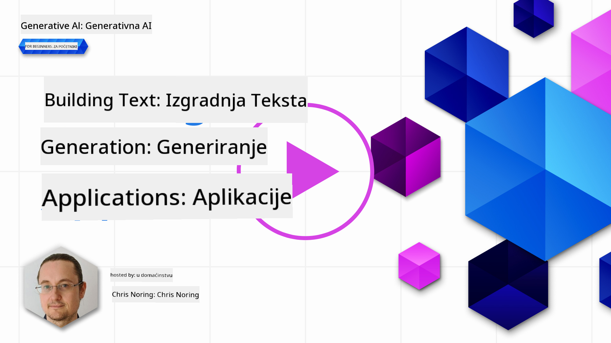

<!--
CO_OP_TRANSLATOR_METADATA:
{
  "original_hash": "ce8224073b86b728ed52b19bed7932fd",
  "translation_date": "2025-07-09T12:10:01+00:00",
  "source_file": "06-text-generation-apps/README.md",
  "language_code": "hr"
}
-->
# Izrada aplikacija za generiranje teksta

[](https://aka.ms/gen-ai-lesson6-gh?WT.mc_id=academic-105485-koreyst)

> _(Kliknite na gornju sliku za pregled video lekcije)_

Do sada ste kroz ovaj kurikulum vidjeli da postoje osnovni pojmovi poput promptova, pa čak i cijela disciplina nazvana "prompt engineering". Mnogi alati s kojima možete komunicirati, poput ChatGPT-a, Office 365, Microsoft Power Platforme i drugih, podržavaju korištenje promptova za ostvarivanje određenih zadataka.

Da biste takvo iskustvo dodali u aplikaciju, morate razumjeti pojmove poput promptova, dovršetaka (completions) i odabrati biblioteku za rad. Upravo to ćete naučiti u ovom poglavlju.

## Uvod

U ovom poglavlju ćete:

- Naučiti o openai biblioteci i njezinim osnovnim pojmovima.
- Izraditi aplikaciju za generiranje teksta koristeći openai.
- Razumjeti kako koristiti pojmove poput prompta, temperature i tokena za izradu aplikacije za generiranje teksta.

## Ciljevi učenja

Na kraju ove lekcije moći ćete:

- Objasniti što je aplikacija za generiranje teksta.
- Izraditi aplikaciju za generiranje teksta koristeći openai.
- Konfigurirati aplikaciju da koristi više ili manje tokena te promijeniti temperaturu za raznolike rezultate.

## Što je aplikacija za generiranje teksta?

Obično, kada izrađujete aplikaciju, ona ima neki oblik sučelja poput sljedećeg:

- Na temelju naredbi. Konzolne aplikacije su tipične aplikacije gdje upisujete naredbu i ona izvršava zadatak. Na primjer, `git` je aplikacija temeljena na naredbama.
- Korisničko sučelje (UI). Neke aplikacije imaju grafičko korisničko sučelje (GUI) gdje klikate gumbe, unosite tekst, birate opcije i slično.

### Konzolne i UI aplikacije su ograničene

Usporedite to s aplikacijom temeljenu na naredbama gdje upisujete naredbu:

- **Ograničene su**. Ne možete upisati bilo koju naredbu, samo one koje aplikacija podržava.
- **Specifične za jezik**. Neke aplikacije podržavaju više jezika, ali po defaultu su izrađene za određeni jezik, iako se može dodati podrška za druge jezike.

### Prednosti aplikacija za generiranje teksta

Kako se onda aplikacija za generiranje teksta razlikuje?

U aplikaciji za generiranje teksta imate veću fleksibilnost, niste ograničeni na skup naredbi ili određeni ulazni jezik. Umjesto toga, možete koristiti prirodni jezik za interakciju s aplikacijom. Još jedna prednost je što već komunicirate s izvorom podataka koji je treniran na ogromnom korpusu informacija, dok je tradicionalna aplikacija ograničena na ono što je u bazi podataka.

### Što mogu izraditi s aplikacijom za generiranje teksta?

Moguće je izraditi mnogo toga. Na primjer:

- **Chatbot**. Chatbot koji odgovara na pitanja o temama poput vaše tvrtke i njenih proizvoda može biti dobar izbor.
- **Pomoćnik**. LLM-ovi su izvrsni u stvarima poput sažimanja teksta, izvlačenja uvida iz teksta, generiranja tekstova poput životopisa i slično.
- **Asistent za kodiranje**. Ovisno o modelu jezika koji koristite, možete izraditi asistenta za kodiranje koji pomaže u pisanju koda. Na primjer, možete koristiti proizvode poput GitHub Copilot ili ChatGPT za pomoć u pisanju koda.

## Kako započeti?

Trebat ćete pronaći način za integraciju s LLM-om, što obično uključuje sljedeća dva pristupa:

- Korištenje API-ja. Ovdje sastavljate web zahtjeve s vašim promptom i dobivate generirani tekst natrag.
- Korištenje biblioteke. Biblioteke pomažu enkapsulirati API pozive i olakšavaju njihovu upotrebu.

## Biblioteke/SDK-ovi

Postoji nekoliko poznatih biblioteka za rad s LLM-ovima, poput:

- **openai**, ova biblioteka olakšava povezivanje s vašim modelom i slanje promptova.

Zatim postoje biblioteke koje rade na višoj razini, poput:

- **Langchain**. Langchain je poznat i podržava Python.
- **Semantic Kernel**. Semantic Kernel je Microsoftova biblioteka koja podržava jezike C#, Python i Java.

## Prva aplikacija koristeći openai

Pogledajmo kako možemo izraditi našu prvu aplikaciju, koje biblioteke su potrebne, koliko je potrebno i slično.

### Instalirajte openai

Postoji mnogo biblioteka za interakciju s OpenAI ili Azure OpenAI. Moguće je koristiti različite programske jezike poput C#, Python, JavaScript, Java i druge. Odabrali smo koristiti `openai` Python biblioteku, pa ćemo koristiti `pip` za instalaciju.

```bash
pip install openai
```

### Kreirajte resurs

Potrebno je napraviti sljedeće korake:

- Kreirajte račun na Azure [https://azure.microsoft.com/free/](https://azure.microsoft.com/free/?WT.mc_id=academic-105485-koreyst).
- Dobijte pristup Azure OpenAI. Posjetite [https://learn.microsoft.com/azure/ai-services/openai/overview#how-do-i-get-access-to-azure-openai](https://learn.microsoft.com/azure/ai-services/openai/overview#how-do-i-get-access-to-azure-openai?WT.mc_id=academic-105485-koreyst) i zatražite pristup.

  > [!NOTE]
  > U vrijeme pisanja, potrebno je podnijeti zahtjev za pristup Azure OpenAI.

- Instalirajte Python <https://www.python.org/>
- Kreirajte Azure OpenAI Service resurs. Pogledajte ovaj vodič za [kreiranje resursa](https://learn.microsoft.com/azure/ai-services/openai/how-to/create-resource?pivots=web-portal?WT.mc_id=academic-105485-koreyst).

### Pronađite API ključ i endpoint

Sada trebate reći `openai` biblioteci koji API ključ koristiti. Da biste pronašli svoj API ključ, idite u odjeljak "Keys and Endpoint" vašeg Azure OpenAI resursa i kopirajte vrijednost "Key 1".


Sada kada imate ove podatke, uputimo biblioteke da ih koriste.

> [!NOTE]
> Vrijedi odvojiti vaš API ključ od koda. To možete napraviti korištenjem varijabli okoline.
>
> - Postavite varijablu okoline `OPENAI_API_KEY` na vaš API ključ.
>   `export OPENAI_API_KEY='sk-...'`

### Postavljanje konfiguracije za Azure

Ako koristite Azure OpenAI, evo kako postaviti konfiguraciju:

```python
openai.api_type = 'azure'
openai.api_key = os.environ["OPENAI_API_KEY"]
openai.api_version = '2023-05-15'
openai.api_base = os.getenv("API_BASE")
```

Ovdje postavljamo sljedeće:

- `api_type` na `azure`. Time biblioteci govorimo da koristi Azure OpenAI, a ne OpenAI.
- `api_key`, vaš API ključ pronađen u Azure Portalu.
- `api_version`, verzija API-ja koju želite koristiti. U vrijeme pisanja, najnovija verzija je `2023-05-15`.
- `api_base`, endpoint API-ja. Možete ga pronaći u Azure Portalu pored vašeg API ključa.

> [!NOTE] > `os.getenv` je funkcija koja čita varijable okoline. Možete je koristiti za čitanje varijabli poput `OPENAI_API_KEY` i `API_BASE`. Postavite te varijable u terminalu ili koristeći biblioteku poput `dotenv`.

## Generiranje teksta

Način generiranja teksta je korištenjem klase `Completion`. Evo primjera:

```python
prompt = "Complete the following: Once upon a time there was a"

completion = openai.Completion.create(model="davinci-002", prompt=prompt)
print(completion.choices[0].text)
```

U gornjem kodu stvaramo objekt dovršetka i prosljeđujemo model koji želimo koristiti i prompt. Zatim ispisujemo generirani tekst.

### Chat dovršetci

Do sada ste vidjeli kako koristimo `Completion` za generiranje teksta. No postoji i druga klasa nazvana `ChatCompletion` koja je prikladnija za chatbote. Evo primjera korištenja:

```python
import openai

openai.api_key = "sk-..."

completion = openai.ChatCompletion.create(model="gpt-3.5-turbo", messages=[{"role": "user", "content": "Hello world"}])
print(completion.choices[0].message.content)
```

Više o ovoj funkcionalnosti u nadolazećem poglavlju.

## Vježba - vaša prva aplikacija za generiranje teksta

Sada kada smo naučili kako postaviti i konfigurirati openai, vrijeme je da izradite svoju prvu aplikaciju za generiranje teksta. Za izradu aplikacije slijedite ove korake:

1. Kreirajte virtualno okruženje i instalirajte openai:

   ```bash
   python -m venv venv
   source venv/bin/activate
   pip install openai
   ```

   > [!NOTE]
   > Ako koristite Windows, upišite `venv\Scripts\activate` umjesto `source venv/bin/activate`.

   > [!NOTE]
   > Pronađite svoj Azure OpenAI ključ tako da odete na [https://portal.azure.com/](https://portal.azure.com/?WT.mc_id=academic-105485-koreyst), potražite `Open AI`, odaberite `Open AI resource`, zatim `Keys and Endpoint` i kopirajte vrijednost `Key 1`.

1. Kreirajte datoteku _app.py_ i unesite sljedeći kod:

   ```python
   import openai

   openai.api_key = "<replace this value with your open ai key or Azure OpenAI key>"

   openai.api_type = 'azure'
   openai.api_version = '2023-05-15'
   openai.api_base = "<endpoint found in Azure Portal where your API key is>"
   deployment_name = "<deployment name>"

   # add your completion code
   prompt = "Complete the following: Once upon a time there was a"
   messages = [{"role": "user", "content": prompt}]

   # make completion
   completion = openai.chat.completions.create(model=deployment_name, messages=messages)

   # print response
   print(completion.choices[0].message.content)
   ```

   > [!NOTE]
   > Ako koristite Azure OpenAI, morate postaviti `api_type` na `azure` i `api_key` na vaš Azure OpenAI ključ.

   Trebali biste vidjeti izlaz poput sljedećeg:

   ```output
    very unhappy _____.

   Once upon a time there was a very unhappy mermaid.
   ```

## Različite vrste promptova za različite svrhe

Sada ste vidjeli kako generirati tekst koristeći prompt. Imate program koji radi i koji možete mijenjati kako biste generirali različite vrste teksta.

Promptovi se mogu koristiti za razne zadatke. Na primjer:

- **Generiranje vrste teksta**. Na primjer, možete generirati pjesmu, pitanja za kviz i slično.
- **Pretraživanje informacija**. Možete koristiti promptove za traženje informacija poput primjera 'Što znači CORS u web razvoju?'.
- **Generiranje koda**. Možete koristiti promptove za generiranje koda, na primjer za razvoj regularnog izraza za provjeru email adresa ili čak generirati cijeli program, poput web aplikacije.

## Praktičniji primjer: generator recepata

Zamislite da imate sastojke kod kuće i želite nešto skuhati. Za to vam treba recept. Jedan način da pronađete recepte je korištenje tražilice, a drugi je korištenje LLM-a.

Možete napisati prompt ovako:

> "Prikaži mi 5 recepata za jelo s sljedećim sastojcima: piletina, krumpir i mrkva. Za svaki recept navedi sve korištene sastojke."

Na temelju ovog prompta mogli biste dobiti odgovor sličan ovom:

```output
1. Roasted Chicken and Vegetables:
Ingredients:
- 4 chicken thighs
- 2 potatoes, cut into cubes
- 2 carrots, cut into cubes
- 2 tablespoons olive oil
- 2 cloves garlic, minced
- 1 teaspoon dried thyme
- 1 teaspoon dried oregano
- Salt and pepper, to taste

2. Chicken and Potato Stew:
Ingredients:
- 2 tablespoons olive oil
- 1 onion, diced
- 2 cloves garlic, minced
- 2 chicken breasts, cut into cubes
- 2 potatoes, cut into cubes
- 2 carrots, cut into cubes
- 1 teaspoon dried oregano
- 1 teaspoon dried thyme
- 1 cup chicken broth
- Salt and pepper, to taste

3. Chicken and Potato Bake:
Ingredients:
- 2 tablespoons olive oil
- 2 chicken breasts, cut into cubes
- 2 potatoes, cut into cubes
- 2 carrots, cut into cubes
- 1 onion, diced
- 2 cloves garlic, minced
- 1 teaspoon dried oregano
- 1 teaspoon dried thyme
- 1 cup chicken broth
- Salt and pepper, to taste

4. Chicken and Potato Soup:
Ingredients:
- 2 tablespoons olive oil
- 1 onion, diced
- 2 cloves garlic, minced
- 2 chicken breasts, cut into cubes
- 2 potatoes, cut into cubes
- 2 carrots, cut into cubes
- 1 teaspoon dried oregano
- 1 teaspoon dried thyme
- 4 cups chicken broth
- Salt and pepper, to taste

5. Chicken and Potato Hash:
Ingredients:
- 2 tablespoons olive oil
- 2 chicken breasts, cut into cubes
- 2 potatoes, cut into cubes
- 2 carrots, cut into cubes
- 1 onion, diced
- 2 cloves garlic, minced
- 1 teaspoon dried oregano
```

Ovaj rezultat je odličan, znam što kuhati. U ovom trenutku, korisna poboljšanja mogla bi biti:

- Filtriranje sastojaka koje ne volim ili na koje sam alergičan.
- Izrada popisa za kupovinu, u slučaju da nemam sve sastojke kod kuće.

Za ove slučajeve dodajmo dodatni prompt:

> "Molim ukloni recepte s češnjakom jer sam alergičan i zamijeni ga nečim drugim. Također, napravi popis za kupovinu za recepte, uzimajući u obzir da već imam piletinu, krumpir i mrkvu kod kuće."

Sada imate novi rezultat, naime:

```output
1. Roasted Chicken and Vegetables:
Ingredients:
- 4 chicken thighs
- 2 potatoes, cut into cubes
- 2 carrots, cut into cubes
- 2 tablespoons olive oil
- 1 teaspoon dried thyme
- 1 teaspoon dried oregano
- Salt and pepper, to taste

2. Chicken and Potato Stew:
Ingredients:
- 2 tablespoons olive oil
- 1 onion, diced
- 2 chicken breasts, cut into cubes
- 2 potatoes, cut into cubes
- 2 carrots, cut into cubes
- 1 teaspoon dried oregano
- 1 teaspoon dried thyme
- 1 cup chicken broth
- Salt and pepper, to taste

3. Chicken and Potato Bake:
Ingredients:
- 2 tablespoons olive oil
- 2 chicken breasts, cut into cubes
- 2 potatoes, cut into cubes
- 2 carrots, cut into cubes
- 1 onion, diced
- 1 teaspoon dried oregano
- 1 teaspoon dried thyme
- 1 cup chicken broth
- Salt and pepper, to taste

4. Chicken and Potato Soup:
Ingredients:
- 2 tablespoons olive oil
- 1 onion, diced
- 2 chicken breasts, cut into cubes
- 2 potatoes, cut into cubes
- 2 carrots, cut into cubes
- 1 teaspoon dried oregano
- 1 teaspoon dried thyme
- 4 cups chicken broth
- Salt and pepper, to taste

5. Chicken and Potato Hash:
Ingredients:
- 2 tablespoons olive oil
- 2 chicken breasts, cut into cubes
- 2 potatoes, cut into cubes
- 2 carrots, cut into cubes
- 1 onion, diced
- 1 teaspoon dried oregano

Shopping List:
- Olive oil
- Onion
- Thyme
- Oregano
- Salt
- Pepper
```

To su vaši pet recepata bez češnjaka i imate popis za kupovinu uzimajući u obzir što već imate kod kuće.

## Vježba - izradite generator recepata

Sada kada smo odigrali scenarij, napišimo kod koji odgovara prikazanom scenariju. Za to slijedite ove korake:

1. Koristite postojeću datoteku _app.py_ kao polaznu točku.
1. Pronađite varijablu `prompt` i promijenite njezin kod na sljedeći način:

   ```python
   prompt = "Show me 5 recipes for a dish with the following ingredients: chicken, potatoes, and carrots. Per recipe, list all the ingredients used"
   ```

   Ako sada pokrenete kod, trebali biste vidjeti izlaz sličan ovom:

   ```output
   -Chicken Stew with Potatoes and Carrots: 3 tablespoons oil, 1 onion, chopped, 2 cloves garlic, minced, 1 carrot, peeled and chopped, 1 potato, peeled and chopped, 1 bay leaf, 1 thyme sprig, 1/2 teaspoon salt, 1/4 teaspoon black pepper, 1 1/2 cups chicken broth, 1/2 cup dry white wine, 2 tablespoons chopped fresh parsley, 2 tablespoons unsalted butter, 1 1/2 pounds boneless, skinless chicken thighs, cut into 1-inch pieces
   -Oven-Roasted Chicken with Potatoes and Carrots: 3 tablespoons extra-virgin olive oil, 1 tablespoon Dijon mustard, 1 tablespoon chopped fresh rosemary, 1 tablespoon chopped fresh thyme, 4 cloves garlic, minced, 1 1/2 pounds small red potatoes, quartered, 1 1/2 pounds carrots, quartered lengthwise, 1/2 teaspoon salt, 1/4 teaspoon black pepper, 1 (4-pound) whole chicken
   -Chicken, Potato, and Carrot Casserole: cooking spray, 1 large onion, chopped, 2 cloves garlic, minced, 1 carrot, peeled and shredded, 1 potato, peeled and shredded, 1/2 teaspoon dried thyme leaves, 1/4 teaspoon salt, 1/4 teaspoon black pepper, 2 cups fat-free, low-sodium chicken broth, 1 cup frozen peas, 1/4 cup all-purpose flour, 1 cup 2% reduced-fat milk, 1/4 cup grated Parmesan cheese

   -One Pot Chicken and Potato Dinner: 2 tablespoons olive oil, 1 pound boneless, skinless chicken thighs, cut into 1-inch pieces, 1 large onion, chopped, 3 cloves garlic, minced, 1 carrot, peeled and chopped, 1 potato, peeled and chopped, 1 bay leaf, 1 thyme sprig, 1/2 teaspoon salt, 1/4 teaspoon black pepper, 2 cups chicken broth, 1/2 cup dry white wine

   -Chicken, Potato, and Carrot Curry: 1 tablespoon vegetable oil, 1 large onion, chopped, 2 cloves garlic, minced, 1 carrot, peeled and chopped, 1 potato, peeled and chopped, 1 teaspoon ground coriander, 1 teaspoon ground cumin, 1/2 teaspoon ground turmeric, 1/2 teaspoon ground ginger, 1/4 teaspoon cayenne pepper, 2 cups chicken broth, 1/2 cup dry white wine, 1 (15-ounce) can chickpeas, drained and rinsed, 1/2 cup raisins, 1/2 cup chopped fresh cilantro
   ```

   > NOTE, vaš LLM nije determinističan, pa možete dobiti različite rezultate svaki put kad pokrenete program.

   Odlično, pogledajmo kako možemo poboljšati stvari. Za poboljšanje želimo osigurati da je kod fleksibilan, tako da se sastojci i broj recepata mogu mijenjati.

1. Promijenimo kod na sljedeći način:

   ```python
   no_recipes = input("No of recipes (for example, 5): ")

   ingredients = input("List of ingredients (for example, chicken, potatoes, and carrots): ")

   # interpolate the number of recipes into the prompt an ingredients
   prompt = f"Show me {no_recipes} recipes for a dish with the following ingredients: {ingredients}. Per recipe, list all the ingredients used"
   ```

   Testni pokret koda mogao bi izgledati ovako:

   ```output
   No of recipes (for example, 5): 3
   List of ingredients (for example, chicken, potatoes, and carrots): milk,strawberries

   -Strawberry milk shake: milk, strawberries, sugar, vanilla extract, ice cubes
   -Strawberry shortcake: milk, flour, baking powder, sugar, salt, unsalted butter, strawberries, whipped cream
   -Strawberry milk: milk, strawberries, sugar, vanilla extract
   ```

### Poboljšanje dodavanjem filtera i popisa za kupovinu

Sada imamo funkcionalnu aplikaciju koja može generirati recepte i fleksibilna je jer se oslanja na unos korisnika, kako u broju recepata, tako i u sastojcima.

Za daljnje poboljšanje želimo dodati sljedeće:

- **Filtriranje sastojaka**. Želimo moći filtrirati sastojke koje ne volimo ili na koje smo alergični. Da bismo to postigli, možemo urediti postojeći prompt i dodati uvjet za filtriranje na njegov kraj, ovako:

  ```python
  filter = input("Filter (for example, vegetarian, vegan, or gluten-free): ")

  prompt = f"Show me {no_recipes} recipes for a dish with the following ingredients: {ingredients}. Per recipe, list all the ingredients used, no {filter}"
  ```

  Ovdje dodajemo `{filter}` na kraj prompta i također dohvaćamo vrijednost filtera od korisnika.

  Primjer unosa pri pokretanju programa sada može izgledati ovako:

  ```output
  No of recipes (for example, 5): 3
  List of ingredients (for example, chicken, potatoes, and carrots): onion,milk
  Filter (for example, vegetarian, vegan, or gluten-free): no milk

  1. French Onion Soup

  Ingredients:

  -1 large onion, sliced
  -3 cups beef broth
  -1 cup milk
  -6 slices french bread
  -1/4 cup shredded Parmesan cheese
  -1 tablespoon butter
  -1 teaspoon dried thyme
  -1/4 teaspoon salt
  -1/4 teaspoon black pepper

  Instructions:

  1. In a large pot, sauté onions in butter until golden brown.
  2. Add beef broth, milk, thyme, salt, and pepper. Bring to a boil.
  3. Reduce heat and simmer for 10 minutes.
  4. Place french bread slices on soup bowls.
  5. Ladle soup over bread.
  6. Sprinkle with Parmesan cheese.

  2. Onion and Potato Soup

  Ingredients:

  -1 large onion, chopped
  -2 cups potatoes, diced
  -3 cups vegetable broth
  -1 cup milk
  -1/4 teaspoon black pepper

  Instructions:

  1. In a large pot, sauté onions in butter until golden brown.
  2. Add potatoes, vegetable broth, milk, and pepper. Bring to a boil.
  3. Reduce heat and simmer for 10 minutes.
  4. Serve hot.

  3. Creamy Onion Soup

  Ingredients:

  -1 large onion, chopped
  -3 cups vegetable broth
  -1 cup milk
  -1/4 teaspoon black pepper
  -1/4 cup all-purpose flour
  -1/2 cup shredded Parmesan cheese

  Instructions:

  1. In a large pot, sauté onions in butter until golden brown.
  2. Add vegetable broth, milk, and pepper. Bring to a boil.
  3. Reduce heat and simmer for 10 minutes.
  4. In a small bowl, whisk together flour and Parmesan cheese until smooth.
  5. Add to soup and simmer for an additional 5 minutes, or until soup has thickened.
  ```

  Kao što vidite, svi recepti koji sadrže mlijeko su filtrirani. No, ako ste netolerantni na laktozu, možda ćete htjeti filtrirati i recepte sa sirom, pa je važno biti jasan.

- **Izrada popisa za kupovinu**. Želimo napraviti popis za kupovinu, uzimajući u obzir što već imamo kod kuće.

  Za ovu funkcionalnost mogli bismo pokušati riješiti sve u jednom promptu ili podijeliti na dva prompta. Pokušajmo s drugim pristupom. Ovdje predlažemo dodavanje dodatnog prompta, ali da bi to funkcioniralo, trebamo dodati rezultat prvog prompta kao kontekst drugom promptu.

  Pronađite dio koda koji ispisuje rezultat iz prvog prompta i dodajte sljedeći kod ispod:

  ```python
  old_prompt_result = completion.choices[0].message.content
  prompt = "Produce a shopping list for the generated recipes and please don't include ingredients that I already have."

  new_prompt = f"{old_prompt_result} {prompt}"
  messages = [{"role": "user", "content": new_prompt}]
  completion = openai.Completion.create(engine=deployment_name, messages=messages, max_tokens=1200)

  # print response
  print("Shopping list:")
  print(completion.choices[0].message.content)
  ```

  Obratite pažnju na sljedeće:

  1. Sastavljamo novi prompt dodavanjem rezultata iz prvog prompta u novi prompt:

     ```python
     new_prompt = f"{old_prompt_result} {prompt}"
     ```
  1. Napravimo novi zahtjev, ali također uzimajući u obzir broj tokena koje smo tražili u prvom upitu, pa ovaj put postavljamo `max_tokens` na 1200.

     ```python
     completion = openai.Completion.create(engine=deployment_name, prompt=new_prompt, max_tokens=1200)
     ```

     Pokretanjem ovog koda, dobivamo sljedeći rezultat:

     ```output
     No of recipes (for example, 5): 2
     List of ingredients (for example, chicken, potatoes, and carrots): apple,flour
     Filter (for example, vegetarian, vegan, or gluten-free): sugar


     -Apple and flour pancakes: 1 cup flour, 1/2 tsp baking powder, 1/2 tsp baking soda, 1/4 tsp salt, 1 tbsp sugar, 1 egg, 1 cup buttermilk or sour milk, 1/4 cup melted butter, 1 Granny Smith apple, peeled and grated
     -Apple fritters: 1-1/2 cups flour, 1 tsp baking powder, 1/4 tsp salt, 1/4 tsp baking soda, 1/4 tsp nutmeg, 1/4 tsp cinnamon, 1/4 tsp allspice, 1/4 cup sugar, 1/4 cup vegetable shortening, 1/4 cup milk, 1 egg, 2 cups shredded, peeled apples
     Shopping list:
     -Flour, baking powder, baking soda, salt, sugar, egg, buttermilk, butter, apple, nutmeg, cinnamon, allspice
     ```

## Poboljšajte svoju postavku

Do sada imamo kod koji radi, ali postoje neke prilagodbe koje bismo trebali napraviti kako bismo dodatno poboljšali stvari. Neke stvari koje bismo trebali napraviti su:

- **Odvojite tajne od koda**, poput API ključa. Tajne ne pripadaju u kod i trebale bi se čuvati na sigurnom mjestu. Da bismo odvojili tajne od koda, možemo koristiti varijable okoline i biblioteke poput `python-dotenv` za učitavanje iz datoteke. Evo kako bi to izgledalo u kodu:

  1. Kreirajte `.env` datoteku sa sljedećim sadržajem:

     ```bash
     OPENAI_API_KEY=sk-...
     ```

     
> Napomena, za Azure trebate postaviti sljedeće varijable okoline:

     ```bash
     OPENAI_API_TYPE=azure
     OPENAI_API_VERSION=2023-05-15
     OPENAI_API_BASE=<replace>
     ```

     U kodu biste varijable okoline učitali ovako:

     ```python
     from dotenv import load_dotenv

     load_dotenv()

     openai.api_key = os.environ["OPENAI_API_KEY"]
     ```

- **Riječ o duljini tokena**. Trebali bismo razmotriti koliko tokena nam treba za generiranje željenog teksta. Tokeni koštaju, pa bismo gdje god je moguće trebali biti štedljivi s njihovim brojem. Na primjer, možemo li formulirati upit tako da koristimo manje tokena?

  Za promjenu broja tokena koje koristite, možete koristiti parametar `max_tokens`. Na primjer, ako želite koristiti 100 tokena, napravili biste:

  ```python
  completion = client.chat.completions.create(model=deployment, messages=messages, max_tokens=100)
  ```

- **Eksperimentiranje s temperaturom**. Temperatura je nešto o čemu do sada nismo govorili, ali je važan kontekst za to kako naš program radi. Što je vrijednost temperature viša, to će izlaz biti nasumičniji. Suprotno tome, što je temperatura niža, izlaz će biti predvidljiviji. Razmislite želite li varijacije u svom izlazu ili ne.

  Za promjenu temperature, možete koristiti parametar `temperature`. Na primjer, ako želite postaviti temperaturu na 0.5, napravili biste:

  ```python
  completion = client.chat.completions.create(model=deployment, messages=messages, temperature=0.5)
  ```

  > Napomena, što je bliže 1.0, to je izlaz raznolikiji.

## Zadatak

Za ovaj zadatak možete odabrati što ćete napraviti.

Evo nekoliko prijedloga:

- Doradite aplikaciju za generiranje recepata kako biste je dodatno poboljšali. Igrajte se s vrijednostima temperature i upitima da vidite što možete smisliti.
- Izradite "studijskog prijatelja". Ova aplikacija trebala bi moći odgovarati na pitanja o nekoj temi, na primjer Python. Možete imati upite poput "Što je određena tema u Pythonu?", ili upit koji kaže, pokaži mi kod za određenu temu itd.
- Povijesni bot, oživite povijest, uputite bota da glumi određenu povijesnu osobu i postavljajte mu pitanja o njegovom životu i vremenu.

## Rješenje

### Studijski prijatelj

Ispod je početni upit, pogledajte kako ga možete koristiti i prilagoditi po želji.

```text
- "You're an expert on the Python language

    Suggest a beginner lesson for Python in the following format:

    Format:
    - concepts:
    - brief explanation of the lesson:
    - exercise in code with solutions"
```

### Povijesni bot

Evo nekoliko upita koje biste mogli koristiti:

```text
- "You are Abe Lincoln, tell me about yourself in 3 sentences, and respond using grammar and words like Abe would have used"
- "You are Abe Lincoln, respond using grammar and words like Abe would have used:

   Tell me about your greatest accomplishments, in 300 words"
```

## Provjera znanja

Što radi koncept temperature?

1. Kontrolira koliko je izlaz nasumičan.
1. Kontrolira koliko je odgovor velik.
1. Kontrolira koliko se tokena koristi.

## 🚀 Izazov

Dok radite na zadatku, pokušajte mijenjati temperaturu, postavite je na 0, 0.5 i 1. Zapamtite da je 0 najmanje raznoliko, a 1 najviše. Koja vrijednost najbolje funkcionira za vašu aplikaciju?

## Odličan posao! Nastavite s učenjem

Nakon što završite ovu lekciju, pogledajte našu [Generative AI Learning collection](https://aka.ms/genai-collection?WT.mc_id=academic-105485-koreyst) kako biste nastavili usavršavati svoje znanje o Generativnoj AI!

Krenite na Lekciju 7 gdje ćemo pogledati kako [izgraditi chat aplikacije](../07-building-chat-applications/README.md?WT.mc_id=academic-105485-koreyst)!

**Odricanje od odgovornosti**:  
Ovaj dokument je preveden korištenjem AI usluge za prevođenje [Co-op Translator](https://github.com/Azure/co-op-translator). Iako težimo točnosti, imajte na umu da automatski prijevodi mogu sadržavati pogreške ili netočnosti. Izvorni dokument na izvornom jeziku treba smatrati službenim i autoritativnim izvorom. Za kritične informacije preporučuje se profesionalni ljudski prijevod. Ne snosimo odgovornost za bilo kakva nesporazuma ili pogrešna tumačenja koja proizlaze iz korištenja ovog prijevoda.