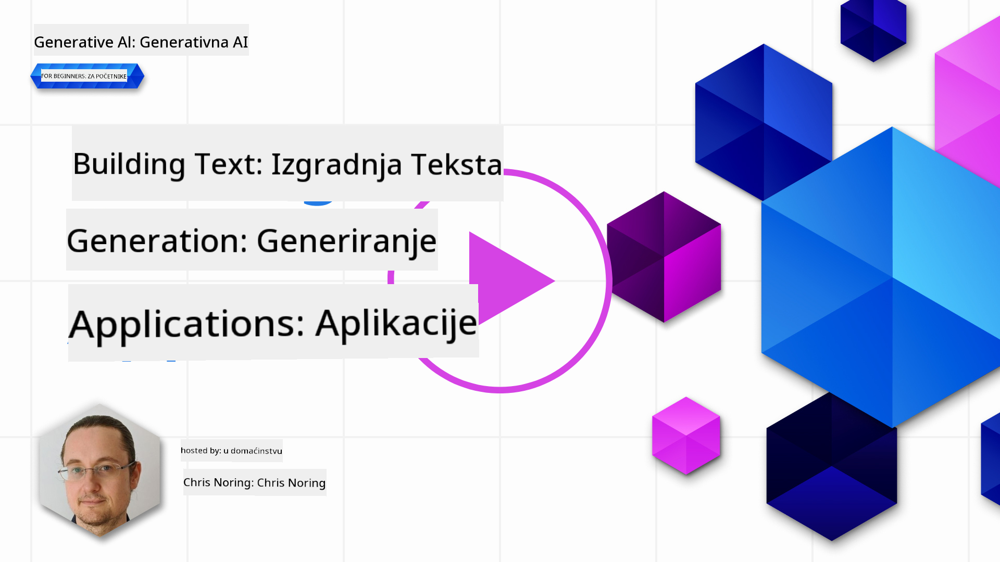

<!--
CO_OP_TRANSLATOR_METADATA:
{
  "original_hash": "5ec6c92b629564538ef397c550adb73e",
  "translation_date": "2025-06-25T14:55:52+00:00",
  "source_file": "06-text-generation-apps/README.md",
  "language_code": "hr"
}
-->
# Izgradnja aplikacija za generiranje teksta

[](https://aka.ms/gen-ai-lesson6-gh?WT.mc_id=academic-105485-koreyst)

> _(Kliknite na sliku iznad za pregled videozapisa ove lekcije)_

Do sada ste kroz ovaj kurikulum vidjeli da postoje ključni koncepti poput promptova i čak cijela disciplina nazvana "inženjering promptova". Mnogi alati s kojima možete komunicirati, poput ChatGPT-a, Office 365, Microsoft Power Platforme i drugih, podržavaju korištenje promptova za postizanje nečega.

Da biste dodali takvo iskustvo aplikaciji, trebate razumjeti koncepte poput promptova, završetaka i odabrati biblioteku s kojom ćete raditi. To je upravo ono što ćete naučiti u ovom poglavlju.

## Uvod

U ovom poglavlju ćete:

- Naučiti o openai biblioteci i njenim osnovnim konceptima.
- Izgraditi aplikaciju za generiranje teksta koristeći openai.
- Razumjeti kako koristiti koncepte poput prompta, temperature i tokena za izgradnju aplikacije za generiranje teksta.

## Ciljevi učenja

Na kraju ove lekcije moći ćete:

- Objasniti što je aplikacija za generiranje teksta.
- Izgraditi aplikaciju za generiranje teksta koristeći openai.
- Konfigurirati svoju aplikaciju za korištenje više ili manje tokena te također promijeniti temperaturu za raznoliki ishod.

## Što je aplikacija za generiranje teksta?

Obično kada gradite aplikaciju, ona ima neku vrstu sučelja poput sljedećeg:

- Temeljeno na naredbama. Konzolne aplikacije su tipične aplikacije gdje upisujete naredbu i ona izvršava zadatak. Na primjer, `git` je aplikacija temeljena na naredbama.
- Korisničko sučelje (UI). Neke aplikacije imaju grafička korisnička sučelja (GUI) gdje klikate gumbe, unosite tekst, birate opcije i više.

### Konzolne i UI aplikacije su ograničene

Usporedite to s aplikacijom temeljenom na naredbama gdje upisujete naredbu:

- **Ograničeno je**. Ne možete upisati bilo koju naredbu, samo one koje aplikacija podržava.
- **Specifično za jezik**. Neke aplikacije podržavaju mnoge jezike, ali prema zadanim postavkama aplikacija je izgrađena za određeni jezik, čak i ako možete dodati podršku za više jezika.

### Prednosti aplikacija za generiranje teksta

Pa kako se aplikacija za generiranje teksta razlikuje?

U aplikaciji za generiranje teksta imate više fleksibilnosti, niste ograničeni na skup naredbi ili specifičan ulazni jezik. Umjesto toga, možete koristiti prirodni jezik za interakciju s aplikacijom. Druga prednost je što već komunicirate s izvorom podataka koji je treniran na ogromnom korpusu informacija, dok bi tradicionalna aplikacija mogla biti ograničena na ono što je u bazi podataka.

### Što mogu izgraditi s aplikacijom za generiranje teksta?

Postoji mnogo stvari koje možete izgraditi. Na primjer:

- **Chatbot**. Chatbot koji odgovara na pitanja o temama, poput vaše tvrtke i njenih proizvoda, mogao bi biti dobar izbor.
- **Pomoćnik**. LLM-ovi su izvrsni u stvarima poput sažimanja teksta, dobivanja uvida iz teksta, stvaranja teksta poput životopisa i više.
- **Asistent za kodiranje**. Ovisno o jezičnom modelu koji koristite, možete izgraditi asistenta za kodiranje koji vam pomaže pisati kod. Na primjer, možete koristiti proizvod poput GitHub Copilot kao i ChatGPT da vam pomogne u pisanju koda.

## Kako mogu započeti?

Pa, trebate pronaći način integracije s LLM-om, što obično uključuje sljedeća dva pristupa:

- Korištenje API-ja. Ovdje konstruirate web zahtjeve s vašim promptom i dobivate generirani tekst natrag.
- Korištenje biblioteke. Biblioteke pomažu u enkapsulaciji API poziva i čine ih lakšima za korištenje.

## Biblioteke/SDK-ovi

Postoji nekoliko dobro poznatih biblioteka za rad s LLM-ovima poput:

- **openai**, ova biblioteka olakšava povezivanje s vašim modelom i slanje promptova.

Zatim postoje biblioteke koje djeluju na višoj razini poput:

- **Langchain**. Langchain je dobro poznat i podržava Python.
- **Semantic Kernel**. Semantic Kernel je biblioteka od Microsofta koja podržava jezike C#, Python i Java.

## Prva aplikacija koristeći openai

Pogledajmo kako možemo izgraditi našu prvu aplikaciju, koje biblioteke trebamo, koliko je potrebno i tako dalje.

### Instalirajte openai

Postoji mnogo biblioteka za interakciju s OpenAI ili Azure OpenAI. Moguće je koristiti brojne programske jezike poput C#, Python, JavaScript, Java i više. Odabrali smo koristiti `openai` Python biblioteku, pa ćemo koristiti `pip` za njeno instaliranje.

```bash
pip install openai
```

### Kreirajte resurs

Morate provesti sljedeće korake:

- Kreirajte račun na Azure [https://azure.microsoft.com/free/](https://azure.microsoft.com/free/?WT.mc_id=academic-105485-koreyst).
- Dobijte pristup Azure OpenAI. Idite na [https://learn.microsoft.com/azure/ai-services/openai/overview#how-do-i-get-access-to-azure-openai](https://learn.microsoft.com/azure/ai-services/openai/overview#how-do-i-get-access-to-azure-openai?WT.mc_id=academic-105485-koreyst) i zatražite pristup.

  > [!NOTE]
  > U vrijeme pisanja, trebate se prijaviti za pristup Azure OpenAI.

- Instalirajte Python <https://www.python.org/>
- Kreirali ste Azure OpenAI Service resurs. Pogledajte ovaj vodič kako [kreirati resurs](https://learn.microsoft.com/azure/ai-services/openai/how-to/create-resource?pivots=web-portal?WT.mc_id=academic-105485-koreyst).

### Pronađite API ključ i krajnju točku

U ovom trenutku trebate reći svojoj `openai` biblioteci koji API ključ koristiti. Da biste pronašli svoj API ključ, idite na odjeljak "Keys and Endpoint" vašeg Azure OpenAI resursa i kopirajte vrijednost "Key 1".


Sada kada ste kopirali ove informacije, uputimo biblioteke da ih koriste.

> [!NOTE]
> Vrijedno je odvojiti vaš API ključ od vašeg koda. To možete učiniti korištenjem varijabli okruženja.
>
> - Postavite varijablu okruženja `OPENAI_API_KEY` to your API key.
>   `export OPENAI_API_KEY='sk-...'`

### Postavljanje konfiguracije Azure

Ako koristite Azure OpenAI, evo kako postaviti konfiguraciju:

```python
openai.api_type = 'azure'
openai.api_key = os.environ["OPENAI_API_KEY"]
openai.api_version = '2023-05-15'
openai.api_base = os.getenv("API_BASE")
```

Iznad postavljamo sljedeće:

- `api_type` to `azure`. This tells the library to use Azure OpenAI and not OpenAI.
- `api_key`, this is your API key found in the Azure Portal.
- `api_version`, this is the version of the API you want to use. At the time of writing, the latest version is `2023-05-15`.
- `api_base`, this is the endpoint of the API. You can find it in the Azure Portal next to your API key.

> [!NOTE] > `os.getenv` is a function that reads environment variables. You can use it to read environment variables like `OPENAI_API_KEY` and `API_BASE`. Set these environment variables in your terminal or by using a library like `dotenv`.

## Generate text

The way to generate text is to use the `Completion` klasa. Evo primjera:

```python
prompt = "Complete the following: Once upon a time there was a"

completion = openai.Completion.create(model="davinci-002", prompt=prompt)
print(completion.choices[0].text)
```

U gornjem kodu kreiramo objekt završetka i predajemo model koji želimo koristiti i prompt. Zatim ispisujemo generirani tekst.

### Završeci razgovora

Do sada ste vidjeli kako koristimo `Completion` to generate text. But there's another class called `ChatCompletion` koji je više prikladan za chatbote. Evo primjera korištenja:

```python
import openai

openai.api_key = "sk-..."

completion = openai.ChatCompletion.create(model="gpt-3.5-turbo", messages=[{"role": "user", "content": "Hello world"}])
print(completion.choices[0].message.content)
```

Više o ovoj funkcionalnosti u nadolazećem poglavlju.

## Vježba - vaša prva aplikacija za generiranje teksta

Sada kada smo naučili kako postaviti i konfigurirati openai, vrijeme je da izgradite svoju prvu aplikaciju za generiranje teksta. Da biste izgradili svoju aplikaciju, slijedite ove korake:

1. Kreirajte virtualno okruženje i instalirajte openai:

   ```bash
   python -m venv venv
   source venv/bin/activate
   pip install openai
   ```

   > [!NOTE]
   > Ako koristite Windows, upišite `venv\Scripts\activate` instead of `source venv/bin/activate`.

   > [!NOTE]
   > Locate your Azure OpenAI key by going to [https://portal.azure.com/](https://portal.azure.com/?WT.mc_id=academic-105485-koreyst) and search for `Open AI` and select the `Open AI resource` and then select `Keys and Endpoint` and copy the `Key 1` vrijednost.

1. Kreirajte _app.py_ datoteku i unesite sljedeći kod:

   ```python
   import openai

   openai.api_key = "<replace this value with your open ai key or Azure OpenAI key>"

   openai.api_type = 'azure'
   openai.api_version = '2023-05-15'
   openai.api_base = "<endpoint found in Azure Portal where your API key is>"
   deployment_name = "<deployment name>"

   # add your completion code
   prompt = "Complete the following: Once upon a time there was a"
   messages = [{"role": "user", "content": prompt}]

   # make completion
   completion = openai.chat.completions.create(model=deployment_name, messages=messages)

   # print response
   print(completion.choices[0].message.content)
   ```

   > [!NOTE]
   > Ako koristite Azure OpenAI, trebate postaviti `api_type` to `azure` and set the `api_key` na svoj Azure OpenAI ključ.

   Trebali biste vidjeti izlaz poput sljedećeg:

   ```output
    very unhappy _____.

   Once upon a time there was a very unhappy mermaid.
   ```

## Različite vrste promptova za različite stvari

Sada ste vidjeli kako generirati tekst koristeći prompt. Čak imate i program koji radi i koji možete modificirati i mijenjati za generiranje različitih vrsta teksta.

Promptovi se mogu koristiti za sve vrste zadataka. Na primjer:

- **Generirajte vrstu teksta**. Na primjer, možete generirati pjesmu, pitanja za kviz itd.
- **Pretraživanje informacija**. Možete koristiti promptove za pretraživanje informacija poput sljedećeg primjera 'Što znači CORS u web razvoju?'.
- **Generirajte kod**. Možete koristiti promptove za generiranje koda, na primjer razvijajući regularni izraz koji se koristi za validaciju e-mailova ili zašto ne generirati cijeli program, poput web aplikacije?

## Praktičniji slučaj upotrebe: generator recepata

Zamislite da imate sastojke kod kuće i želite kuhati nešto. Za to vam treba recept. Način pronalaženja recepata je korištenje tražilice ili možete koristiti LLM za to.

Mogli biste napisati prompt poput ovog:

> "Prikaži mi 5 recepata za jelo sa sljedećim sastojcima: piletina, krumpir i mrkva. Po receptu, navedite sve korištene sastojke"

S obzirom na gore navedeni prompt, mogli biste dobiti odgovor sličan:

```output
1. Roasted Chicken and Vegetables:
Ingredients:
- 4 chicken thighs
- 2 potatoes, cut into cubes
- 2 carrots, cut into cubes
- 2 tablespoons olive oil
- 2 cloves garlic, minced
- 1 teaspoon dried thyme
- 1 teaspoon dried oregano
- Salt and pepper, to taste

2. Chicken and Potato Stew:
Ingredients:
- 2 tablespoons olive oil
- 1 onion, diced
- 2 cloves garlic, minced
- 2 chicken breasts, cut into cubes
- 2 potatoes, cut into cubes
- 2 carrots, cut into cubes
- 1 teaspoon dried oregano
- 1 teaspoon dried thyme
- 1 cup chicken broth
- Salt and pepper, to taste

3. Chicken and Potato Bake:
Ingredients:
- 2 tablespoons olive oil
- 2 chicken breasts, cut into cubes
- 2 potatoes, cut into cubes
- 2 carrots, cut into cubes
- 1 onion, diced
- 2 cloves garlic, minced
- 1 teaspoon dried oregano
- 1 teaspoon dried thyme
- 1 cup chicken broth
- Salt and pepper, to taste

4. Chicken and Potato Soup:
Ingredients:
- 2 tablespoons olive oil
- 1 onion, diced
- 2 cloves garlic, minced
- 2 chicken breasts, cut into cubes
- 2 potatoes, cut into cubes
- 2 carrots, cut into cubes
- 1 teaspoon dried oregano
- 1 teaspoon dried thyme
- 4 cups chicken broth
- Salt and pepper, to taste

5. Chicken and Potato Hash:
Ingredients:
- 2 tablespoons olive oil
- 2 chicken breasts, cut into cubes
- 2 potatoes, cut into cubes
- 2 carrots, cut into cubes
- 1 onion, diced
- 2 cloves garlic, minced
- 1 teaspoon dried oregano
```

Ovaj ishod je sjajan, znam što kuhati. U ovom trenutku, što bi moglo biti korisno poboljšanje su:

- Filtriranje sastojaka koje ne volim ili na koje sam alergičan.
- Izrada popisa za kupovinu, u slučaju da nemam sve sastojke kod kuće.

Za gore navedene slučajeve, dodajmo dodatni prompt:

> "Molim vas uklonite recepte s češnjakom jer sam alergičan i zamijenite ga nečim drugim. Također, molim vas napravite popis za kupovinu za recepte, uzimajući u obzir da već imam piletinu, krumpir i mrkvu kod kuće."

Sada imate novi rezultat, naime:

```output
1. Roasted Chicken and Vegetables:
Ingredients:
- 4 chicken thighs
- 2 potatoes, cut into cubes
- 2 carrots, cut into cubes
- 2 tablespoons olive oil
- 1 teaspoon dried thyme
- 1 teaspoon dried oregano
- Salt and pepper, to taste

2. Chicken and Potato Stew:
Ingredients:
- 2 tablespoons olive oil
- 1 onion, diced
- 2 chicken breasts, cut into cubes
- 2 potatoes, cut into cubes
- 2 carrots, cut into cubes
- 1 teaspoon dried oregano
- 1 teaspoon dried thyme
- 1 cup chicken broth
- Salt and pepper, to taste

3. Chicken and Potato Bake:
Ingredients:
- 2 tablespoons olive oil
- 2 chicken breasts, cut into cubes
- 2 potatoes, cut into cubes
- 2 carrots, cut into cubes
- 1 onion, diced
- 1 teaspoon dried oregano
- 1 teaspoon dried thyme
- 1 cup chicken broth
- Salt and pepper, to taste

4. Chicken and Potato Soup:
Ingredients:
- 2 tablespoons olive oil
- 1 onion, diced
- 2 chicken breasts, cut into cubes
- 2 potatoes, cut into cubes
- 2 carrots, cut into cubes
- 1 teaspoon dried oregano
- 1 teaspoon dried thyme
- 4 cups chicken broth
- Salt and pepper, to taste

5. Chicken and Potato Hash:
Ingredients:
- 2 tablespoons olive oil
- 2 chicken breasts, cut into cubes
- 2 potatoes, cut into cubes
- 2 carrots, cut into cubes
- 1 onion, diced
- 1 teaspoon dried oregano

Shopping List:
- Olive oil
- Onion
- Thyme
- Oregano
- Salt
- Pepper
```

To je vaših pet recepata, bez spominjanja češnjaka i također imate popis za kupovinu uzimajući u obzir ono što već imate kod kuće.

## Vježba - izgradite generator recepata

Sada kada smo razradili scenarij, napišimo kod kako bismo ga uskladili s prikazanim scenarijem. Da biste to učinili, slijedite ove korake:

1. Koristite postojeću _app.py_ datoteku kao početnu točku
1. Pronađite `prompt` varijablu i promijenite njen kod u sljedeći:

   ```python
   prompt = "Show me 5 recipes for a dish with the following ingredients: chicken, potatoes, and carrots. Per recipe, list all the ingredients used"
   ```

   Ako sada pokrenete kod, trebali biste vidjeti izlaz sličan:

   ```output
   -Chicken Stew with Potatoes and Carrots: 3 tablespoons oil, 1 onion, chopped, 2 cloves garlic, minced, 1 carrot, peeled and chopped, 1 potato, peeled and chopped, 1 bay leaf, 1 thyme sprig, 1/2 teaspoon salt, 1/4 teaspoon black pepper, 1 1/2 cups chicken broth, 1/2 cup dry white wine, 2 tablespoons chopped fresh parsley, 2 tablespoons unsalted butter, 1 1/2 pounds boneless, skinless chicken thighs, cut into 1-inch pieces
   -Oven-Roasted Chicken with Potatoes and Carrots: 3 tablespoons extra-virgin olive oil, 1 tablespoon Dijon mustard, 1 tablespoon chopped fresh rosemary, 1 tablespoon chopped fresh thyme, 4 cloves garlic, minced, 1 1/2 pounds small red potatoes, quartered, 1 1/2 pounds carrots, quartered lengthwise, 1/2 teaspoon salt, 1/4 teaspoon black pepper, 1 (4-pound) whole chicken
   -Chicken, Potato, and Carrot Casserole: cooking spray, 1 large onion, chopped, 2 cloves garlic, minced, 1 carrot, peeled and shredded, 1 potato, peeled and shredded, 1/2 teaspoon dried thyme leaves, 1/4 teaspoon salt, 1/4 teaspoon black pepper, 2 cups fat-free, low-sodium chicken broth, 1 cup frozen peas, 1/4 cup all-purpose flour, 1 cup 2% reduced-fat milk, 1/4 cup grated Parmesan cheese

   -One Pot Chicken and Potato Dinner: 2 tablespoons olive oil, 1 pound boneless, skinless chicken thighs, cut into 1-inch pieces, 1 large onion, chopped, 3 cloves garlic, minced, 1 carrot, peeled and chopped, 1 potato, peeled and chopped, 1 bay leaf, 1 thyme sprig, 1/2 teaspoon salt, 1/4 teaspoon black pepper, 2 cups chicken broth, 1/2 cup dry white wine

   -Chicken, Potato, and Carrot Curry: 1 tablespoon vegetable oil, 1 large onion, chopped, 2 cloves garlic, minced, 1 carrot, peeled and chopped, 1 potato, peeled and chopped, 1 teaspoon ground coriander, 1 teaspoon ground cumin, 1/2 teaspoon ground turmeric, 1/2 teaspoon ground ginger, 1/4 teaspoon cayenne pepper, 2 cups chicken broth, 1/2 cup dry white wine, 1 (15-ounce) can chickpeas, drained and rinsed, 1/2 cup raisins, 1/2 cup chopped fresh cilantro
   ```

   > NAPOMENA, vaš LLM je nedeterministički, tako da možete dobiti različite rezultate svaki put kada pokrenete program.

   Sjajno, pogledajmo kako možemo poboljšati stvari. Da bismo poboljšali stvari, želimo osigurati da je kod fleksibilan, tako da se sastojci i broj recepata mogu poboljšati i promijeniti.

1. Promijenimo kod na sljedeći način:

   ```python
   no_recipes = input("No of recipes (for example, 5): ")

   ingredients = input("List of ingredients (for example, chicken, potatoes, and carrots): ")

   # interpolate the number of recipes into the prompt an ingredients
   prompt = f"Show me {no_recipes} recipes for a dish with the following ingredients: {ingredients}. Per recipe, list all the ingredients used"
   ```

   Testiranje koda moglo bi izgledati ovako:

   ```output
   No of recipes (for example, 5): 3
   List of ingredients (for example, chicken, potatoes, and carrots): milk,strawberries

   -Strawberry milk shake: milk, strawberries, sugar, vanilla extract, ice cubes
   -Strawberry shortcake: milk, flour, baking powder, sugar, salt, unsalted butter, strawberries, whipped cream
   -Strawberry milk: milk, strawberries, sugar, vanilla extract
   ```

### Poboljšajte dodavanjem filtera i popisa za kupovinu

Sada imamo radnu aplikaciju sposobnu za izradu recepata i fleksibilna je jer se oslanja na ulaze od korisnika, i na broj recepata i na korištene sastojke.

Da bismo je dodatno poboljšali, želimo dodati sljedeće:

- **Filtrirajte sastojke**. Želimo biti u mogućnosti filtrirati sastojke koje ne volimo ili na koje smo alergični. Da bismo postigli ovu promjenu, možemo urediti naš postojeći prompt i dodati uvjet filtera na njegov kraj, kao što je prikazano:

  ```python
  filter = input("Filter (for example, vegetarian, vegan, or gluten-free): ")

  prompt = f"Show me {no_recipes} recipes for a dish with the following ingredients: {ingredients}. Per recipe, list all the ingredients used, no {filter}"
  ```

  Iznad, dodajemo `{filter}` na kraj prompta i također preuzimamo vrijednost filtera od korisnika.

  Primjer unosa pri pokretanju programa sada može izgledati ovako:

  ```output
  No of recipes (for example, 5): 3
  List of ingredients (for example, chicken, potatoes, and carrots): onion,milk
  Filter (for example, vegetarian, vegan, or gluten-free): no milk

  1. French Onion Soup

  Ingredients:

  -1 large onion, sliced
  -3 cups beef broth
  -1 cup milk
  -6 slices french bread
  -1/4 cup shredded Parmesan cheese
  -1 tablespoon butter
  -1 teaspoon dried thyme
  -1/4 teaspoon salt
  -1/4 teaspoon black pepper

  Instructions:

  1. In a large pot, sauté onions in butter until golden brown.
  2. Add beef broth, milk, thyme, salt, and pepper. Bring to a boil.
  3. Reduce heat and simmer for 10 minutes.
  4. Place french bread slices on soup bowls.
  5. Ladle soup over bread.
  6. Sprinkle with Parmesan cheese.

  2. Onion and Potato Soup

  Ingredients:

  -1 large onion, chopped
  -2 cups potatoes, diced
  -3 cups vegetable broth
  -1 cup milk
  -1/4 teaspoon black pepper

  Instructions:

  1. In a large pot, sauté onions in butter until golden brown.
  2. Add potatoes, vegetable broth, milk, and pepper. Bring to a boil.
  3. Reduce heat and simmer for 10 minutes.
  4. Serve hot.

  3. Creamy Onion Soup

  Ingredients:

  -1 large onion, chopped
  -3 cups vegetable broth
  -1 cup milk
  -1/4 teaspoon black pepper
  -1/4 cup all-purpose flour
  -1/2 cup shredded Parmesan cheese

  Instructions:

  1. In a large pot, sauté onions in butter until golden brown.
  2. Add vegetable broth, milk, and pepper. Bring to a boil.
  3. Reduce heat and simmer for 10 minutes.
  4. In a small bowl, whisk together flour and Parmesan cheese until smooth.
  5. Add to soup and simmer for an additional 5 minutes, or until soup has thickened.
  ```

  Kao što vidite, svi recepti s mlijekom su filtrirani. No, ako ste netolerantni na laktozu, možda želite filtrirati i recepte s sirom, tako da je potrebno biti jasan.

- **Izradite popis za kupovinu**. Želimo izraditi popis za kupovinu, uzimajući u obzir ono što već imamo kod kuće.

  Za ovu funkcionalnost, mogli bismo pokušati riješiti sve u jednom promptu ili bismo mogli podijeliti u dva prompta. Pokušajmo potonji pristup. Ovdje predlažemo dodavanje dodatnog prompta, ali da bi to funkcioniralo, trebamo dodati rezultat prvog prompta kao kontekst drugom promptu.

  Pronađite dio koda koji ispisuje rezultat prvog prompta i dodajte sljedeći kod ispod:

  ```python
  old_prompt_result = completion.choices[0].message.content
  prompt = "Produce a shopping list for the generated recipes and please don't include ingredients that I already have."

  new_prompt = f"{old_prompt_result} {prompt}"
  messages = [{"role": "user", "content": new_prompt}]
  completion = openai.Completion.create(engine=deployment_name, messages=messages, max_tokens=1200)

  # print response
  print("Shopping list:")
  print(completion.choices[0].message.content)
  ```

  Obratite pažnju na sljedeće:

  1. Konstruiramo novi prompt dodavanjem rezultata iz prvog prompta novom promptu:

     ```python
     new_prompt = f"{old_prompt_result} {prompt}"
     ```

  1. Izrađujemo novi zahtjev, ali također uzimajući u obzir broj tokena koje smo tražili u prvom promptu, pa ovaj put kažemo da je `max_tokens` 1200.

     ```python
     completion = openai.Completion.create(engine=deployment_name, prompt=new_prompt, max_tokens=1200)
     ```

     Pokretanjem ovog koda, sada dolazimo do sljedećeg izlaza:

     ```output
     No of recipes (for example, 5): 2
     List of ingredients (for example, chicken, potatoes, and carrots): apple,flour
     Filter (for example, vegetarian, vegan, or gluten-free): sugar


     -Apple and flour pancakes: 1 cup flour, 1/2 tsp baking powder, 1/2 tsp baking soda, 1/4 tsp salt, 1 tbsp sugar, 1 egg, 1 cup buttermilk or sour milk, 1/4 cup melted butter, 1 Granny Smith apple, peeled and grated
     -Apple fritters: 1-1/2 cups flour, 1 tsp baking powder, 1/4 tsp salt, 1/4 tsp baking soda, 1/4 tsp nutmeg, 1/4 tsp cinnamon, 1/4 tsp allspice, 1/4 cup sugar, 1/4 cup vegetable shortening, 1/4 cup milk, 1 egg, 2 cups shredded, peeled apples
     Shopping list:
     -Flour, baking powder, baking soda, salt, sugar, egg, buttermilk, butter, apple, nutmeg, cinnamon, allspice
     ```

## Poboljšajte svoje postavke

Ono što do sada imamo je kod koji radi, ali postoje neki trikovi koje bismo trebali učiniti kako bismo stvari dodatno poboljšali. Neke stvari koje bismo trebali učiniti su:

- **Odvojite tajne od koda**, poput API ključa. Tajne ne pripadaju kodu i trebaju biti pohranjene na sigurnom mjestu. Da biste odvojili tajne od koda, možete koristiti varijable okruženja i biblioteke poput `python-dotenv` to load them from a file. Here's how that would look like in code:

  1. Create a `.env` datoteku sa sljedećim sadržajem:

     ```bash
     OPENAI_API_KEY=sk-...
     ```

     > Napomena, za Azure, trebate postaviti sljedeće varijable okruženja:

     ```bash
     OPENAI_API_TYPE=azure
     OPENAI_API_VERSION=2023-05-15
     OPENAI_API_BASE=<replace>
     ```

     U kodu biste učitali varijable okruženja na sljedeći način:

     ```python
     from dotenv import load_dotenv

     load_dotenv()

     openai.api_key = os.environ["OPENAI_API_KEY"]
     ```

- **Riječ o duljini tokena**. Trebali bismo razmotriti koliko tokena trebamo za generiranje teksta koji želimo. Tokeni koštaju novac, pa gdje je moguće, trebali bismo pokušati biti ekonomični s brojem tokena koje koristimo. Na primjer, možemo li formulirati prompt tako da možemo koristiti manje tokena?

  Da biste promijenili korištene tokene, možete koristiti parametar `max_tokens`. Na primjer, ako želite koristiti 100 tokena, učinili biste:

  ```python
  completion = client.chat.completions.create(model=deployment, messages=messages, max_tokens=100)
  ```

- **Eksperimentiranje s temperaturom**. Temperatura je nešto što dosad nismo spomenuli, ali je važan kontekst za to kako naš program funkcionira. Što je veća vrijednost temperature, to će izlaz biti nasumičniji. Obrnuto, što je niža vrijednost temperature, to će izlaz biti predvidljiviji. Razmotrite želite li varijaciju u svom izlazu ili ne.

  Da biste promijenili temperaturu, možete koristiti parametar `temperature`. Na primjer, ako želite koristiti temperaturu od 0,5, učinili biste:

  ```python
  completion = client.chat.completions.create(model=deployment, messages=messages, temperature=0.5)
  ```

  > Napomena, što je bliže 1,0, to je izlaz raznolikiji.

## Zadatak

Za ovaj zadatak možete odabrati što ćete izgraditi.

Evo nekoliko

**Odricanje od odgovornosti**:  
Ovaj dokument je preveden koristeći AI uslugu prevođenja [Co-op Translator](https://github.com/Azure/co-op-translator). Iako težimo točnosti, imajte na umu da automatski prijevodi mogu sadržavati pogreške ili netočnosti. Izvorni dokument na izvornom jeziku treba smatrati mjerodavnim izvorom. Za ključne informacije preporučuje se profesionalni ljudski prijevod. Ne odgovaramo za bilo kakva nesporazuma ili pogrešna tumačenja koja proizlaze iz korištenja ovog prijevoda.