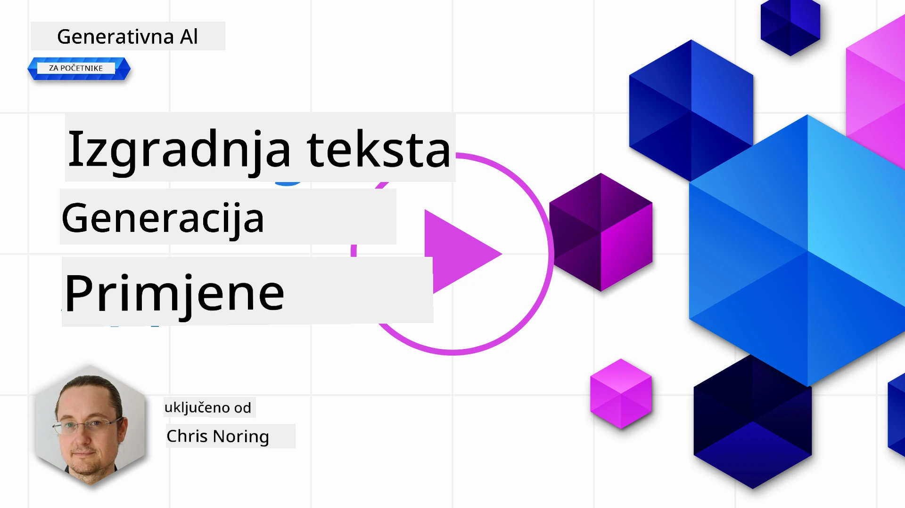

# Izgradnja aplikacija za generiranje teksta

[](https://youtu.be/0Y5Luf5sRQA?si=t_xVg0clnAI4oUFZ)

> _(Kliknite na gornju sliku da pogledate video ove lekcije)_

Do sada ste kroz ovaj kurikulum vidjeli da postoje osnovni pojmovi poput promptova i čak cijela disciplina zvana "inženjering promptova". Mnogi alati s kojima možete komunicirati kao što su ChatGPT, Office 365, Microsoft Power Platform i drugi podržavaju korištenje promptova za ostvarivanje nečega.

Da biste dodali takvo iskustvo u aplikaciju, potrebno je razumjeti pojmove poput promptova, dovršetaka i odabrati biblioteku za rad. Upravo to ćete naučiti u ovom poglavlju.

## Uvod

U ovom poglavlju ćete:

- Naučiti o biblioteci openai i njenim osnovnim konceptima.
- Izgraditi aplikaciju za generiranje teksta koristeći openai.
- Razumjeti kako koristiti pojmove poput prompta, temperature i tokena za izgradnju aplikacije za generiranje teksta.

## Ciljevi učenja

Na kraju ove lekcije, moći ćete:

- Objasniti što je aplikacija za generiranje teksta.
- Izgraditi aplikaciju za generiranje teksta koristeći openai.
- Konfigurirati svoju aplikaciju da koristi više ili manje tokena, kao i promijeniti temperaturu za raznoliki ishod.

## Što je aplikacija za generiranje teksta?

Obično kada gradite aplikaciju, ona ima neku vrstu sučelja kao što je sljedeće:

- Na naredbe. Konzolne aplikacije su tipične aplikacije gdje ukucate naredbu i ona izvršava zadatak. Na primjer, `git` je aplikacija bazirana na naredbama.
- Korisničko sučelje (UI). Neke aplikacije imaju grafičko korisničko sučelje (GUI) gdje kliknete gumbe, unosite tekst, birate opcije i slično.

### Konzolne i UI aplikacije su ograničene

Usporedite to s aplikacijom baziranom na naredbama gdje upisujete naredbu:

- **Ograničeno je**. Ne možete jednostavno upisati bilo koju naredbu, već samo one koje aplikacija podržava.
- **Specifično za jezik**. Neke aplikacije podržavaju mnoge jezike, ali po defaultu su napravljene za određeni jezik, iako možete dodati podršku za više jezika.

### Prednosti aplikacija za generiranje teksta

Pa, kako se aplikacija za generiranje teksta razlikuje?

U aplikaciji za generiranje teksta imate veću fleksibilnost, niste ograničeni na skup naredbi ili specifični ulazni jezik. Umjesto toga, možete koristiti prirodni jezik za interakciju s aplikacijom. Još jedna prednost je što već komunicirate s izvorom podataka koji je treniran na ogromnom korpusu informacija, dok je tradicionalna aplikacija mogla biti ograničena na ono što se nalazi u bazi podataka.

### Što mogu napraviti s aplikacijom za generiranje teksta?

Možete napraviti mnogo stvari. Na primjer:

- **Chatbot**. Chatbot koji odgovara na pitanja o temama poput vaše tvrtke i njenih proizvoda mogao bi biti dobar izbor.
- **Pomoćnik**. Veliki jezični modeli su izvrsni u stvarima poput sažimanja teksta, dobivanja uvida iz teksta, proizvodnje teksta kao što su životopisi i slično.
- **Asistent za kodiranje**. Ovisno o modelu jezika koji koristite, možete izgraditi asistenta za kodiranje koji vam pomaže pisati kod. Na primjer, možete koristiti proizvod poput GitHub Copilot kao i ChatGPT za pomoć u pisanju koda.

## Kako mogu započeti?

Pa, trebate pronaći način integracije s LLM-om što obično uključuje ove dvije pristupe:

- Koristiti API. Ovdje konstruirate web zahtjeve s vašim promptom i dobijate generirani tekst natrag.
- Koristiti biblioteku. Biblioteke pomažu enkapsulirati API pozive i olakšavaju njihovu upotrebu.

## Biblioteke/SDK-ovi

Postoji nekoliko dobro poznatih biblioteka za rad s LLM-ovima kao što su:

- **openai**, ova biblioteka olakšava povezivanje s vašim modelom i slanje promptova.

Zatim postoje biblioteke koje rade na višoj razini kao što su:

- **Langchain**. Langchain je dobro poznat i podržava Python.
- **Semantic Kernel**. Semantic Kernel je biblioteka tvrtke Microsoft koja podržava jezike C#, Python i Java.

## Prva aplikacija koristeći openai

Pogledajmo kako možemo izgraditi našu prvu aplikaciju, koje su biblioteke potrebne, koliko treba i tako dalje.

### Instalirajte openai

Postoji mnogo biblioteka za interakciju s OpenAI ili Azure OpenAI. Moguće je koristiti i brojne programske jezike kao što su C#, Python, JavaScript, Java i drugi. Odabrali smo koristiti Python biblioteku `openai`, stoga ćemo koristiti `pip` za instalaciju.

```bash
pip install openai
```

### Kreirajte resurs

Potrebno je izvršiti sljedeće korake:

- Napravite račun na Azure [https://azure.microsoft.com/free/](https://azure.microsoft.com/free/?WT.mc_id=academic-105485-koreyst).
- Dobijte pristup Azure OpenAI. Idite na [https://learn.microsoft.com/azure/ai-services/openai/overview#how-do-i-get-access-to-azure-openai](https://learn.microsoft.com/azure/ai-services/openai/overview#how-do-i-get-access-to-azure-openai?WT.mc_id=academic-105485-koreyst) i zatražite pristup.

  > [!NOTE]
  > U vrijeme pisanja, potrebno je podnijeti zahtjev za pristup Azure OpenAI.

- Instalirajte Python <https://www.python.org/>
- Napravili ste Azure OpenAI servisni resurs. Pogledajte ovaj vodič o tome kako [kreirati resurs](https://learn.microsoft.com/azure/ai-services/openai/how-to/create-resource?pivots=web-portal?WT.mc_id=academic-105485-koreyst).

### Pronađite API ključ i endpoint

Sada trebate reći vašoj `openai` biblioteci koji API ključ koristiti. Da biste pronašli svoj API ključ, idite u odjeljak "Keys and Endpoint" vašeg Azure OpenAI resursa i kopirajte vrijednost "Key 1".


Sad kad imate ove informacije kopirane, uputimo biblioteke da to koriste.

> [!NOTE]
> Vrijedi odvojiti vaš API ključ od koda. To možete učiniti korištenjem varijabli okoliša.
>
> - Postavite varijablu okoliša `OPENAI_API_KEY` na vaš API ključ.
>   `export OPENAI_API_KEY='sk-...'`

### Postavljanje konfiguracije za Azure

Ako koristite Azure OpenAI (sada dio Microsoft Foundry), ovako postavljate konfiguraciju. Koristimo standardni `OpenAI` klijent usmjeren na Azure OpenAI `/openai/v1/` endpoint, što radi s Responses API-jem i ne zahtijeva `api_version`:

```python
import os
from openai import OpenAI

client = OpenAI(
    api_key=os.environ["AZURE_OPENAI_API_KEY"],
    base_url=f"{os.environ['AZURE_OPENAI_ENDPOINT'].rstrip('/')}/openai/v1/",
)
```

Gore postavljamo sljedeće:

- `api_key`, to je vaš API ključ koji ste pronašli u Azure Portalu ili Microsoft Foundry portalu.
- `base_url`, to je endpoint vašeg Foundry resursa s dodanim `/openai/v1/`. Stabilni v1 endpoint radi na OpenAI i Azure OpenAI bez upravljanja `api_version`.

> [!NOTE] > `os.environ` čita varijable okoliša. Možete ga koristiti za čitanje varijabli okoliša poput `AZURE_OPENAI_API_KEY` i `AZURE_OPENAI_ENDPOINT`. Postavite ove varijable u vašem terminalu ili koristeći biblioteku poput `dotenv`.

## Generiranje teksta

Način generiranja teksta je korištenjem Responses API-ja preko metode `responses.create`. Evo primjera:

```python
prompt = "Complete the following: Once upon a time there was a"

response = client.responses.create(
    model="gpt-4o-mini",  # ovo je ime vaše implementacije modela
    input=prompt,
    store=False,
)
print(response.output_text)
```

U gore navedenom kodu, stvaramo odgovor i prosljeđujemo model koji želimo koristiti i prompt. Zatim ispisujemo generirani tekst preko `response.output_text`.

### Razgovori s više koraka

Responses API je vrlo prikladan za generiranje teksta u jednom koraku i za chatbotove s više koraka — pružate popis poruka u `input` za izgradnju razgovora:

```python
from openai import OpenAI

client = OpenAI(api_key="sk-...")

response = client.responses.create(model="gpt-4o-mini", input="Hello world", store=False)
print(response.output_text)
```

Više o ovoj funkcionalnosti u nadolazećem poglavlju.

## Vježba - vaša prva aplikacija za generiranje teksta

Sada kad smo naučili kako postaviti i konfigurirati openai, vrijeme je za izgradnju vaše prve aplikacije za generiranje teksta. Za izgradnju aplikacije slijedite ove korake:

1. Kreirajte virtualno okruženje i instalirajte openai:

   ```bash
   python -m venv venv
   source venv/bin/activate
   pip install openai
   ```

   > [!NOTE]
   > Ako koristite Windows, upišite `venv\Scripts\activate` umjesto `source venv/bin/activate`.

   > [!NOTE]
   > Pronađite svoj Azure OpenAI ključ tako da odete na [https://portal.azure.com/](https://portal.azure.com/?WT.mc_id=academic-105485-koreyst) i pretražite `Open AI`, zatim odaberete `Open AI resource` i potom `Keys and Endpoint`, te kopirate vrijednost `Key 1`.

1. Napravite datoteku _app.py_ i upišite sljedeći kod:

   ```python
   import os
   from openai import OpenAI

   client = OpenAI(
       api_key="<replace this value with your Azure OpenAI key>",
       base_url="<endpoint found in Azure Portal>/openai/v1/",
   )
   deployment_name = "<deployment name>"

   # dodajte svoj kod za dovršetak
   prompt = "Complete the following: Once upon a time there was a"

   # napravite zahtjev koristeći Responses API
   response = client.responses.create(model=deployment_name, input=prompt, store=False)

   # ispiši odgovor
   print(response.output_text)
   ```

   > [!NOTE]
   > Ako koristite obični OpenAI (ne Azure), koristite `client = OpenAI(api_key="<zamijenite ovu vrijednost svojim OpenAI ključem>")` (bez `base_url`) i proslijedite naziv modela poput `gpt-4o-mini` umjesto imena deploymenta.

   Trebali biste vidjeti izlaz poput sljedećeg:

   ```output
    very unhappy _____.

   Once upon a time there was a very unhappy mermaid.
   ```

## Različite vrste promptova za različite stvari

Sad ste vidjeli kako generirati tekst pomoću prompta. Imate čak i program koji radi i koji možete mijenjati da generira različite vrste teksta.

Promptovi se mogu koristiti za razne zadatke. Na primjer:

- **Generirati određenu vrstu teksta**. Na primjer, možete generirati pjesmu, pitanja za kviz i slično.
- **Pronaći informacije**. Možete koristiti promptove za traženje informacija poput primjera 'Što znači CORS u web razvoju?'.
- **Generirati kod**. Možete koristiti promptove za generiranje koda, na primjer za izradu regularnog izraza za validaciju emailova ili za generiranje cijelog programa, poput web aplikacije?

## Praktični slučaj: generator recepata

Zamislite da imate namirnice kod kuće i želite nešto skuhati. Za to vam treba recept. Jedan način da pronađete recepte je korištenje tražilice, ili možete upotrijebiti LLM za to.

Mogli biste napisati prompt ovako:

> "Pokaži mi 5 recepata za jelo s sljedećim sastojcima: piletina, krumpir i mrkva. Po receptu navedite sve korištene sastojke"

Na temelju gore navedenog prompta, mogli biste dobiti odgovor sličan:

```output
1. Roasted Chicken and Vegetables:
Ingredients:
- 4 chicken thighs
- 2 potatoes, cut into cubes
- 2 carrots, cut into cubes
- 2 tablespoons olive oil
- 2 cloves garlic, minced
- 1 teaspoon dried thyme
- 1 teaspoon dried oregano
- Salt and pepper, to taste

2. Chicken and Potato Stew:
Ingredients:
- 2 tablespoons olive oil
- 1 onion, diced
- 2 cloves garlic, minced
- 2 chicken breasts, cut into cubes
- 2 potatoes, cut into cubes
- 2 carrots, cut into cubes
- 1 teaspoon dried oregano
- 1 teaspoon dried thyme
- 1 cup chicken broth
- Salt and pepper, to taste

3. Chicken and Potato Bake:
Ingredients:
- 2 tablespoons olive oil
- 2 chicken breasts, cut into cubes
- 2 potatoes, cut into cubes
- 2 carrots, cut into cubes
- 1 onion, diced
- 2 cloves garlic, minced
- 1 teaspoon dried oregano
- 1 teaspoon dried thyme
- 1 cup chicken broth
- Salt and pepper, to taste

4. Chicken and Potato Soup:
Ingredients:
- 2 tablespoons olive oil
- 1 onion, diced
- 2 cloves garlic, minced
- 2 chicken breasts, cut into cubes
- 2 potatoes, cut into cubes
- 2 carrots, cut into cubes
- 1 teaspoon dried oregano
- 1 teaspoon dried thyme
- 4 cups chicken broth
- Salt and pepper, to taste

5. Chicken and Potato Hash:
Ingredients:
- 2 tablespoons olive oil
- 2 chicken breasts, cut into cubes
- 2 potatoes, cut into cubes
- 2 carrots, cut into cubes
- 1 onion, diced
- 2 cloves garlic, minced
- 1 teaspoon dried oregano
```

Ovaj ishod je dobar, znam što kuhati. U ovom trenutku, korisna poboljšanja mogu biti:

- Filtiranje sastojaka koje ne volim ili na koje sam alergičan.
- Izrada popisa za kupovinu, u slučaju da nemam sve sastojke kod kuće.

Za gore navedene slučajeve, dodajmo dodatni prompt:

> "Molim ukloni recepte s češnjakom jer sam alergičan i zamijeni ga s nečim drugim. Također, napravi popis za kupovinu za recepte, uzimajući u obzir da već imam piletinu, krumpir i mrkvu kod kuće."

Sada imate novi rezultat, naime:

```output
1. Roasted Chicken and Vegetables:
Ingredients:
- 4 chicken thighs
- 2 potatoes, cut into cubes
- 2 carrots, cut into cubes
- 2 tablespoons olive oil
- 1 teaspoon dried thyme
- 1 teaspoon dried oregano
- Salt and pepper, to taste

2. Chicken and Potato Stew:
Ingredients:
- 2 tablespoons olive oil
- 1 onion, diced
- 2 chicken breasts, cut into cubes
- 2 potatoes, cut into cubes
- 2 carrots, cut into cubes
- 1 teaspoon dried oregano
- 1 teaspoon dried thyme
- 1 cup chicken broth
- Salt and pepper, to taste

3. Chicken and Potato Bake:
Ingredients:
- 2 tablespoons olive oil
- 2 chicken breasts, cut into cubes
- 2 potatoes, cut into cubes
- 2 carrots, cut into cubes
- 1 onion, diced
- 1 teaspoon dried oregano
- 1 teaspoon dried thyme
- 1 cup chicken broth
- Salt and pepper, to taste

4. Chicken and Potato Soup:
Ingredients:
- 2 tablespoons olive oil
- 1 onion, diced
- 2 chicken breasts, cut into cubes
- 2 potatoes, cut into cubes
- 2 carrots, cut into cubes
- 1 teaspoon dried oregano
- 1 teaspoon dried thyme
- 4 cups chicken broth
- Salt and pepper, to taste

5. Chicken and Potato Hash:
Ingredients:
- 2 tablespoons olive oil
- 2 chicken breasts, cut into cubes
- 2 potatoes, cut into cubes
- 2 carrots, cut into cubes
- 1 onion, diced
- 1 teaspoon dried oregano

Shopping List:
- Olive oil
- Onion
- Thyme
- Oregano
- Salt
- Pepper
```

To su vaši pet recepata, bez spominjanja češnjaka i imate popis za kupovinu uzimajući u obzir što već imate kod kuće.

## Vježba - izgradite generator recepata

Sada kada smo odigrali scenarij, napišimo kod koji odgovara prikazanom scenariju. Za to slijedite ove korake:

1. Koristite postojeću datoteku _app.py_ kao početnu točku
1. Pronađite varijablu `prompt` i promijenite njen kod u sljedeće:

   ```python
   prompt = "Show me 5 recipes for a dish with the following ingredients: chicken, potatoes, and carrots. Per recipe, list all the ingredients used"
   ```

   Ako sad pokrenete kod, trebali biste vidjeti izlaz sličan ovom:

   ```output
   -Chicken Stew with Potatoes and Carrots: 3 tablespoons oil, 1 onion, chopped, 2 cloves garlic, minced, 1 carrot, peeled and chopped, 1 potato, peeled and chopped, 1 bay leaf, 1 thyme sprig, 1/2 teaspoon salt, 1/4 teaspoon black pepper, 1 1/2 cups chicken broth, 1/2 cup dry white wine, 2 tablespoons chopped fresh parsley, 2 tablespoons unsalted butter, 1 1/2 pounds boneless, skinless chicken thighs, cut into 1-inch pieces
   -Oven-Roasted Chicken with Potatoes and Carrots: 3 tablespoons extra-virgin olive oil, 1 tablespoon Dijon mustard, 1 tablespoon chopped fresh rosemary, 1 tablespoon chopped fresh thyme, 4 cloves garlic, minced, 1 1/2 pounds small red potatoes, quartered, 1 1/2 pounds carrots, quartered lengthwise, 1/2 teaspoon salt, 1/4 teaspoon black pepper, 1 (4-pound) whole chicken
   -Chicken, Potato, and Carrot Casserole: cooking spray, 1 large onion, chopped, 2 cloves garlic, minced, 1 carrot, peeled and shredded, 1 potato, peeled and shredded, 1/2 teaspoon dried thyme leaves, 1/4 teaspoon salt, 1/4 teaspoon black pepper, 2 cups fat-free, low-sodium chicken broth, 1 cup frozen peas, 1/4 cup all-purpose flour, 1 cup 2% reduced-fat milk, 1/4 cup grated Parmesan cheese

   -One Pot Chicken and Potato Dinner: 2 tablespoons olive oil, 1 pound boneless, skinless chicken thighs, cut into 1-inch pieces, 1 large onion, chopped, 3 cloves garlic, minced, 1 carrot, peeled and chopped, 1 potato, peeled and chopped, 1 bay leaf, 1 thyme sprig, 1/2 teaspoon salt, 1/4 teaspoon black pepper, 2 cups chicken broth, 1/2 cup dry white wine

   -Chicken, Potato, and Carrot Curry: 1 tablespoon vegetable oil, 1 large onion, chopped, 2 cloves garlic, minced, 1 carrot, peeled and chopped, 1 potato, peeled and chopped, 1 teaspoon ground coriander, 1 teaspoon ground cumin, 1/2 teaspoon ground turmeric, 1/2 teaspoon ground ginger, 1/4 teaspoon cayenne pepper, 2 cups chicken broth, 1/2 cup dry white wine, 1 (15-ounce) can chickpeas, drained and rinsed, 1/2 cup raisins, 1/2 cup chopped fresh cilantro
   ```

   > NAPOMENA, vaš LLM nije determinističan, pa možete dobiti različite rezultate svaki put kad pokrenete program.

   Super, pogledajmo kako možemo poboljšati stvari. Da bismo to učinili, želimo osigurati da je kod fleksibilan, pa se sastojci i broj recepata mogu mijenjati i nadograđivati.

1. Promijenimo kod na sljedeći način:

   ```python
   no_recipes = input("No of recipes (for example, 5): ")

   ingredients = input("List of ingredients (for example, chicken, potatoes, and carrots): ")

   # interpolirajte broj recepata u upit i sastojke
   prompt = f"Show me {no_recipes} recipes for a dish with the following ingredients: {ingredients}. Per recipe, list all the ingredients used"
   ```

   Izvođenje testa koda moglo bi izgledati ovako:

   ```output
   No of recipes (for example, 5): 3
   List of ingredients (for example, chicken, potatoes, and carrots): milk,strawberries

   -Strawberry milk shake: milk, strawberries, sugar, vanilla extract, ice cubes
   -Strawberry shortcake: milk, flour, baking powder, sugar, salt, unsalted butter, strawberries, whipped cream
   -Strawberry milk: milk, strawberries, sugar, vanilla extract
   ```

### Poboljšanje dodavanjem filtra i popisa za kupovinu

Sada imamo radnu aplikaciju kapaciteta za proizvodnju recepata i fleksibilna je jer ovisi o unosima korisnika, kako u broju recepata tako i u korištenim sastojcima.

Da bismo je dodatno poboljšali, želimo dodati sljedeće:

- **Filtrirajte sastojke**. Želimo moći filtrirati sastojke koje ne volimo ili smo alergični. Da bismo to postigli, možemo promijeniti postojeći prompt i dodati uvjet za filtriranje na njegov kraj na sljedeći način:

  ```python
  filter = input("Filter (for example, vegetarian, vegan, or gluten-free): ")

  prompt = f"Show me {no_recipes} recipes for a dish with the following ingredients: {ingredients}. Per recipe, list all the ingredients used, no {filter}"
  ```

  Gore dodajemo `{filter}` na kraj prompta i također bilježimo vrijednost filtera koju korisnik unosi.

  Primjer unosa pri pokretanju programa može izgledati ovako:

  ```output
  No of recipes (for example, 5): 3
  List of ingredients (for example, chicken, potatoes, and carrots): onion,milk
  Filter (for example, vegetarian, vegan, or gluten-free): no milk

  1. French Onion Soup

  Ingredients:

  -1 large onion, sliced
  -3 cups beef broth
  -1 cup milk
  -6 slices french bread
  -1/4 cup shredded Parmesan cheese
  -1 tablespoon butter
  -1 teaspoon dried thyme
  -1/4 teaspoon salt
  -1/4 teaspoon black pepper

  Instructions:

  1. In a large pot, sauté onions in butter until golden brown.
  2. Add beef broth, milk, thyme, salt, and pepper. Bring to a boil.
  3. Reduce heat and simmer for 10 minutes.
  4. Place french bread slices on soup bowls.
  5. Ladle soup over bread.
  6. Sprinkle with Parmesan cheese.

  2. Onion and Potato Soup

  Ingredients:

  -1 large onion, chopped
  -2 cups potatoes, diced
  -3 cups vegetable broth
  -1 cup milk
  -1/4 teaspoon black pepper

  Instructions:

  1. In a large pot, sauté onions in butter until golden brown.
  2. Add potatoes, vegetable broth, milk, and pepper. Bring to a boil.
  3. Reduce heat and simmer for 10 minutes.
  4. Serve hot.

  3. Creamy Onion Soup

  Ingredients:

  -1 large onion, chopped
  -3 cups vegetable broth
  -1 cup milk
  -1/4 teaspoon black pepper
  -1/4 cup all-purpose flour
  -1/2 cup shredded Parmesan cheese

  Instructions:

  1. In a large pot, sauté onions in butter until golden brown.
  2. Add vegetable broth, milk, and pepper. Bring to a boil.
  3. Reduce heat and simmer for 10 minutes.
  4. In a small bowl, whisk together flour and Parmesan cheese until smooth.
  5. Add to soup and simmer for an additional 5 minutes, or until soup has thickened.
  ```

  Kao što vidite, svi recepti s mlijekom su filtrirani. Ali, ako ste netolerantni na laktozu, možda ćete htjeti filtrirati i recepte sa sirom, pa je važno biti jasan.


- **Napravi listu za kupovinu**. Želimo napraviti listu za kupovinu, uzimajući u obzir ono što već imamo kod kuće.

  Za ovu funkcionalnost, mogli bismo pokušati riješiti sve u jednom promptu ili bismo ga mogli podijeliti u dva prompta. Pokušajmo s drugim pristupom. Ovdje predlažemo dodavanje dodatnog prompta, ali da bi to funkcioniralo, moramo dodati rezultat prvog prompta kao kontekst za drugi prompt.

  Pronađite dio koda koji ispisuje rezultat iz prvog prompta i dodajte sljedeći kod ispod:

  ```python
  old_prompt_result = response.output_text
  prompt = "Produce a shopping list for the generated recipes and please don't include ingredients that I already have."

  new_prompt = f"{old_prompt_result} {prompt}"
  response = client.responses.create(model=deployment_name, input=new_prompt, max_output_tokens=1200, store=False)

  # ispiši odgovor
  print("Shopping list:")
  print(response.output_text)
  ```

  Obratite pažnju na sljedeće:

  1. Konstruktoramo novi prompt tako da dodajemo rezultat iz prvog prompta u novi prompt:

     ```python
     new_prompt = f"{old_prompt_result} {prompt}"
     ```

  1. Izvršavamo novi zahtjev, pritom uzimajući u obzir broj tokena koje smo tražili u prvom promptu, tako da ovaj put kažemo `max_output_tokens` je 1200.

     ```python
     response = client.responses.create(model=deployment_name, input=new_prompt, max_output_tokens=1200, store=False)
     ```

     Isprobavajući ovaj kod, sada dolazimo do sljedećeg izlaza:

     ```output
     No of recipes (for example, 5): 2
     List of ingredients (for example, chicken, potatoes, and carrots): apple,flour
     Filter (for example, vegetarian, vegan, or gluten-free): sugar


     -Apple and flour pancakes: 1 cup flour, 1/2 tsp baking powder, 1/2 tsp baking soda, 1/4 tsp salt, 1 tbsp sugar, 1 egg, 1 cup buttermilk or sour milk, 1/4 cup melted butter, 1 Granny Smith apple, peeled and grated
     -Apple fritters: 1-1/2 cups flour, 1 tsp baking powder, 1/4 tsp salt, 1/4 tsp baking soda, 1/4 tsp nutmeg, 1/4 tsp cinnamon, 1/4 tsp allspice, 1/4 cup sugar, 1/4 cup vegetable shortening, 1/4 cup milk, 1 egg, 2 cups shredded, peeled apples
     Shopping list:
     -Flour, baking powder, baking soda, salt, sugar, egg, buttermilk, butter, apple, nutmeg, cinnamon, allspice
     ```

## Poboljšajte svoju postavku

Ono što imamo do sada je kod koji radi, ali postoje neka poboljšanja koja bismo trebali napraviti da stvari budu bolje. Neke stvari koje bismo trebali napraviti su:

- **Odvojite tajne od koda**, kao što je API ključ. Tajne ne pripadaju u kod i trebaju biti pohranjene na sigurno mjesto. Da bismo odvojili tajne od koda, možemo koristiti varijable okoline i biblioteke poput `python-dotenv` za učitavanje iz datoteke. Evo kako bi to izgledalo u kodu:

  1. Kreirajte `.env` datoteku sa sljedećim sadržajem:

     ```bash
     OPENAI_API_KEY=sk-...
     ```

     > Napomena, za Azure OpenAI u Microsoft Foundry, morate postaviti sljedeće varijable okoline umjesto toga:

     ```bash
     AZURE_OPENAI_API_KEY=<replace>
     AZURE_OPENAI_ENDPOINT=<replace>
     AZURE_OPENAI_API_VERSION=2024-10-21
     ```

     U kodu biste učitali varijable okoline ovako:

     ```python
     import os
     from dotenv import load_dotenv
     from openai import OpenAI

     load_dotenv()

     client = OpenAI(api_key=os.environ["OPENAI_API_KEY"])
     ```

- **Riječ o duljini tokena**. Trebali bismo razmotriti koliko tokena trebamo za generiranje teksta koji želimo. Tokeni koštaju novac, pa gdje je moguće, trebamo biti ekonomični s brojem tokena koje koristimo. Na primjer, možemo li formulirati prompt tako da koristimo manje tokena?

  Za promjenu broja korištenih tokena, možete koristiti parametar `max_output_tokens`. Na primjer, ako želite koristiti 100 tokena, učinili biste to ovako:

  ```python
  response = client.responses.create(model=deployment, input=prompt, max_output_tokens=100, store=False)
  ```

- **Eksperimentiranje s temperaturom**. Temperatura je nešto o čemu do sada nismo govorili, ali je važan aspekt u tome kako naš program funkcionira. Što je vrijednost temperature veća, to je izlaz nasumičniji. Suprotno tome, što je temperatura niža, izlaz je predvidljiviji. Razmislite želite li varijaciju u svom izlazu ili ne.

  Za promjenu temperature, možete koristiti parametar `temperature`. Na primjer, ako želite koristiti temperaturu 0.5, učinili biste to ovako:

  ```python
  response = client.responses.create(model=deployment, input=prompt, temperature=0.5, store=False)
  ```

  > Napomena, što je bliže 1.0, to je izlaz raznolikiji.

## Zadatak

Za ovaj zadatak možete odabrati što ćete izgraditi.

Evo nekoliko prijedloga:

- Doradite aplikaciju generatora recepata da je dodatno poboljšate. Eksperimentirajte s vrijednostima temperature i promptovima da vidite što možete smisliti.
- Napravite "studijskog druga". Ova aplikacija bi trebala moći odgovarati na pitanja o nekoj temi, na primjer Python, možete imati promptove poput "Što je određena tema u Pythonu?", ili prompt koji kaže, pokaži mi kod za određenu temu itd.
- Bot za povijest, oživite povijest, uputite bota da glumi određen povijesni lik i postavite mu pitanja o njegovom životu i vremenu.

## Rješenje

### Studijski drug

Ispod je početni prompt, pogledajte kako ga možete koristiti i prilagoditi prema svom ukusu.

```text
- "You're an expert on the Python language

    Suggest a beginner lesson for Python in the following format:

    Format:
    - concepts:
    - brief explanation of the lesson:
    - exercise in code with solutions"
```

### Bot za povijest

Evo nekoliko promptova koje biste mogli koristiti:

```text
- "You are Abe Lincoln, tell me about yourself in 3 sentences, and respond using grammar and words like Abe would have used"
- "You are Abe Lincoln, respond using grammar and words like Abe would have used:

   Tell me about your greatest accomplishments, in 300 words"
```

## Provjera znanja

Što radi pojam temperatura?

1. Kontrolira koliko je izlaz nasumičan.
1. Kontrolira koliko je odgovor velik.
1. Kontrolira koliko se tokena koristi.

## 🚀 Izazov

Kada radite na zadatku, pokušajte mijenjati temperaturu, postavite je na 0, 0.5 i 1. Zapamtite da je 0 najmanje varijabilna, a 1 najviše. Koja vrijednost najbolje funkcionira za vašu aplikaciju?

## Odličan posao! Nastavite sa učenjem

Nakon što završite ovu lekciju, pogledajte našu [Generativnu AI kolekciju za učenje](https://aka.ms/genai-collection?WT.mc_id=academic-105485-koreyst) da nastavite nadograđivati svoje znanje o generativnoj umjetnoj inteligenciji!

Pređite na Lekciju 7 gdje ćemo pogledati kako [izgraditi chat aplikacije](../07-building-chat-applications/README.md?WT.mc_id=academic-105485-koreyst)!

---

<!-- CO-OP TRANSLATOR DISCLAIMER START -->
**Napomena**:
Ovaj dokument je preveden korištenjem AI prevoditeljskog servisa [Co-op Translator](https://github.com/Azure/co-op-translator). Iako težimo točnosti, imajte na umu da automatski prijevodi mogu sadržavati greške ili netočnosti. Izvorni dokument na izvornom jeziku treba smatrati autoritativnim izvorom. Za važne informacije preporuča se profesionalni ljudski prijevod. Nismo odgovorni za bilo kakva nesporazumevanja ili pogrešne interpretacije koje proizlaze iz korištenja ovog prijevoda.
<!-- CO-OP TRANSLATOR DISCLAIMER END -->