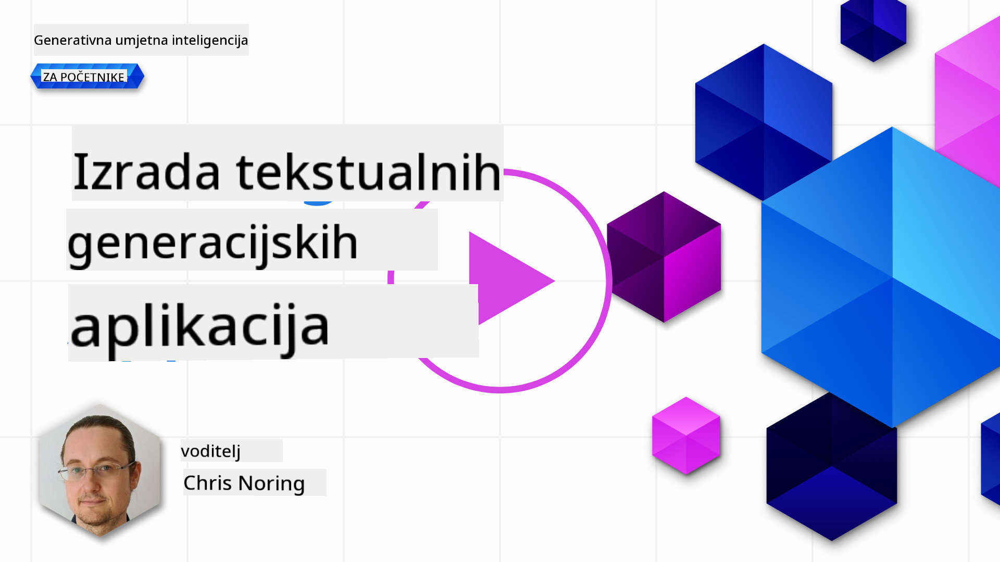

<!--
CO_OP_TRANSLATOR_METADATA:
{
  "original_hash": "df027997f1448323d6159b78a1b669bf",
  "translation_date": "2025-10-18T01:28:48+00:00",
  "source_file": "06-text-generation-apps/README.md",
  "language_code": "hr"
}
-->
# Izrada aplikacija za generiranje teksta

[](https://youtu.be/0Y5Luf5sRQA?si=t_xVg0clnAI4oUFZ)

> _(Kliknite na sliku iznad za pregled videa ove lekcije)_

Do sada ste kroz ovaj kurikulum vidjeli da postoje osnovni koncepti poput upita (prompts) i 캜ak cijela disciplina nazvana "in쬰njering upita". Mnogi alati s kojima mo쬰te komunicirati, poput ChatGPT-a, Office 365, Microsoft Power Platforma i drugih, omogu캖uju vam kori코tenje upita za postizanje odre캠enih ciljeva.

Da biste dodali takvo iskustvo u aplikaciju, trebate razumjeti koncepte poput upita, dovr코etaka (completions) i odabrati biblioteku s kojom 캖ete raditi. Upravo to 캖ete nau캜iti u ovom poglavlju.

## Uvod

U ovom poglavlju 캖ete:

- Nau캜iti o biblioteci openai i njezinim osnovnim konceptima.
- Izraditi aplikaciju za generiranje teksta koriste캖i openai.
- Razumjeti kako koristiti koncepte poput upita, temperature i tokena za izradu aplikacije za generiranje teksta.

## Ciljevi u캜enja

Na kraju ove lekcije, mo캖i 캖ete:

- Objasniti 코to je aplikacija za generiranje teksta.
- Izraditi aplikaciju za generiranje teksta koriste캖i openai.
- Konfigurirati svoju aplikaciju za kori코tenje vi코e ili manje tokena te promijeniti temperaturu za raznolike rezultate.

## 맚o je aplikacija za generiranje teksta?

Obi캜no kada izra캠ujete aplikaciju, ona ima neku vrstu su캜elja poput sljede캖eg:

- Temeljeno na naredbama. Konzolne aplikacije su tipi캜ne aplikacije gdje upisujete naredbu i ona izvr코ava zadatak. Na primjer, `git` je aplikacija temeljena na naredbama.
- Korisni캜ko su캜elje (UI). Neke aplikacije imaju grafi캜ka korisni캜ka su캜elja (GUI) gdje klikate gumbe, unosite tekst, birate opcije i sli캜no.

### Ograni캜enja konzolnih i UI aplikacija

Usporedite to s aplikacijom temeljenom na naredbama gdje upisujete naredbu:

- **Ograni캜eno je**. Ne mo쬰te upisati bilo koju naredbu, ve캖 samo one koje aplikacija podr쬬va.
- **Specifi캜no za jezik**. Neke aplikacije podr쬬vaju mnoge jezike, ali u osnovi su izra캠ene za odre캠eni jezik, 캜ak i ako mo쬰te dodati podr코ku za vi코e jezika.

### Prednosti aplikacija za generiranje teksta

Kako se onda aplikacija za generiranje teksta razlikuje?

U aplikaciji za generiranje teksta imate vi코e fleksibilnosti, niste ograni캜eni na skup naredbi ili odre캠eni ulazni jezik. Umjesto toga, mo쬰te koristiti prirodni jezik za interakciju s aplikacijom. Jo코 jedna prednost je 코to ve캖 komunicirate s izvorom podataka koji je treniran na velikom korpusu informacija, dok je tradicionalna aplikacija mo쬯a ograni캜ena na ono 코to se nalazi u bazi podataka.

### 맚o mogu izraditi s aplikacijom za generiranje teksta?

Mo쬰te izraditi mnogo toga. Na primjer:

- **Chatbot**. Chatbot koji odgovara na pitanja o temama, poput va코e tvrtke i njezinih proizvoda, mogao bi biti dobar izbor.
- **Pomo캖nik**. LLM-ovi su izvrsni u stvarima poput sa쬴manja teksta, dobivanja uvida iz teksta, stvaranja teksta poput 쬴votopisa i sli캜no.
- **Asistent za kodiranje**. Ovisno o modelu jezika koji koristite, mo쬰te izraditi asistenta za kodiranje koji vam poma쬰 pisati kod. Na primjer, mo쬰te koristiti proizvod poput GitHub Copilot-a ili ChatGPT-a za pomo캖 pri pisanju koda.

## Kako po캜eti?

Treba prona캖i na캜in za integraciju s LLM-om, 코to obi캜no uklju캜uje sljede캖a dva pristupa:

- Koristite API. Ovdje konstruirate web zahtjeve s va코im upitom i dobivate generirani tekst natrag.
- Koristite biblioteku. Biblioteke poma쬿 u enkapsulaciji API poziva i olak코avaju njihovo kori코tenje.

## Biblioteke/SDK-ovi

Postoji nekoliko poznatih biblioteka za rad s LLM-ovima, poput:

- **openai**, ova biblioteka olak코ava povezivanje s va코im modelom i slanje upita.

Zatim postoje biblioteke koje djeluju na vi코oj razini, poput:

- **Langchain**. Langchain je poznat i podr쬬va Python.
- **Semantic Kernel**. Semantic Kernel je biblioteka tvrtke Microsoft koja podr쬬va jezike C#, Python i Java.

## Prva aplikacija koriste캖i openai

Pogledajmo kako mo쬰mo izraditi na코u prvu aplikaciju, koje biblioteke trebamo, koliko je potrebno i tako dalje.

### Instalacija openai

Postoji mnogo biblioteka za interakciju s OpenAI ili Azure OpenAI. Mogu캖e je koristiti brojne programske jezike poput C#, Python, JavaScript, Java i drugih. Odabrali smo koristiti Python biblioteku `openai`, pa 캖emo je instalirati pomo캖u `pip`.

```bash
pip install openai
```

### Kreiranje resursa

Potrebno je izvr코iti sljede캖e korake:

- Kreirajte ra캜un na Azure [https://azure.microsoft.com/free/](https://azure.microsoft.com/free/?WT.mc_id=academic-105485-koreyst).
- Dobijte pristup Azure OpenAI. Idite na [https://learn.microsoft.com/azure/ai-services/openai/overview#how-do-i-get-access-to-azure-openai](https://learn.microsoft.com/azure/ai-services/openai/overview#how-do-i-get-access-to-azure-openai?WT.mc_id=academic-105485-koreyst) i zatra쬴te pristup.

  > [!NOTE]
  > U trenutku pisanja, potrebno je podnijeti zahtjev za pristup Azure OpenAI.

- Instalirajte Python <https://www.python.org/>
- Kreirajte resurs za Azure OpenAI Service. Pogledajte ovaj vodi캜 kako [kreirati resurs](https://learn.microsoft.com/azure/ai-services/openai/how-to/create-resource?pivots=web-portal?WT.mc_id=academic-105485-koreyst).

### Pronala쬰nje API klju캜a i krajnje to캜ke

Sada trebate re캖i svojoj `openai` biblioteci koji API klju캜 koristiti. Da biste prona코li svoj API klju캜, idite na odjeljak "Keys and Endpoint" u va코em Azure OpenAI resursu i kopirajte vrijednost "Key 1".


Sada kada ste kopirali ove informacije, uputimo biblioteke da ih koriste.

> [!NOTE]
> Vrijedi odvojiti va코 API klju캜 od koda. To mo쬰te u캜initi pomo캖u varijabli okru쬰nja.
>
> - Postavite varijablu okru쬰nja `OPENAI_API_KEY` na va코 API klju캜.
>   `export OPENAI_API_KEY='sk-...'`

### Postavljanje konfiguracije za Azure

Ako koristite Azure OpenAI, evo kako postaviti konfiguraciju:

```python
openai.api_type = 'azure'
openai.api_key = os.environ["OPENAI_API_KEY"]
openai.api_version = '2023-05-15'
openai.api_base = os.getenv("API_BASE")
```

Ovdje postavljamo sljede캖e:

- `api_type` na `azure`. Ovo govori biblioteci da koristi Azure OpenAI, a ne OpenAI.
- `api_key`, ovo je va코 API klju캜 prona캠en u Azure Portalu.
- `api_version`, ovo je verzija API-ja koju 쬰lite koristiti. U trenutku pisanja, najnovija verzija je `2023-05-15`.
- `api_base`, ovo je krajnja to캜ka API-ja. Mo쬰te je prona캖i u Azure Portalu pored va코eg API klju캜a.

> [!NOTE] > `os.getenv` je funkcija koja 캜ita varijable okru쬰nja. Mo쬰te je koristiti za 캜itanje varijabli okru쬰nja poput `OPENAI_API_KEY` i `API_BASE`. Postavite ove varijable okru쬰nja u svom terminalu ili pomo캖u biblioteke poput `dotenv`.

## Generiranje teksta

Na캜in generiranja teksta je kori코tenje klase `Completion`. Evo primjera:

```python
prompt = "Complete the following: Once upon a time there was a"

completion = openai.Completion.create(model="davinci-002", prompt=prompt)
print(completion.choices[0].text)
```

U gornjem kodu kreiramo objekt za dovr코avanje i proslje캠ujemo model koji 쬰limo koristiti i upit. Zatim ispisujemo generirani tekst.

### Dovr코avanje razgovora

Do sada ste vidjeli kako koristimo `Completion` za generiranje teksta. No, postoji jo코 jedna klasa nazvana `ChatCompletion` koja je prikladnija za chatbotove. Evo primjera kako je koristiti:

```python
import openai

openai.api_key = "sk-..."

completion = openai.ChatCompletion.create(model="gpt-3.5-turbo", messages=[{"role": "user", "content": "Hello world"}])
print(completion.choices[0].message.content)
```

Vi코e o ovoj funkcionalnosti u nadolaze캖em poglavlju.

## Vje쬭a - va코a prva aplikacija za generiranje teksta

Sada kada smo nau캜ili kako postaviti i konfigurirati openai, vrijeme je da izradimo va코u prvu aplikaciju za generiranje teksta. Da biste izradili svoju aplikaciju, slijedite ove korake:

1. Kreirajte virtualno okru쬰nje i instalirajte openai:

   ```bash
   python -m venv venv
   source venv/bin/activate
   pip install openai
   ```

   > [!NOTE]
   > Ako koristite Windows, upi코ite `venv\Scripts\activate` umjesto `source venv/bin/activate`.

   > [!NOTE]
   > Prona캠ite svoj Azure OpenAI klju캜 tako da odete na [https://portal.azure.com/](https://portal.azure.com/?WT.mc_id=academic-105485-koreyst), potra쬴te `Open AI` i odaberete resurs `Open AI`, zatim odaberite `Keys and Endpoint` i kopirajte vrijednost `Key 1`.

1. Kreirajte datoteku _app.py_ i dodajte sljede캖i kod:

   ```python
   import openai

   openai.api_key = "<replace this value with your open ai key or Azure OpenAI key>"

   openai.api_type = 'azure'
   openai.api_version = '2023-05-15'
   openai.api_base = "<endpoint found in Azure Portal where your API key is>"
   deployment_name = "<deployment name>"

   # add your completion code
   prompt = "Complete the following: Once upon a time there was a"
   messages = [{"role": "user", "content": prompt}]

   # make completion
   completion = openai.chat.completions.create(model=deployment_name, messages=messages)

   # print response
   print(completion.choices[0].message.content)
   ```

   > [!NOTE]
   > Ako koristite Azure OpenAI, trebate postaviti `api_type` na `azure` i postaviti `api_key` na va코 Azure OpenAI klju캜.

   Trebali biste vidjeti izlaz sli캜an sljede캖em:

   ```output
    very unhappy _____.

   Once upon a time there was a very unhappy mermaid.
   ```

## Razli캜ite vrste upita za razli캜ite zadatke

Sada ste vidjeli kako generirati tekst koriste캖i upit. 캛ak imate program koji radi i koji mo쬰te mijenjati kako biste generirali razli캜ite vrste teksta.

Upiti se mogu koristiti za razne zadatke. Na primjer:

- **Generiranje vrste teksta**. Na primjer, mo쬰te generirati pjesmu, pitanja za kviz itd.
- **Pretra쬴vanje informacija**. Mo쬰te koristiti upite za tra쬰nje informacija, poput sljede캖eg primjera '맚o zna캜i CORS u web razvoju?'.
- **Generiranje koda**. Mo쬰te koristiti upite za generiranje koda, na primjer za razvoj regularnog izraza koji se koristi za validaciju e-mailova ili za코to ne generirati cijeli program, poput web aplikacije?

## Prakti캜niji primjer: generator recepata

Zamislite da imate sastojke kod ku캖e i 쬰lite ne코to skuhati. Za to vam je potreban recept. Jedan na캜in pronala쬰nja recepata je kori코tenje tra쬴lice ili mo쬰te koristiti LLM za to.

Mo쬰te napisati upit poput sljede캖eg:

> "Prika쬴 mi 5 recepata za jelo s sljede캖im sastojcima: piletina, krumpir i mrkva. Za svaki recept, navedite sve kori코tene sastojke."

S obzirom na gornji upit, mogli biste dobiti odgovor sli캜an:

```output
1. Roasted Chicken and Vegetables:
Ingredients:
- 4 chicken thighs
- 2 potatoes, cut into cubes
- 2 carrots, cut into cubes
- 2 tablespoons olive oil
- 2 cloves garlic, minced
- 1 teaspoon dried thyme
- 1 teaspoon dried oregano
- Salt and pepper, to taste

2. Chicken and Potato Stew:
Ingredients:
- 2 tablespoons olive oil
- 1 onion, diced
- 2 cloves garlic, minced
- 2 chicken breasts, cut into cubes
- 2 potatoes, cut into cubes
- 2 carrots, cut into cubes
- 1 teaspoon dried oregano
- 1 teaspoon dried thyme
- 1 cup chicken broth
- Salt and pepper, to taste

3. Chicken and Potato Bake:
Ingredients:
- 2 tablespoons olive oil
- 2 chicken breasts, cut into cubes
- 2 potatoes, cut into cubes
- 2 carrots, cut into cubes
- 1 onion, diced
- 2 cloves garlic, minced
- 1 teaspoon dried oregano
- 1 teaspoon dried thyme
- 1 cup chicken broth
- Salt and pepper, to taste

4. Chicken and Potato Soup:
Ingredients:
- 2 tablespoons olive oil
- 1 onion, diced
- 2 cloves garlic, minced
- 2 chicken breasts, cut into cubes
- 2 potatoes, cut into cubes
- 2 carrots, cut into cubes
- 1 teaspoon dried oregano
- 1 teaspoon dried thyme
- 4 cups chicken broth
- Salt and pepper, to taste

5. Chicken and Potato Hash:
Ingredients:
- 2 tablespoons olive oil
- 2 chicken breasts, cut into cubes
- 2 potatoes, cut into cubes
- 2 carrots, cut into cubes
- 1 onion, diced
- 2 cloves garlic, minced
- 1 teaspoon dried oregano
```

Ovaj rezultat je odli캜an, znam 코to mogu skuhati. U ovom trenutku, korisna pobolj코anja mogla bi biti:

- Filtriranje sastojaka koje ne volim ili na koje sam alergi캜an.
- Izrada popisa za kupovinu, u slu캜aju da nemam sve sastojke kod ku캖e.

Za gore navedene slu캜ajeve, dodajmo dodatni upit:

> "Molim te ukloni recepte s 캜e코njakom jer sam alergi캜an i zamijeni ga ne캜im drugim. Tako캠er, izradi popis za kupovinu za recepte, uzimaju캖i u obzir da ve캖 imam piletinu, krumpir i mrkvu kod ku캖e."

Sada imate novi rezultat, naime:

```output
1. Roasted Chicken and Vegetables:
Ingredients:
- 4 chicken thighs
- 2 potatoes, cut into cubes
- 2 carrots, cut into cubes
- 2 tablespoons olive oil
- 1 teaspoon dried thyme
- 1 teaspoon dried oregano
- Salt and pepper, to taste

2. Chicken and Potato Stew:
Ingredients:
- 2 tablespoons olive oil
- 1 onion, diced
- 2 chicken breasts, cut into cubes
- 2 potatoes, cut into cubes
- 2 carrots, cut into cubes
- 1 teaspoon dried oregano
- 1 teaspoon dried thyme
- 1 cup chicken broth
- Salt and pepper, to taste

3. Chicken and Potato Bake:
Ingredients:
- 2 tablespoons olive oil
- 2 chicken breasts, cut into cubes
- 2 potatoes, cut into cubes
- 2 carrots, cut into cubes
- 1 onion, diced
- 1 teaspoon dried oregano
- 1 teaspoon dried thyme
- 1 cup chicken broth
- Salt and pepper, to taste

4. Chicken and Potato Soup:
Ingredients:
- 2 tablespoons olive oil
- 1 onion, diced
- 2 chicken breasts, cut into cubes
- 2 potatoes, cut into cubes
- 2 carrots, cut into cubes
- 1 teaspoon dried oregano
- 1 teaspoon dried thyme
- 4 cups chicken broth
- Salt and pepper, to taste

5. Chicken and Potato Hash:
Ingredients:
- 2 tablespoons olive oil
- 2 chicken breasts, cut into cubes
- 2 potatoes, cut into cubes
- 2 carrots, cut into cubes
- 1 onion, diced
- 1 teaspoon dried oregano

Shopping List:
- Olive oil
- Onion
- Thyme
- Oregano
- Salt
- Pepper
```

To su va코ih pet recepata, bez spominjanja 캜e코njaka, a tako캠er imate i popis za kupovinu uzimaju캖i u obzir ono 코to ve캖 imate kod ku캖e.

## Vje쬭a - izradite generator recepata

Sada kada smo razradili scenarij, napi코imo kod koji odgovara prikazanom scenariju. Da bismo to u캜inili, slijedite ove korake:

1. Koristite postoje캖u datoteku _app.py_ kao po캜etnu to캜ku.
1. Prona캠ite varijablu `prompt` i promijenite njezin kod u sljede캖i:

   ```python
   prompt = "Show me 5 recipes for a dish with the following ingredients: chicken, potatoes, and carrots. Per recipe, list all the ingredients used"
   ```

   Ako sada pokrenete kod, trebali biste vidjeti izlaz sli캜an:

   ```output
   -Chicken Stew with Potatoes and Carrots: 3 tablespoons oil, 1 onion, chopped, 2 cloves garlic, minced, 1 carrot, peeled and chopped, 1 potato, peeled and chopped, 1 bay leaf, 1 thyme sprig, 1/2 teaspoon salt, 1/4 teaspoon black pepper, 1 1/2 cups chicken broth, 1/2 cup dry white wine, 2 tablespoons chopped fresh parsley, 2 tablespoons unsalted butter, 1 1/2 pounds boneless, skinless chicken thighs, cut into 1-inch pieces
   -Oven-Roasted Chicken with Potatoes and Carrots: 3 tablespoons extra-virgin olive oil, 1 tablespoon Dijon mustard, 1 tablespoon chopped fresh rosemary, 1 tablespoon chopped fresh thyme, 4 cloves garlic, minced, 1 1/2 pounds small red potatoes, quartered, 1 1/2 pounds carrots, quartered lengthwise, 1/2 teaspoon salt, 1/4 teaspoon black pepper, 1 (4-pound) whole chicken
   -Chicken, Potato, and Carrot Casserole: cooking spray, 1 large onion, chopped, 2 cloves garlic, minced, 1 carrot, peeled and shredded, 1 potato, peeled and shredded, 1/2 teaspoon dried thyme leaves, 1/4 teaspoon salt, 1/4 teaspoon black pepper, 2 cups fat-free, low-sodium chicken broth, 1 cup frozen peas, 1/4 cup all-purpose flour, 1 cup 2% reduced-fat milk, 1/4 cup grated Parmesan cheese

   -One Pot Chicken and Potato Dinner: 2 tablespoons olive oil, 1 pound boneless, skinless chicken thighs, cut into 1-inch pieces, 1 large onion, chopped, 3 cloves garlic, minced, 1 carrot, peeled and chopped, 1 potato, peeled and chopped, 1 bay leaf, 1 thyme sprig, 1/2 teaspoon salt, 1/4 teaspoon black pepper, 2 cups chicken broth, 1/2 cup dry white wine

   -Chicken, Potato, and Carrot Curry: 1 tablespoon vegetable oil, 1 large onion, chopped, 2 cloves garlic, minced, 1 carrot, peeled and chopped, 1 potato, peeled and chopped, 1 teaspoon ground coriander, 1 teaspoon ground cumin, 1/2 teaspoon ground turmeric, 1/2 teaspoon ground ginger, 1/4 teaspoon cayenne pepper, 2 cups chicken broth, 1/2 cup dry white wine, 1 (15-ounce) can chickpeas, drained and rinsed, 1/2 cup raisins, 1/2 cup chopped fresh cilantro
   ```

   > NAPOMENA, va코 LLM je nedeterministi캜ki, pa mo쬰te dobiti razli캜ite rezultate svaki put kad pokrenete program.

   Odli캜no, pogledajmo kako mo쬰mo pobolj코ati stvari. Da bismo pobolj코ali stvari, 쬰limo osigurati da je kod fleksibilan, tako da se sastojci i broj recepata mogu mijenjati.

1. Promijenimo kod na sljede캖i na캜in:

   ```python
   no_recipes = input("No of recipes (for example, 5): ")

   ingredients = input("List of ingredients (for example, chicken, potatoes, and carrots): ")

   # interpolate the number of recipes into the prompt an ingredients
   prompt = f"Show me {no_recipes} recipes for a dish with the following ingredients: {ingredients}. Per recipe, list all the ingredients used"
   ```

   Testiranje koda moglo bi izgledati ovako:

   ```output
   No of recipes (for example, 5): 3
   List of ingredients (for example, chicken, potatoes, and carrots): milk,strawberries

   -Strawberry milk shake: milk, strawberries, sugar, vanilla extract, ice cubes
   -Strawberry shortcake: milk, flour, baking powder, sugar, salt, unsalted butter, strawberries, whipped cream
   -Strawberry milk: milk, strawberries, sugar, vanilla extract
   ```

### Pobolj코anje dodavanjem filtera i popisa za kupovinu

Sada imamo funkcionalnu aplikaciju sposobnu za izradu recepata, a fleksibilna je jer se oslanja na unos korisnika, kako u pogledu broja recepata, tako i sastojaka koji se koriste.

Da bismo je dodatno pobolj코ali, 쬰limo dodati sljede캖e:

- **Filtriranje sastojaka**. 콯elimo biti u mogu캖nosti filtrirati sastojke koje ne volimo ili na koje smo alergi캜ni. Da bismo to postigli, mo쬰mo urediti na코 postoje캖i upit i dodati uvjet za filtriranje na njegov kraj, kao 코to je prikazano:

  ```python
  filter = input("Filter (for example, vegetarian, vegan, or gluten-free): ")

  prompt = f"Show me {no_recipes} recipes for a dish with the following ingredients: {ingredients}. Per recipe, list all the ingredients used, no {filter}"
  ```

  Gore dodajemo `{filter}` na kraj upita i tako캠er bilje쬴mo vrijednost filtera od korisnika.

  Primjer unosa prilikom pokretanja programa sada mo쬰 izgledati ovako:

  ```output
  No of recipes (for example, 5): 3
  List of ingredients (for example, chicken, potatoes, and carrots): onion,milk
  Filter (for example, vegetarian, vegan, or gluten-free): no milk

  1. French Onion Soup

  Ingredients:

  -1 large onion, sliced
  -3 cups beef broth
  -1 cup milk
  -6 slices french bread
  -1/4 cup shredded Parmesan cheese
  -1 tablespoon butter
  -1 teaspoon dried thyme
  -1/4 teaspoon salt
  -1/4 teaspoon black pepper

  Instructions:

  1. In a large pot, saut칠 onions in butter until golden brown.
  2. Add beef broth, milk, thyme, salt, and pepper. Bring to a boil.
  3. Reduce heat and simmer for 10 minutes.
  4. Place french bread slices on soup bowls.
  5. Ladle soup over bread.
  6. Sprinkle with Parmesan cheese.

  2. Onion and Potato Soup

  Ingredients:

  -1 large onion, chopped
  -2 cups potatoes, diced
  -3 cups vegetable broth
  -1 cup milk
  -1/4 teaspoon black pepper

  Instructions:

  1. In a large pot, saut칠 onions in butter until golden brown.
  2. Add potatoes, vegetable broth, milk, and pepper. Bring to a boil.
  3. Reduce heat and simmer for 10 minutes.
  4. Serve hot.

  3. Creamy Onion Soup

  Ingredients:

  -1 large onion, chopped
  -3 cups vegetable broth
  -1 cup milk
  -1/4 teaspoon black pepper
  -1/4 cup all-purpose flour
  -1/2 cup shredded Parmesan cheese

  Instructions:

  1. In a large pot, saut칠 onions in butter until golden brown.
  2. Add vegetable broth, milk, and pepper. Bring to a boil.
  3. Reduce heat and simmer for 10 minutes.
  4. In a small bowl, whisk together flour and Parmesan cheese until smooth.
  5. Add to soup and simmer for an additional 5 minutes, or until soup has thickened.
  ```

  Kao 코to mo쬰te vidjeti, svi recepti s mlijekom su filtrirani. No, ako ste netolerantni na laktozu, mo쬯a 캖ete htjeti filtrirati i recepte s sirom, pa je potrebno biti jasan.

- **Izrada popisa za kupovinu**. 콯elimo izraditi popis za kupovinu, uzimaju캖i u obzir ono 코to ve캖 imamo kod ku캖e.

  Za ovu funkcionalnost mogli bismo poku코ati rije코iti sve u jednom upitu ili bismo to mogli podijeliti u dva upita. Poku코ajmo s drugim pristupom. Ovdje predla쬰mo dodavanje dodatnog upita, ali da bi to funkcioniralo, trebamo dodati rezultat prvog upita kao kontekst za drugi upit.

  Prona캠ite dio u kodu koji ispisuje rezultat prvog upita i dodajte sljede캖i kod ispod:
  ```python
  old_prompt_result = completion.choices[0].message.content
  prompt = "Produce a shopping list for the generated recipes and please don't include ingredients that I already have."

  new_prompt = f"{old_prompt_result} {prompt}"
  messages = [{"role": "user", "content": new_prompt}]
  completion = openai.Completion.create(engine=deployment_name, messages=messages, max_tokens=1200)

  # print response
  print("Shopping list:")
  print(completion.choices[0].message.content)
  ```

  Obratite pa쬹ju na sljede캖e:

  1. Kreiramo novi prompt dodavanjem rezultata iz prvog prompta u novi prompt:

     ```python
     new_prompt = f"{old_prompt_result} {prompt}"
     ```

  1. Postavljamo novi zahtjev, ali tako캠er uzimamo u obzir broj tokena koji smo tra쬴li u prvom promptu, pa ovaj put postavljamo `max_tokens` na 1200.

     ```python
     completion = openai.Completion.create(engine=deployment_name, prompt=new_prompt, max_tokens=1200)
     ```

     Isprobavaju캖i ovaj kod, dolazimo do sljede캖eg rezultata:

     ```output
     No of recipes (for example, 5): 2
     List of ingredients (for example, chicken, potatoes, and carrots): apple,flour
     Filter (for example, vegetarian, vegan, or gluten-free): sugar


     -Apple and flour pancakes: 1 cup flour, 1/2 tsp baking powder, 1/2 tsp baking soda, 1/4 tsp salt, 1 tbsp sugar, 1 egg, 1 cup buttermilk or sour milk, 1/4 cup melted butter, 1 Granny Smith apple, peeled and grated
     -Apple fritters: 1-1/2 cups flour, 1 tsp baking powder, 1/4 tsp salt, 1/4 tsp baking soda, 1/4 tsp nutmeg, 1/4 tsp cinnamon, 1/4 tsp allspice, 1/4 cup sugar, 1/4 cup vegetable shortening, 1/4 cup milk, 1 egg, 2 cups shredded, peeled apples
     Shopping list:
     -Flour, baking powder, baking soda, salt, sugar, egg, buttermilk, butter, apple, nutmeg, cinnamon, allspice
     ```

## Pobolj코ajte svoju postavku

Ono 코to imamo do sada je kod koji radi, ali postoje neke prilagodbe koje bismo trebali napraviti kako bismo dodatno pobolj코ali stvari. Neke od stvari koje bismo trebali u캜initi su:

- **Odvojite tajne od koda**, poput API klju캜a. Tajne ne pripadaju kodu i trebale bi se 캜uvati na sigurnom mjestu. Kako bismo odvojili tajne od koda, mo쬰mo koristiti varijable okru쬰nja i biblioteke poput `python-dotenv` za u캜itavanje iz datoteke. Evo kako bi to izgledalo u kodu:

  1. Kreirajte `.env` datoteku sa sljede캖im sadr쬬jem:

     ```bash
     OPENAI_API_KEY=sk-...
     ```

     > Napomena, za Azure, trebate postaviti sljede캖e varijable okru쬰nja:

     ```bash
     OPENAI_API_TYPE=azure
     OPENAI_API_VERSION=2023-05-15
     OPENAI_API_BASE=<replace>
     ```

     U kodu biste u캜itali varijable okru쬰nja na sljede캖i na캜in:

     ```python
     from dotenv import load_dotenv

     load_dotenv()

     openai.api_key = os.environ["OPENAI_API_KEY"]
     ```

- **Rije캜 o duljini tokena**. Trebali bismo razmotriti koliko tokena trebamo za generiranje teksta koji 쬰limo. Tokeni ko코taju novac, pa gdje god je mogu캖e, trebali bismo poku코ati biti ekonomi캜ni s brojem tokena koje koristimo. Na primjer, mo쬰mo li formulirati prompt tako da koristimo manje tokena?

  Za promjenu broja kori코tenih tokena, mo쬰te koristiti parametar `max_tokens`. Na primjer, ako 쬰lite koristiti 100 tokena, u캜inili biste sljede캖e:

  ```python
  completion = client.chat.completions.create(model=deployment, messages=messages, max_tokens=100)
  ```

- **Eksperimentiranje s temperaturom**. Temperatura je ne코to 코to dosad nismo spomenuli, ali je va쬬n kontekst za na캜in na koji na코 program funkcionira. 맚o je vi코a vrijednost temperature, to 캖e izlaz biti nasumi캜niji. Suprotno tome, 코to je ni쬬 vrijednost temperature, to 캖e izlaz biti predvidljiviji. Razmislite 쬰lite li varijaciju u svom izlazu ili ne.

  Za promjenu temperature, mo쬰te koristiti parametar `temperature`. Na primjer, ako 쬰lite koristiti temperaturu od 0.5, u캜inili biste sljede캖e:

  ```python
  completion = client.chat.completions.create(model=deployment, messages=messages, temperature=0.5)
  ```

  > Napomena, 코to je bli쬰 1.0, to je izlaz raznovrsniji.

## Zadatak

Za ovaj zadatak, mo쬰te odabrati 코to 쬰lite izraditi.

Evo nekoliko prijedloga:

- Prilagodite aplikaciju za generiranje recepata kako biste je dodatno pobolj코ali. Eksperimentirajte s vrijednostima temperature i promptovima kako biste vidjeli 코to mo쬰te posti캖i.
- Izradite "study buddy". Ova aplikacija trebala bi mo캖i odgovarati na pitanja o nekoj temi, na primjer Pythonu. Mogli biste imati promptove poput "맚o je odre캠ena tema u Pythonu?" ili prompt koji ka쬰 "Poka쬴 mi kod za odre캠enu temu" itd.
- Povijesni bot, o쬴vite povijest, uputite bot da glumi odre캠enog povijesnog lika i postavljajte mu pitanja o njegovom 쬴votu i vremenu.

## Rje코enje

### Study buddy

Ispod je po캜etni prompt, pogledajte kako ga mo쬰te koristiti i prilagoditi prema svojim 쬰ljama.

```text
- "You're an expert on the Python language

    Suggest a beginner lesson for Python in the following format:

    Format:
    - concepts:
    - brief explanation of the lesson:
    - exercise in code with solutions"
```

### Povijesni bot

Evo nekih promptova koje biste mogli koristiti:

```text
- "You are Abe Lincoln, tell me about yourself in 3 sentences, and respond using grammar and words like Abe would have used"
- "You are Abe Lincoln, respond using grammar and words like Abe would have used:

   Tell me about your greatest accomplishments, in 300 words"
```

## Provjera znanja

맚o radi koncept temperature?

1. Kontrolira koliko je izlaz nasumi캜an.
1. Kontrolira koliko je velik odgovor.
1. Kontrolira koliko se tokena koristi.

## 游 Izazov

Dok radite na zadatku, poku코ajte varirati temperaturu, poku코ajte je postaviti na 0, 0.5 i 1. Zapamtite da je 0 najmanje raznovrsno, a 1 najraznovrsnije. Koja vrijednost najbolje funkcionira za va코u aplikaciju?

## Odli캜no obavljeno! Nastavite u캜iti

Nakon 코to zavr코ite ovu lekciju, pogledajte na코u [Generative AI Learning kolekciju](https://aka.ms/genai-collection?WT.mc_id=academic-105485-koreyst) kako biste nastavili unapre캠ivati svoje znanje o generativnoj umjetnoj inteligenciji!

Prije캠ite na Lekciju 7 gdje 캖emo pogledati kako [izraditi aplikacije za chat](../07-building-chat-applications/README.md?WT.mc_id=academic-105485-koreyst)!

---

**Odricanje od odgovornosti**:  
Ovaj dokument je preveden pomo캖u AI usluge za prevo캠enje [Co-op Translator](https://github.com/Azure/co-op-translator). Iako nastojimo osigurati to캜nost, imajte na umu da automatski prijevodi mogu sadr쬬vati pogre코ke ili neto캜nosti. Izvorni dokument na izvornom jeziku treba smatrati autoritativnim izvorom. Za klju캜ne informacije preporu캜uje se profesionalni prijevod od strane 캜ovjeka. Ne preuzimamo odgovornost za nesporazume ili pogre코na tuma캜enja koja proizlaze iz kori코tenja ovog prijevoda.