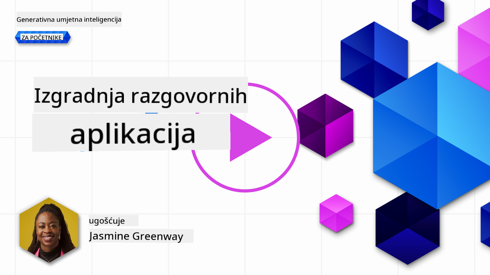
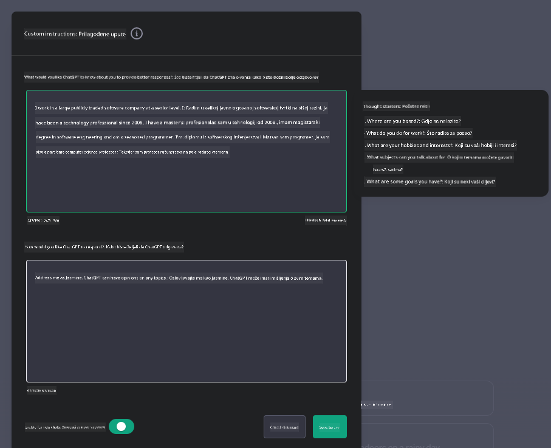
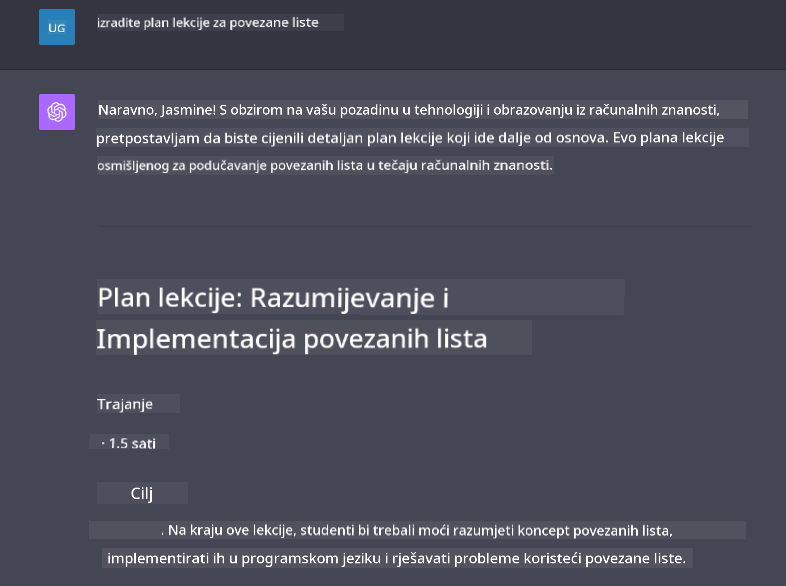

<!--
CO_OP_TRANSLATOR_METADATA:
{
  "original_hash": "ea4bbe640847aafbbba14dae4625e9af",
  "translation_date": "2025-07-09T12:41:44+00:00",
  "source_file": "07-building-chat-applications/README.md",
  "language_code": "hr"
}
-->
# Izrada chat aplikacija pokretanih generativnom umjetnom inteligencijom

[](https://aka.ms/gen-ai-lessons7-gh?WT.mc_id=academic-105485-koreyst)

> _(Kliknite na gornju sliku za pregled video lekcije)_

Sada kada smo vidjeli kako možemo izraditi aplikacije za generiranje teksta, pogledajmo chat aplikacije.

Chat aplikacije postale su sastavni dio naših svakodnevnih života, nudeći više od običnog načina za neformalni razgovor. One su ključni dio korisničke podrške, tehničke pomoći, pa čak i sofisticiranih savjetodavnih sustava. Vjerojatno ste nedavno dobili pomoć putem neke chat aplikacije. Kako u ove platforme integriramo naprednije tehnologije poput generativne umjetne inteligencije, raste i njihova složenost, kao i izazovi.

Neka od pitanja na koja trebamo odgovoriti su:

- **Izrada aplikacije**. Kako učinkovito izraditi i besprijekorno integrirati ove AI-pokretane aplikacije za specifične slučajeve upotrebe?
- **Praćenje**. Nakon implementacije, kako možemo pratiti i osigurati da aplikacije rade na najvišoj razini kvalitete, kako u funkcionalnosti, tako i u skladu s [šest principa odgovorne AI](https://www.microsoft.com/ai/responsible-ai?WT.mc_id=academic-105485-koreyst)?

Kako ulazimo u doba definirano automatizacijom i besprijekornom interakcijom čovjeka i stroja, postaje ključno razumjeti kako generativna AI mijenja opseg, dubinu i prilagodljivost chat aplikacija. Ova lekcija istražit će arhitektonske aspekte koji podržavaju ove složene sustave, metodologije za njihovo fino podešavanje za zadatke specifične za domenu te procijeniti metrike i razmatranja važna za odgovornu primjenu AI.

## Uvod

Ova lekcija obuhvaća:

- Tehnike za učinkovitu izradu i integraciju chat aplikacija.
- Kako primijeniti prilagodbu i fino podešavanje aplikacija.
- Strategije i razmatranja za učinkovito praćenje chat aplikacija.

## Ciljevi učenja

Na kraju ove lekcije moći ćete:

- Opisati razmatranja za izradu i integraciju chat aplikacija u postojeće sustave.
- Prilagoditi chat aplikacije za specifične slučajeve upotrebe.
- Prepoznati ključne metrike i razmatranja za učinkovito praćenje i održavanje kvalitete AI-pokretanih chat aplikacija.
- Osigurati da chat aplikacije koriste AI na odgovoran način.

## Integracija generativne AI u chat aplikacije

Unapređenje chat aplikacija generativnom AI nije samo pitanje da ih učinimo pametnijima; radi se o optimizaciji njihove arhitekture, performansi i korisničkog sučelja kako bi se pružilo kvalitetno korisničko iskustvo. To uključuje istraživanje arhitektonskih temelja, integracija API-ja i razmatranja korisničkog sučelja. Ovaj dio ima za cilj pružiti vam sveobuhvatan vodič za snalaženje u ovim složenim područjima, bilo da ih povezujete s postojećim sustavima ili gradite kao samostalne platforme.

Na kraju ovog dijela bit ćete opremljeni znanjem potrebnim za učinkovitu izradu i integraciju chat aplikacija.

### Chatbot ili chat aplikacija?

Prije nego što započnemo s izradom chat aplikacija, usporedimo 'chatbotove' i 'AI-pokretane chat aplikacije', koje imaju različite uloge i funkcionalnosti. Glavna svrha chatbota je automatizacija određenih razgovornih zadataka, poput odgovaranja na često postavljana pitanja ili praćenja paketa. Obično se temelji na pravilima ili složenim AI algoritmima. Nasuprot tome, AI-pokretana chat aplikacija je znatno šire okruženje dizajnirano za olakšavanje različitih oblika digitalne komunikacije, poput tekstualnih, glasovnih i video razgovora među ljudskim korisnicima. Njezina ključna značajka je integracija generativnog AI modela koji simulira nijansirane, ljudske razgovore, generirajući odgovore na temelju raznovrsnih ulaza i kontekstualnih naznaka. Chat aplikacija pokretana generativnom AI može sudjelovati u otvorenim razgovorima, prilagođavati se promjenjivim kontekstima i čak stvarati kreativne ili složene dijaloge.

Tablica u nastavku prikazuje ključne razlike i sličnosti kako bismo bolje razumjeli njihove jedinstvene uloge u digitalnoj komunikaciji.

| Chatbot                               | Chat aplikacija pokretana generativnom AI |
| ------------------------------------- | ----------------------------------------- |
| Fokusiran na zadatke i temeljen na pravilima | Svjestan konteksta                        |
| Često integriran u veće sustave       | Može sadržavati jedan ili više chatbotova |
| Ograničen na programirane funkcije    | Uključuje generativne AI modele           |
| Specijalizirane i strukturirane interakcije | Sposoban za otvorene razgovore            |

### Korištenje gotovih funkcionalnosti putem SDK-ova i API-ja

Prilikom izrade chat aplikacije, dobar prvi korak je procijeniti što je već dostupno. Korištenje SDK-ova i API-ja za izradu chat aplikacija je korisna strategija iz više razloga. Integriranjem dobro dokumentiranih SDK-ova i API-ja strateški pozicionirate svoju aplikaciju za dugoročni uspjeh, rješavajući pitanja skalabilnosti i održavanja.

- **Ubrzava razvojni proces i smanjuje opterećenje**: Oslanjanje na gotove funkcionalnosti umjesto skupog procesa izrade od nule omogućuje vam da se usredotočite na druge aspekte aplikacije koje smatrate važnijima, poput poslovne logike.
- **Bolje performanse**: Kada gradite funkcionalnost od nule, prije ili kasnije ćete se zapitati "Kako se ovo skalira? Može li aplikacija podnijeti nagli priljev korisnika?" Dobro održavani SDK-ovi i API-ji često imaju ugrađena rješenja za ove izazove.
- **Jednostavnije održavanje**: Ažuriranja i poboljšanja lakše je upravljati jer većina API-ja i SDK-ova zahtijeva samo ažuriranje biblioteke kad se objavi novija verzija.
- **Pristup najnovijoj tehnologiji**: Korištenje modela koji su fino podešeni i trenirani na opsežnim skupovima podataka pruža vašoj aplikaciji mogućnosti prirodnog jezika.

Pristup funkcionalnostima SDK-a ili API-ja obično uključuje dobivanje dozvole za korištenje usluga, što se često ostvaruje putem jedinstvenog ključa ili autentifikacijskog tokena. Koristit ćemo OpenAI Python Library da pokažemo kako to izgleda. Također možete isprobati sami u sljedećem [notebooku za OpenAI](python/oai-assignment.ipynb) ili [notebooku za Azure OpenAI Services](python/aoai-assignment.ipynb) za ovu lekciju.

```python
import os
from openai import OpenAI

API_KEY = os.getenv("OPENAI_API_KEY","")

client = OpenAI(
    api_key=API_KEY
    )

chat_completion = client.chat.completions.create(model="gpt-3.5-turbo", messages=[{"role": "user", "content": "Suggest two titles for an instructional lesson on chat applications for generative AI."}])
```

Gornji primjer koristi GPT-3.5 Turbo model za dovršetak upita, ali primijetite da je API ključ postavljen prije toga. Dobit ćete grešku ako ključ nije postavljen.

## Korisničko iskustvo (UX)

Opća načela UX-a primjenjuju se na chat aplikacije, no ovdje su dodatna razmatranja koja postaju posebno važna zbog uključenih komponenti strojnog učenja.

- **Mehanizam za rješavanje nejasnoća**: Generativni AI modeli ponekad daju nejasne odgovore. Značajka koja korisnicima omogućuje traženje pojašnjenja može biti korisna ako naiđu na takav problem.
- **Zadržavanje konteksta**: Napredni generativni AI modeli imaju sposobnost pamćenja konteksta unutar razgovora, što može biti važan dodatak korisničkom iskustvu. Omogućavanje korisnicima kontrole i upravljanja kontekstom poboljšava iskustvo, ali uvodi rizik zadržavanja osjetljivih korisničkih podataka. Razmatranja o tome koliko dugo se ti podaci čuvaju, poput uvođenja politike zadržavanja, mogu uravnotežiti potrebu za kontekstom i privatnost.
- **Personalizacija**: Sposobnost učenja i prilagodbe omogućuje AI modelima pružanje individualiziranog iskustva korisniku. Prilagođavanje korisničkog iskustva kroz značajke poput korisničkih profila ne samo da korisniku daje osjećaj da je shvaćen, već i pomaže u pronalasku specifičnih odgovora, stvarajući učinkovitiju i zadovoljavajuću interakciju.

Jedan primjer personalizacije su "Custom instructions" postavke u OpenAI-jevom ChatGPT-u. Omogućuju vam da pružite informacije o sebi koje mogu biti važan kontekst za vaše upite. Evo primjera prilagođene upute.



Ovaj "profil" potiče ChatGPT da kreira plan lekcije o povezanim listama. Primijetite da ChatGPT uzima u obzir da korisnik možda želi detaljniji plan lekcije na temelju svog iskustva.



### Microsoftov sustav poruka za velike jezične modele

[Microsoft je dao smjernice](https://learn.microsoft.com/azure/ai-services/openai/concepts/system-message#define-the-models-output-format?WT.mc_id=academic-105485-koreyst) za pisanje učinkovitih sistemskih poruka pri generiranju odgovora iz LLM-ova, podijeljene u 4 područja:

1. Definiranje za koga je model namijenjen, kao i njegovih sposobnosti i ograničenja.
2. Definiranje formata izlaza modela.
3. Davanje specifičnih primjera koji pokazuju željeno ponašanje modela.
4. Pružanje dodatnih sigurnosnih ograničenja ponašanja.

### Pristupačnost

Bez obzira ima li korisnik vizualnih, slušnih, motoričkih ili kognitivnih poteškoća, dobro dizajnirana chat aplikacija trebala bi biti dostupna svima. Sljedeći popis razlaže specifične značajke usmjerene na poboljšanje pristupačnosti za različite vrste poteškoća.

- **Značajke za vizualne poteškoće**: Tematski prikazi visokog kontrasta i tekst koji se može mijenjati po veličini, kompatibilnost sa čitačima ekrana.
- **Značajke za slušne poteškoće**: Funkcije pretvaranja teksta u govor i govora u tekst, vizualni signali za audio obavijesti.
- **Značajke za motoričke poteškoće**: Podrška za navigaciju tipkovnicom, glasovne naredbe.
- **Značajke za kognitivne poteškoće**: Opcije pojednostavljenog jezika.

## Prilagodba i fino podešavanje za modele jezika specifične za domenu

Zamislite chat aplikaciju koja razumije žargon vaše tvrtke i predviđa specifična pitanja koja korisnici najčešće postavljaju. Postoji nekoliko pristupa vrijednih spomena:

- **Korištenje DSL modela**. DSL znači domain specific language (jezik specifičan za domenu). Možete koristiti takozvani DSL model treniran na određenoj domeni da razumije njezine pojmove i scenarije.
- **Primjena fino podešavanja**. Fino podešavanje je proces dodatnog treniranja vašeg modela s posebnim podacima.

## Prilagodba: Korištenje DSL-a

Korištenje modela jezika specifičnih za domenu (DSL modeli) može poboljšati angažman korisnika pružajući specijalizirane, kontekstualno relevantne interakcije. To je model koji je treniran ili fino podešen da razumije i generira tekst vezan uz određeno područje, industriju ili temu. Opcije za korištenje DSL modela variraju od treniranja modela od nule do korištenja postojećih putem SDK-ova i API-ja. Druga opcija je fino podešavanje, koje uključuje prilagodbu postojećeg prethodno treniranog modela za specifičnu domenu.

## Prilagodba: Primjena fino podešavanja

Fino podešavanje se često razmatra kada prethodno trenirani model nije dovoljno dobar u specijaliziranoj domeni ili za određeni zadatak.

Na primjer, medicinska pitanja su složena i zahtijevaju mnogo konteksta. Kada medicinski stručnjak postavlja dijagnozu, ona se temelji na različitim čimbenicima poput načina života ili postojećih bolesti, a može se oslanjati i na najnovije medicinske časopise za potvrdu dijagnoze. U takvim nijansiranim situacijama, opća AI chat aplikacija ne može biti pouzdan izvor.

### Scenarij: medicinska aplikacija

Zamislite chat aplikaciju dizajniranu da pomaže medicinskim stručnjacima pružajući brze reference za smjernice liječenja, interakcije lijekova ili najnovija istraživanja.

Opći model može biti dovoljan za odgovaranje na osnovna medicinska pitanja ili davanje općih savjeta, ali može imati poteškoća s:

- **Vrlo specifičnim ili složenim slučajevima**. Na primjer, neurolog bi mogao pitati aplikaciju: "Koje su trenutno najbolje prakse za upravljanje lijekovima otpornom epilepsijom kod djece?"
- **Nedostatkom najnovijih saznanja**. Opći model može imati problema pružiti ažurirani odgovor koji uključuje najnovija dostignuća u neurologiji i farmakologiji.

U takvim slučajevima, fino podešavanje modela specijaliziranim medicinskim skupom podataka može značajno poboljšati njegovu sposobnost da preciznije i pouzdanije odgovara na ove složene medicinske upite. To zahtijeva pristup velikom i relevantnom skupu podataka koji predstavlja izazove i pitanja specifična za domenu.

## Razmatranja za visokokvalitetno AI-pokretano chat iskustvo

Ovaj dio opisuje kriterije za "visokokvalitetne" chat aplikacije, uključujući prikupljanje mjerljivih podataka i pridržavanje okvira koji odgovorno koristi AI tehnologiju.

### Ključne metrike

Za održavanje visokokvalitetnih performansi aplikacije, važno je pratiti ključne metrike i razmatranja. Ove mjere ne samo da osiguravaju funkcionalnost aplikacije, već i procjenjuju kvalitetu AI modela i korisničkog iskustva. U nastavku je popis osnovnih, AI i UX metrika koje treba uzeti u obzir.

| Metrika                      | Definicija                                                                                                            | Razmatranja za developera chat aplikacije                          |
| ---------------------------- | --------------------------------------------------------------------------------------------------------------------- | ------------------------------------------------------------------ |
| **Uptime**                   | Mjeri vrijeme tijekom kojeg je aplikacija operativna i dostupna korisnicima.                                          | Kako ćete minimizirati vrijeme nedostupnosti?                      |
| **Vrijeme odgovora**          | Vrijeme koje aplikacija treba da odgovori na korisnički upit.                                                        | Kako optimizirati obradu upita za brže odgovore?                   |
| **Preciznost**               | Omjer točnih pozitivnih predviđanja u odnosu na ukupan broj pozitivnih predviđanja.                                  | Kako ćete provjeriti preciznost modela?                            |
| **Recall (osjetljivost)**    | Omjer točnih pozitivnih predviđanja u odnosu na stvarni broj pozitivnih slučajeva.                                   | Kako ćete mjeriti i poboljšati recall?                            |
| **F1 rezultat**              | Harmonijska sredina preciznosti i recall-a, koja balansira kompromis između njih.                                     | Koji je vaš cilj za F1 rezultat? Kako ćete balansirati preciznost i recall? |
| **Perpleksnost**             | Mjeri koliko se vjerojatnosna distribucija koju predviđa model slaže sa stvarnom distribucijom podataka.             | Kako ćete smanjiti perpleksnost?                                  |
| **Metrike zadovoljstva korisnika** | Mjeri percepciju korisnika o aplikaciji. Često se prikuplja putem anketa.                                         | Koliko često ćete prikupljati povratne informacije? Kako ćete se prilagođavati na temelju njih? |
| **Stopa pogrešaka**          | Stopa kojom model griješi u razumijevanju ili generiranju odgovora.                                                  | Koje strategije imate za smanjenje stope pogrešaka?               |
| **Ciklusi ponovnog treniranja** | Učestalost ažuriranja modela novim podacima i saznanjima.                                                           | Koliko često ćete ponovo trenirati model? Što pokreće ciklus ponovnog treniranja? |
| **Otkrivanje anomalija**         | Alati i tehnike za prepoznavanje neuobičajenih obrazaca koji se ne uklapaju u očekivano ponašanje.                        | Kako ćete reagirati na anomalije?                                        |

### Implementacija praksi odgovornog AI u chat aplikacijama

Microsoftov pristup odgovornom AI-u identificirao je šest načela koja bi trebala voditi razvoj i korištenje AI-a. Ispod su načela, njihova definicija te stvari koje bi developer chat aplikacija trebao uzeti u obzir i zašto ih treba ozbiljno shvatiti.

| Načela                 | Microsoftova definicija                                | Razmatranja za developera chata                                      | Zašto je važno                                                                     |
| ---------------------- | ----------------------------------------------------- | ------------------------------------------------------------------- | ---------------------------------------------------------------------------------- |
| Pravednost             | AI sustavi trebaju jednako postupati sa svim ljudima. | Osigurajte da chat aplikacija ne diskriminira na temelju korisničkih podataka. | Za izgradnju povjerenja i inkluzivnosti među korisnicima; izbjegavanje pravnih posljedica.                |
| Pouzdanost i sigurnost | AI sustavi trebaju raditi pouzdano i sigurno.         | Provedite testiranja i sigurnosne mjere za smanjenje pogrešaka i rizika.         | Osigurava zadovoljstvo korisnika i sprječava moguće štete.                                 |
| Privatnost i sigurnost | AI sustavi trebaju biti sigurni i poštovati privatnost. | Implementirajte snažnu enkripciju i mjere zaštite podataka.              | Za zaštitu osjetljivih korisničkih podataka i usklađenost s zakonima o privatnosti.                         |
| Inkluzivnost           | AI sustavi trebaju osnažiti sve i uključiti ljude.     | Dizajnirajte UI/UX koji je pristupačan i jednostavan za različite korisnike. | Osigurava da širi krug ljudi može učinkovito koristiti aplikaciju.                   |
| Transparentnost        | AI sustavi trebaju biti razumljivi.                    | Pružite jasnu dokumentaciju i obrazloženje AI odgovora.            | Korisnici će više vjerovati sustavu ako razumiju kako se donose odluke. |
| Odgovornost            | Ljudi trebaju biti odgovorni za AI sustave.            | Uspostavite jasan proces za reviziju i poboljšanje AI odluka.     | Omogućuje kontinuirano poboljšanje i korektivne mjere u slučaju pogrešaka.               |

## Zadatak

Pogledajte [assignment](../../../07-building-chat-applications/python) koji će vas provesti kroz niz vježbi, od pokretanja prvih chat upita, preko klasifikacije i sažimanja teksta i još mnogo toga. Primijetite da su zadaci dostupni u različitim programskim jezicima!

## Odličan posao! Nastavite putovanje

Nakon što završite ovu lekciju, pogledajte našu [Generative AI Learning collection](https://aka.ms/genai-collection?WT.mc_id=academic-105485-koreyst) kako biste nastavili usavršavati svoje znanje o Generativnom AI-u!

Krenite na Lekciju 8 i saznajte kako možete početi [graditi aplikacije za pretraživanje](../08-building-search-applications/README.md?WT.mc_id=academic-105485-koreyst)!

**Odricanje od odgovornosti**:  
Ovaj dokument je preveden korištenjem AI usluge za prevođenje [Co-op Translator](https://github.com/Azure/co-op-translator). Iako nastojimo postići točnost, imajte na umu da automatski prijevodi mogu sadržavati pogreške ili netočnosti. Izvorni dokument na izvornom jeziku treba smatrati autoritativnim izvorom. Za kritične informacije preporučuje se profesionalni ljudski prijevod. Ne snosimo odgovornost za bilo kakva nesporazume ili pogrešna tumačenja koja proizlaze iz korištenja ovog prijevoda.