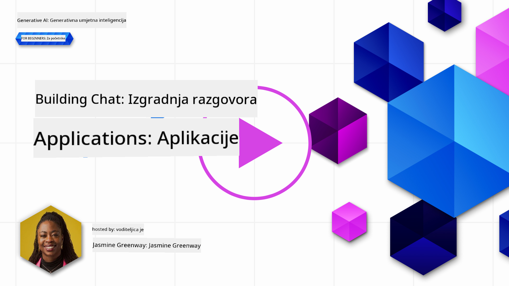
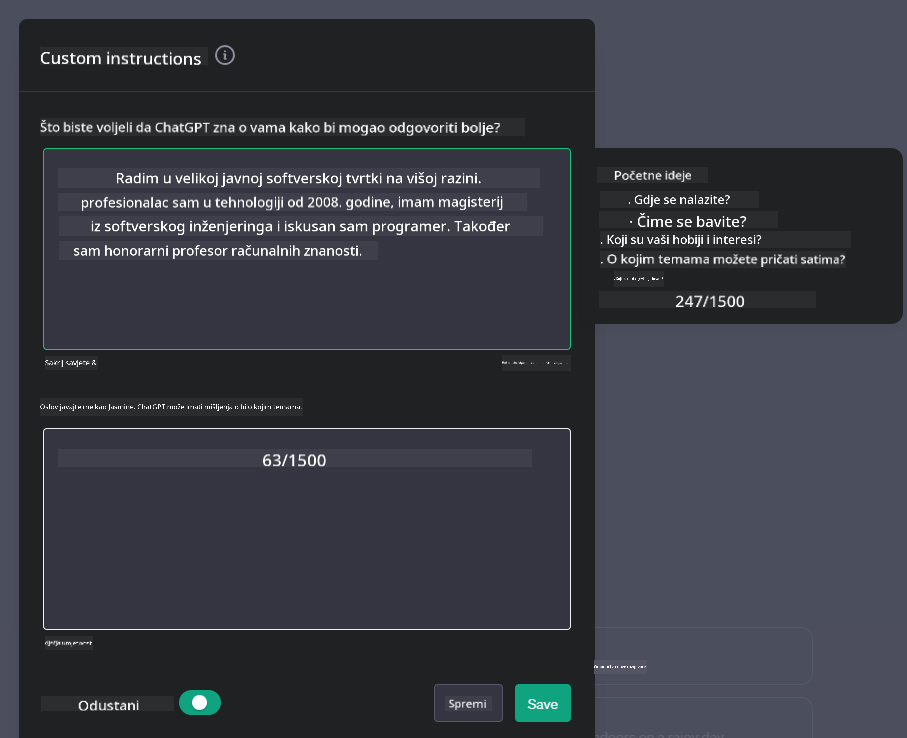

<!--
CO_OP_TRANSLATOR_METADATA:
{
  "original_hash": "ea4bbe640847aafbbba14dae4625e9af",
  "translation_date": "2025-05-19T18:14:13+00:00",
  "source_file": "07-building-chat-applications/README.md",
  "language_code": "hr"
}
-->
# Izgradnja Chat Aplikacija s Generativnom Umjetnom Inteligencijom

[](https://aka.ms/gen-ai-lessons7-gh?WT.mc_id=academic-105485-koreyst)

> _(Kliknite na sliku iznad za video lekcije)_

Sada kada smo vidjeli kako možemo izraditi aplikacije za generiranje teksta, pogledajmo aplikacije za chat.

Chat aplikacije postale su sastavni dio naših svakodnevnih života, nudeći više od obične neformalne komunikacije. One su ključni dijelovi korisničke podrške, tehničke podrške, pa čak i sofisticiranih savjetodavnih sustava. Vjerojatno ste nedavno dobili neku pomoć putem chat aplikacije. Kako integriramo naprednije tehnologije poput generativne umjetne inteligencije u ove platforme, složenost se povećava, a s njom i izazovi.

Neka pitanja na koja trebamo odgovoriti su:

- **Izgradnja aplikacije**. Kako učinkovito izgraditi i besprijekorno integrirati ove aplikacije s umjetnom inteligencijom za specifične slučajeve korištenja?
- **Praćenje**. Jednom kada su implementirane, kako možemo pratiti i osigurati da aplikacije rade na najvišoj razini kvalitete, kako u smislu funkcionalnosti, tako i u skladu s [šest principa odgovorne AI](https://www.microsoft.com/ai/responsible-ai?WT.mc_id=academic-105485-koreyst)?

Kako ulazimo dublje u doba definirano automatizacijom i besprijekornim interakcijama između ljudi i strojeva, razumijevanje kako generativna AI transformira opseg, dubinu i prilagodljivost chat aplikacija postaje ključno. Ova lekcija istražit će aspekte arhitekture koji podržavaju ove složene sustave, istražiti metodologije za njihovo prilagođavanje specifičnim zadacima i ocijeniti metrike i razmatranja važna za osiguranje odgovorne primjene AI.

## Uvod

Ova lekcija pokriva:

- Tehnike za učinkovitu izgradnju i integraciju chat aplikacija.
- Kako primijeniti prilagodbu i fino podešavanje aplikacija.
- Strategije i razmatranja za učinkovito praćenje chat aplikacija.

## Ciljevi učenja

Do kraja ove lekcije moći ćete:

- Opisati razmatranja za izgradnju i integraciju chat aplikacija u postojeće sustave.
- Prilagoditi chat aplikacije za specifične slučajeve korištenja.
- Identificirati ključne metrike i razmatranja za učinkovito praćenje i održavanje kvalitete chat aplikacija s AI.
- Osigurati da chat aplikacije odgovorno koriste AI.

## Integracija Generativne AI u Chat Aplikacije

Povećanje chat aplikacija kroz generativnu AI nije samo usmjereno na njihovo učinjenje pametnijima; radi se o optimizaciji njihove arhitekture, performansi i korisničkog sučelja kako bi se pružilo kvalitetno korisničko iskustvo. To uključuje istraživanje temeljnih arhitektura, API integracija i razmatranja korisničkog sučelja. Ovaj dio ima za cilj ponuditi vam sveobuhvatnu mapu za navigaciju ovim složenim krajolicima, bilo da ih povezujete s postojećim sustavima ili ih gradite kao samostalne platforme.

Do kraja ovog dijela, bit ćete opremljeni stručnim znanjem potrebnim za učinkovitu izgradnju i uključivanje chat aplikacija.

### Chatbot ili Chat aplikacija?

Prije nego što se upustimo u izgradnju chat aplikacija, usporedimo 'chatbotove' s 'AI-om pokretanim chat aplikacijama', koje služe različitim ulogama i funkcionalnostima. Glavna svrha chatbota je automatizacija specifičnih konverzacijskih zadataka, kao što je odgovaranje na često postavljana pitanja ili praćenje paketa. Obično je vođen logikom temeljenom na pravilima ili složenim AI algoritmima. Suprotno tome, AI-om pokretana chat aplikacija je mnogo šire okruženje dizajnirano za omogućavanje raznih oblika digitalne komunikacije, kao što su tekst, glas i video razgovori među ljudskim korisnicima. Njegova ključna značajka je integracija generativnog AI modela koji simulira nijansirane, ljudske razgovore, generirajući odgovore na temelju širokog spektra unosa i kontekstualnih znakova. Generativna AI pokretana chat aplikacija može se uključiti u otvorene diskusije, prilagoditi se evoluirajućim konverzacijskim kontekstima, pa čak i proizvoditi kreativne ili složene dijaloge.

Tablica ispod prikazuje ključne razlike i sličnosti kako bismo razumjeli njihove jedinstvene uloge u digitalnoj komunikaciji.

| Chatbot                               | Generativna AI-Pokretana Chat Aplikacija |
| ------------------------------------- | ---------------------------------------- |
| Usmjeren na zadatke i temeljen na pravilima | Svjestan konteksta                       |
| Često integriran u veće sustave        | Može ugostiti jedan ili više chatbota    |
| Ograničen na programirane funkcije    | Uključuje generativne AI modele          |
| Specijalizirane i strukturirane interakcije | Sposoban za otvorene diskusije           |

### Iskorištavanje unaprijed izgrađenih funkcionalnosti s SDK-ovima i API-ima

Kada gradite chat aplikaciju, dobar prvi korak je procijeniti što je već dostupno. Korištenje SDK-ova i API-a za izgradnju chat aplikacija je povoljna strategija iz raznih razloga. Integracijom dobro dokumentiranih SDK-ova i API-a, strateški pozicionirate svoju aplikaciju za dugoročni uspjeh, rješavajući probleme skalabilnosti i održavanja.

- **Ubrzava proces razvoja i smanjuje troškove**: Oslanjanje na unaprijed izgrađene funkcionalnosti umjesto skupog procesa njihovog samostalnog izgradnje omogućuje vam da se usredotočite na druge aspekte vaše aplikacije koje možda smatrate važnijima, kao što je poslovna logika.
- **Bolje performanse**: Kada gradite funkcionalnost od nule, na kraju ćete se zapitati "Kako to skalirati? Je li ova aplikacija sposobna za obradu iznenadnog priljeva korisnika?" Dobro održavani SDK-ovi i API-ji često imaju ugrađena rješenja za ove probleme.
- **Lakše održavanje**: Ažuriranja i poboljšanja lakše su za upravljanje jer većina API-a i SDK-ova zahtijeva samo ažuriranje biblioteke kada se objavi nova verzija.
- **Pristup vrhunskoj tehnologiji**: Korištenje modela koji su fino podešeni i obučeni na opsežnim skupovima podataka pruža vašoj aplikaciji sposobnosti prirodnog jezika.

Pristupanje funkcionalnostima SDK-a ili API-a obično uključuje dobivanje dopuštenja za korištenje pruženih usluga, što se često postiže korištenjem jedinstvenog ključa ili autentifikacijskog tokena. Koristit ćemo OpenAI Python knjižnicu kako bismo istražili kako to izgleda. Također možete sami isprobati u sljedećem [notebooku za OpenAI](../../../07-building-chat-applications/python/oai-assignment.ipynb) ili [notebooku za Azure OpenAI usluge](../../../07-building-chat-applications/python/aoai-assignment.ipynb) za ovu lekciju.

```python
import os
from openai import OpenAI

API_KEY = os.getenv("OPENAI_API_KEY","")

client = OpenAI(
    api_key=API_KEY
    )

chat_completion = client.chat.completions.create(model="gpt-3.5-turbo", messages=[{"role": "user", "content": "Suggest two titles for an instructional lesson on chat applications for generative AI."}])
```

Gornji primjer koristi GPT-3.5 Turbo model za dovršavanje upita, ali primijetite da je API ključ postavljen prije toga. Dobit ćete pogrešku ako ne postavite ključ.

## Korisničko Iskustvo (UX)

Opći UX principi primjenjuju se na chat aplikacije, ali evo nekih dodatnih razmatranja koja postaju posebno važna zbog komponenti strojnog učenja.

- **Mehanizam za rješavanje nejasnoća**: Generativni AI modeli povremeno generiraju nejasne odgovore. Značajka koja omogućuje korisnicima da zatraže pojašnjenje može biti korisna ako naiđu na ovaj problem.
- **Zadržavanje konteksta**: Napredni generativni AI modeli imaju sposobnost pamćenja konteksta unutar razgovora, što može biti potrebna prednost za korisničko iskustvo. Davanje korisnicima mogućnosti upravljanja kontekstom poboljšava korisničko iskustvo, ali uvodi rizik od zadržavanja osjetljivih korisničkih informacija. Razmatranja o tome koliko dugo se te informacije pohranjuju, kao što je uvođenje politike zadržavanja, mogu uravnotežiti potrebu za kontekstom i privatnost.
- **Personalizacija**: S mogućnošću učenja i prilagodbe, AI modeli nude individualizirano iskustvo za korisnika. Prilagođavanje korisničkog iskustva putem značajki poput korisničkih profila ne samo da čini korisnika da se osjeća shvaćenim, već također pomaže u pronalaženju specifičnih odgovora, stvarajući učinkovitiju i zadovoljavajuću interakciju.

Jedan takav primjer personalizacije su "Prilagođene upute" u OpenAI-ovom ChatGPT-u. Omogućuje vam pružanje informacija o sebi koje mogu biti važan kontekst za vaše upite. Evo primjera prilagođene upute.



Ovaj "profil" potiče ChatGPT da stvori plan lekcije o povezanim listama. Primijetite da ChatGPT uzima u obzir da korisnik možda želi detaljniji plan lekcije na temelju svog iskustva.


### Microsoftov Okvir Sistemskih Poruka za Velike Jezične Modele

[Microsoft je pružio smjernice](https://learn.microsoft.com/azure/ai-services/openai/concepts/system-message#define-the-models-output-format?WT.mc_id=academic-105485-koreyst) za pisanje učinkovitih sistemskih poruka prilikom generiranja odgovora iz velikih jezičnih modela podijeljenih u 4 područja:

1. Definiranje za koga je model, kao i njegovih sposobnosti i ograničenja.
2. Definiranje formata izlaza modela.
3. Pružanje specifičnih primjera koji pokazuju namjeravano ponašanje modela.
4. Pružanje dodatnih sigurnosnih ograda ponašanja.

### Pristupačnost

Bilo da korisnik ima vizualna, slušna, motorička ili kognitivna oštećenja, dobro dizajnirana chat aplikacija trebala bi biti upotrebljiva za sve. Sljedeći popis razlaže specifične značajke usmjerene na poboljšanje pristupačnosti za razna korisnička oštećenja.

- **Značajke za vizualna oštećenja**: Teme visokog kontrasta i podesivi tekst, kompatibilnost sa čitačima ekrana.
- **Značajke za slušna oštećenja**: Funkcije pretvorbe teksta u govor i govora u tekst, vizualni signali za audio obavijesti.
- **Značajke za motorička oštećenja**: Podrška za navigaciju putem tipkovnice, glasovne naredbe.
- **Značajke za kognitivna oštećenja**: Opcije pojednostavljenog jezika.

## Prilagodba i Fino Podešavanje za Jezične Modele Specifične za Domenu

Zamislite chat aplikaciju koja razumije žargon vaše tvrtke i predviđa specifične upite koje njena korisnička baza često ima. Postoji nekoliko pristupa vrijednih spomena:

- **Korištenje DSL modela**. DSL označava jezik specifičan za domenu. Možete iskoristiti takozvani DSL model obučen na specifičnoj domeni kako bi razumio njezine koncepte i scenarije.
- **Primjena finog podešavanja**. Fino podešavanje je proces daljnje obuke vašeg modela sa specifičnim podacima.

## Prilagodba: Korištenje DSL-a

Iskorištavanje jezičnih modela specifičnih za domenu (DSL modeli) može poboljšati angažman korisnika pružanjem specijaliziranih, kontekstualno relevantnih interakcija. To je model koji je obučen ili fino podešen za razumijevanje i generiranje teksta vezanog uz specifično područje, industriju ili temu. Opcije za korištenje DSL modela mogu varirati od treniranja jednog od nule, do korištenja postojećih putem SDK-ova i API-a. Druga opcija je fino podešavanje, što uključuje prilagodbu postojećeg prethodno obučenog modela za specifičnu domenu.

## Prilagodba: Primjena finog podešavanja

Fino podešavanje često se razmatra kada prethodno obučeni model nije dovoljan u specijaliziranoj domeni ili specifičnom zadatku.

Na primjer, medicinski upiti su složeni i zahtijevaju mnogo konteksta. Kada medicinski stručnjak dijagnosticira pacijenta, to se temelji na raznim faktorima kao što su način života ili postojeći uvjeti, i može se osloniti na nedavne medicinske časopise kako bi potvrdio svoju dijagnozu. U takvim nijansiranim scenarijima, općenita AI chat aplikacija ne može biti pouzdan izvor.

### Scenarij: medicinska aplikacija

Razmislite o chat aplikaciji dizajniranoj da pomaže medicinskim stručnjacima pružanjem brzih referenci na smjernice za liječenje, interakcije lijekova ili najnovija istraživanja.

Opći model mogao bi biti adekvatan za odgovaranje na osnovna medicinska pitanja ili pružanje općih savjeta, ali može imati poteškoća sa sljedećim:

- **Vrlo specifični ili složeni slučajevi**. Na primjer, neurolog bi mogao pitati aplikaciju, "Koje su trenutne najbolje prakse za upravljanje epilepsijom otpornom na lijekove kod pedijatrijskih pacijenata?"
- **Nedostatak najnovijih dostignuća**. Opći model mogao bi imati poteškoća pružiti trenutni odgovor koji uključuje najnovija dostignuća u neurologiji i farmakologiji.

U slučajevima poput ovih, fino podešavanje modela s posebnim medicinskim skupom podataka može značajno poboljšati njegovu sposobnost da precizno i pouzdano obradi ove složene medicinske upite. To zahtijeva pristup velikom i relevantnom skupu podataka koji predstavlja izazove specifične za domenu i pitanja koja treba riješiti.

## Razmatranja za Visokokvalitetno AI-Pokretano Chat Iskustvo

Ovaj odjeljak opisuje kriterije za "visokokvalitetne" chat aplikacije, koje uključuju prikupljanje mjerljivih metrika i pridržavanje okvira koji odgovorno koristi AI tehnologiju.

### Ključne Metrike

Kako bi se održala visoka kvaliteta performansi aplikacije, bitno je pratiti ključne metrike i razmatranja. Ove mjere ne samo da osiguravaju funkcionalnost aplikacije već i procjenjuju kvalitetu AI modela i korisničkog iskustva. Ispod je popis koji pokriva osnovne, AI i korisničke metrike koje treba razmotriti.

| Metrika                        | Definicija                                                                                                             | Razmatranja za Razvoj Chat Aplikacije                                     |
| ----------------------------- | ---------------------------------------------------------------------------------------------------------------------- | ------------------------------------------------------------------------- |
| **Dostupnost**                | Mjeri vrijeme tijekom kojeg je aplikacija operativna i dostupna korisnicima.                                           | Kako ćete minimizirati nedostupnost?                                      |
| **Vrijeme Odgovora**          | Vrijeme potrebno aplikaciji da odgovori na korisnički upit.                                                            | Kako možete optimizirati obradu upita za poboljšanje vremena odgovora?    |
| **Preciznost**                | Omjer točnih pozitivnih predviđanja u odnosu na ukupan broj pozitivnih predviđanja                                     | Kako ćete validirati preciznost vašeg modela?                             |
| **Odzivnost (Osjetljivost)**  | Omjer točnih pozitivnih predviđanja u odnosu na stvarni broj pozitivnih                                                | Kako ćete mjeriti i poboljšati odzivnost?                                 |
| **F1 Rezultat**               | Harmonijska sredina preciznosti i odzivnosti, koja balansira kompromis između oboje.                                   | Koji je vaš ciljani F1 rezultat? Kako ćete balansirati preciznost i odzivnost? |
| **Perpleksnost**              | Mjeri koliko dobro distribucija vjerojatnosti predviđena modelom odgovara stvarnoj distribuciji podataka.              | Kako ćete minimizirati perpleksnost?                                      |
| **Metrike Zadovoljstva Korisnika** | Mjeri percepciju korisnika o aplikaciji. Često se prikupljaju putem ank

**Odricanje odgovornosti**:
Ovaj dokument je preveden koristeći AI uslugu za prevođenje [Co-op Translator](https://github.com/Azure/co-op-translator). Iako se trudimo da postignemo tačnost, molimo vas da budete svjesni da automatizirani prijevodi mogu sadržavati greške ili netočnosti. Izvorni dokument na izvornom jeziku treba smatrati autoritativnim izvorom. Za kritične informacije, preporučuje se profesionalni ljudski prijevod. Ne snosimo odgovornost za bilo kakve nesporazume ili pogrešne interpretacije proizašle iz korištenja ovog prijevoda.