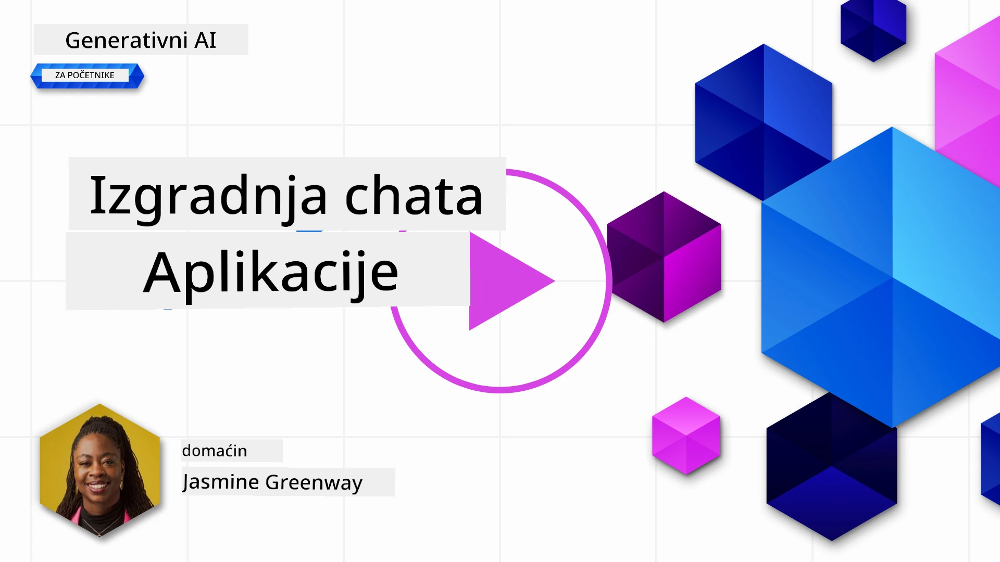
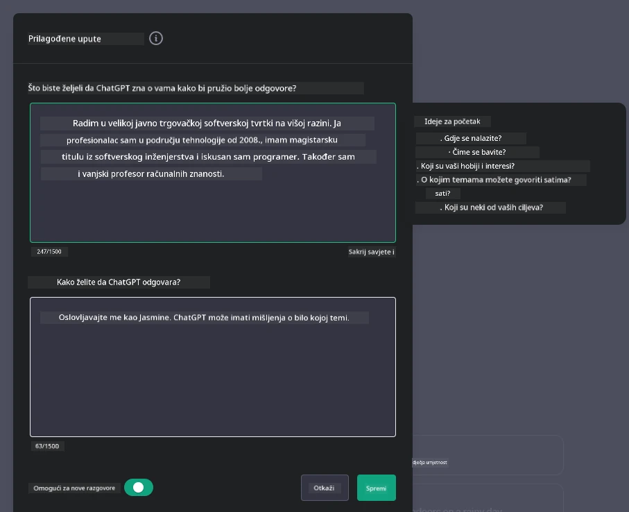
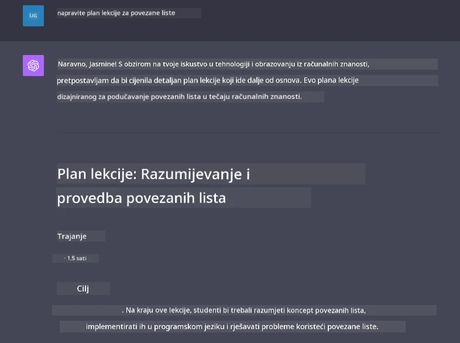

# Izrada chat aplikacija pokretanih generativnom umjetnom inteligencijom

[](https://youtu.be/R9V0ZY1BEQo?si=IHuU-fS9YWT8s4sA)

> _(Kliknite na gornju sliku za pregled video lekcije)_

Sada kada smo vidjeli kako možemo izraditi aplikacije za generiranje teksta, pogledajmo chat aplikacije.

Chat aplikacije su postale sastavni dio naših svakodnevnih života, nudeći više od same mogućnosti ležernog razgovora. One su integralni dijelovi korisničke službe, tehničke potpore, pa čak i sofisticiranih savjetodavnih sustava. Vrlo je vjerojatno da ste nedavno koristili neki oblik pomoći putem chat aplikacije. Kako integriramo naprednije tehnologije poput generativne umjetne inteligencije u ove platforme, složenost raste, kao i izazovi.

Neka od pitanja na koja trebamo odgovoriti su:

- **Izrada aplikacije**. Kako učinkovito izraditi i besprijekorno integrirati ove aplikacije pokretane AI-jem za specifične slučajeve upotrebe?
- **Praćenje**. Nakon što se aplikacije implementiraju, kako možemo pratiti i osigurati da aplikacije rade na najvišoj razini kvalitete, kako u smislu funkcionalnosti, tako i u skladu sa [šest principa odgovorne AI](https://www.microsoft.com/ai/responsible-ai?WT.mc_id=academic-105485-koreyst)?

Kako ulazimo dublje u dobu definiranom automatizacijom i besprijekornim interakcijama čovjeka i stroja, razumijevanje kako generativna AI transformira opseg, dubinu i prilagodljivost chat aplikacija postaje ključno. Ova lekcija će proučiti arhitekturalne aspekte koji podupiru ove složene sustave, detaljno obraditi metode za njihovo fino podešavanje za zadatke specifične za određeno područje i ocijeniti metrike i čimbenike relevantne za osiguravanje odgovorne primjene AI.

## Uvod

Ova lekcija pokriva:

- Tehnike za učinkovitu izgradnju i integraciju chat aplikacija.
- Kako primijeniti prilagodbu i fino podešavanje aplikacija.
- Strategije i razmatranja za učinkovito praćenje chat aplikacija.

## Ciljevi učenja

Nakon završetka ove lekcije, moći ćete:

- Opišete čimbenike za izgradnju i integraciju chat aplikacija u postojeće sustave.
- Prilagoditi chat aplikacije za specifične slučajeve upotrebe.
- Identificirati ključne metrike i čimbenike za učinkovito praćenje i održavanje kvalitete chat aplikacija pokretanih AI-jem.
- Osigurati da chat aplikacije koriste AI odgovorno.

## Integracija generativne AI u chat aplikacije

Unapređenje chat aplikacija putem generativne AI nije usmjereno samo na njihovu inteligenciju; radi se o optimizaciji njihove arhitekture, performansi i korisničkog sučelja kako bi se osiguralo kvalitetno korisničko iskustvo. To uključuje istraživanje arhitektonskih temelja, integracije API-ja i razmatranje korisničkog sučelja. Ovaj odjeljak ima za cilj ponuditi sveobuhvatni putokaz za snalaženje u ovim složenim područjima, bilo da ih povezujete s postojećim sustavima ili ih gradite kao samostalne platforme.

Na kraju ovog dijela bit ćete opremljeni stručnim znanjem potrebnim za učinkovitu izgradnju i integraciju chat aplikacija.

### Chatbot ili chat aplikacija?

Prije nego što se upustimo u izradu chat aplikacija, usporedimo 'chatbote' s 'chat aplikacijama pokretanim AI-jem', koje služe različitim ulogama i funkcionalnostima. Glavna svrha chatbota je automatizirati specifične razgovorne zadatke, poput odgovaranja na često postavljana pitanja ili praćenja pošiljaka. Obično se upravlja pomoću pravilo-bazirane logike ili složenih AI algoritama. Suprotno tome, chat aplikacija pokretana AI-jem je mnogo šire okruženje dizajnirano za omogućavanje različitih oblika digitalne komunikacije, poput tekstualnih, glasovnih i video razgovora među ljudskim korisnicima. Njezina definirajuća značajka je integracija generativnog AI modela koji simulira nijansirane, ljudske razgovore, generirajući odgovore na temelju široke lepeze ulaza i kontekstualnih naznaka. Chat aplikacija pokretana generativnom AI može sudjelovati u razgovorima otvorenog domena, prilagođavati se promjenjivim kontekstima razgovora, pa čak i stvarati kreativni ili složeni dijalog.

Tablica u nastavku ističe ključne razlike i sličnosti kako bismo bolje razumjeli njihove jedinstvene uloge u digitalnoj komunikaciji.

| Chatbot                               | Chat aplikacija pokretana generativnom AI-jem               |
| ------------------------------------- | -------------------------------------- |
| Usredotočen na zadatke i pravilo-baziran | Svjestan konteksta                 |
| Često integriran u veće sustave        | Može sadržavati jedan ili više chatbota                            |
| Ograničen na programske funkcije       | Uključuje generativne AI modele                         |
| Specijalizirane i strukturirane interakcije | Sposoban za razgovore otvorenog domena            |

### Iskorištavanje gotovih funkcionalnosti putem SDK-ova i API-ja

Prilikom izrade chat aplikacije, dobar prvi korak je procijeniti što je već dostupno. Korištenje SDK-ova i API-ja za izgradnju chat aplikacija je korisna strategija iz nekoliko razloga. Integrirajući dobro dokumentirane SDK-ove i API-je, strateški pozicionirate svoju aplikaciju za dugoročni uspjeh, rješavajući pitanja skalabilnosti i održavanja.

- **Ubrzava razvojni proces i smanjuje opterećenje**: Oslanjanje na gotove funkcionalnosti umjesto skupog procesa izgradnje vlastitih omogućuje vam da se usredotočite na druge aspekte aplikacije koje smatrate važnijima, poput poslovne logike.
- **Bolje performanse**: Kad gradite funkcionalnost od nule, pitate se "Kako to skalira? Može li ova aplikacija podnijeti nagli priljev korisnika?" Dobro održavani SDK-ovi i API-ji često imaju ugrađena rješenja za ove probleme.
- **Lakše održavanje**: Ažuriranja i poboljšanja lakše je upravljati jer većina API-ja i SDK-ova zahtijeva samo ažuriranje biblioteke kad se objavi novija verzija.
- **Pristup najsuvremenijoj tehnologiji**: Korištenje modela koji su fino podešeni i trenirani na opsežnim skupovima podataka daje vašoj aplikaciji sposobnosti prirodnog jezika.

Pristup funkcionalnostima SDK-a ili API-ja obično uključuje dobivanje dozvole za korištenje ponuđenih usluga, što se obično ostvaruje pomoću jedinstvenog ključa ili autentikacijskog tokena. Koristit ćemo OpenAI Python knjižnicu da proučimo kako to izgleda. Također možete isprobati sami u sljedećem [notebooku za OpenAI](./python/oai-assignment.ipynb?WT.mc_id=academic-105485-koreyst) ili [notebooku za Azure OpenAI usluge](./python/aoai-assignment.ipynb?WT.mc_id=academic-105485-koreys) za ovu lekciju.

```python
import os
from openai import OpenAI

API_KEY = os.getenv("OPENAI_API_KEY","")

client = OpenAI(
    api_key=API_KEY
    )

response = client.responses.create(model="gpt-4o-mini", input="Suggest two titles for an instructional lesson on chat applications for generative AI.", store=False)
print(response.output_text)
```

Gornji primjer koristi GPT-4o mini model s Responses API-jem za dovršetak prompta, ali primijetite da je API ključ postavljen prije toga. Dobit ćete grešku ako ne postavite ključ.

## Korisničko iskustvo (UX)

Opća UX načela primjenjuju se na chat aplikacije, ali evo nekoliko dodatnih razmatranja koja postaju posebno važna zbog uključenih komponenti strojnog učenja.

- **Mehanizam za rješavanje dvosmislenosti**: Generativni AI modeli povremeno generiraju dvosmislene odgovore. Značajka koja omogućuje korisnicima da zatraže pojašnjenje može biti korisna ako naiđu na ovaj problem.
- **Zadržavanje konteksta**: Napredni generativni AI modeli imaju sposobnost pamćenja konteksta unutar razgovora, što može biti nužan dodatak korisničkom iskustvu. Dajući korisnicima mogućnost upravljanja kontekstom poboljšava se iskustvo, ali se uvodi rizik čuvanja osjetljivih korisničkih podataka. Razmatranja o duljini pohrane takvih podataka, poput uvođenja politike zadržavanja, mogu uravnotežiti potrebu za kontekstom i privatnost.
- **Personalizacija**: S mogućnošću učenja i prilagodbe, AI modeli nude individualizirano iskustvo korisnika. Prilagođavanje korisničkog iskustva preko značajki poput korisničkih profila ne samo da daje korisniku dojam razumijevanja, već također pomaže u učinkovitijem i zadovoljavajućem pronalaženju specifičnih odgovora.

Jedan primjer personalizacije su postavke "Prilagođenih uputa" u OpenAI-jevom ChatGPT-u. One vam omogućuju da pružite informacije o sebi koje mogu biti važan kontekst za vaše upite. Evo primjera prilagođene upute.



Ovaj "profil" potiče ChatGPT da kreira plan lekcije o povezanim listama. Primijetite da ChatGPT uzima u obzir da korisnik možda želi detaljniji plan lekcije na temelju svog iskustva.



### Microsoftov okvir za sistemske poruke za velike jezične modele

[Microsoft je pružio smjernice](https://learn.microsoft.com/azure/ai-services/openai/concepts/system-message#define-the-models-output-format?WT.mc_id=academic-105485-koreyst) za pisanje učinkovitih sistemskih poruka pri generiranju odgovora iz velikih jezičnih modela (LLM) razvrstanih u 4 područja:

1. Definiranje za koga je model namijenjen, kao i njegovih sposobnosti i ograničenja.
2. Definiranje formata izlaza modela.
3. Pružanje specifičnih primjera koji demonstriraju namjeravano ponašanje modela.
4. Pružanje dodatnih sigurnosnih smjernica za ponašanje.

### Pristupačnost

Bilo da korisnik ima vizualne, slušne, motoričke ili kognitivne poteškoće, dobro dizajnirana chat aplikacija trebala bi biti upotrebljiva za sve. Sljedeći popis razlaže specifične značajke usmjerene na poboljšanje pristupačnosti za razne korisničke teškoće.

- **Značajke za vizualne poteškoće**: Teme visokog kontrasta i prilagodljiv tekst, kompatibilnost sa čitačima zaslona.
- **Značajke za slušne poteškoće**: Funkcije pretvaranja teksta u govor i govora u tekst, vizualni signali za audio obavijesti.
- **Značajke za motoričke poteškoće**: Podrška za navigaciju tipkovnicom, glasovne naredbe.
- **Značajke za kognitivne poteškoće**: Opcije pojednostavljenog jezika.

## Prilagodba i fino podešavanje za jezične modele specifične za domen

Zamislite chat aplikaciju koja razumije žargon vaše tvrtke i predviđa specifične upite koje korisnici često postavljaju. Postoji nekoliko pristupa vrijednih spomena:

- **Korištenje DSL modela**. DSL znači jezik specifičan za domen. Možete iskoristiti tzv. DSL model treniran na određenoj domeni za razumijevanje njenih koncepata i scenarija.
- **Primjena finog podešavanja**. Fino podešavanje je proces daljnjeg treniranja vašeg modela specifičnim podacima.

## Prilagodba: Korištenje DSL-a

Korištenje modela jezične domene specifične za područje (DSL modeli) može povećati angažman korisnika pružanjem specijaliziranih, kontekstualno relevantnih interakcija. To je model koji je treniran ili fino podešen da razumije i generira tekst vezan uz određeno područje, industriju ili temu. Opcije za korištenje DSL modela mogu varirati od treniranja modela od početka do korištenja postojećih preko SDK-ova i API-ja. Druga opcija je fino podešavanje, što uključuje uzimanje postojećeg prethodno treniranog modela i njegovu prilagodbu za specifičnu domenu.

## Prilagodba: Primjena finog podešavanja

Fino podešavanje se često razmatra kada prethodno trenirani model zaostaje u specijaliziranoj domeni ili specifičnom zadatku.

Na primjer, medicinski upiti su složeni i zahtijevaju mnogo konteksta. Kada medicinski stručnjak dijagnosticira pacijenta, to se temelji na raznim čimbenicima poput stil života ili prethodnih bolesti, a može se oslanjati i na najnovije medicinske časopise za potvrdu dijagnoze. U takvim nijansiranim slučajevima opća AI chat aplikacija ne može biti pouzdan izvor.

### Scenarij: medicinska aplikacija

Zamislite chat aplikaciju dizajniranu da pomogne medicinskim stručnjacima tako što pruža brze reference za smjernice liječenja, interakcije lijekova ili najnovija istraživanja.

Opći model mogao bi biti dovoljan za odgovaranje na osnovna medicinska pitanja ili davanje općih savjeta, ali može imati poteškoće s:

- **Vrlo specifičnim ili složenim slučajevima**. Na primjer, neurolog bi mogao pitati aplikaciju: "Koje su trenutne najbolje prakse za upravljanje epilepsijom otpornom na lijekove kod pedijatrijskih pacijenata?"
- **Nedostatkom najnovijih dostignuća**. Opći model mogao bi imati problema pružiti aktualni odgovor koji uključuje najnovija dostignuća u neurologiji i farmakologiji.

U takvim slučajevima fino podešavanje modela sa specijaliziranim medicinskim skupom podataka može značajno poboljšati njegovu sposobnost da preciznije i vjerodostojnije odgovara na složena medicinska pitanja. To zahtijeva pristup velikom i relevantnom skupu podataka koji predstavlja izazove i pitanja specifična za domenu.

## Razmatranja za visokokvalitetno AI-upravljano chat iskustvo

Ovaj odjeljak iznosi kriterije za "visokokvalitetne" chat aplikacije, uključujući prikupljanje mjerljivih pokazatelja i pridržavanje okvira koji odgovorno koristi AI tehnologiju.

### Ključne metrike

Kako biste održali visokorazinsku izvedbu aplikacije, neophodno je pratiti ključne metrike i čimbenike. Ove mjere ne samo da osiguravaju funkcionalnost aplikacije, već i procjenjuju kvalitetu AI modela te korisničko iskustvo. U nastavku je popis koji pokriva osnovne, AI i UX metrike koje treba razmotriti.

| Metrika                     | Definicija                                                                                                              | Razmatranja za razvojne programere chata                          |
| ---------------------------- | ----------------------------------------------------------------------------------------------------------------------- | ----------------------------------------------------------------- |
| **Uptime (vrijeme dostupnosti)** | Mjeri vrijeme tijekom kojeg je aplikacija operativna i dostupna korisnicima.                                          | Kako ćete minimizirati prekide rada?                              |
| **Vrijeme odziva**           | Vrijeme potrebno aplikaciji da odgovori na korisnički upit.                                                         | Kako optimizirati obradu upita za bolje vrijeme odziva?           |
| **Preciznost**               | Omjer istinitih pozitivnih predikcija u odnosu na ukupan broj pozitivnih predikcija.                                | Kako ćete validirati preciznost modela?                           |
| **Recall (osjetljivost)**    | Omjer istinitih pozitivnih predikcija u odnosu na stvarni broj pozitivnih slučajeva.                                | Kako ćete mjeriti i poboljšati osjetljivost?                      |
| **F1 rezultat**              | Harmonijska sredina preciznosti i osjetljivosti koja balansira kompromis između njih.                                | Koji je vaš cilj F1 rezultat? Kako ćete balansirati preciznost i osjetljivost? |
| **Perpleksnost**             | Mjeri koliko se raspodjela vjerojatnosti koju model predviđa poklapa sa stvarnom raspodjelom podataka.              | Kako ćete minimizirati perpleksnost?                              |
| **Metrike zadovoljstva korisnika** | Mjeri percepciju korisnika o aplikaciji. Često se prikuplja putem anketa.                                       | Koliko često ćete prikupljati povratne informacije? Kako ćete se prilagođavati njima? |
| **Stopa pogrešaka**          | Stopa kojom model griješi u razumijevanju ili izlazu.                                                             | Koje strategije imate za smanjenje stope pogrešaka?               |
| **Ciklusi ponovnog treniranja** | Učestalost s kojom se model ažurira kako bi uključio nove podatke i uvide.                                         | Koliko često ćete ponovno trenirati model? Što pokreće ciklus ponovnog treniranja? |

| **Detekcija anomalija**         | Alati i tehnike za prepoznavanje neobičnih obrazaca koji nisu u skladu s očekivanim ponašanjem.                        | Kako ćete reagirati na anomalije?                                        |

### Provedba praksi odgovornog umjetne inteligencije u aplikacijama za chat

Microsoftov pristup Odgovornoj umjetnoj inteligenciji identificirao je šest načela koja bi trebala voditi razvoj i upotrebu umjetne inteligencije. Ispod su načela, njihova definicija i stvari koje bi developer chat aplikacije trebao uzeti u obzir i zašto im treba ozbiljno pristupiti.

| Načela                | Microsoftova definicija                              | Razmatranja za developera chata                                    | Zašto je važno                                                                            |
| ---------------------- | ---------------------------------------------------- | ------------------------------------------------------------------ | ----------------------------------------------------------------------------------------- |
| Pravednost             | Sustavi umjetne inteligencije trebaju postupati pravedno prema svima. | Osigurajte da aplikacija za chat ne diskriminira na temelju podataka korisnika. | Za izgradnju povjerenja i inkluzivnosti među korisnicima; izbjegavanje pravnih posljedica. |
| Pouzdanost i sigurnost | Sustavi umjetne inteligencije trebaju raditi pouzdano i sigurno. | Provedite testiranje i sigurnosne mjere kako biste minimizirali pogreške i rizike. | Osigurava zadovoljstvo korisnika i sprječava potencijalnu štetu.                          |
| Privatnost i sigurnost | Sustavi umjetne inteligencije trebaju biti sigurni i poštovati privatnost. | Implementirajte snažno šifriranje i mjere zaštite podataka.        | Za zaštitu osjetljivih korisničkih podataka i usklađenost sa zakonima o privatnosti.    |
| Inkluzivnost           | Sustavi umjetne inteligencije trebaju osnaživati sve i angažirati ljude. | Dizajnirajte UI/UX koji je pristupačan i jednostavan za korištenje za različite skupine korisnika. | Osigurava da širi raspon ljudi može učinkovito koristiti aplikaciju.                      |
| Transparentnost        | Sustavi umjetne inteligencije trebaju biti razumljivi. | Omogućite jasnu dokumentaciju i obrazloženje za AI odgovore.       | Korisnici će više vjerovati sustavu ako mogu razumjeti kako se donose odluke.            |
| Odgovornost            | Ljudi trebaju biti odgovorni za sustave umjetne inteligencije. | Uspostavite jasan proces za reviziju i poboljšanje AI odluka.      | Omogućava stalno poboljšanje i korektivne mjere u slučaju pogrešaka.                     |

## Zadatak

Pogledajte [assignment](../../../07-building-chat-applications/python). Proći ćete kroz niz vježbi od pokretanja vaših prvih chat upita, do klasificiranja i sažimanja teksta i još mnogo toga. Primijetite da su zadaci dostupni na različitim programskim jezicima!

## Odličan posao! Nastavite put

Nakon što završite ovu lekciju, pogledajte našu [Generative AI Learning collection](https://aka.ms/genai-collection?WT.mc_id=academic-105485-koreyst) kako biste nastavili unapređivati svoje znanje o Generativnoj umjetnoj inteligenciji!

Otiđite na Lekciju 8 da vidite kako možete započeti s [izgradnjom aplikacija za pretraživanje](../08-building-search-applications/README.md?WT.mc_id=academic-105485-koreyst)!

---

<!-- CO-OP TRANSLATOR DISCLAIMER START -->
**Napomena**:
Ovaj dokument je preveden korištenjem AI prevoditeljskog servisa [Co-op Translator](https://github.com/Azure/co-op-translator). Iako težimo točnosti, imajte na umu da automatski prijevodi mogu sadržavati greške ili netočnosti. Izvorni dokument na izvornom jeziku treba smatrati autoritativnim izvorom. Za važne informacije preporuča se profesionalni ljudski prijevod. Nismo odgovorni za bilo kakva nesporazumevanja ili pogrešne interpretacije koje proizlaze iz korištenja ovog prijevoda.
<!-- CO-OP TRANSLATOR DISCLAIMER END -->