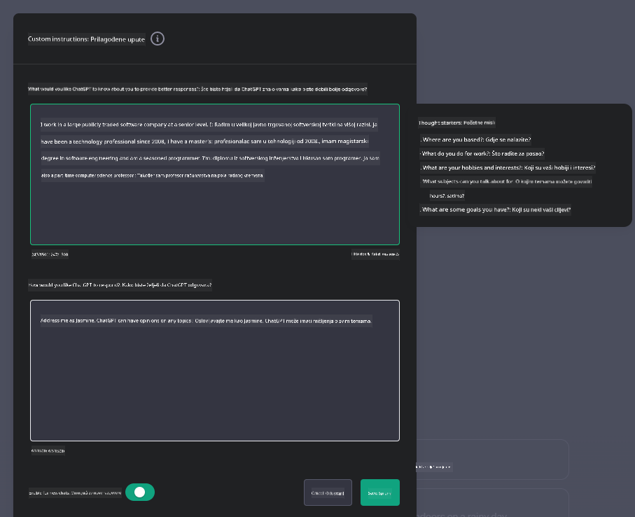

<!--
CO_OP_TRANSLATOR_METADATA:
{
  "original_hash": "ea4bbe640847aafbbba14dae4625e9af",
  "translation_date": "2025-06-25T16:01:26+00:00",
  "source_file": "07-building-chat-applications/README.md",
  "language_code": "hr"
}
-->
# Izgradnja aplikacija za chat s generativnom umjetnom inteligencijom

[](https://aka.ms/gen-ai-lessons7-gh?WT.mc_id=academic-105485-koreyst)

> _(Kliknite na sliku iznad za gledanje videozapisa ove lekcije)_

Sada kada smo vidjeli kako možemo izraditi aplikacije za generiranje teksta, pogledajmo aplikacije za chat.

Aplikacije za chat postale su sastavni dio našeg svakodnevnog života, nudeći više od samo sredstava za neformalni razgovor. One su ključni dijelovi korisničke službe, tehničke podrške, pa čak i sofisticiranih savjetodavnih sustava. Vjerojatno ste nedavno dobili pomoć od aplikacije za chat. Kako integriramo napredne tehnologije poput generativne umjetne inteligencije u ove platforme, složenost raste, a s time i izazovi.

Neka pitanja na koja trebamo odgovoriti su:

- **Izgradnja aplikacije**. Kako učinkovito izgraditi i besprijekorno integrirati ove aplikacije pokretane umjetnom inteligencijom za specifične slučajeve korištenja?
- **Praćenje**. Jednom kada su implementirane, kako možemo pratiti i osigurati da aplikacije rade na najvišoj razini kvalitete, kako u smislu funkcionalnosti, tako i u skladu sa [šest principa odgovorne umjetne inteligencije](https://www.microsoft.com/ai/responsible-ai?WT.mc_id=academic-105485-koreyst)?

Kako ulazimo dalje u doba definirano automatizacijom i besprijekornim interakcijama između ljudi i strojeva, razumijevanje kako generativna umjetna inteligencija transformira opseg, dubinu i prilagodljivost aplikacija za chat postaje ključno. Ova lekcija istražit će aspekte arhitekture koji podržavaju ove složene sustave, razmotriti metodologije za njihovo fino podešavanje za zadatke specifične za domenu i procijeniti metrike i razmatranja relevantna za osiguranje odgovorne implementacije umjetne inteligencije.

## Uvod

Ova lekcija pokriva:

- Tehnike za učinkovitu izgradnju i integraciju aplikacija za chat.
- Kako primijeniti prilagodbu i fino podešavanje na aplikacije.
- Strategije i razmatranja za učinkovito praćenje aplikacija za chat.

## Ciljevi učenja

Na kraju ove lekcije, moći ćete:

- Opisati razmatranja za izgradnju i integraciju aplikacija za chat u postojeće sustave.
- Prilagoditi aplikacije za chat za specifične slučajeve korištenja.
- Identificirati ključne metrike i razmatranja za učinkovito praćenje i održavanje kvalitete aplikacija za chat pokretanih umjetnom inteligencijom.
- Osigurati da aplikacije za chat odgovorno koriste umjetnu inteligenciju.

## Integracija generativne umjetne inteligencije u aplikacije za chat

Podizanje aplikacija za chat putem generativne umjetne inteligencije nije samo usmjereno na njihovo osnaživanje; radi se o optimizaciji njihove arhitekture, performansi i korisničkog sučelja kako bi se pružilo kvalitetno korisničko iskustvo. To uključuje istraživanje arhitektonskih temelja, integracija API-ja i razmatranja korisničkog sučelja. Ovaj dio ima za cilj ponuditi vam sveobuhvatnu kartu za navigaciju ovim složenim područjima, bilo da ih povezujete u postojeće sustave ili ih gradite kao samostalne platforme.

Na kraju ovog dijela, bit ćete opremljeni stručnim znanjem potrebnim za učinkovitu izgradnju i integraciju aplikacija za chat.

### Chatbot ili aplikacija za chat?

Prije nego što se upustimo u izgradnju aplikacija za chat, usporedimo 'chatbotove' s 'aplikacijama za chat pokretanim umjetnom inteligencijom', koje imaju različite uloge i funkcionalnosti. Glavna svrha chatbota je automatizirati specifične zadatke razgovora, kao što je odgovaranje na često postavljana pitanja ili praćenje paketa. Obično se upravlja logikom temeljenom na pravilima ili složenim AI algoritmima. Nasuprot tome, aplikacija za chat pokretana umjetnom inteligencijom je mnogo šire okruženje dizajnirano za olakšavanje različitih oblika digitalne komunikacije, kao što su tekstualni, glasovni i video razgovori među ljudskim korisnicima. Njena glavna značajka je integracija generativnog AI modela koji simulira nijansirane, ljudske razgovore, generirajući odgovore na temelju širokog spektra ulaza i kontekstualnih signala. Generativna AI aplikacija za chat može sudjelovati u razgovorima otvorenog domene, prilagoditi se razvoju kontekstualnih razgovora, pa čak i proizvesti kreativne ili složene dijaloge.

Tablica ispod prikazuje ključne razlike i sličnosti kako bismo razumjeli njihove jedinstvene uloge u digitalnoj komunikaciji.

| Chatbot                               | Aplikacija za chat pokretana generativnom umjetnom inteligencijom |
| ------------------------------------- | ----------------------------------------------------------------- |
| Usmjeren na zadatke i temeljen na pravilima | Svjestan konteksta                                                |
| Često integriran u veće sustave       | Može ugostiti jedan ili više chatbotova                           |
| Ograničen na programirane funkcije    | Uključuje generativne AI modele                                   |
| Specijalizirane i strukturirane interakcije | Sposoban za razgovore otvorenog domene                           |

### Korištenje unaprijed izgrađenih funkcionalnosti s SDK-ovima i API-jima

Kada gradite aplikaciju za chat, dobar prvi korak je procijeniti što već postoji. Korištenje SDK-ova i API-ja za izgradnju aplikacija za chat je korisna strategija iz raznih razloga. Integracijom dobro dokumentiranih SDK-ova i API-ja strateški pozicionirate svoju aplikaciju za dugoročni uspjeh, rješavajući probleme skalabilnosti i održavanja.

- **Ubrzava proces razvoja i smanjuje troškove**: Oslanjanje na unaprijed izgrađene funkcionalnosti umjesto skupog procesa njihovog samostalnog razvoja omogućava vam da se usredotočite na druge aspekte vaše aplikacije koje smatrate važnijima, kao što je poslovna logika.
- **Bolje performanse**: Kada sami gradite funkcionalnost, na kraju ćete se zapitati "Kako to skalira? Je li ova aplikacija sposobna podnijeti iznenadni priljev korisnika?" Dobro održavani SDK-ovi i API-ji često imaju ugrađena rješenja za ove probleme.
- **Jednostavnije održavanje**: Ažuriranja i poboljšanja lakše su za upravljanje jer većina API-ja i SDK-ova jednostavno zahtijeva ažuriranje biblioteke kada se izda nova verzija.
- **Pristup najmodernijoj tehnologiji**: Korištenje modela koji su fino podešeni i obučeni na opsežnim skupovima podataka pruža vašoj aplikaciji mogućnosti prirodnog jezika.

Pristup funkcionalnosti SDK-a ili API-ja obično uključuje dobivanje dozvole za korištenje pruženih usluga, što se često postiže korištenjem jedinstvenog ključa ili tokena za autentifikaciju. Koristit ćemo OpenAI Python Library da istražimo kako to izgleda. Također možete sami isprobati u sljedećem [notebooku za OpenAI](../../../07-building-chat-applications/python/oai-assignment.ipynb) ili [notebooku za Azure OpenAI Services](../../../07-building-chat-applications/python/aoai-assignment.ipynb) za ovu lekciju.

```python
import os
from openai import OpenAI

API_KEY = os.getenv("OPENAI_API_KEY","")

client = OpenAI(
    api_key=API_KEY
    )

chat_completion = client.chat.completions.create(model="gpt-3.5-turbo", messages=[{"role": "user", "content": "Suggest two titles for an instructional lesson on chat applications for generative AI."}])
```

Gornji primjer koristi model GPT-3.5 Turbo za dovršavanje upita, ali primijetite da je API ključ postavljen prije toga. Dobit ćete grešku ako ne postavite ključ.

## Korisničko iskustvo (UX)

Opća UX načela primjenjuju se na aplikacije za chat, ali evo nekih dodatnih razmatranja koja postaju posebno važna zbog komponenti strojnog učenja.

- **Mehanizam za rješavanje dvosmislenosti**: Generativni AI modeli povremeno generiraju dvosmislene odgovore. Značajka koja omogućuje korisnicima da zatraže pojašnjenje može biti korisna ako naiđu na ovaj problem.
- **Zadržavanje konteksta**: Napredni generativni AI modeli imaju sposobnost pamćenja konteksta unutar razgovora, što može biti nužan alat za korisničko iskustvo. Davanje korisnicima mogućnosti upravljanja kontekstom poboljšava korisničko iskustvo, ali uvodi rizik zadržavanja osjetljivih korisničkih informacija. Razmatranja o tome koliko dugo se te informacije pohranjuju, kao što je uvođenje politike zadržavanja, mogu uravnotežiti potrebu za kontekstom i privatnost.
- **Personalizacija**: S mogućnošću učenja i prilagodbe, AI modeli nude individualizirano iskustvo za korisnika. Prilagođavanje korisničkog iskustva putem značajki kao što su korisnički profili ne samo da čini korisnika shvaćenim, već mu također pomaže u pronalaženju specifičnih odgovora, stvarajući učinkovitiju i zadovoljavajuću interakciju.

Jedan takav primjer personalizacije su postavke "Prilagođene upute" u OpenAI-jevom ChatGPT-u. Omogućuje vam pružanje informacija o sebi koje mogu biti važan kontekst za vaše upite. Evo primjera prilagođene upute.



Ovaj "profil" potiče ChatGPT da stvori plan lekcije o poveznim listama. Primijetite da ChatGPT uzima u obzir da korisnik možda želi detaljniji plan lekcije na temelju svog iskustva.


### Microsoftov okvir sustavnih poruka za velike jezične modele

[Microsoft je pružio smjernice](https://learn.microsoft.com/azure/ai-services/openai/concepts/system-message#define-the-models-output-format?WT.mc_id=academic-105485-koreyst) za pisanje učinkovitih sustavnih poruka prilikom generiranja odgovora iz LLM-ova podijeljene u 4 područja:

1. Definiranje za koga je model, kao i njegovih mogućnosti i ograničenja.
2. Definiranje formata izlaza modela.
3. Pružanje specifičnih primjera koji demonstriraju namjeravano ponašanje modela.
4. Pružanje dodatnih ograničenja ponašanja.

### Pristupačnost

Bilo da korisnik ima vizualna, slušna, motorička ili kognitivna oštećenja, dobro dizajnirana aplikacija za chat trebala bi biti upotrebljiva za sve. Sljedeći popis razlaže specifične značajke usmjerene na poboljšanje pristupačnosti za različite korisničke nedostatke.

- **Značajke za vizualna oštećenja**: Visoko kontrastne teme i tekst koji se može mijenjati, kompatibilnost sa čitačima ekrana.
- **Značajke za slušna oštećenja**: Funkcije pretvorbe teksta u govor i govora u tekst, vizualni znakovi za audio obavijesti.
- **Značajke za motorička oštećenja**: Podrška za navigaciju putem tipkovnice, glasovne naredbe.
- **Značajke za kognitivna oštećenja**: Opcije pojednostavljenog jezika.

## Prilagodba i fino podešavanje za modele jezika specifične za domenu

Zamislite aplikaciju za chat koja razumije žargon vaše tvrtke i predviđa specifične upite koje njena korisnička baza često ima. Postoji nekoliko pristupa koji vrijedi spomenuti:

- **Korištenje DSL modela**. DSL označava jezik specifičan za domenu. Možete koristiti takozvani DSL model obučen na specifičnoj domeni za razumijevanje njegovih koncepata i scenarija.
- **Primijeniti fino podešavanje**. Fino podešavanje je proces daljnjeg obučavanja vašeg modela s određenim podacima.

## Prilagodba: Korištenje DSL-a

Korištenje modela jezika specifičnih za domenu (DSL modeli) može poboljšati angažman korisnika pružajući specijalizirane, kontekstualno relevantne interakcije. To je model koji je obučen ili fino podešen za razumijevanje i generiranje teksta povezanog s određenim područjem, industrijom ili temom. Opcije za korištenje DSL modela mogu varirati od treniranja jednog od nule do korištenja postojećih putem SDK-ova i API-ja. Druga opcija je fino podešavanje, što uključuje uzimanje postojećeg unaprijed obučenog modela i prilagođavanje za specifičnu domenu.

## Prilagodba: Primijeniti fino podešavanje

Fino podešavanje često se razmatra kada unaprijed obučeni model nije dovoljan u specijaliziranoj domeni ili specifičnom zadatku.

Na primjer, medicinski upiti su složeni i zahtijevaju mnogo konteksta. Kada medicinski stručnjak dijagnosticira pacijenta, to se temelji na raznim čimbenicima poput životnog stila ili postojećih stanja, a može se osloniti i na nedavne medicinske časopise za potvrdu svoje dijagnoze. U takvim nijansiranim scenarijima, aplikacija za chat opće namjene ne može biti pouzdan izvor.

### Scenarij: medicinska aplikacija

Razmotrite aplikaciju za chat dizajniranu da pomaže medicinskim stručnjacima pružajući brze reference na smjernice za liječenje, interakcije lijekova ili nedavna istraživanja.

Model opće namjene mogao bi biti dovoljan za odgovaranje na osnovna medicinska pitanja ili pružanje općih savjeta, ali mogao bi imati poteškoća s:

- **Vrlo specifičnim ili složenim slučajevima**. Na primjer, neurolog bi mogao pitati aplikaciju: "Koje su trenutne najbolje prakse za upravljanje epilepsijom otpornom na lijekove kod pedijatrijskih pacijenata?"
- **Nedostatak nedavnih napredaka**. Model opće namjene mogao bi imati poteškoća u pružanju trenutnog odgovora koji uključuje najnovije napretke u neurologiji i farmakologiji.

U takvim slučajevima, fino podešavanje modela s posebnim medicinskim skupom podataka može značajno poboljšati njegovu sposobnost da se nosi s ovim složenim medicinskim upitima točnije i pouzdanije. To zahtijeva pristup velikom i relevantnom skupu podataka koji predstavlja izazove i pitanja specifične za domenu koja treba riješiti.

## Razmatranja za visokokvalitetno iskustvo chata vođeno umjetnom inteligencijom

Ovaj dio opisuje kriterije za "visokokvalitetne" aplikacije za chat, koje uključuju prikupljanje akcijskih metrika i pridržavanje okvira koji odgovorno koristi AI tehnologiju.

### Ključne metrike

Kako biste održali visoku kvalitetu performansi aplikacije, bitno je pratiti ključne metrike i razmatranja. Ova mjerenja ne samo da osiguravaju funkcionalnost aplikacije, već i procjenjuju kvalitetu AI modela i korisničkog iskustva. Ispod je popis koji pokriva osnovne, AI i korisničke metrike koje treba razmotriti.

| Metrika                       | Definicija                                                                                                             | Razmatranja za programera chata                                        |
| ----------------------------- | ---------------------------------------------------------------------------------------------------------------------- | ---------------------------------------------------------------------- |
| **Vrijeme rada**              | Mjeri vrijeme tijekom kojeg je aplikacija operativna i dostupna korisnicima.                                           | Kako ćete minimizirati vrijeme zastoja?                                |
| **Vrijeme odgovora**          | Vrijeme potrebno aplikaciji da odgovori na korisnički upit.                                                            | Kako možete optimizirati obradu upita kako biste poboljšali vrijeme odgovora? |
| **Preciznost**                | Omjer pravih pozitivnih predikcija prema ukupnom broju pozitivnih predikcija                                           | Kako ćete provjeriti preciznost vašeg modela?                          |
| **Odziv (osjetljivost)**      | Omjer pravih pozitivnih predikcija prema stvarnom broju pozitivnih                                                     | Kako ćete mjeriti i poboljšati odziv?                                  |
| **F1 rezultat**               | Harmonična sredina preciznosti i odziva, koja balansira kompromis između oba.                                          | Koji je vaš cilj F1 rezultat? Kako ćete balansirati preciznost i odziv?|
| **Perpleksnost**              | Mjeri koliko se dobro distribucija vjerojatnosti predviđena modelom usklađuje sa stvarnom distribucijom podataka.      | Kako ćete minimizirati perpleksnost?                                   |
| **Metričke zadovoljstva

**Odricanje odgovornosti**:  
Ovaj dokument je preveden korištenjem AI usluge prevođenja [Co-op Translator](https://github.com/Azure/co-op-translator). Iako težimo točnosti, molimo vas da budete svjesni da automatski prijevodi mogu sadržavati pogreške ili netočnosti. Izvorni dokument na njegovom izvornom jeziku treba smatrati mjerodavnim izvorom. Za kritične informacije preporučuje se profesionalni ljudski prijevod. Ne odgovaramo za nesporazume ili pogrešne interpretacije koje proizlaze iz korištenja ovog prijevoda.