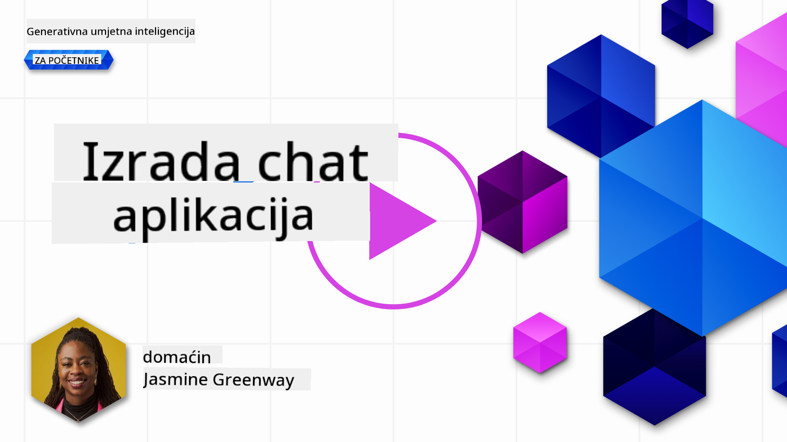
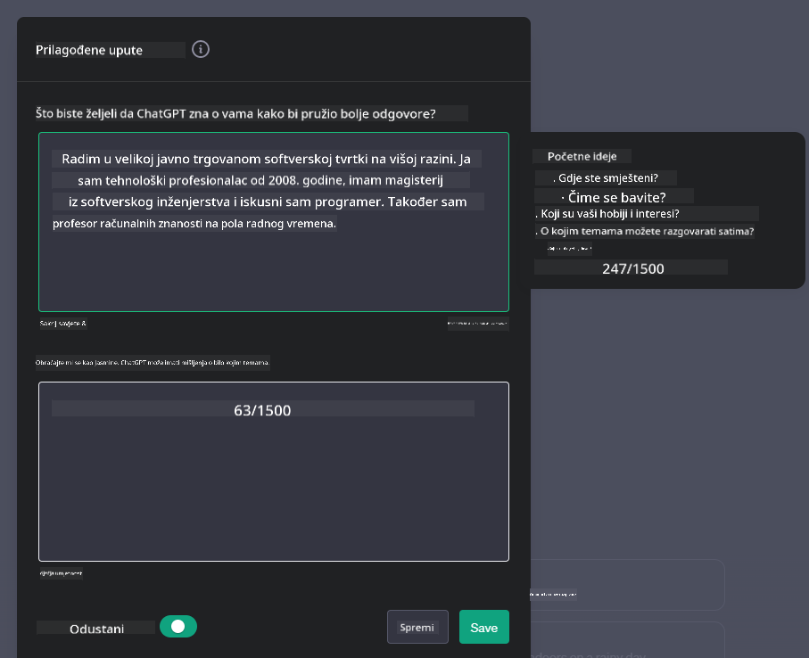

<!--
CO_OP_TRANSLATOR_METADATA:
{
  "original_hash": "a5308963a56cfbad2d73b0fa99fe84b3",
  "translation_date": "2025-10-18T01:34:54+00:00",
  "source_file": "07-building-chat-applications/README.md",
  "language_code": "hr"
}
-->
# Izrada aplikacija za chat s generativnom umjetnom inteligencijom

[](https://youtu.be/R9V0ZY1BEQo?si=IHuU-fS9YWT8s4sA)

> _(Kliknite na sliku iznad za pregled videozapisa ove lekcije)_

Sada kada smo vidjeli kako možemo izraditi aplikacije za generiranje teksta, pogledajmo aplikacije za chat.

Aplikacije za chat postale su sastavni dio našeg svakodnevnog života, nudeći više od samog sredstva za neformalnu komunikaciju. One su ključni dijelovi korisničke podrške, tehničke podrške, pa čak i sofisticiranih savjetodavnih sustava. Vjerojatno ste nedavno dobili pomoć od aplikacije za chat. Kako integriramo napredne tehnologije poput generativne umjetne inteligencije u ove platforme, složenost se povećava, kao i izazovi.

Neka od pitanja na koja trebamo odgovoriti su:

- **Izrada aplikacije**. Kako učinkovito izraditi i besprijekorno integrirati ove aplikacije s umjetnom inteligencijom za specifične slučajeve upotrebe?
- **Praćenje**. Nakon implementacije, kako možemo pratiti i osigurati da aplikacije rade na najvišoj razini kvalitete, kako u smislu funkcionalnosti, tako i u skladu sa [šest principa odgovorne umjetne inteligencije](https://www.microsoft.com/ai/responsible-ai?WT.mc_id=academic-105485-koreyst)?

Kako se sve više približavamo dobu definiranom automatizacijom i besprijekornom interakcijom između ljudi i strojeva, razumijevanje kako generativna umjetna inteligencija transformira opseg, dubinu i prilagodljivost aplikacija za chat postaje ključno. Ova lekcija istražit će aspekte arhitekture koji podržavaju ove složene sustave, razmotriti metodologije za njihovo prilagođavanje specifičnim zadacima i procijeniti metrike i razmatranja relevantna za osiguranje odgovorne primjene umjetne inteligencije.

## Uvod

Ova lekcija obuhvaća:

- Tehnike za učinkovitu izradu i integraciju aplikacija za chat.
- Kako primijeniti prilagodbu i fino podešavanje na aplikacije.
- Strategije i razmatranja za učinkovito praćenje aplikacija za chat.

## Ciljevi učenja

Na kraju ove lekcije, moći ćete:

- Opisati razmatranja za izradu i integraciju aplikacija za chat u postojeće sustave.
- Prilagoditi aplikacije za chat za specifične slučajeve upotrebe.
- Identificirati ključne metrike i razmatranja za učinkovito praćenje i održavanje kvalitete aplikacija za chat s umjetnom inteligencijom.
- Osigurati da aplikacije za chat odgovorno koriste umjetnu inteligenciju.

## Integracija generativne umjetne inteligencije u aplikacije za chat

Unapređenje aplikacija za chat pomoću generativne umjetne inteligencije nije samo usmjereno na njihovo pametnije funkcioniranje; radi se o optimizaciji njihove arhitekture, performansi i korisničkog sučelja kako bi se pružilo kvalitetno korisničko iskustvo. To uključuje istraživanje arhitektonskih temelja, integraciju API-ja i razmatranje korisničkog sučelja. Ovaj odjeljak ima za cilj ponuditi vam sveobuhvatan vodič za navigaciju ovim složenim područjima, bilo da ih integrirate u postojeće sustave ili ih gradite kao samostalne platforme.

Na kraju ovog odjeljka bit ćete opremljeni stručnim znanjem potrebnim za učinkovitu izradu i integraciju aplikacija za chat.

### Chatbot ili aplikacija za chat?

Prije nego što se upustimo u izradu aplikacija za chat, usporedimo 'chatbotove' i 'aplikacije za chat s umjetnom inteligencijom', koje imaju različite uloge i funkcionalnosti. Glavna svrha chatbota je automatizacija specifičnih zadataka u komunikaciji, poput odgovaranja na često postavljana pitanja ili praćenja paketa. Obično se temelji na logici zasnovanoj na pravilima ili složenim algoritmima umjetne inteligencije. Nasuprot tome, aplikacija za chat s umjetnom inteligencijom mnogo je šire okruženje osmišljeno za olakšavanje različitih oblika digitalne komunikacije, poput tekstualnih, glasovnih i video razgovora među korisnicima. Njena ključna značajka je integracija generativnog AI modela koji simulira nijansirane, ljudske razgovore, generirajući odgovore na temelju širokog spektra unosa i kontekstualnih znakova. Aplikacija za chat s generativnom umjetnom inteligencijom može sudjelovati u otvorenim raspravama, prilagoditi se promjenjivim kontekstima razgovora, pa čak i stvarati kreativne ili složene dijaloge.

Tablica u nastavku prikazuje ključne razlike i sličnosti kako bismo razumjeli njihove jedinstvene uloge u digitalnoj komunikaciji.

| Chatbot                               | Aplikacija za chat s generativnom umjetnom inteligencijom |
| ------------------------------------- | -------------------------------------------------------- |
| Usmjeren na zadatke i temeljen na pravilima | Svjestan konteksta                                       |
| Često integriran u veće sustave       | Može sadržavati jedan ili više chatbotova                |
| Ograničen na programirane funkcije    | Uključuje generativne AI modele                          |
| Specijalizirane i strukturirane interakcije | Sposoban za otvorene rasprave                           |

### Korištenje unaprijed izgrađenih funkcionalnosti s SDK-ovima i API-jima

Prilikom izrade aplikacije za chat, dobar prvi korak je procijeniti što već postoji. Korištenje SDK-ova i API-ja za izradu aplikacija za chat je korisna strategija iz više razloga. Integracijom dobro dokumentiranih SDK-ova i API-ja, strateški pozicionirate svoju aplikaciju za dugoročni uspjeh, rješavajući probleme skalabilnosti i održavanja.

- **Ubrzava proces razvoja i smanjuje troškove**: Oslanjanje na unaprijed izgrađene funkcionalnosti umjesto na skupi proces njihove izrade omogućuje vam da se usredotočite na druge aspekte vaše aplikacije koji su vam možda važniji, poput poslovne logike.
- **Bolje performanse**: Kada sami gradite funkcionalnost, na kraju ćete se zapitati "Kako se to skalira? Je li ova aplikacija sposobna podnijeti iznenadni priljev korisnika?" Dobro održavani SDK-ovi i API-ji često imaju ugrađena rješenja za ove probleme.
- **Jednostavnije održavanje**: Ažuriranja i poboljšanja lakše su za upravljanje jer većina API-ja i SDK-ova jednostavno zahtijeva ažuriranje biblioteke kada se objavi novija verzija.
- **Pristup najnovijoj tehnologiji**: Korištenje modela koji su fino podešeni i obučeni na opsežnim skupovima podataka pruža vašoj aplikaciji sposobnosti obrade prirodnog jezika.

Pristup funkcionalnostima SDK-a ili API-ja obično uključuje dobivanje dozvole za korištenje pruženih usluga, što se često ostvaruje putem jedinstvenog ključa ili autentifikacijskog tokena. Koristit ćemo OpenAI Python Library kako bismo istražili kako to izgleda. Također možete sami isprobati u sljedećem [notebooku za OpenAI](./python/oai-assignment.ipynb?WT.mc_id=academic-105485-koreyst) ili [notebooku za Azure OpenAI Services](./python/aoai-assignment.ipynb?WT.mc_id=academic-105485-koreys) za ovu lekciju.

```python
import os
from openai import OpenAI

API_KEY = os.getenv("OPENAI_API_KEY","")

client = OpenAI(
    api_key=API_KEY
    )

chat_completion = client.chat.completions.create(model="gpt-3.5-turbo", messages=[{"role": "user", "content": "Suggest two titles for an instructional lesson on chat applications for generative AI."}])
```

Gornji primjer koristi GPT-3.5 Turbo model za dovršavanje upita, ali primijetite da je API ključ postavljen prije nego što se to učini. Dobit ćete grešku ako ključ nije postavljen.

## Korisničko iskustvo (UX)

Opća načela UX-a primjenjuju se na aplikacije za chat, ali ovdje su neka dodatna razmatranja koja postaju posebno važna zbog komponenti strojnog učenja koje su uključene.

- **Mehanizam za rješavanje nejasnoća**: Generativni AI modeli povremeno generiraju nejasne odgovore. Značajka koja omogućuje korisnicima da zatraže pojašnjenje može biti korisna ako se suoče s ovim problemom.
- **Zadržavanje konteksta**: Napredni generativni AI modeli imaju sposobnost pamćenja konteksta unutar razgovora, što može biti nužna prednost za korisničko iskustvo. Davanje korisnicima mogućnosti upravljanja kontekstom poboljšava korisničko iskustvo, ali uvodi rizik od zadržavanja osjetljivih korisničkih informacija. Razmatranja o tome koliko dugo se te informacije pohranjuju, poput uvođenja politike zadržavanja, mogu uravnotežiti potrebu za kontekstom i privatnošću.
- **Personalizacija**: Sposobnost učenja i prilagodbe omogućuje AI modelima da ponude individualizirano iskustvo korisniku. Prilagodba korisničkog iskustva putem značajki poput korisničkih profila ne samo da čini korisnika shvaćenim, već mu pomaže u pronalaženju specifičnih odgovora, stvarajući učinkovitiju i zadovoljavajuću interakciju.

Jedan takav primjer personalizacije su postavke "Prilagođene upute" u OpenAI-jevom ChatGPT-u. Omogućuje vam pružanje informacija o sebi koje mogu biti važan kontekst za vaše upite. Evo primjera prilagođene upute.



Ovaj "profil" potiče ChatGPT da stvori plan lekcije o povezanim listama. Primijetite da ChatGPT uzima u obzir da korisnik možda želi detaljniji plan lekcije na temelju svog iskustva.


### Microsoftov okvir za sistemske poruke za velike jezične modele

[Microsoft je pružio smjernice](https://learn.microsoft.com/azure/ai-services/openai/concepts/system-message#define-the-models-output-format?WT.mc_id=academic-105485-koreyst) za pisanje učinkovitih sistemskih poruka prilikom generiranja odgovora od velikih jezičnih modela, podijeljene u 4 područja:

1. Definiranje za koga je model namijenjen, kao i njegovih sposobnosti i ograničenja.
2. Definiranje formata izlaznih podataka modela.
3. Pružanje specifičnih primjera koji demonstriraju željeno ponašanje modela.
4. Pružanje dodatnih smjernica za ponašanje.

### Pristupačnost

Bez obzira na to ima li korisnik vizualne, slušne, motoričke ili kognitivne poteškoće, dobro dizajnirana aplikacija za chat trebala bi biti dostupna svima. Sljedeći popis razlaže specifične značajke usmjerene na poboljšanje pristupačnosti za različite korisničke poteškoće.

- **Značajke za vizualne poteškoće**: Teme visokog kontrasta i prilagodljivi tekst, kompatibilnost sa čitačima ekrana.
- **Značajke za slušne poteškoće**: Funkcije pretvorbe teksta u govor i govora u tekst, vizualni pokazatelji za audio obavijesti.
- **Značajke za motoričke poteškoće**: Podrška za navigaciju putem tipkovnice, glasovne naredbe.
- **Značajke za kognitivne poteškoće**: Opcije pojednostavljenog jezika.

## Prilagodba i fino podešavanje za modele jezika specifične za domenu

Zamislite aplikaciju za chat koja razumije žargon vaše tvrtke i predviđa specifične upite koje njezina korisnička baza često postavlja. Postoji nekoliko pristupa vrijednih spomena:

- **Korištenje DSL modela**. DSL označava jezik specifičan za domenu. Možete koristiti takozvani DSL model obučen na specifičnoj domeni kako bi razumio njezine koncepte i scenarije.
- **Primjena finog podešavanja**. Fino podešavanje je proces daljnjeg treniranja vašeg modela s određenim podacima.

## Prilagodba: Korištenje DSL-a

Korištenje modela jezika specifičnih za domenu (DSL modeli) može poboljšati angažman korisnika pružanjem specijaliziranih, kontekstualno relevantnih interakcija. To je model koji je obučen ili fino podešen za razumijevanje i generiranje teksta vezanog uz određeno područje, industriju ili temu. Opcije za korištenje DSL modela mogu varirati od treniranja jednog od nule do korištenja već postojećih putem SDK-ova i API-ja. Druga opcija je fino podešavanje, što uključuje prilagodbu postojećeg unaprijed obučenog modela za specifičnu domenu.

## Prilagodba: Primjena finog podešavanja

Fino podešavanje često se razmatra kada unaprijed obučeni model ne zadovoljava potrebe u specijaliziranoj domeni ili specifičnom zadatku.

Na primjer, medicinski upiti su složeni i zahtijevaju puno konteksta. Kada medicinski stručnjak dijagnosticira pacijenta, to se temelji na raznim čimbenicima poput životnog stila ili već postojećih stanja, a može se osloniti i na nedavne medicinske časopise kako bi potvrdio svoju dijagnozu. U takvim nijansiranim scenarijima, aplikacija za chat s općom namjenom ne može biti pouzdan izvor.

### Scenarij: medicinska aplikacija

Razmislite o aplikaciji za chat osmišljenoj da pomaže medicinskim stručnjacima pružanjem brzih referenci na smjernice za liječenje, interakcije lijekova ili najnovija istraživanja.

Model opće namjene mogao bi biti adekvatan za odgovaranje na osnovna medicinska pitanja ili pružanje općih savjeta, ali mogao bi imati poteškoća sa sljedećim:

- **Vrlo specifični ili složeni slučajevi**. Na primjer, neurolog bi mogao pitati aplikaciju: "Koje su trenutne najbolje prakse za upravljanje epilepsijom otpornom na lijekove kod pedijatrijskih pacijenata?"
- **Nedostatak najnovijih dostignuća**. Model opće namjene mogao bi imati poteškoća u pružanju aktualnog odgovora koji uključuje najnovija dostignuća u neurologiji i farmakologiji.

U takvim slučajevima, fino podešavanje modela s specijaliziranim medicinskim skupom podataka može značajno poboljšati njegovu sposobnost da se nosi s ovim složenim medicinskim upitima preciznije i pouzdanije. To zahtijeva pristup velikom i relevantnom skupu podataka koji predstavlja izazove i pitanja specifična za domenu.

## Razmatranja za kvalitetno iskustvo s AI-pokretanim chat aplikacijama

Ovaj odjeljak opisuje kriterije za "visokokvalitetne" aplikacije za chat, uključujući prikupljanje mjerljivih metrika i pridržavanje okvira koji odgovorno koristi tehnologiju umjetne inteligencije.

### Ključne metrike

Kako biste održali visokokvalitetne performanse aplikacije, ključno je pratiti ključne metrike i razmatranja. Ova mjerenja ne samo da osiguravaju funkcionalnost aplikacije, već i procjenjuju kvalitetu AI modela i korisničkog iskustva. U nastavku je popis koji pokriva osnovne, AI i korisničke metrike koje treba uzeti u obzir.

| Metrika                      | Definicija                                                                                                             | Razmatranja za developera aplikacije za chat                              |
| ---------------------------- | ---------------------------------------------------------------------------------------------------------------------- | ------------------------------------------------------------------------- |
| **Dostupnost**               | Mjeri vrijeme tijekom kojeg je aplikacija operativna i dostupna korisnicima.                                           | Kako ćete minimizirati vrijeme nedostupnosti?                            |
| **Vrijeme odgovora**         | Vrijeme potrebno aplikaciji da odgovori na korisnički upit.                                                            | Kako možete optimizirati obradu upita za poboljšanje vremena odgovora?    |
| **Preciznost**               | Omjer točnih pozitivnih predviđanja prema ukupnom broju pozitivnih predviđanja.                                        | Kako ćete provjeriti preciznost vašeg modela?                             |
| **Odziv (osjetljivost)**     | Omjer točnih pozitivnih predviđanja prema stvarnom broju pozitivnih.                                                   | Kako ćete mjeriti i poboljšati odziv?                                     |
| **F1 rezultat**              | Harmonična sredina preciznosti i odziva, koja balansira kompromis između oba.                                          | Koji je vaš ciljani F1 rezultat? Kako ćete balansirati preciznost i odziv?|
| **Perpleksnost**             | Mjeri koliko dobro distribucija vjerojatnosti koju predvi
| **Otkrivanje anomalija**      | Alati i tehnike za prepoznavanje neobičnih obrazaca koji ne odgovaraju očekivanom ponašanju.                          | Kako ćete reagirati na anomalije?                                          |

### Provedba odgovorne AI prakse u aplikacijama za chat

Microsoftov pristup odgovornoj AI identificirao je šest principa koji bi trebali voditi razvoj i korištenje AI-a. Ispod su navedeni principi, njihova definicija, te stvari koje bi programer chata trebao uzeti u obzir i zašto su važni.

| Principi               | Microsoftova definicija                               | Razmatranja za programera chata                                        | Zašto je važno                                                                      |
| ---------------------- | ----------------------------------------------------- | ---------------------------------------------------------------------- | ----------------------------------------------------------------------------------- |
| Pravednost             | AI sustavi trebaju tretirati sve ljude pravedno.      | Osigurajte da aplikacija za chat ne diskriminira na temelju korisničkih podataka. | Za izgradnju povjerenja i inkluzivnosti među korisnicima; izbjegava pravne posljedice. |
| Pouzdanost i sigurnost | AI sustavi trebaju raditi pouzdano i sigurno.         | Provedite testiranje i sigurnosne mjere kako biste minimizirali pogreške i rizike. | Osigurava zadovoljstvo korisnika i sprječava potencijalnu štetu.                     |
| Privatnost i sigurnost | AI sustavi trebaju biti sigurni i poštovati privatnost. | Provedite snažne mjere enkripcije i zaštite podataka.                  | Za zaštitu osjetljivih korisničkih podataka i usklađenost s zakonima o privatnosti.  |
| Inkluzivnost           | AI sustavi trebaju osnaživati sve i uključivati ljude. | Dizajnirajte UI/UX koji je pristupačan i jednostavan za raznoliku publiku. | Osigurava da širi spektar ljudi može učinkovito koristiti aplikaciju.                |
| Transparentnost        | AI sustavi trebaju biti razumljivi.                   | Pružite jasnu dokumentaciju i objašnjenja za AI odgovore.              | Korisnici će vjerojatnije vjerovati sustavu ako mogu razumjeti kako se donose odluke. |
| Odgovornost            | Ljudi trebaju biti odgovorni za AI sustave.           | Uspostavite jasan proces za reviziju i poboljšanje AI odluka.          | Omogućuje kontinuirano poboljšanje i korektivne mjere u slučaju pogrešaka.           |

## Zadatak

Pogledajte [zadatak](../../../07-building-chat-applications/python). Proći ćete kroz niz vježbi od pokretanja prvih chat upita, do klasifikacije i sažimanja teksta i više. Primijetite da su zadaci dostupni na različitim programskim jezicima!

## Odlično obavljen posao! Nastavite putovanje

Nakon što završite ovu lekciju, pogledajte našu [kolekciju za učenje generativne AI](https://aka.ms/genai-collection?WT.mc_id=academic-105485-koreyst) kako biste nastavili unapređivati svoje znanje o generativnoj AI!

Prijeđite na Lekciju 8 kako biste vidjeli kako možete započeti [izgradnju aplikacija za pretraživanje](../08-building-search-applications/README.md?WT.mc_id=academic-105485-koreyst)!

---

**Odricanje od odgovornosti**:  
Ovaj dokument je preveden pomoću AI usluge za prevođenje [Co-op Translator](https://github.com/Azure/co-op-translator). Iako nastojimo osigurati točnost, imajte na umu da automatski prijevodi mogu sadržavati pogreške ili netočnosti. Izvorni dokument na izvornom jeziku treba smatrati autoritativnim izvorom. Za ključne informacije preporučuje se profesionalni prijevod od strane čovjeka. Ne preuzimamo odgovornost za nesporazume ili pogrešna tumačenja koja proizlaze iz korištenja ovog prijevoda.