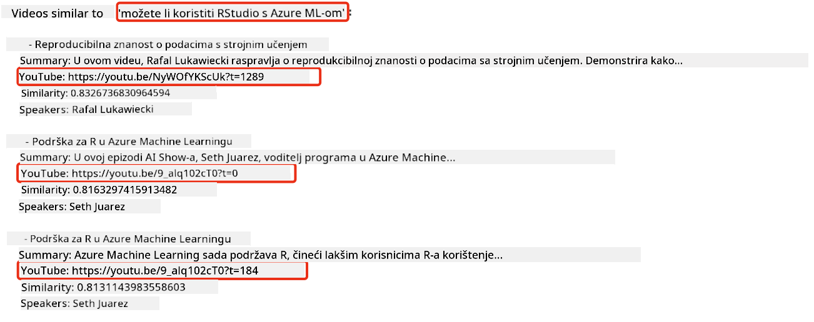
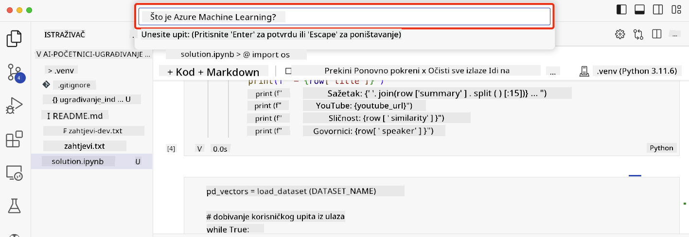

<!--
CO_OP_TRANSLATOR_METADATA:
{
  "original_hash": "d46aad0917a1a342d613e2c13d457da5",
  "translation_date": "2025-07-09T13:03:32+00:00",
  "source_file": "08-building-search-applications/README.md",
  "language_code": "hr"
}
-->
# Izrada aplikacija za pretraživanje

[](https://aka.ms/gen-ai-lesson8-gh?WT.mc_id=academic-105485-koreyst)

> > _Kliknite na gornju sliku za pregled videa ove lekcije_

LLM-ovi nisu samo za chatbote i generiranje teksta. Također je moguće izraditi aplikacije za pretraživanje koristeći Embeddinge. Embeddingi su numeričke reprezentacije podataka, poznate i kao vektori, koje se mogu koristiti za semantičko pretraživanje podataka.

U ovoj lekciji izradit ćete aplikaciju za pretraživanje za naš startup u obrazovanju. Naš startup je neprofitna organizacija koja pruža besplatno obrazovanje studentima u zemljama u razvoju. Imamo veliki broj YouTube videa koje studenti mogu koristiti za učenje o AI-u. Želimo izraditi aplikaciju za pretraživanje koja studentima omogućuje da pretražuju YouTube video upisivanjem pitanja.

Na primjer, student može upisati 'Što su Jupyter bilježnice?' ili 'Što je Azure ML', a aplikacija za pretraživanje vratit će popis YouTube videa relevantnih za pitanje, a još bolje, aplikacija će vratiti i poveznicu na mjesto u videu gdje se nalazi odgovor na pitanje.

## Uvod

U ovoj lekciji obradit ćemo:

- Semantičko naspram pretraživanja po ključnim riječima.
- Što su Text Embeddingi.
- Izrada indeksa Text Embeddinga.
- Pretraživanje indeksa Text Embeddinga.

## Ciljevi učenja

Nakon završetka ove lekcije moći ćete:

- Razlikovati semantičko i pretraživanje po ključnim riječima.
- Objasniti što su Text Embeddingi.
- Izraditi aplikaciju koja koristi Embeddinge za pretraživanje podataka.

## Zašto izraditi aplikaciju za pretraživanje?

Izrada aplikacije za pretraživanje pomoći će vam razumjeti kako koristiti Embeddinge za pretraživanje podataka. Također ćete naučiti kako izraditi aplikaciju za pretraživanje koju studenti mogu koristiti za brzo pronalaženje informacija.

Lekcija uključuje indeks embeddinga YouTube transkripata za Microsoftov [AI Show](https://www.youtube.com/playlist?list=PLlrxD0HtieHi0mwteKBOfEeOYf0LJU4O1) YouTube kanal. AI Show je YouTube kanal koji vas uči o AI-u i strojnome učenju. Indeks embeddinga sadrži embeddinge za svaki od YouTube transkripata do listopada 2023. Koristit ćete indeks embeddinga za izradu aplikacije za pretraživanje za naš startup. Aplikacija za pretraživanje vraća poveznicu na mjesto u videu gdje se nalazi odgovor na pitanje. Ovo je izvrstan način da studenti brzo pronađu potrebne informacije.

Slijedi primjer semantičkog upita za pitanje 'možete li koristiti rstudio s azure ml?'. Pogledajte YouTube URL, vidjet ćete da URL sadrži vremensku oznaku koja vas vodi na mjesto u videu gdje se nalazi odgovor na pitanje.



## Što je semantičko pretraživanje?

Možda se pitate, što je semantičko pretraživanje? Semantičko pretraživanje je tehnika pretraživanja koja koristi semantiku, odnosno značenje riječi u upitu, kako bi vratila relevantne rezultate.

Evo primjera semantičkog pretraživanja. Recimo da tražite automobil, mogli biste pretraživati 'moj automobil iz snova', semantičko pretraživanje razumije da ne `sanjarite` o automobilu, već da tražite svoj `idealni` automobil. Semantičko pretraživanje razumije vašu namjeru i vraća relevantne rezultate. Alternativa je `pretraživanje po ključnim riječima` koje bi doslovno tražilo snove o automobilima i često vraća nerelevantne rezultate.

## Što su Text Embeddingi?

[Text embeddingi](https://en.wikipedia.org/wiki/Word_embedding?WT.mc_id=academic-105485-koreyst) su tehnika reprezentacije teksta koja se koristi u [obradi prirodnog jezika](https://en.wikipedia.org/wiki/Natural_language_processing?WT.mc_id=academic-105485-koreyst). Text embeddingi su semantičke numeričke reprezentacije teksta. Embeddingi se koriste za predstavljanje podataka na način koji je lako razumljiv stroju. Postoji mnogo modela za izradu text embeddinga, u ovoj lekciji fokusirat ćemo se na generiranje embeddinga pomoću OpenAI Embedding Modela.

Evo primjera, zamislite da je sljedeći tekst iz transkripta jedne epizode na AI Show YouTube kanalu:

```text
Today we are going to learn about Azure Machine Learning.
```

Tekst bismo poslali OpenAI Embedding API-ju koji bi vratio sljedeći embedding sastavljen od 1536 brojeva, odnosno vektor. Svaki broj u vektoru predstavlja različiti aspekt teksta. Radi sažetosti, ovdje su prvih 10 brojeva u vektoru.

```python
[-0.006655829958617687, 0.0026128944009542465, 0.008792596869170666, -0.02446001023054123, -0.008540431968867779, 0.022071078419685364, -0.010703742504119873, 0.003311325330287218, -0.011632772162556648, -0.02187200076878071, ...]
```

## Kako se stvara indeks embeddinga?

Indeks embeddinga za ovu lekciju stvoren je nizom Python skripti. Skripte i upute pronaći ćete u [README](./scripts/README.md?WT.mc_id=academic-105485-koreyst) u mapi 'scripts' za ovu lekciju. Ne morate pokretati ove skripte da biste završili lekciju jer je indeks embeddinga već dostupan.

Skripte izvode sljedeće operacije:

1. Preuzima se transkript za svaki YouTube video u [AI Show](https://www.youtube.com/playlist?list=PLlrxD0HtieHi0mwteKBOfEeOYf0LJU4O1) playlisti.
2. Pomoću [OpenAI Functions](https://learn.microsoft.com/azure/ai-services/openai/how-to/function-calling?WT.mc_id=academic-105485-koreyst) pokušava se izvući ime govornika iz prvih 3 minute YouTube transkripta. Ime govornika za svaki video pohranjuje se u indeks embeddinga nazvan `embedding_index_3m.json`.
3. Tekst transkripta zatim se dijeli na **segmentne dijelove od 3 minute**. Segment uključuje oko 20 riječi preklapanja s idućim segmentom kako bi se osiguralo da embedding segmenta nije prekinut i kako bi se pružio bolji kontekst za pretraživanje.
4. Svaki segment teksta zatim se šalje OpenAI Chat API-ju da sažme tekst u 60 riječi. Sažetak se također pohranjuje u indeks embeddinga `embedding_index_3m.json`.
5. Na kraju, tekst segmenta šalje se OpenAI Embedding API-ju. Embedding API vraća vektor od 1536 brojeva koji predstavljaju semantičko značenje segmenta. Segment zajedno s OpenAI embedding vektorom pohranjuje se u indeks embeddinga `embedding_index_3m.json`.

### Vektorske baze podataka

Radi jednostavnosti lekcije, indeks embeddinga pohranjen je u JSON datoteku nazvanu `embedding_index_3m.json` i učitan je u Pandas DataFrame. Međutim, u produkciji bi indeks embeddinga bio pohranjen u vektorsku bazu podataka poput [Azure Cognitive Search](https://learn.microsoft.com/training/modules/improve-search-results-vector-search?WT.mc_id=academic-105485-koreyst), [Redis](https://cookbook.openai.com/examples/vector_databases/redis/readme?WT.mc_id=academic-105485-koreyst), [Pinecone](https://cookbook.openai.com/examples/vector_databases/pinecone/readme?WT.mc_id=academic-105485-koreyst), [Weaviate](https://cookbook.openai.com/examples/vector_databases/weaviate/readme?WT.mc_id=academic-105485-koreyst), da spomenemo samo neke.

## Razumijevanje kosinusne sličnosti

Naučili smo o text embeddingima, sljedeći korak je naučiti kako koristiti text embeddinge za pretraživanje podataka i posebno kako pronaći najsličnije embeddinge za zadani upit koristeći kosinusnu sličnost.

### Što je kosinusna sličnost?

Kosinusna sličnost je mjera sličnosti između dva vektora, često se naziva i `pretraživanje najbližeg susjeda`. Da biste izvršili pretraživanje kosinusne sličnosti, trebate _vektorizirati_ tekst upita pomoću OpenAI Embedding API-ja. Zatim izračunate _kosinusnu sličnost_ između vektora upita i svakog vektora u indeksu embeddinga. Zapamtite, indeks embeddinga ima vektor za svaki segment teksta YouTube transkripta. Na kraju, sortirate rezultate prema kosinusnoj sličnosti, a tekstualni segmenti s najvećom kosinusnom sličnosti su najsličniji upitu.

Iz matematičke perspektive, kosinusna sličnost mjeri kosinus kuta između dva vektora projicirana u višedimenzionalni prostor. Ova mjera je korisna jer, ako su dva dokumenta udaljena po Euklidskoj udaljenosti zbog veličine, oni i dalje mogu imati manji kut između sebe i time veću kosinusnu sličnost. Za više informacija o jednadžbama kosinusne sličnosti, pogledajte [Cosine similarity](https://en.wikipedia.org/wiki/Cosine_similarity?WT.mc_id=academic-105485-koreyst).

## Izrada vaše prve aplikacije za pretraživanje

Sljedeće ćemo naučiti kako izraditi aplikaciju za pretraživanje koristeći Embeddinge. Aplikacija za pretraživanje omogućit će studentima da pretražuju video upisivanjem pitanja. Aplikacija će vratiti popis videa relevantnih za pitanje. Također će vratiti poveznicu na mjesto u videu gdje se nalazi odgovor na pitanje.

Ovo rješenje je izrađeno i testirano na Windows 11, macOS i Ubuntu 22.04 koristeći Python 3.10 ili noviji. Python možete preuzeti s [python.org](https://www.python.org/downloads/?WT.mc_id=academic-105485-koreyst).

## Zadatak - izrada aplikacije za pretraživanje za studente

Na početku lekcije predstavili smo naš startup. Sada je vrijeme da omogućite studentima izradu aplikacije za pretraživanje za njihove zadatke.

U ovom zadatku izradit ćete Azure OpenAI usluge koje će se koristiti za izradu aplikacije za pretraživanje. Izradit ćete sljedeće Azure OpenAI usluge. Za dovršetak zadatka trebat će vam Azure pretplata.

### Pokrenite Azure Cloud Shell

1. Prijavite se u [Azure portal](https://portal.azure.com/?WT.mc_id=academic-105485-koreyst).
2. Odaberite ikonu Cloud Shell u gornjem desnom kutu Azure portala.
3. Odaberite **Bash** kao tip okruženja.

#### Izrada grupe resursa

> Za ove upute koristimo grupu resursa nazvanu "semantic-video-search" u regiji East US.
> Možete promijeniti ime grupe resursa, ali pri promjeni lokacije resursa,
> provjerite [tablicu dostupnosti modela](https://aka.ms/oai/models?WT.mc_id=academic-105485-koreyst).

```shell
az group create --name semantic-video-search --location eastus
```

#### Izrada Azure OpenAI Service resursa

Iz Azure Cloud Shell-a pokrenite sljedeću naredbu za izradu Azure OpenAI Service resursa.

```shell
az cognitiveservices account create --name semantic-video-openai --resource-group semantic-video-search \
    --location eastus --kind OpenAI --sku s0
```

#### Dohvat krajnje točke i ključeva za korištenje u aplikaciji

Iz Azure Cloud Shell-a pokrenite sljedeće naredbe za dohvat krajnje točke i ključeva za Azure OpenAI Service resurs.

```shell
az cognitiveservices account show --name semantic-video-openai \
   --resource-group  semantic-video-search | jq -r .properties.endpoint
az cognitiveservices account keys list --name semantic-video-openai \
   --resource-group semantic-video-search | jq -r .key1
```

#### Implementacija OpenAI Embedding modela

Iz Azure Cloud Shell-a pokrenite sljedeću naredbu za implementaciju OpenAI Embedding modela.

```shell
az cognitiveservices account deployment create \
    --name semantic-video-openai \
    --resource-group  semantic-video-search \
    --deployment-name text-embedding-ada-002 \
    --model-name text-embedding-ada-002 \
    --model-version "2"  \
    --model-format OpenAI \
    --sku-capacity 100 --sku-name "Standard"
```

## Rješenje

Otvorite [solution notebook](../../../08-building-search-applications/python/aoai-solution.ipynb) u GitHub Codespaces i slijedite upute u Jupyter Notebooku.

Kada pokrenete notebook, bit ćete upitani da unesete upit. Polje za unos izgledat će ovako:



## Odličan posao! Nastavite s učenjem

Nakon završetka ove lekcije, pogledajte našu [Generative AI Learning kolekciju](https://aka.ms/genai-collection?WT.mc_id=academic-105485-koreyst) kako biste nastavili usavršavati svoje znanje o Generativnoj AI!

Krenite na Lekciju 9 gdje ćemo pogledati kako [izraditi aplikacije za generiranje slika](../09-building-image-applications/README.md?WT.mc_id=academic-105485-koreyst)!

**Odricanje od odgovornosti**:  
Ovaj dokument je preveden korištenjem AI usluge za prevođenje [Co-op Translator](https://github.com/Azure/co-op-translator). Iako težimo točnosti, imajte na umu da automatski prijevodi mogu sadržavati pogreške ili netočnosti. Izvorni dokument na izvornom jeziku treba smatrati autoritativnim izvorom. Za kritične informacije preporučuje se profesionalni ljudski prijevod. Ne snosimo odgovornost za bilo kakva nesporazume ili pogrešna tumačenja koja proizlaze iz korištenja ovog prijevoda.