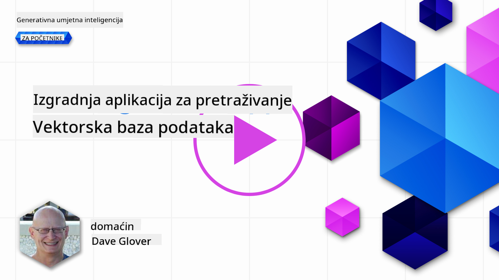
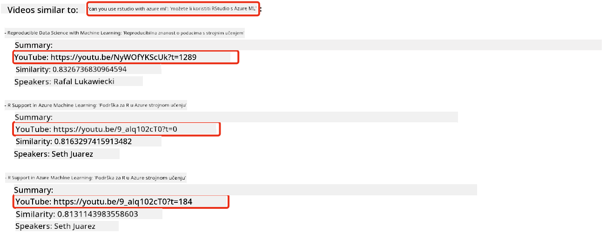
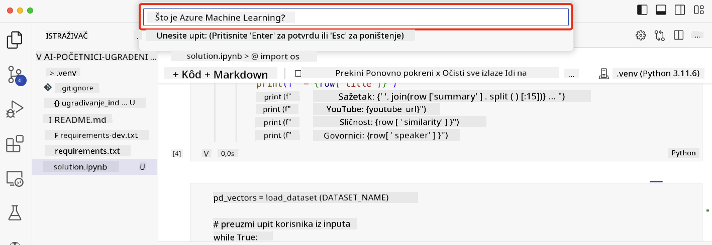

<!--
CO_OP_TRANSLATOR_METADATA:
{
  "original_hash": "d46aad0917a1a342d613e2c13d457da5",
  "translation_date": "2025-05-19T18:44:46+00:00",
  "source_file": "08-building-search-applications/README.md",
  "language_code": "hr"
}
-->
# Izgradnja aplikacija za pretraživanje

[](https://aka.ms/gen-ai-lesson8-gh?WT.mc_id=academic-105485-koreyst)

> > _Kliknite na sliku iznad za pregled video lekcije_

LLM-ovi su više od chatbotova i generiranja teksta. Također je moguće izgraditi aplikacije za pretraživanje koristeći Ugrađivanja. Ugrađivanja su numeričke reprezentacije podataka poznate kao vektori i mogu se koristiti za semantičko pretraživanje podataka.

U ovoj lekciji ćete izgraditi aplikaciju za pretraživanje za našu obrazovnu startup tvrtku. Naša startup tvrtka je neprofitna organizacija koja pruža besplatno obrazovanje studentima u zemljama u razvoju. Naša startup tvrtka ima veliki broj YouTube videa koje studenti mogu koristiti za učenje o AI. Naša startup tvrtka želi izgraditi aplikaciju za pretraživanje koja omogućava studentima da pretražuju YouTube video upisivanjem pitanja.

Na primjer, student može upisati 'Što su Jupyter Notebooks?' ili 'Što je Azure ML' i aplikacija za pretraživanje će vratiti popis YouTube videa koji su relevantni za pitanje, a još bolje, aplikacija za pretraživanje će vratiti link na mjesto u videu gdje se nalazi odgovor na pitanje.

## Uvod

U ovoj lekciji pokrit ćemo:

- Semantičko vs pretraživanje ključnih riječi.
- Što su tekstualna ugrađivanja.
- Stvaranje indeksa tekstualnih ugrađivanja.
- Pretraživanje indeksa tekstualnih ugrađivanja.

## Ciljevi učenja

Nakon završetka ove lekcije, moći ćete:

- Razlikovati semantičko pretraživanje od pretraživanja ključnih riječi.
- Objasniti što su tekstualna ugrađivanja.
- Stvoriti aplikaciju koristeći ugrađivanja za pretraživanje podataka.

## Zašto izgraditi aplikaciju za pretraživanje?

Stvaranje aplikacije za pretraživanje pomoći će vam da razumijete kako koristiti ugrađivanja za pretraživanje podataka. Također ćete naučiti kako izgraditi aplikaciju za pretraživanje koju studenti mogu koristiti za brzo pronalaženje informacija.

Lekcija uključuje indeks ugrađivanja transkripata YouTube videa za Microsoft [AI Show](https://www.youtube.com/playlist?list=PLlrxD0HtieHi0mwteKBOfEeOYf0LJU4O1) YouTube kanal. AI Show je YouTube kanal koji vas uči o AI i strojnom učenju. Indeks ugrađivanja sadrži ugrađivanja za svaki od YouTube transkripata do listopada 2023. Koristit ćete indeks ugrađivanja za izgradnju aplikacije za pretraživanje za našu startup tvrtku. Aplikacija za pretraživanje vraća link na mjesto u videu gdje se nalazi odgovor na pitanje. Ovo je odličan način za studente da brzo pronađu potrebne informacije.

Slijedi primjer semantičkog upita za pitanje 'možete li koristiti rstudio s azure ml?'. Pogledajte YouTube url, vidjet ćete da url sadrži vremensku oznaku koja vas vodi na mjesto u videu gdje se nalazi odgovor na pitanje.



## Što je semantičko pretraživanje?

Sada se možda pitate, što je semantičko pretraživanje? Semantičko pretraživanje je tehnika pretraživanja koja koristi semantiku, ili značenje, riječi u upitu za vraćanje relevantnih rezultata.

Evo primjera semantičkog pretraživanja. Recimo da tražite kupnju automobila, možda ćete pretraživati 'moj automobil iz snova', semantičko pretraživanje razumije da ne `dreaming` o automobilu, već tražite kupnju svog `ideal` automobila. Semantičko pretraživanje razumije vašu namjeru i vraća relevantne rezultate. Alternativa je `keyword search` koja bi doslovno pretraživala snove o automobilima i često vraćala irelevantne rezultate.

## Što su tekstualna ugrađivanja?

[Tekstualna ugrađivanja](https://en.wikipedia.org/wiki/Word_embedding?WT.mc_id=academic-105485-koreyst) su tehnika predstavljanja teksta koja se koristi u [obradi prirodnog jezika](https://en.wikipedia.org/wiki/Natural_language_processing?WT.mc_id=academic-105485-koreyst). Tekstualna ugrađivanja su semantičke numeričke reprezentacije teksta. Ugrađivanja se koriste za predstavljanje podataka na način koji je jednostavan za strojno razumijevanje. Postoji mnogo modela za izgradnju tekstualnih ugrađivanja, u ovoj lekciji fokusirat ćemo se na generiranje ugrađivanja koristeći OpenAI model ugrađivanja.

Evo primjera, zamislite da je sljedeći tekst u transkriptu jedne od epizoda na AI Show YouTube kanalu:

```text
Today we are going to learn about Azure Machine Learning.
```

Proslijedili bismo tekst OpenAI Embedding API-ju i on bi vratio sljedeće ugrađivanje koje se sastoji od 1536 brojeva, odnosno vektora. Svaki broj u vektoru predstavlja različiti aspekt teksta. Radi sažetosti, evo prvih 10 brojeva u vektoru.

```python
[-0.006655829958617687, 0.0026128944009542465, 0.008792596869170666, -0.02446001023054123, -0.008540431968867779, 0.022071078419685364, -0.010703742504119873, 0.003311325330287218, -0.011632772162556648, -0.02187200076878071, ...]
```

## Kako se stvara indeks ugrađivanja?

Indeks ugrađivanja za ovu lekciju stvoren je nizom Python skripti. Naći ćete skripte zajedno s uputama u [README](./scripts/README.md?WT.mc_id=academic-105485-koreyst) u mapi 'scripts' za ovu lekciju. Ne trebate pokretati ove skripte da biste završili ovu lekciju jer je indeks ugrađivanja već dostavljen za vas.

Skripte obavljaju sljedeće operacije:

1. Transkript za svaki YouTube video u [AI Show](https://www.youtube.com/playlist?list=PLlrxD0HtieHi0mwteKBOfEeOYf0LJU4O1) playlisti se preuzima.
2. Koristeći [OpenAI funkcije](https://learn.microsoft.com/azure/ai-services/openai/how-to/function-calling?WT.mc_id=academic-105485-koreyst), pokušava se izvući ime govornika iz prvih 3 minute YouTube transkripta. Ime govornika za svaki video pohranjuje se u indeks ugrađivanja nazvan `embedding_index_3m.json`.
3. Tekst transkripta se zatim dijeli u **3-minutne tekstualne segmente**. Segment uključuje oko 20 riječi koje se preklapaju s sljedećim segmentom kako bi se osiguralo da ugrađivanje za segment nije prekinuto i kako bi se osigurao bolji kontekst pretraživanja.
4. Svaki tekstualni segment se zatim prosljeđuje OpenAI Chat API-ju za sažimanje teksta u 60 riječi. Sažetak se također pohranjuje u indeks ugrađivanja `embedding_index_3m.json`.
5. Konačno, tekst segmenta se prosljeđuje OpenAI Embedding API-ju. Embedding API vraća vektor od 1536 brojeva koji predstavljaju semantičko značenje segmenta. Segment zajedno s OpenAI ugrađivanjem vektora pohranjuje se u indeks ugrađivanja `embedding_index_3m.json`.

### Vektorske baze podataka

Radi jednostavnosti lekcije, indeks ugrađivanja je pohranjen u JSON datoteci nazvanoj `embedding_index_3m.json` i učitan u Pandas DataFrame. Međutim, u produkciji, indeks ugrađivanja bi se pohranjivao u vektorskoj bazi podataka kao što su [Azure Cognitive Search](https://learn.microsoft.com/training/modules/improve-search-results-vector-search?WT.mc_id=academic-105485-koreyst), [Redis](https://cookbook.openai.com/examples/vector_databases/redis/readme?WT.mc_id=academic-105485-koreyst), [Pinecone](https://cookbook.openai.com/examples/vector_databases/pinecone/readme?WT.mc_id=academic-105485-koreyst), [Weaviate](https://cookbook.openai.com/examples/vector_databases/weaviate/readme?WT.mc_id=academic-105485-koreyst), da navedemo samo neke.

## Razumijevanje kosinusne sličnosti

Naučili smo o tekstualnim ugrađivanjima, sljedeći korak je naučiti kako koristiti tekstualna ugrađivanja za pretraživanje podataka, a posebno pronaći najviše slična ugrađivanja za zadani upit koristeći kosinusnu sličnost.

### Što je kosinusna sličnost?

Kosinusna sličnost je mjera sličnosti između dva vektora, također ćete čuti da se to naziva `nearest neighbor search`. Da biste izvršili pretraživanje kosinusne sličnosti, trebate _vektorizirati_ tekst _upita_ koristeći OpenAI Embedding API. Zatim izračunajte _kosinusnu sličnost_ između vektora upita i svakog vektora u indeksu ugrađivanja. Zapamtite, indeks ugrađivanja ima vektor za svaki segment teksta YouTube transkripta. Konačno, sortirajte rezultate prema kosinusnoj sličnosti i tekstualni segmenti s najvišom kosinusnom sličnosti su najsličniji upitu.

S matematičkog aspekta, kosinusna sličnost mjeri kosinus kuta između dva vektora projicirana u višedimenzionalnom prostoru. Ova mjera je korisna, jer ako su dva dokumenta udaljena po Euklidskoj udaljenosti zbog veličine, i dalje mogu imati manji kut između njih i stoga veću kosinusnu sličnost. Za više informacija o jednadžbama kosinusne sličnosti, pogledajte [Kosinusnu sličnost](https://en.wikipedia.org/wiki/Cosine_similarity?WT.mc_id=academic-105485-koreyst).

## Izgradnja vaše prve aplikacije za pretraživanje

Sljedeće, naučit ćemo kako izgraditi aplikaciju za pretraživanje koristeći ugrađivanja. Aplikacija za pretraživanje omogućit će studentima da pretražuju video upisivanjem pitanja. Aplikacija za pretraživanje vratit će popis videa koji su relevantni za pitanje. Aplikacija za pretraživanje također će vratiti link na mjesto u videu gdje se nalazi odgovor na pitanje.

Ovo rješenje je izgrađeno i testirano na Windows 11, macOS, i Ubuntu 22.04 koristeći Python 3.10 ili noviji. Python možete preuzeti s [python.org](https://www.python.org/downloads/?WT.mc_id=academic-105485-koreyst).

## Zadatak - izgradnja aplikacije za pretraživanje, kako bi se omogućilo studentima

Predstavili smo našu startup tvrtku na početku ove lekcije. Sada je vrijeme da omogućimo studentima da izgrade aplikaciju za pretraživanje za njihove procjene.

U ovom zadatku, stvorit ćete Azure OpenAI usluge koje će se koristiti za izgradnju aplikacije za pretraživanje. Stvorit ćete sljedeće Azure OpenAI usluge. Trebat će vam Azure pretplata da biste završili ovaj zadatak.

### Pokrenite Azure Cloud Shell

1. Prijavite se na [Azure portal](https://portal.azure.com/?WT.mc_id=academic-105485-koreyst).
2. Odaberite ikonu Cloud Shell u gornjem desnom kutu Azure portala.
3. Odaberite **Bash** za tip okruženja.

#### Stvorite grupu resursa

> Za ove upute koristimo grupu resursa nazvanu "semantic-video-search" u East US.
> Možete promijeniti naziv grupe resursa, ali pri promjeni lokacije za resurse,
> provjerite [tablicu dostupnosti modela](https://aka.ms/oai/models?WT.mc_id=academic-105485-koreyst).

```shell
az group create --name semantic-video-search --location eastus
```

#### Stvorite resurs Azure OpenAI Service

Iz Azure Cloud Shell-a, pokrenite sljedeću naredbu za stvaranje resursa Azure OpenAI Service.

```shell
az cognitiveservices account create --name semantic-video-openai --resource-group semantic-video-search \
    --location eastus --kind OpenAI --sku s0
```

#### Preuzmite krajnju točku i ključeve za korištenje u ovoj aplikaciji

Iz Azure Cloud Shell-a, pokrenite sljedeće naredbe za preuzimanje krajnje točke i ključeva za resurs Azure OpenAI Service.

```shell
az cognitiveservices account show --name semantic-video-openai \
   --resource-group  semantic-video-search | jq -r .properties.endpoint
az cognitiveservices account keys list --name semantic-video-openai \
   --resource-group semantic-video-search | jq -r .key1
```

#### Implementirajte OpenAI Embedding model

Iz Azure Cloud Shell-a, pokrenite sljedeću naredbu za implementaciju OpenAI Embedding modela.

```shell
az cognitiveservices account deployment create \
    --name semantic-video-openai \
    --resource-group  semantic-video-search \
    --deployment-name text-embedding-ada-002 \
    --model-name text-embedding-ada-002 \
    --model-version "2"  \
    --model-format OpenAI \
    --sku-capacity 100 --sku-name "Standard"
```

## Rješenje

Otvorite [rješenje notebook](../../../08-building-search-applications/python/aoai-solution.ipynb) u GitHub Codespaces i slijedite upute u Jupyter Notebooku.

Kada pokrenete notebook, bit ćete upitani da unesete upit. Polje za unos će izgledati ovako:



## Odličan rad! Nastavite s učenjem

Nakon završetka ove lekcije, pogledajte našu [Generativnu AI zbirku za učenje](https://aka.ms/genai-collection?WT.mc_id=academic-105485-koreyst) kako biste nastavili s unapređenjem svog znanja o generativnoj AI!

Krenite na Lekciju 9 gdje ćemo pogledati kako [izgraditi aplikacije za generiranje slika](../09-building-image-applications/README.md?WT.mc_id=academic-105485-koreyst)!

**Odricanje od odgovornosti**:  
Ovaj dokument je preveden koristeći AI uslugu prevođenja [Co-op Translator](https://github.com/Azure/co-op-translator). Iako se trudimo osigurati točnost, imajte na umu da automatizirani prijevodi mogu sadržavati pogreške ili netočnosti. Izvorni dokument na izvornom jeziku treba smatrati mjerodavnim izvorom. Za kritične informacije preporučuje se profesionalni ljudski prijevod. Ne preuzimamo odgovornost za bilo kakva nesporazume ili pogrešne interpretacije proizašle iz korištenja ovog prijevoda.