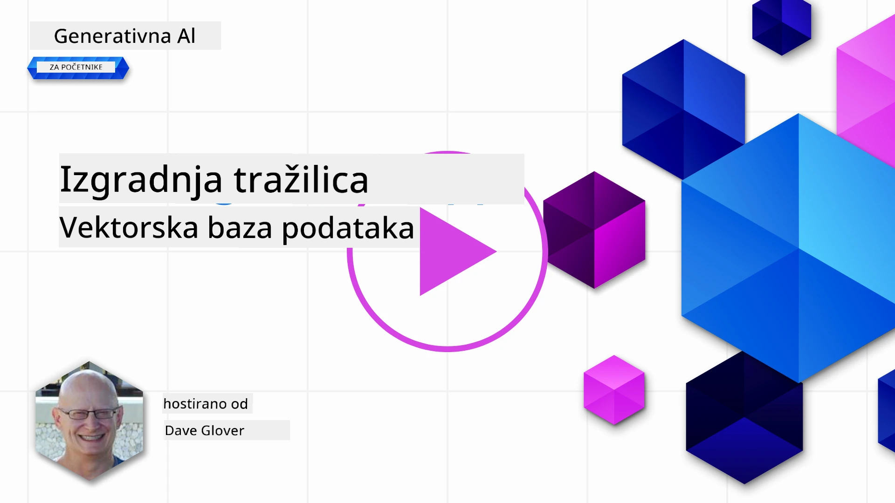
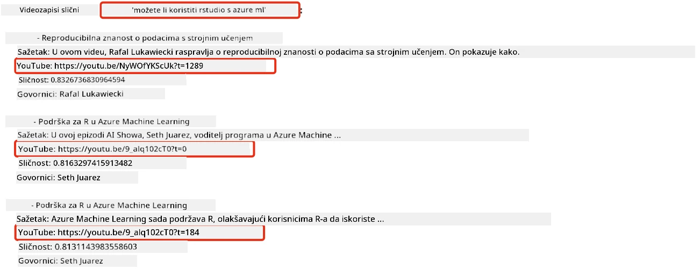
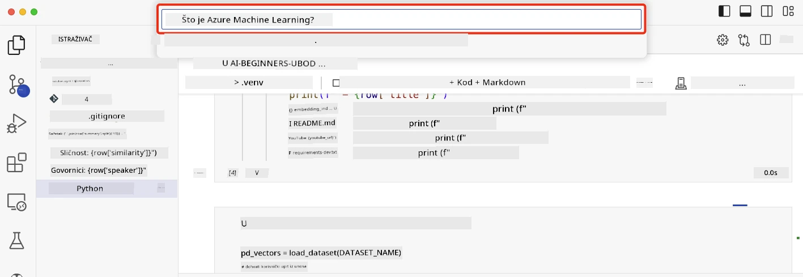

# Izgradnja aplikacija za pretraživanje

[](https://youtu.be/W0-nzXjOjr0?si=GcsqiTTvd7RKbo7V)

> > _Kliknite sliku iznad za prikaz videa ove lekcije_

LLM modeli nisu samo za chatbotove i generiranje teksta. Također je moguće izgraditi aplikacije za pretraživanje koristeći embeddings. Embeddings su numeričke reprezentacije podataka, poznate i kao vektori, i mogu se koristiti za semantičko pretraživanje podataka.

U ovoj lekciji izgradit ćete aplikaciju za pretraživanje za naš edukacijski startup. Naš startup je neprofitna organizacija koja pruža besplatno obrazovanje studentima u zemljama u razvoju. Naš startup ima velik broj YouTube videa koje studenti mogu koristiti za učenje o AI-u. Naš startup želi izgraditi aplikaciju za pretraživanje koja omogućuje studentima da traže YouTube video tako da upišu pitanje.

Na primjer, student može upisati 'Što su Jupyter bilježnice?' ili 'Što je Azure ML', a aplikacija za pretraživanje vratit će popis YouTube videa relevantnih za pitanje, a još bolje, aplikacija za pretraživanje vratit će poveznicu na mjesto u videu gdje se nalazi odgovor na pitanje.

## Uvod

U ovoj lekciji pokrit ćemo:

- Semantičko vs pretraživanje po ključnim riječima.
- Što su tekstualni embeddings.
- Izrada indeksа tekstualnih embeddings.
- Pretraživanje indeksa tekstualnih embeddings.

## Ciljevi učenja

Nakon završetka ove lekcije moći ćete:

- Razlikovati semantičko i pretraživanje po ključnim riječima.
- Objasniti što su tekstualni embeddings.
- Kreirati aplikaciju koja koristi embeddings za pretraživanje podataka.

## Zašto izgraditi aplikaciju za pretraživanje?

Izrada aplikacije za pretraživanje pomoći će vam razumjeti kako se koriste embeddings za pretraživanje podataka. Također ćete naučiti kako izgraditi aplikaciju za pretraživanje koju studenti mogu koristiti kako bi brzo pronašli informacije.

Lekcija uključuje indeks embeddingsa transkripata YouTubea za Microsoftov [AI Show](https://www.youtube.com/playlist?list=PLlrxD0HtieHi0mwteKBOfEeOYf0LJU4O1) YouTube kanal. AI Show je YouTube kanal koji vas uči o AI i strojnome učenju. Indeks embeddingsa sadrži embeddings za svaki YouTube transkript do listopada 2023. Koristit ćete indeks embeddingsa za izgradnju aplikacije za pretraživanje za naš startup. Aplikacija za pretraživanje vraća poveznicu na mjesto u videu gdje se nalazi odgovor na pitanje. Ovo je izvrstan način za studente da brzo pronađu potrebne informacije.

Slijedi primjer semantičkog upita za pitanje 'možeš li koristiti rstudio s azure ml?'. Pogledajte YouTube url, vidjet ćete da url sadrži vremenski pečat koji vas vodi na mjesto u videu gdje se nalazi odgovor na pitanje.



## Što je semantičko pretraživanje?

Možda se pitate, što je semantičko pretraživanje? Semantičko pretraživanje je tehnika pretraživanja koja koristi semantiku, odnosno značenje riječi u upitu, kako bi vratila relevantne rezultate.

Evo primjera semantičkog pretraživanja. Recimo da tražite kupnju automobila, mogli biste pretražiti za 'moj automobilski san', semantičko pretraživanje razumije da ne `sanjate` o automobilu, već da tražite svoj `idealni` automobil. Semantičko pretraživanje razumije vašu namjeru i vraća relevantne rezultate. Alternativa je `pretraživanje po ključnim riječima` koje bi doslovno tražilo snove o automobilima i često vraća nerelevantne rezultate.

## Što su tekstualni embeddings?

[Tekstualni embeddings](https://en.wikipedia.org/wiki/Word_embedding?WT.mc_id=academic-105485-koreyst) su tehnika predstavljanja teksta koja se koristi u [obradi prirodnog jezika](https://en.wikipedia.org/wiki/Natural_language_processing?WT.mc_id=academic-105485-koreyst). Tekstualni embeddings su semantičke numeričke reprezentacije teksta. Embeddings se koriste za predstavljanje podataka na način koji je lako razumljiv stroju. Postoji mnogo modela za izradu tekstualnih embeddingsa, u ovoj lekciji fokusirat ćemo se na generiranje embeddingsa korištenjem OpenAI Embedding modela.

Evo primjera, zamislite da je sljedeći tekst u transkriptu jedne epizode na AI Show YouTube kanalu:

```text
Today we are going to learn about Azure Machine Learning.
```

Tekst bismo poslali OpenAI Embedding API-ju i on bi vratio sljedeći embedding koji se sastoji od 1536 brojeva, odnosno vektora. Svaki broj u vektoru predstavlja različit aspekt teksta. Za sažetak, evo prvih 10 brojeva u vektoru.

```python
[-0.006655829958617687, 0.0026128944009542465, 0.008792596869170666, -0.02446001023054123, -0.008540431968867779, 0.022071078419685364, -0.010703742504119873, 0.003311325330287218, -0.011632772162556648, -0.02187200076878071, ...]
```

## Kako je napravljen indeks embeddingsa?

Indeks embeddingsa za ovu lekciju napravljen je nizom Python skripti. Skripte ćete pronaći zajedno s uputama u [README](./scripts/README.md?WT.mc_id=academic-105485-koreyst) u mapi 'scripts' za ovu lekciju. Ne morate pokretati ove skripte za dovršetak lekcije jer je indeks embeddingsa već dostupan.

Skripte izvršavaju sljedeće operacije:

1. Transkript za svaki YouTube video u [AI Show](https://www.youtube.com/playlist?list=PLlrxD0HtieHi0mwteKBOfEeOYf0LJU4O1) playlisti se preuzima.
2. Korištenjem [OpenAI funkcija](https://learn.microsoft.com/azure/ai-foundry/openai/how-to/function-calling?WT.mc_id=academic-105485-koreyst) pokušava se izdvojiti ime govornika iz prvih 3 minute YouTube transkripta. Ime govornika za svaki video pohranjuje se u indeks embeddingsa pod nazivom `embedding_index_3m.json`.
3. Zatim se tekst transkripta dijeli u **3-minutne tekstualne segmente**. Segment uključuje oko 20 riječi koje se preklapaju iz sljedećeg segmenta kako bi se osiguralo da embedding segmenta nije odrezan i pruža bolji kontekst pretraživanja.
4. Svaki tekstualni segment zatim se šalje OpenAI Chat API-ju koji sažima tekst u 60 riječi. Sažetak se također pohranjuje u indeks embeddingsa `embedding_index_3m.json`.
5. Na kraju, tekst segmenta šalje se OpenAI Embedding API-ju. Embedding API vraća vektor od 1536 brojeva koji predstavljaju semantičko značenje segmenta. Segment zajedno s OpenAI embedding vektorom pohranjuje se u indeks embeddingsa `embedding_index_3m.json`.

### Vektorske baze podataka

Za jednostavnost ove lekcije, indeks embeddingsa pohranjen je u JSON datoteku nazvanu `embedding_index_3m.json` i učitan je u Pandas DataFrame. Međutim, u produkciji, indeks embeddingsa čuvao bi se u vektorskoj bazi podataka kao što su [Azure Cognitive Search](https://learn.microsoft.com/training/modules/improve-search-results-vector-search?WT.mc_id=academic-105485-koreyst), [Redis](https://cookbook.openai.com/examples/vector_databases/redis/readme?WT.mc_id=academic-105485-koreyst), [Pinecone](https://cookbook.openai.com/examples/vector_databases/pinecone/readme?WT.mc_id=academic-105485-koreyst), [Weaviate](https://cookbook.openai.com/examples/vector_databases/weaviate/readme?WT.mc_id=academic-105485-koreyst), da navedemo samo neke.

## Razumijevanje kosinusne sličnosti

Naučili smo o tekstualnim embeddingsima, sljedeći je korak naučiti kako koristiti tekstualne embeddings za pretraživanje podataka i naročito kako pronaći najsličnije embeddingse zadanoj pretrazi koristeći kosinusnu sličnost.

### Što je kosinusna sličnost?

Kosinusna sličnost je mjera sličnosti između dva vektora, često se naziva i `pretraživanje najbližeg susjeda`. Za izvođenje pretraživanja kosinusne sličnosti potrebno je _vektorirati_ za _upit_ tekst koristeći OpenAI Embedding API. Zatim izračunati _kosinusnu sličnost_ između vektora upita i svakog vektora u indeksu embeddingsa. Zapamtite, indeks embeddingsa sadrži vektor za svaki tekstualni segment YouTube transkripta. Na kraju, sortirajte rezultate po kosinusnoj sličnosti, a tekstualni segmenti s najvišom kosinusnom sličnosti su najsličniji upitu.

Iz matematičke perspektive, kosinusna sličnost mjeri kosinus kuta između dva vektora projicirana u višedimenzionalnom prostoru. Ovo mjerenje je korisno jer ako su dva dokumenta udaljena po Euklidskoj udaljenosti zbog veličine, oni i dalje mogu imati manji kut između sebe, pa samim time i veću kosinusnu sličnost. Za više informacija o jednadžbama kosinusne sličnosti, pogledajte [Cosine similarity](https://en.wikipedia.org/wiki/Cosine_similarity?WT.mc_id=academic-105485-koreyst).

## Izgradnja vaše prve aplikacije za pretraživanje

Sljedeće ćemo naučiti kako izgraditi aplikaciju za pretraživanje koristeći embeddings. Aplikacija za pretraživanje omogućit će studentima da pretražuju video tako da upišu pitanje. Aplikacija za pretraživanje vratit će popis videa relevantnih za pitanje. Aplikacija za pretraživanje vraćat će i poveznicu na mjesto u videu gdje se nalazi odgovor na pitanje.

Ovo rješenje je izgrađeno i testirano na Windows 11, macOS i Ubuntu 22.04 koristeći Python 3.10 ili noviji. Python možete preuzeti sa stranice [python.org](https://www.python.org/downloads/?WT.mc_id=academic-105485-koreyst).

## Zadatak - izgradnja aplikacije za pretraživanje, za omogućavanje studentima

Predstavili smo naš startup na početku ove lekcije. Sada je vrijeme da omogućite studentima da izgrade aplikaciju za pretraživanje za svoje zadatke.

U ovom zadatku stvorit ćete Azure OpenAI usluge koje će se koristiti za izgradnju aplikacije za pretraživanje. Stvorit ćete sljedeće Azure OpenAI usluge. Za dovršetak zadatka bit će vam potrebna Azure pretplata.

### Pokrenite Azure Cloud Shell

1. Prijavite se na [Azure portal](https://portal.azure.com/?WT.mc_id=academic-105485-koreyst).
2. Odaberite ikonu Cloud Shell u gornjem desnom kutu Azure portala.
3. Odaberite **Bash** kao tip okruženja.

#### Kreirajte resursnu grupu

> Za ove upute koristimo resursnu grupu pod imenom "semantic-video-search" u East US.
> Možete promijeniti naziv resursne grupe, ali pri promjeni lokacije za resurse,
> provjerite [tablicu dostupnosti modela](https://aka.ms/oai/models?WT.mc_id=academic-105485-koreyst).

```shell
az group create --name semantic-video-search --location eastus
```

#### Kreirajte resurs Azure OpenAI Service

U Azure Cloud Shell-u pokrenite sljedeću naredbu da biste kreirali resurs Azure OpenAI Service.

```shell
az cognitiveservices account create --name semantic-video-openai --resource-group semantic-video-search \
    --location eastus --kind OpenAI --sku s0
```

#### Dohvatite endpoint i ključeve za korištenje u ovoj aplikaciji

U Azure Cloud Shell-u pokrenite sljedeće naredbe da biste dohvatili endpoint i ključeve za resurs Azure OpenAI Service.

```shell
az cognitiveservices account show --name semantic-video-openai \
   --resource-group  semantic-video-search | jq -r .properties.endpoint
az cognitiveservices account keys list --name semantic-video-openai \
   --resource-group semantic-video-search | jq -r .key1
```

#### Implementirajte OpenAI Embedding model

U Azure Cloud Shell-u pokrenite sljedeću naredbu da biste implementirali OpenAI Embedding model.

```shell
az cognitiveservices account deployment create \
    --name semantic-video-openai \
    --resource-group  semantic-video-search \
    --deployment-name text-embedding-ada-002 \
    --model-name text-embedding-ada-002 \
    --model-version "2"  \
    --model-format OpenAI \
    --sku-capacity 100 --sku-name "Standard"
```

## Rješenje

Otvorite [solution notebook](./python/aoai-solution.ipynb?WT.mc_id=academic-105485-koreyst) u GitHub Codespaces i slijedite upute u Jupyter Notebooku.

Kad pokrenete notebook, bit ćete upitani da unesete upit. Ulazni okvir će izgledati ovako:



## Sjajan posao! Nastavite svoje učenje

Nakon završetka ove lekcije, pogledajte našu [kolekciju za učenje o generativnoj AI](https://aka.ms/genai-collection?WT.mc_id=academic-105485-koreyst) kako biste nastavili poboljšavati svoje znanje o generativnoj AI!

Krenite na Lekciju 9 gdje ćemo pogledati kako [izgraditi aplikacije za generiranje slika](../09-building-image-applications/README.md?WT.mc_id=academic-105485-koreyst)!

---

<!-- CO-OP TRANSLATOR DISCLAIMER START -->
**Napomena**:
Ovaj dokument je preveden korištenjem AI prevoditeljskog servisa [Co-op Translator](https://github.com/Azure/co-op-translator). Iako težimo točnosti, imajte na umu da automatski prijevodi mogu sadržavati greške ili netočnosti. Izvorni dokument na izvornom jeziku treba smatrati autoritativnim izvorom. Za važne informacije preporuča se profesionalni ljudski prijevod. Nismo odgovorni za bilo kakva nesporazumevanja ili pogrešne interpretacije koje proizlaze iz korištenja ovog prijevoda.
<!-- CO-OP TRANSLATOR DISCLAIMER END -->