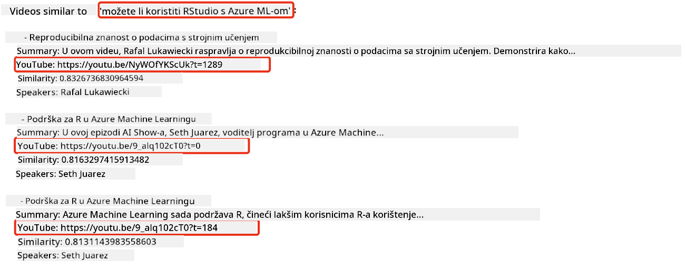
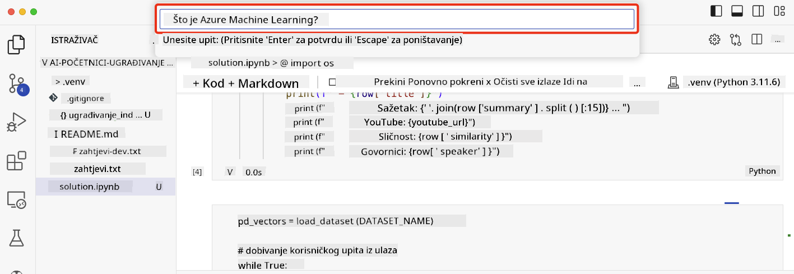

<!--
CO_OP_TRANSLATOR_METADATA:
{
  "original_hash": "d46aad0917a1a342d613e2c13d457da5",
  "translation_date": "2025-06-25T16:45:09+00:00",
  "source_file": "08-building-search-applications/README.md",
  "language_code": "hr"
}
-->
# Izgradnja aplikacija za pretraživanje

[](https://aka.ms/gen-ai-lesson8-gh?WT.mc_id=academic-105485-koreyst)

> > _Kliknite na sliku iznad za pregled videa ove lekcije_

LLM-ovi su više od chatbotova i generiranja teksta. Također je moguće izgraditi aplikacije za pretraživanje koristeći Embeddings. Embeddings su numerički prikazi podataka poznati kao vektori i mogu se koristiti za semantičko pretraživanje podataka.

U ovoj lekciji izgradit ćete aplikaciju za pretraživanje za našu obrazovnu startup organizaciju. Naš startup je neprofitna organizacija koja pruža besplatno obrazovanje studentima u zemljama u razvoju. Naš startup ima veliki broj YouTube videa koje studenti mogu koristiti za učenje o AI. Naš startup želi izgraditi aplikaciju za pretraživanje koja omogućava studentima da pretražuju YouTube video unosom pitanja.

Na primjer, student može unijeti 'Što su Jupyter Notebooks?' ili 'Što je Azure ML' i aplikacija za pretraživanje će vratiti popis YouTube videa koji su relevantni za pitanje, a još bolje, aplikacija za pretraživanje će vratiti link na mjesto u videu gdje se nalazi odgovor na pitanje.

## Uvod

U ovoj lekciji obradit ćemo:

- Semantičko vs pretraživanje po ključnim riječima.
- Što su tekstualni Embeddings.
- Kreiranje indeksa tekstualnih Embeddings.
- Pretraživanje indeksa tekstualnih Embeddings.

## Ciljevi učenja

Nakon završetka ove lekcije moći ćete:

- Razlikovati semantičko i pretraživanje po ključnim riječima.
- Objasniti što su tekstualni Embeddings.
- Kreirati aplikaciju koristeći Embeddings za pretraživanje podataka.

## Zašto izgraditi aplikaciju za pretraživanje?

Kreiranje aplikacije za pretraživanje pomoći će vam da razumijete kako koristiti Embeddings za pretraživanje podataka. Također ćete naučiti kako izgraditi aplikaciju za pretraživanje koju studenti mogu koristiti za brzo pronalaženje informacija.

Lekcija uključuje Embedding Index transkripata YouTube videa za Microsoft [AI Show](https://www.youtube.com/playlist?list=PLlrxD0HtieHi0mwteKBOfEeOYf0LJU4O1) YouTube kanal. AI Show je YouTube kanal koji vas podučava o AI i strojnog učenja. Embedding Index sadrži Embeddings za svaki od YouTube transkripata do listopada 2023. Koristit ćete Embedding Index za izgradnju aplikacije za pretraživanje za naš startup. Aplikacija za pretraživanje vraća link na mjesto u videu gdje se nalazi odgovor na pitanje. Ovo je odličan način da studenti brzo pronađu potrebne informacije.

Slijedi primjer semantičkog upita za pitanje 'možete li koristiti rstudio s azure ml?'. Pogledajte YouTube url, vidjet ćete da url sadrži vremensku oznaku koja vas vodi do mjesta u videu gdje se nalazi odgovor na pitanje.



## Što je semantičko pretraživanje?

Sada se možda pitate, što je semantičko pretraživanje? Semantičko pretraživanje je tehnika pretraživanja koja koristi semantiku ili značenje riječi u upitu za vraćanje relevantnih rezultata.

Ovdje je primjer semantičkog pretraživanja. Recimo da želite kupiti automobil, mogli biste pretraživati 'moj automobil iz snova', semantičko pretraživanje razumije da ne govorite doslovno o automobilu, već da tražite svoj automobil iz snova. Semantičko pretraživanje razumije vašu namjeru i vraća relevantne rezultate. Alternativa je pretraživanje po ključnim riječima koje bi doslovno pretraživalo snove o automobilima i često vraćalo irelevantne rezultate.

## Što su tekstualni Embeddings?

[Textualni embeddings](https://en.wikipedia.org/wiki/Word_embedding?WT.mc_id=academic-105485-koreyst) su tehnika prikaza teksta koja se koristi u [obradi prirodnog jezika](https://en.wikipedia.org/wiki/Natural_language_processing?WT.mc_id=academic-105485-koreyst). Tekstualni embeddings su semantički numerički prikazi teksta. Embeddings se koriste za predstavljanje podataka na način koji je lako razumljiv stroju. Postoji mnogo modela za izgradnju tekstualnih embeddings, u ovoj lekciji fokusirat ćemo se na generiranje embeddings koristeći OpenAI Embedding Model.

Evo primjera, zamislite da je sljedeći tekst u transkriptu jedne od epizoda na AI Show YouTube kanalu:

```text
Today we are going to learn about Azure Machine Learning.
```

Proslijedili bismo tekst OpenAI Embedding API-u i on bi vratio sljedeći embedding koji se sastoji od 1536 brojeva, odnosno vektora. Svaki broj u vektoru predstavlja različit aspekt teksta. Radi sažetosti, evo prvih 10 brojeva u vektoru.

```python
[-0.006655829958617687, 0.0026128944009542465, 0.008792596869170666, -0.02446001023054123, -0.008540431968867779, 0.022071078419685364, -0.010703742504119873, 0.003311325330287218, -0.011632772162556648, -0.02187200076878071, ...]
```

## Kako je kreiran Embedding index?

Embedding index za ovu lekciju kreiran je pomoću serije Python skripti. Skripte ćete pronaći zajedno s uputama u [README](./scripts/README.md?WT.mc_id=academic-105485-koreyst) u mapi 'scripts' za ovu lekciju. Ne trebate pokretati ove skripte da biste završili ovu lekciju jer vam je Embedding Index već dostavljen.

Skripte izvode sljedeće operacije:

1. Transkript za svaki YouTube video u [AI Show](https://www.youtube.com/playlist?list=PLlrxD0HtieHi0mwteKBOfEeOYf0LJU4O1) playlisti se preuzima.
2. Koristeći [OpenAI Functions](https://learn.microsoft.com/azure/ai-services/openai/how-to/function-calling?WT.mc_id=academic-105485-koreyst), pokušava se izvući ime govornika iz prvih 3 minute YouTube transkripta. Ime govornika za svaki video se pohranjuje u Embedding Index pod nazivom `embedding_index_3m.json`.
3. Tekst transkripta se zatim dijeli na **3-minutne tekstualne segmente**. Segment uključuje oko 20 riječi koje se preklapaju s sljedećim segmentom kako bi se osiguralo da Embedding za segment nije prekinut i da se osigura bolji kontekst pretraživanja.
4. Svaki tekstualni segment se zatim prosljeđuje OpenAI Chat API-u kako bi se tekst sažeo na 60 riječi. Sažetak se također pohranjuje u Embedding Index `embedding_index_3m.json`.
5. Na kraju, tekst segmenta se prosljeđuje OpenAI Embedding API-u. Embedding API vraća vektor od 1536 brojeva koji predstavljaju semantičko značenje segmenta. Segment zajedno s OpenAI Embedding vektorom se pohranjuje u Embedding Index `embedding_index_3m.json`.

### Vektorske baze podataka

Radi jednostavnosti lekcije, Embedding Index se pohranjuje u JSON datoteku pod nazivom `embedding_index_3m.json` i učitava u Pandas DataFrame. Međutim, u produkciji, Embedding Index bi se pohranjivao u vektorsku bazu podataka kao što su [Azure Cognitive Search](https://learn.microsoft.com/training/modules/improve-search-results-vector-search?WT.mc_id=academic-105485-koreyst), [Redis](https://cookbook.openai.com/examples/vector_databases/redis/readme?WT.mc_id=academic-105485-koreyst), [Pinecone](https://cookbook.openai.com/examples/vector_databases/pinecone/readme?WT.mc_id=academic-105485-koreyst), [Weaviate](https://cookbook.openai.com/examples/vector_databases/weaviate/readme?WT.mc_id=academic-105485-koreyst), da navedemo samo nekoliko.

## Razumijevanje kosinusne sličnosti

Naučili smo o tekstualnim embeddings, sljedeći korak je naučiti kako koristiti tekstualne embeddings za pretraživanje podataka i posebno pronaći najviše slične embeddings za dani upit koristeći kosinusnu sličnost.

### Što je kosinusna sličnost?

Kosinusna sličnost je mjera sličnosti između dva vektora, također ćete čuti da se to naziva `nearest neighbor search`. Da biste izvršili pretraživanje kosinusne sličnosti, morate _vektorizirati_ tekst _upita_ koristeći OpenAI Embedding API. Zatim izračunajte _kosinusnu sličnost_ između vektora upita i svakog vektora u Embedding Indexu. Zapamtite, Embedding Index ima vektor za svaki tekstualni segment YouTube transkripta. Na kraju, sortirajte rezultate po kosinusnoj sličnosti i tekstualni segmenti s najvišom kosinusnom sličnosti su najsličniji upitu.

Iz matematičke perspektive, kosinusna sličnost mjeri kosinus kuta između dva vektora projicirana u višedimenzionalnom prostoru. Ova mjera je korisna jer ako su dva dokumenta udaljena po euklidskoj udaljenosti zbog veličine, mogli bi i dalje imati manji kut između njih i stoga veću kosinusnu sličnost. Za više informacija o jednadžbama kosinusne sličnosti, pogledajte [Kosinusna sličnost](https://en.wikipedia.org/wiki/Cosine_similarity?WT.mc_id=academic-105485-koreyst).

## Izgradnja vaše prve aplikacije za pretraživanje

Sljedeće, naučit ćemo kako izgraditi aplikaciju za pretraživanje koristeći Embeddings. Aplikacija za pretraživanje omogućit će studentima da pretražuju video unosom pitanja. Aplikacija za pretraživanje vratit će popis videa koji su relevantni za pitanje. Aplikacija za pretraživanje također će vratiti link na mjesto u videu gdje se nalazi odgovor na pitanje.

Ovo rješenje je izgrađeno i testirano na Windows 11, macOS i Ubuntu 22.04 koristeći Python 3.10 ili noviji. Python možete preuzeti s [python.org](https://www.python.org/downloads/?WT.mc_id=academic-105485-koreyst).

## Zadatak - izgradnja aplikacije za pretraživanje, kako bi omogućili studentima

Predstavili smo naš startup na početku ove lekcije. Sada je vrijeme da omogućimo studentima da izgrade aplikaciju za pretraživanje za svoje procjene.

U ovom zadatku, kreirat ćete Azure OpenAI Services koje će se koristiti za izgradnju aplikacije za pretraživanje. Kreirat ćete sljedeće Azure OpenAI Services. Trebat će vam Azure pretplata za dovršetak ovog zadatka.

### Pokrenite Azure Cloud Shell

1. Prijavite se u [Azure portal](https://portal.azure.com/?WT.mc_id=academic-105485-koreyst).
2. Odaberite ikonu Cloud Shell u gornjem desnom kutu Azure portala.
3. Odaberite **Bash** za tip okruženja.

#### Kreirajte grupu resursa

> Za ove upute koristimo grupu resursa nazvanu "semantic-video-search" u East US.
> Možete promijeniti naziv grupe resursa, ali prilikom promjene lokacije za resurse,
> provjerite [tablicu dostupnosti modela](https://aka.ms/oai/models?WT.mc_id=academic-105485-koreyst).

```shell
az group create --name semantic-video-search --location eastus
```

#### Kreirajte Azure OpenAI Service resurs

Iz Azure Cloud Shell, pokrenite sljedeću naredbu za kreiranje Azure OpenAI Service resursa.

```shell
az cognitiveservices account create --name semantic-video-openai --resource-group semantic-video-search \
    --location eastus --kind OpenAI --sku s0
```

#### Dobijte krajnju točku i ključeve za korištenje u ovoj aplikaciji

Iz Azure Cloud Shell, pokrenite sljedeće naredbe za dobivanje krajnje točke i ključeva za Azure OpenAI Service resurs.

```shell
az cognitiveservices account show --name semantic-video-openai \
   --resource-group  semantic-video-search | jq -r .properties.endpoint
az cognitiveservices account keys list --name semantic-video-openai \
   --resource-group semantic-video-search | jq -r .key1
```

#### Implementirajte OpenAI Embedding model

Iz Azure Cloud Shell, pokrenite sljedeću naredbu za implementaciju OpenAI Embedding modela.

```shell
az cognitiveservices account deployment create \
    --name semantic-video-openai \
    --resource-group  semantic-video-search \
    --deployment-name text-embedding-ada-002 \
    --model-name text-embedding-ada-002 \
    --model-version "2"  \
    --model-format OpenAI \
    --sku-capacity 100 --sku-name "Standard"
```

## Rješenje

Otvorite [notebook s rješenjem](../../../08-building-search-applications/python/aoai-solution.ipynb) u GitHub Codespaces i slijedite upute u Jupyter Notebooku.

Kada pokrenete notebook, bit ćete upitani da unesete upit. Kutija za unos će izgledati ovako:



## Odlično! Nastavite s učenjem

Nakon završetka ove lekcije, pogledajte našu [Generativnu AI kolekciju za učenje](https://aka.ms/genai-collection?WT.mc_id=academic-105485-koreyst) kako biste nastavili s usavršavanjem svog znanja o generativnoj AI!

Krenite na Lekciju 9 gdje ćemo pogledati kako [izgraditi aplikacije za generiranje slika](../09-building-image-applications/README.md?WT.mc_id=academic-105485-koreyst)!

**Odricanje od odgovornosti**:  
Ovaj dokument je preveden korištenjem AI usluge prevođenja [Co-op Translator](https://github.com/Azure/co-op-translator). Iako se trudimo osigurati točnost, molimo vas da budete svjesni da automatizirani prijevodi mogu sadržavati pogreške ili netočnosti. Izvorni dokument na izvornom jeziku treba smatrati mjerodavnim izvorom. Za kritične informacije preporučuje se profesionalni prijevod od strane ljudskog prevoditelja. Ne odgovaramo za nesporazume ili pogrešne interpretacije proizašle iz korištenja ovog prijevoda.