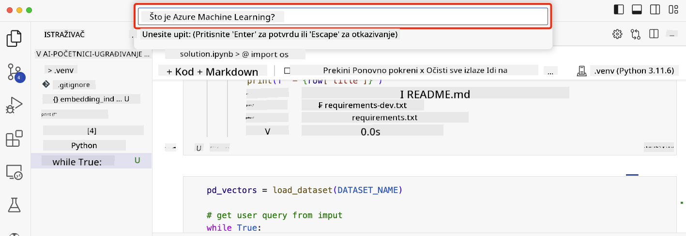

<!--
CO_OP_TRANSLATOR_METADATA:
{
  "original_hash": "58953c08b8ba7073b836d4270ea0fe86",
  "translation_date": "2025-10-18T01:29:44+00:00",
  "source_file": "08-building-search-applications/README.md",
  "language_code": "hr"
}
-->
# Izrada aplikacija za pretraživanje

[](https://youtu.be/W0-nzXjOjr0?si=GcsqiTTvd7RKbo7V)

> > _Kliknite na sliku iznad za pregled videozapisa ove lekcije_

Veliki jezični modeli (LLM) nisu samo za chatbotove i generiranje teksta. Također je moguće izraditi aplikacije za pretraživanje koristeći ugrađivanja (Embeddings). Ugrađivanja su numerički prikazi podataka, poznati i kao vektori, koji se mogu koristiti za semantičko pretraživanje podataka.

U ovoj lekciji izradit ćete aplikaciju za pretraživanje za našu obrazovnu startup tvrtku. Naša startup tvrtka je neprofitna organizacija koja pruža besplatno obrazovanje studentima u zemljama u razvoju. Naša tvrtka ima veliki broj YouTube videozapisa koje studenti mogu koristiti za učenje o umjetnoj inteligenciji. Želimo izraditi aplikaciju za pretraživanje koja omogućuje studentima da pronađu YouTube videozapis tako da upišu pitanje.

Na primjer, student može upisati 'Što su Jupyter Notebooks?' ili 'Što je Azure ML?' i aplikacija za pretraživanje će vratiti popis YouTube videozapisa koji su relevantni za pitanje, a još bolje, aplikacija će vratiti poveznicu na dio videozapisa gdje se nalazi odgovor na pitanje.

## Uvod

U ovoj lekciji obradit ćemo:

- Semantičko vs. ključne riječi pretraživanje.
- Što su tekstualna ugrađivanja.
- Kreiranje indeksa tekstualnih ugrađivanja.
- Pretraživanje indeksa tekstualnih ugrađivanja.

## Ciljevi učenja

Nakon završetka ove lekcije, moći ćete:

- Razlikovati semantičko i pretraživanje po ključnim riječima.
- Objasniti što su tekstualna ugrađivanja.
- Izraditi aplikaciju koristeći ugrađivanja za pretraživanje podataka.

## Zašto izraditi aplikaciju za pretraživanje?

Izrada aplikacije za pretraživanje pomoći će vam da razumijete kako koristiti ugrađivanja za pretraživanje podataka. Također ćete naučiti kako izraditi aplikaciju za pretraživanje koju studenti mogu koristiti za brzo pronalaženje informacija.

Lekcija uključuje indeks ugrađivanja transkripata YouTube videozapisa s Microsoft [AI Show](https://www.youtube.com/playlist?list=PLlrxD0HtieHi0mwteKBOfEeOYf0LJU4O1) YouTube kanala. AI Show je YouTube kanal koji vas uči o umjetnoj inteligenciji i strojnim učenjima. Indeks ugrađivanja sadrži ugrađivanja za svaki transkript YouTube videozapisa do listopada 2023. Koristit ćete indeks ugrađivanja za izradu aplikacije za pretraživanje za našu startup tvrtku. Aplikacija za pretraživanje vraća poveznicu na dio videozapisa gdje se nalazi odgovor na pitanje. Ovo je odličan način da studenti brzo pronađu potrebne informacije.

Slijedi primjer semantičkog upita za pitanje 'možete li koristiti rstudio s azure ml?'. Pogledajte YouTube URL, vidjet ćete da URL sadrži vremensku oznaku koja vas vodi do dijela videozapisa gdje se nalazi odgovor na pitanje.


## Što je semantičko pretraživanje?

Možda se pitate, što je semantičko pretraživanje? Semantičko pretraživanje je tehnika pretraživanja koja koristi semantiku, odnosno značenje riječi u upitu, kako bi vratila relevantne rezultate.

Evo primjera semantičkog pretraživanja. Recimo da želite kupiti automobil, mogli biste pretraživati 'moj san automobil', semantičko pretraživanje razumije da ne `sanjarite` o automobilu, već da tražite svoj `idealni` automobil. Semantičko pretraživanje razumije vašu namjeru i vraća relevantne rezultate. Alternativa je `pretraživanje po ključnim riječima` koje bi doslovno tražilo snove o automobilima i često vraćalo irelevantne rezultate.

## Što su tekstualna ugrađivanja?

[Tekstualna ugrađivanja](https://en.wikipedia.org/wiki/Word_embedding?WT.mc_id=academic-105485-koreyst) su tehnika prikaza teksta koja se koristi u [obradi prirodnog jezika](https://en.wikipedia.org/wiki/Natural_language_processing?WT.mc_id=academic-105485-koreyst). Tekstualna ugrađivanja su semantički numerički prikazi teksta. Ugrađivanja se koriste za prikaz podataka na način koji je lako razumljiv stroju. Postoji mnogo modela za izradu tekstualnih ugrađivanja, a u ovoj lekciji fokusirat ćemo se na generiranje ugrađivanja koristeći OpenAI Embedding Model.

Evo primjera, zamislite da je sljedeći tekst dio transkripta iz jedne epizode na AI Show YouTube kanalu:

```text
Today we are going to learn about Azure Machine Learning.
```

Proslijedili bismo tekst OpenAI Embedding API-ju i on bi vratio sljedeće ugrađivanje koje se sastoji od 1536 brojeva, poznatih kao vektor. Svaki broj u vektoru predstavlja različit aspekt teksta. Radi sažetosti, evo prvih 10 brojeva u vektoru.

```python
[-0.006655829958617687, 0.0026128944009542465, 0.008792596869170666, -0.02446001023054123, -0.008540431968867779, 0.022071078419685364, -0.010703742504119873, 0.003311325330287218, -0.011632772162556648, -0.02187200076878071, ...]
```

## Kako se kreira indeks ugrađivanja?

Indeks ugrađivanja za ovu lekciju kreiran je pomoću niza Python skripti. Skripte, zajedno s uputama, možete pronaći u [README](./scripts/README.md?WT.mc_id=academic-105485-koreyst) datoteci u mapi 'scripts' za ovu lekciju. Ne morate pokretati ove skripte da biste završili lekciju jer je indeks ugrađivanja već dostupan.

Skripte obavljaju sljedeće operacije:

1. Transkript za svaki YouTube videozapis u [AI Show](https://www.youtube.com/playlist?list=PLlrxD0HtieHi0mwteKBOfEeOYf0LJU4O1) playlisti se preuzima.
2. Koristeći [OpenAI Functions](https://learn.microsoft.com/azure/ai-services/openai/how-to/function-calling?WT.mc_id=academic-105485-koreyst), pokušava se izvući ime govornika iz prvih 3 minute transkripta YouTube videozapisa. Ime govornika za svaki videozapis pohranjuje se u indeks ugrađivanja nazvan `embedding_index_3m.json`.
3. Tekst transkripta se zatim dijeli na **tekstualne segmente od 3 minute**. Segment uključuje oko 20 riječi koje se preklapaju sa sljedećim segmentom kako bi se osiguralo da ugrađivanje za segment nije prekinuto i kako bi se pružio bolji kontekst pretraživanja.
4. Svaki tekstualni segment se zatim prosljeđuje OpenAI Chat API-ju kako bi se tekst sažeo u 60 riječi. Sažetak se također pohranjuje u indeks ugrađivanja `embedding_index_3m.json`.
5. Na kraju, tekst segmenta se prosljeđuje OpenAI Embedding API-ju. Embedding API vraća vektor od 1536 brojeva koji predstavljaju semantičko značenje segmenta. Segment zajedno s OpenAI ugrađivanjem vektora pohranjuje se u indeks ugrađivanja `embedding_index_3m.json`.

### Vektorske baze podataka

Radi jednostavnosti lekcije, indeks ugrađivanja pohranjen je u JSON datoteku nazvanu `embedding_index_3m.json` i učitan u Pandas DataFrame. Međutim, u produkciji, indeks ugrađivanja bi bio pohranjen u vektorsku bazu podataka kao što su [Azure Cognitive Search](https://learn.microsoft.com/training/modules/improve-search-results-vector-search?WT.mc_id=academic-105485-koreyst), [Redis](https://cookbook.openai.com/examples/vector_databases/redis/readme?WT.mc_id=academic-105485-koreyst), [Pinecone](https://cookbook.openai.com/examples/vector_databases/pinecone/readme?WT.mc_id=academic-105485-koreyst), [Weaviate](https://cookbook.openai.com/examples/vector_databases/weaviate/readme?WT.mc_id=academic-105485-koreyst), da spomenemo samo neke.

## Razumijevanje kosinusne sličnosti

Naučili smo o tekstualnim ugrađivanjima, sljedeći korak je naučiti kako koristiti tekstualna ugrađivanja za pretraživanje podataka, a posebno kako pronaći najviše slična ugrađivanja za dani upit koristeći kosinusnu sličnost.

### Što je kosinusna sličnost?

Kosinusna sličnost je mjera sličnosti između dva vektora, također poznata kao `pretraživanje najbližeg susjeda`. Za izvođenje pretraživanja kosinusne sličnosti potrebno je _vektorizirati_ tekst _upita_ koristeći OpenAI Embedding API. Zatim izračunati _kosinusnu sličnost_ između vektora upita i svakog vektora u indeksu ugrađivanja. Zapamtite, indeks ugrađivanja ima vektor za svaki tekstualni segment transkripta YouTube videozapisa. Na kraju, rezultati se sortiraju prema kosinusnoj sličnosti, a tekstualni segmenti s najvišom kosinusnom sličnosti su najsličniji upitu.

S matematičke perspektive, kosinusna sličnost mjeri kosinus kuta između dva vektora projicirana u višedimenzionalni prostor. Ova mjera je korisna jer, ako su dva dokumenta udaljena po Euklidskoj udaljenosti zbog veličine, oni i dalje mogu imati manji kut između njih i stoga veću kosinusnu sličnost. Za više informacija o jednadžbama kosinusne sličnosti, pogledajte [Kosinusna sličnost](https://en.wikipedia.org/wiki/Cosine_similarity?WT.mc_id=academic-105485-koreyst).

## Izrada vaše prve aplikacije za pretraživanje

Sljedeće, naučit ćemo kako izraditi aplikaciju za pretraživanje koristeći ugrađivanja. Aplikacija za pretraživanje omogućit će studentima da pretražuju videozapis tako da upišu pitanje. Aplikacija za pretraživanje vratit će popis videozapisa koji su relevantni za pitanje. Također će vratiti poveznicu na dio videozapisa gdje se nalazi odgovor na pitanje.

Ovo rješenje je izrađeno i testirano na Windows 11, macOS i Ubuntu 22.04 koristeći Python 3.10 ili noviji. Python možete preuzeti s [python.org](https://www.python.org/downloads/?WT.mc_id=academic-105485-koreyst).

## Zadatak - izrada aplikacije za pretraživanje, kako bi se omogućilo studentima

Predstavili smo našu startup tvrtku na početku ove lekcije. Sada je vrijeme da omogućimo studentima izradu aplikacije za pretraživanje za njihove potrebe.

U ovom zadatku, kreirat ćete Azure OpenAI usluge koje će se koristiti za izradu aplikacije za pretraživanje. Kreirat ćete sljedeće Azure OpenAI usluge. Trebat će vam Azure pretplata za dovršetak ovog zadatka.

### Pokretanje Azure Cloud Shell-a

1. Prijavite se na [Azure portal](https://portal.azure.com/?WT.mc_id=academic-105485-koreyst).
2. Odaberite ikonu Cloud Shell u gornjem desnom kutu Azure portala.
3. Odaberite **Bash** kao tip okruženja.

#### Kreiranje grupe resursa

> Za ove upute koristimo grupu resursa nazvanu "semantic-video-search" u regiji East US.
> Možete promijeniti naziv grupe resursa, ali prilikom promjene lokacije za resurse,
> provjerite [tablicu dostupnosti modela](https://aka.ms/oai/models?WT.mc_id=academic-105485-koreyst).

```shell
az group create --name semantic-video-search --location eastus
```

#### Kreiranje resursa Azure OpenAI Service

Iz Azure Cloud Shell-a, pokrenite sljedeću naredbu za kreiranje resursa Azure OpenAI Service.

```shell
az cognitiveservices account create --name semantic-video-openai --resource-group semantic-video-search \
    --location eastus --kind OpenAI --sku s0
```

#### Dohvaćanje krajnje točke i ključeva za korištenje u ovoj aplikaciji

Iz Azure Cloud Shell-a, pokrenite sljedeće naredbe za dohvaćanje krajnje točke i ključeva za resurs Azure OpenAI Service.

```shell
az cognitiveservices account show --name semantic-video-openai \
   --resource-group  semantic-video-search | jq -r .properties.endpoint
az cognitiveservices account keys list --name semantic-video-openai \
   --resource-group semantic-video-search | jq -r .key1
```

#### Implementacija OpenAI Embedding modela

Iz Azure Cloud Shell-a, pokrenite sljedeću naredbu za implementaciju OpenAI Embedding modela.

```shell
az cognitiveservices account deployment create \
    --name semantic-video-openai \
    --resource-group  semantic-video-search \
    --deployment-name text-embedding-ada-002 \
    --model-name text-embedding-ada-002 \
    --model-version "2"  \
    --model-format OpenAI \
    --sku-capacity 100 --sku-name "Standard"
```

## Rješenje

Otvorite [rješenje u Jupyter Notebooku](./python/aoai-solution.ipynb?WT.mc_id=academic-105485-koreyst) u GitHub Codespaces i slijedite upute u Jupyter Notebooku.

Kada pokrenete notebook, bit ćete upitani da unesete upit. Okvir za unos izgleda ovako:



## Odlično! Nastavite s učenjem

Nakon završetka ove lekcije, pogledajte našu [kolekciju za učenje o generativnoj umjetnoj inteligenciji](https://aka.ms/genai-collection?WT.mc_id=academic-105485-koreyst) kako biste nastavili unapređivati svoje znanje o generativnoj umjetnoj inteligenciji!

Prijeđite na lekciju 9 gdje ćemo pogledati kako [izraditi aplikacije za generiranje slika](../09-building-image-applications/README.md?WT.mc_id=academic-105485-koreyst)!

---

**Izjava o odricanju odgovornosti**:  
Ovaj dokument je preveden pomoću AI usluge za prevođenje [Co-op Translator](https://github.com/Azure/co-op-translator). Iako nastojimo osigurati točnost, imajte na umu da automatski prijevodi mogu sadržavati pogreške ili netočnosti. Izvorni dokument na izvornom jeziku treba smatrati autoritativnim izvorom. Za ključne informacije preporučuje se profesionalni prijevod od strane čovjeka. Ne preuzimamo odgovornost za nesporazume ili pogrešna tumačenja koja proizlaze iz korištenja ovog prijevoda.