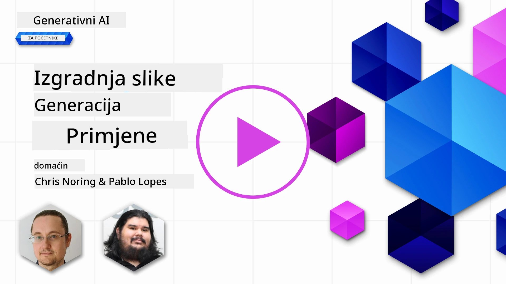

# Izgradnja aplikacija za generiranje slika

[](https://youtu.be/B5VP0_J7cs8?si=5P3L5o7F_uS_QcG9)

LLM-ovi nisu samo za generiranje teksta. Također je moguće generirati slike iz tekstualnih opisa. Imati slike kao modalitet može biti vrlo korisno u brojnim područjima poput MedTech-a, arhitekture, turizma, razvoja igara i više. U ovom poglavlju pogledat ćemo dva najpopularnija modela za generiranje slika, DALL-E i Midjourney.

## Uvod

U ovoj lekciji pokrit ćemo:

- Generiranje slika i zašto je korisno.
- DALL-E i Midjourney, što su i kako rade.
- Kako biste izgradili aplikaciju za generiranje slika.

## Ciljevi učenja

Nakon završetka ove lekcije moći ćete:

- Izgraditi aplikaciju za generiranje slika.
- Definirati granice vaše aplikacije pomoću meta promptova.
- Raditi s DALL-E i Midjourney.

## Zašto graditi aplikaciju za generiranje slika?

Aplikacije za generiranje slika odličan su način za istraživanje mogućnosti Generativne AI tehnologije. Mogu se koristiti, na primjer za:

- **Uređivanje i sinteza slika**. Možete generirati slike za razne slučajeve upotrebe, poput uređivanja i sinteze slika.

- **Primjena u različitim industrijama**. Također se mogu koristiti za generiranje slika u različitim industrijama poput Medtech-a, turizma, razvoja igara i više.

## Scenarij: Edu4All

Kao dio ove lekcije nastavit ćemo raditi sa startupom Edu4All. Studenti će stvarati slike za svoje zadatke, a točno što će to biti slike prepušteno je njima – mogu to biti ilustracije vlastite bajke, stvaranje novog lika za svoju priču ili pomoć u vizualizaciji njihovih ideja i koncepata.

Evo što bi studenti Edu4All-a mogli generirati, na primjer, ako rade na satu o spomenicima:


koristeći prompt poput

> "Pas pored Eiffelovog tornja u jutarnjem suncu"

## Što su DALL-E i Midjourney?

[DALL-E](https://openai.com/dall-e-2?WT.mc_id=academic-105485-koreyst) i [Midjourney](https://www.midjourney.com/?WT.mc_id=academic-105485-koreyst) su dva najpopularnija modela za generiranje slika, omogućuju generiranje slika pomoću promptova.

### DALL-E

Počnimo s DALL-E modelom, koji je Generativni AI model koji generira slike iz tekstualnih opisa.

> [DALL-E je kombinacija dva modela, CLIP i diffused attention](https://towardsdatascience.com/openais-dall-e-and-clip-101-a-brief-introduction-3a4367280d4e?WT.mc_id=academic-105485-koreyst).

- **CLIP**, je model koji generira embeddings, tj. numeričke reprezentacije podataka, iz slika i teksta.

- **Diffused attention**, je model koji generira slike iz embeddingsa. DALL-E je treniran na skupu podataka slika i teksta i može se koristiti za generiranje slika iz tekstualnih opisa. Na primjer, DALL-E može generirati slike mačke s šeširom ili psa s mohawkom.

### Midjourney

Midjourney radi na sličan način kao DALL-E, generira slike iz tekstualnih promptova. Midjourney također može generirati slike koristeći promptove poput "mačka u šeširu" ili "pas s mohawkom".


_Slika preuzeta s Wikipedije, sliku generirao Midjourney_

## Kako DALL-E i Midjourney rade

Prvo, [DALL-E](https://arxiv.org/pdf/2102.12092.pdf?WT.mc_id=academic-105485-koreyst). DALL-E je Generativni AI model baziran na transformer arhitekturi s _autoregresivnim transformerom_.

_Autoregresivni transformer_ definira kako model generira slike iz tekstualnih opisa, generira jedan piksel po piksel, i koristi generirane piksele da generira sljedeći piksel. Prolazi kroz višeslojne neuronske mreže dok slika nije kompletna.

Ovim procesom, DALL-E kontrolira atribute, objekte, karakteristike i druge elemente slike koju generira. Međutim, DALL-E 2 i 3 imaju veće mogućnosti kontrole generirane slike.

## Izgradnja prve aplikacije za generiranje slika

Što je potrebno za izgradnju aplikacije za generiranje slika? Trebate sljedeće biblioteke:

- **python-dotenv**, snažno se preporučuje korištenje ove biblioteke za pohranu vaših tajni u _.env_ datoteku, odvojeno od koda.
- **openai**, ovu biblioteku koristit ćete za interakciju s OpenAI API-jem.
- **pillow**, za rad sa slikama u Pythonu.
- **requests**, za pomoć pri slanju HTTP zahtjeva.

## Kreirajte i implementirajte Azure OpenAI model

Ako već niste, slijedite upute na stranici [Microsoft Learn](https://learn.microsoft.com/azure/ai-foundry/openai/how-to/create-resource?pivots=web-portal&WT.mc_id=academic-105485-koreyst)
za kreiranje Azure OpenAI resursa i modela. Odaberite **gpt-image-1** kao model (trenutni generacijski Azure OpenAI model za slike; DALL-E 3 je zastario i više nije dostupan za nove implementacije).

## Kreiranje aplikacije

1. Kreirajte datoteku _.env_ sa sljedećim sadržajem:

   ```text
   AZURE_OPENAI_ENDPOINT=<your endpoint>
   AZURE_OPENAI_API_KEY=<your key>
   AZURE_OPENAI_DEPLOYMENT="gpt-image-1"
   ```

   Ove informacije pronađite u Azure OpenAI Foundry Portalu za vaš resurs u sekciji "Deployments".

1. Skupite navedene biblioteke u datoteku pod nazivom _requirements.txt_ ovako:

   ```text
   python-dotenv
   openai
   pillow
   requests
   ```

1. Zatim kreirajte virtualno okruženje i instalirajte biblioteke:

   ```bash
   python3 -m venv venv
   source venv/bin/activate
   pip install -r requirements.txt
   ```

   Za Windows, koristite sljedeće naredbe za kreiranje i aktiviranje virtualnog okruženja:

   ```bash
   python3 -m venv venv
   venv\Scripts\activate.bat
   ```

1. Dodajte sljedeći kôd u datoteku pod nazivom _app.py_:

    ```python
    import openai
    import os
    import requests
    from PIL import Image
    import dotenv
    from openai import OpenAI, AzureOpenAI
    
    # import dotenv
    dotenv.load_dotenv()
    
    # konfiguriraj Azure OpenAI servis klijent
    client = AzureOpenAI(
      azure_endpoint = os.environ["AZURE_OPENAI_ENDPOINT"],
      api_key=os.environ['AZURE_OPENAI_API_KEY'],
      api_version = "2024-10-21"
      )
    try:
        # Kreiraj sliku koristeći API za generiranje slika
        generation_response = client.images.generate(
                                prompt='Bunny on horse, holding a lollipop, on a foggy meadow where it grows daffodils',
                                size='1024x1024', n=1,
                                model=os.environ['AZURE_OPENAI_DEPLOYMENT']
                              )

        # Postavi direktorij za pohranjenu sliku
        image_dir = os.path.join(os.curdir, 'images')

        # Ako direktorij ne postoji, kreiraj ga
        if not os.path.isdir(image_dir):
            os.mkdir(image_dir)

        # Inicijaliziraj putanju slike (imaj na umu da format datoteke treba biti png)
        image_path = os.path.join(image_dir, 'generated-image.png')

        # Dohvati generiranu sliku
        image_url = generation_response.data[0].url  # izvuci URL slike iz odgovora
        generated_image = requests.get(image_url).content  # preuzmi sliku
        with open(image_path, "wb") as image_file:
            image_file.write(generated_image)

        # Prikaži sliku u zadanim preglednikom slika
        image = Image.open(image_path)
        image.show()

    # uhvati iznimke
    except openai.BadRequestError as err:
        print(err)
   ```

Objasnimo ovaj kôd:

- Prvo, uvozimo potrebne biblioteke, uključujući OpenAI biblioteku, dotenv biblioteku, requests biblioteku i Pillow biblioteku.

  ```python
  import openai
  import os
  import requests
  from PIL import Image
  import dotenv
  ```

- Zatim učitavamo varijable okoline iz _.env_ datoteke.

  ```python
  # uvoz dotenv
  dotenv.load_dotenv()
  ```

- Nakon toga konfiguriramo Azure OpenAI servisnog klijenta

  ```python
  # Dohvati endpoint i ključ iz varijabli okoline
  client = AzureOpenAI(
      azure_endpoint = os.environ["AZURE_OPENAI_ENDPOINT"],
      api_key=os.environ['AZURE_OPENAI_API_KEY'],
      api_version = "2024-10-21"
      )
  ```

- Zatim generiramo sliku:

  ```python
  # Kreirajte sliku koristeći API za generiranje slika
  generation_response = client.images.generate(
                        prompt='Bunny on horse, holding a lollipop, on a foggy meadow where it grows daffodils',
                        size='1024x1024', n=1,
                        model=os.environ['AZURE_OPENAI_DEPLOYMENT']
                      )
  ```

  Gornji kôd vraća JSON objekt koji sadrži URL generirane slike. URL možemo iskoristiti za preuzimanje slike i spremanje u datoteku.

- Na kraju, otvaramo sliku i koristimo standardni preglednik slika da je prikažemo:

  ```python
  image = Image.open(image_path)
  image.show()
  ```

### Detaljnije o generiranju slike

Pogledajmo kôd za generiranje slike u detaljnije:

   ```python
     generation_response = client.images.generate(
                               prompt='Bunny on horse, holding a lollipop, on a foggy meadow where it grows daffodils',
                               size='1024x1024', n=1,
                               model=os.environ['AZURE_OPENAI_DEPLOYMENT']
                           )
   ```

- **prompt**, je tekstualni prompt koji se koristi za generiranje slike. U ovom slučaju, koristimo prompt "Zec na konju, drži lizalicu, na maglovitom livadom gdje rastu narcisi".
- **size**, je veličina generirane slike. U ovom slučaju generiramo sliku dimenzija 1024x1024 piksela.
- **n**, je broj generiranih slika. U ovom slučaju generiramo dvije slike.
- **temperature**, je parametar koji kontrolira nasumičnost izlaza Generativnog AI modela. Temperatura je vrijednost između 0 i 1 gdje 0 znači da je izlaz deterministički, a 1 znači da je izlaz nasumičan. Zadana vrijednost je 0.7.

Postoje još mnoge stvari koje možete raditi sa slikama, a koje ćemo pokriti u sljedećem odjeljku.

## Dodatne mogućnosti generiranja slika

Do sada ste vidjeli kako smo uspjeli generirati sliku s nekoliko linija u Pythonu. Međutim, postoje dodatne stvari koje možete raditi sa slikama.

Također možete:

- **Izvršavati izmjene**. Dajući postojeću sliku, masku i prompt, možete izmijeniti sliku. Na primjer, možete dodati nešto na dio slike. Zamislite našu sliku zečića, možete dodati šešir zečiću. To se radi tako da se proslijedi slika, maska (koja označava dio slike za promjenu) i tekstualni prompt da se kaže što treba napraviti.
> Napomena: ovo nije podržano u DALL-E 3.
 
Evo primjera s GPT Image:

   ```python
   response = client.images.edit(
       model="gpt-image-1",
       image=open("sunlit_lounge.png", "rb"),
       mask=open("mask.png", "rb"),
       prompt="A sunlit indoor lounge area with a pool containing a flamingo"
   )
   image_url = response.data[0].url
   ```

  Osnovna slika sadrži samo salon s bazenom, ali konačna slika imat će flaminga:

<div style="display: flex; justify-content: space-between; align-items: center; margin: 20px 0;">
  
  
  
</div>


- **Stvarati varijacije**. Ideja je da uzmete postojeću sliku i zatražite da se naprave varijacije. Da biste napravili varijaciju, pružite sliku i tekstualni prompt, i kôd kao što je ovaj:

  ```python
  response = client.images.create_variation(
    image=open("bunny-lollipop.png", "rb"),
    n=1,
    size="1024x1024"
  )
  image_url = response.data[0].url
  ```

  > Napomena, ovo je podržano samo za OpenAI-jev DALL-E 2 model, nije podržano za gpt-image-1

## Temperatura

Temperatura je parametar koji kontrolira nasumičnost izlaza Generativnog AI modela. Temperatura je vrijednost između 0 i 1 gdje 0 znači da je izlaz deterministički, a 1 znači da je izlaz nasumičan. Zadana vrijednost je 0.7.

Pogledajmo primjer kako temperatura funkcionira, pokrenemo ovaj prompt dva puta:

> Prompt : "Zec na konju, drži lizalicu, na maglovitoj livadi gdje rastu narcisi"


Sada ćemo pokrenuti isti prompt da bismo vidjeli da nećemo dobiti istu sliku dva puta:


Kao što vidite, slike su slične, ali nisu iste. Pokušajmo promijeniti vrijednost temperature na 0.1 i vidjeti što će se dogoditi:

```python
 generation_response = client.images.generate(
        prompt='Bunny on horse, holding a lollipop, on a foggy meadow where it grows daffodils',    # Unesite svoj tekst upita ovdje
        size='1024x1024',
        n=2
    )
```

### Promjena temperature

Pokušajmo napraviti odgovor determinističkijim. Možemo uočiti iz dviju generiranih slika da je na prvoj slici zečić, a na drugoj konj, pa se slike bitno razlikuju.

Stoga promijenimo naš kôd i postavimo temperaturu na 0, ovako:

```python
generation_response = client.images.generate(
        prompt='Bunny on horse, holding a lollipop, on a foggy meadow where it grows daffodils',    # Unesite svoj tekst upita ovdje
        size='1024x1024',
        n=2,
        temperature=0
    )
```

Sad kad pokrenete ovaj kôd, dobit ćete ove dvije slike:

- 
- 

Ovdje jasno vidite da se slike više međusobno podudaraju.

## Kako definirati granice za vašu aplikaciju pomoću metapromptova

S našim demoom već možemo generirati slike za naše korisnike. Međutim, trebamo postaviti neke granice za našu aplikaciju.

Na primjer, ne želimo generirati slike koje nisu sigurne za radno mjesto ili nisu prikladne za djecu.

To možemo postići pomoću _metapromptova_. Metapromptovi su tekstualni promptovi koji se koriste za kontrolu izlaza Generativnog AI modela. Na primjer, metapromptovima možemo kontrolirati izlaz i osigurati da generirane slike budu sigurne za radno mjesto ili prikladne za djecu.

### Kako to funkcionira?

Kako onda metapromptovi funkcioniraju?

Metapromptovi su tekstualni promptovi koji se koriste za kontrolu izlaza Generativnog AI modela, nalaze se prije glavnog teksta prompta, i koriste se da kontroliraju izlaz modela te su ugrađeni u aplikacije za kontrolu izlaza modela. Objedinjuju ulaz glavnog prompta i ulaz metaprompta u jedan tekstualni prompt.

Jedan primjer metaprompta bio bi sljedeći:

```text
You are an assistant designer that creates images for children.

The image needs to be safe for work and appropriate for children.

The image needs to be in color.

The image needs to be in landscape orientation.

The image needs to be in a 16:9 aspect ratio.

Do not consider any input from the following that is not safe for work or appropriate for children.

(Input)

```

Sad, pogledajmo kako možemo koristiti metaprompte u našem demo-u.

```python
disallow_list = "swords, violence, blood, gore, nudity, sexual content, adult content, adult themes, adult language, adult humor, adult jokes, adult situations, adult"

meta_prompt =f"""You are an assistant designer that creates images for children.

The image needs to be safe for work and appropriate for children.

The image needs to be in color.

The image needs to be in landscape orientation.

The image needs to be in a 16:9 aspect ratio.

Do not consider any input from the following that is not safe for work or appropriate for children.
{disallow_list}
"""

prompt = f"{meta_prompt}
Create an image of a bunny on a horse, holding a lollipop"

# TODO dodati zahtjev za generiranje slike
```

Iz gornjeg prompta vidite kako sve generirane slike uzimaju u obzir metaprompt.

## Zadatak - omogućimo studentima

Predstavili smo Edu4All na početku ove lekcije. Sad je vrijeme da omogućimo studentima generiranje slika za njihove zadatke.


Studenti će stvoriti slike za svoje zadatke koje sadrže spomenike, a koji će spomenici biti, ovisi o studentima. Od studenata se traži da koriste svoju kreativnost u ovom zadatku kako bi smjestili te spomenike u različite kontekste.

## Rješenje

Evo jednog mogućeg rješenja:

```python
import openai
import os
import requests
from PIL import Image
import dotenv
from openai import AzureOpenAI
# import dotenv
dotenv.load_dotenv()

# Dohvati endpoint i ključ iz varijabli okoline
client = AzureOpenAI(
  azure_endpoint = os.environ["AZURE_OPENAI_ENDPOINT"],
  api_key=os.environ['AZURE_OPENAI_API_KEY'],
  api_version = "2024-10-21"
  )


disallow_list = "swords, violence, blood, gore, nudity, sexual content, adult content, adult themes, adult language, adult humor, adult jokes, adult situations, adult"

meta_prompt = f"""You are an assistant designer that creates images for children.

The image needs to be safe for work and appropriate for children.

The image needs to be in color.

The image needs to be in landscape orientation.

The image needs to be in a 16:9 aspect ratio.

Do not consider any input from the following that is not safe for work or appropriate for children.
{disallow_list}
"""

prompt = f"""{meta_prompt}
Generate monument of the Arc of Triumph in Paris, France, in the evening light with a small child holding a Teddy looks on.
"""

try:
    # Kreiraj sliku koristeći API za generiranje slika
    generation_response = client.images.generate(
        prompt=prompt,    # Unesi svoj tekst upita ovdje
        size='1024x1024',
        n=1,
    )
    # Postavi direktorij za pohranjenu sliku
    image_dir = os.path.join(os.curdir, 'images')

    # Ako direktorij ne postoji, stvori ga
    if not os.path.isdir(image_dir):
        os.mkdir(image_dir)

    # Inicijaliziraj putanju slike (napomena: vrsta datoteke treba biti png)
    image_path = os.path.join(image_dir, 'generated-image.png')

    # Dohvati generiranu sliku
    image_url = generation_response.data[0].url  # izvuci URL slike iz odgovora
    generated_image = requests.get(image_url).content  # preuzmi sliku
    with open(image_path, "wb") as image_file:
        image_file.write(generated_image)

    # Prikaži sliku u zadanom pregledniku slika
    image = Image.open(image_path)
    image.show()

# uhvati iznimke
except openai.BadRequestError as err:
    print(err)
```

## Sjajan posao! Nastavite s učenjem

Nakon što završite ovaj lekciju, pogledajte našu [kolekciju Generative AI Learning](https://aka.ms/genai-collection?WT.mc_id=academic-105485-koreyst) kako biste nastavili unapređivati svoje znanje o Generativnoj AI!

Uputite se na Lekciju 10 gdje ćemo pogledati kako [izgraditi AI aplikacije s low-code](../10-building-low-code-ai-applications/README.md?WT.mc_id=academic-105485-koreyst)

---

<!-- CO-OP TRANSLATOR DISCLAIMER START -->
**Napomena**:
Ovaj dokument je preveden korištenjem AI prevoditeljskog servisa [Co-op Translator](https://github.com/Azure/co-op-translator). Iako težimo točnosti, imajte na umu da automatski prijevodi mogu sadržavati greške ili netočnosti. Izvorni dokument na izvornom jeziku treba smatrati autoritativnim izvorom. Za važne informacije preporuča se profesionalni ljudski prijevod. Nismo odgovorni za bilo kakva nesporazumevanja ili pogrešne interpretacije koje proizlaze iz korištenja ovog prijevoda.
<!-- CO-OP TRANSLATOR DISCLAIMER END -->