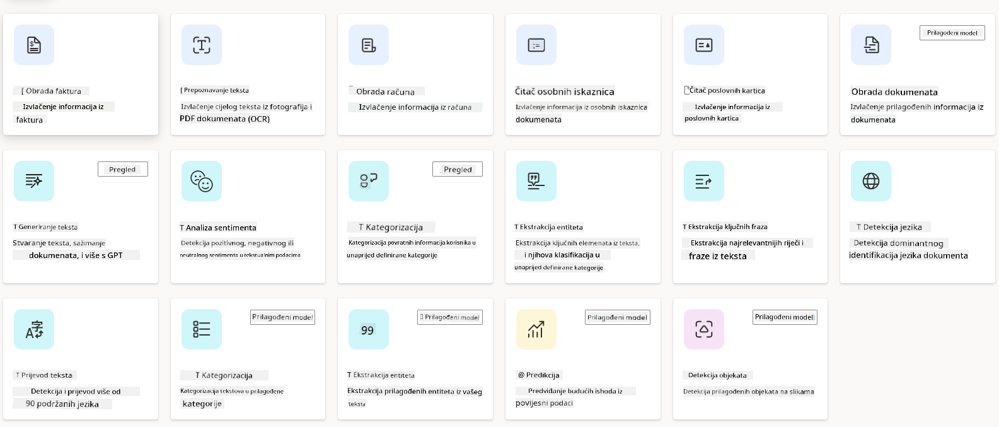
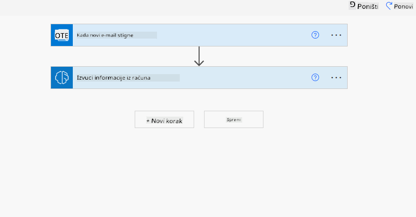

<!--
CO_OP_TRANSLATOR_METADATA:
{
  "original_hash": "f5ff3b6204a695a117d6f452403c95f7",
  "translation_date": "2025-05-19T21:13:28+00:00",
  "source_file": "10-building-low-code-ai-applications/README.md",
  "language_code": "hr"
}
-->
# Izgradnja aplikacija s niskim kodom uz AI

## Uvod

Sada kada smo naučili kako izraditi aplikacije za generiranje slika, razgovarajmo o niskom kodu. Generativna AI može se koristiti u raznim područjima, uključujući niski kod, ali što je točno niski kod i kako mu možemo dodati AI?

Izgradnja aplikacija i rješenja postala je lakša za tradicionalne programere i ne-programere kroz upotrebu platformi za razvoj s niskim kodom. Platforme za razvoj s niskim kodom omogućuju vam izradu aplikacija i rješenja s malo ili nimalo koda. To se postiže pružanjem vizualnog razvojnog okruženja koje omogućuje povlačenje i ispuštanje komponenti za izradu aplikacija i rješenja. Ovo vam omogućuje bržu izradu aplikacija i rješenja uz manje resursa. U ovoj lekciji detaljno ćemo istražiti kako koristiti niski kod i kako unaprijediti razvoj s niskim kodom uz AI koristeći Power Platform.

Power Platform pruža organizacijama priliku da osnaže svoje timove za izradu vlastitih rješenja kroz intuitivno okruženje s niskim ili nikakvim kodom. Ovo okruženje pojednostavljuje proces izrade rješenja. Uz Power Platform, rješenja se mogu izgraditi u danima ili tjednima umjesto mjesecima ili godinama. Power Platform se sastoji od pet ključnih proizvoda: Power Apps, Power Automate, Power BI, Power Pages i Copilot Studio.

Ova lekcija pokriva:

- Uvod u generativnu AI u Power Platform
- Uvod u Copilot i kako ga koristiti
- Korištenje generativne AI za izradu aplikacija i tijekova u Power Platform
- Razumijevanje AI modela u Power Platform uz AI Builder

## Ciljevi učenja

Na kraju ove lekcije moći ćete:

- Razumjeti kako Copilot radi u Power Platform.

- Izraditi aplikaciju za praćenje studentskih zadataka za naš startup u obrazovanju.

- Izraditi tijek obrade faktura koji koristi AI za izvlačenje informacija iz faktura.

- Primijeniti najbolje prakse pri korištenju modela Create Text s GPT AI.

Alati i tehnologije koje ćete koristiti u ovoj lekciji su:

- **Power Apps**, za aplikaciju za praćenje studentskih zadataka, koja pruža razvojno okruženje s niskim kodom za izradu aplikacija za praćenje, upravljanje i interakciju s podacima.

- **Dataverse**, za pohranu podataka za aplikaciju za praćenje studentskih zadataka gdje će Dataverse pružiti platformu za pohranu podataka s niskim kodom za pohranu podataka aplikacije.

- **Power Automate**, za tijek obrade faktura gdje ćete imati razvojno okruženje s niskim kodom za izradu tijekova rada za automatizaciju procesa obrade faktura.

- **AI Builder**, za AI model obrade faktura gdje ćete koristiti unaprijed izgrađene AI modele za obradu faktura za naš startup.

## Generativna AI u Power Platform

Unapređenje razvoja i aplikacija s niskim kodom uz generativnu AI ključna je fokusna točka za Power Platform. Cilj je omogućiti svima izradu aplikacija, stranica, nadzornih ploča i automatizaciju procesa s AI, _bez potrebe za stručnim znanjem o znanosti o podacima_. Ovaj cilj postiže se integriranjem generativne AI u iskustvo razvoja s niskim kodom u Power Platform u obliku Copilot i AI Builder.

### Kako to funkcionira?

Copilot je AI asistent koji vam omogućuje izradu rješenja u Power Platform opisivanjem vaših zahtjeva u nizu razgovornih koraka koristeći prirodni jezik. Na primjer, možete uputiti svog AI asistenta da navede koja će polja vaša aplikacija koristiti i on će stvoriti i aplikaciju i temeljni model podataka ili možete specificirati kako postaviti tijek u Power Automate.

Funkcionalnosti vođene Copilotom možete koristiti kao značajku na zaslonima vaše aplikacije kako biste omogućili korisnicima otkrivanje uvida kroz razgovornu interakciju.

AI Builder je mogućnost AI-a s niskim kodom dostupna u Power Platform koja vam omogućuje korištenje AI modela za pomoć u automatizaciji procesa i predviđanju ishoda. Uz AI Builder možete donijeti AI u svoje aplikacije i tijekove koji se povezuju s vašim podacima u Dataverse ili u raznim oblacima izvora podataka, kao što su SharePoint, OneDrive ili Azure.

Copilot je dostupan u svim proizvodima Power Platform: Power Apps, Power Automate, Power BI, Power Pages i Power Virtual Agents. AI Builder je dostupan u Power Apps i Power Automate. U ovoj lekciji fokusirat ćemo se na korištenje Copilot i AI Builder u Power Apps i Power Automate za izradu rješenja za naš startup u obrazovanju.

### Copilot u Power Apps

Kao dio Power Platform, Power Apps pruža razvojno okruženje s niskim kodom za izradu aplikacija za praćenje, upravljanje i interakciju s podacima. To je skup usluga za razvoj aplikacija s platformom podataka koja se može skalirati i mogućnošću povezivanja s oblačnim uslugama i podacima na licu mjesta. Power Apps omogućuje izradu aplikacija koje rade na preglednicima, tabletima i telefonima, i mogu se dijeliti s suradnicima. Power Apps olakšava korisnicima razvoj aplikacija jednostavnim sučeljem, tako da svaki poslovni korisnik ili profesionalni programer može izraditi prilagođene aplikacije. Iskustvo razvoja aplikacija također je unaprijeđeno s generativnom AI kroz Copilot.

Značajka AI asistenta Copilot u Power Apps omogućuje vam opisivanje kakvu vrstu aplikacije trebate i koje informacije želite da vaša aplikacija prati, prikuplja ili prikazuje. Copilot tada generira responzivnu Canvas aplikaciju na temelju vašeg opisa. Možete zatim prilagoditi aplikaciju kako bi zadovoljila vaše potrebe. AI Copilot također generira i predlaže Dataverse tablicu s poljima koja trebate za pohranu podataka koje želite pratiti i neke uzorke podataka. Kasnije ćemo u ovoj lekciji pogledati što je Dataverse i kako ga možete koristiti u Power Apps. Možete zatim prilagoditi tablicu kako bi zadovoljila vaše potrebe koristeći značajku AI Copilot asistenta kroz razgovorne korake. Ova značajka je odmah dostupna s početnog zaslona Power Apps.

### Copilot u Power Automate

Kao dio Power Platform, Power Automate omogućuje korisnicima izradu automatiziranih tijekova rada između aplikacija i usluga. Pomaže automatizirati ponavljajuće poslovne procese kao što su komunikacija, prikupljanje podataka i odobravanje odluka. Njegovo jednostavno sučelje omogućuje korisnicima sa svakom tehničkom kompetencijom (od početnika do iskusnih programera) automatizaciju radnih zadataka. Iskustvo razvoja tijeka rada također je unaprijeđeno s generativnom AI kroz Copilot.

Značajka AI asistenta Copilot u Power Automate omogućuje vam opisivanje kakvu vrstu tijeka trebate i koje radnje želite da vaš tijek obavlja. Copilot tada generira tijek na temelju vašeg opisa. Možete zatim prilagoditi tijek kako bi zadovoljio vaše potrebe. AI Copilot također generira i predlaže radnje koje trebate obaviti za zadatak koji želite automatizirati. Kasnije ćemo u ovoj lekciji pogledati što su tijekovi i kako ih možete koristiti u Power Automate. Možete zatim prilagoditi radnje kako bi zadovoljile vaše potrebe koristeći značajku AI Copilot asistenta kroz razgovorne korake. Ova značajka je odmah dostupna s početnog zaslona Power Automate.

## Zadaci: Upravljanje studentskim zadacima i fakturama za naš startup, koristeći Copilot

Naš startup pruža online tečajeve studentima. Startup je brzo rastao i sada se bori s potražnjom za svojim tečajevima. Startup vas je angažirao kao Power Platform developera kako biste im pomogli izgraditi rješenje s niskim kodom koje će im pomoći u upravljanju studentskim zadacima i fakturama. Njihovo rješenje trebalo bi im pomoći u praćenju i upravljanju studentskim zadacima kroz aplikaciju i automatizaciji procesa obrade faktura kroz tijek rada. Zatraženo je da koristite generativnu AI za razvoj rješenja.

Kada započinjete s korištenjem Copilot, možete koristiti [Power Platform Copilot Prompt Library](https://github.com/pnp/powerplatform-prompts?WT.mc_id=academic-109639-somelezediko) kako biste započeli s promptovima. Ova biblioteka sadrži popis promptova koje možete koristiti za izradu aplikacija i tijekova s Copilot. Također možete koristiti promptove u biblioteci kako biste dobili ideju kako opisati svoje zahtjeve Copilot.

### Izradite aplikaciju za praćenje studentskih zadataka za naš startup

Edukatori u našem startupu bore se s praćenjem studentskih zadataka. Koristili su proračunsku tablicu za praćenje zadataka, ali to je postalo teško upravljati kako se broj studenata povećao. Zatražili su vas da izradite aplikaciju koja će im pomoći u praćenju i upravljanju studentskim zadacima. Aplikacija bi im trebala omogućiti dodavanje novih zadataka, pregled zadataka, ažuriranje zadataka i brisanje zadataka. Aplikacija bi također trebala omogućiti edukatorima i studentima pregled zadataka koji su ocijenjeni i onih koji nisu ocijenjeni.

Izradit ćete aplikaciju koristeći Copilot u Power Apps slijedeći korake u nastavku:

1. Navigirajte na početni zaslon [Power Apps](https://make.powerapps.com?WT.mc_id=academic-105485-koreyst).

1. Koristite tekstualno područje na početnom zaslonu kako biste opisali aplikaciju koju želite izraditi. Na primjer, **_Želim izraditi aplikaciju za praćenje i upravljanje studentskim zadacima_**. Kliknite na gumb **Pošalji** kako biste poslali prompt AI Copilot.

1. AI Copilot će predložiti Dataverse tablicu s poljima koja trebate za pohranu podataka koje želite pratiti i uzorke podataka. Možete zatim prilagoditi tablicu kako bi zadovoljila vaše potrebe koristeći značajku AI Copilot asistenta kroz razgovorne korake.

   > **Važno**: Dataverse je temeljna platforma podataka za Power Platform. To je platforma podataka s niskim kodom za pohranu podataka aplikacije. To je potpuno upravljana usluga koja sigurno pohranjuje podatke u Microsoft Cloud i dodjeljuje se unutar vašeg Power Platform okruženja. Dolazi s ugrađenim mogućnostima upravljanja podacima, kao što su klasifikacija podataka, linija podataka, fino kontrolirani pristup i više. Više o Dataverse možete saznati [ovdje](https://docs.microsoft.com/powerapps/maker/data-platform/data-platform-intro?WT.mc_id=academic-109639-somelezediko).

1. Edukatori žele slati e-poštu studentima koji su predali svoje zadatke kako bi ih obavijestili o napretku njihovih zadataka. Možete koristiti Copilot za dodavanje novog polja u tablicu za pohranu e-pošte studenta. Na primjer, možete koristiti sljedeći prompt za dodavanje novog polja u tablicu: **_Želim dodati stupac za pohranu e-pošte studenta_**. Kliknite na gumb **Pošalji** kako biste poslali prompt AI Copilot.

1. AI Copilot će generirati novo polje i možete zatim prilagoditi polje kako bi zadovoljilo vaše potrebe.

1. Kada završite s tablicom, kliknite na gumb **Izradi aplikaciju** kako biste izradili aplikaciju.

1. AI Copilot će generirati responzivnu Canvas aplikaciju na temelju vašeg opisa. Možete zatim prilagoditi aplikaciju kako bi zadovoljila vaše potrebe.

1. Kako bi edukatori mogli slati e-poštu studentima, možete koristiti Copilot za dodavanje novog zaslona u aplikaciju. Na primjer, možete koristiti sljedeći prompt za dodavanje novog zaslona u aplikaciju: **_Želim dodati zaslon za slanje e-pošte studentima_**. Kliknite na gumb **Pošalji** kako biste poslali prompt AI Copilot.

1. AI Copilot će generirati novi zaslon i možete zatim prilagoditi zaslon kako bi zadovoljio vaše potrebe.

1. Kada završite s aplikacijom, kliknite na gumb **Spremi** kako biste spremili aplikaciju.

1. Kako biste podijelili aplikaciju s edukatorima, kliknite na gumb **Podijeli** i zatim ponovno kliknite na gumb **Podijeli**. Možete zatim podijeliti aplikaciju s edukatorima unosom njihovih e-mail adresa.

> **Vaša domaća zadaća**: Aplikacija koju ste upravo izradili je dobar početak, ali može se poboljšati. S funkcijom e-pošte, edukatori mogu slati e-poštu studentima samo ručno, morajući unijeti njihove e-mail adrese. Možete li koristiti Copilot za izgradnju automatizacije koja će omogućiti edukatorima automatsko slanje e-pošte studentima kada predaju svoje zadatke? Vaš trag je da s pravim promptom možete koristiti Copilot u Power Automate za izradu ovog.

### Izradite tablicu informacija o fakturama za naš startup

Financijski tim našeg startupa bori se s praćenjem faktura. Koristili su proračunsku tablicu za praćenje faktura, ali to je postalo teško upravljati kako se broj faktura povećao. Zatražili su vas da izradite tablicu koja će im pomoći u pohrani, praćenju i upravljanju informacijama o primljenim fakturama. Tablica bi trebala biti korištena za izradu automatizacije koja će izvući sve informacije o fakturama i pohraniti ih u tablicu. Tablica bi također trebala omogućiti financijskom timu pregled faktura koje su plaćene i onih koje nisu plaćene.

Power Platform ima temeljnu platformu podataka pod nazivom Dataverse koja vam omogućuje pohranu podataka za vaše aplikacije i rješenja. Dataverse pruža platformu podataka s niskim kodom za pohranu podataka aplikacije. To je potpuno upravljana usluga koja sigurno pohranjuje podatke u Microsoft Cloud i dodjeljuje se unutar vašeg Power Platform okruženja. Dolazi s ugrađenim mogućnostima upravljanja podacima, kao što su klasifikacija podataka, linija podataka, fino kontrolirani pristup i više. Više o Dataverse možete saznati [ovdje](https://docs.microsoft.com/powerapps/maker/data-platform/data-platform-intro?WT.mc_id=academic-109639-somelezediko).

Zašto bismo trebali koristiti Dataverse za naš startup? Standardne i prilagođene tablice unutar Dataverse pružaju sigurnu i oblačnu opciju pohrane za vaše podatke. Tablice vam omogućuju pohranu različitih vrsta podataka, slično kao što biste koristili više radnih listova u jednoj Excel radnoj knjizi. Možete koristiti tablice za pohranu podataka specifičnih za vaše organizacijske ili poslovne potrebe. Neke od prednosti koje naš startup dobiva korištenjem Dataverse uključuju, ali nisu ograničene na:

- **Jednostavno za upravljanje**: I metapodaci i podaci pohranjuju se u oblaku, tako da ne morate brinuti o detaljima kako su pohranjeni ili upravljani. Možete se usredotočiti na izradu svojih aplikacija i rješenja.

- **Sigurno**: Dataverse pruža sigurnu i oblačnu opciju pohrane za vaše podatke. Možete kontrolirati tko ima pristup podacima u vašim tablicama i kako im može pristupiti koristeći sigurnost temeljenu na ulogama.

- **Bogati metapodaci**: Tipovi podataka i odnosi koriste se izravno unutar Power Apps

- **Logika i validacija**: Možete koristiti poslovna pravila, izračunata polja i pravila validacije za provedbu poslovne logike i održavanje točnosti podataka.

Sada kada znate što je Dataverse i zašto biste ga trebali koristiti, pogledajmo kako možete koristiti Copilot za izradu tablice u Dataverse kako biste zadovoljili zahtjeve našeg financijskog tima.

> **Napomena**: Ovu tablicu ćete koristiti u sljedećem odjeljku za izradu automatizacije koja će izvući sve informacije o fakturama i pohraniti ih u tablicu. Da biste izradili tablicu u Dataverse koristeći Copilot, slijedite korake u nastavku: 1. Navigirajte na početni zaslon [Power Apps](https://make.powerapps.com?WT.mc_id=academic-105485-koreyst). 2. Na lijevoj navigacijskoj traci odaberite **Tablice** i zatim kliknite na **Opišite novu tablicu**. 1. Na zas
a tekst. - **Analiza sentimenta**: Ovaj model detektira pozitivan, negativan, neutralan ili miješani sentiment u tekstu. - **Čitač poslovnih kartica**: Ovaj model izvlači informacije s poslovnih kartica. - **Prepoznavanje teksta**: Ovaj model izvlači tekst iz slika. - **Detekcija objekata**: Ovaj model detektira i izvlači objekte iz slika. - **Obrada dokumenata**: Ovaj model izvlači informacije iz obrazaca. - **Obrada faktura**: Ovaj model izvlači informacije iz faktura. S prilagođenim AI modelima možete unijeti svoj vlastiti model u AI Builder kako bi funkcionirao kao bilo koji prilagođeni model AI Buildera, omogućujući vam treniranje modela koristeći vlastite podatke. Možete koristiti ove modele za automatizaciju procesa i predviđanje ishoda u Power Apps i Power Automate. Kada koristite vlastiti model, postoje ograničenja koja se primjenjuju. Pročitajte više o ovim [ograničenjima](https://learn.microsoft.com/ai-builder/byo-model#limitations?WT.mc_id=academic-105485-koreyst).  

## Zadatak #2 - Izradite tijek obrade faktura za naš startup

Financijski tim ima poteškoća s obradom faktura. Koristili su proračunsku tablicu za praćenje faktura, ali to je postalo teško upravljati kako se broj faktura povećao. Zamolili su vas da izradite tijek rada koji će im pomoći u obradi faktura koristeći AI. Tijek rada trebao bi im omogućiti da izvuku informacije iz faktura i pohrane informacije u Dataverse tablicu. Tijek rada trebao bi im također omogućiti slanje e-pošte financijskom timu s izvučenim informacijama. Sada kada znate što je AI Builder i zašto biste ga trebali koristiti, pogledajmo kako možete koristiti AI model za obradu faktura u AI Builderu, koji smo ranije pokrili, kako biste izgradili tijek rada koji će pomoći financijskom timu u obradi faktura. Da biste izgradili tijek rada koji će pomoći financijskom timu u obradi faktura koristeći AI model za obradu faktura u AI Builderu, slijedite korake u nastavku:

1. Idite na početni ekran [Power Automate](https://make.powerautomate.com?WT.mc_id=academic-105485-koreyst).
2. Koristite tekstualno područje na početnom ekranu da opišete tijek rada koji želite izgraditi. Na primjer, **_Obradi fakturu kada stigne u moju poštu_**. Kliknite na gumb **Pošalji** da pošaljete upit AI Copilotu. 
3. AI Copilot će predložiti radnje koje trebate izvršiti za zadatak koji želite automatizirati. Možete kliknuti na gumb **Dalje** da biste prošli kroz sljedeće korake.
4. U sljedećem koraku, Power Automate će vas zatražiti da postavite veze potrebne za tijek. Kada završite, kliknite na gumb **Kreiraj tijek** da biste kreirali tijek.
5. AI Copilot će generirati tijek i tada možete prilagoditi tijek kako bi odgovarao vašim potrebama.
6. Ažurirajte okidač tijeka i postavite **Mapu** na mapu gdje će fakture biti pohranjene. Na primjer, možete postaviti mapu na **Inbox**. Kliknite na **Prikaži napredne opcije** i postavite **Samo s prilozima** na **Da**. To će osigurati da se tijek pokrene samo kada se u mapi primi e-pošta s prilogom.
7. Uklonite sljedeće radnje iz tijeka: **HTML u tekst**, **Sastavi**, **Sastavi 2**, **Sastavi 3** i **Sastavi 4** jer ih nećete koristiti.
8. Uklonite radnju **Uvjet** iz tijeka jer je nećete koristiti. Trebalo bi izgledati kao na sljedećem snimku zaslona: 
9. Kliknite na gumb **Dodaj radnju** i potražite **Dataverse**. Odaberite radnju **Dodaj novi redak**.
10. Na radnji **Izvuci informacije iz faktura**, ažurirajte **Datoteku fakture** da pokazuje na **Sadržaj priloga** iz e-pošte. To će osigurati da tijek izvlači informacije iz priloga fakture.
11. Odaberite **Tablicu** koju ste ranije kreirali. Na primjer, možete odabrati tablicu **Informacije o fakturi**. Odaberite dinamički sadržaj iz prethodne radnje da popunite sljedeća polja: 
- ID 
- Iznos 
- Datum 
- Ime 
- Status 
- Postavite **Status** na **Na čekanju**. 
- E-mail dobavljača 
- Koristite dinamički sadržaj **Od** iz okidača **Kada stigne nova e-pošta**. 
12. Kada završite s tijekom, kliknite na gumb **Spremi** da biste spremili tijek. Tada možete testirati tijek slanjem e-pošte s fakturom u mapu koju ste naveli u okidaču.

> **Vaša domaća zadaća**: Tijek koji ste upravo izgradili je dobar početak, sada trebate razmisliti o tome kako možete izgraditi automatizaciju koja će omogućiti našem financijskom timu da pošalje e-mail dobavljaču kako bi ih obavijestili o trenutnom statusu njihove fakture. Vaša naznaka: tijek mora biti pokrenut kada se status fakture promijeni.

## Koristite AI model za generiranje teksta u Power Automate

AI model za kreiranje teksta s GPT u AI Builderu omogućuje vam generiranje teksta na temelju upita i pokreće ga Microsoft Azure OpenAI Service. S ovom mogućnošću, možete integrirati GPT (Generativni unaprijed trenirani transformator) tehnologiju u svoje aplikacije i tijekove kako biste izgradili razne automatizirane tijekove i informativne aplikacije.

GPT modeli prolaze opsežnu obuku na velikim količinama podataka, omogućujući im proizvodnju teksta koji blisko nalikuje ljudskom jeziku kada im se pruži upit. Kada se integriraju s automatizacijom tijeka rada, AI modeli poput GPT-a mogu se iskoristiti za pojednostavljenje i automatizaciju širokog spektra zadataka.

Na primjer, možete izgraditi tijekove za automatsko generiranje teksta za razne primjene, kao što su: nacrti e-pošte, opisi proizvoda i više. Također možete koristiti model za generiranje teksta za razne aplikacije, kao što su chatbotovi i aplikacije za korisničku podršku koje omogućuju agentima za korisničku podršku da učinkovito i efikasno odgovore na upite korisnika.

Da biste naučili kako koristiti ovaj AI model u Power Automate, pregledajte modul [Dodajte inteligenciju s AI Builderom i GPT](https://learn.microsoft.com/training/modules/ai-builder-text-generation/?WT.mc_id=academic-109639-somelezediko).

## Odličan rad! Nastavite s učenjem

Nakon što završite ovu lekciju, pogledajte našu [kolekciju za učenje generativne AI](https://aka.ms/genai-collection?WT.mc_id=academic-105485-koreyst) kako biste nastavili podizati svoje znanje o generativnoj AI!

Idite na Lekciju 11 gdje ćemo pogledati kako [integrirati generativnu AI s pozivanjem funkcija](../11-integrating-with-function-calling/README.md?WT.mc_id=academic-105485-koreyst)!

**Izjava o odricanju odgovornosti**:  
Ovaj dokument je preveden pomoću AI usluge prevođenja [Co-op Translator](https://github.com/Azure/co-op-translator). Iako težimo preciznosti, imajte na umu da automatizirani prijevodi mogu sadržavati pogreške ili netočnosti. Izvorni dokument na izvornom jeziku treba smatrati mjerodavnim izvorom. Za kritične informacije preporučuje se profesionalni prijevod od strane čovjeka. Ne odgovaramo za bilo kakve nesporazume ili pogrešne interpretacije koje proizlaze iz korištenja ovog prijevoda.