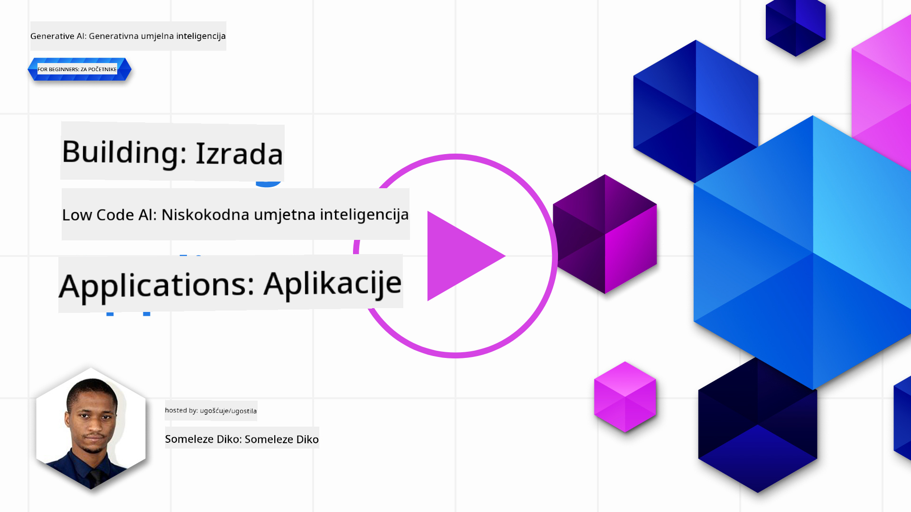
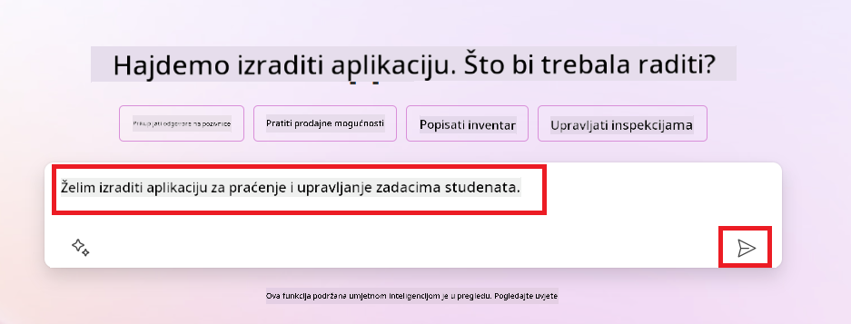
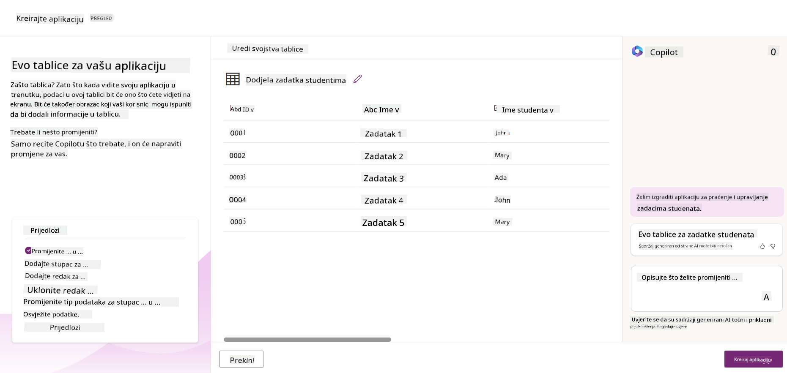
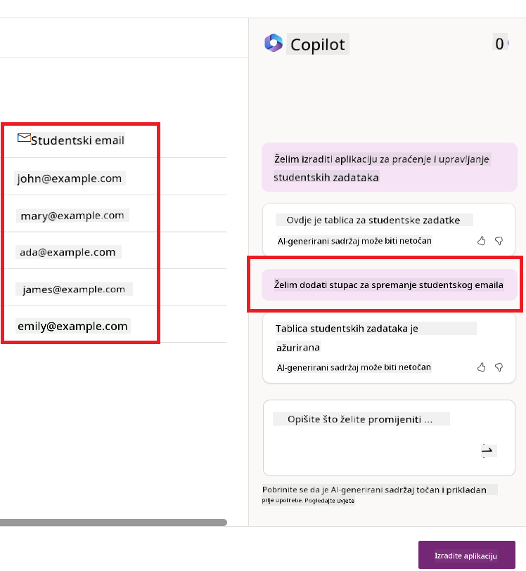
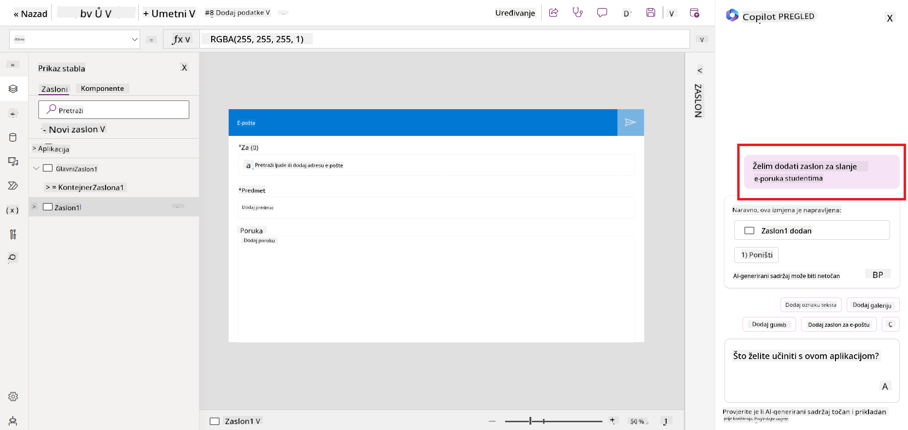
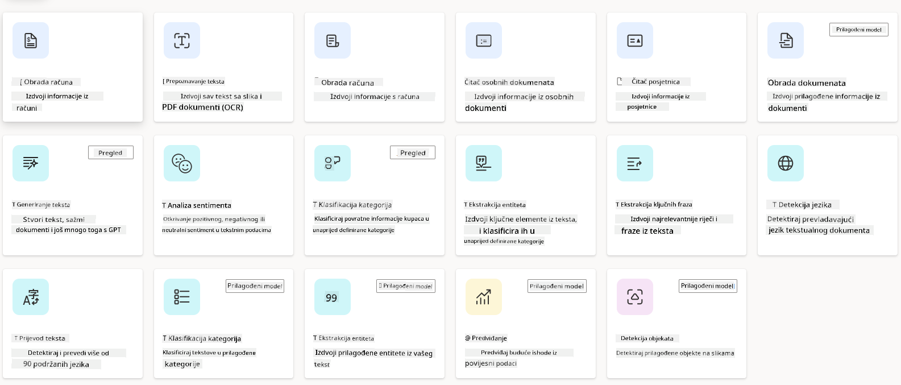
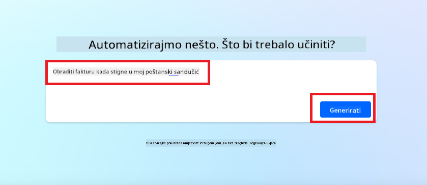
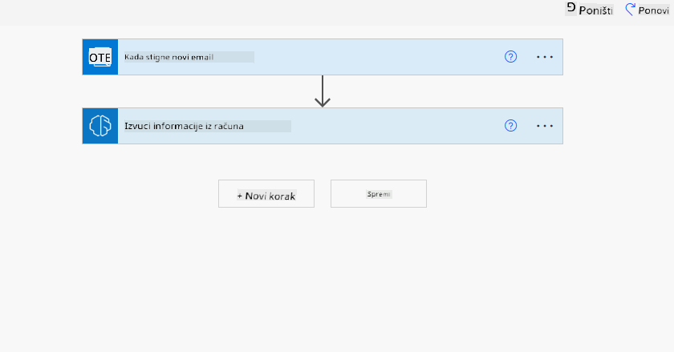
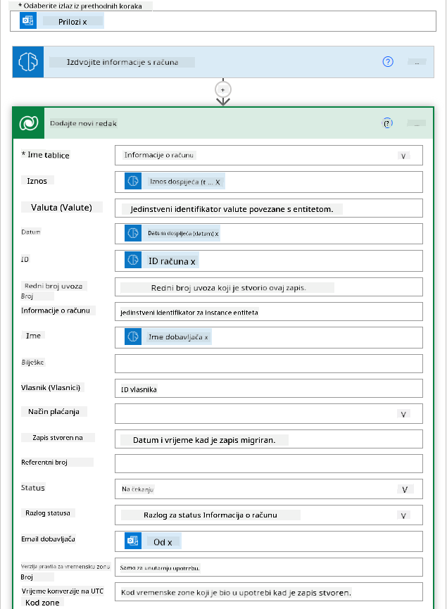
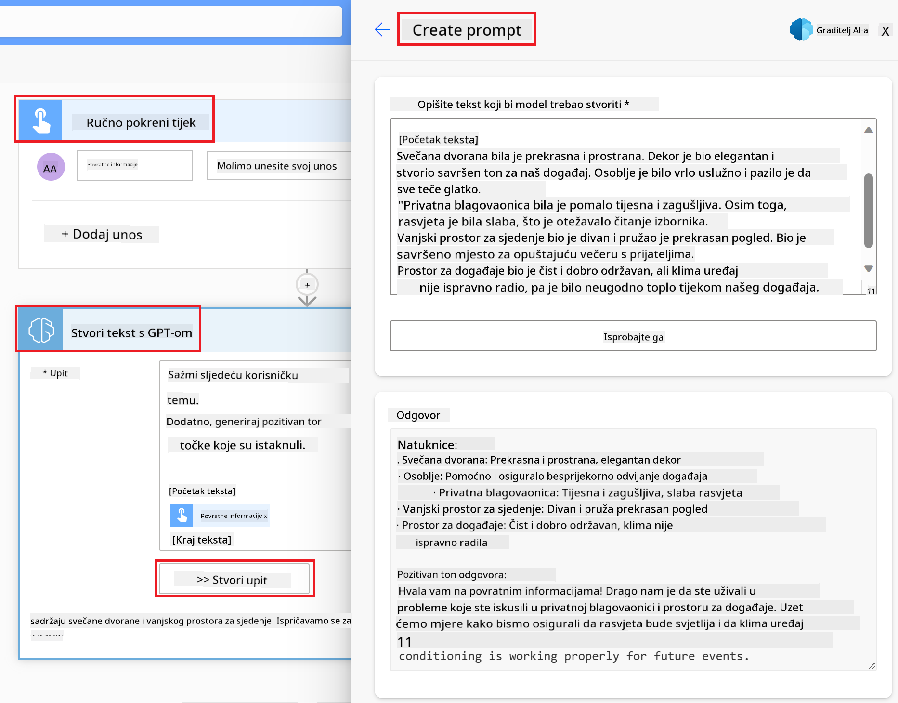

<!--
CO_OP_TRANSLATOR_METADATA:
{
  "original_hash": "f5ff3b6204a695a117d6f452403c95f7",
  "translation_date": "2025-06-25T19:32:20+00:00",
  "source_file": "10-building-low-code-ai-applications/README.md",
  "language_code": "hr"
}
-->
# Izgradnja aplikacija s niskim kodom i umjetnom inteligencijom

> _(Kliknite na sliku iznad za pregled videozapisa ove lekcije)_

## Uvod

Sada kada smo naučili kako izraditi aplikacije za generiranje slika, razgovarajmo o niskom kodu. Generativna umjetna inteligencija može se koristiti u raznim područjima, uključujući niski kod, ali što je niski kod i kako mu možemo dodati AI?

Izrada aplikacija i rješenja postala je lakša za tradicionalne programere i ne-programere korištenjem platformi za razvoj s niskim kodom. Platforme za razvoj s niskim kodom omogućuju izradu aplikacija i rješenja s malo ili bez koda. To se postiže pružanjem vizualnog razvojnog okruženja koje omogućuje povlačenje i ispuštanje komponenti za izradu aplikacija i rješenja. To omogućuje bržu izradu aplikacija i rješenja uz manje resursa. U ovoj lekciji, duboko ćemo zaroniti u korištenje niskog koda i kako poboljšati razvoj s niskim kodom pomoću AI-a koristeći Power Platformu.

Power Platforma pruža organizacijama priliku da osnaže svoje timove za izgradnju vlastitih rješenja kroz intuitivno okruženje s niskim kodom ili bez koda. Ovo okruženje pomaže pojednostaviti proces izrade rješenja. S Power Platformom, rješenja se mogu izgraditi u danima ili tjednima umjesto mjesecima ili godinama. Power Platforma sastoji se od pet ključnih proizvoda: Power Apps, Power Automate, Power BI, Power Pages i Copilot Studio.

Ova lekcija pokriva:

- Uvod u generativnu umjetnu inteligenciju u Power Platformi
- Uvod u Copilot i kako ga koristiti
- Korištenje generativne umjetne inteligencije za izradu aplikacija i tokova u Power Platformi
- Razumijevanje AI modela u Power Platformi s AI Builderom

## Ciljevi učenja

Do kraja ove lekcije, moći ćete:

- Razumjeti kako Copilot radi u Power Platformi.

- Izgraditi aplikaciju za praćenje zadataka studenata za našu edukacijsku startup tvrtku.

- Izgraditi tok za obradu faktura koji koristi AI za ekstrakciju informacija iz faktura.

- Primijeniti najbolje prakse prilikom korištenja modela GPT AI za stvaranje teksta.

Alati i tehnologije koje ćete koristiti u ovoj lekciji su:

- **Power Apps**, za aplikaciju za praćenje zadataka studenata, koja pruža razvojno okruženje s niskim kodom za izradu aplikacija za praćenje, upravljanje i interakciju s podacima.

- **Dataverse**, za pohranu podataka za aplikaciju za praćenje zadataka studenata gdje će Dataverse pružiti platformu za pohranu podataka s niskim kodom za pohranu podataka aplikacije.

- **Power Automate**, za tok obrade faktura gdje ćete imati razvojno okruženje s niskim kodom za izgradnju tokova rada za automatizaciju procesa obrade faktura.

- **AI Builder**, za AI model obrade faktura gdje ćete koristiti unaprijed izrađene AI modele za obradu faktura za našu startup tvrtku.

## Generativna umjetna inteligencija u Power Platformi

Poboljšanje razvoja i primjene s niskim kodom pomoću generativne umjetne inteligencije ključno je područje fokusa za Power Platformu. Cilj je omogućiti svima izradu aplikacija, web stranica, nadzornih ploča i automatizaciju procesa s AI-jem, _bez potrebe za stručnim znanjem iz područja znanosti o podacima_. Ovaj cilj postiže se integracijom generativne umjetne inteligencije u razvojno iskustvo s niskim kodom u Power Platformi u obliku Copilot i AI Builder.

### Kako to funkcionira?

Copilot je AI asistent koji vam omogućuje izradu rješenja u Power Platformi opisivanjem vaših zahtjeva kroz niz razgovornih koraka koristeći prirodni jezik. Možete, na primjer, uputiti vašeg AI asistenta da navede koje polja vaša aplikacija će koristiti i on će kreirati i aplikaciju i temeljni model podataka ili možete odrediti kako postaviti tok u Power Automate.

Možete koristiti funkcionalnosti vođene Copilotom kao značajku na ekranima vaše aplikacije kako biste omogućili korisnicima da otkriju uvide kroz razgovorne interakcije.

AI Builder je AI sposobnost s niskim kodom dostupna u Power Platformi koja vam omogućuje korištenje AI modela kako bi vam pomogla u automatizaciji procesa i predviđanju ishoda. S AI Builderom možete donijeti AI u svoje aplikacije i tokove koji se povezuju s vašim podacima u Dataverseu ili u raznim izvorima podataka u oblaku, kao što su SharePoint, OneDrive ili Azure.

Copilot je dostupan u svim proizvodima Power Platforme: Power Apps, Power Automate, Power BI, Power Pages i Power Virtual Agents. AI Builder je dostupan u Power Apps i Power Automate. U ovoj lekciji, fokusirat ćemo se na korištenje Copilot i AI Buildera u Power Apps i Power Automate kako bismo izgradili rješenje za našu edukacijsku startup tvrtku.

### Copilot u Power Apps

Kao dio Power Platforme, Power Apps pruža razvojno okruženje s niskim kodom za izradu aplikacija za praćenje, upravljanje i interakciju s podacima. To je skup usluga za razvoj aplikacija s skalabilnom platformom podataka i mogućnost povezivanja s uslugama u oblaku i podacima na lokaciji. Power Apps omogućuje izradu aplikacija koje rade na preglednicima, tabletima i telefonima te se mogu dijeliti s kolegama. Power Apps olakšava korisnicima ulazak u razvoj aplikacija jednostavnim sučeljem, tako da svaki poslovni korisnik ili profesionalni programer može izraditi prilagođene aplikacije. Iskustvo razvoja aplikacija također je poboljšano generativnom umjetnom inteligencijom putem Copilota.

Značajka AI asistenta Copilot u Power Apps omogućuje vam opisivanje kakvu vrstu aplikacije trebate i koje informacije želite da vaša aplikacija prati, prikuplja ili prikazuje. Copilot tada generira responzivnu Canvas aplikaciju temeljem vašeg opisa. Možete zatim prilagoditi aplikaciju kako bi zadovoljila vaše potrebe. AI Copilot također generira i predlaže Dataverse tablicu s poljima koja su vam potrebna za pohranu podataka koje želite pratiti i neke uzorke podataka. Pogledat ćemo što je Dataverse i kako ga možete koristiti u Power Apps u ovoj lekciji kasnije. Možete zatim prilagoditi tablicu kako bi zadovoljila vaše potrebe koristeći značajku AI Copilot asistenta kroz razgovorne korake. Ova značajka je dostupna s početnog ekrana Power Apps.

### Copilot u Power Automate

Kao dio Power Platforme, Power Automate omogućuje korisnicima izradu automatiziranih tokova između aplikacija i usluga. Pomaže automatizirati ponavljajuće poslovne procese kao što su komunikacija, prikupljanje podataka i odobrenja odluka. Njegovo jednostavno sučelje omogućuje korisnicima svih tehničkih sposobnosti (od početnika do iskusnih programera) da automatiziraju radne zadatke. Iskustvo razvoja tokova rada također je poboljšano generativnom umjetnom inteligencijom putem Copilota.

Značajka AI asistenta Copilot u Power Automate omogućuje vam opisivanje kakav tok trebate i koje radnje želite da vaš tok obavlja. Copilot tada generira tok temeljem vašeg opisa. Možete zatim prilagoditi tok kako bi zadovoljio vaše potrebe. AI Copilot također generira i predlaže radnje koje trebate obaviti kako biste automatizirali zadatak koji želite. Pogledat ćemo što su tokovi i kako ih možete koristiti u Power Automate u ovoj lekciji kasnije. Možete zatim prilagoditi radnje kako bi zadovoljile vaše potrebe koristeći značajku AI Copilot asistenta kroz razgovorne korake. Ova značajka je dostupna s početnog ekrana Power Automate.

## Zadatak: Upravljanje zadacima studenata i fakturama za našu startup tvrtku, koristeći Copilot

Naša startup tvrtka pruža online tečajeve studentima. Tvrtka je brzo rasla i sada se bori s potražnjom za svojim tečajevima. Tvrtka je zaposlila vas kao Power Platform developera da im pomognete izgraditi rješenje s niskim kodom kako bi im pomogli u upravljanju zadacima studenata i fakturama. Njihovo rješenje trebalo bi im pomoći pratiti i upravljati zadacima studenata putem aplikacije i automatizirati proces obrade faktura putem tokova rada. Zatraženo je od vas da koristite generativnu umjetnu inteligenciju za razvoj rješenja.

Kada započinjete s korištenjem Copilota, možete koristiti [Power Platform Copilot Prompt Library](https://github.com/pnp/powerplatform-prompts?WT.mc_id=academic-109639-somelezediko) za početak s promptovima. Ova biblioteka sadrži popis promptova koje možete koristiti za izradu aplikacija i tokova s Copilotom. Također možete koristiti promptove u biblioteci kako biste dobili ideju o tome kako opisati vaše zahtjeve Copilotu.

### Izgradite aplikaciju za praćenje zadataka studenata za našu startup tvrtku

Edukatori u našoj startup tvrtki imaju poteškoća u praćenju zadataka studenata. Koristili su proračunsku tablicu za praćenje zadataka, ali to je postalo teško za upravljanje kako se broj studenata povećao. Zatražili su od vas da izradite aplikaciju koja će im pomoći pratiti i upravljati zadacima studenata. Aplikacija bi trebala omogućiti dodavanje novih zadataka, pregled zadataka, ažuriranje zadataka i brisanje zadataka. Aplikacija bi također trebala omogućiti edukatorima i studentima pregled zadataka koji su ocijenjeni i onih koji nisu ocijenjeni.

Izradit ćete aplikaciju koristeći Copilot u Power Apps slijedeći korake u nastavku:

1. Idite na početni ekran [Power Apps](https://make.powerapps.com?WT.mc_id=academic-105485-koreyst).

1. Koristite tekstualno područje na početnom ekranu za opisivanje aplikacije koju želite izraditi. Na primjer, **_Želim izraditi aplikaciju za praćenje i upravljanje zadacima studenata_**. Kliknite na gumb **Pošalji** da pošaljete prompt AI Copilotu.

1. AI Copilot će predložiti Dataverse tablicu s poljima koja su vam potrebna za pohranu podataka koje želite pratiti i neke uzorke podataka. Možete zatim prilagoditi tablicu kako bi zadovoljila vaše potrebe koristeći značajku AI Copilot asistenta kroz razgovorne korake.

   > **Važno**: Dataverse je temeljna platforma podataka za Power Platformu. To je platforma podataka s niskim kodom za pohranu podataka aplikacije. To je potpuno upravljana usluga koja sigurno pohranjuje podatke u Microsoft Cloud i je provisionirana unutar vašeg Power Platform okruženja. Dolazi s ugrađenim mogućnostima upravljanja podacima, kao što su klasifikacija podataka, porijeklo podataka, kontrola pristupa na finoj razini i više. Više o Dataverse možete saznati [ovdje](https://docs.microsoft.com/powerapps/maker/data-platform/data-platform-intro?WT.mc_id=academic-109639-somelezediko).

   

1. Edukatori žele slati e-mailove studentima koji su predali svoje zadatke kako bi ih obavijestili o napretku njihovih zadataka. Možete koristiti Copilot za dodavanje novog polja u tablicu za pohranu e-maila studenta. Na primjer, možete koristiti sljedeći prompt za dodavanje novog polja u tablicu: **_Želim dodati stupac za pohranu e-maila studenta_**. Kliknite na gumb **Pošalji** da pošaljete prompt AI Copilotu.

1. AI Copilot će generirati novo polje i možete zatim prilagoditi polje kako bi zadovoljilo vaše potrebe.

1. Kada završite s tablicom, kliknite na gumb **Izradi aplikaciju** da izradite aplikaciju.

1. AI Copilot će generirati responzivnu Canvas aplikaciju temeljem vašeg opisa. Možete zatim prilagoditi aplikaciju kako bi zadovoljila vaše potrebe.

1. Za edukatore da šalju e-mailove studentima, možete koristiti Copilot za dodavanje novog ekrana u aplikaciju. Na primjer, možete koristiti sljedeći prompt za dodavanje novog ekrana u aplikaciju: **_Želim dodati ekran za slanje e-mailova studentima_**. Kliknite na gumb **Pošalji** da pošaljete prompt AI Copilotu.

1. AI Copilot će generirati novi ekran i možete zatim prilagoditi ekran kako bi zadovoljio vaše potrebe.

1. Kada završite s aplikacijom, kliknite na gumb **Spremi** da spremite aplikaciju.

1. Za dijeljenje aplikacije s edukatorima, kliknite na gumb **Podijeli** i zatim ponovno kliknite na gumb **Podijeli**. Možete zatim podijeliti aplikaciju s edukatorima unosom njihovih e-mail adresa.

> **Vaš zadatak**: Aplikacija koju ste upravo izradili je dobar početak, ali može se poboljšati. S značajkom e-maila, edukatori mogu slati e-mailove studentima samo ručno, moraju upisati njihove e-mailove. Možete li koristiti Copilot za izradu automatizacije koja će omogućiti edukatorima automatsko slanje e-mailova studentima kada predaju svoje zadatke? Vaša pomoć je da s pravim promptom možete koristiti Copilot u Power Automate za izradu ovog.

### Izgradite tablicu informacija o fakturama za našu startup tvrtku

Financijski tim naše startup tvrtke ima poteškoća u praćenju faktura. Koristili su proračunsku tablicu za praćenje faktura, ali to je postalo teško za upravljanje kako se broj faktura povećao. Zatražili su od vas da izradite tablicu koja će im pomoći u pohrani, praćenju i upravljanju informacijama o fakturama koje primaju. Tablica bi trebala biti korištena za izradu automatizacije koja će izvući sve informacije o fakturama i pohraniti ih u tablicu. Tablica bi također trebala omogućiti financijskom timu pregled faktura koje su plaćene i onih koje nisu plaćene.

Power Platforma ima temeljnu platformu podataka nazvanu Dataverse koja vam omogućuje pohranu podataka za vaše aplikacije i rješenja. Dataverse pruža platformu podataka s niskim kodom za pohranu podataka aplikacije. To je potpuno upravljana usluga koja sigurno pohranjuje podatke u Microsoft Cloud i je provisionirana unutar vašeg Power Platform okruženja. Dolazi s ugrađenim mogućnostima upravljanja podacima, kao što su klasifikacija podataka, porijeklo podataka, kontrola pristupa na finoj razini i više. Više o [Dataverse možete saznati ovdje](https://docs.microsoft.com/powerapps/maker/data-platform/data-platform-intro?WT.mc_id=academic-109639-somelezediko).

Zašto bismo trebali koristiti Dataverse za našu startup tvrtku? Standardne i prilagođene tablice unutar Dataverse pružaju sigurnu i cloud-based opciju pohrane za vaše podatke. Tablice vam omogućuju pohranu različitih vrsta podataka, slično kao što biste koristili više radnih listova u jednoj Excel radnoj knjizi. Možete koristiti tablice za pohranu podataka koji su specifični za vaše organizacijske ili poslovne potrebe. Neke od prednosti koje naša startup tvrtka dobiva korištenjem Dataverse uključuju, ali nisu ograničene na:

- **Jednostavno upravljanje**: I metapodaci i podaci pohranjeni su u oblaku, tako da ne morate brinuti o detaljima kako su pohranjeni ili upravljani. Možete se fokusirati na izradu svojih aplikacija i rješenja.

-
tekst. - **Analiza sentimenta**: Ovaj model otkriva pozitivan, negativan, neutralan ili mješovit sentiment u tekstu. - **Čitač posjetnica**: Ovaj model izdvaja informacije s posjetnica. - **Prepoznavanje teksta**: Ovaj model izdvaja tekst iz slika. - **Otkrivanje objekata**: Ovaj model otkriva i izdvaja objekte iz slika. - **Obrada dokumenata**: Ovaj model izdvaja informacije iz obrazaca. - **Obrada računa**: Ovaj model izdvaja informacije iz računa. S prilagođenim AI modelima možete donijeti vlastiti model u AI Builder kako bi funkcionirao kao bilo koji prilagođeni model AI Buildera, omogućujući vam da trenirate model koristeći vlastite podatke. Možete koristiti ove modele za automatizaciju procesa i predviđanje ishoda u Power Apps i Power Automate. Kada koristite vlastiti model, postoje ograničenja koja se primjenjuju. Više o tim [ograničenjima](https://learn.microsoft.com/ai-builder/byo-model#limitations?WT.mc_id=academic-105485-koreyst).  ## Zadatak #2 - Izgradite tijek obrade računa za naš startup Financijski tim ima poteškoća s obradom računa. Koriste proračunsku tablicu za praćenje računa, ali to je postalo teško za upravljanje kako se broj računa povećao. Zamolili su vas da izgradite tijek rada koji će im pomoći u obradi računa koristeći AI. Tijek rada trebao bi im omogućiti izdvajanje informacija iz računa i pohranu informacija u tablicu Dataverse. Tijek rada trebao bi im također omogućiti slanje e-pošte financijskom timu s izdvojenim informacijama. Sada kada znate što je AI Builder i zašto ga trebate koristiti, pogledajmo kako možete koristiti AI Model za obradu računa u AI Builderu, o kojem smo ranije govorili, kako biste izgradili tijek rada koji će pomoći financijskom timu u obradi računa. Da biste izgradili tijek rada koji će pomoći financijskom timu u obradi računa koristeći AI Model za obradu računa u AI Builderu, slijedite korake u nastavku: 1. Idite na početnu stranicu [Power Automate](https://make.powerautomate.com?WT.mc_id=academic-105485-koreyst). 2. Koristite tekstualno područje na početnoj stranici za opisivanje tijeka rada koji želite izgraditi. Na primjer, **_Obradi račun kada stigne u moj poštanski sandučić_**. Kliknite na gumb **Pošalji** da pošaljete upit AI Copilotu.  3. AI Copilot će predložiti radnje koje trebate izvršiti za zadatak koji želite automatizirati. Možete kliknuti na gumb **Dalje** da biste prošli kroz sljedeće korake. 4. U sljedećem koraku, Power Automate će vas zatražiti da postavite potrebne veze za tijek. Kada završite, kliknite na gumb **Izradi tijek** da biste stvorili tijek. 5. AI Copilot će generirati tijek i tada ga možete prilagoditi svojim potrebama. 6. Ažurirajte okidač tijeka i postavite **Mapu** na mapu u kojoj će se računi pohranjivati. Na primjer, možete postaviti mapu na **Inbox**. Kliknite na **Prikaži napredne opcije** i postavite **Samo s privicima** na **Da**. To će osigurati da tijek radi samo kada se e-pošta s privitkom primi u mapu. 7. Uklonite sljedeće radnje iz tijeka: **HTML u tekst**, **Sastavi**, **Sastavi 2**, **Sastavi 3** i **Sastavi 4** jer ih nećete koristiti. 8. Uklonite radnju **Uvjet** iz tijeka jer je nećete koristiti. Trebalo bi izgledati kao na sljedećoj snimci zaslona:  9. Kliknite na gumb **Dodaj radnju** i potražite **Dataverse**. Odaberite radnju **Dodaj novi redak**. 10. Na radnji **Izvadi informacije iz računa**, ažurirajte **Datoteku računa** da usmjerite na **Sadržaj privitka** iz e-pošte. To će osigurati da tijek izvlači informacije iz privitka računa. 11. Odaberite **Tablicu** koju ste ranije izradili. Na primjer, možete odabrati tablicu **Informacije o računu**. Odaberite dinamički sadržaj iz prethodne radnje da biste popunili sljedeća polja: - ID - Iznos - Datum - Ime - Status - Postavite **Status** na **U tijeku**. - E-pošta dobavljača - Koristite **Od** dinamički sadržaj iz okidača **Kada stigne nova e-pošta**.  12. Kada završite s tijekom, kliknite na gumb **Spremi** da biste spremili tijek. Tada možete testirati tijek slanjem e-pošte s računom u mapu koju ste naveli u okidaču. > **Vaša zadaća**: Tijek koji ste upravo izgradili je dobar početak, sada trebate razmisliti kako možete izgraditi automatizaciju koja će omogućiti našem financijskom timu da pošalje e-poštu dobavljaču kako bi ga obavijestio o trenutnom statusu njegovog računa. Vaša sugestija: tijek mora raditi kada se status računa promijeni.

## Koristite AI model za generiranje teksta u Power Automate

Model Kreiraj tekst s GPT AI u AI Builderu omogućuje vam generiranje teksta na temelju upita i pokreće ga Microsoft Azure OpenAI Service. S ovom mogućnošću, možete integrirati GPT (Generative Pre-Trained Transformer) tehnologiju u svoje aplikacije i tijekove rada kako biste izgradili razne automatizirane tijekove i aplikacije koje donose uvide.

GPT modeli prolaze kroz opsežnu obuku na velikim količinama podataka, omogućujući im da proizvode tekst koji blisko oponaša ljudski jezik kada im se pruži upit. Kada se integriraju s automatizacijom tijeka rada, AI modeli poput GPT-a mogu se iskoristiti za pojednostavljenje i automatizaciju širokog spektra zadataka.

Na primjer, možete izgraditi tijekove za automatsko generiranje teksta za razne slučajeve upotrebe, kao što su: nacrti e-pošte, opisi proizvoda i više. Također možete koristiti model za generiranje teksta za razne aplikacije, kao što su chatbotovi i aplikacije za korisničku podršku koje omogućuju agentima korisničke podrške da učinkovito i efikasno odgovaraju na upite korisnika.

Da biste saznali kako koristiti ovaj AI model u Power Automate, prođite kroz modul [Dodaj inteligenciju s AI Builderom i GPT](https://learn.microsoft.com/training/modules/ai-builder-text-generation/?WT.mc_id=academic-109639-somelezediko).

## Odličan rad! Nastavite s učenjem

Nakon što završite ovaj lekciju, pogledajte našu [Generativnu AI kolekciju za učenje](https://aka.ms/genai-collection?WT.mc_id=academic-105485-koreyst) kako biste nastavili s poboljšavanjem svog znanja o generativnoj AI!

Prijeđite na Lekciju 11 gdje ćemo pogledati kako [integrirati generativnu AI s pozivanjem funkcija](../11-integrating-with-function-calling/README.md?WT.mc_id=academic-105485-koreyst)!

**Odricanje odgovornosti**:  
Ovaj dokument je preveden koristeći AI uslugu prevođenja [Co-op Translator](https://github.com/Azure/co-op-translator). Iako težimo za točnost, molimo vas da budete svjesni da automatizirani prijevodi mogu sadržavati pogreške ili netočnosti. Izvorni dokument na svom izvornom jeziku treba smatrati autoritativnim izvorom. Za kritične informacije preporučuje se profesionalni ljudski prijevod. Ne odgovaramo za bilo kakva nesporazuma ili pogrešna tumačenja koja proizlaze iz korištenja ovog prijevoda.