# Izrada AI aplikacija s malo koda

[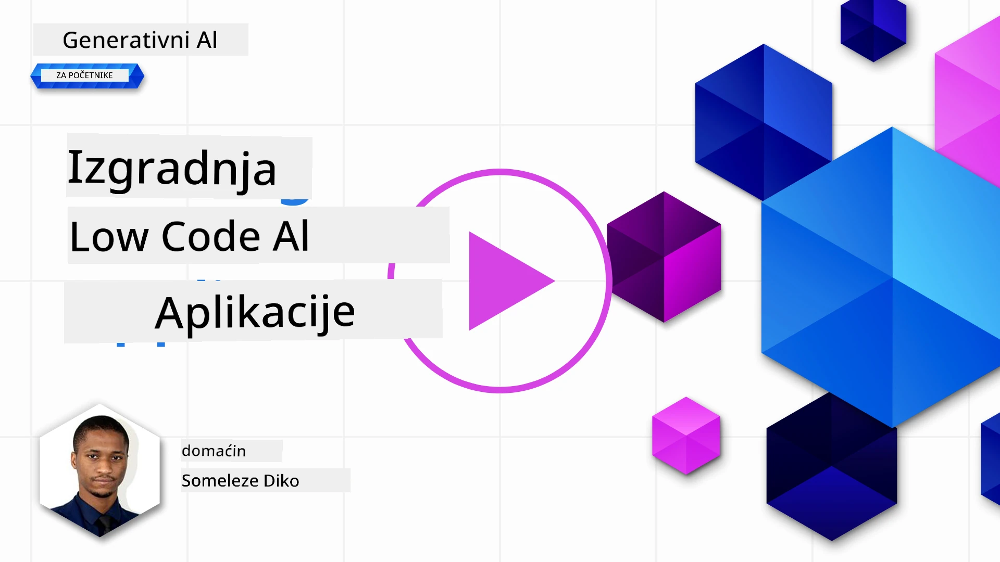](https://youtu.be/1vzq3Nd8GBA?si=h6LHWJXdmqf6mhDg)

> _(Kliknite na gornju sliku za pregled video lekcije)_

## Uvod

Sada kada smo naučili kako izgraditi aplikacije za generiranje slika, razgovarajmo o low code pristupu. Generativna AI može se koristiti u različitim područjima, uključujući low code, ali što je low code i kako u njega možemo dodati AI?

Izrada aplikacija i rješenja postala je jednostavnija za tradicionalne programere i one bez iskustva u programiranju korištenjem platformi za razvoj s malo koda (Low Code Development Platforms). Platforme za razvoj s malo koda omogućuju izgradnju aplikacija i rješenja s malo ili nimalo koda. To se postiže pružanjem vizualnog razvojog okruženja koje omogućuje povuci-i-pusti komponente za izgradnju aplikacija i rješenja. Ovo omogućuje bržu izradu aplikacija i rješenja s manje resursa. U ovoj lekciji detaljno istražujemo kako koristiti low code i kako poboljšati razvoj s malo koda pomoću AI koristeći Power Platform.

Power Platform pruža organizacijama priliku da osnaže svoje timove da sami grade rješenja kroz intuitivno okruženje s malo koda ili bez koda. Ovo okruženje pojednostavljuje proces izgradnje rješenja. S Power Platformom, rješenja se mogu izgraditi u danima ili tjednima umjesto mjesecima ili godinama. Power Platform sastoji se od pet ključnih proizvoda: Power Apps, Power Automate, Power BI, Power Pages i Copilot Studio.

Ova lekcija pokriva:

- Uvod u generativnu AI u Power Platform
- Uvod u Copilot i kako ga koristiti
- Korištenje generativne AI za izradu aplikacija i tijekova u Power Platform
- Razumijevanje AI modela u Power Platform pomoću AI Buildera
- Izrada inteligentnih agenata s Microsoft Copilot Studiom

## Ciljevi učenja

Do kraja ove lekcije moći ćete:

- Razumjeti kako Copilot radi u Power Platform.

- Izgraditi aplikaciju za praćenje školskih zadataka za naš start-up u obrazovanju.

- Izgraditi tijek za obradu računa koji koristi AI za izvlačenje informacija iz računa.

- Primijeniti najbolje prakse pri korištenju AI modela Create Text with GPT.

- Shvatiti što je Microsoft Copilot Studio i kako s njim izraditi inteligentne agente.

Alati i tehnologije koje ćete koristiti u ovoj lekciji su:

- **Power Apps**, za aplikaciju Student Assignment Tracker, koja pruža razvojno okruženje s malo koda za izgradnju aplikacija koje prate, upravljaju i komuniciraju s podacima.

- **Dataverse**, za pohranu podataka aplikacije Student Assignment Tracker gdje Dataverse pruža platformu s malo koda za pohranu podataka aplikacije.

- **Power Automate**, za tijek obrade računa gdje imate razvojno okruženje s malo koda za izradu tijekova rada koji automatiziraju proces obrade računa.

- **AI Builder**, za AI model obrade računa gdje ćete koristiti unaprijed izgrađene AI modele za obradu računa za naš start-up.

## Generativna AI u Power Platform

Unapređenje razvoja i aplikacija s malo koda generativnom AI ključan je fokus Power Platform. Cilj je omogućiti svima izradu aplikacija, web-mjesta, nadzornih ploča i automatizaciju procesa pomoću AI-a, _bez potrebe za stručnjacima za podatkovnu znanost_. Ovaj cilj postiže se integriranjem generativne AI u iskustvo razvoja s malo koda u Power Platformu u obliku Copilota i AI Buildera.

### Kako to funkcionira?

Copilot je AI asistent koji vam omogućuje izgradnju rješenja u Power Platformu opisivanjem vaših zahtjeva kroz niz konverzacijskih koraka koristeći prirodni jezik. Na primjer, možete zatražiti od AI asistenta da navede koja polja će vaša aplikacija koristiti i on će stvoriti i aplikaciju i osnovni podatkovni model, ili možete specificirati kako postaviti tijek u Power Automate.

Copilot-driven funkcionalnosti možete koristiti kao značajku na zaslonima aplikacije kako biste korisnicima omogućili otkrivanje uvida putem konverzacijskih interakcija.

AI Builder je AI mogućnost s malo koda dostupna u Power Platform koja vam omogućuje korištenje AI modela za automatizaciju procesa i predviđanje ishoda. S AI Builderom možete donijeti AI u svoje aplikacije i tijekove koji se povezuju s podacima u Dataverseu ili u različitim oblačnim izvorima podataka, kao što su SharePoint, OneDrive ili Azure.

Copilot je dostupan u svim proizvodima Power Platforme: Power Apps, Power Automate, Power BI, Power Pages i Copilot Studio (ranije Power Virtual Agents). AI Builder je dostupan u Power Apps i Power Automate. U ovoj lekciji usredotočit ćemo se na korištenje Copilota i AI Buildera u Power Apps i Power Automate kako bismo izgradili rješenje za naš start-up u obrazovanju.

### Copilot u Power Apps

Kao dio Power Platforme, Power Apps pruža razvojno okruženje s malo koda za izgradnju aplikacija za praćenje, upravljanje i interakciju s podacima. To je skup usluga za razvoj aplikacija s skalabilnom podatkovnom platformom i mogućnošću povezivanja na oblačne usluge i lokalne podatke. Power Apps omogućuje izgradnju aplikacija koje se mogu koristiti u preglednicima, na tabletima i telefonima, te se dijele s kolegama. Power Apps olakšava korisnicima izradu aplikacija putem jednostavnog sučelja, tako da svaki poslovni korisnik ili profesionalni programer može izraditi prilagođene aplikacije. Iskustvo razvoja aplikacija dodatno je unaprijeđeno generativnom AI putem Copilota.

Značajka AI asistenta Copilota u Power Apps omogućuje vam da opišete kakvu aplikaciju trebate i koje informacije želite da aplikacija prati, prikuplja ili prikazuje. Copilot zatim generira responzivnu Canvas aplikaciju na osnovi vašeg opisa. Nakon toga možete prilagoditi aplikaciju prema svojim potrebama. AI Copilot također generira i predlaže Dataverse tablicu s poljima potrebnim za pohranu podataka koje želite pratiti, uključujući i neke primjere podataka. O Dataverseu ćemo kasnije u ovoj lekciji saznati više i kako ga koristiti u Power Apps. Tablicu možete zatim prilagoditi prema svojim potrebama koristeći AI Copilot asistenta kroz konverzacijske korake. Ova značajka je lako dostupna s početnog zaslona Power Apps.

### Copilot u Power Automate

Kao dio Power Platforme, Power Automate omogućuje korisnicima izradu automatiziranih tijekova između aplikacija i usluga. Pomaže automatizirati ponavljajuće poslovne procese poput komunikacije, prikupljanja podataka i odobrenja odluka. Njegovo jednostavno sučelje omogućuje korisnicima svih tehničkih razina (od početnika do iskusnih programera) automatizaciju radnih zadataka. Iskustvo razvoja tijekova dodatno je unaprijeđeno generativnom AI putem Copilota.

Značajka AI asistenta Copilota u Power Automate omogućuje vam da opišete kakav tijek trebate i koje radnje želite da tijek izvrši. Copilot zatim generira tijek na osnovi vašeg opisa. Nakon toga možete prilagoditi tijek prema svojim potrebama. AI Copilot također generira i predlaže radnje potrebne za izvršenje zadanog zadatka automatizacije. O tijekovima i njihovoj upotrebi u Power Automate saznat ćemo više kasnije u ovoj lekciji. Radnje možete prilagoditi prema svojim potrebama koristeći AI Copilot asistenta kroz konverzacijske korake. Ova značajka lako je dostupna s početnog zaslona Power Automate.

## Izrada inteligentnih agenata s Microsoft Copilot Studiom

[Microsoft Copilot Studio](https://learn.microsoft.com/microsoft-copilot-studio/fundamentals-what-is-copilot-studio?WT.mc_id=academic-105485-koreyst) (ranije Power Virtual Agents) je član Power Platforme s malo koda za izradu **AI agenata** — konverzacijskih copilota koji mogu odgovarati na pitanja, poduzeti radnje i automatizirati zadatke u ime vaših korisnika. Kao i ostatak Power Platforme, ove agente izrađujete u vizualnom, prirodnim jezikom vođenom iskustvu: opisujete što želite da agent radi, a Copilot Studio pomaže u oblikovanju njegovih uputa, znanja i radnji.

Za naš start-up u obrazovanju, mogli biste izraditi agenta koji odgovara na studentska pitanja o tečajevima, provjerava rokove zadataka i čak šalje e-poštu nastavniku — sve bez pisanja koda.

Evo nekih od najnovijih mogućnosti koje postaju Copilot Studio moćnim:

- **Generativni odgovori iz vašeg znanja**. Umjesto ručnog kreiranja svakog razgovora, možete povezati **izvore znanja** — javne web stranice, SharePoint, OneDrive, Dataverse, prenesene datoteke ili poslovne podatke preko konektora — i agent generira utemeljene odgovore iz njih.

- **Generativna orkestracija**. Umjesto oslanjanja na rigidne okidačke fraze, agent koristi AI za razumijevanje zahtjeva i dinamički odlučuje koje znanje, teme i radnje kombinirati za izvršenje, uključujući povezivanje nekoliko koraka zajedno.

- **Radnje i konektori**. Agenti mogu *izvoditi* radnje, ne samo razgovarati. Možete im dati radnje poduprte s preko 1.500 unaprijed izgrađenih Power Platform konektora, Power Automate tijekova, prilagođenih REST API-ja, upita ili **Model Context Protocol (MCP)** poslužitelja.

- **Autonomni agenti**. Agenti nisu ograničeni na odgovaranje u chat prozoru. Možete izgraditi **autonomne agente** kojima se okidači događaju događajima — poput nove e-pošte, novog zapisa u Dataverseu ili prijenosa datoteke — i koji zatim u pozadini izvršavaju zadatak.

- **Orkestracija više agenata**. Agenti mogu pozivati druge agente. Copilot Studio agent može prepustiti ili biti proširen drugim agentima, uključujući agente objavljene u Microsoft 365 Copilotu i agente izgrađene u Microsoft Foundry.

- **Izbor modela**. Osim ugrađenih modela, možete koristiti modele iz Microsoft Foundry kataloga modela da prilagodite način na koji vaš agent razmišlja i odgovara.

- **Objavljivanje bilo gdje**. Nakon izgradnje, agent se može objaviti na više kanala — Microsoft Teams, Microsoft 365 Copilot, web stranici ili prilagođenoj aplikaciji i drugdje — s upravljanjem sigurnosti, autentifikacijom i analizom kroz administrativno sučelje Power Platforme.

Možete započeti izradu svog prvog agenta na [copilotstudio.microsoft.com](https://copilotstudio.microsoft.com?WT.mc_id=academic-105485-koreyst) i saznati više u [dokumentaciji Microsoft Copilot Studija](https://learn.microsoft.com/microsoft-copilot-studio/?WT.mc_id=academic-105485-koreyst).

## Zadatak: Upravljanje studentskim zadacima i računima za naš start-up koristeći Copilot

Naš start-up nudi online tečajeve studentima. Start-up je brzo rastao i sada mu je teško pratiti potražnju za tečajevima. Angažirali su vas kao Power Platform programera da im pomognete izgraditi rješenje s malo koda za upravljanje zadacima studenata i računima. Rješenje bi trebalo omogućiti praćenje i upravljanje studentskim zadacima putem aplikacije te automatizirati proces obrade računa putem tijekova rada. Zamolili su vas da koristite generativnu AI za razvoj rješenja.

Kada počinjete koristiti Copilot, možete koristiti [Power Platform Copilot Prompt Library](https://github.com/pnp/powerplatform-prompts?WT.mc_id=academic-109639-somelezediko) za početak s upitima. Ova biblioteka sadrži popis upita koje možete koristiti za izgradnju aplikacija i tijekova s Copilotom. Također možete koristiti upite u biblioteci da dobijete ideju kako opisati svoje zahtjeve Copilotu.

### Izradite aplikaciju Student Assignment Tracker za naš start-up

Nastavnici u našem start-upu imaju problema s praćenjem studentskih zadataka. Koristili su tablicu za praćenje zadataka, ali to je postalo teško upravljati kako se broj studenata povećao. Zamolili su vas da izgradite aplikaciju koja će im pomoći pratiti i upravljati studentskim zadatcima. Aplikacija bi trebala omogućiti dodavanje novih zadataka, pregled zadataka, ažuriranje zadataka i brisanje zadataka. Također bi trebala omogućiti nastavnicima i studentima pregled zadataka koji su ocijenjeni i onih koji nisu ocijenjeni.

Aplikaciju ćete izgraditi koristeći Copilot u Power Apps slijedeći upute u nastavku:

1. Idite na [Power Apps](https://make.powerapps.com?WT.mc_id=academic-105485-koreyst) početni zaslon.

1. Koristite tekstni prostor na početnom zaslonu da opišete aplikaciju koju želite izgraditi. Na primjer, **_Želim izgraditi aplikaciju za praćenje i upravljanje studentskim zadacima_**. Kliknite na gumb **Pošalji** da pošaljete upit AI Copilotu.

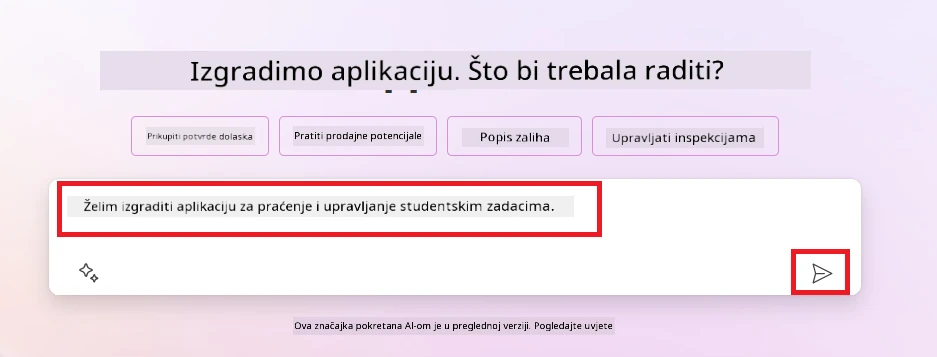

1. AI Copilot će predložiti Dataverse tablicu s poljima potrebnim za pohranu podataka koje želite pratiti i s nekim primjerima podataka. Tablicu zatim možete prilagoditi prema svojim potrebama koristeći AI Copilot asistenta kroz konverzacijske korake.

   > **Važno**: Dataverse je osnovna podatkovna platforma Power Platforme. To je platforma s malo koda za pohranu podataka aplikacije. To je potpuno upravljana usluga koja sigurno pohranjuje podatke u Microsoft oblaku i dostupna je unutar vašeg Power Platform okruženja. Dolazi s ugrađenim mogućnostima upravljanja podacima, poput klasifikacije podataka, praćenja podrijetla podataka, precizne kontrole pristupa i još mnogo toga. Više o Dataverseu možete saznati [ovdje](https://docs.microsoft.com/powerapps/maker/data-platform/data-platform-intro?WT.mc_id=academic-109639-somelezediko).

   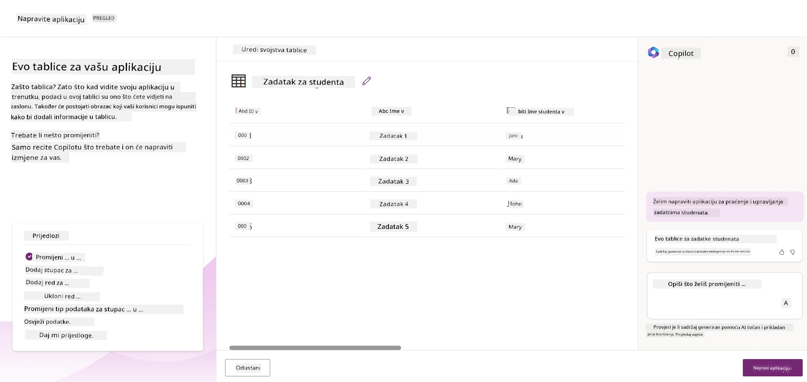

1. Nastavnici žele slati e-poruke studentima koji su predali zadatke kako bi ih obavijestili o napretku njihovih zadataka. Možete koristiti Copilot da dodate novo polje u tablicu za pohranu e-adresa studenata. Na primjer, možete upotrijebiti sljedeći upit za dodavanje novog polja u tablicu: **_Želim dodati stupac za pohranu studentske e-pošte_**. Kliknite na gumb **Pošalji** da pošaljete upit AI Copilotu.

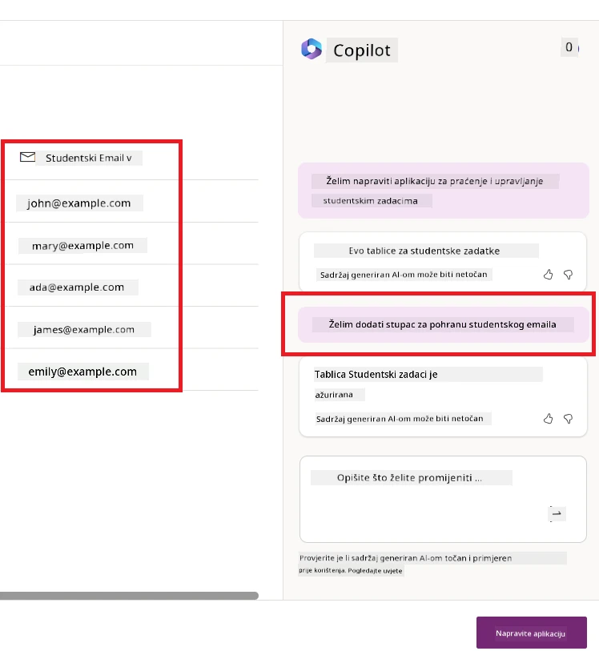

1. AI Copilot će generirati novo polje, a zatim ga možete prilagoditi kako bi odgovarao vašim potrebama.

1. Kada završite s tablicom, kliknite na gumb **Create app** za stvaranje aplikacije.

1. AI Copilot će generirati responzivnu Canvas aplikaciju na temelju vašeg opisa. Zatim možete prilagoditi aplikaciju prema svojim potrebama.

1. Za nastavnike koji žele slati e-poštu učenicima, možete koristiti Copilot za dodavanje novog zaslona u aplikaciju. Na primjer, možete koristiti sljedeći upit za dodavanje novog zaslona u aplikaciju: **_I want to add a screen to send emails to students_**. Kliknite na gumb **Send** da pošaljete upit AI Copilotu.

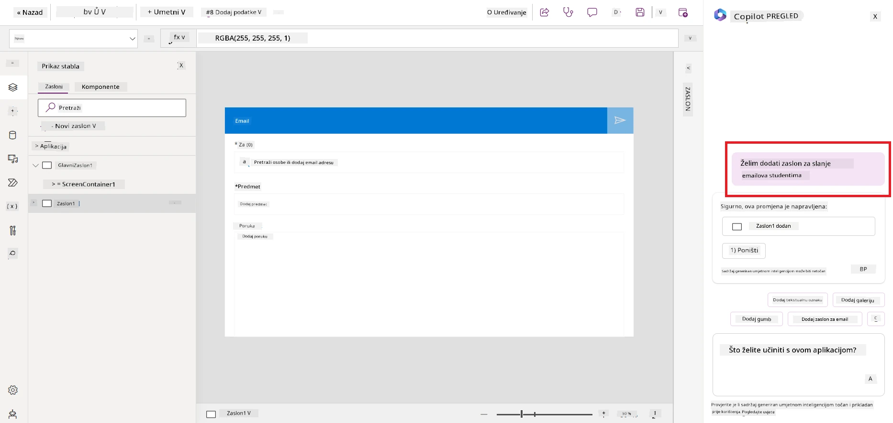

1. AI Copilot će generirati novi zaslon i zatim ga možete prilagoditi kako bi odgovarao vašim potrebama.

1. Kada završite s aplikacijom, kliknite na gumb **Save** za spremanje aplikacije.

1. Za dijeljenje aplikacije s nastavnicima, kliknite na gumb **Share**, a zatim ponovo kliknite na gumb **Share**. Zatim možete podijeliti aplikaciju s nastavnicima unošenjem njihovih e-mail adresa.

> **Vaš domaći zadatak**: Aplikacija koju ste upravo izgradili dobar je početak, ali može se poboljšati. Uz funkciju e-pošte, nastavnici mogu slati e-poruke učenicima samo ručno, morajući unositi njihove e-mail adrese. Možete li koristiti Copilot za izgradnju automatizacije koja će omogućiti nastavnicima da automatski šalju e-poštu učenicima kada predaju svoje zadatke? Vaš savjet je da s pravim upitom možete koristiti Copilot u Power Automate za to.

### Izradite tablicu podataka o računima za naš startup

Financijski tim našeg startupa imao je problema s praćenjem računa. Koristili su proračunsku tablicu za praćenje računa, ali to je postalo teško za upravljanje kako se broj računa povećavao. Zamolili su vas da izradite tablicu koja će im pomoći pohraniti, pratiti i upravljati informacijama o primljenim računima. Tablica bi trebala služiti za izgradnju automatizacije koja će izvući sve informacije o računima i pohraniti ih u tablicu. Također, tablica bi trebala omogućiti financijskom timu pregled računa koji su plaćeni i onih koji nisu.

Power Platforma ima osnovnu podatkovnu platformu zvanu Dataverse koja vam omogućuje pohranu podataka za vaše aplikacije i rješenja. Dataverse pruža platformu s malo koda za pohranu podataka aplikacije. To je potpuno upravljana usluga koja sigurno pohranjuje podatke u Microsoftovom oblaku i postavljena je unutar vaše Power Platform okoline. Dolazi s ugrađenim mogućnostima upravljanja podacima, poput klasifikacije podataka, praćenja podataka, precizne kontrole pristupa i drugih. Više možete saznati [o Dataverse ovdje](https://docs.microsoft.com/powerapps/maker/data-platform/data-platform-intro?WT.mc_id=academic-109639-somelezediko).

Zašto bismo trebali koristiti Dataverse za naš startup? Standardne i prilagođene tablice unutar Dataverse pružaju sigurnu i oblačnu opciju pohrane za vaše podatke. Tablice vam omogućuju pohranu različitih tipova podataka, slično kao što biste mogli koristiti više radnih listova u jednoj Excel radnoj knjizi. Možete koristiti tablice za pohranu podataka specifičnih za vašu organizaciju ili poslovne potrebe. Neke od prednosti koje će naš startup imati korištenjem Dataverse uključuju, ali nisu ograničene na:

- **Jednostavno za upravljanje**: Metadata i podaci pohranjuju se u oblaku, tako da ne morate brinuti o detaljima kako su pohranjeni ili upravljani. Možete se usredotočiti na izgradnju vaših aplikacija i rješenja.

- **Sigurno**: Dataverse pruža sigurnu i oblačnu opciju pohrane za vaše podatke. Možete kontrolirati tko ima pristup podacima u vašim tablicama i kako ih mogu koristiti koristeći sigurnost baziranu na ulogama.

- **Bogata metadata**: Tipovi podataka i odnosi direktno se koriste u Power Apps

- **Logika i validacija**: Možete koristiti poslovna pravila, izračunate stupce i pravila validacije za provođenje poslovne logike i održavanje točnosti podataka.

Sada kada znate što je Dataverse i zašto ga trebate koristiti, pogledajmo kako možete koristiti Copilot za izradu tablice u Dataverse koja će zadovoljiti zahtjeve našeg financijskog tima.

> **Napomena** : Ovu tablicu ćete koristiti u sljedećem dijelu za izgradnju automatizacije koja će izvući sve informacije o računima i pohraniti ih u tablicu.

Za izradu tablice u Dataverse koristeći Copilot, slijedite korake u nastavku:

1. Otvorite [Power Apps](https://make.powerapps.com?WT.mc_id=academic-105485-koreyst) početni zaslon.

2. Na lijevoj navigacijskoj traci odaberite **Tables**, a zatim kliknite na **Describe the new Table**.

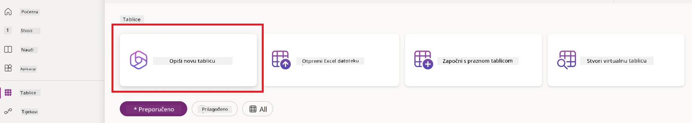

1. Na zaslonu **Describe the new Table** koristite tekstualni okvir za opis tablice koju želite napraviti. Na primjer, **_I want to create a table to store invoice information_**. Kliknite na gumb **Send** da pošaljete upit AI Copilotu.

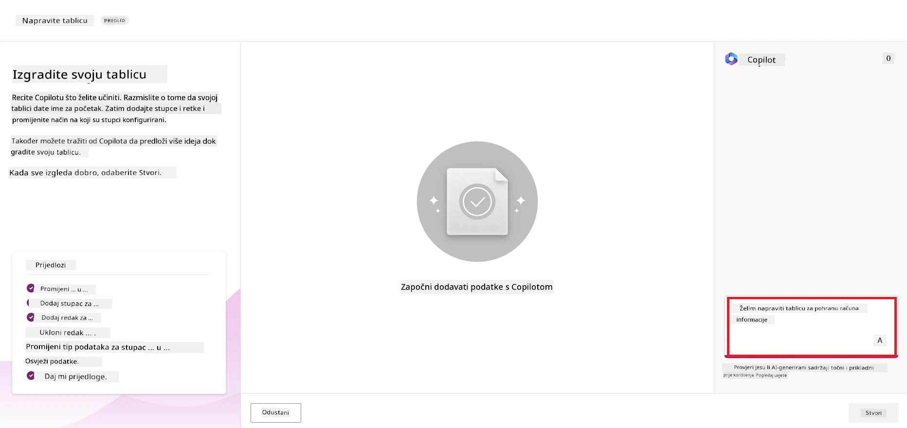

1. AI Copilot će predložiti Dataverse tablicu s poljima koje trebate za pohranu podataka koje želite pratiti, zajedno s primjerom podataka. Zatim možete prilagoditi tablicu prema vašim potrebama koristeći funkciju AI Copilota kroz konverzacijske korake.

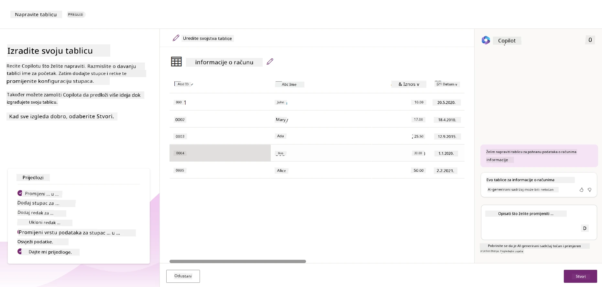

1. Financijski tim želi poslati e-poštu dobavljaču da ga obavijesti o trenutnom statusu njihovog računa. Možete koristiti Copilot za dodavanje novog polja u tablicu za pohranu e-mail adrese dobavljača. Na primjer, možete koristiti sljedeći upit za dodavanje novog stupca u tablicu: **_I want to add a column to store supplier email_**. Kliknite na gumb **Send** da pošaljete upit AI Copilotu.

1. AI Copilot će generirati novo polje i onda ga možete prilagoditi prema vašim potrebama.

1. Kada završite s tablicom, kliknite na gumb **Create** za izradu tablice.

## AI modeli u Power Platformi s AI Builderom

AI Builder je AI mogućnost s malo koda dostupna u Power Platformi koja vam omogućuje korištenje AI modela za automatizaciju procesa i predviđanje ishoda. Uz AI Builder možete uključiti AI u vaše aplikacije i tokove rada koji se povezuju s podacima u Dataverse ili u raznim oblačnim izvorima podataka, poput SharePointa, OneDrivea ili Azurea.

## Gotovi AI modeli vs. Prilagođeni AI modeli

AI Builder pruža dvije vrste AI modela: Gotove AI modele i Prilagođene AI modele. Gotovi AI modeli su spremni za upotrebu, trenirani od strane Microsofta i dostupni u Power Platformi. Oni vam pomažu dodati inteligenciju u vaše aplikacije i tokove rada bez potrebe za prikupljanjem podataka i izradom, treniranjem i objavljivanjem vlastitih modela. Ove modele možete koristiti za automatizaciju procesa i predviđanje ishoda.

Neki od gotovih AI modela dostupnih u Power Platformi uključuju:

- **Ekstrakcija ključnih fraza**: Ovaj model izvlači ključne fraze iz teksta.
- **Detekcija jezika**: Ovaj model prepoznaje jezik teksta.
- **Analiza sentimenta**: Ovaj model prepoznaje pozitivan, negativan, neutralan ili miješani sentiment u tekstu.
- **Čitač vizitki**: Ovaj model izvlači informacije iz vizitki.
- **Prepoznavanje teksta**: Ovaj model izvlači tekst iz slika.
- **Prepoznavanje objekata**: Ovaj model prepoznaje i izvlači objekte iz slika.
- **Obrada dokumenata**: Ovaj model izvlači informacije iz obrazaca.
- **Obrada računa**: Ovaj model izvlači informacije iz računa.

S prilagođenim AI modelima možete unijeti vlastiti model u AI Builder tako da može funkcionirati kao bilo koji prilagođeni model iz AI Buildera, omogućujući vam treniranje modela korištenjem vlastitih podataka. Ove modele možete koristiti za automatizaciju procesa i predviđanje ishoda u Power Apps i Power Automate. Pri korištenju vlastitog modela postoje primjenjiva ograničenja. Više o njima pročitajte [ovdje](https://learn.microsoft.com/ai-builder/byo-model#limitations?WT.mc_id=academic-105485-koreyst).

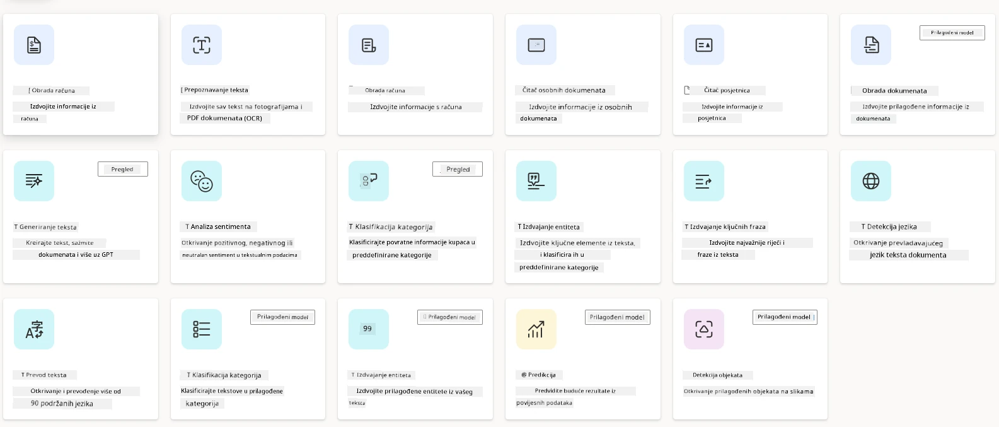

## Zadatak #2 - Izradite tok obrade računa za naš startup

Financijski tim ima poteškoće s obradom računa. Koristili su proračunsku tablicu za praćenje računa, ali to je postalo teško za upravljanje kako je broj računa rastao. Zamolili su vas da izradite tijek rada koji će im pomoći obraditi račune korištenjem AI. Tijek rada treba omogućiti izvlačenje informacija iz računa i pohranu tih informacija u Dataverse tablicu. Također, treba im omogućiti slanje e-pošte financijskom timu s izvučenim informacijama.

Sada kada znate što je AI Builder i zašto ga koristiti, pogledajmo kako možete upotrijebiti AI model za obradu računa u AI Builderu, koji smo ranije spomenuli, za izgradnju tijeka rada koji će pomoći financijskom timu obraditi račune.

Za izradu tijeka rada koji će pomoći financijskom timu u obradi računa koristeći AI model za obradu računa u AI Builderu, slijedite ove korake:

1. Otvorite [Power Automate](https://make.powerautomate.com?WT.mc_id=academic-105485-koreyst) početni zaslon.

2. Koristite tekstualni okvir na početnom zaslonu za opis tijeka rada koji želite izgraditi. Na primjer, **_Process an invoice when it arrives in my mailbox_**. Kliknite na gumb **Send** da pošaljete upit AI Copilotu.

   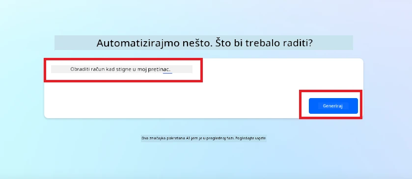

3. AI Copilot će predložiti korake koje trebate poduzeti za zadatak koji želite automatizirati. Možete kliknuti na gumb **Next** da prođete kroz sljedeće korake.

4. U sljedećem koraku, Power Automate će tražiti da postavite potrebne veze za tok rada. Kada završite, kliknite na gumb **Create flow** za stvaranje toka rada.

5. AI Copilot će generirati tok rada i zatim ga možete prilagoditi prema svojim potrebama.

6. Ažurirajte okidač toka rada i postavite **Folder** na mapu gdje će računi biti pohranjeni. Na primjer, postavite mapu na **Inbox**. Kliknite na **Show advanced options** i postavite **Only with Attachments** na **Yes**. Ovo osigurava da tok rada radi samo kada se u mapu primi e-pošta s privitkom.

7. Uklonite sljedeće korake iz toka rada: **HTML to text**, **Compose**, **Compose 2**, **Compose 3** i **Compose 4** jer ih nećete koristiti.

8. Uklonite korak **Condition** iz toka jer ga nećete koristiti. Trebalo bi izgledati kao na sljedećoj snimci zaslona:

   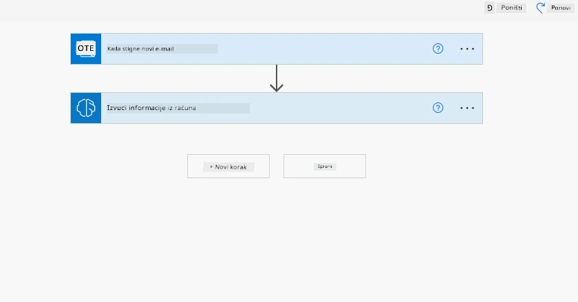

9. Kliknite na gumb **Add an action** i potražite **Dataverse**. Odaberite akciju **Add a new row**.

10. U akciji **Extract Information from invoices**, ažurirajte **Invoice File** da pokazuje na **Attachment Content** iz e-pošte. Ovo osigurava da tok izvlači informacije iz privitka računa.

11. Odaberite tablicu koju ste ranije izradili. Na primjer, možete odabrati tablicu **Invoice Information**. Izaberite dinamički sadržaj iz prethodne akcije za popunjavanje sljedećih polja:

    - ID
    - Iznos
    - Datum
    - Naziv
    - Status - Postavite **Status** na **Pending** (Na čekanju).
    - Supplier Email - Koristite dinamički sadržaj **From** iz okidača **When a new email arrives**.

    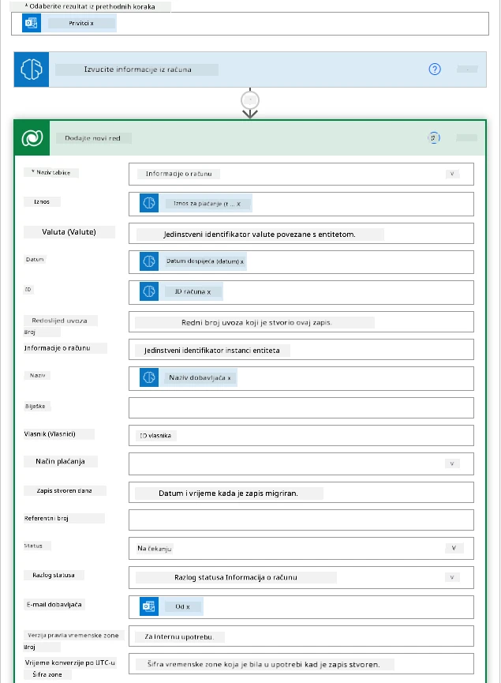

12. Kada završite s tokom, kliknite na gumb **Save** za spremanje toka. Zatim možete testirati tok slanjem e-pošte s računom u mapu koju ste naveli u okidaču.

> **Vaš domaći zadatak**: Tok koji ste upravo izgradili dobar je početak, sada morate razmisliti kako možete izraditi automatizaciju koja će našem financijskom timu omogućiti slanje e-pošte dobavljaču s ažuriranjem trenutnog statusa njihovog računa. Vaš savjet: tok se mora pokrenuti kada se status računa promijeni.

## Upotreba AI modela za generiranje teksta u Power Automate

AI model Create Text with GPT u AI Builderu omogućuje vam generiranje teksta na temelju upita, a pokreće ga Microsoft Azure OpenAI Service. Uz ovu mogućnost možete uključiti GPT (Generative Pre-Trained Transformer) tehnologiju u svoje aplikacije i tokove rada za izradu različitih automatiziranih tijekova i informativnih aplikacija.

GPT modeli prolaze kroz opsežnu obuku na ogromnim količinama podataka, što im omogućuje generiranje teksta koji je vrlo sličan ljudskom jeziku kada im se postavi upit. Kada se integriraju s automatizacijom tijekova rada, AI modeli poput GPT mogu se koristiti za pojednostavljenje i automatizaciju širokog spektra zadataka.

Na primjer, možete izraditi tokove koji automatski generiraju tekst za različite potrebe, poput: nacrta e-pošte, opisa proizvoda i slično. Također možete koristiti model za generiranje teksta za razne aplikacije, poput chatbotova i aplikacija za korisničku podršku koje omogućuju agentima korisničke podrške da učinkovito i brzo odgovaraju na upite korisnika.

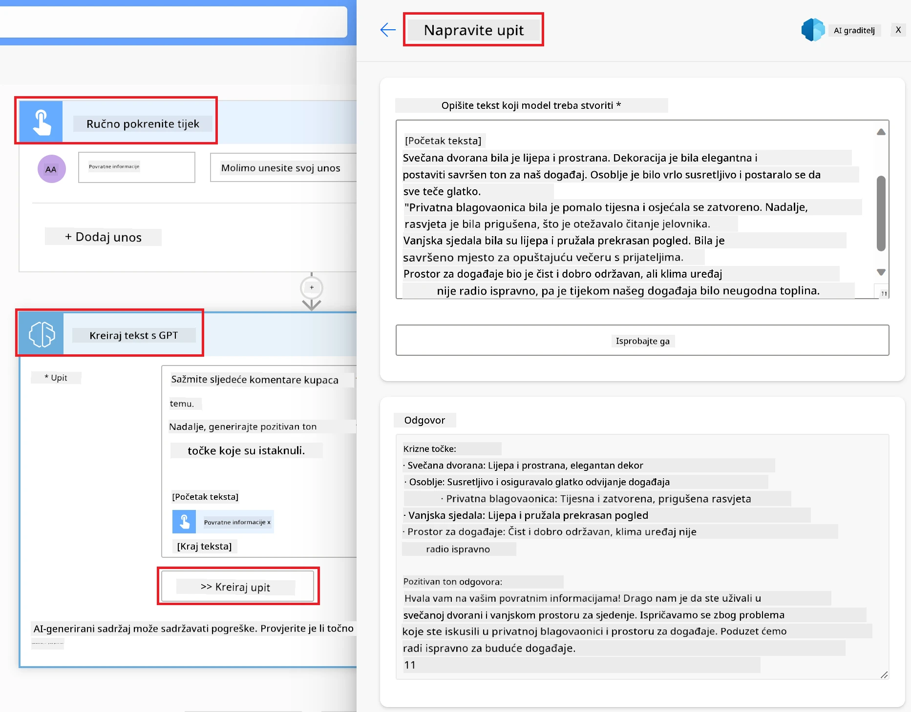

Za učenje kako koristiti ovaj AI model u Power Automate, proučite modul [Dodajte inteligenciju s AI Builder i GPT](https://learn.microsoft.com/training/modules/ai-builder-text-generation/?WT.mc_id=academic-109639-somelezediko).

## Sjajan posao! Nastavite s učenjem

Nakon dovršetka ove lekcije, pogledajte našu [kolekciju Generative AI Learning](https://aka.ms/genai-collection?WT.mc_id=academic-105485-koreyst) da nastavite unapređivati svoje znanje o Generativnoj AI!

Želite li prilagoditi i izvući više iz Copilota? Istražite [Awesome Copilot](https://github.com/github/awesome-copilot?WT.mc_id=academic-105485-koreyst) — kolekciju uputa, agenata, vještina i konfiguracija koje je pridonijela zajednica, kako biste što bolje iskoristili GitHub Copilot.

Uputite se na Lekciju 11 gdje ćemo pogledati kako [integrirati Generativnu AI s Function Calling](../11-integrating-with-function-calling/README.md?WT.mc_id=academic-105485-koreyst)!

---

<!-- CO-OP TRANSLATOR DISCLAIMER START -->
**Napomena**:
Ovaj dokument je preveden korištenjem AI prevoditeljskog servisa [Co-op Translator](https://github.com/Azure/co-op-translator). Iako težimo točnosti, imajte na umu da automatski prijevodi mogu sadržavati greške ili netočnosti. Izvorni dokument na izvornom jeziku treba smatrati autoritativnim izvorom. Za važne informacije preporuča se profesionalni ljudski prijevod. Nismo odgovorni za bilo kakva nesporazumevanja ili pogrešne interpretacije koje proizlaze iz korištenja ovog prijevoda.
<!-- CO-OP TRANSLATOR DISCLAIMER END -->