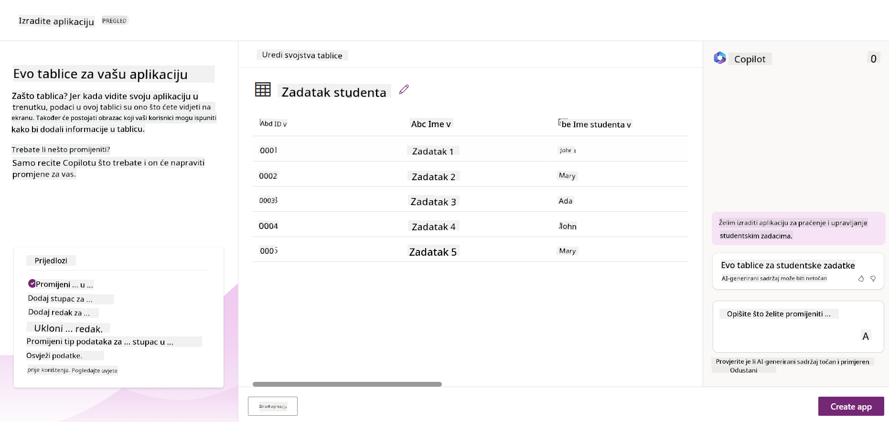
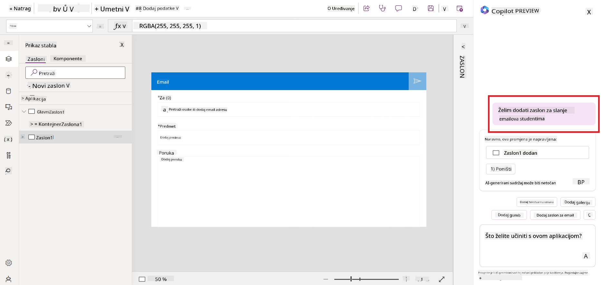
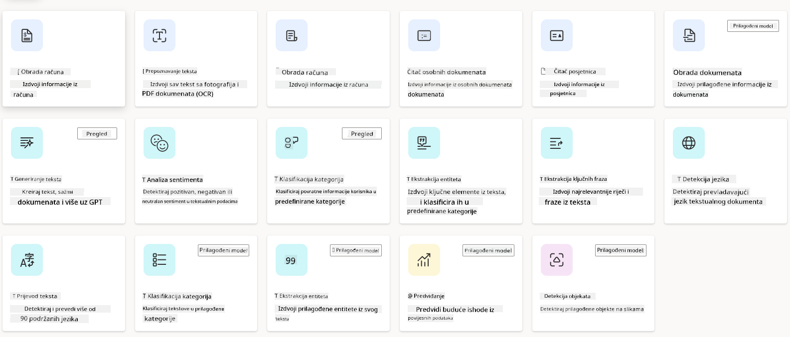
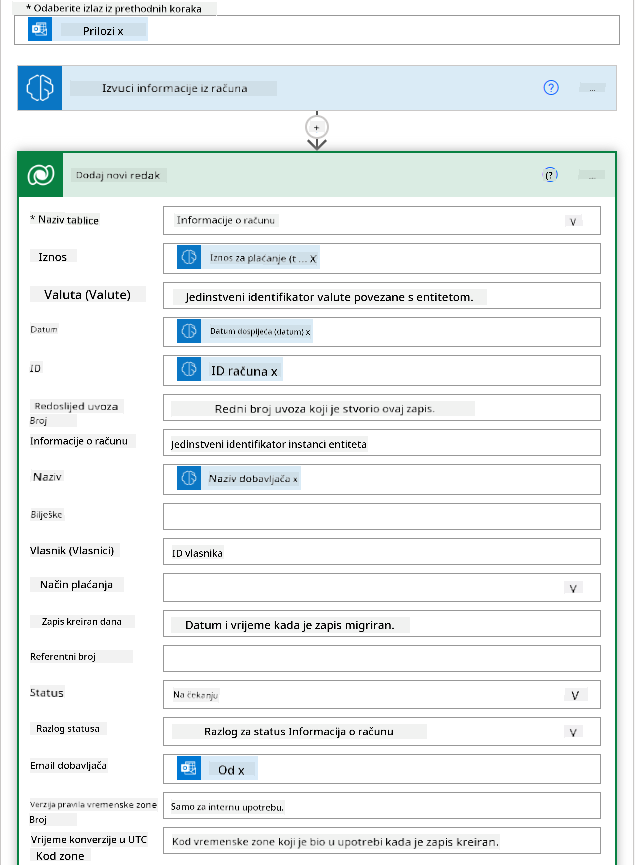

<!--
CO_OP_TRANSLATOR_METADATA:
{
  "original_hash": "f5ff3b6204a695a117d6f452403c95f7",
  "translation_date": "2025-07-09T14:16:13+00:00",
  "source_file": "10-building-low-code-ai-applications/README.md",
  "language_code": "hr"
}
-->
# Izgradnja Low Code AI Aplikacija

> _(Kliknite na gornju sliku za pregled videa ove lekcije)_

## Uvod

Sada kada smo naučili kako izgraditi aplikacije za generiranje slika, razgovarajmo o low code pristupu. Generativna AI može se koristiti u različitim područjima, uključujući low code, ali što je low code i kako možemo dodati AI u njega?

Izrada aplikacija i rješenja postala je jednostavnija za tradicionalne programere i neprogramere zahvaljujući Low Code Development Platformama. Low Code Development Platforme omogućuju vam izradu aplikacija i rješenja s malo ili bez koda. To se postiže pružanjem vizualnog razvojog okruženja koje vam omogućuje povlačenje i ispuštanje komponenti za izgradnju aplikacija i rješenja. Time se omogućuje brža izrada aplikacija i rješenja uz manje resursa. U ovoj lekciji detaljno ćemo istražiti kako koristiti Low Code i kako unaprijediti low code razvoj pomoću AI koristeći Power Platform.

Power Platform pruža organizacijama priliku da osnaže svoje timove za izradu vlastitih rješenja kroz intuitivno low-code ili no-code okruženje. Ovo okruženje pojednostavljuje proces izrade rješenja. Uz Power Platform, rješenja se mogu izraditi u danima ili tjednima umjesto mjesecima ili godinama. Power Platform se sastoji od pet ključnih proizvoda: Power Apps, Power Automate, Power BI, Power Pages i Copilot Studio.

Ova lekcija obuhvaća:

- Uvod u Generativnu AI u Power Platformi  
- Uvod u Copilot i kako ga koristiti  
- Korištenje Generativne AI za izradu aplikacija i tokova u Power Platformi  
- Razumijevanje AI modela u Power Platformi s AI Builderom  

## Ciljevi učenja

Do kraja ove lekcije moći ćete:

- Razumjeti kako Copilot funkcionira u Power Platformi.

- Izraditi aplikaciju za praćenje studentskih zadataka za naš startup u obrazovanju.

- Izraditi tok za obradu računa koji koristi AI za izvlačenje informacija iz računa.

- Primijeniti najbolje prakse pri korištenju Create Text s GPT AI modelom.

Alati i tehnologije koje ćete koristiti u ovoj lekciji su:

- **Power Apps**, za aplikaciju Student Assignment Tracker, koja pruža low-code razvojno okruženje za izradu aplikacija za praćenje, upravljanje i interakciju s podacima.

- **Dataverse**, za pohranu podataka aplikacije Student Assignment Tracker gdje Dataverse pruža low-code podatkovnu platformu za pohranu podataka aplikacije.

- **Power Automate**, za tok obrade računa gdje ćete imati low-code razvojno okruženje za izradu tijekova rada za automatizaciju procesa obrade računa.

- **AI Builder**, za AI model obrade računa gdje ćete koristiti unaprijed izrađene AI modele za obradu računa za naš startup.

## Generativna AI u Power Platformi

Unapređenje low-code razvoja i aplikacija generativnom AI-jem ključni je fokus Power Platforme. Cilj je omogućiti svima izradu AI-pokretanih aplikacija, web stranica, nadzornih ploča i automatizaciju procesa pomoću AI-ja, _bez potrebe za stručnim znanjem iz područja znanosti o podacima_. Taj cilj se postiže integracijom generativne AI u low-code razvojno iskustvo u Power Platformi u obliku Copilota i AI Buildera.

### Kako to funkcionira?

Copilot je AI asistent koji vam omogućuje izradu Power Platform rješenja opisivanjem vaših zahtjeva kroz niz konverzacijskih koraka koristeći prirodni jezik. Na primjer, možete uputiti AI asistenta da navede koja polja vaša aplikacija treba koristiti i on će kreirati i aplikaciju i temeljni podatkovni model ili možete specificirati kako postaviti tok u Power Automate.

Copilot-ove funkcionalnosti možete koristiti kao značajku u zaslonima vaše aplikacije kako biste korisnicima omogućili otkrivanje uvida kroz konverzacijske interakcije.

AI Builder je low-code AI mogućnost dostupna u Power Platformi koja vam omogućuje korištenje AI modela za automatizaciju procesa i predviđanje ishoda. S AI Builderom možete donijeti AI u svoje aplikacije i tokove koji se povezuju s vašim podacima u Dataverseu ili u raznim oblačnim izvorima podataka, poput SharePointa, OneDrivea ili Azurea.

Copilot je dostupan u svim proizvodima Power Platforme: Power Apps, Power Automate, Power BI, Power Pages i Power Virtual Agents. AI Builder je dostupan u Power Apps i Power Automate. U ovoj lekciji fokusirat ćemo se na korištenje Copilota i AI Buildera u Power Apps i Power Automate za izradu rješenja za naš startup u obrazovanju.

### Copilot u Power Apps

Kao dio Power Platforme, Power Apps pruža low-code razvojno okruženje za izradu aplikacija za praćenje, upravljanje i interakciju s podacima. To je skup usluga za razvoj aplikacija s skalabilnom podatkovnom platformom i mogućnošću povezivanja s oblačnim uslugama i lokalnim podacima. Power Apps vam omogućuje izradu aplikacija koje rade u preglednicima, na tabletima i telefonima, te se mogu dijeliti s kolegama. Power Apps olakšava korisnicima ulazak u razvoj aplikacija jednostavnim sučeljem, tako da svaki poslovni korisnik ili profesionalni programer može izraditi prilagođene aplikacije. Iskustvo razvoja aplikacija dodatno je unaprijeđeno generativnom AI-jem kroz Copilot.

Značajka AI asistenta Copilot u Power Apps omogućuje vam da opišete kakvu aplikaciju trebate i koje informacije želite da vaša aplikacija prati, prikuplja ili prikazuje. Copilot zatim generira responzivnu Canvas aplikaciju na temelju vašeg opisa. Nakon toga aplikaciju možete prilagoditi svojim potrebama. AI Copilot također generira i predlaže Dataverse tablicu s poljima potrebnim za pohranu podataka koje želite pratiti, kao i neke primjere podataka. U ovoj lekciji kasnije ćemo pogledati što je Dataverse i kako ga možete koristiti u Power Apps. Tablicu zatim možete prilagoditi svojim potrebama koristeći AI Copilot asistenta kroz konverzacijske korake. Ova značajka je lako dostupna s početnog zaslona Power Apps.

### Copilot u Power Automate

Kao dio Power Platforme, Power Automate omogućuje korisnicima stvaranje automatiziranih tijekova rada između aplikacija i usluga. Pomaže u automatizaciji ponavljajućih poslovnih procesa poput komunikacije, prikupljanja podataka i odobrenja odluka. Njegovo jednostavno sučelje omogućuje korisnicima svih tehničkih razina (od početnika do iskusnih programera) automatizaciju radnih zadataka. Iskustvo razvoja tijekova rada također je unaprijeđeno generativnom AI-jem kroz Copilot.

Značajka AI asistenta Copilot u Power Automate omogućuje vam da opišete kakav tok trebate i koje radnje želite da vaš tok izvrši. Copilot zatim generira tok na temelju vašeg opisa. Nakon toga tok možete prilagoditi svojim potrebama. AI Copilot također generira i predlaže radnje potrebne za izvršenje zadatka koji želite automatizirati. U ovoj lekciji kasnije ćemo pogledati što su tokovi i kako ih možete koristiti u Power Automate. Radnje zatim možete prilagoditi svojim potrebama koristeći AI Copilot asistenta kroz konverzacijske korake. Ova značajka je lako dostupna s početnog zaslona Power Automate.

## Zadatak: Upravljanje studentskim zadacima i računima za naš startup koristeći Copilot

Naš startup pruža online tečajeve studentima. Startup je brzo rastao i sada ima poteškoća s praćenjem potražnje za svojim tečajevima. Startup je angažirao vas kao Power Platform developera da im pomognete izraditi low code rješenje za upravljanje studentskim zadacima i računima. Njihovo rješenje treba im pomoći u praćenju i upravljanju studentskim zadacima putem aplikacije te automatizirati proces obrade računa kroz tijek rada. Zamoljeni ste da koristite Generativnu AI za razvoj rješenja.

Kada započinjete s korištenjem Copilota, možete koristiti [Power Platform Copilot Prompt Library](https://github.com/pnp/powerplatform-prompts?WT.mc_id=academic-109639-somelezediko) za početak s promptovima. Ova biblioteka sadrži popis promptova koje možete koristiti za izradu aplikacija i tokova s Copilotom. Također možete koristiti promptove iz biblioteke da dobijete ideju kako opisati svoje zahtjeve Copilotu.

### Izradite aplikaciju za praćenje studentskih zadataka za naš startup

Nastavnici u našem startupu imaju poteškoća s praćenjem studentskih zadataka. Koristili su tablicu za praćenje zadataka, ali to je postalo teško za upravljanje kako se broj studenata povećao. Zamolili su vas da izradite aplikaciju koja će im pomoći pratiti i upravljati studentskim zadacima. Aplikacija treba omogućiti dodavanje novih zadataka, pregled zadataka, ažuriranje zadataka i brisanje zadataka. Također treba omogućiti nastavnicima i studentima pregled zadataka koji su ocijenjeni i onih koji nisu ocijenjeni.

Aplikaciju ćete izraditi koristeći Copilot u Power Apps slijedeći korake u nastavku:

1. Otvorite [Power Apps](https://make.powerapps.com?WT.mc_id=academic-105485-koreyst) početni zaslon.

1. Koristite tekstualno polje na početnom zaslonu da opišete aplikaciju koju želite izraditi. Na primjer, **_Želim izraditi aplikaciju za praćenje i upravljanje studentskim zadacima_**. Kliknite na gumb **Send** da pošaljete prompt AI Copilotu.

1. AI Copilot će predložiti Dataverse tablicu s poljima potrebnim za pohranu podataka koje želite pratiti i neke primjere podataka. Tablicu zatim možete prilagoditi svojim potrebama koristeći AI Copilot asistenta kroz konverzacijske korake.

   > **Važno**: Dataverse je temeljna podatkovna platforma za Power Platformu. To je low-code podatkovna platforma za pohranu podataka aplikacije. To je potpuno upravljana usluga koja sigurno pohranjuje podatke u Microsoft Cloud i dostupna je unutar vašeg Power Platform okruženja. Dolazi s ugrađenim mogućnostima upravljanja podacima, poput klasifikacije podataka, praćenja podrijetla podataka, detaljne kontrole pristupa i više. Više o Dataverseu možete saznati [ovdje](https://docs.microsoft.com/powerapps/maker/data-platform/data-platform-intro?WT.mc_id=academic-109639-somelezediko).

   

1. Nastavnici žele slati e-poštu studentima koji su predali svoje zadatke kako bi ih obavještavali o napretku njihovih zadataka. Možete koristiti Copilot za dodavanje novog polja u tablicu za pohranu studentske e-pošte. Na primjer, možete koristiti sljedeći prompt za dodavanje novog polja u tablicu: **_Želim dodati stupac za pohranu studentske e-pošte_**. Kliknite na gumb **Send** da pošaljete prompt AI Copilotu.

1. AI Copilot će generirati novo polje koje zatim možete prilagoditi svojim potrebama.

1. Kada završite s tablicom, kliknite na gumb **Create app** za izradu aplikacije.

1. AI Copilot će generirati responzivnu Canvas aplikaciju na temelju vašeg opisa. Aplikaciju zatim možete prilagoditi svojim potrebama.

1. Da bi nastavnici mogli slati e-poštu studentima, možete koristiti Copilot za dodavanje novog zaslona u aplikaciju. Na primjer, možete koristiti sljedeći prompt za dodavanje novog zaslona: **_Želim dodati zaslon za slanje e-pošte studentima_**. Kliknite na gumb **Send** da pošaljete prompt AI Copilotu.

1. AI Copilot će generirati novi zaslon koji zatim možete prilagoditi svojim potrebama.

1. Kada završite s aplikacijom, kliknite na gumb **Save** za spremanje aplikacije.

1. Da biste podijelili aplikaciju s nastavnicima, kliknite na gumb **Share**, a zatim ponovno na gumb **Share**. Aplikaciju možete podijeliti s nastavnicima unosom njihovih e-mail adresa.

> **Vaš domaći zadatak**: Aplikacija koju ste upravo izradili dobar je početak, ali može se poboljšati. S funkcijom e-pošte, nastavnici mogu slati e-poštu studentima samo ručno, upisujući njihove adrese. Možete li koristiti Copilot za izradu automatizacije koja će omogućiti nastavnicima da automatski šalju e-poštu studentima čim predaju zadatke? Vaš trag je da s pravim promptom možete koristiti Copilot u Power Automate za izradu toga.

### Izradite tablicu informacija o računima za naš startup

Financijski tim našeg startupa ima poteškoća s praćenjem računa. Koristili su tablicu za praćenje računa, ali to je postalo teško za upravljanje kako se broj računa povećao. Zamolili su vas da izradite tablicu koja će im pomoći pohraniti, pratiti i upravljati informacijama o primljenim računima. Tablica bi trebala služiti za izradu automatizacije koja će izvući sve informacije s računa i pohraniti ih u tablicu. Tablica također treba omogućiti financijskom timu pregled računa koji su plaćeni i onih koji nisu plaćeni.

Power Platform ima temeljnu podatkovnu platformu nazvanu Dataverse koja vam omogućuje pohranu podataka za vaše aplikacije i rješenja. Dataverse pruža low-code podatkovnu platformu za pohranu podataka aplikacije. To je potpuno upravljana usluga koja sigurno pohranjuje podatke u Microsoft Cloud i dostupna je unutar vašeg Power Platform okruženja. Dolazi s ugrađenim mogućnostima upravljanja podacima, poput klasifikacije podataka, praćenja podrijetla podataka, detaljne kontrole pristupa i više. Više o Dataverseu možete saznati [ovdje](https://docs.microsoft.com/powerapps/maker/data-platform/data-platform-intro?WT.mc_id=academic-109639-somelezediko).

Zašto bismo trebali koristiti Dataverse za naš startup? Standardne i prilagođene tablice unutar Dataversea pružaju sigurno i oblačno pohranjeno mjesto za vaše podatke. Tablice vam omogućuju pohranu različitih vrsta podataka, slično kao što biste koristili više radnih listova u jednoj Excel radnoj knjizi. Tablice možete koristiti za pohranu podataka specifičnih za vašu organizaciju ili poslovne potrebe. Neke od prednosti koje će naš startup dobiti korištenjem Dataversea uključuju, ali nisu ograničene na:
- **Jednostavno za upravljanje**: I metapodaci i podaci pohranjuju se u oblaku, tako da ne morate brinuti o detaljima kako su pohranjeni ili upravljani. Možete se usredotočiti na izgradnju svojih aplikacija i rješenja.

- **Sigurno**: Dataverse pruža sigurnu i oblačnu opciju pohrane za vaše podatke. Možete kontrolirati tko ima pristup podacima u vašim tablicama i kako im pristupaju koristeći sigurnost temeljenu na ulogama.

- **Bogati metapodaci**: Tipovi podataka i odnosi koriste se izravno unutar Power Apps.

- **Logika i validacija**: Možete koristiti poslovna pravila, izračunate stupce i pravila validacije za provođenje poslovne logike i održavanje točnosti podataka.

Sada kada znate što je Dataverse i zašto ga trebate koristiti, pogledajmo kako možete koristiti Copilot za stvaranje tablice u Dataverseu koja će zadovoljiti zahtjeve našeg financijskog tima.

> **Note** : Ovu tablicu ćete koristiti u sljedećem dijelu za izgradnju automatizacije koja će izvući sve informacije o fakturama i pohraniti ih u tablicu.

Za stvaranje tablice u Dataverseu pomoću Copilota, slijedite korake u nastavku:

1. Idite na početni zaslon [Power Apps](https://make.powerapps.com?WT.mc_id=academic-105485-koreyst).

2. Na lijevoj navigacijskoj traci odaberite **Tables**, a zatim kliknite na **Describe the new Table**.

3. Na zaslonu **Describe the new Table** upotrijebite tekstualno polje da opišete tablicu koju želite stvoriti. Na primjer, **_Želim stvoriti tablicu za pohranu informacija o fakturama_**. Kliknite na gumb **Send** da pošaljete upit AI Copilotu.

4. AI Copilot će predložiti Dataverse tablicu s poljima potrebnim za pohranu podataka koje želite pratiti i s nekim primjerima podataka. Zatim možete prilagoditi tablicu prema svojim potrebama koristeći značajku AI Copilot asistenta kroz konverzacijske korake.

5. Financijski tim želi poslati e-mail dobavljaču kako bi ga obavijestio o trenutnom statusu njihove fakture. Možete koristiti Copilot za dodavanje novog polja u tablicu za pohranu e-mail adrese dobavljača. Na primjer, možete upotrijebiti sljedeći upit za dodavanje novog stupca u tablicu: **_Želim dodati stupac za pohranu e-mail adrese dobavljača_**. Kliknite na gumb **Send** da pošaljete upit AI Copilotu.

6. AI Copilot će generirati novo polje, a zatim ga možete prilagoditi prema svojim potrebama.

7. Kada završite s tablicom, kliknite na gumb **Create** za stvaranje tablice.

## AI modeli u Power Platformi s AI Builderom

AI Builder je low-code AI mogućnost dostupna u Power Platformi koja vam omogućuje korištenje AI modela za automatizaciju procesa i predviđanje ishoda. Uz AI Builder možete unijeti AI u svoje aplikacije i tokove koji se povezuju s podacima u Dataverseu ili u raznim oblačnim izvorima podataka, poput SharePointa, OneDrivea ili Azurea.

## Gotovi AI modeli naspram prilagođenih AI modela

AI Builder nudi dvije vrste AI modela: gotove AI modele i prilagođene AI modele. Gotovi AI modeli su modeli spremni za korištenje koje je trenirao Microsoft i dostupni su u Power Platformi. Oni vam pomažu dodati inteligenciju u vaše aplikacije i tokove bez potrebe za prikupljanjem podataka te izgradnjom, treniranjem i objavljivanjem vlastitih modela. Ove modele možete koristiti za automatizaciju procesa i predviđanje ishoda.

Neki od gotovih AI modela dostupnih u Power Platformi uključuju:

- **Key Phrase Extraction**: Ovaj model izvlači ključne fraze iz teksta.
- **Language Detection**: Ovaj model prepoznaje jezik teksta.
- **Sentiment Analysis**: Ovaj model prepoznaje pozitivan, negativan, neutralan ili miješani sentiment u tekstu.
- **Business Card Reader**: Ovaj model izvlači informacije s poslovnih kartica.
- **Text Recognition**: Ovaj model izvlači tekst iz slika.
- **Object Detection**: Ovaj model prepoznaje i izvlači objekte sa slika.
- **Document processing**: Ovaj model izvlači informacije iz obrazaca.
- **Invoice Processing**: Ovaj model izvlači informacije iz faktura.

S prilagođenim AI modelima možete unijeti vlastiti model u AI Builder tako da funkcionira kao bilo koji prilagođeni AI Builder model, omogućujući vam treniranje modela koristeći vlastite podatke. Ove modele možete koristiti za automatizaciju procesa i predviđanje ishoda u Power Apps i Power Automate. Kod korištenja vlastitog modela postoje određena ograničenja. Više o njima pročitajte u [ovom članku](https://learn.microsoft.com/ai-builder/byo-model#limitations?WT.mc_id=academic-105485-koreyst).

## Zadatak #2 - Izgradite tok za obradu faktura za naš startup

Financijski tim ima poteškoća s obradom faktura. Koristili su tablicu za praćenje faktura, ali to je postalo teško za upravljanje kako se broj faktura povećavao. Zamolili su vas da izgradite tijek rada koji će im pomoći u obradi faktura koristeći AI. Tijek rada treba omogućiti izvlačenje informacija iz faktura i pohranu tih informacija u Dataverse tablicu. Također treba omogućiti slanje e-maila financijskom timu s izvučenim informacijama.

Sada kada znate što je AI Builder i zašto ga koristiti, pogledajmo kako možete koristiti AI model Invoice Processing u AI Builderu, koji smo ranije spomenuli, za izgradnju tijeka rada koji će pomoći financijskom timu u obradi faktura.

Za izgradnju tijeka rada koji će pomoći financijskom timu u obradi faktura koristeći AI model Invoice Processing u AI Builderu, slijedite korake u nastavku:

1. Idite na početni zaslon [Power Automate](https://make.powerautomate.com?WT.mc_id=academic-105485-koreyst).

2. Koristite tekstualno polje na početnom zaslonu da opišete tijek rada koji želite izgraditi. Na primjer, **_Obraditi fakturu kada stigne u moj poštanski sandučić_**. Kliknite na gumb **Send** da pošaljete upit AI Copilotu.

   

3. AI Copilot će predložiti radnje potrebne za izvršenje zadatka koji želite automatizirati. Možete kliknuti na gumb **Next** da prođete kroz sljedeće korake.

4. U sljedećem koraku Power Automate će vas tražiti da postavite veze potrebne za tok. Kada završite, kliknite na gumb **Create flow** za stvaranje toka.

5. AI Copilot će generirati tok, a zatim ga možete prilagoditi prema svojim potrebama.

6. Ažurirajte okidač toka i postavite **Folder** na mapu u kojoj će se pohranjivati fakture. Na primjer, možete postaviti mapu na **Inbox**. Kliknite na **Show advanced options** i postavite **Only with Attachments** na **Yes**. Time ćete osigurati da tok radi samo kada u mapu stigne e-mail s privitkom.

7. Uklonite sljedeće radnje iz toka: **HTML to text**, **Compose**, **Compose 2**, **Compose 3** i **Compose 4** jer ih nećete koristiti.

8. Uklonite radnju **Condition** iz toka jer je nećete koristiti. Trebalo bi izgledati kao na sljedećoj slici:

   

9. Kliknite na gumb **Add an action** i potražite **Dataverse**. Odaberite radnju **Add a new row**.

10. U radnji **Extract Information from invoices** ažurirajte **Invoice File** da pokazuje na **Attachment Content** iz e-maila. Time ćete osigurati da tok izvlači informacije iz privitka fakture.

11. Odaberite tablicu koju ste ranije stvorili. Na primjer, možete odabrati tablicu **Invoice Information**. Odaberite dinamički sadržaj iz prethodne radnje za popunjavanje sljedećih polja:

    - ID
    - Amount
    - Date
    - Name
    - Status - Postavite **Status** na **Pending**.
    - Supplier Email - Koristite dinamički sadržaj **From** iz okidača **When a new email arrives**.

    

12. Kada završite s tokom, kliknite na gumb **Save** za spremanje toka. Zatim možete testirati tok slanjem e-maila s fakturom u mapu koju ste naveli u okidaču.

> **Vaš domaći zadatak**: Tok koji ste upravo izgradili je dobar početak, sada trebate razmisliti kako izgraditi automatizaciju koja će omogućiti našem financijskom timu da pošalje e-mail dobavljaču i obavijesti ga o trenutnom statusu njihove fakture. Vaš savjet: tok mora raditi kada se status fakture promijeni.

## Korištenje AI modela za generiranje teksta u Power Automate

AI model Create Text with GPT u AI Builderu omogućuje generiranje teksta na temelju upita i pokreće ga Microsoft Azure OpenAI Service. Ovom mogućnošću možete integrirati GPT (Generative Pre-Trained Transformer) tehnologiju u svoje aplikacije i tokove kako biste izgradili razne automatizirane tokove i korisne aplikacije.

GPT modeli prolaze kroz opsežno treniranje na velikim količinama podataka, što im omogućuje generiranje teksta koji vrlo sliči ljudskom jeziku kada dobiju upit. Kada se integriraju s automatizacijom tijeka rada, AI modeli poput GPT-a mogu se koristiti za pojednostavljenje i automatizaciju širokog spektra zadataka.

Na primjer, možete izgraditi tokove koji automatski generiraju tekst za različite svrhe, poput nacrta e-mailova, opisa proizvoda i slično. Također možete koristiti model za generiranje teksta u raznim aplikacijama, poput chatbotova i aplikacija za korisničku podršku koje omogućuju agentima da učinkovito i brzo odgovaraju na upite korisnika.

Za učenje kako koristiti ovaj AI model u Power Automate, proučite modul [Add intelligence with AI Builder and GPT](https://learn.microsoft.com/training/modules/ai-builder-text-generation/?WT.mc_id=academic-109639-somelezediko).

## Odličan posao! Nastavite s učenjem

Nakon što završite ovu lekciju, pogledajte našu [Generative AI Learning collection](https://aka.ms/genai-collection?WT.mc_id=academic-105485-koreyst) kako biste nastavili usavršavati svoje znanje o Generativnoj AI!

Pređite na Lekciju 11 gdje ćemo pogledati kako [integrirati Generativnu AI s Function Calling](../11-integrating-with-function-calling/README.md?WT.mc_id=academic-105485-koreyst)!

**Odricanje od odgovornosti**:  
Ovaj dokument je preveden korištenjem AI usluge za prevođenje [Co-op Translator](https://github.com/Azure/co-op-translator). Iako nastojimo postići točnost, imajte na umu da automatski prijevodi mogu sadržavati pogreške ili netočnosti. Izvorni dokument na izvornom jeziku treba smatrati autoritativnim izvorom. Za kritične informacije preporučuje se profesionalni ljudski prijevod. Ne snosimo odgovornost za bilo kakve nesporazume ili pogrešna tumačenja koja proizlaze iz korištenja ovog prijevoda.