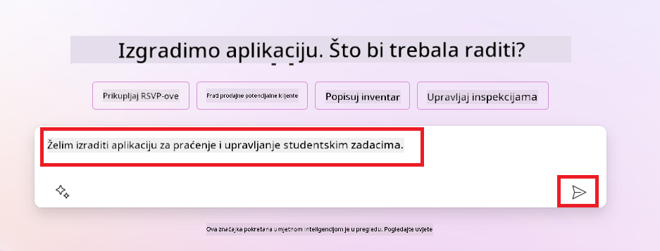
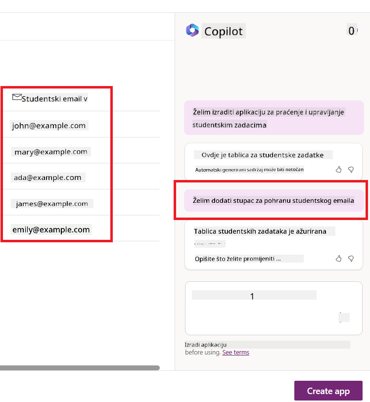
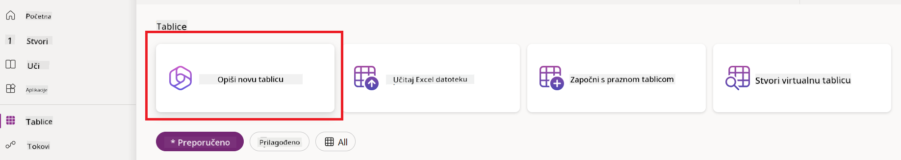
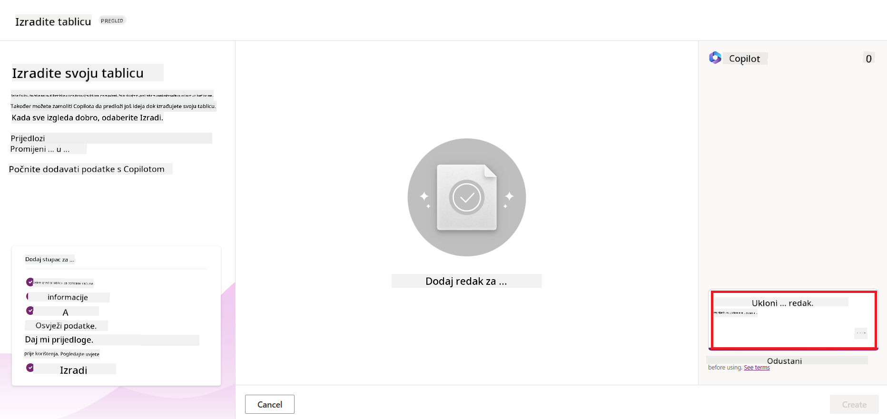
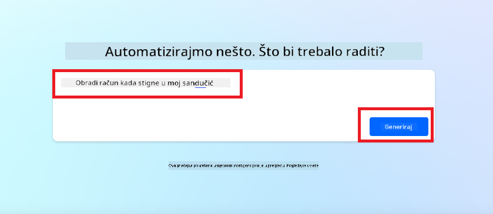

<!--
CO_OP_TRANSLATOR_METADATA:
{
  "original_hash": "846ac8e3b7dcfb697d3309fec05f0fea",
  "translation_date": "2025-10-18T01:33:04+00:00",
  "source_file": "10-building-low-code-ai-applications/README.md",
  "language_code": "hr"
}
-->
# Izrada AI aplikacija s malo koda

> _(Kliknite na sliku iznad za pregled videa ove lekcije)_

## Uvod

Sada kada smo naučili kako izraditi aplikacije za generiranje slika, razgovarajmo o konceptu malo koda. Generativna AI može se koristiti u raznim područjima, uključujući malo koda, ali što je točno malo koda i kako mu možemo dodati AI?

Izrada aplikacija i rješenja postala je jednostavnija za tradicionalne programere i ne-programere zahvaljujući platformama za razvoj s malo koda. Platforme za razvoj s malo koda omogućuju izradu aplikacija i rješenja uz minimalno ili bez pisanja koda. To se postiže pružanjem vizualnog okruženja za razvoj koje omogućuje povlačenje i ispuštanje komponenti za izradu aplikacija i rješenja. Time se omogućuje brža izrada aplikacija i rješenja uz manje resursa. U ovoj lekciji detaljno ćemo istražiti kako koristiti malo koda i kako poboljšati razvoj s malo koda pomoću AI-a koristeći Power Platform.

Power Platform pruža organizacijama priliku da osnaže svoje timove za izradu vlastitih rješenja kroz intuitivno okruženje s malo ili bez koda. Ovo okruženje pojednostavljuje proces izrade rješenja. Uz Power Platform, rješenja se mogu izraditi u danima ili tjednima umjesto mjesecima ili godinama. Power Platform sastoji se od pet ključnih proizvoda: Power Apps, Power Automate, Power BI, Power Pages i Copilot Studio.

Ova lekcija obuhvaća:

- Uvod u generativnu AI u Power Platformu
- Uvod u Copilot i kako ga koristiti
- Korištenje generativne AI za izradu aplikacija i tokova u Power Platformu
- Razumijevanje AI modela u Power Platformu s AI Builderom

## Ciljevi učenja

Na kraju ove lekcije moći ćete:

- Razumjeti kako Copilot funkcionira u Power Platformu.

- Izraditi aplikaciju za praćenje studentskih zadataka za našu obrazovnu startup tvrtku.

- Izraditi tok za obradu računa koji koristi AI za izdvajanje informacija iz računa.

- Primijeniti najbolje prakse pri korištenju GPT AI modela za stvaranje teksta.

Alati i tehnologije koje ćete koristiti u ovoj lekciji su:

- **Power Apps**, za aplikaciju za praćenje studentskih zadataka, koja pruža okruženje za razvoj s malo koda za izradu aplikacija za praćenje, upravljanje i interakciju s podacima.

- **Dataverse**, za pohranu podataka za aplikaciju za praćenje studentskih zadataka, gdje Dataverse pruža platformu za pohranu podataka s malo koda.

- **Power Automate**, za tok obrade računa gdje ćete imati okruženje za razvoj s malo koda za izradu tokova za automatizaciju procesa obrade računa.

- **AI Builder**, za AI model obrade računa gdje ćete koristiti unaprijed izrađene AI modele za obradu računa za naš startup.

## Generativna AI u Power Platformu

Poboljšanje razvoja i aplikacija s malo koda pomoću generativne AI ključno je područje fokusa za Power Platform. Cilj je omogućiti svima da izrade aplikacije, stranice, nadzorne ploče i automatiziraju procese s AI-jem, _bez potrebe za stručnim znanjem iz područja podatkovne znanosti_. Taj cilj se postiže integracijom generativne AI u iskustvo razvoja s malo koda u Power Platformu u obliku Copilota i AI Buildera.

### Kako to funkcionira?

Copilot je AI asistent koji vam omogućuje izradu rješenja u Power Platformu opisivanjem vaših zahtjeva kroz niz razgovornih koraka koristeći prirodni jezik. Na primjer, možete uputiti AI asistenta da navede koje će polja vaša aplikacija koristiti, a on će izraditi i aplikaciju i temeljni model podataka, ili možete specificirati kako postaviti tok u Power Automateu.

Funkcionalnosti vođene Copilotom možete koristiti kao značajku na ekranima vaše aplikacije kako biste omogućili korisnicima otkrivanje uvida kroz razgovorne interakcije.

AI Builder je AI mogućnost s malo koda dostupna u Power Platformu koja vam omogućuje korištenje AI modela za automatizaciju procesa i predviđanje ishoda. Uz AI Builder možete dodati AI u svoje aplikacije i tokove koji se povezuju s vašim podacima u Dataverseu ili u raznim cloud izvorima podataka, poput SharePointa, OneDrivea ili Azurea.

Copilot je dostupan u svim proizvodima Power Platforma: Power Apps, Power Automate, Power BI, Power Pages i Power Virtual Agents. AI Builder je dostupan u Power Apps i Power Automateu. U ovoj lekciji fokusirat ćemo se na korištenje Copilota i AI Buildera u Power Apps i Power Automateu za izradu rješenja za našu obrazovnu startup tvrtku.

### Copilot u Power Apps

Kao dio Power Platforma, Power Apps pruža okruženje za razvoj s malo koda za izradu aplikacija za praćenje, upravljanje i interakciju s podacima. To je skup usluga za razvoj aplikacija s skalabilnom platformom za podatke i mogućnošću povezivanja s cloud uslugama i lokalnim podacima. Power Apps omogućuje izradu aplikacija koje rade na preglednicima, tabletima i telefonima te se mogu dijeliti s kolegama. Power Apps olakšava korisnicima ulazak u razvoj aplikacija jednostavnim sučeljem, tako da svaki poslovni korisnik ili profesionalni programer može izraditi prilagođene aplikacije. Iskustvo razvoja aplikacija također je poboljšano generativnom AI kroz Copilot.

Značajka AI asistenta Copilot u Power Apps omogućuje vam da opišete kakvu aplikaciju trebate i koje informacije želite da vaša aplikacija prati, prikuplja ili prikazuje. Copilot zatim generira responzivnu Canvas aplikaciju na temelju vašeg opisa. Zatim možete prilagoditi aplikaciju prema svojim potrebama. AI Copilot također generira i predlaže Dataverse tablicu s poljima koja su vam potrebna za pohranu podataka koje želite pratiti i uzorke podataka. Kasnije ćemo u ovoj lekciji pogledati što je Dataverse i kako ga možete koristiti u Power Apps. Zatim možete prilagoditi tablicu prema svojim potrebama koristeći značajku AI Copilot asistenta kroz razgovorne korake. Ova značajka je dostupna s početnog zaslona Power Apps.

### Copilot u Power Automate

Kao dio Power Platforma, Power Automate omogućuje korisnicima izradu automatiziranih tokova između aplikacija i usluga. Pomaže automatizirati ponavljajuće poslovne procese poput komunikacije, prikupljanja podataka i odobrenja odluka. Njegovo jednostavno sučelje omogućuje korisnicima svih razina tehničke kompetencije (od početnika do iskusnih programera) da automatiziraju radne zadatke. Iskustvo razvoja tokova također je poboljšano generativnom AI kroz Copilot.

Značajka AI asistenta Copilot u Power Automate omogućuje vam da opišete kakav tok trebate i koje radnje želite da vaš tok obavlja. Copilot zatim generira tok na temelju vašeg opisa. Zatim možete prilagoditi tok prema svojim potrebama. AI Copilot također generira i predlaže radnje koje su vam potrebne za obavljanje zadatka koji želite automatizirati. Kasnije ćemo u ovoj lekciji pogledati što su tokovi i kako ih možete koristiti u Power Automateu. Zatim možete prilagoditi radnje prema svojim potrebama koristeći značajku AI Copilot asistenta kroz razgovorne korake. Ova značajka je dostupna s početnog zaslona Power Automate.

## Zadatak: Upravljanje studentskim zadacima i računima za naš startup koristeći Copilot

Naš startup pruža online tečajeve studentima. Startup je brzo rastao i sada se bori s potražnjom za svojim tečajevima. Startup vas je angažirao kao Power Platform programera kako biste im pomogli izraditi rješenje s malo koda koje će im pomoći u upravljanju studentskim zadacima i računima. Njihovo rješenje treba omogućiti praćenje i upravljanje studentskim zadacima putem aplikacije te automatizirati proces obrade računa putem toka. Zatraženo je da koristite generativnu AI za razvoj rješenja.

Kada započinjete s korištenjem Copilota, možete koristiti [Power Platform Copilot Prompt Library](https://github.com/pnp/powerplatform-prompts?WT.mc_id=academic-109639-somelezediko) za početak s promptovima. Ova biblioteka sadrži popis promptova koje možete koristiti za izradu aplikacija i tokova s Copilotom. Također možete koristiti promptove iz biblioteke kako biste dobili ideju kako opisati svoje zahtjeve Copilotu.

### Izradite aplikaciju za praćenje studentskih zadataka za naš startup

Edukatori u našem startupu imaju poteškoća s praćenjem studentskih zadataka. Koristili su proračunsku tablicu za praćenje zadataka, ali to je postalo teško upravljati kako se broj studenata povećao. Zatražili su od vas da izradite aplikaciju koja će im pomoći u praćenju i upravljanju studentskim zadacima. Aplikacija bi im trebala omogućiti dodavanje novih zadataka, pregled zadataka, ažuriranje zadataka i brisanje zadataka. Aplikacija bi također trebala omogućiti edukatorima i studentima pregled zadataka koji su ocijenjeni i onih koji nisu ocijenjeni.

Aplikaciju ćete izraditi koristeći Copilot u Power Apps slijedeći dolje navedene korake:

1. Idite na [Power Apps](https://make.powerapps.com?WT.mc_id=academic-105485-koreyst) početni zaslon.

1. Koristite tekstualno područje na početnom zaslonu za opis aplikacije koju želite izraditi. Na primjer, **_Želim izraditi aplikaciju za praćenje i upravljanje studentskim zadacima_**. Kliknite na gumb **Pošalji** kako biste poslali prompt AI Copilotu.

1. AI Copilot će predložiti Dataverse tablicu s poljima koja su vam potrebna za pohranu podataka koje želite pratiti i uzorke podataka. Zatim možete prilagoditi tablicu prema svojim potrebama koristeći značajku AI Copilot asistenta kroz razgovorne korake.

   > **Važno**: Dataverse je temeljna platforma za podatke za Power Platform. To je platforma za podatke s malo koda za pohranu podataka aplikacije. To je potpuno upravljana usluga koja sigurno pohranjuje podatke u Microsoft Cloud i dodjeljuje se unutar vašeg Power Platform okruženja. Dolazi s ugrađenim mogućnostima upravljanja podacima, poput klasifikacije podataka, podrijetla podataka, detaljne kontrole pristupa i više. Više o Dataverseu možete saznati [ovdje](https://docs.microsoft.com/powerapps/maker/data-platform/data-platform-intro?WT.mc_id=academic-109639-somelezediko).

   

1. Edukatori žele slati e-mailove studentima koji su predali svoje zadatke kako bi ih obavijestili o napretku njihovih zadataka. Možete koristiti Copilot za dodavanje novog polja u tablicu za pohranu e-mail adrese studenta. Na primjer, možete koristiti sljedeći prompt za dodavanje novog polja u tablicu: **_Želim dodati stupac za pohranu e-mail adrese studenta_**. Kliknite na gumb **Pošalji** kako biste poslali prompt AI Copilotu.

1. AI Copilot će generirati novo polje, a vi ga zatim možete prilagoditi prema svojim potrebama.

1. Kada završite s tablicom, kliknite na gumb **Izradi aplikaciju** kako biste izradili aplikaciju.

1. AI Copilot će generirati responzivnu Canvas aplikaciju na temelju vašeg opisa. Zatim možete prilagoditi aplikaciju prema svojim potrebama.

1. Kako bi edukatori mogli slati e-mailove studentima, možete koristiti Copilot za dodavanje novog ekrana u aplikaciju. Na primjer, možete koristiti sljedeći prompt za dodavanje novog ekrana u aplikaciju: **_Želim dodati ekran za slanje e-mailova studentima_**. Kliknite na gumb **Pošalji** kako biste poslali prompt AI Copilotu.

1. AI Copilot će generirati novi ekran, a vi ga zatim možete prilagoditi prema svojim potrebama.

1. Kada završite s aplikacijom, kliknite na gumb **Spremi** kako biste spremili aplikaciju.

1. Za dijeljenje aplikacije s edukatorima, kliknite na gumb **Podijeli**, a zatim ponovno kliknite na gumb **Podijeli**. Zatim možete podijeliti aplikaciju s edukatorima unosom njihovih e-mail adresa.

> **Vaša domaća zadaća**: Aplikacija koju ste upravo izradili je dobar početak, ali može se poboljšati. Uz značajku e-maila, edukatori mogu slati e-mailove studentima samo ručno, tako što moraju upisivati njihove e-mail adrese. Možete li koristiti Copilot za izradu automatizacije koja će omogućiti edukatorima da automatski šalju e-mailove studentima kada predaju svoje zadatke? Vaš savjet je da s pravim promptom možete koristiti Copilot u Power Automateu za izradu ovog.

### Izradite tablicu informacija o računima za naš startup

Financijski tim našeg startupa ima poteškoća s praćenjem računa. Koristili su proračunsku tablicu za praćenje računa, ali to je postalo teško upravljati kako se broj računa povećao. Zatražili su od vas da izradite tablicu koja će im pomoći u pohrani, praćenju i upravljanju informacijama o računima koje su primili. Tablica bi se trebala koristiti za izradu automatizacije koja će izdvojiti sve informacije o računima i pohraniti ih u tablicu. Tablica bi također trebala omogućiti financijskom timu pregled računa koji su plaćeni i onih koji nisu plaćeni.

Power Platform ima temeljnu platformu za podatke pod nazivom Dataverse koja vam omogućuje pohranu podataka za vaše aplikacije i rješenja. Dataverse pruža platformu za podatke s malo koda za pohranu podataka aplikacije. To je potpuno upravljana usluga koja sigurno pohranjuje podatke u Microsoft Cloud i dodjeljuje se unutar vašeg Power Platform okruženja. Dolazi s ugrađenim mogućnostima upravljanja podacima, poput klasifikacije podataka, podrijetla podataka, detaljne kontrole pristupa i više. Više o Dataverseu možete saznati [ovdje](https://docs.microsoft.com/powerapps/maker/data-platform/data-platform-intro?WT.mc_id=academic-109639-somelezediko).
Zašto bismo trebali koristiti Dataverse za naš startup? Standardne i prilagođene tablice unutar Dataverse-a pružaju sigurno i cloud-based rješenje za pohranu vaših podataka. Tablice vam omogućuju pohranu različitih vrsta podataka, slično kao što biste koristili više radnih listova u jednoj Excel radnoj knjizi. Možete koristiti tablice za pohranu podataka specifičnih za potrebe vaše organizacije ili poslovanja. Neke od prednosti koje naš startup može dobiti korištenjem Dataverse-a uključuju, ali nisu ograničene na:

- **Jednostavno upravljanje**: Metapodaci i podaci pohranjeni su u oblaku, tako da ne morate brinuti o detaljima kako su pohranjeni ili upravljani. Možete se usredotočiti na izradu svojih aplikacija i rješenja.

- **Sigurnost**: Dataverse pruža sigurno i cloud-based rješenje za pohranu vaših podataka. Možete kontrolirati tko ima pristup podacima u vašim tablicama i kako ih može pristupiti koristeći sigurnost temeljenu na ulogama.

- **Bogati metapodaci**: Tipovi podataka i odnosi koriste se izravno unutar Power Apps.

- **Logika i validacija**: Možete koristiti poslovna pravila, izračunata polja i pravila validacije za provođenje poslovne logike i održavanje točnosti podataka.

Sada kada znate što je Dataverse i zašto biste ga trebali koristiti, pogledajmo kako možete koristiti Copilot za kreiranje tablice u Dataverse-u koja će zadovoljiti zahtjeve našeg financijskog tima.

> **Note**: Ovu tablicu ćete koristiti u sljedećem odjeljku za izradu automatizacije koja će izvući sve informacije o računima i pohraniti ih u tablicu.

Za kreiranje tablice u Dataverse-u pomoću Copilot-a, slijedite korake u nastavku:

1. Idite na početnu stranicu [Power Apps](https://make.powerapps.com?WT.mc_id=academic-105485-koreyst).

2. Na lijevoj navigacijskoj traci odaberite **Tables** i zatim kliknite na **Describe the new Table**.

3. Na ekranu **Describe the new Table**, koristite tekstualno polje za opisivanje tablice koju želite kreirati. Na primjer, **_Želim kreirati tablicu za pohranu informacija o računima_**. Kliknite na gumb **Send** kako biste poslali upit AI Copilot-u.

4. AI Copilot će predložiti Dataverse tablicu s poljima koja su vam potrebna za pohranu podataka koje želite pratiti i uzorke podataka. Zatim možete prilagoditi tablicu prema svojim potrebama koristeći značajku AI Copilot asistenta kroz razgovorne korake.

5. Financijski tim želi poslati e-mail dobavljaču kako bi ga obavijestio o trenutnom statusu njegovog računa. Možete koristiti Copilot za dodavanje novog polja u tablicu za pohranu e-maila dobavljača. Na primjer, možete koristiti sljedeći upit za dodavanje novog polja u tablicu: **_Želim dodati stupac za pohranu e-maila dobavljača_**. Kliknite na gumb **Send** kako biste poslali upit AI Copilot-u.

6. AI Copilot će generirati novo polje, a zatim ga možete prilagoditi prema svojim potrebama.

7. Kada završite s tablicom, kliknite na gumb **Create** kako biste kreirali tablicu.

## AI modeli u Power Platformi s AI Builder-om

AI Builder je low-code AI mogućnost dostupna u Power Platformi koja vam omogućuje korištenje AI modela za automatizaciju procesa i predviđanje ishoda. S AI Builder-om možete unijeti AI u svoje aplikacije i tokove koji se povezuju s vašim podacima u Dataverse-u ili u raznim cloud izvorima podataka, kao što su SharePoint, OneDrive ili Azure.

## Unaprijed izrađeni AI modeli vs Prilagođeni AI modeli

AI Builder pruža dvije vrste AI modela: unaprijed izrađene AI modele i prilagođene AI modele. Unaprijed izrađeni AI modeli su spremni za korištenje i trenirani od strane Microsoft-a te su dostupni u Power Platformi. Oni vam pomažu dodati inteligenciju vašim aplikacijama i tokovima bez potrebe za prikupljanjem podataka, izradom, treniranjem i objavljivanjem vlastitih modela. Možete koristiti ove modele za automatizaciju procesa i predviđanje ishoda.

Neki od unaprijed izrađenih AI modela dostupnih u Power Platformi uključuju:

- **Ekstrakcija ključnih fraza**: Ovaj model izvlači ključne fraze iz teksta.
- **Detekcija jezika**: Ovaj model detektira jezik teksta.
- **Analiza sentimenta**: Ovaj model detektira pozitivan, negativan, neutralan ili miješan sentiment u tekstu.
- **Čitač poslovnih kartica**: Ovaj model izvlači informacije s poslovnih kartica.
- **Prepoznavanje teksta**: Ovaj model izvlači tekst iz slika.
- **Detekcija objekata**: Ovaj model detektira i izvlači objekte iz slika.
- **Obrada dokumenata**: Ovaj model izvlači informacije iz obrazaca.
- **Obrada računa**: Ovaj model izvlači informacije iz računa.

S prilagođenim AI modelima možete unijeti vlastiti model u AI Builder kako bi funkcionirao kao bilo koji prilagođeni AI Builder model, omogućujući vam treniranje modela koristeći vlastite podatke. Možete koristiti ove modele za automatizaciju procesa i predviđanje ishoda u Power Apps i Power Automate. Kada koristite vlastiti model, postoje ograničenja koja se primjenjuju. Više o tim [ograničenjima](https://learn.microsoft.com/ai-builder/byo-model#limitations?WT.mc_id=academic-105485-koreyst).

## Zadatak #2 - Izradite tok za obradu računa za naš startup

Financijski tim ima poteškoća s obradom računa. Koristili su proračunsku tablicu za praćenje računa, ali to je postalo teško upravljati kako se broj računa povećao. Zamolili su vas da izradite tok koji će im pomoći u obradi računa koristeći AI. Tok bi trebao omogućiti izvlačenje informacija iz računa i pohranu tih informacija u Dataverse tablicu. Tok bi također trebao omogućiti slanje e-maila financijskom timu s izvučenim informacijama.

Sada kada znate što je AI Builder i zašto biste ga trebali koristiti, pogledajmo kako možete koristiti AI model za obradu računa u AI Builder-u, koji smo ranije pokrili, za izradu toka koji će pomoći financijskom timu u obradi računa.

Za izradu toka koji će pomoći financijskom timu u obradi računa koristeći AI model za obradu računa u AI Builder-u, slijedite korake u nastavku:

1. Idite na početnu stranicu [Power Automate](https://make.powerautomate.com?WT.mc_id=academic-105485-koreyst).

2. Koristite tekstualno polje na početnoj stranici za opisivanje toka koji želite izraditi. Na primjer, **_Obradi račun kada stigne u moj inbox_**. Kliknite na gumb **Send** kako biste poslali upit AI Copilot-u.

   

3. AI Copilot će predložiti radnje koje su vam potrebne za obavljanje zadatka koji želite automatizirati. Možete kliknuti na gumb **Next** kako biste prošli kroz sljedeće korake.

4. U sljedećem koraku, Power Automate će vas zatražiti da postavite potrebne veze za tok. Kada završite, kliknite na gumb **Create flow** kako biste kreirali tok.

5. AI Copilot će generirati tok, a zatim ga možete prilagoditi prema svojim potrebama.

6. Ažurirajte okidač toka i postavite **Folder** na mapu gdje će računi biti pohranjeni. Na primjer, možete postaviti mapu na **Inbox**. Kliknite na **Show advanced options** i postavite **Only with Attachments** na **Yes**. Ovo će osigurati da tok radi samo kada e-mail s privitkom stigne u mapu.

7. Uklonite sljedeće radnje iz toka: **HTML to text**, **Compose**, **Compose 2**, **Compose 3** i **Compose 4** jer ih nećete koristiti.

8. Uklonite radnju **Condition** iz toka jer je nećete koristiti. Trebalo bi izgledati kao na sljedećem screenshotu:

   

9. Kliknite na gumb **Add an action** i potražite **Dataverse**. Odaberite radnju **Add a new row**.

10. Na radnji **Extract Information from invoices**, ažurirajte **Invoice File** kako bi pokazivao na **Attachment Content** iz e-maila. Ovo će osigurati da tok izvlači informacije iz privitka računa.

11. Odaberite **Table** koju ste ranije kreirali. Na primjer, možete odabrati tablicu **Invoice Information**. Odaberite dinamički sadržaj iz prethodne radnje kako biste popunili sljedeća polja:

    - ID
    - Iznos
    - Datum
    - Naziv
    - Status - Postavite **Status** na **Pending**.
    - E-mail dobavljača - Koristite **From** dinamički sadržaj iz okidača **When a new email arrives**.

    

12. Kada završite s tokom, kliknite na gumb **Save** kako biste spremili tok. Zatim možete testirati tok slanjem e-maila s računom u mapu koju ste odredili u okidaču.

> **Vaša domaća zadaća**: Tok koji ste upravo izradili je dobar početak, sada trebate razmisliti o tome kako možete izraditi automatizaciju koja će omogućiti našem financijskom timu da pošalje e-mail dobavljaču kako bi ga obavijestio o trenutnom statusu njegovog računa. Vaš savjet: tok mora raditi kada se status računa promijeni.

## Koristite AI model za generiranje teksta u Power Automate-u

AI model Create Text with GPT u AI Builder-u omogućuje vam generiranje teksta na temelju upita i pokreće ga Microsoft Azure OpenAI Service. S ovom mogućnošću možete integrirati GPT (Generative Pre-Trained Transformer) tehnologiju u svoje aplikacije i tokove kako biste izradili razne automatizirane tokove i aplikacije s uvidima.

GPT modeli prolaze kroz opsežnu obuku na velikim količinama podataka, omogućujući im da proizvode tekst koji vrlo nalikuje ljudskom jeziku kada im se pruži upit. Kada se integriraju s automatizacijom tokova, AI modeli poput GPT-a mogu se iskoristiti za pojednostavljenje i automatizaciju širokog spektra zadataka.

Na primjer, možete izraditi tokove za automatsko generiranje teksta za razne svrhe, kao što su: nacrti e-mailova, opisi proizvoda i drugo. Također možete koristiti model za generiranje teksta za razne aplikacije, kao što su chatbotovi i aplikacije za korisničku podršku koje omogućuju agentima korisničke podrške da učinkovito i efikasno odgovaraju na upite korisnika.

Kako biste naučili kako koristiti ovaj AI model u Power Automate-u, pogledajte modul [Dodavanje inteligencije s AI Builder-om i GPT](https://learn.microsoft.com/training/modules/ai-builder-text-generation/?WT.mc_id=academic-109639-somelezediko).

## Odlično obavljeno! Nastavite učiti

Nakon što završite ovu lekciju, pogledajte našu [Generative AI Learning kolekciju](https://aka.ms/genai-collection?WT.mc_id=academic-105485-koreyst) kako biste nastavili unapređivati svoje znanje o generativnoj umjetnoj inteligenciji!

Prijeđite na Lekciju 11 gdje ćemo pogledati kako [integrirati generativnu umjetnu inteligenciju s pozivanjem funkcija](../11-integrating-with-function-calling/README.md?WT.mc_id=academic-105485-koreyst)!

---

**Odricanje od odgovornosti**:  
Ovaj dokument je preveden pomoću AI usluge za prevođenje [Co-op Translator](https://github.com/Azure/co-op-translator). Iako nastojimo osigurati točnost, imajte na umu da automatski prijevodi mogu sadržavati pogreške ili netočnosti. Izvorni dokument na izvornom jeziku treba smatrati autoritativnim izvorom. Za ključne informacije preporučuje se profesionalni prijevod od strane čovjeka. Ne preuzimamo odgovornost za nesporazume ili pogrešna tumačenja koja proizlaze iz korištenja ovog prijevoda.